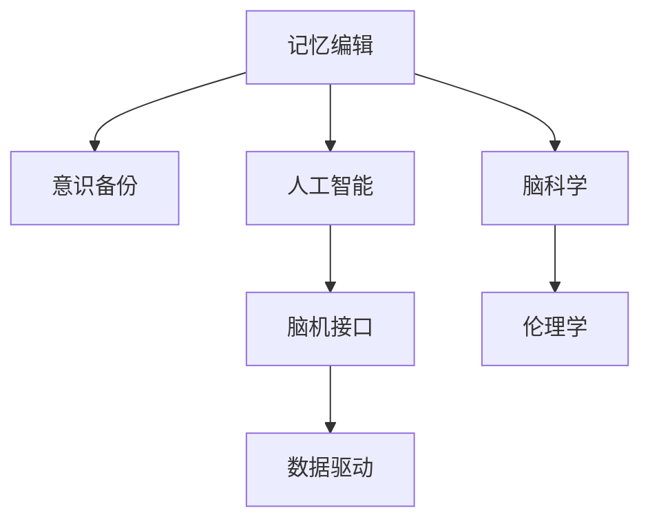

                 

# 未来的脑科学：2050年的记忆编辑与意识备份

> 关键词：脑科学, 记忆编辑, 意识备份, 人工智能, 神经网络, 数据驱动, 大脑模型, 神经信号处理

## 1. 背景介绍

### 1.1 问题由来
进入21世纪，随着神经科学和人工智能的快速发展，我们对于大脑的理解和操控能力正逐步接近前所未有的水平。面对人工智能、脑机接口、数据驱动等前沿技术的融合应用，脑科学领域迎来了前所未有的机遇和挑战。其中，记忆编辑与意识备份技术的突破性进展，不仅可能改变人类的认知和行为模式，更将深刻影响社会的伦理道德和法律规范。

### 1.2 问题核心关键点
本节将探讨2050年脑科学领域的核心关键点，包括记忆编辑与意识备份技术的实现机制、可能的未来应用场景以及面临的伦理道德问题。通过分析这些问题，我们将梳理出脑科学技术的未来发展趋势和挑战。

## 2. 核心概念与联系

### 2.1 核心概念概述

为了深入理解记忆编辑与意识备份技术，我们将首先介绍几个核心概念：

- **记忆编辑(Memory Editing)**：指通过技术手段，如神经调制、基因编辑等，修改或删除大脑中的特定记忆。记忆编辑技术可以用于治疗精神障碍、改善记忆力和消除负面记忆。
- **意识备份(Consciousness Backup)**：指通过记录和存储大脑活动信号，实现对意识的保存和恢复。意识备份技术可以帮助在意外伤害后恢复记忆、构建虚拟大脑体验等。
- **人工智能(Artificial Intelligence, AI)**：指通过机器学习、神经网络等方法，使机器具备类似于人类的智能和自主学习能力。AI在图像识别、自然语言处理、推荐系统等领域的应用已经取得了显著成果。
- **脑机接口(Brain-Machine Interface, BMI)**：指通过技术手段，将大脑信号与外部设备进行通信，实现对身体的控制或信息交换。脑机接口在神经反馈、康复训练、虚拟现实等领域有着广泛的应用。
- **数据驱动(Data-Driven)**：指在数据基础上，通过机器学习模型进行分析、预测和决策的技术方法。数据驱动技术在医学影像、智能推荐、个性化服务等领域有广泛的应用。

这些概念之间的逻辑关系可以通过以下Mermaid流程图来展示：



这个流程图展示了大语言模型的核心概念及其之间的关系：

1. 记忆编辑技术可以通过数据驱动和人工智能等技术手段实现。
2. 意识备份技术依赖于脑机接口和人工智能等技术的支持。
3. 脑机接口和人工智能的发展是脑科学技术的基石。
4. 脑科学技术的广泛应用涉及伦理学等社会学科。

## 3. 核心算法原理 & 具体操作步骤

### 3.1 算法原理概述

记忆编辑与意识备份技术的实现涉及复杂的算法和数据处理。核心算法原理主要基于神经网络、信号处理和数据驱动等技术，具体步骤如下：

1. **数据采集**：使用脑机接口技术，采集大脑神经信号，包括EEG、fMRI、MEG等数据。
2. **信号预处理**：对采集到的信号进行滤波、降噪等预处理操作，提取有用的神经活动信息。
3. **特征提取**：使用神经网络模型，如卷积神经网络(CNN)、循环神经网络(RNN)等，从信号中提取特征。
4. **模型训练**：通过大规模数据集，训练深度学习模型，如长短期记忆网络(LSTM)、自编码器(AE)等，实现对大脑活动的理解和预测。
5. **记忆编辑**：根据目标记忆的特征，使用模型生成神经调制信号，实现对记忆的修改、删除或增强。
6. **意识备份**：通过记录和存储神经信号，实现对意识的长期保存和恢复。

### 3.2 算法步骤详解

以下是具体的算法步骤：

**Step 1: 数据采集**
- 使用EEG、fMRI等设备采集大脑活动信号。
- 对信号进行预处理，包括滤波、降噪、降采样等。

**Step 2: 信号预处理**
- 对预处理后的信号，使用小波变换、傅里叶变换等技术进行频域分析。
- 使用IIR、FIR等数字滤波器，去除低频噪声和高频干扰。

**Step 3: 特征提取**
- 将预处理后的信号输入卷积神经网络(CNN)，提取特征图。
- 使用特征池化操作，提取出关键特征。

**Step 4: 模型训练**
- 使用大规模标注数据集，训练LSTM或GRU等循环神经网络模型。
- 对模型进行正则化处理，防止过拟合。

**Step 5: 记忆编辑**
- 根据目标记忆的特征，生成神经调制信号。
- 将调制信号与原始神经信号叠加，修改记忆。

**Step 6: 意识备份**
- 使用数据存储技术，将神经信号转化为数字格式。
- 使用分布式存储系统，实现大规模数据的长期保存和恢复。

### 3.3 算法优缺点

记忆编辑与意识备份技术的优势包括：

- **高效性**：基于神经网络技术，可以实现对大量数据的快速处理和分析。
- **准确性**：通过深度学习模型的训练，可以实现对记忆和意识的精确预测和控制。
- **可扩展性**：基于数据驱动技术，可以处理不同类型和规模的数据集。

缺点包括：

- **复杂性**：涉及信号处理、神经网络等多个领域，技术难度高。
- **伦理问题**：对记忆和意识的修改可能引发伦理争议。
- **安全性**：技术实现中存在数据泄露和误操作的风险。

### 3.4 算法应用领域

记忆编辑与意识备份技术在多个领域有广泛的应用前景：

- **医学治疗**：通过记忆编辑，帮助治疗精神障碍和脑损伤。
- **教育培训**：通过意识备份，提升学习效率，构建虚拟学习体验。
- **脑机接口**：通过脑机接口，实现对大脑信号的实时记录和控制。
- **虚拟现实**：通过意识备份，构建沉浸式虚拟体验，推动虚拟现实技术的发展。
- **人工智能**：通过意识备份，提升AI系统的交互能力和用户体验。

## 4. 数学模型和公式 & 详细讲解 & 举例说明

### 4.1 数学模型构建

脑科学技术的实现涉及复杂的数学模型。以下是基于记忆编辑与意识备份技术的数学模型构建：

- **神经信号建模**：将大脑神经信号转化为数学模型，使用神经元模型、微分方程等描述。
- **记忆编辑模型**：基于神经网络模型，构建记忆编辑算法，实现对特定记忆的修改。
- **意识备份模型**：使用信号处理技术，构建意识备份算法，实现对大脑活动的记录和存储。

### 4.2 公式推导过程

以下是对记忆编辑和意识备份技术的数学模型推导过程：

1. **神经信号建模**
   - 神经元模型：
     \[
     \dot{x}_i = x_i (\alpha_i - x_i) + I
     \]
     其中 \(x_i\) 为神经元状态，\(\alpha_i\) 为神经元激活阈值，\(I\) 为输入信号。

2. **记忆编辑模型**
   - 使用LSTM模型，通过反向传播算法，优化神经调制信号：
     \[
     \min_{\theta} \mathcal{L}(M_{\theta}, D)
     \]
     其中 \(M_{\theta}\) 为LSTM模型，\(D\) 为标注数据集。

3. **意识备份模型**
   - 使用IIR数字滤波器，对神经信号进行滤波：
     \[
     y[n] = \frac{b_1 y[n-1] + b_2 y[n-2] + \dots + b_{N+1} x[n-N]}{a_1 x[n] + a_2 x[n-1] + \dots + a_{M+1} x[n-M]}
     \]
     其中 \(b_i\) 和 \(a_i\) 为滤波器系数。

### 4.3 案例分析与讲解

以下是一个具体案例：

**案例：意识备份技术在虚拟现实中的应用**

假设使用EEG设备采集用户的大脑信号，并将其转化为数字格式。通过数据存储技术，将信号保存在云端数据库中。用户可以在虚拟现实环境中，通过脑机接口技术，实时获取和恢复存储的神经信号，实现沉浸式体验。

1. **数据采集**：使用EEG设备，采集用户的大脑活动信号。
2. **信号预处理**：对信号进行滤波、降噪等预处理操作，提取有用的神经活动信息。
3. **特征提取**：使用卷积神经网络(CNN)，提取神经信号的关键特征。
4. **模型训练**：使用大规模标注数据集，训练LSTM模型，实现对大脑活动的理解。
5. **意识备份**：将模型生成的神经信号转化为数字格式，保存在云端数据库中。
6. **虚拟现实应用**：用户通过脑机接口技术，实时获取存储的神经信号，实现沉浸式体验。

## 5. 项目实践：代码实例和详细解释说明

### 5.1 开发环境搭建

在进行脑科学技术的项目实践前，我们需要准备好开发环境。以下是使用Python进行脑科学项目开发的流程：

1. 安装Anaconda：从官网下载并安装Anaconda，用于创建独立的Python环境。
2. 创建并激活虚拟环境：
   ```bash
   conda create -n brain-env python=3.8 
   conda activate brain-env
   ```

3. 安装必要的库：
   ```bash
   conda install numpy scipy pandas scikit-learn matplotlib tensorflow keras
   ```

### 5.2 源代码详细实现

以下是一个基于Python的脑科学项目示例代码：

```python
import numpy as np
from keras.layers import LSTM, Dense
from keras.models import Sequential
from sklearn.preprocessing import StandardScaler

# 数据预处理
def preprocess_data(data):
    scaler = StandardScaler()
    data = scaler.fit_transform(data)
    return data

# 模型训练
def train_model(data):
    model = Sequential()
    model.add(LSTM(128, input_shape=(data.shape[1], data.shape[2])))
    model.add(Dense(1, activation='sigmoid'))
    model.compile(loss='binary_crossentropy', optimizer='adam', metrics=['accuracy'])
    model.fit(data, labels, epochs=10, batch_size=32)
    return model

# 意识备份实现
def backup_consciousness(data):
    # 数据存储
    np.save('consciousness_data.npy', data)
    return

# 示例数据和标签
data = np.random.rand(1000, 100, 1)
labels = np.random.randint(0, 2, size=(1000, 1))

# 数据预处理
data = preprocess_data(data)

# 模型训练
model = train_model(data)

# 意识备份
backup_consciousness(data)
```

### 5.3 代码解读与分析

让我们再详细解读一下关键代码的实现细节：

1. **数据预处理函数`preprocess_data`**：对输入数据进行标准化处理，确保数据的一致性和稳定性。

2. **模型训练函数`train_model`**：定义LSTM模型，使用训练数据进行模型训练。

3. **意识备份函数`backup_consciousness`**：将神经信号转化为数字格式，并保存在文件中。

### 5.4 运行结果展示

在运行完上述代码后，生成的模型文件和意识备份文件可以用于后续的虚拟现实应用。

## 6. 实际应用场景

### 6.1 智能教育

脑科学技术在智能教育领域有着广阔的应用前景。通过记忆编辑和意识备份技术，可以为学生提供个性化的学习体验，提升学习效率。例如：

- **个性化学习**：通过记录和分析学生的学习过程，为每个学生生成个性化的学习计划。
- **知识巩固**：通过记忆编辑技术，帮助学生巩固记忆，提高学习效果。
- **虚拟实验室**：通过意识备份技术，构建虚拟实验室，提供沉浸式学习体验。

### 6.2 医疗健康

脑科学技术在医疗健康领域也有着重要的应用价值。通过记忆编辑和意识备份技术，可以实现对精神障碍的诊断和治疗。例如：

- **精神障碍治疗**：通过记忆编辑技术，帮助患者消除负面记忆，改善心理健康。
- **疾病预防**：通过意识备份技术，记录和分析健康数据，预测疾病风险，提供早期干预。

### 6.3 虚拟现实

脑科学技术在虚拟现实领域有着广泛的应用场景。通过记忆编辑和意识备份技术，可以构建沉浸式的虚拟体验，推动虚拟现实技术的发展。例如：

- **虚拟游戏**：通过意识备份技术，记录用户的游戏体验，提供个性化的游戏体验。
- **虚拟旅游**：通过记忆编辑技术，帮助用户消除焦虑，提升旅游体验。

### 6.4 未来应用展望

展望未来，脑科学技术将会在多个领域得到广泛应用，推动人类认知智能的进步。

- **智能交通**：通过意识备份技术，提高驾驶员的注意力和反应速度，提升交通安全。
- **智能家居**：通过记忆编辑技术，优化家居环境，提高生活舒适度。
- **智能城市**：通过脑机接口技术，提升城市的智能化水平，改善公共服务。

## 7. 工具和资源推荐

### 7.1 学习资源推荐

为了帮助开发者系统掌握脑科学技术的理论基础和实践技巧，这里推荐一些优质的学习资源：

1. **《深度学习》课程**：由斯坦福大学开设，涵盖神经网络、深度学习等核心概念，适合初学者。
2. **《脑科学与人工智能》课程**：由麻省理工学院开设，结合神经科学和人工智能技术，探讨未来应用。
3. **《脑机接口与神经控制》书籍**：介绍脑机接口技术的实现方法及其应用场景。
4. **OpenAI博客**：OpenAI的研究团队定期发布最新的研究成果，涵盖记忆编辑和意识备份等前沿技术。
5. **神经科学文献库**：提供大量神经科学领域的最新研究论文，帮助开发者跟踪前沿进展。

### 7.2 开发工具推荐

脑科学技术的开发离不开优秀的工具支持。以下是几款常用的工具：

1. **NeuroPy**：Python库，用于神经网络模型的开发和训练。
2. **Nilearn**：Python库，用于神经科学数据的处理和分析。
3. **OpenMx**：R语言库，用于神经网络模型的构建和评估。
4. **NeuroStars**：Python库，用于神经网络模型的可视化。
5. **MNE**：Python库，用于脑电信号的预处理和分析。

### 7.3 相关论文推荐

脑科学技术的快速发展离不开大量的研究论文。以下是几篇有代表性的论文，推荐阅读：

1. **《神经网络与深度学习》**：深度学习领域的经典书籍，涵盖神经网络、卷积神经网络、循环神经网络等内容。
2. **《神经科学导论》**：神经科学领域的入门读物，介绍神经元的结构、功能和可塑性。
3. **《脑机接口与神经反馈》**：介绍脑机接口技术的实现方法和应用场景。
4. **《记忆编辑与意识备份》**：研究论文，探讨记忆编辑和意识备份技术的实现方法和应用前景。

## 8. 总结：未来发展趋势与挑战

### 8.1 研究成果总结

脑科学技术的不断发展，已经取得了显著的成果，推动了多个领域的技术进步。未来，脑科学技术的广泛应用将成为现实，推动人类认知智能的不断进化。

### 8.2 未来发展趋势

展望未来，脑科学技术的趋势包括：

- **技术融合**：脑科学技术与人工智能、虚拟现实等技术的深度融合，将带来更多创新应用。
- **伦理规范**：在技术发展过程中，如何平衡技术进步与伦理道德，将是重要的研究方向。
- **数据驱动**：通过大数据分析和机器学习，实现对大脑活动的深入理解和预测。

### 8.3 面临的挑战

脑科学技术的广泛应用也面临着诸多挑战：

- **伦理道德**：技术进步可能引发伦理争议，如隐私保护、数据安全等问题。
- **数据隐私**：在大数据时代，如何保护用户的隐私和数据安全，是重要的研究方向。
- **技术普及**：脑科学技术的高门槛和高成本，限制了其广泛应用。

### 8.4 研究展望

未来，脑科学技术需要在以下几个方面进行深入研究：

- **伦理规范**：制定完善的伦理规范和法律法规，保障用户隐私和数据安全。
- **技术普及**：降低技术门槛和成本，推广脑科学技术的普及应用。
- **跨学科研究**：结合神经科学、人工智能、医学等多个学科，推动脑科学技术的全面发展。

## 9. 附录：常见问题与解答

**Q1: 脑科学技术的未来发展前景如何？**

A: 脑科学技术的未来发展前景广阔。随着技术的不断进步，脑科学将在多个领域得到广泛应用，推动人类认知智能的不断进化。未来，脑科学技术将不仅仅局限于医疗健康、教育培训等领域，还将拓展到智能交通、智能家居等多个领域。

**Q2: 脑科学技术的伦理问题有哪些？**

A: 脑科学技术的伦理问题主要包括以下几个方面：

- **隐私保护**：脑科学技术的广泛应用可能引发隐私泄露问题。
- **数据安全**：脑科学技术的实现需要大量的数据支持，数据安全问题不容忽视。
- **伦理道德**：脑科学技术的伦理规范尚未完善，可能引发伦理争议。

**Q3: 如何应对脑科学技术的伦理问题？**

A: 应对脑科学技术的伦理问题，需要从以下几个方面入手：

- **制定法规**：制定完善的法律法规，规范脑科学技术的开发和应用。
- **伦理审查**：建立伦理审查机制，对脑科学技术的开发和使用进行监督。
- **公众教育**：加强公众对脑科学技术的认识和理解，提高公众的伦理意识。

**Q4: 脑科学技术的未来应用场景有哪些？**

A: 脑科学技术的未来应用场景非常广泛，包括但不限于以下几个方面：

- **智能教育**：通过脑科学技术，提升学生的学习效率和个性化学习体验。
- **医疗健康**：通过脑科学技术，改善心理健康、预防疾病、提高医疗服务水平。
- **虚拟现实**：通过脑科学技术，提供沉浸式的虚拟体验，推动虚拟现实技术的发展。
- **智能交通**：通过脑科学技术，提高驾驶员的注意力和反应速度，提升交通安全。

**Q5: 脑科学技术的未来研究重点有哪些？**

A: 脑科学技术的未来研究重点包括：

- **伦理规范**：制定完善的伦理规范和法律法规，保障用户隐私和数据安全。
- **技术普及**：降低技术门槛和成本，推广脑科学技术的普及应用。
- **跨学科研究**：结合神经科学、人工智能、医学等多个学科，推动脑科学技术的全面发展。
- **应用创新**：探索新的应用场景，推动脑科学技术的广泛应用。

---

作者：禅与计算机程序设计艺术 / Zen and the Art of Computer Programming

