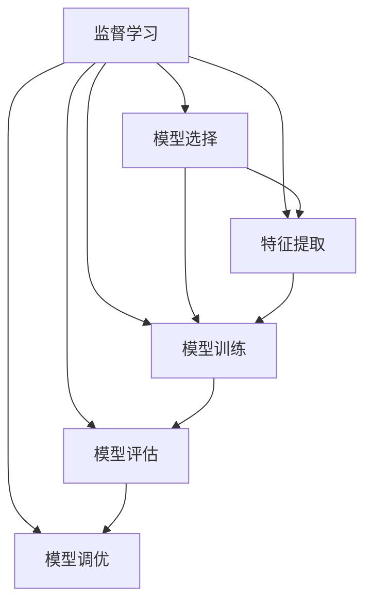

                 

# 机器学习 原理与代码实例讲解

## 1. 背景介绍

### 1.1 问题由来
机器学习作为人工智能的核心分支，其基本思想是通过大量数据训练模型，使模型能够自动学习输入数据的特征，并进行预测或分类等任务。在过去几十年中，机器学习理论和技术经历了快速发展，广泛应用于图像识别、自然语言处理、推荐系统、金融预测等领域，极大地推动了科技进步和社会发展。

近年来，随着深度学习技术的突破，机器学习领域进一步扩展，应用于更复杂的非线性模型和高维数据的处理。然而，许多机器学习初学者在理解基本概念、构建模型和进行实际应用时，往往感到困惑和困难。为帮助广大开发者更好地掌握机器学习的原理和应用，本文将从基础概念出发，通过具体的代码实例，深入浅出地讲解机器学习的基本原理、算法流程及其实现细节。

### 1.2 问题核心关键点
机器学习包括监督学习(Supervised Learning)、无监督学习(Unsupervised Learning)和强化学习(Reinforcement Learning)等主要范式。其中，监督学习是最常见和最基础的一种学习方式，通过使用已标注的训练数据，训练模型进行预测或分类任务。本文重点关注监督学习，介绍其原理、常用算法和实际应用。

## 2. 核心概念与联系

### 2.1 核心概念概述

为更好理解机器学习的核心概念，本节将介绍几个关键概念及其相互联系：

- 监督学习(Supervised Learning)：通过已标注的数据集，训练模型进行预测或分类任务。其中，输入数据和标签为已知的，模型的目标是学习输入与输出之间的映射关系。
- 无监督学习(Unsupervised Learning)：使用未标注的数据集，训练模型进行数据降维、聚类、关联规则等任务。模型通过数据的内在结构自行发现规律。
- 强化学习(Reinforcement Learning)：通过与环境的交互，模型根据奖励信号进行动作选择，最终目标是最大化累计奖励。广泛应用于游戏AI、机器人控制等领域。
- 特征提取(Feature Extraction)：从原始数据中提取有用的特征表示，以供模型学习。特征提取通常通过手工设计或自动学习。
- 模型选择(Model Selection)：根据具体任务需求，选择合适的模型。常见的监督学习模型包括线性回归、逻辑回归、支持向量机、决策树、随机森林、神经网络等。
- 模型训练(Model Training)：通过迭代优化算法，训练模型使其最小化预测误差。常用的训练算法包括梯度下降、随机梯度下降、Adam等。
- 模型评估(Model Evaluation)：通过评估指标，如精度、召回率、F1分数、ROC曲线等，评估模型在未见数据上的泛化性能。
- 模型调优(Model Tuning)：通过调整超参数，如学习率、正则化系数、批次大小等，优化模型性能。

这些核心概念之间的逻辑关系可以通过以下Mermaid流程图来展示：



该流程图展示了机器学习的核心概念及其相互关系：

1. 监督学习通过特征提取得到输入数据，选择合适模型，并进行训练和调优，最终评估模型性能。
2. 特征提取通过手工设计或自动学习方式，从原始数据中提取有用的特征。
3. 模型选择根据具体任务需求，选择合适的模型。
4. 模型训练通过迭代优化算法，最小化预测误差。
5. 模型评估通过评估指标，评估模型泛化性能。
6. 模型调优通过调整超参数，优化模型性能。

这些概念共同构成了机器学习的学习框架，使其能够在各种场景下发挥强大的预测和分类能力。通过理解这些核心概念，我们可以更好地把握机器学习的学习原理和优化方向。

## 3. 核心算法原理 & 具体操作步骤

### 3.1 算法原理概述

监督学习的核心思想是通过已标注的数据集，训练模型进行预测或分类任务。其基本流程包括以下几个步骤：

1. **特征提取**：将原始数据转换为模型的输入特征，通常通过手工设计或自动学习。
2. **模型选择**：选择合适的模型，根据任务需求和数据特点进行决定。
3. **模型训练**：通过迭代优化算法，训练模型使其最小化预测误差。
4. **模型评估**：通过评估指标，如精度、召回率、F1分数、ROC曲线等，评估模型在未见数据上的泛化性能。
5. **模型调优**：通过调整超参数，优化模型性能。

### 3.2 算法步骤详解

#### 3.2.1 数据预处理

在机器学习模型训练之前，需要对数据进行预处理，以确保数据质量和一致性。数据预处理包括以下几个步骤：

1. **数据清洗**：去除噪声和异常值，确保数据的一致性和准确性。
2. **数据归一化**：将数据缩放到某个固定范围内，如[0, 1]或[-1, 1]。
3. **数据增强**：通过旋转、翻转、裁剪等方式，增加数据多样性。
4. **特征缩放**：对特征进行标准化或归一化处理，提高模型训练效率。

#### 3.2.2 模型选择

根据具体任务需求和数据特点，选择合适的模型。以下是几种常用的监督学习模型：

1. **线性回归**：用于预测连续变量，模型形式为 $y = w_0 + \sum_{i=1}^n w_i x_i$，其中 $w$ 为权重，$x$ 为输入特征，$y$ 为预测值。
2. **逻辑回归**：用于二分类任务，模型形式为 $\log\left(\frac{p}{1-p}\right) = w_0 + \sum_{i=1}^n w_i x_i$，其中 $p$ 为预测概率，$w$ 为权重，$x$ 为输入特征。
3. **支持向量机(SVM)**：用于分类和回归任务，通过构造最大边界超平面，将数据分割为不同的类别或预测值。
4. **决策树**：通过树形结构进行分类或回归任务，每个节点表示一个特征，每个叶子节点表示一个分类或预测值。
5. **随机森林**：由多个决策树组成的集成模型，通过投票或平均方式进行预测或分类。
6. **神经网络**：通过多层非线性映射进行复杂非线性任务，每个节点表示一个特征，每个层表示一个变换。

#### 3.2.3 模型训练

模型训练是监督学习的核心步骤，通过迭代优化算法，最小化预测误差。常用的训练算法包括梯度下降、随机梯度下降、Adam等。以下是使用梯度下降算法训练线性回归模型的步骤：

1. **初始化权重**：随机初始化模型的权重。
2. **前向传播**：将输入数据通过模型，计算预测值。
3. **计算损失函数**：计算预测值与真实标签之间的误差，如均方误差、交叉熵等。
4. **反向传播**：计算梯度，更新模型权重。
5. **迭代优化**：重复前向传播、计算损失函数和反向传播，直至收敛或达到预设的迭代次数。

#### 3.2.4 模型评估

模型评估用于评估模型在未见数据上的泛化性能，常用的评估指标包括：

1. **精度(Accuracy)**：正确分类的样本数与总样本数之比。
2. **召回率(Recall)**：正确分类的正样本数与实际正样本数之比。
3. **F1分数(F1 Score)**：精度和召回率的调和平均数。
4. **ROC曲线**：绘制真阳性率与假阳性率之间的关系曲线，用于评估二分类模型的性能。

#### 3.2.5 模型调优

模型调优通过调整超参数，优化模型性能。常用的超参数包括：

1. **学习率(Learning Rate)**：控制模型参数更新的步长。
2. **正则化系数(Regularization Coefficient)**：控制模型的复杂度，防止过拟合。
3. **批次大小(Batch Size)**：控制每次迭代使用的样本数，影响训练速度和精度。
4. **迭代次数(Epochs)**：控制迭代轮数，影响模型收敛速度和泛化性能。

### 3.3 算法优缺点

监督学习作为一种常见的机器学习方法，具有以下优点：

1. **易于理解**：模型结构简单，易于理解和解释。
2. **数据驱动**：通过大量标注数据训练模型，能够发现数据中的内在规律。
3. **泛化性能好**：在未见数据上表现良好，泛化能力强。
4. **应用广泛**：广泛应用于图像识别、自然语言处理、推荐系统等领域。

然而，监督学习也存在一些缺点：

1. **依赖标注数据**：需要大量标注数据进行训练，数据获取和标注成本较高。
2. **模型复杂度**：模型结构复杂，训练和调优难度较大。
3. **过拟合风险**：数据集较小或训练不当易导致模型过拟合。
4. **计算资源需求高**：大规模数据集和高复杂度模型需要较高的计算资源。

尽管存在这些缺点，监督学习仍是当前最主流和有效的机器学习方法，广泛应用于各个领域。通过合理设计数据预处理、模型选择和调优策略，可以显著提高监督学习模型的性能。

### 3.4 算法应用领域

监督学习广泛应用于多个领域，以下是一些常见的应用场景：

1. **图像识别**：通过标注的图像数据，训练模型进行图像分类、物体检测等任务。如卷积神经网络(CNN)在图像识别中的应用。
2. **自然语言处理**：通过标注的文本数据，训练模型进行文本分类、情感分析、机器翻译等任务。如循环神经网络(RNN)和Transformer在自然语言处理中的应用。
3. **推荐系统**：通过用户行为数据和物品属性，训练模型进行用户推荐。如协同过滤算法和矩阵分解在推荐系统中的应用。
4. **金融预测**：通过历史金融数据，训练模型进行股票预测、风险评估等任务。如线性回归和支持向量机在金融预测中的应用。
5. **医疗诊断**：通过医疗数据，训练模型进行疾病诊断和预测。如决策树和随机森林在医疗诊断中的应用。

## 4. 数学模型和公式 & 详细讲解  
### 4.1 数学模型构建

在监督学习中，我们通常使用损失函数来衡量模型预测值与真实标签之间的差异，并最小化该损失函数。常见的损失函数包括均方误差(MSE)、交叉熵(Cross-Entropy)等。

假设模型 $M$ 的输入为 $x$，预测值为 $y$，真实标签为 $y_{\text{real}}$，损失函数为 $\ell$，则监督学习的目标是最小化经验风险：

$$
\mathcal{L}(\theta) = \frac{1}{N} \sum_{i=1}^N \ell(y_i, M(x_i))
$$

其中 $\theta$ 为模型参数，$N$ 为样本数量。

### 4.2 公式推导过程

以下是使用梯度下降算法优化线性回归模型的公式推导过程。假设模型 $M$ 为线性回归模型，其形式为 $y = w_0 + \sum_{i=1}^n w_i x_i$，其中 $w$ 为权重，$x$ 为输入特征，$y$ 为预测值。

1. **损失函数**：
   $$
   \ell(y_{\text{real}}, y) = \frac{1}{2} (y_{\text{real}} - y)^2
   $$

2. **梯度**：
   $$
   \nabla_{\theta}\ell(y_{\text{real}}, y) = (y_{\text{real}} - y) \nabla_{\theta}y
   $$

3. **梯度下降算法**：
   $$
   \theta_{i+1} = \theta_i - \eta \nabla_{\theta}\ell(y_{\text{real}}, y)
   $$

4. **迭代更新**：
   $$
   \theta_{i+1} = \theta_i - \eta \sum_{i=1}^n (y_{\text{real}} - y) x_i
   $$

通过以上推导，我们可以看到梯度下降算法通过计算损失函数对模型参数的梯度，并逐步更新模型参数，最小化预测误差。

### 4.3 案例分析与讲解

以线性回归模型为例，我们可以使用Python和Scikit-learn库进行实现。

```python
from sklearn.linear_model import LinearRegression
from sklearn.metrics import mean_squared_error
import numpy as np

# 生成数据
X = np.array([[1, 2], [3, 4], [5, 6]])
y = np.array([2, 4, 6])

# 创建线性回归模型
model = LinearRegression()

# 训练模型
model.fit(X, y)

# 预测
y_pred = model.predict([[7, 8]])

# 计算误差
mse = mean_squared_error(y, y_pred)
print("均方误差：", mse)
```

通过上述代码，我们可以看到如何使用线性回归模型进行数据预测和误差计算。

## 5. 项目实践：代码实例和详细解释说明

### 5.1 开发环境搭建

在进行项目实践前，我们需要准备好开发环境。以下是使用Python进行Scikit-learn开发的开发环境配置流程：

1. 安装Anaconda：从官网下载并安装Anaconda，用于创建独立的Python环境。

2. 创建并激活虚拟环境：
```bash
conda create -n sklearn-env python=3.8 
conda activate sklearn-env
```

3. 安装Scikit-learn：
```bash
conda install scikit-learn
```

4. 安装其他必要的库：
```bash
pip install numpy pandas matplotlib jupyter notebook ipython
```

完成上述步骤后，即可在`sklearn-env`环境中开始项目实践。

### 5.2 源代码详细实现

下面我们以线性回归模型为例，给出使用Scikit-learn库进行线性回归模型训练的Python代码实现。

```python
from sklearn.linear_model import LinearRegression
from sklearn.metrics import mean_squared_error
import numpy as np

# 生成数据
X = np.array([[1, 2], [3, 4], [5, 6]])
y = np.array([2, 4, 6])

# 创建线性回归模型
model = LinearRegression()

# 训练模型
model.fit(X, y)

# 预测
y_pred = model.predict([[7, 8]])

# 计算误差
mse = mean_squared_error(y, y_pred)
print("均方误差：", mse)
```

通过上述代码，我们可以看到如何使用Scikit-learn库进行线性回归模型的训练和预测。

### 5.3 代码解读与分析

让我们再详细解读一下关键代码的实现细节：

- `LinearRegression`：Scikit-learn库中的线性回归模型，提供了一系列的API用于模型的训练和预测。
- `fit(X, y)`：训练模型，其中X为输入数据，y为输出标签。
- `predict(X)`：预测输出标签，其中X为输入数据。
- `mean_squared_error(y, y_pred)`：计算均方误差，用于评估模型预测的准确度。

通过上述代码，我们可以看到Scikit-learn库提供了简单易用的API，方便我们进行机器学习模型的构建和评估。

## 6. 实际应用场景

### 6.1 金融预测

金融预测是监督学习在金融领域的重要应用。金融机构需要预测未来的金融市场走势、股票价格、贷款违约风险等，以便进行风险控制和投资决策。

在金融预测中，可以使用历史金融数据作为训练数据，训练线性回归、支持向量机等模型进行预测。通过模型预测，金融机构可以提前预知市场的变化趋势，制定相应的风险控制和投资策略，从而降低金融风险。

### 6.2 医疗诊断

医疗诊断是监督学习在医疗领域的重要应用。医疗机构需要预测患者的病情、诊断结果等，以便提供更精准的治疗方案。

在医疗诊断中，可以使用历史医疗数据作为训练数据，训练决策树、随机森林等模型进行预测。通过模型预测，医疗机构可以提前预测患者的病情，制定相应的治疗方案，提高治疗效果和患者满意度。

### 6.3 推荐系统

推荐系统是监督学习在电子商务领域的重要应用。电子商务平台需要预测用户对商品的兴趣，从而推荐合适的商品给用户。

在推荐系统中，可以使用用户行为数据和物品属性作为训练数据，训练协同过滤算法、矩阵分解等模型进行推荐。通过模型推荐，电子商务平台可以提升用户的购买体验，增加销售额。

### 6.4 未来应用展望

随着监督学习模型的不断演进，未来其在各个领域的应用前景将更加广阔。

在智慧城市治理中，可以使用城市事件数据作为训练数据，训练模型进行城市事件监测、舆情分析、应急指挥等任务，提高城市管理的自动化和智能化水平。

在智慧医疗领域，可以使用历史医疗数据作为训练数据，训练模型进行疾病诊断、治疗方案预测等任务，提高医疗服务的智能化水平。

在智慧教育领域，可以使用学生的学习数据作为训练数据，训练模型进行学习行为预测、学习路径推荐等任务，提高教育服务的个性化水平。

此外，在自动驾驶、智能家居、智能制造等众多领域，监督学习技术也将得到广泛应用，为各行各业带来新的发展机遇。

## 7. 工具和资源推荐

### 7.1 学习资源推荐

为帮助开发者系统掌握监督学习的理论基础和实践技巧，这里推荐一些优质的学习资源：

1. 《机器学习实战》系列博文：由机器学习专家撰写，深入浅出地介绍了机器学习的基本概念和经典算法。

2. Coursera《机器学习》课程：斯坦福大学开设的机器学习课程，涵盖机器学习的基本概念和经典算法，适合入门学习。

3. 《Python机器学习》书籍：Hands-On Machine Learning with Scikit-Learn, Keras, and TensorFlow书籍，全面介绍了如何使用Python进行机器学习实践，包括监督学习在内的诸多范式。

4. Kaggle平台：机器学习竞赛平台，提供丰富的数据集和模型竞赛机会，适合实践练习。

5. Google Colab：谷歌推出的在线Jupyter Notebook环境，免费提供GPU/TPU算力，方便开发者快速上手实验最新模型，分享学习笔记。

通过对这些资源的学习实践，相信你一定能够快速掌握监督学习的精髓，并用于解决实际的机器学习问题。

### 7.2 开发工具推荐

高效的开发离不开优秀的工具支持。以下是几款用于监督学习开发的常用工具：

1. Scikit-learn：Python中的机器学习库，提供了丰富的监督学习模型和API，易于使用。

2. TensorFlow：Google开发的深度学习框架，支持大规模模型训练和部署。

3. PyTorch：Facebook开发的深度学习框架，支持动态计算图和GPU加速，适合研究性开发。

4. Jupyter Notebook：交互式编程环境，支持Python、R、Scala等多种语言，适合数据分析和模型开发。

5. Keras：高层API，基于TensorFlow和Theano，提供简单易用的模型构建工具。

合理利用这些工具，可以显著提升监督学习任务的开发效率，加快创新迭代的步伐。

### 7.3 相关论文推荐

监督学习领域的研究成果丰硕，以下是几篇奠基性的相关论文，推荐阅读：

1. Linear Regression with L1 and L2 Regularization：提出了L1和L2正则化方法，控制模型复杂度，防止过拟合。

2. Random Forests for Regression：提出随机森林算法，通过集成多个决策树提高模型泛化性能。

3. Neural Network Models for Predicting Ozone Concentrations：提出神经网络模型，用于预测O3浓度，展示了神经网络在金融预测中的应用。

4. Support Vector Machines for Regression and Classification：提出支持向量机算法，用于分类和回归任务，展示了支持向量机在金融预测中的应用。

5. Deep Learning for Medical Prediction：提出深度学习模型，用于医疗预测，展示了深度学习在医疗诊断中的应用。

这些论文代表了大机器学习领域的发展脉络。通过学习这些前沿成果，可以帮助研究者把握学科前进方向，激发更多的创新灵感。

## 8. 总结：未来发展趋势与挑战

### 8.1 总结

本文对监督学习的基本原理、算法流程及其实现细节进行了全面系统的介绍。首先阐述了监督学习的基本概念和理论基础，详细讲解了数据预处理、模型选择、训练、评估和调优等关键步骤，并通过具体代码实例进行了演示。

通过本文的系统梳理，我们可以看到，监督学习是一种简单高效的机器学习方法，广泛应用于图像识别、自然语言处理、推荐系统等多个领域，具有广阔的应用前景。未来，随着深度学习技术的发展，监督学习模型的性能将进一步提升，其应用范围也将更加广泛。

### 8.2 未来发展趋势

展望未来，监督学习技术将呈现以下几个发展趋势：

1. **深度学习**：深度学习技术的发展将推动监督学习模型的进一步演进，使其能够处理更复杂的非线性任务。

2. **分布式训练**：大规模监督学习模型的训练需要大量的计算资源，分布式训练技术的应用将显著提升模型训练速度和效率。

3. **自动调参**：自动调参技术的发展将使模型调优过程更加自动化和智能化，提高模型训练效率和性能。

4. **迁移学习**：迁移学习技术的应用将使监督学习模型在少量标注数据的情况下，仍能取得不错的效果。

5. **强化学习**：监督学习和强化学习的结合，将使模型能够通过试错的方式进行自我优化，进一步提升模型性能。

6. **联邦学习**：联邦学习技术的应用将使模型在保护数据隐私的前提下，进行联合训练，提高模型泛化性能。

这些趋势将使监督学习技术在更多领域得到应用，为各行各业带来新的发展机遇。相信随着技术的不断发展，监督学习技术将变得更加智能化、高效化和安全化。

### 8.3 面临的挑战

尽管监督学习技术已经取得了显著的进展，但在实际应用中仍面临诸多挑战：

1. **数据质量问题**：监督学习模型依赖高质量的标注数据，数据获取和标注成本较高，数据质量问题严重时，模型性能会受到很大影响。

2. **过拟合风险**：监督学习模型容易在训练集上过拟合，导致模型泛化性能下降。

3. **计算资源需求高**：大规模监督学习模型的训练需要大量的计算资源，如GPU、TPU等。

4. **模型复杂度高**：复杂模型需要更高的计算资源和时间，模型调优过程较为复杂。

5. **模型可解释性不足**：监督学习模型通常是"黑盒"系统，难以解释其内部工作机制和决策逻辑。

6. **数据隐私问题**：监督学习模型需要大量的标注数据，数据隐私问题成为亟待解决的问题。

7. **模型鲁棒性不足**：监督学习模型容易受到对抗样本攻击，鲁棒性不足。

这些挑战将限制监督学习技术的发展，需要进一步探索和解决。

### 8.4 研究展望

为应对监督学习技术面临的挑战，未来的研究需要在以下几个方面寻求新的突破：

1. **数据获取和标注**：探索无监督和半监督学习方法，最大化利用非结构化数据进行监督学习，降低对标注数据的依赖。

2. **模型结构优化**：开发更加高效和轻量级的监督学习模型，提高模型训练效率和泛化性能。

3. **自动化调参**：开发自动调参技术，使模型调优过程更加自动化和智能化，提高模型训练效率和性能。

4. **迁移学习和联合学习**：探索迁移学习技术和联邦学习技术，使模型在少量标注数据的情况下，仍能取得不错的效果，保护数据隐私。

5. **模型解释性和鲁棒性**：开发可解释性和鲁棒性强的监督学习模型，提高模型可解释性和安全性。

这些研究方向将推动监督学习技术不断向前发展，使监督学习技术在更多领域得到应用，为各行各业带来新的发展机遇。

## 9. 附录：常见问题与解答

**Q1：监督学习模型是否适用于所有数据类型？**

A: 监督学习模型适用于大部分结构化数据，但对于非结构化数据，如文本、图像、音频等，需要进行预处理和特征提取，才能输入到监督学习模型中进行训练。对于非结构化数据的监督学习，通常使用深度学习模型，如卷积神经网络(CNN)、循环神经网络(RNN)等。

**Q2：监督学习模型是否需要大量标注数据？**

A: 监督学习模型通常需要大量的标注数据进行训练，数据质量越高，模型性能越好。但对于少样本学习、半监督学习等特殊场景，监督学习模型仍能取得不错的效果。

**Q3：监督学习模型是否适合处理非线性问题？**

A: 监督学习模型适用于处理线性问题，但对于非线性问题，需要选择合适的模型，如深度神经网络、支持向量机等，才能取得良好的效果。

**Q4：监督学习模型是否适合处理高维数据？**

A: 监督学习模型通常适用于处理高维数据，但需要选择合适的模型，如随机森林、梯度提升树等，才能有效处理高维数据。

**Q5：监督学习模型是否适合处理复杂问题？**

A: 监督学习模型适合处理复杂问题，但需要选择合适的模型，如深度神经网络、卷积神经网络等，才能处理复杂问题。

通过本文的系统梳理，我们可以看到，监督学习是一种简单高效的机器学习方法，广泛应用于各个领域。通过合理设计数据预处理、模型选择和调优策略，可以显著提高监督学习模型的性能。未来，随着深度学习技术的发展，监督学习模型的性能将进一步提升，其应用范围也将更加广泛。

