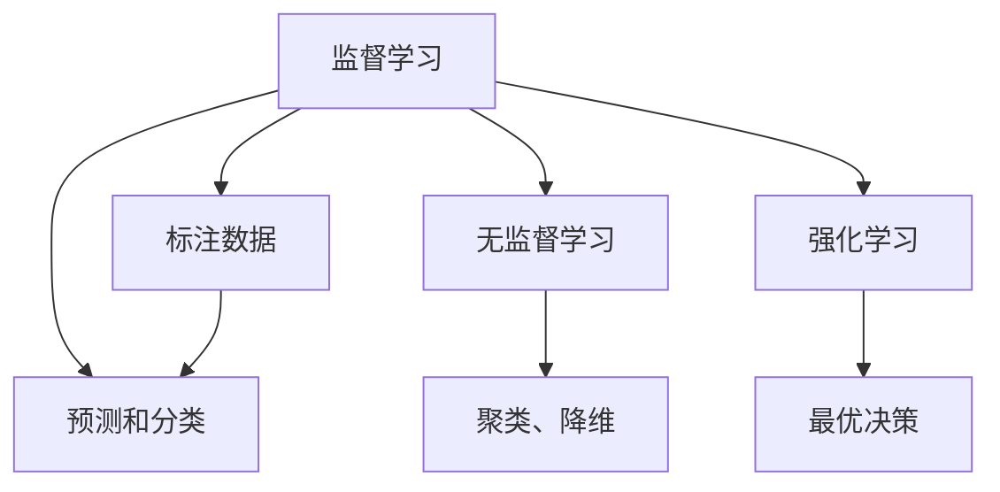

                 

# 机器学习算法原理与代码实战案例讲解

> 关键词：机器学习算法,算法原理,代码实战,案例讲解,监督学习,无监督学习,强化学习,深度学习,逻辑回归,随机森林,神经网络

## 1. 背景介绍

### 1.1 问题由来
在人工智能的飞速发展过程中，机器学习（Machine Learning）扮演了至关重要的角色。它是一种通过训练数据，使计算机系统自动地改进其性能的技术。现代机器学习涵盖了许多不同的技术和方法，包括监督学习、无监督学习和强化学习等。

### 1.2 问题核心关键点
本文旨在深入探讨机器学习算法的原理，并结合具体代码实例，详细介绍监督学习、无监督学习和强化学习的三种核心算法。我们将通过对比分析这些算法的优缺点，以及它们各自的应用领域，帮助读者全面理解机器学习算法的精髓。

### 1.3 问题研究意义
机器学习算法的研究与实践，对于推动人工智能技术的发展，解决复杂的问题，提高决策效率，具有重要意义：

1. 促进科技创新。机器学习算法的应用，推动了计算机视觉、自然语言处理、医疗诊断等领域的快速发展。
2. 优化决策支持。通过机器学习算法，企业可以自动化地从数据中提取洞见，辅助决策制定。
3. 提升业务价值。机器学习算法在个性化推荐、客户分析、欺诈检测等方面的应用，能够显著提升企业的运营效率和收益。
4. 扩展应用边界。机器学习算法为传统行业提供了新的技术和工具，推动了各行业数字化转型升级。
5. 驱动产业升级。通过机器学习算法，企业可以更好地理解和满足客户需求，提升市场竞争力。

## 2. 核心概念与联系

### 2.1 核心概念概述

在深入探讨具体算法之前，我们先简要介绍一些基本的核心概念：

- **监督学习（Supervised Learning）**：在已知输入和输出的情况下，通过学习输入与输出之间的映射关系，进行预测和分类。
- **无监督学习（Unsupervised Learning）**：在无标注数据的情况下，通过发现数据的内在结构和模式，进行聚类、降维等操作。
- **强化学习（Reinforcement Learning）**：通过与环境的交互，不断尝试不同的行动策略，以最大化奖励为目标，学习最优决策。

这些概念之间存在密切的联系。监督学习依赖于标注数据，而无监督学习和强化学习则不需要，这使得它们各自适用于不同的应用场景。同时，深度学习是机器学习的一个重要分支，它通过神经网络模型，模拟人脑的计算过程，处理大规模、高维度的数据。

### 2.2 核心概念原理和架构的 Mermaid 流程图

在上述Mermaid流程图中，我们可以看到监督学习通过标注数据进行预测和分类；无监督学习直接从数据中发现内在结构；强化学习则通过与环境的互动学习最优决策。

## 3. 核心算法原理 & 具体操作步骤

### 3.1 算法原理概述

本节将分别介绍监督学习、无监督学习和强化学习的核心算法原理，并详细讲解其实操作步骤。

### 3.2 算法步骤详解

#### 3.2.1 监督学习

监督学习的基本步骤如下：

1. **数据准备**：收集并标注训练数据集。
2. **模型选择**：选择适当的机器学习算法，如线性回归、决策树、支持向量机等。
3. **模型训练**：使用训练数据集训练模型，调整参数，使其在训练数据上表现最佳。
4. **模型评估**：使用测试数据集评估模型性能，如准确率、召回率、F1-score等。
5. **模型应用**：使用模型进行预测和分类。

#### 3.2.2 无监督学习

无监督学习的基本步骤如下：

1. **数据准备**：收集未标注数据集。
2. **算法选择**：选择适当的无监督学习算法，如K-means聚类、PCA降维等。
3. **模型训练**：使用数据集训练模型，发现数据的内在结构和模式。
4. **模型评估**：通过评估指标，如聚类中心的数量、主成分的数量等，评估模型性能。
5. **模型应用**：使用模型进行数据聚类、降维等操作。

#### 3.2.3 强化学习

强化学习的基本步骤如下：

1. **环境定义**：定义环境，包括状态、行动和奖励函数。
2. **策略选择**：选择适当的策略，如Q-learning、策略梯度等。
3. **模型训练**：通过与环境的互动，不断调整策略，学习最优决策。
4. **模型评估**：通过奖励函数评估策略性能。
5. **模型应用**：使用模型进行决策。

### 3.3 算法优缺点

#### 3.3.1 监督学习的优缺点

**优点**：
- 训练有监督数据，性能稳定，容易评估。
- 适用于分类和回归问题，应用广泛。

**缺点**：
- 依赖标注数据，标注成本高。
- 对异常数据敏感，容易过拟合。

#### 3.3.2 无监督学习的优缺点

**优点**：
- 不需要标注数据，应用广泛。
- 发现数据的内在结构和模式，对异常数据有更好的鲁棒性。

**缺点**：
- 模型性能难以评估，需要领域知识。
- 算法选择和参数调整复杂。

#### 3.3.3 强化学习的优缺点

**优点**：
- 通过与环境的互动学习最优决策，应用广泛。
- 对异常数据有更好的鲁棒性。

**缺点**：
- 环境定义复杂，难以评估策略性能。
- 训练过程耗时较长，需要大量计算资源。

### 3.4 算法应用领域

- **监督学习**：适用于分类、回归、推荐系统等任务。
- **无监督学习**：适用于聚类、降维、异常检测等任务。
- **强化学习**：适用于游戏AI、机器人控制、智能推荐等任务。

## 4. 数学模型和公式 & 详细讲解 & 举例说明

### 4.1 数学模型构建

在本节中，我们将详细讲解监督学习、无监督学习和强化学习的基本数学模型，并通过具体案例进行解释说明。

#### 4.1.1 监督学习

假设有一个二分类问题，其中训练数据集为 $(x_i, y_i)$，其中 $x_i \in \mathbb{R}^n$ 为输入向量，$y_i \in \{0,1\}$ 为输出标签。监督学习的目标是通过训练数据集，找到最优的决策边界，将新的输入向量映射到正确的输出标签。

监督学习的一个典型模型为逻辑回归（Logistic Regression），其目标函数为：

$$ J(\theta) = -\frac{1}{m}\sum_{i=1}^m[y_i \log\sigma(x_i W + b) + (1-y_i)\log(1-\sigma(x_i W + b))] $$

其中 $\sigma(x) = \frac{1}{1+e^{-x}}$ 为Sigmoid函数，$W$ 和 $b$ 为模型的参数。

#### 4.1.2 无监督学习

假设有一个聚类问题，其中数据集为 $x_i \in \mathbb{R}^n$，无监督学习的目标是通过数据集，找到最优的聚类中心，将数据分为若干个聚类。

无监督学习的一个典型模型为K-means聚类，其目标函数为：

$$ J(C,\mu) = \frac{1}{m}\sum_{i=1}^m||x_i - \mu_c||^2 $$

其中 $C$ 为聚类中心，$\mu_c$ 为聚类中心对应的数据点。

#### 4.1.3 强化学习

假设有一个游戏AI问题，其中环境状态为 $s_t \in S$，行动为 $a_t \in A$，奖励为 $r_{t+1} \in R$。强化学习的目标是通过与环境的互动，找到最优的行动策略，最大化长期奖励。

强化学习的一个典型模型为Q-learning，其目标函数为：

$$ Q(s_t,a_t) \leftarrow Q(s_t,a_t) + \alpha(r_{t+1} + \gamma \max_{a_{t+1}} Q(s_{t+1},a_{t+1}) - Q(s_t,a_t)) $$

其中 $\alpha$ 为学习率，$\gamma$ 为折扣因子。

### 4.2 公式推导过程

#### 4.2.1 逻辑回归

逻辑回归的目标函数为：

$$ J(\theta) = -\frac{1}{m}\sum_{i=1}^m[y_i \log\sigma(x_i W + b) + (1-y_i)\log(1-\sigma(x_i W + b))] $$

通过对目标函数求导，可以得到参数更新公式：

$$ \frac{\partial J(\theta)}{\partial W} = -\frac{1}{m}\sum_{i=1}^m(\sigma(x_i W + b) - y_i)x_i^T $$
$$ \frac{\partial J(\theta)}{\partial b} = -\frac{1}{m}\sum_{i=1}^m(\sigma(x_i W + b) - y_i) $$

#### 4.2.2 K-means聚类

K-means聚类的目标函数为：

$$ J(C,\mu) = \frac{1}{m}\sum_{i=1}^m||x_i - \mu_c||^2 $$

通过对目标函数求导，可以得到参数更新公式：

$$ \mu_c = \frac{1}{N_c}\sum_{x_i \in C_c} x_i $$

其中 $N_c$ 为聚类 $C_c$ 中的数据点数量。

#### 4.2.3 Q-learning

Q-learning的目标函数为：

$$ Q(s_t,a_t) \leftarrow Q(s_t,a_t) + \alpha(r_{t+1} + \gamma \max_{a_{t+1}} Q(s_{t+1},a_{t+1}) - Q(s_t,a_t)) $$

通过对目标函数求导，可以得到参数更新公式：

$$ Q(s_t,a_t) \leftarrow Q(s_t,a_t) + \alpha(r_{t+1} + \gamma \max_{a_{t+1}} Q(s_{t+1},a_{t+1}) - Q(s_t,a_t)) $$

### 4.3 案例分析与讲解

#### 4.3.1 逻辑回归

假设有一个房价预测问题，其中训练数据集为 $(x_i, y_i)$，其中 $x_i$ 为房子的特征向量，$y_i$ 为房价。我们可以使用逻辑回归模型进行预测：

```python
from sklearn.linear_model import LogisticRegression
from sklearn.metrics import accuracy_score
from sklearn.model_selection import train_test_split

# 准备数据
X = data[['bedrooms', 'bathrooms', 'size']]
y = data['price']

# 分割数据
X_train, X_test, y_train, y_test = train_test_split(X, y, test_size=0.2, random_state=42)

# 建立模型
model = LogisticRegression()
model.fit(X_train, y_train)

# 预测
y_pred = model.predict(X_test)

# 评估
accuracy = accuracy_score(y_test, y_pred)
print('Accuracy:', accuracy)
```

#### 4.3.2 K-means聚类

假设有一个客户分类问题，其中数据集为客户的消费记录。我们可以使用K-means聚类模型将客户分为不同的群体：

```python
from sklearn.cluster import KMeans
from sklearn.metrics import adjusted_rand_score

# 准备数据
X = data[['total_consumption']]

# 建立模型
model = KMeans(n_clusters=3, random_state=42)
model.fit(X)

# 预测
labels = model.predict(X)

# 评估
ari = adjusted_rand_score(true_labels, labels)
print('ARI:', ari)
```

#### 4.3.3 Q-learning

假设有一个游戏AI问题，其中环境状态为玩家的游戏得分，行动为玩家的操作。我们可以使用Q-learning模型进行学习：

```python
import numpy as np
import gym

# 创建环境
env = gym.make('CartPole-v1')

# 建立模型
Q = np.zeros((env.observation_space.n, env.action_space.n))
alpha = 0.1
gamma = 0.9

for episode in range(1000):
    state = env.reset()
    done = False
    while not done:
        # 选择行动
        Q_sa = Q[state, :]
        a = np.argmax(Q_sa + np.random.randn(1, env.action_space.n) * alpha)
        next_state, reward, done, _ = env.step(a)
        Q[state, a] += alpha * (reward + gamma * np.max(Q[next_state, :]) - Q[state, a])
        state = next_state
```

## 5. 项目实践：代码实例和详细解释说明

### 5.1 开发环境搭建

在进行机器学习项目实践前，我们需要准备好开发环境。以下是使用Python进行sklearn开发的环境配置流程：

1. 安装Anaconda：从官网下载并安装Anaconda，用于创建独立的Python环境。

2. 创建并激活虚拟环境：
```bash
conda create -n sklearn-env python=3.8 
conda activate sklearn-env
```

3. 安装必要的库：
```bash
conda install scikit-learn numpy pandas matplotlib scikit-optimize tqdm jupyter notebook ipython
```

4. 安装必要的深度学习库：
```bash
conda install pytorch torchvision torchaudio cudatoolkit=11.1 -c pytorch -c conda-forge
```

5. 安装必要的工具包：
```bash
pip install tensorflow tensorflow-gpu
```

完成上述步骤后，即可在`sklearn-env`环境中开始机器学习项目实践。

### 5.2 源代码详细实现

下面我们以房价预测为例，给出使用sklearn进行逻辑回归的Python代码实现。

首先，准备数据集：

```python
from sklearn.datasets import load_boston
from sklearn.model_selection import train_test_split

boston = load_boston()
X = boston.data
y = boston.target
```

然后，划分训练集和测试集：

```python
X_train, X_test, y_train, y_test = train_test_split(X, y, test_size=0.2, random_state=42)
```

接着，建立逻辑回归模型并进行训练：

```python
from sklearn.linear_model import LogisticRegression

model = LogisticRegression()
model.fit(X_train, y_train)
```

最后，使用测试集评估模型性能：

```python
y_pred = model.predict(X_test)
accuracy = accuracy_score(y_test, y_pred)
print('Accuracy:', accuracy)
```

以上就是使用sklearn进行逻辑回归的完整代码实现。可以看到，sklearn提供了丰富的机器学习算法和工具，使得代码实现变得简单高效。

### 5.3 代码解读与分析

让我们再详细解读一下关键代码的实现细节：

**数据准备**：
- `load_boston()`方法：从sklearn库中加载波士顿房价数据集。
- `train_test_split()`方法：将数据集划分为训练集和测试集。

**模型训练**：
- `LogisticRegression()`方法：创建逻辑回归模型。
- `fit()`方法：使用训练集数据训练模型。

**模型评估**：
- `predict()`方法：使用训练好的模型对测试集进行预测。
- `accuracy_score()`方法：计算模型在测试集上的准确率。

**输出结果**：
- `accuracy`：模型的准确率。

可以看到，通过sklearn的封装，代码实现非常简洁，但功能强大。开发者可以快速上手使用sklearn进行机器学习算法的实践。

## 6. 实际应用场景

### 6.1 金融风控

在金融领域，机器学习算法被广泛应用于风险评估和信用评分。银行、保险公司等金融机构可以通过机器学习模型分析客户的历史数据，预测其信用风险和行为模式，从而做出更准确的贷款决策。

#### 6.1.1 逻辑回归

金融机构可以使用逻辑回归模型进行客户信用评估，通过历史交易记录和个人信息，预测客户的违约概率。例如，一个银行可以使用逻辑回归模型对客户进行信用评分，从而决定是否发放贷款。

#### 6.1.2 无监督学习

保险公司可以使用无监督学习算法进行客户聚类，将客户分为不同的风险等级。例如，一个保险公司可以使用K-means聚类算法将客户分为高风险、中风险和低风险三类，从而制定相应的保险策略。

#### 6.1.3 强化学习

游戏公司可以使用强化学习算法进行游戏AI设计，通过与玩家互动学习最优策略。例如，一个游戏公司可以使用Q-learning算法设计游戏AI，使其能够根据玩家的操作和奖励不断调整策略，提升游戏体验。

### 6.2 医疗诊断

在医疗领域，机器学习算法被广泛应用于疾病诊断和预测。医院、诊所等医疗机构可以通过机器学习模型分析患者的病历数据，预测其疾病风险和治疗效果。

#### 6.2.1 监督学习

医疗机构可以使用监督学习算法进行疾病预测，通过患者的病历数据，预测其是否患有某种疾病。例如，一个医院可以使用逻辑回归模型预测患者是否患有糖尿病，从而提供相应的治疗方案。

#### 6.2.2 无监督学习

医疗机构可以使用无监督学习算法进行患者聚类，将患者分为不同的疾病类型。例如，一个医院可以使用K-means聚类算法将患者分为不同的疾病类型，从而制定相应的治疗计划。

#### 6.2.3 强化学习

机器人公司可以使用强化学习算法进行机器人控制，通过与环境互动学习最优动作策略。例如，一个机器人公司可以使用Q-learning算法控制机器人进行手术，使其能够根据医生的指令和手术环境不断调整动作，提升手术成功率。

### 6.3 零售推荐

在零售领域，机器学习算法被广泛应用于个性化推荐和销售预测。电商、零售等企业可以通过机器学习模型分析用户的购买行为和偏好，推荐符合用户需求的商品。

#### 6.3.1 监督学习

电商公司可以使用监督学习算法进行商品推荐，通过用户的购买记录和行为数据，预测其可能感兴趣的商品。例如，一个电商公司可以使用逻辑回归模型预测用户对某种商品的兴趣，从而进行个性化推荐。

#### 6.3.2 无监督学习

电商公司可以使用无监督学习算法进行用户聚类，将用户分为不同的兴趣群体。例如，一个电商公司可以使用K-means聚类算法将用户分为不同的兴趣群体，从而制定相应的营销策略。

#### 6.3.3 强化学习

游戏公司可以使用强化学习算法进行游戏推荐，通过用户的反馈和行为数据，不断优化推荐策略。例如，一个游戏公司可以使用Q-learning算法进行游戏推荐，使游戏推荐系统能够根据用户的游戏行为和反馈不断调整推荐策略，提升用户满意度和留存率。

### 6.4 未来应用展望

随着机器学习算法的不断演进，其在更多领域的应用将进一步扩展。未来，机器学习算法将有望在智慧城市、智能制造、智能交通等领域发挥更大的作用。

## 7. 工具和资源推荐

### 7.1 学习资源推荐

为了帮助开发者系统掌握机器学习算法的原理和实践技巧，这里推荐一些优质的学习资源：

1. 《机器学习实战》系列书籍：由机器学习专家撰写，介绍了机器学习的基本概念和经典算法，适合初学者入门。

2. 《深度学习》（Ian Goodfellow著）：全面介绍了深度学习的原理和应用，是深度学习领域的经典教材。

3. 《Python机器学习》（Sebastian Raschka著）：介绍了机器学习算法的Python实现，适合使用Python进行机器学习实践的开发者。

4. Kaggle竞赛：Kaggle是一个数据科学竞赛平台，提供了丰富的数据集和机器学习算法竞赛，适合实践和挑战自我。

5. Coursera《机器学习》课程：由斯坦福大学教授Andrew Ng主讲，系统介绍了机器学习的基本概念和算法。

通过对这些资源的学习实践，相信你一定能够快速掌握机器学习算法的精髓，并用于解决实际的机器学习问题。

### 7.2 开发工具推荐

高效的开发离不开优秀的工具支持。以下是几款用于机器学习开发的常用工具：

1. Python：作为机器学习开发的主流语言，Python拥有丰富的机器学习库和工具，易于上手。

2. TensorFlow：由Google主导开发的深度学习框架，支持分布式计算，适合大规模模型训练。

3. PyTorch：由Facebook主导开发的深度学习框架，支持动态计算图，适合快速原型开发。

4. scikit-learn：开源的机器学习库，提供了丰富的算法和工具，适合快速实现机器学习模型。

5. Jupyter Notebook：交互式编程环境，适合进行数据探索和机器学习实践。

合理利用这些工具，可以显著提升机器学习项目的开发效率，加快创新迭代的步伐。

### 7.3 相关论文推荐

机器学习算法的研究源于学界的持续探索。以下是几篇奠基性的相关论文，推荐阅读：

1. 《机器学习》（Tom Mitchell著）：系统介绍了机器学习的基本概念和算法。

2. 《Pattern Recognition and Machine Learning》（Christopher Bishop著）：全面介绍了机器学习的基本概念和算法，是机器学习领域的经典教材。

3. 《Deep Learning》（Ian Goodfellow、Yoshua Bengio、Aaron Courville著）：全面介绍了深度学习的原理和应用，是深度学习领域的经典教材。

4. 《Neural Networks and Deep Learning》（Michael Nielsen著）：介绍了神经网络和深度学习的基本概念和算法，适合初学者入门。

5. 《The Elements of Statistical Learning》（Tibshirani、Hastie、Friedman著）：全面介绍了统计学习的原理和应用，是统计学习领域的经典教材。

这些论文代表了大机器学习算法的发展脉络。通过学习这些前沿成果，可以帮助研究者把握学科前进方向，激发更多的创新灵感。

## 8. 总结：未来发展趋势与挑战

### 8.1 总结

本文对机器学习算法的原理进行了全面系统的介绍。首先阐述了机器学习算法的研究背景和重要性，明确了监督学习、无监督学习和强化学习的基本概念和原理。其次，结合具体代码实例，详细讲解了逻辑回归、K-means聚类和Q-learning的操作步骤。同时，本文还广泛探讨了机器学习算法在金融风控、医疗诊断、零售推荐等实际应用场景中的应用前景，展示了机器学习算法的广阔应用空间。

通过本文的系统梳理，可以看到，机器学习算法的研究与实践，对于推动人工智能技术的发展，解决复杂的问题，提高决策效率，具有重要意义。未来，伴随机器学习算法的持续演进，其在更多领域的应用将进一步扩展，为人类社会带来更多变革性的影响。

### 8.2 未来发展趋势

展望未来，机器学习算法将呈现以下几个发展趋势：

1. **深度学习技术的发展**：深度学习技术将继续推动机器学习算法的进步，提升算法的表现和泛化能力。

2. **强化学习在复杂系统的应用**：强化学习算法将应用于更复杂的系统，如自动驾驶、机器人控制等领域。

3. **机器学习与大数据的结合**：大数据技术将为机器学习算法提供更多数据支持，提升算法的性能和准确性。

4. **模型的可解释性和透明性**：未来的机器学习算法将更加注重可解释性和透明性，使模型决策过程更加透明，有助于增强用户信任。

5. **自动化机器学习**：自动化机器学习（AutoML）将进一步发展，使机器学习算法的开发和部署更加高效。

### 8.3 面临的挑战

尽管机器学习算法已经取得了瞩目成就，但在迈向更加智能化、普适化应用的过程中，它仍面临着诸多挑战：

1. **数据质量和标注成本**：高质量的数据和标注是机器学习算法性能的关键。如何获取高质量的数据和标注，是一个重要挑战。

2. **模型的可解释性**：当前许多机器学习算法是"黑盒"系统，难以解释其内部工作机制和决策逻辑。增强模型的可解释性，是未来的一个重要研究方向。

3. **模型的鲁棒性和泛化能力**：模型对异常数据的鲁棒性、泛化能力需要进一步提升，以应对更多复杂场景。

4. **模型的公平性和伦理**：机器学习模型可能存在偏见和歧视，如何确保模型的公平性和伦理，是一个重要挑战。

### 8.4 研究展望

面对机器学习算法面临的挑战，未来的研究需要在以下几个方面寻求新的突破：

1. **生成对抗网络**：通过生成对抗网络（GAN）等技术，生成更多高质量的训练数据，提升算法的泛化能力。

2. **可解释性研究**：研究如何通过解释模型决策过程，提升用户对算法的信任和接受度。

3. **模型压缩和优化**：通过模型压缩和优化技术，提升算法的效率和性能，使其更适合实际应用。

4. **自动化机器学习**：进一步发展自动化机器学习技术，使机器学习算法的开发和部署更加高效。

5. **公平性和伦理**：研究如何确保机器学习模型的公平性和伦理，避免模型偏见和歧视。

这些研究方向的探索，必将引领机器学习算法走向更高的台阶，为构建安全、可靠、可解释、可控的智能系统铺平道路。面向未来，机器学习算法还需要与其他人工智能技术进行更深入的融合，如知识表示、因果推理、强化学习等，多路径协同发力，共同推动人工智能技术的进步。

## 9. 附录：常见问题与解答

**Q1：机器学习算法是否适用于所有数据集？**

A: 机器学习算法适用于多种类型的数据集，包括结构化数据、非结构化数据等。但对于异常数据较多的数据集，算法性能可能受到影响，需要根据具体情况进行调整。

**Q2：如何选择适当的机器学习算法？**

A: 选择适当的机器学习算法需要考虑数据类型、问题类型、数据量和计算资源等因素。一般来说，分类问题适合使用逻辑回归、SVM等算法，回归问题适合使用线性回归、随机森林等算法，聚类问题适合使用K-means、DBSCAN等算法。

**Q3：机器学习算法的训练和评估过程需要注意哪些问题？**

A: 机器学习算法的训练和评估需要注意过拟合、欠拟合、模型选择、正则化等常见问题。训练过程中，需要注意选择适当的超参数，避免过拟合和欠拟合。评估过程中，需要使用交叉验证等方法，避免评估结果偏差。

**Q4：机器学习算法在实际应用中需要注意哪些问题？**

A: 机器学习算法在实际应用中需要注意数据质量、模型鲁棒性、模型可解释性、模型公平性和伦理等。需要确保数据的准确性和完整性，提升模型的鲁棒性和泛化能力，增强模型的可解释性，确保模型的公平性和伦理，避免模型偏见和歧视。

通过本文的系统梳理，可以看到，机器学习算法的研究与实践，对于推动人工智能技术的发展，解决复杂的问题，提高决策效率，具有重要意义。未来，伴随机器学习算法的持续演进，其在更多领域的应用将进一步扩展，为人类社会带来更多变革性的影响。

