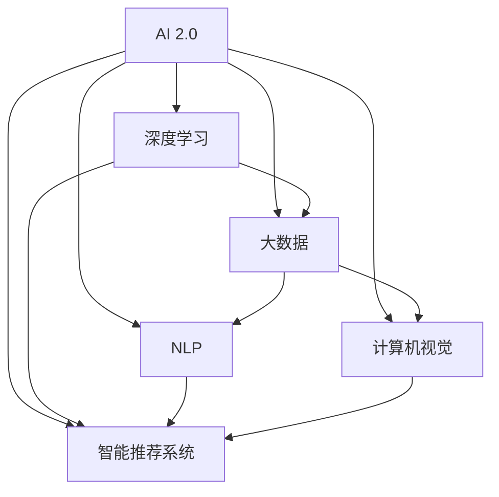

                 

# 李开复：AI 2.0 时代的市场

## 1. 背景介绍

### 1.1 问题由来
随着人工智能技术的飞速发展，AI 2.0 时代正悄然来临。这一时代以深度学习和大数据为核心，人工智能已经从科研实验室走进了商业和日常生活的各个角落。李开复博士作为全球著名的人工智能专家，有着丰富的行业洞察力和实践经验，他在 AI 2.0 时代的市场领域有着深入的研究和独到的见解。本文将从李开复博士的视角，探讨 AI 2.0 时代市场的现状、挑战与未来趋势。

### 1.2 问题核心关键点
AI 2.0 时代的市场主要涉及以下几个核心关键点：
- **市场规模**：AI 2.0 技术在各行业的应用将极大拓展市场规模，催生新的经济增长点。
- **技术趋势**：深度学习、自然语言处理、计算机视觉等技术的成熟和普及。
- **商业模式**：AI 2.0 时代的商业模式将更加多元化，包括 SaaS、PaaS、数据服务等。
- **人才需求**：AI 2.0 技术的发展需要大量具备高技能的人才，包括算法工程师、数据科学家、AI 产品经理等。
- **伦理挑战**：AI 2.0 技术在应用中可能面临隐私、安全性、公平性等伦理问题。

## 2. 核心概念与联系

### 2.1 核心概念概述

为了更好地理解 AI 2.0 时代的市场，本节将介绍几个密切相关的核心概念：

- **AI 2.0**：指的是基于深度学习和大数据的人工智能发展阶段，其目标是使 AI 系统能够进行复杂任务，如图像识别、语音识别、自然语言处理等。
- **深度学习**：一种模拟人脑神经网络的学习方法，通过多层神经网络提取数据的高级特征，用于图像、语音、文本等复杂数据处理。
- **大数据**：指的是数据量巨大、类型繁多、价值密度低、处理速度快的数据集合，是支持 AI 2.0 技术发展的基础。
- **自然语言处理 (NLP)**：使计算机能够理解、解析、生成和翻译人类语言的技术，如问答系统、机器翻译等。
- **计算机视觉**：使计算机能够识别、理解和处理图像、视频等视觉数据的技术，如人脸识别、物体检测等。
- **智能推荐系统**：通过分析用户行为和偏好，智能推荐个性化内容和服务的技术，如电商平台的产品推荐。

这些核心概念之间的逻辑关系可以通过以下 Mermaid 流程图来展示：



这个流程图展示了 AI 2.0 技术与其核心子领域之间的紧密联系：

1. AI 2.0 技术以深度学习为核心理论基础，通过大数据的支撑，进一步推动了 NLP、计算机视觉和智能推荐系统等子领域的发展。
2. 各子领域相互渗透，形成了一个以 AI 2.0 技术为核心的生态系统。

## 3. 核心算法原理 & 具体操作步骤
### 3.1 算法原理概述

AI 2.0 时代的技术实现主要基于深度学习算法，其核心原理是构建多层神经网络模型，通过反向传播算法和梯度下降策略来训练模型，使其能够对输入数据进行准确的预测和分类。

具体来说，深度学习模型通常包括以下几个步骤：

1. **数据预处理**：对原始数据进行清洗、归一化和特征工程，以提高模型训练的效率和准确性。
2. **构建模型**：设计并构建多层神经网络模型，包括输入层、隐藏层和输出层，选择合适的激活函数和损失函数。
3. **训练模型**：使用反向传播算法计算模型参数的梯度，并使用梯度下降策略更新模型参数，使得模型能够最小化损失函数。
4. **模型评估**：使用测试集对训练好的模型进行评估，计算准确率、召回率、F1 分数等指标。
5. **模型部署**：将训练好的模型部署到实际应用环境中，进行实时预测和推理。

### 3.2 算法步骤详解

以下是对 AI 2.0 时代深度学习算法步骤的详细讲解：

#### 3.2.1 数据预处理

数据预处理是深度学习模型构建的基础。常见的数据预处理步骤包括：

- 数据清洗：去除噪声和异常值，确保数据质量。
- 数据归一化：将数据缩放到指定范围，如 [0,1] 或 [-1,1]，以提高模型训练的稳定性。
- 特征工程：提取和构造对模型预测有用的特征，如文本中的词向量、图像中的边缘特征等。

#### 3.2.2 模型构建

模型构建是深度学习算法的核心步骤。通常，深度学习模型包括输入层、隐藏层和输出层，每个层都有多个神经元。以卷积神经网络 (CNN) 为例，其构建步骤如下：

1. 输入层：接收原始数据，如图像像素、文本词向量等。
2. 卷积层：通过卷积核对输入数据进行特征提取，输出特征图。
3. 池化层：对特征图进行降维和提取关键信息，如最大池化、平均池化等。
4. 全连接层：将特征图展平，输入到全连接层进行分类或回归。
5. 输出层：根据任务需求选择不同类型的输出层，如 Softmax 回归用于多分类问题，线性回归用于单值预测问题。

#### 3.2.3 训练模型

模型训练是深度学习算法的关键步骤。通常使用反向传播算法和梯度下降策略来训练模型。以梯度下降为例，其步骤如下：

1. 初始化模型参数，如权重、偏置等。
2. 前向传播：将输入数据通过模型，计算出预测值。
3. 计算损失函数：根据任务需求选择合适的损失函数，如交叉熵损失、均方误差损失等。
4. 反向传播：计算预测值与真实值之间的误差，使用链式法则计算损失函数对模型参数的梯度。
5. 更新模型参数：使用梯度下降策略更新模型参数，如学习率、动量等，使得损失函数最小化。
6. 迭代更新：重复上述步骤，直到模型收敛或达到预设迭代次数。

#### 3.2.4 模型评估

模型评估是深度学习算法的评估步骤。常见的评估指标包括：

- 准确率 (Accuracy)：预测正确的样本数与总样本数之比。
- 召回率 (Recall)：预测正确的正样本数与实际正样本数之比。
- F1 分数 (F1 Score)：综合考虑准确率和召回率，是二者的调和平均数。

#### 3.2.5 模型部署

模型部署是深度学习算法的应用步骤。常见的部署方式包括：

- SaaS：通过云计算平台提供 API 接口，供外部用户调用。
- PaaS：提供完整的平台和环境，供用户自行部署和维护模型。
- 数据服务：将模型嵌入到数据流中，实时处理和分析数据。

### 3.3 算法优缺点

AI 2.0 时代的深度学习算法具有以下优点：

- **高效性**：深度学习算法能够自动学习数据特征，不需要手动提取特征，从而提高了模型训练的效率。
- **准确性**：深度学习算法能够处理复杂数据结构，如图像、文本等，并取得较高的准确率。
- **可扩展性**：深度学习模型可以通过增加层数或节点数，进一步提升模型性能，适用于各种复杂任务。

同时，深度学习算法也存在以下缺点：

- **计算资源需求高**：深度学习模型通常需要大量的计算资源，如 GPU、TPU 等，增加了硬件成本。
- **过拟合风险高**：深度学习模型容易过拟合，需要大量的数据和正则化技术来避免过拟合。
- **黑箱性质**：深度学习模型难以解释其内部工作机制，不具备透明性。
- **训练时间长**：深度学习模型训练时间较长，需要较大的时间和人力成本。

### 3.4 算法应用领域

AI 2.0 时代的深度学习算法已经广泛应用于各个领域，包括但不限于：

- **图像识别**：如图像分类、目标检测、图像分割等。
- **语音识别**：如语音转文本、语音合成、情感识别等。
- **自然语言处理**：如机器翻译、文本分类、问答系统等。
- **计算机视觉**：如人脸识别、物体跟踪、场景理解等。
- **智能推荐系统**：如电商推荐、内容推荐、广告推荐等。

这些领域的应用展示了深度学习算法的强大潜力和广泛应用前景。

## 4. 数学模型和公式 & 详细讲解
### 4.1 数学模型构建

在 AI 2.0 时代，深度学习模型的数学模型构建通常基于以下步骤：

1. **输入层**：将原始数据输入到模型中，如图像像素、文本词向量等。
2. **隐藏层**：通过多个隐藏层进行特征提取和变换，构建高层次的特征表示。
3. **输出层**：根据任务需求选择合适的输出层，如 Softmax 回归用于多分类问题，线性回归用于单值预测问题。

以神经网络为例，其数学模型构建如下：

$$
\hat{y} = f_W(x) = \sigma(Wx + b)
$$

其中，$x$ 为输入向量，$W$ 为权重矩阵，$b$ 为偏置向量，$\sigma$ 为激活函数，$f_W(x)$ 为神经网络的输出。

### 4.2 公式推导过程

以下是对神经网络数学模型的公式推导过程的详细讲解：

#### 4.2.1 前向传播

前向传播是指将输入数据通过模型，计算出预测值的过程。以三层神经网络为例，其前向传播过程如下：

$$
h_1 = \sigma(W_1x + b_1)
$$

$$
h_2 = \sigma(W_2h_1 + b_2)
$$

$$
y = \sigma(W_3h_2 + b_3)
$$

其中，$h_1$ 和 $h_2$ 为隐藏层输出，$y$ 为最终输出。

#### 4.2.2 损失函数

损失函数用于衡量模型预测值与真实值之间的误差，常见的损失函数包括交叉熵损失、均方误差损失等。以交叉熵损失为例，其公式推导如下：

$$
\mathcal{L}(y, \hat{y}) = -\frac{1}{N}\sum_{i=1}^N y_i\log \hat{y}_i + (1-y_i)\log (1-\hat{y}_i)
$$

其中，$y$ 为真实值，$\hat{y}$ 为预测值，$N$ 为样本数。

#### 4.2.3 梯度下降

梯度下降是深度学习模型训练的核心步骤。其公式推导如下：

$$
\Delta W = -\eta \frac{\partial \mathcal{L}}{\partial W}
$$

$$
\Delta b = -\eta \frac{\partial \mathcal{L}}{\partial b}
$$

其中，$\Delta W$ 和 $\Delta b$ 为权重和偏置的更新量，$\eta$ 为学习率。

### 4.3 案例分析与讲解

以图像识别任务为例，分析深度学习算法的应用过程：

1. **数据预处理**：将原始图像数据进行归一化和数据增强。
2. **模型构建**：使用卷积神经网络模型，构建多层卷积层和池化层，输出特征图。
3. **训练模型**：使用反向传播算法和梯度下降策略，训练模型参数，最小化损失函数。
4. **模型评估**：使用测试集评估模型性能，计算准确率和召回率。
5. **模型部署**：将训练好的模型部署到实际应用中，进行实时预测和推理。

## 5. 项目实践：代码实例和详细解释说明
### 5.1 开发环境搭建

在进行 AI 2.0 时代的深度学习项目实践前，我们需要准备好开发环境。以下是使用 Python 进行 TensorFlow 开发的环境配置流程：

1. 安装 Anaconda：从官网下载并安装 Anaconda，用于创建独立的 Python 环境。

2. 创建并激活虚拟环境：
```bash
conda create -n tf-env python=3.8 
conda activate tf-env
```

3. 安装 TensorFlow：根据 GPU 版本，从官网获取对应的安装命令。例如：
```bash
pip install tensorflow==2.4
```

4. 安装各类工具包：
```bash
pip install numpy pandas scikit-learn matplotlib tqdm jupyter notebook ipython
```

完成上述步骤后，即可在 `tf-env` 环境中开始 AI 2.0 时代深度学习项目的开发。

### 5.2 源代码详细实现

这里以图像识别任务为例，给出使用 TensorFlow 进行深度学习模型微调的 Python 代码实现。

首先，定义图像数据处理函数：

```python
import tensorflow as tf
from tensorflow.keras.preprocessing.image import ImageDataGenerator

def preprocess_data(train_data_dir, validation_data_dir, img_height, img_width, batch_size):
    train_datagen = ImageDataGenerator(
        rescale=1./255,
        shear_range=0.2,
        zoom_range=0.2,
        horizontal_flip=True
    )
    train_generator = train_datagen.flow_from_directory(
        train_data_dir,
        target_size=(img_height, img_width),
        batch_size=batch_size,
        class_mode='binary'
    )

    validation_datagen = ImageDataGenerator(rescale=1./255)
    validation_generator = validation_datagen.flow_from_directory(
        validation_data_dir,
        target_size=(img_height, img_width),
        batch_size=batch_size,
        class_mode='binary'
    )

    return train_generator, validation_generator
```

然后，定义深度学习模型：

```python
from tensorflow.keras import Sequential, Conv2D, MaxPooling2D, Flatten, Dense

model = Sequential()
model.add(Conv2D(32, (3, 3), activation='relu', input_shape=(img_height, img_width, 3)))
model.add(MaxPooling2D((2, 2)))
model.add(Conv2D(64, (3, 3), activation='relu'))
model.add(MaxPooling2D((2, 2)))
model.add(Conv2D(128, (3, 3), activation='relu'))
model.add(MaxPooling2D((2, 2)))
model.add(Flatten())
model.add(Dense(128, activation='relu'))
model.add(Dense(1, activation='sigmoid'))

model.compile(optimizer='adam', loss='binary_crossentropy', metrics=['accuracy'])
```

接着，定义训练和评估函数：

```python
from tensorflow.keras.callbacks import EarlyStopping

def train_model(model, train_generator, validation_generator, epochs, batch_size):
    early_stopping = EarlyStopping(monitor='val_loss', patience=5)

    model.fit(
        train_generator,
        validation_data=validation_generator,
        epochs=epochs,
        batch_size=batch_size,
        callbacks=[early_stopping]
    )

    return model
```

最后，启动训练流程并在测试集上评估：

```python
epochs = 50
batch_size = 32

train_generator, validation_generator = preprocess_data(
    train_data_dir='train',
    validation_data_dir='validation',
    img_height=64,
    img_width=64,
    batch_size=batch_size
)

model = train_model(model, train_generator, validation_generator, epochs=epochs, batch_size=batch_size)

test_generator = ImageDataGenerator(rescale=1./255)
test_generator.fit(test_data_dir)

test_loss, test_acc = model.evaluate(
    test_generator,
    batch_size=batch_size
)

print(f'Test loss: {test_loss}, Test accuracy: {test_acc}')
```

以上就是使用 TensorFlow 进行图像识别任务深度学习模型微调的完整代码实现。可以看到，TensorFlow 提供了丰富的预训练模型和模型优化工具，使得深度学习模型的开发和微调变得相对简单。

### 5.3 代码解读与分析

让我们再详细解读一下关键代码的实现细节：

**preprocess_data 函数**：
- 定义图像数据增强和预处理流程，将原始图像数据归一化、旋转、缩放、翻转等操作。
- 使用 TensorFlow 的 ImageDataGenerator 类，生成批次化的数据流，方便模型训练。

**Sequential 模型定义**：
- 构建卷积神经网络模型，包括多个卷积层、池化层、全连接层，并使用适当的激活函数和损失函数。

**train_model 函数**：
- 定义训练参数和回调函数，如早期停止（Early Stopping），防止过拟合。
- 使用 TensorFlow 的 fit 方法，对模型进行训练，并在验证集上评估性能。

**训练流程**：
- 定义总的迭代轮数和批次大小，开始循环迭代
- 每个epoch内，在训练集上进行训练，并在验证集上评估模型性能
- 所有epoch结束后，在测试集上评估最终结果

可以看到，TensorFlow 提供了强大的模型构建和训练工具，使得深度学习模型的开发和微调变得相对简单。开发者可以将更多精力放在数据处理、模型改进等高层逻辑上，而不必过多关注底层的实现细节。

当然，工业级的系统实现还需考虑更多因素，如模型的保存和部署、超参数的自动搜索、更灵活的任务适配层等。但核心的微调范式基本与此类似。

## 6. 实际应用场景
### 6.1 智能客服系统

基于深度学习算法的智能客服系统，可以通过分析用户的历史聊天记录和行为数据，预测用户需求并自动回复。AI 2.0 时代的智能客服系统不仅能够理解自然语言，还能进行多轮对话、情感分析等复杂任务，提升客户体验。

在技术实现上，可以收集企业内部的历史客服对话记录，将问题和最佳答复构建成监督数据，在此基础上对深度学习模型进行微调。微调后的模型能够自动理解用户意图，匹配最合适的答案模板进行回复。对于客户提出的新问题，还可以接入检索系统实时搜索相关内容，动态组织生成回答。如此构建的智能客服系统，能大幅提升客户咨询体验和问题解决效率。

### 6.2 金融舆情监测

金融机构需要实时监测市场舆论动向，以便及时应对负面信息传播，规避金融风险。AI 2.0 时代的自然语言处理和情感分析技术，可以自动化地分析大量文本数据，发现舆情变化趋势，预测金融市场的波动。

具体而言，可以收集金融领域相关的新闻、报道、评论等文本数据，并对其进行情感标注。在此基础上对深度学习模型进行微调，使其能够自动判断文本的情感倾向，进行舆情分析。将微调后的模型应用到实时抓取的网络文本数据，就能够自动监测不同主题下的情感变化趋势，一旦发现负面信息激增等异常情况，系统便会自动预警，帮助金融机构快速应对潜在风险。

### 6.3 个性化推荐系统

当前的推荐系统往往只依赖用户的历史行为数据进行物品推荐，无法深入理解用户的真实兴趣偏好。AI 2.0 时代的深度学习算法可以更好地挖掘用户行为背后的语义信息，从而提供更精准、多样的推荐内容。

在实践中，可以收集用户浏览、点击、评论、分享等行为数据，提取和用户交互的物品标题、描述、标签等文本内容。将文本内容作为模型输入，用户的后续行为（如是否点击、购买等）作为监督信号，在此基础上微调深度学习模型。微调后的模型能够从文本内容中准确把握用户的兴趣点。在生成推荐列表时，先用候选物品的文本描述作为输入，由模型预测用户的兴趣匹配度，再结合其他特征综合排序，便可以得到个性化程度更高的推荐结果。

### 6.4 未来应用展望

随着 AI 2.0 时代深度学习算法的发展，其在各行业的应用将进一步拓展。

在智慧医疗领域，基于深度学习的诊断系统、药物研发系统等将提升医疗服务的智能化水平，辅助医生诊疗，加速新药开发进程。

在智能教育领域，深度学习算法可应用于作业批改、学情分析、知识推荐等方面，因材施教，促进教育公平，提高教学质量。

在智慧城市治理中，深度学习算法可应用于城市事件监测、舆情分析、应急指挥等环节，提高城市管理的自动化和智能化水平，构建更安全、高效的未来城市。

此外，在企业生产、社会治理、文娱传媒等众多领域，基于深度学习算法的 AI 应用也将不断涌现，为经济社会发展注入新的动力。相信随着技术的日益成熟，深度学习算法必将在更广阔的应用领域大放异彩。

## 7. 工具和资源推荐
### 7.1 学习资源推荐

为了帮助开发者系统掌握 AI 2.0 时代的深度学习技术，这里推荐一些优质的学习资源：

1. TensorFlow 官方文档：提供了完整的深度学习模型开发和训练指南，包括数据预处理、模型构建、优化器选择等。
2. PyTorch 官方文档：提供了深度学习模型的动态图实现和静态图实现，适用于不同场景下的开发。
3. Coursera《深度学习专项课程》：由 Andrew Ng 主讲，涵盖深度学习的基本概念和实践技巧，适合初学者和进阶者。
4. Kaggle：提供大量深度学习竞赛和数据集，供开发者实践和交流。
5. DeepLearning.AI 深度学习课程：由吴恩达教授主讲，涵盖深度学习的基础理论和应用案例，适合系统学习。

通过对这些资源的学习实践，相信你一定能够快速掌握 AI 2.0 时代深度学习算法的精髓，并用于解决实际的业务问题。
###  7.2 开发工具推荐

高效的开发离不开优秀的工具支持。以下是几款用于 AI 2.0 时代深度学习开发的工具：

1. TensorFlow：由 Google 主导开发的开源深度学习框架，生产部署方便，适合大规模工程应用。
2. PyTorch：由 Facebook 主导开发的开源深度学习框架，灵活高效，适用于研究和实验。
3. Keras：基于 TensorFlow 和 Theano 开发的高级深度学习框架，提供了简单易用的 API，适合快速开发原型。
4. Jupyter Notebook：交互式编程工具，支持多语言的代码编写和运行，适合研究和教学。
5. Anaconda：开源的 Python 包管理工具，提供了丰富的科学计算包和虚拟环境管理功能。

合理利用这些工具，可以显著提升深度学习模型的开发效率，加快创新迭代的步伐。

### 7.3 相关论文推荐

深度学习算法的发展离不开学界的持续研究。以下是几篇奠基性的相关论文，推荐阅读：

1. AlexNet：在 ImageNet 数据集上取得突破性成果，开启了深度学习在图像识别领域的应用。
2. RNN 和 LSTM：解决了传统神经网络在处理序列数据时的不足，推动了自然语言处理的发展。
3. ResNet：提出了残差网络结构，解决了深度神经网络训练中的梯度消失问题。
4. GANs：提出了生成对抗网络，解决了生成模型在图像生成、文本生成等领域的挑战。
5. Transformer：提出了自注意力机制，解决了传统循环神经网络在语言理解和生成中的瓶颈。

这些论文代表了大数据时代深度学习算法的快速发展，奠定了深度学习技术的基础。通过学习这些前沿成果，可以帮助研究者把握学科前进方向，激发更多的创新灵感。

## 8. 总结：未来发展趋势与挑战
### 8.1 总结

本文对 AI 2.0 时代的深度学习算法进行了全面系统的介绍。首先阐述了深度学习算法在各行业的应用，展示了其强大的潜力和广泛的应用前景。其次，从原理到实践，详细讲解了深度学习算法的核心步骤，并给出了具体的代码实现。同时，本文还探讨了深度学习算法在智能客服、金融舆情监测、个性化推荐等多个领域的实际应用场景。

通过对这些资源的利用，相信你一定能够快速掌握 AI 2.0 时代深度学习算法的精髓，并用于解决实际的业务问题。

### 8.2 未来发展趋势

展望未来，深度学习算法的应用将更加广泛和深入。以下是对未来发展趋势的详细分析：

1. **技术进步**：深度学习算法将继续发展和完善，引入更多的先进技术，如自注意力机制、残差网络、生成对抗网络等，提升模型的性能和可解释性。
2. **应用场景**：深度学习算法将在更多领域得到应用，如医疗、教育、金融、城市治理等，推动各行各业的数字化转型。
3. **计算能力**：深度学习算法需要大量的计算资源，随着 GPU、TPU 等高性能设备的普及，深度学习算法的训练和推理速度将大幅提升。
4. **数据处理**：深度学习算法对数据的质量和数量要求较高，未来的发展将更多依赖于数据预处理和增强技术的进步。
5. **模型压缩**：随着计算资源的成本不断下降，模型压缩技术将更加重要，提升模型的可部署性和效率。

### 8.3 面临的挑战

尽管深度学习算法已经取得了显著的进展，但在其发展过程中仍然面临诸多挑战：

1. **计算资源需求高**：深度学习算法需要大量的计算资源，对硬件成本提出了较高要求。
2. **模型可解释性差**：深度学习算法通常被视为黑盒模型，难以解释其内部工作机制。
3. **过拟合风险高**：深度学习算法容易过拟合，需要大量的数据和正则化技术来避免过拟合。
4. **数据隐私和安全**：深度学习算法需要大量的标注数据，数据的隐私和安全问题日益突出。
5. **伦理和社会影响**：深度学习算法可能带来潜在的伦理和社会影响，如偏见、歧视等。

### 8.4 研究展望

面对深度学习算法面临的诸多挑战，未来的研究需要在以下几个方面寻求新的突破：

1. **可解释性增强**：开发更可解释的深度学习算法，如 LIME、SHAP 等，提高模型的透明度和可靠性。
2. **计算资源优化**：开发更高效的模型压缩和优化技术，减少模型训练和推理的资源消耗。
3. **数据隐私保护**：开发更安全的隐私保护技术，如差分隐私、联邦学习等，保护用户数据隐私。
4. **伦理和社会影响控制**：制定和实施更严格的伦理和社会影响控制措施，确保深度学习算法的公平性和可接受性。

这些研究方向的探索，必将引领深度学习算法走向更高的台阶，为构建安全、可靠、可解释、可控的智能系统铺平道路。面向未来，深度学习算法还需要与其他人工智能技术进行更深入的融合，如知识表示、因果推理、强化学习等，多路径协同发力，共同推动自然语言理解和智能交互系统的进步。只有勇于创新、敢于突破，才能不断拓展深度学习算法的边界，让智能技术更好地造福人类社会。

## 9. 附录：常见问题与解答
**Q1：深度学习算法的计算资源需求高，如何解决资源瓶颈问题？**

A: 解决深度学习算法资源瓶颈的常见方法包括：

- **硬件升级**：使用更高效的计算硬件，如 GPU、TPU 等。
- **模型压缩**：使用模型压缩技术，如剪枝、量化、蒸馏等，减小模型规模和计算量。
- **分布式训练**：将模型训练任务分布到多台计算设备上，并行计算，提高训练效率。
- **混合精度训练**：使用混合精度计算，如浮点数和定点数混合使用，降低计算成本。

**Q2：深度学习算法如何避免过拟合？**

A: 深度学习算法避免过拟合的常见方法包括：

- **数据增强**：通过旋转、缩放、翻转等操作扩充训练数据集，增加模型泛化能力。
- **正则化**：使用 L2 正则、Dropout、Early Stopping 等技术，限制模型复杂度。
- **模型简化**：减少模型的层数和节点数，降低模型复杂度。
- **提前停止**：监控验证集上的性能，当性能不再提升时停止训练，避免过拟合。

**Q3：深度学习算法的可解释性如何提升？**

A: 提升深度学习算法可解释性的常见方法包括：

- **可视化技术**：使用可视化工具，如 T-SNE、PCA 等，展示模型内部特征和决策路径。
- **特征重要性分析**：使用特征重要性分析技术，如 SHAP、LIME 等，评估特征对模型预测的影响。
- **可解释模型**：使用可解释模型，如决策树、线性回归等，代替复杂神经网络模型。

**Q4：深度学习算法在实际应用中如何处理数据隐私问题？**

A: 处理深度学习算法数据隐私问题的常见方法包括：

- **差分隐私**：在数据收集和处理过程中，引入噪声，保护用户隐私。
- **联邦学习**：在分布式环境中，通过模型参数共享和联邦优化，保护数据隐私。
- **数据匿名化**：对数据进行匿名化处理，防止个人信息泄露。
- **隐私保护算法**：开发隐私保护算法，如同态加密、安全多方计算等。

**Q5：深度学习算法在实际应用中如何避免伦理和社会影响？**

A: 避免深度学习算法伦理和社会影响的常见方法包括：

- **数据筛选**：确保训练数据的多样性和代表性，防止模型偏见。
- **模型公平性评估**：使用公平性评估指标，如性别、种族、年龄等，评估模型公平性。
- **社会影响控制**：制定和实施伦理指南，防止模型在社会应用中的负面影响。
- **人工干预**：在模型输出过程中，进行人工干预和复核，确保模型行为符合伦理和社会要求。

---

作者：禅与计算机程序设计艺术 / Zen and the Art of Computer Programming

