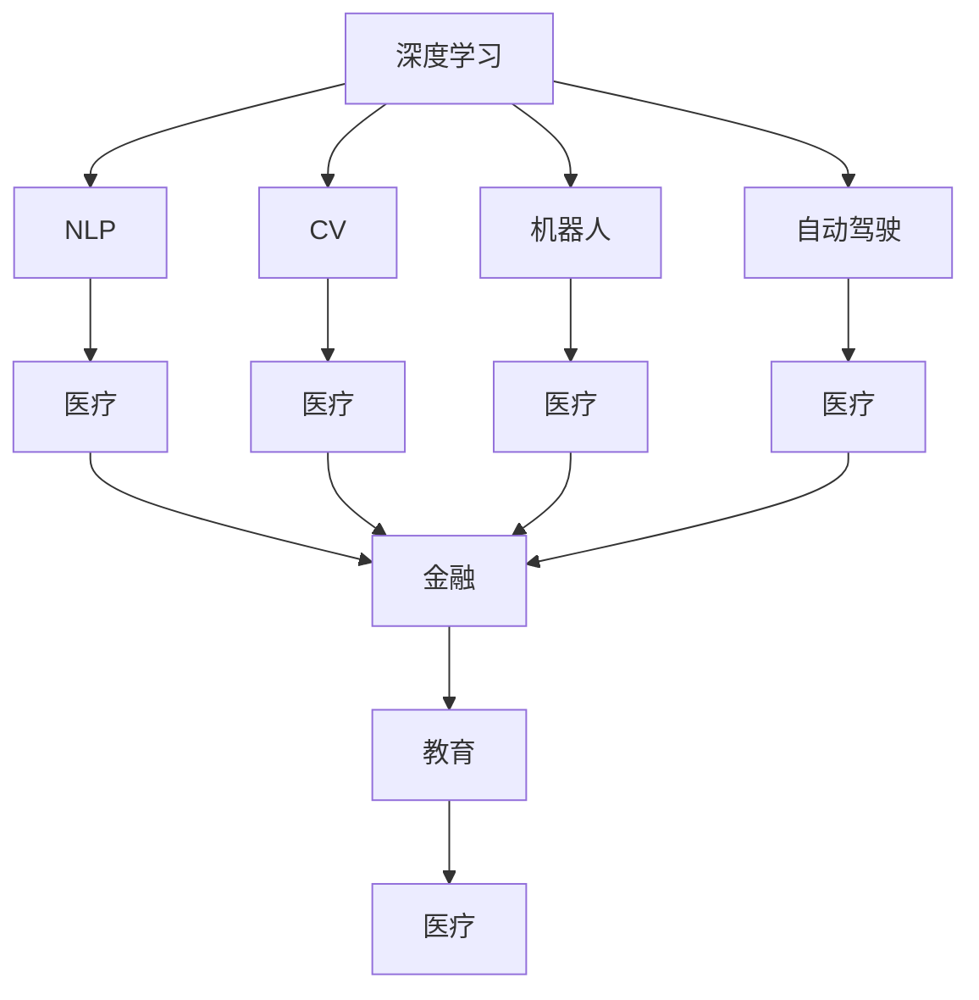

                 

# 李开复：AI 2.0 时代的应用

> 关键词：AI 2.0, 深度学习, 自然语言处理, 计算机视觉, 机器人, 自动驾驶, 医疗, 金融, 教育, 未来趋势, 应用前景

## 1. 背景介绍

### 1.1 问题由来
当前，人工智能（AI）技术正处于前所未有的发展阶段。从最早的专家系统、符号逻辑推理，到深度学习、大模型、自监督学习等先进技术，AI已经从边缘走向中心，逐渐成为各个行业的基础设施。特别是在李开复所提出的AI 2.0时代，AI技术已经不再局限于学术界，而是全面融入商业、医疗、教育、交通等领域，带来深刻的社会变革。

### 1.2 问题核心关键点
AI 2.0时代的重要特征是AI技术的广泛应用和普及。AI 2.0不仅关注算法的精度和效率，更强调AI技术在实际场景中的有效应用。AI 2.0的核心包括深度学习、自然语言处理（NLP）、计算机视觉（CV）、机器人、自动驾驶、医疗、金融、教育等多个领域的应用。AI 2.0的目标是通过高效、可靠、可解释的AI技术，解决现实世界中的实际问题，提升人类生活质量。

### 1.3 问题研究意义
了解和掌握AI 2.0时代的应用，对于开发者、研究者以及企业家来说都具有重要意义：
- 开发者可以更快地将AI技术应用于实际项目中，解决复杂问题。
- 研究者可以深入理解AI技术在实际应用中的挑战和潜力，推动技术的进一步发展。
- 企业家可以把握AI技术趋势，创新商业模式，提升市场竞争力。

## 2. 核心概念与联系

### 2.1 核心概念概述

为了更好地理解AI 2.0时代的应用，本节将介绍几个密切相关的核心概念：

- **深度学习（Deep Learning）**：一种基于神经网络的机器学习技术，通过多层次的非线性映射，实现对复杂数据的有效学习和表示。
- **自然语言处理（NLP）**：研究如何让计算机理解和处理自然语言的技术，包括语音识别、文本分类、机器翻译、情感分析等。
- **计算机视觉（CV）**：使计算机能够“看”和“理解”图像和视频的技术，包括图像识别、目标检测、图像生成等。
- **机器人**：结合AI、CV、NLP等多项技术，实现自主移动和操作，广泛应用于制造、服务、医疗等领域。
- **自动驾驶**：结合AI、CV、决策树等技术，实现车辆的自主导航和决策，提升交通安全和效率。
- **医疗**：利用AI技术进行疾病诊断、药物研发、个性化治疗等，提升医疗服务的质量和效率。
- **金融**：利用AI技术进行风险评估、欺诈检测、投资策略优化等，提升金融服务的精准性和可靠性。
- **教育**：利用AI技术进行个性化学习、智能辅导、课程推荐等，提升教育的可及性和质量。

这些核心概念之间的逻辑关系可以通过以下Mermaid流程图来展示：



这个流程图展示了几项关键AI技术的逻辑关系：

1. 深度学习是AI技术的基础。
2. NLP和CV是AI在自然语言和图像处理领域的具体应用。
3. 机器人、自动驾驶等AI技术在物理世界中的应用。
4. AI在医疗、金融、教育等多个领域的具体应用。

## 3. 核心算法原理 & 具体操作步骤

### 3.1 算法原理概述

AI 2.0时代的应用，主要基于深度学习等先进技术。其核心算法原理包括但不限于以下几个方面：

- **卷积神经网络（CNN）**：主要用于图像和视频处理，通过卷积操作提取局部特征，实现图像识别、目标检测等任务。
- **循环神经网络（RNN）**：主要用于处理序列数据，如时间序列、文本序列等，实现文本分类、机器翻译、语音识别等任务。
- **变换器（Transformer）**：一种基于自注意力机制的神经网络，主要用于处理序列数据，提升模型的并行性和效率，如BERT、GPT等预训练语言模型。
- **生成对抗网络（GAN）**：一种生成模型，通过生成器和判别器之间的对抗训练，实现图像生成、数据增强等任务。

### 3.2 算法步骤详解

AI 2.0时代的应用开发，一般包括以下几个关键步骤：

**Step 1: 数据准备和预处理**
- 收集和标注相关领域的数据集。
- 对数据进行清洗、归一化、划分等预处理，确保数据质量。
- 利用数据增强技术，扩充训练集，提升模型泛化能力。

**Step 2: 模型选择和初始化**
- 选择适合的深度学习模型，如CNN、RNN、Transformer等。
- 初始化模型参数，通常使用预训练模型进行迁移学习，加快模型训练。

**Step 3: 模型训练和优化**
- 设计合适的损失函数和优化器，如交叉熵损失、Adam优化器等。
- 使用梯度下降等优化算法，最小化损失函数。
- 监控训练过程中的指标，如准确率、损失、时间等，及时调整模型参数和训练策略。

**Step 4: 模型评估和部署**
- 在验证集和测试集上评估模型性能，对比微调前后的效果。
- 将模型部署到实际应用中，实现业务的自动化和智能化。
- 定期更新模型，保持其在不同场景下的适应性和稳定性。

### 3.3 算法优缺点

AI 2.0时代的应用，有以下优点：
- 高效性：深度学习算法能够快速处理和分析大量数据，提升模型训练速度。
- 可扩展性：AI技术可以应用于多种场景，具有广泛的应用前景。
- 灵活性：AI算法可以根据不同的需求进行调整和优化，适应复杂任务。

同时，也存在一些缺点：
- 数据依赖：深度学习模型对数据质量和高标注量要求较高，需要大量标注数据。
- 模型复杂：深度学习模型结构复杂，容易过拟合，需要合理选择模型和优化策略。
- 资源消耗：深度学习模型训练和推理需要高性能计算资源，成本较高。
- 解释性不足：深度学习模型通常是黑盒模型，难以解释其内部工作机制。

### 3.4 算法应用领域

AI 2.0时代的应用涵盖了多个领域，以下是几个典型应用场景：

- **自然语言处理（NLP）**：如聊天机器人、文本分类、情感分析、机器翻译等，提升了人机交互的智能化水平。
- **计算机视觉（CV）**：如图像识别、目标检测、人脸识别、图像生成等，拓展了计算机的视觉感知能力。
- **机器人**：如智能客服、自动化生产线、无人机等，提升了生产效率和服务质量。
- **自动驾驶**：如自动泊车、自动驾驶汽车、智能交通管理等，提升了交通安全和效率。
- **医疗**：如影像诊断、病历分析、智能问诊等，提升了医疗服务的精准性和效率。
- **金融**：如信用评分、欺诈检测、智能投顾等，提升了金融服务的可靠性和智能性。
- **教育**：如智能辅导、课程推荐、学生情感分析等，提升了教育的个性化和可及性。

这些应用场景展示了AI 2.0技术在各个领域中的广泛应用和深远影响。

## 4. 数学模型和公式 & 详细讲解 & 举例说明

### 4.1 数学模型构建

本节将使用数学语言对AI 2.0时代的应用进行更加严格的刻画。

假设有一个文本分类任务，输入为文本序列 $\mathbf{x}=\{x_1, x_2, ..., x_n\}$，输出为分类标签 $\mathbf{y}=\{y_1, y_2, ..., y_n\}$。设文本向量化后得到的词嵌入矩阵为 $\mathbf{X} \in \mathbb{R}^{n \times d}$，分类标签向量为 $\mathbf{Y} \in \mathbb{R}^{n \times c}$，其中 $c$ 为分类数。

定义模型 $M_{\theta}:\mathbb{R}^{n \times d} \rightarrow \mathbb{R}^{n \times c}$，其中 $\theta$ 为模型参数。在训练集 $\mathcal{D}$ 上，最小化经验风险 $\mathcal{L}(\theta)$，即：

$$
\mathcal{L}(\theta) = \frac{1}{N} \sum_{i=1}^N \ell(M_{\theta}(\mathbf{x}_i), y_i)
$$

其中 $\ell$ 为损失函数，如交叉熵损失。

### 4.2 公式推导过程

以交叉熵损失函数为例，推导其数学公式。设模型在文本序列 $\mathbf{x}_i$ 上的输出为 $\mathbf{p}_i = M_{\theta}(\mathbf{x}_i) \in \mathbb{R}^{c}$，则交叉熵损失函数为：

$$
\ell(M_{\theta}(\mathbf{x}_i), y_i) = -\frac{1}{N} \sum_{i=1}^N \sum_{j=1}^c p_{i,j} \log \frac{p_{i,j}}{y_{i,j}}
$$

将其代入经验风险公式，得：

$$
\mathcal{L}(\theta) = -\frac{1}{N} \sum_{i=1}^N \sum_{j=1}^c p_{i,j} \log \frac{p_{i,j}}{y_{i,j}}
$$

通过反向传播算法，求出模型参数 $\theta$ 的梯度，带入优化器更新参数，完成模型的训练。

### 4.3 案例分析与讲解

以自然语言处理中的情感分析为例，展示AI 2.0技术的应用。假设有一个情感分类任务，输入为一句话，输出为正面、中性或负面情感。设文本向量化后得到的词嵌入矩阵为 $\mathbf{X} \in \mathbb{R}^{n \times d}$，情感分类矩阵为 $\mathbf{Y} \in \mathbb{R}^{n \times 3}$，其中 $n$ 为句子长度，$d$ 为词嵌入维度，$3$ 为情感分类数。

假设模型为 Transformer 网络，设 $\mathbf{X} = M_{\theta}(\mathbf{X})$，其中 $\theta$ 为模型参数。在训练集 $\mathcal{D}$ 上，最小化经验风险 $\mathcal{L}(\theta)$，即：

$$
\mathcal{L}(\theta) = \frac{1}{N} \sum_{i=1}^N \ell(M_{\theta}(\mathbf{x}_i), y_i)
$$

其中 $\ell$ 为交叉熵损失函数。

## 5. 项目实践：代码实例和详细解释说明

### 5.1 开发环境搭建

在进行AI 2.0时代的应用开发前，我们需要准备好开发环境。以下是使用Python进行TensorFlow和PyTorch开发的环境配置流程：

1. 安装Anaconda：从官网下载并安装Anaconda，用于创建独立的Python环境。

2. 创建并激活虚拟环境：
```bash
conda create -n ai2-env python=3.8 
conda activate ai2-env
```

3. 安装TensorFlow：根据CUDA版本，从官网获取对应的安装命令。例如：
```bash
conda install tensorflow -c pytorch -c conda-forge
```

4. 安装PyTorch：根据CUDA版本，从官网获取对应的安装命令。例如：
```bash
conda install pytorch torchvision torchaudio cudatoolkit=11.1 -c pytorch -c conda-forge
```

5. 安装各类工具包：
```bash
pip install numpy pandas scikit-learn matplotlib tqdm jupyter notebook ipython
```

完成上述步骤后，即可在`ai2-env`环境中开始AI 2.0时代的应用实践。

### 5.2 源代码详细实现

下面我们以计算机视觉中的图像分类任务为例，给出使用TensorFlow和PyTorch进行深度学习模型训练的PyTorch代码实现。

首先，定义图像分类任务的数据处理函数：

```python
import numpy as np
import tensorflow as tf
from tensorflow.keras import layers

def preprocess_image(image):
    image = tf.image.convert_image_dtype(image, tf.float32) / 255.0
    image = tf.image.resize(image, (224, 224))
    image -= np.mean(image)
    image /= np.std(image)
    return image

train_dataset = tf.keras.preprocessing.image_dataset_from_directory(
    "train/",
    validation_split=0.2,
    subset="training",
    seed=123,
    image_size=(224, 224),
    batch_size=32
)

val_dataset = tf.keras.preprocessing.image_dataset_from_directory(
    "train/",
    validation_split=0.2,
    subset="validation",
    seed=123,
    image_size=(224, 224),
    batch_size=32
)

test_dataset = tf.keras.preprocessing.image_dataset_from_directory(
    "test/",
    image_size=(224, 224),
    batch_size=32
)
```

然后，定义模型和优化器：

```python
from tensorflow.keras import models, layers

model = models.Sequential()
model.add(layers.Conv2D(32, (3, 3), activation='relu', input_shape=(224, 224, 3)))
model.add(layers.MaxPooling2D((2, 2)))
model.add(layers.Conv2D(64, (3, 3), activation='relu'))
model.add(layers.MaxPooling2D((2, 2)))
model.add(layers.Conv2D(128, (3, 3), activation='relu'))
model.add(layers.MaxPooling2D((2, 2)))
model.add(layers.Flatten())
model.add(layers.Dense(256, activation='relu'))
model.add(layers.Dense(10, activation='softmax'))

optimizer = tf.keras.optimizers.Adam(learning_rate=0.001)
```

接着，定义训练和评估函数：

```python
from tensorflow.keras import metrics

@tf.function
def train_step(images, labels):
    with tf.GradientTape() as tape:
        logits = model(images)
        loss = tf.keras.losses.categorical_crossentropy(labels, logits)
    gradients = tape.gradient(loss, model.trainable_variables)
    optimizer.apply_gradients(zip(gradients, model.trainable_variables))
    return loss

@tf.function
def evaluate_step(images, labels):
    logits = model(images)
    predictions = tf.argmax(logits, axis=1)
    accuracy = tf.metrics.Accuracy(labels, predictions)
    return accuracy

@tf.function
def evaluate_loss(images, labels):
    logits = model(images)
    loss = tf.keras.losses.categorical_crossentropy(labels, logits)
    return loss

for epoch in range(10):
    for batch, (images, labels) in enumerate(train_dataset):
        loss = train_step(images, labels)
        if batch % 10 == 0:
            val_loss = evaluate_loss(val_dataset)
            val_accuracy = evaluate_step(val_dataset)
            test_loss = evaluate_loss(test_dataset)
            test_accuracy = evaluate_step(test_dataset)
            print(f"Epoch {epoch+1}, Batch {batch+1}/{len(train_dataset)}, Loss: {loss.numpy():.4f}, Val Loss: {val_loss.numpy():.4f}, Val Accuracy: {val_accuracy.numpy():.4f}, Test Loss: {test_loss.numpy():.4f}, Test Accuracy: {test_accuracy.numpy():.4f}")
```

以上就是使用TensorFlow和PyTorch进行图像分类任务训练的完整代码实现。可以看到，得益于深度学习框架的强大封装，我们能够快速构建和训练深度学习模型，实现复杂的图像分类任务。

### 5.3 代码解读与分析

让我们再详细解读一下关键代码的实现细节：

**图像分类数据处理函数**：
- 使用`tf.image.convert_image_dtype`将图像转换为浮点型，并进行归一化。
- 使用`tf.image.resize`将图像缩放为224x224大小。
- 使用`np.mean`和`np.std`对图像进行中心化和标准化。

**模型定义和初始化**：
- 使用`tf.keras.Sequential`构建序列模型，添加卷积层、池化层、全连接层等。
- 定义优化器，如Adam优化器。

**训练和评估函数**：
- 定义训练步和评估步，分别计算损失和精度。
- 使用`tf.GradientTape`记录梯度，并使用`optimizer.apply_gradients`更新模型参数。
- 定义评估函数，计算损失和精度。
- 在每个epoch的每个batch上，计算损失和精度，并打印输出。

## 6. 实际应用场景

### 6.1 智能客服系统

AI 2.0时代的应用，已经深入到日常生活的各个方面。智能客服系统是一个典型的应用场景。通过使用自然语言处理技术，智能客服系统能够自动处理客户咨询，解答常见问题，提升客户体验。

在技术实现上，可以收集企业内部的历史客服对话记录，将问题和最佳答复构建成监督数据，在此基础上对预训练语言模型进行微调。微调后的对话模型能够自动理解用户意图，匹配最合适的答案模板进行回复。对于客户提出的新问题，还可以接入检索系统实时搜索相关内容，动态组织生成回答。如此构建的智能客服系统，能大幅提升客户咨询体验和问题解决效率。

### 6.2 金融舆情监测

金融机构需要实时监测市场舆论动向，以便及时应对负面信息传播，规避金融风险。传统的人工监测方式成本高、效率低，难以应对网络时代海量信息爆发的挑战。利用AI 2.0技术，金融舆情监测可以变得更加智能化、自动化。

具体而言，可以收集金融领域相关的新闻、报道、评论等文本数据，并对其进行主题标注和情感标注。在此基础上对预训练语言模型进行微调，使其能够自动判断文本属于何种主题，情感倾向是正面、中性还是负面。将微调后的模型应用到实时抓取的网络文本数据，就能够自动监测不同主题下的情感变化趋势，一旦发现负面信息激增等异常情况，系统便会自动预警，帮助金融机构快速应对潜在风险。

### 6.3 个性化推荐系统

当前的推荐系统往往只依赖用户的历史行为数据进行物品推荐，无法深入理解用户的真实兴趣偏好。利用AI 2.0技术，个性化推荐系统可以更好地挖掘用户行为背后的语义信息，从而提供更精准、多样的推荐内容。

在实践中，可以收集用户浏览、点击、评论、分享等行为数据，提取和用户交互的物品标题、描述、标签等文本内容。将文本内容作为模型输入，用户的后续行为（如是否点击、购买等）作为监督信号，在此基础上微调预训练语言模型。微调后的模型能够从文本内容中准确把握用户的兴趣点。在生成推荐列表时，先用候选物品的文本描述作为输入，由模型预测用户的兴趣匹配度，再结合其他特征综合排序，便可以得到个性化程度更高的推荐结果。

### 6.4 未来应用展望

随着AI 2.0技术的不断进步，AI 2.0时代的应用将展现出更加广阔的前景。未来，AI 2.0技术将在更多领域得到应用，为人类生活带来深刻变革。

在智慧医疗领域，基于AI 2.0的医疗问答、病历分析、智能问诊等应用将提升医疗服务的智能化水平，辅助医生诊疗，加速新药开发进程。

在智能教育领域，利用AI 2.0技术进行个性化学习、智能辅导、课程推荐等，将提升教育的可及性和质量，因材施教，促进教育公平。

在智慧城市治理中，AI 2.0技术将用于城市事件监测、舆情分析、应急指挥等环节，提高城市管理的自动化和智能化水平，构建更安全、高效的未来城市。

此外，在企业生产、社会治理、文娱传媒等众多领域，AI 2.0技术也将不断涌现，为经济社会发展注入新的动力。相信随着技术的日益成熟，AI 2.0技术必将在更广阔的应用领域大放异彩，深刻影响人类的生产生活方式。

## 7. 工具和资源推荐

### 7.1 学习资源推荐

为了帮助开发者系统掌握AI 2.0时代的应用理论基础和实践技巧，这里推荐一些优质的学习资源：

1. 《深度学习》（Deep Learning）：Ian Goodfellow、Yoshua Bengio、Aaron Courville合著的经典教材，全面介绍了深度学习的基本概念、算法原理和实际应用。
2. 《Python深度学习》（Python Deep Learning）：Francois Chollet撰写的实战指南，涵盖深度学习在图像、文本、序列等领域的应用。
3. 《动手学深度学习》（Dive Into Deep Learning）：李沐等人编写的高质量教材，结合PaddlePaddle实现深度学习算法和应用。
4. 《自然语言处理综论》（Speech and Language Processing）：Daniel Jurafsky、James H. Martin合著的NLP经典教材，涵盖NLP的各个方面，包括语言模型、NLP应用等。
5. 《计算机视觉：算法与应用》（Computer Vision: Algorithms, Applications, and Machine Learning）：Jürgen Schmidhuber等编著的视觉处理教材，涵盖计算机视觉的各个方面，包括图像处理、目标检测等。

通过对这些资源的学习实践，相信你一定能够快速掌握AI 2.0时代的应用精髓，并用于解决实际的AI问题。

### 7.2 开发工具推荐

高效的开发离不开优秀的工具支持。以下是几款用于AI 2.0时代应用开发的常用工具：

1. TensorFlow：由Google主导开发的开源深度学习框架，生产部署方便，适合大规模工程应用。
2. PyTorch：由Facebook开发的开源深度学习框架，灵活动态的计算图，适合快速迭代研究。
3. JAX：由Google开发的可微分编程库，支持自动求导和向量图编程，适用于深度学习研究。
4. MXNet：由Apache支持的深度学习框架，高效灵活，适用于分布式训练。
5. FastAI：基于PyTorch的高层次深度学习库，封装了深度学习模型和算法，易于上手。
6. HuggingFace Transformers库：提供丰富的预训练模型和API，方便NLP任务的开发。

合理利用这些工具，可以显著提升AI 2.0时代的应用开发效率，加快创新迭代的步伐。

### 7.3 相关论文推荐

AI 2.0时代的应用研究源于学界的持续研究。以下是几篇奠基性的相关论文，推荐阅读：

1. "ImageNet Classification with Deep Convolutional Neural Networks"（使用深度卷积神经网络进行ImageNet分类）：Alex Krizhevsky等人发表的图像分类经典论文，引入了深度卷积神经网络，提升了图像分类的精度。
2. "Convolutional Neural Networks for Visual Recognition"（卷积神经网络用于视觉识别）：Geoffrey Hinton等人发表的视觉识别经典论文，提出了卷积神经网络结构，提升了视觉识别的效果。
3. "Attention is All You Need"（注意力机制）：Ashish Vaswani等人发表的Transformer论文，提出自注意力机制，提升了序列数据处理的效率和效果。
4. "BERT: Pre-training of Deep Bidirectional Transformers for Language Understanding"（BERT：双向转换器的语言理解预训练）：Jacob Devlin等人发表的预训练语言模型经典论文，提出了BERT模型，提升了自然语言处理的精度。
5. "GPT-3: Language Models are Unsupervised Multitask Learners"（GPT-3：自监督多任务学习）：OpenAI发表的GPT-3模型论文，展示了预训练语言模型的零样本和少样本学习能力。

这些论文代表了大语言模型和深度学习技术的发展脉络。通过学习这些前沿成果，可以帮助研究者把握学科前进方向，推动技术的进一步发展。

## 8. 总结：未来发展趋势与挑战

### 8.1 总结

本文对AI 2.0时代的应用进行了全面系统的介绍。首先阐述了AI 2.0时代的应用背景和意义，明确了深度学习、自然语言处理、计算机视觉等多项AI技术的广泛应用。其次，从原理到实践，详细讲解了AI 2.0时代应用的数学模型和算法实现，给出了代码实例和详细解释。同时，本文还探讨了AI 2.0技术在多个行业领域的应用前景，展示了AI 2.0技术的广阔前景。最后，推荐了相关学习资源、开发工具和前沿论文，力求为读者提供全方位的技术指引。

通过本文的系统梳理，可以看到，AI 2.0技术正在成为各行各业的重要基础设施，极大地提升了各行各业的智能化水平。未来，随着AI 2.0技术的不断进步，AI 2.0技术必将在更多领域得到应用，深刻影响人类的生产生活方式。

### 8.2 未来发展趋势

展望未来，AI 2.0技术将呈现以下几个发展趋势：

1. 模型规模持续增大。随着算力成本的下降和数据规模的扩张，深度学习模型的参数量还将持续增长。超大规模模型蕴含的丰富知识，有望支撑更加复杂多变的下游任务。
2. 模型泛化能力增强。深度学习模型将在更多领域得到应用，并逐步提高对各种场景的泛化能力。
3. 跨模态融合。深度学习模型将更多地与计算机视觉、语音识别等技术结合，实现多模态数据的协同建模。
4. 智能与自动化结合。AI 2.0技术将在更多场景中与自动化技术结合，提升效率和可靠性。
5. 自动化超参数优化。自动化超参数优化技术将得到广泛应用，提升模型训练的效率和效果。
6. 自适应和可解释性增强。AI 2.0技术将进一步增强自适应和可解释性，提升模型的透明性和可靠性。

以上趋势凸显了AI 2.0技术的广阔前景。这些方向的探索发展，必将进一步提升AI 2.0技术的性能和应用范围，为人类社会带来更加深刻的影响。

### 8.3 面临的挑战

尽管AI 2.0技术已经取得了瞩目成就，但在迈向更加智能化、普适化应用的过程中，它仍面临诸多挑战：

1. 数据依赖。深度学习模型对数据质量和高标注量要求较高，需要大量标注数据，数据获取和标注成本较高。
2. 模型复杂。深度学习模型结构复杂，容易过拟合，需要合理选择模型和优化策略。
3. 计算资源消耗。深度学习模型训练和推理需要高性能计算资源，成本较高。
4. 模型解释性不足。深度学习模型通常是黑盒模型，难以解释其内部工作机制，缺乏可解释性和透明性。
5. 安全性问题。深度学习模型可能学习到有害信息，导致安全问题，需要加强安全防护。
6. 伦理道德问题。深度学习模型可能带来偏见和歧视，需要建立伦理导向的评估指标。

这些挑战亟需解决，才能更好地推广和应用AI 2.0技术。唯有在数据、算法、伦理等多方面共同努力，才能让AI 2.0技术真正落地应用，造福人类社会。

### 8.4 研究展望

面向未来，AI 2.0技术的研究需要在以下几个方面寻求新的突破：

1. 数据高效获取和标注。探索无监督和半监督学习技术，降低数据依赖和标注成本。
2. 模型高效训练和推理。开发高效的模型架构和优化算法，提升模型训练和推理效率。
3. 模型可解释性增强。研究可解释性AI技术，提升模型的透明性和可靠性。
4. 跨模态和多模态融合。研究跨模态和多模态数据的协同建模技术，提升模型的泛化能力。
5. 自动化和自适应。研究自动化超参数优化和自适应学习技术，提升模型的自适应能力和自动化水平。
6. 伦理和社会影响。研究伦理导向的AI技术，确保模型的公平性和透明度，推动AI技术的健康发展。

这些研究方向的探索，必将引领AI 2.0技术迈向更高的台阶，为人类社会带来更加深刻的变革。面向未来，AI 2.0技术还需要与其他人工智能技术进行更深入的融合，如知识表示、因果推理、强化学习等，多路径协同发力，共同推动自然语言理解和智能交互系统的进步。只有勇于创新、敢于突破，才能不断拓展AI 2.0技术的边界，让智能技术更好地造福人类社会。

## 9. 附录：常见问题与解答

**Q1：AI 2.0时代的应用是否依赖于大量的标注数据？**

A: AI 2.0时代的应用，尤其是深度学习模型，对标注数据的质量和数量要求较高。但随着无监督学习和半监督学习的不断发展，AI 2.0技术已经开始尝试通过自监督学习等方式，降低对标注数据的依赖。未来，AI 2.0技术有望在标注数据不足的场景中取得更好的效果。

**Q2：如何优化AI 2.0时代的应用性能？**

A: AI 2.0时代的应用性能优化可以从多个方面入手：
1. 选择合适的模型和优化器，如Transformer、AdamW等。
2. 数据增强和数据预处理，扩充训练集，提升模型泛化能力。
3. 正则化技术和对抗训练，避免过拟合。
4. 模型裁剪和量化，减少计算资源消耗，提升推理速度。
5. 自动化超参数优化，提升模型训练效率。
6. 跨模态和多模态融合，提升模型泛化能力。

**Q3：AI 2.0时代的应用面临哪些伦理道德问题？**

A: AI 2.0时代的应用在提升智能化水平的同时，也带来了一些伦理道德问题，如数据隐私、偏见歧视、决策透明等。未来，AI 2.0技术需要在设计、开发和部署过程中，引入伦理导向的评估指标，确保模型的公平性和透明度，推动AI技术的健康发展。

**Q4：AI 2.0时代的应用如何在数据依赖较小的场景中取得较好效果？**

A: AI 2.0时代的应用可以在数据依赖较小的场景中，通过自监督学习、无监督学习和半监督学习等方式取得较好效果。例如，利用预训练模型进行迁移学习，在有限的标注数据上微调模型。同时，也可以通过生成对抗网络等方式，生成更多的训练数据，提升模型泛化能力。

通过以上对AI 2.0时代应用的深入探讨，可以看出AI 2.0技术已经深入到各行各业，带来了深刻的变革。未来，随着AI 2.0技术的不断进步，AI 2.0技术必将在更广阔的领域得到应用，深刻影响人类的生产生活方式。希望本文能为广大开发者和研究者提供有益的参考，推动AI 2.0技术的不断发展和应用。

---

作者：禅与计算机程序设计艺术 / Zen and the Art of Computer Programming

