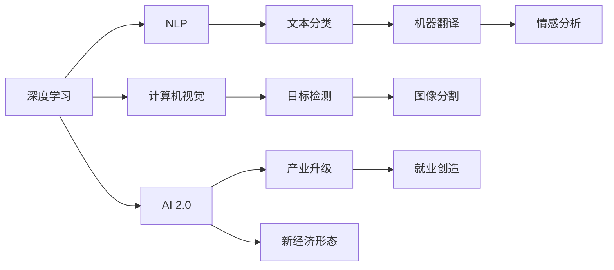

                 

# 李开复：AI 2.0 时代的投资价值

## 1. 背景介绍

在科技快速发展的今天，人工智能（AI）已经成为了引领未来科技浪潮的关键力量。尤其是在AI 2.0时代，AI技术正从早期的科学研究阶段走向应用实践阶段，带来了广泛的产业变革和巨大的投资价值。本文将深入探讨AI 2.0时代的投资价值，并揭示其背后的核心技术和应用场景。

## 2. 核心概念与联系

### 2.1 核心概念概述

在讨论AI 2.0时代的投资价值之前，我们首先需要理解一些核心概念，包括：

- **AI 2.0时代**：继AI 1.0时代的基于规则、符号化的AI系统之后，AI 2.0时代引入了深度学习、自然语言处理、计算机视觉等技术，实现了自主学习和复杂决策能力的突破。
- **深度学习**：一种模拟人脑神经网络结构的机器学习技术，通过多层神经网络进行特征提取和模式识别。
- **自然语言处理（NLP）**：让机器能够理解和生成人类语言的AI技术，涉及文本分类、机器翻译、情感分析等任务。
- **计算机视觉**：让机器能够“看”和“理解”图像和视频内容的AI技术，包括目标检测、图像分割、人脸识别等应用。
- **投资价值**：指AI技术带来的经济和社会价值，包括产业升级、就业创造、新经济形态等。

### 2.2 核心概念联系

这些核心概念之间相互关联，共同构成了AI 2.0时代的技术生态。深度学习技术为NLP和计算机视觉等应用提供了基础，而AI 2.0时代的广泛应用则创造了巨大的投资价值。下面通过一个Mermaid流程图展示这些概念之间的联系：



## 3. 核心算法原理 & 具体操作步骤

### 3.1 算法原理概述

AI 2.0时代的核心算法原理主要包括深度学习、自然语言处理和计算机视觉三个方面。以下是这些算法的基本原理和步骤：

- **深度学习**：通过多层神经网络对输入数据进行特征提取和分类。基本步骤包括数据预处理、模型设计、前向传播、反向传播和模型优化。
- **自然语言处理**：包括词嵌入、句子向量化、情感分析等步骤。其中，词嵌入（如Word2Vec）将单词映射到高维向量空间，用于计算语义相似度。
- **计算机视觉**：通过卷积神经网络（CNN）对图像进行特征提取和分类。基本步骤包括数据预处理、模型设计、前向传播和反向传播。

### 3.2 算法步骤详解

以深度学习为例，下面是详细的算法步骤：

1. **数据预处理**：将原始数据转换为适合模型输入的格式，如归一化、标准化、填充等。
2. **模型设计**：设计多层神经网络结构，包括输入层、隐藏层和输出层。
3. **前向传播**：将输入数据输入模型，通过神经网络进行特征提取和计算。
4. **反向传播**：计算损失函数，并根据梯度下降算法更新模型参数。
5. **模型优化**：通过调整学习率、正则化等参数，优化模型性能。

### 3.3 算法优缺点

- **优点**：
  - 强大的自主学习能力，可以处理复杂的多层次特征。
  - 在处理大规模数据时表现优异，可以显著提高效率。
  - 应用领域广泛，从自然语言处理到计算机视觉都有广泛应用。

- **缺点**：
  - 需要大量的训练数据和计算资源，成本较高。
  - 模型的可解释性较差，难以理解和解释其决策过程。
  - 对噪声和异常数据敏感，容易过拟合。

### 3.4 算法应用领域

深度学习、自然语言处理和计算机视觉等算法在多个领域都有广泛应用：

- **医疗**：通过图像识别技术辅助诊断疾病，提高诊断准确率。
- **金融**：利用自然语言处理技术分析文本数据，进行风险评估和投资决策。
- **零售**：通过计算机视觉技术进行商品识别和库存管理，优化供应链。
- **自动驾驶**：利用计算机视觉和深度学习技术进行图像识别和决策，实现自动驾驶。

## 4. 数学模型和公式 & 详细讲解 & 举例说明

### 4.1 数学模型构建

在AI 2.0时代，数学模型通常包括深度学习模型、NLP模型和计算机视觉模型。这里以深度学习模型为例，介绍模型的数学构建。

深度学习模型的基本数学模型包括神经网络、损失函数和优化算法。

- **神经网络**：由多个神经元（神经节点）和连接它们的边组成，用于计算输入数据的特征表示。
- **损失函数**：用于衡量模型预测值和真实值之间的差异，如均方误差（MSE）和交叉熵损失（Cross-Entropy Loss）。
- **优化算法**：如梯度下降算法、Adam算法等，用于调整模型参数，最小化损失函数。

### 4.2 公式推导过程

以深度学习模型为例，推导一下反向传播算法的基本公式：

1. **前向传播**：
   $$
   z^{[l]} = W^{[l]}a^{[l-1]} + b^{[l]}
   $$
   $$
   a^{[l]} = g(z^{[l]})
   $$
   其中，$W^{[l]}$ 是权重矩阵，$b^{[l]}$ 是偏置向量，$g(z)$ 是激活函数，$a^{[l]}$ 是输出向量。

2. **计算梯度**：
   $$
   \frac{\partial L}{\partial W^{[l]}} = \frac{\partial L}{\partial z^{[l]}}\frac{\partial z^{[l]}}{\partial W^{[l]}}
   $$
   $$
   \frac{\partial L}{\partial b^{[l]}} = \frac{\partial L}{\partial z^{[l]}}
   $$
   $$
   \frac{\partial L}{\partial a^{[l-1]}} = \frac{\partial L}{\partial z^{[l]}}\frac{\partial z^{[l]}}{\partial a^{[l-1]}}
   $$

3. **反向传播**：
   $$
   \Delta z^{[l]} = \frac{\partial L}{\partial z^{[l]}}
   $$
   $$
   \Delta a^{[l]} = \Delta z^{[l]}g'(z^{[l]})
   $$
   $$
   \Delta W^{[l]} = \Delta a^{[l]T}a^{[l-1]}
   $$
   $$
   \Delta b^{[l]} = \Delta a^{[l]}
   $$
   其中，$\Delta z^{[l]}$ 是梯度，$\Delta a^{[l]}$ 是输出误差，$\Delta W^{[l]}$ 是权重更新量。

4. **更新参数**：
   $$
   W^{[l]} \leftarrow W^{[l]} - \eta\Delta W^{[l]}
   $$
   $$
   b^{[l]} \leftarrow b^{[l]} - \eta\Delta b^{[l]}
   $$
   其中，$\eta$ 是学习率。

### 4.3 案例分析与讲解

以图像识别为例，讲解如何使用卷积神经网络（CNN）进行图像分类：

1. **数据预处理**：将图像数据归一化，填充到指定大小。
2. **模型设计**：设计卷积层、池化层、全连接层等结构。
3. **前向传播**：将图像输入模型，通过卷积层和全连接层进行特征提取和分类。
4. **反向传播**：计算损失函数，并根据梯度下降算法更新模型参数。
5. **模型优化**：通过调整学习率、正则化等参数，优化模型性能。

## 5. 项目实践：代码实例和详细解释说明

### 5.1 开发环境搭建

要进行AI 2.0项目的实践，首先需要搭建好开发环境。以下是一些关键步骤：

1. **安装Python和相关库**：
   ```bash
   conda create --name ai2
   conda activate ai2
   pip install torch torchvision numpy scikit-learn
   ```

2. **安装深度学习框架**：
   ```bash
   pip install tensorflow
   ```

3. **安装机器学习库**：
   ```bash
   pip install scikit-learn
   ```

### 5.2 源代码详细实现

以图像分类为例，下面是使用TensorFlow进行卷积神经网络实现的代码：

```python
import tensorflow as tf
from tensorflow.keras import layers

# 定义卷积神经网络模型
model = tf.keras.Sequential([
    layers.Conv2D(32, (3, 3), activation='relu', input_shape=(28, 28, 1)),
    layers.MaxPooling2D((2, 2)),
    layers.Conv2D(64, (3, 3), activation='relu'),
    layers.MaxPooling2D((2, 2)),
    layers.Conv2D(64, (3, 3), activation='relu'),
    layers.Flatten(),
    layers.Dense(64, activation='relu'),
    layers.Dense(10, activation='softmax')
])

# 编译模型
model.compile(optimizer='adam',
              loss='sparse_categorical_crossentropy',
              metrics=['accuracy'])

# 训练模型
model.fit(train_images, train_labels, epochs=5)

# 评估模型
test_loss, test_acc = model.evaluate(test_images, test_labels)
print('Test accuracy:', test_acc)
```

### 5.3 代码解读与分析

上述代码实现了一个简单的卷积神经网络模型，用于对手写数字进行分类。以下是一些关键点的解释：

1. **模型定义**：使用Sequential模型定义了卷积层、池化层和全连接层等结构。
2. **编译模型**：使用adam优化器和交叉熵损失函数进行模型编译。
3. **训练模型**：使用fit函数对模型进行训练，指定训练轮数为5。
4. **评估模型**：使用evaluate函数对模型进行评估，并输出测试准确率。

## 6. 实际应用场景

### 6.1 医疗影像分析

在医疗影像分析中，AI 2.0技术可以用于辅助医生进行疾病诊断。通过深度学习模型对医疗影像进行特征提取和分类，可以大幅提高诊断准确率。

以肺部CT图像识别为例，使用卷积神经网络模型进行肺癌筛查，可以帮助医生快速识别出疑似病例，提高诊断效率。

### 6.2 金融风险预测

在金融领域，AI 2.0技术可以用于风险预测和欺诈检测。利用自然语言处理技术分析金融报告和新闻，可以提前识别风险信号，保护投资者的利益。

例如，使用NLP技术分析新闻和市场报告，结合机器学习模型进行情感分析，可以预测股票市场的走势和风险。

### 6.3 零售库存管理

在零售行业，AI 2.0技术可以用于库存管理和供应链优化。通过计算机视觉技术对商品进行识别和分类，可以实时监测库存情况，优化供应链管理。

例如，使用图像识别技术对商品进行分类，结合机器学习模型进行需求预测，可以实现自动补货和库存优化。

### 6.4 未来应用展望

随着AI 2.0技术的不断发展，未来将有更多领域受益于AI技术，以下是一些可能的应用场景：

- **自动驾驶**：利用计算机视觉和深度学习技术进行图像识别和决策，实现自动驾驶。
- **智能家居**：通过自然语言处理技术实现语音识别和智能控制，提升家居智能化水平。
- **个性化推荐**：利用机器学习技术进行用户行为分析，实现个性化推荐服务，提升用户体验。
- **智慧城市**：通过AI技术进行城市监控、交通管理和能源优化，提升城市管理效率。

## 7. 工具和资源推荐

### 7.1 学习资源推荐

要全面掌握AI 2.0技术，需要系统学习相关知识，以下是一些推荐的资源：

1. **深度学习课程**：斯坦福大学的CS231n课程，涵盖了计算机视觉的深度学习基础。
2. **自然语言处理课程**：MIT的6.863课程，涵盖了自然语言处理的基本技术和应用。
3. **机器学习书籍**：《深度学习》（Ian Goodfellow），系统介绍了深度学习的基本概念和应用。
4. **AI 2.0论文**：阅读最新的AI 2.0论文，了解前沿技术和应用。
5. **开源项目**：参与开源项目，如TensorFlow、PyTorch等，积累实践经验。

### 7.2 开发工具推荐

以下是一些推荐的开发工具：

1. **深度学习框架**：TensorFlow、PyTorch等，提供强大的深度学习模型训练和推理功能。
2. **自然语言处理库**：NLTK、SpaCy等，提供自然语言处理的基本功能和工具。
3. **计算机视觉库**：OpenCV、Pillow等，提供图像处理和计算机视觉的基本功能。
4. **开发环境**：Jupyter Notebook、PyCharm等，提供代码编写和调试环境。
5. **数据集**：ImageNet、COCO等，提供大规模数据集和预训练模型。

### 7.3 相关论文推荐

以下是一些推荐的AI 2.0领域的经典论文：

1. **深度学习**：
   - AlexNet：ImageNet Large Scale Visual Recognition Challenge（ILSVRC）2012特等奖论文。
   - VGGNet：Caffe使用VGGNet模型取得ImageNet分类比赛优异成绩。
   - ResNet：Deep Residual Learning for Image Recognition（CVPR2016）。

2. **自然语言处理**：
   - BERT：BERT: Pre-training of Deep Bidirectional Transformers for Language Understanding。
   - GPT-3：Language Models are Unsupervised Multitask Learners（NeurIPS2018）。

3. **计算机视觉**：
   - YOLO：You Only Look Once: Real-Time Object Detection（CVPR2016）。
   - SSD：Single Shot MultiBox Detector（ECCV2016）。

## 8. 总结：未来发展趋势与挑战

### 8.1 研究成果总结

AI 2.0时代已经取得了诸多重要的研究成果，包括深度学习、自然语言处理和计算机视觉等技术，这些技术已经广泛应用于医疗、金融、零售、自动驾驶等多个领域。AI 2.0技术的不断进步，推动了产业升级和经济发展，带来了巨大的投资价值。

### 8.2 未来发展趋势

未来，AI 2.0技术将呈现以下发展趋势：

1. **跨领域融合**：AI 2.0技术将与其他技术（如区块链、物联网等）进行更深层次的融合，形成更广泛的生态系统。
2. **伦理和隐私**：随着AI技术的广泛应用，伦理和隐私问题将受到更多的关注，AI技术将更加注重透明性和可解释性。
3. **实时性和边缘计算**：为了适应实时应用场景，AI技术将更多地应用于边缘计算和实时推理。
4. **大规模定制化**：AI技术将实现更灵活的定制化，满足不同行业和应用的需求。

### 8.3 面临的挑战

尽管AI 2.0技术已经取得了巨大进步，但在其发展过程中仍面临一些挑战：

1. **数据隐私和安全**：如何保护数据隐私和安全性，是AI技术面临的一个重要问题。
2. **算法透明性和可解释性**：AI模型的决策过程难以解释，增加了应用风险。
3. **计算资源消耗**：AI技术需要大量计算资源，带来了成本和能耗问题。
4. **伦理和公平性**：AI技术可能带来伦理和公平性问题，如偏见、歧视等。

### 8.4 研究展望

未来，AI 2.0技术需要在以下几个方面进行深入研究：

1. **隐私保护**：发展隐私保护技术，如联邦学习、差分隐私等，保护数据隐私。
2. **算法透明性**：发展可解释性AI技术，提高AI模型的透明性和可解释性。
3. **高效计算**：发展高效计算技术，如GPU、TPU等，优化计算效率。
4. **伦理和公平性**：发展伦理和公平性技术，消除AI技术的偏见和歧视问题。

## 9. 附录：常见问题与解答

**Q1：AI 2.0技术是否会取代人类？**

A: AI 2.0技术虽然具有强大的自主学习能力，但仍然需要人类的监督和指导。在决策过程中，AI技术需要结合人类的知识和经验，才能更好地发挥作用。

**Q2：AI 2.0技术对就业市场的影响？**

A: AI 2.0技术的发展将带来就业市场的变革。一方面，AI技术可以替代一些重复性、低价值的工作，释放人力资源。另一方面，AI技术也将创造新的职业机会，如AI算法工程师、数据科学家等。

**Q3：如何保护AI技术的伦理和公平性？**

A: 保护AI技术的伦理和公平性，需要从数据采集、模型训练和应用部署等各个环节进行严格监管。开发透明、可解释的AI模型，建立伦理和公平性评估指标，进行严格测试和审核。

**Q4：如何提升AI技术的可解释性？**

A: 提升AI技术的可解释性，可以通过可视化技术、对抗样本分析、因果分析等手段，增强模型的透明性和可解释性。开发可解释性AI模型，建立模型解释框架，进行动态监测和评估。

**Q5：AI 2.0技术在实际应用中需要注意哪些问题？**

A: 在实际应用中，AI 2.0技术需要注意以下问题：
1. **数据质量**：确保数据质量，避免数据偏差和噪声。
2. **模型评估**：建立科学合理的评估指标，进行全面测试和验证。
3. **算法优化**：持续优化算法，提高模型性能和鲁棒性。
4. **隐私保护**：保护数据隐私和安全，遵守相关法律法规。

总之，AI 2.0技术在实际应用中需要全面考虑数据、模型、算法和伦理等多个方面，才能实现更好的应用效果和投资价值。

---

作者：禅与计算机程序设计艺术 / Zen and the Art of Computer Programming

