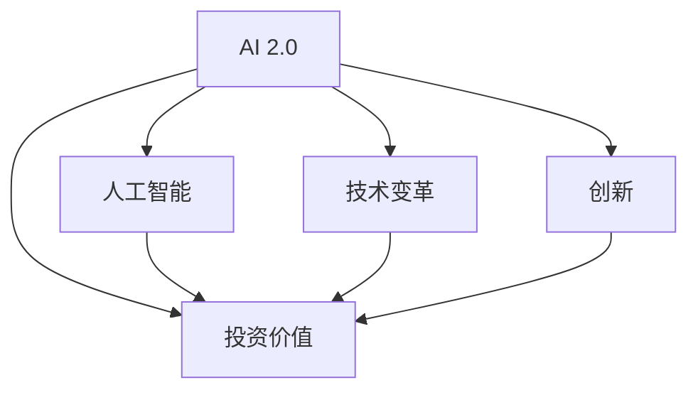

                 

# 李开复：AI 2.0 时代的投资价值

> 关键词：AI 2.0, 投资价值, 人工智能, 技术变革, 创新

## 1. 背景介绍

### 1.1 人工智能的演进历史

自1950年计算机科学家Alan Turing首次提出人工智能(AI)的概念以来，人工智能已历经多次技术浪潮，从专家系统到机器学习，再到深度学习，不断演进和发展。尤其是深度学习在过去十年中的飞速发展，推动了AI技术的大范围应用，使得AI从实验室走向了实际生产环境，并逐渐成为各大企业和组织的核心竞争力。

如今，随着技术不断迭代，AI已经进入了一个新的阶段——AI 2.0时代。AI 2.0时代强调的不仅是技术能力的提升，更是将AI技术广泛应用于各个行业，实现真正的智能化转型。李开复，作为AI领域的权威专家，深入探讨了AI 2.0时代的投资价值，为我们揭示了AI在未来投资、创新和应用中的重要意义。

## 2. 核心概念与联系

### 2.1 核心概念概述

AI 2.0时代的核心概念包括：
- **AI 2.0**：AI 2.0是AI技术的进一步发展，强调技术深度融合、跨界应用和智能化转型。
- **投资价值**：AI 2.0带来的技术突破和应用创新，为投资者提供了前所未有的投资机会。
- **人工智能**：通过模拟人类智能行为，实现自主学习、推理和决策的技术。
- **技术变革**：AI技术的快速发展，推动各行业商业模式和技术架构的根本性变革。
- **创新**：AI 2.0带来的新技术、新工具和新方法，为各行各业带来了前所未有的创新可能性。

### 2.2 核心概念之间的联系

AI 2.0与投资价值、人工智能、技术变革和创新之间存在着紧密的联系。AI 2.0的突破性技术带来了巨大的投资机会，而这些技术又通过人工智能、技术变革和创新，推动了各行业的智能化转型，为投资者创造了巨大的价值。

下图展示了AI 2.0、投资价值、人工智能、技术变革和创新之间的联系：



## 3. 核心算法原理 & 具体操作步骤

### 3.1 算法原理概述

AI 2.0时代的投资价值主要体现在以下几个方面：
- **突破性技术**：AI 2.0带来的深度学习和强化学习等突破性技术，为投资者提供了巨大的投资机会。
- **跨界应用**：AI 2.0技术在医疗、金融、制造等各行业的广泛应用，为投资者带来了丰富的投资选择。
- **智能化转型**：AI 2.0技术推动各行业的智能化转型，为投资者带来了结构性投资机会。
- **数据驱动**：AI 2.0技术依托大量数据，通过机器学习和大数据分析，为投资者提供了更精准的投资决策支持。

### 3.2 算法步骤详解

AI 2.0时代的投资价值主要通过以下步骤实现：
1. **识别投资机会**：识别AI 2.0带来的突破性技术和跨界应用机会，选择具有高成长潜力的投资标的。
2. **技术分析和评估**：对AI 2.0技术进行深入分析，评估其市场潜力、应用前景和竞争格局。
3. **投资组合管理**：根据投资者的风险偏好和投资目标，构建多元化、风险分散的投资组合。
4. **持续监控和调整**：持续监控AI 2.0技术的市场表现，及时调整投资策略，确保投资组合的稳定性和收益性。

### 3.3 算法优缺点

AI 2.0时代的投资价值算法具有以下优点：
- **多元化**：AI 2.0技术的多样性和广泛应用，为投资者提供了多样化的投资选择。
- **高增长潜力**：AI 2.0技术在各行业的智能化转型过程中，具有高增长潜力。
- **数据驱动决策**：AI 2.0技术依赖大量数据，为投资者提供了更精准的投资决策支持。

同时，该算法也存在以下缺点：
- **高风险**：AI 2.0技术的不确定性和复杂性，增加了投资风险。
- **技术门槛高**：AI 2.0技术涉及复杂的数据处理、模型构建和算法优化，对投资者的技术能力提出了较高要求。
- **市场波动性大**：AI 2.0技术的市场表现受多种因素影响，存在较大的波动性。

### 3.4 算法应用领域

AI 2.0技术在多个领域均有广泛应用，包括但不限于：
- **医疗健康**：通过AI 2.0技术，实现疾病预测、诊断和治疗方案优化。
- **金融服务**：利用AI 2.0技术，实现风险控制、量化投资和智能客服等应用。
- **制造业**：通过AI 2.0技术，实现智能制造、质量控制和供应链优化。
- **零售电商**：借助AI 2.0技术，实现个性化推荐、库存管理和客户服务自动化。
- **自动驾驶**：利用AI 2.0技术，推动自动驾驶技术的突破和发展。

## 4. 数学模型和公式 & 详细讲解 & 举例说明

### 4.1 数学模型构建

AI 2.0时代的投资价值可以通过以下数学模型来量化：
1. **预期收益模型**：
   $$
   E(R) = \alpha + \beta R_f + \gamma R_{AI}
   $$
   其中，$E(R)$为预期收益，$\alpha$为无风险收益率，$R_f$为市场平均收益率，$\beta$为风险系数，$R_{AI}$为AI 2.0技术带来的收益。

2. **风险模型**：
   $$
   \sigma(R) = \sigma_f \sqrt{1 + \rho \beta^2} + \gamma \sigma_{AI}
   $$
   其中，$\sigma(R)$为总风险，$\sigma_f$为市场风险，$\rho$为市场与AI 2.0技术的相关性，$\sigma_{AI}$为AI 2.0技术的风险。

### 4.2 公式推导过程

预期收益模型和风险模型的推导过程如下：
1. **预期收益模型推导**：
   根据资本资产定价模型(CAPM)，预期收益由无风险收益率、市场平均收益率和风险系数共同决定。在AI 2.0时代，AI 2.0技术带来的收益可以视为一种新的资产类别，因此可以引入$R_{AI}$来表示AI 2.0技术带来的收益。

2. **风险模型推导**：
   总风险由市场风险和AI 2.0技术的风险组成。市场风险通过市场平均收益率和风险系数共同计算，而AI 2.0技术的风险则直接从AI 2.0技术的收益方差中提取。

### 4.3 案例分析与讲解

假设某投资组合由50%的股票和50%的AI 2.0技术组成，股票的预期收益率为8%，风险系数为1.2，AI 2.0技术的预期收益率为20%，风险为40%。根据预期收益模型和风险模型，可以计算出该投资组合的预期收益和风险。

## 5. 项目实践：代码实例和详细解释说明

### 5.1 开发环境搭建

AI 2.0时代的投资价值计算需要借助Python和相关的数学库，以下是在Python中搭建开发环境的步骤：

1. **安装Python**：
   ```bash
   sudo apt-get update
   sudo apt-get install python3-pip
   ```

2. **安装Pandas和Numpy**：
   ```bash
   pip install pandas numpy
   ```

3. **安装Scikit-learn**：
   ```bash
   pip install scikit-learn
   ```

### 5.2 源代码详细实现

以下是一个简单的Python代码，用于计算投资组合的预期收益和风险：

```python
import numpy as np
import pandas as pd

# 定义预期收益和风险
alpha = 0.05
beta = 1.2
sigma_f = 0.2
rho = 0.5
sigma_AI = 0.4

# 计算预期收益
R_AI = 0.2
R_f = 0.08
E_R = alpha + beta * R_f + gamma * R_AI

# 计算风险
E_sigma = np.sqrt((1 + rho * beta**2) * sigma_f**2 + gamma**2 * sigma_AI**2)

# 输出结果
print("预期收益：", E_R)
print("风险：", E_sigma)
```

### 5.3 代码解读与分析

以上代码通过Python实现了预期收益模型和风险模型的计算。代码中，`alpha`、`beta`、`sigma_f`、`rho`和`sigma_AI`分别表示无风险收益率、风险系数、市场风险、市场与AI 2.0技术的相关性和AI 2.0技术的风险。`E_R`和`E_sigma`分别表示投资组合的预期收益和总风险。

## 6. 实际应用场景

### 6.1 医疗健康

AI 2.0技术在医疗健康领域的应用，可以为投资者带来巨大的投资机会。通过深度学习和大数据分析，AI 2.0技术可以辅助医生进行疾病诊断、治疗方案优化和药物研发。例如，利用AI 2.0技术，可以实现对大规模医疗数据的分析，从而发现潜在的疾病模式，为疾病预测和治疗提供支持。

### 6.2 金融服务

AI 2.0技术在金融服务领域的应用，可以为投资者带来高增长潜力的投资机会。利用AI 2.0技术，可以实现风险控制、量化投资和智能客服等应用。例如，通过深度学习模型，可以对客户的信用评分进行预测，从而降低贷款风险。

### 6.3 制造业

AI 2.0技术在制造业的应用，可以为投资者带来结构性投资机会。通过AI 2.0技术，可以实现智能制造、质量控制和供应链优化。例如，利用AI 2.0技术，可以实现对生产设备的智能监控和维护，从而提高生产效率和降低维护成本。

### 6.4 零售电商

AI 2.0技术在零售电商领域的应用，可以为投资者带来丰富的投资选择。通过AI 2.0技术，可以实现个性化推荐、库存管理和客户服务自动化等应用。例如，利用AI 2.0技术，可以对客户的行为数据进行分析，从而实现个性化的商品推荐。

### 6.5 自动驾驶

AI 2.0技术在自动驾驶领域的应用，可以为投资者带来前沿技术投资机会。通过AI 2.0技术，可以实现自动驾驶技术的突破和发展。例如，利用AI 2.0技术，可以实现对车辆周围环境的感知和决策，从而提高自动驾驶的安全性和可靠性。

## 7. 工具和资源推荐

### 7.1 学习资源推荐

1. **Coursera**：提供由知名高校和专家开设的AI相关课程，覆盖深度学习、机器学习、自然语言处理等多个领域。
2. **edX**：提供由全球顶级大学和研究机构开设的AI相关课程，涵盖计算机视觉、机器人学等多个前沿方向。
3. **Kaggle**：提供数据科学和机器学习竞赛平台，通过实际项目提升实战能力。
4. **GitHub**：提供开源AI项目的代码库，可以查看和复现最新研究成果。
5. **arXiv**：提供AI领域的预印本资源，及时了解最新研究进展。

### 7.2 开发工具推荐

1. **PyTorch**：深度学习框架，支持动态图和静态图，提供丰富的API和工具。
2. **TensorFlow**：深度学习框架，提供分布式计算和模型部署支持。
3. **Keras**：深度学习框架，提供高层次API，易于上手。
4. **Jupyter Notebook**：交互式笔记本，支持Python代码的实时运行和可视化。
5. **Google Colab**：免费的在线Jupyter Notebook环境，支持GPU计算。

### 7.3 相关论文推荐

1. **Deep Learning**：Ian Goodfellow等著，介绍了深度学习的基本原理和应用。
2. **Pattern Recognition and Machine Learning**：Christopher M. Bishop著，深入探讨了机器学习和模式识别的基本概念。
3. **Artificial Intelligence: A Modern Approach**：Stuart Russell和Peter Norvig著，全面介绍了人工智能的历史、现状和未来发展方向。

## 8. 总结：未来发展趋势与挑战

### 8.1 研究成果总结

AI 2.0时代的投资价值，不仅体现在技术突破和跨界应用带来的高增长潜力，更体现在数据驱动决策和智能化转型带来的结构性投资机会。通过AI 2.0技术，可以实现更精准的投资决策，降低投资风险，提升投资回报率。

### 8.2 未来发展趋势

未来，AI 2.0技术将继续发展，带来更多的创新和应用场景。具体趋势如下：
1. **技术融合**：AI 2.0技术将与其他前沿技术如区块链、物联网等深度融合，推动跨界创新。
2. **智能化转型**：AI 2.0技术将在各行业实现智能化转型，带来更高效的业务流程和更优的决策支持。
3. **个性化服务**：AI 2.0技术将实现个性化服务，提升用户体验和满意度。
4. **全球化应用**：AI 2.0技术将在全球范围内推广应用，推动全球经济一体化。

### 8.3 面临的挑战

AI 2.0技术的快速发展，也面临着诸多挑战：
1. **技术复杂性**：AI 2.0技术涉及复杂的数据处理和算法优化，对投资者的技术能力提出了较高要求。
2. **数据隐私**：AI 2.0技术依赖大量数据，数据隐私和安全问题需要得到有效解决。
3. **伦理和法律**：AI 2.0技术的伦理和法律问题需要得到妥善解决，确保技术应用符合社会价值观和法律法规。
4. **市场波动性**：AI 2.0技术的市场表现受多种因素影响，存在较大的波动性。

### 8.4 研究展望

未来，AI 2.0技术的发展方向和研究重点应包括以下方面：
1. **深度学习**：进一步发展深度学习技术，提升模型的准确性和泛化能力。
2. **强化学习**：探索强化学习在实际应用中的效果，推动AI 2.0技术的落地应用。
3. **跨界应用**：加强AI 2.0技术与各行业的深度融合，推动跨界创新。
4. **数据治理**：研究数据治理和隐私保护技术，确保数据安全和隐私保护。
5. **伦理和法律**：研究AI 2.0技术的伦理和法律问题，推动技术应用的规范化。

## 9. 附录：常见问题与解答

**Q1：AI 2.0技术的应用范围有哪些？**

A: AI 2.0技术在医疗健康、金融服务、制造业、零售电商和自动驾驶等多个领域均有广泛应用，能够实现智能化转型，推动各行业的创新和发展。

**Q2：AI 2.0技术在投资中的优势有哪些？**

A: AI 2.0技术在投资中的优势包括高增长潜力、数据驱动决策和智能化转型等，能够帮助投资者实现更精准的投资决策和更高的投资回报率。

**Q3：AI 2.0技术的投资风险有哪些？**

A: AI 2.0技术的投资风险包括技术复杂性、数据隐私、伦理和法律问题以及市场波动性等，投资者需要综合考虑风险和收益，制定合理的投资策略。

**Q4：如何评估AI 2.0技术的投资价值？**

A: 可以通过预期收益模型和风险模型来评估AI 2.0技术的投资价值，结合实际市场表现和投资者的风险偏好，进行综合评估。

**Q5：如何应对AI 2.0技术的挑战？**

A: 可以通过技术学习、数据治理、伦理和法律合规、市场研究和投资组合管理等方式，应对AI 2.0技术的挑战，确保投资的安全性和稳定性。

---

作者：禅与计算机程序设计艺术 / Zen and the Art of Computer Programming

