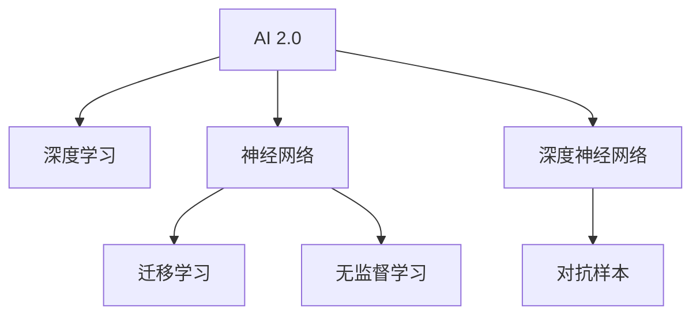

                 

# 李开复：AI 2.0 时代的挑战

## 1. 背景介绍

### 1.1 问题的由来
人工智能（AI）正在以前所未有的速度发展，AI 1.0 时代以规则、专家系统和统计学习为基础，而 AI 2.0 则是以深度学习和数据驱动的神经网络为核心的全新阶段。AI 2.0 的核心是深度学习和深度神经网络，这种技术能够从大量数据中学习并提取高层次的特征表示，进而实现复杂的模式识别、分类、预测和生成等任务。

AI 2.0 时代的到来，使得 AI 应用从实验室走向现实世界，从离线走向在线，从狭义的特定领域走向泛化应用。AI 2.0 正在改变社会的方方面面，包括医疗、教育、金融、交通、制造、农业、娱乐和社交等多个领域。然而，随着 AI 应用的深入，其带来的挑战也日益显现。本文将深入探讨 AI 2.0 时代的挑战，并提出相应的应对策略。

## 2. 核心概念与联系

### 2.1 核心概念概述

为了更好地理解 AI 2.0 时代的挑战，本节将介绍几个关键概念及其相互联系：

- AI 2.0：人工智能的第二代，以深度学习和神经网络为核心技术，能够从数据中学习高层次的特征表示，实现泛化应用。
- 深度学习：一种基于神经网络的机器学习方法，通过多层次的神经网络，从原始数据中提取抽象特征，实现复杂的模式识别和预测。
- 神经网络：一种由多个节点（神经元）构成的计算模型，通过学习输入和输出之间的非线性关系，实现数据的高级抽象和表达。
- 深度神经网络（DNN）：指包含多个隐层的神经网络，通过多层抽象，可以从原始数据中学习到更加复杂的特征表示。
- 迁移学习：将一个任务中学到的知识迁移到另一个任务中，减少新任务所需的标注数据，提高模型泛化能力。
- 无监督学习：指在缺乏标注数据的情况下，通过算法从数据中学习特征，进而进行分类、聚类等任务。
- 对抗样本：指通过微小扰动，使模型在输入样本上产生误判的样本，用于评估和改进模型的鲁棒性。

这些核心概念之间的联系可以通过以下 Mermaid 流程图来展示：



这个流程图展示了 AI 2.0 的核心技术及其相互关联：

1. AI 2.0 以深度学习和神经网络为基础。
2. 神经网络通过学习输入和输出之间的关系，实现数据的高级抽象。
3. 深度神经网络通过多层抽象，能够学习到更加复杂的特征表示。
4. 迁移学习能够在相似任务间迁移知识，提高模型泛化能力。
5. 无监督学习在缺乏标注数据时，通过算法学习数据特征。
6. 对抗样本用于评估和改进模型的鲁棒性。

这些概念共同构成了 AI 2.0 的技术框架，使得 AI 应用能够跨越领域，实现泛化应用。

## 3. 核心算法原理 & 具体操作步骤
### 3.1 算法原理概述

AI 2.0 时代的挑战主要源于以下几个方面：数据质量与标注成本、模型复杂度与计算资源、模型泛化能力与泛化稳定性、模型鲁棒性与安全性和可解释性与透明度。这些挑战需要通过核心算法原理与操作步骤来解决。

### 3.2 算法步骤详解

为了应对 AI 2.0 时代的挑战，需要在数据获取、模型训练、模型评估、模型部署等各个环节进行优化。具体步骤如下：

**Step 1: 数据获取与预处理**

数据是 AI 模型的基础，高质量的数据能够显著提升模型性能。为了降低标注成本，可以通过无监督学习和迁移学习来提高数据质量。在无监督学习中，可以通过自编码器、变分自编码器等算法，从原始数据中学习特征表示。在迁移学习中，可以通过迁移现有模型的知识，减少新任务所需的标注数据。

**Step 2: 模型训练与优化**

模型训练是 AI 2.0 的核心步骤，需要选择合适的深度神经网络架构、优化器、损失函数等。在模型训练中，可以通过参数共享、数据增强、对抗训练等技术，提高模型的泛化能力与鲁棒性。

**Step 3: 模型评估与验证**

模型评估是确保 AI 模型性能的关键步骤，需要在测试集上进行评估，并使用指标如准确率、召回率、F1 分数等进行衡量。此外，还需要进行模型验证，确保模型在不同数据分布上的泛化稳定性。

**Step 4: 模型部署与监控**

模型部署是将 AI 模型转化为实际应用的重要步骤。需要选择合适的部署环境，并确保模型的可扩展性和可靠性。同时，需要对模型进行监控，确保其在线上的稳定性和安全性。

### 3.3 算法优缺点

AI 2.0 技术的优点包括：

1. 强大的泛化能力：通过深度学习和大数据，AI 2.0 模型能够从数据中学习到高层次的特征表示，实现泛化应用。
2. 高效的计算资源利用：深度神经网络可以通过分布式计算和 GPU 加速，显著提高计算效率。
3. 广泛的应用场景：AI 2.0 技术可以应用于医疗、教育、金融、交通、制造、农业、娱乐和社交等多个领域。

但同时也存在以下缺点：

1. 数据质量与标注成本：高质量的标注数据对于 AI 模型的训练至关重要，但获取标注数据往往成本较高。
2. 模型复杂度与计算资源：深度神经网络需要大量的计算资源，且训练复杂度高。
3. 模型泛化能力与泛化稳定性：AI 模型往往依赖于特定的数据分布，难以泛化到未知数据。
4. 模型鲁棒性与安全性和可解释性与透明度：AI 模型的黑盒特性使其难以解释，且对抗样本可能影响模型的鲁棒性。

## 4. 数学模型和公式 & 详细讲解
### 4.1 数学模型构建

AI 2.0 时代的挑战可以通过以下数学模型来量化和描述：

- 数据集：$\mathcal{D} = \{(x_i, y_i)\}_{i=1}^N$
- 模型参数：$\theta$
- 损失函数：$\mathcal{L}(\theta)$
- 优化器：$Optimizer(\theta)$
- 学习率：$\eta$

### 4.2 公式推导过程

以二分类问题为例，公式推导过程如下：

1. 定义模型 $M_{\theta}(x)$ 输出概率分布 $p(y|x)$
2. 定义损失函数 $\mathcal{L}(\theta) = -\frac{1}{N}\sum_{i=1}^N [y_i\log p(y_i|x_i)+(1-y_i)\log (1-p(y_i|x_i))]$
3. 通过梯度下降等优化算法，更新模型参数：$\theta \leftarrow \theta - \eta \nabla_{\theta}\mathcal{L}(\theta)$

### 4.3 案例分析与讲解

假设有一项医疗诊断任务，需要从医疗影像中识别肿瘤。可以使用深度神经网络对医学影像进行预处理和特征提取，然后通过分类器对肿瘤进行预测。使用交叉熵损失函数，并通过梯度下降算法更新模型参数，最终实现高精度的医疗诊断。

## 5. 项目实践：代码实例和详细解释说明
### 5.1 开发环境搭建

在进行 AI 2.0 项目实践前，需要准备好开发环境。以下是使用 Python 进行 TensorFlow 开发的环境配置流程：

1. 安装 Anaconda：从官网下载并安装 Anaconda，用于创建独立的 Python 环境。

2. 创建并激活虚拟环境：
```bash
conda create -n tf-env python=3.8 
conda activate tf-env
```

3. 安装 TensorFlow：根据 CUDA 版本，从官网获取对应的安装命令。例如：
```bash
conda install tensorflow -c tf -c conda-forge
```

4. 安装各类工具包：
```bash
pip install numpy pandas scikit-learn matplotlib tqdm jupyter notebook ipython
```

完成上述步骤后，即可在 `tf-env` 环境中开始 AI 2.0 项目实践。

### 5.2 源代码详细实现

下面以医疗影像诊断项目为例，给出使用 TensorFlow 进行 AI 2.0 项目开发的 PyTorch 代码实现。

首先，定义医疗影像预处理函数：

```python
import tensorflow as tf
from tensorflow.keras.preprocessing.image import ImageDataGenerator

def preprocess_image(image_path):
    img = tf.io.read_file(image_path)
    img = tf.image.decode_jpeg(img, channels=3)
    img = tf.image.resize(img, (224, 224))
    img = tf.keras.applications.resnet50.preprocess_input(img)
    return img
```

然后，定义深度神经网络模型：

```python
from tensorflow.keras.models import Model
from tensorflow.keras.layers import Input, Conv2D, MaxPooling2D, Flatten, Dense, Dropout

def build_model():
    inputs = Input(shape=(224, 224, 3))
    x = Conv2D(32, (3, 3), activation='relu')(inputs)
    x = MaxPooling2D((2, 2))(x)
    x = Conv2D(64, (3, 3), activation='relu')(x)
    x = MaxPooling2D((2, 2))(x)
    x = Conv2D(128, (3, 3), activation='relu')(x)
    x = MaxPooling2D((2, 2))(x)
    x = Flatten()(x)
    x = Dense(256, activation='relu')(x)
    x = Dropout(0.5)(x)
    outputs = Dense(1, activation='sigmoid')(x)
    model = Model(inputs=inputs, outputs=outputs)
    model.compile(optimizer='adam', loss='binary_crossentropy', metrics=['accuracy'])
    return model
```

接着，定义训练和评估函数：

```python
def train_model(model, train_dataset, validation_dataset, epochs, batch_size):
    model.fit(train_dataset, validation_data=validation_dataset, epochs=epochs, batch_size=batch_size)
    
def evaluate_model(model, test_dataset, batch_size):
    test_loss, test_accuracy = model.evaluate(test_dataset, batch_size=batch_size)
    print(f'Test loss: {test_loss:.4f}')
    print(f'Test accuracy: {test_accuracy:.4f}')
```

最后，启动训练流程并在测试集上评估：

```python
epochs = 10
batch_size = 16

model = build_model()
train_dataset = ...
validation_dataset = ...
test_dataset = ...

train_model(model, train_dataset, validation_dataset, epochs, batch_size)
evaluate_model(model, test_dataset, batch_size)
```

以上就是使用 TensorFlow 进行 AI 2.0 项目开发的完整代码实现。可以看到，得益于 TensorFlow 的强大封装，我们可以用相对简洁的代码完成 AI 2.0 模型的构建和训练。

### 5.3 代码解读与分析

让我们再详细解读一下关键代码的实现细节：

**preprocess_image 函数**：
- 读取医疗影像文件。
- 对影像进行解码、缩放、归一化等预处理操作。
- 最终将预处理后的影像转换为 TensorFlow 张量。

**build_model 函数**：
- 定义卷积层、池化层、全连接层等基本组件。
- 使用 Dropout 等技术控制过拟合。
- 定义模型的输入、输出和编译。

**train_model 函数**：
- 使用训练集对模型进行迭代训练。
- 使用验证集进行性能评估，并设置Early Stopping策略。

**evaluate_model 函数**：
- 使用测试集对模型进行性能评估。
- 打印测试集的损失和准确率。

**训练流程**：
- 定义总的epoch数和batch size，开始循环迭代
- 每个epoch内，先在训练集上训练，并在验证集上进行性能评估
- 重复上述步骤直至收敛

可以看到，TensorFlow 配合深度神经网络，使得 AI 2.0 模型的构建和训练变得简洁高效。开发者可以将更多精力放在模型改进和数据处理等高层逻辑上，而不必过多关注底层的实现细节。

当然，工业级的系统实现还需考虑更多因素，如模型的保存和部署、超参数的自动搜索、更灵活的任务适配层等。但核心的 AI 2.0 训练流程基本与此类似。

## 6. 实际应用场景
### 6.1 智能医疗

AI 2.0 技术在智能医疗领域具有广泛的应用前景，可以从数据获取、模型训练、模型评估、模型部署等各个环节提升医疗服务的智能化水平。

在数据获取环节，可以使用医疗影像、电子病历、基因组数据等多种数据源，构建高质量的医疗数据集。在模型训练环节，可以使用深度学习和大规模医疗数据，实现高精度的医疗诊断和治疗方案推荐。在模型评估环节，可以采用交叉验证、ROC 曲线等方法评估模型的性能。在模型部署环节，可以将 AI 模型集成到医院信息系统、医疗 app、智能设备等平台，提供智能诊断、治疗方案推荐、患者监护等服务。

### 6.2 金融风控

AI 2.0 技术在金融风控领域具有重要的应用价值，可以显著提升金融机构的信贷审批、风险管理、欺诈检测等能力。

在数据获取环节，可以采集用户的个人信息、交易记录、行为数据等多种数据源，构建高质量的金融数据集。在模型训练环节，可以使用深度学习和大规模金融数据，实现高精度的信用评估、风险预测、欺诈检测等任务。在模型评估环节，可以采用 AUC、召回率、F1 分数等指标评估模型的性能。在模型部署环节，可以将 AI 模型集成到金融机构的信贷审批系统、风控系统、反欺诈系统等平台，提供智能审批、风险管理、欺诈检测等服务。

### 6.3 智能制造

AI 2.0 技术在智能制造领域具有广泛的应用前景，可以从数据获取、模型训练、模型评估、模型部署等各个环节提升制造业的智能化水平。

在数据获取环节，可以采集生产设备、生产线、供应链等多种数据源，构建高质量的制造数据集。在模型训练环节，可以使用深度学习和大规模制造数据，实现高精度的设备故障预测、生产调度优化、供应链优化等任务。在模型评估环节，可以采用准确率、召回率、F1 分数等指标评估模型的性能。在模型部署环节，可以将 AI 模型集成到生产设备、供应链管理系统、调度系统等平台，提供设备故障预测、生产调度优化、供应链优化等服务。

### 6.4 未来应用展望

随着 AI 2.0 技术的不断演进，未来 AI 应用将更加广泛，涵盖更多领域和场景。以下是 AI 2.0 技术的未来应用展望：

1. 医疗领域：AI 2.0 技术可以应用于医疗影像诊断、基因组分析、个性化医疗等多个方面，提升医疗服务的智能化水平，实现高精度的医疗诊断和治疗方案推荐。

2. 金融领域：AI 2.0 技术可以应用于信贷审批、风险管理、欺诈检测等多个方面，提升金融机构的智能化水平，实现高精度的信用评估、风险预测、欺诈检测等任务。

3. 制造领域：AI 2.0 技术可以应用于设备故障预测、生产调度优化、供应链优化等多个方面，提升制造业的智能化水平，实现高精度的设备故障预测、生产调度优化、供应链优化等任务。

4. 零售领域：AI 2.0 技术可以应用于客户行为分析、库存管理、个性化推荐等多个方面，提升零售企业的智能化水平，实现高精度的客户行为分析、库存管理、个性化推荐等任务。

5. 娱乐领域：AI 2.0 技术可以应用于内容推荐、智能客服、游戏智能等多个方面，提升娱乐行业的智能化水平，实现高精度的内容推荐、智能客服、游戏智能等任务。

## 7. 工具和资源推荐
### 7.1 学习资源推荐

为了帮助开发者系统掌握 AI 2.0 技术的理论基础和实践技巧，这里推荐一些优质的学习资源：

1. 《Deep Learning》系列书籍：Ian Goodfellow、Yoshua Bengio、Aaron Courville 等人合著的深度学习经典教材，系统讲解了深度学习的原理、方法和应用。

2. CS231n《Convolutional Neural Networks for Visual Recognition》课程：斯坦福大学开设的计算机视觉课程，涵盖了深度学习在图像识别、目标检测等方面的应用。

3. CS224n《Natural Language Processing with Deep Learning》课程：斯坦福大学开设的自然语言处理课程，涵盖了深度学习在自然语言处理方面的应用。

4. CS285《Reinforcement Learning》课程：斯坦福大学开设的强化学习课程，涵盖了强化学习在机器人控制、游戏智能等方面的应用。

5. TensorFlow官方文档：TensorFlow 的官方文档，提供了详细的 API 文档、示例代码和教程，是 TensorFlow 学习和实践的必备资源。

6. PyTorch官方文档：PyTorch 的官方文档，提供了详细的 API 文档、示例代码和教程，是 PyTorch 学习和实践的必备资源。

通过对这些资源的学习实践，相信你一定能够快速掌握 AI 2.0 技术的精髓，并用于解决实际的 AI 问题。

### 7.2 开发工具推荐

高效的开发离不开优秀的工具支持。以下是几款用于 AI 2.0 项目开发的常用工具：

1. TensorFlow：由 Google 主导开发的开源深度学习框架，支持分布式计算和 GPU 加速，适合大规模工程应用。

2. PyTorch：由 Facebook 主导开发的开源深度学习框架，支持动态计算图和 GPU 加速，适合快速迭代研究。

3. Keras：基于 TensorFlow 和 Theano 的高层 API，支持多种深度神经网络模型，适合初学者和快速原型开发。

4. Jupyter Notebook：支持交互式编程和数据可视化，适合进行数据预处理、模型训练和结果展示。

5. Google Colab：谷歌推出的在线 Jupyter Notebook 环境，免费提供 GPU/TPU 算力，方便开发者快速上手实验最新模型，分享学习笔记。

合理利用这些工具，可以显著提升 AI 2.0 项目的开发效率，加快创新迭代的步伐。

### 7.3 相关论文推荐

AI 2.0 技术的发展源于学界的持续研究。以下是几篇奠基性的相关论文，推荐阅读：

1. "Deep Learning" by Ian Goodfellow, Yoshua Bengio, Aaron Courville：深度学习领域的经典教材，全面介绍了深度学习的原理、方法和应用。

2. "ImageNet Classification with Deep Convolutional Neural Networks" by Alex Krizhevsky, Ilya Sutskever, Geoffrey Hinton：提出深度卷积神经网络，并使用 ImageNet 数据集进行大规模训练，刷新了计算机视觉任务的性能。

3. "Convolutional Neural Networks for Visual Recognition" by Andrej Karpathy, Justin Rachel, Sergey Plis：提出深度卷积神经网络，并应用于大规模计算机视觉任务，如物体识别、目标检测等。

4. "Natural Language Processing with Deep Learning" by Yoshua Bengio, Ian Goodfellow, Aaron Courville：介绍深度学习在自然语言处理中的应用，如语言模型、机器翻译、文本分类等。

5. "Reinforcement Learning: An Introduction" by Richard S. Sutton, Andrew G. Barto：介绍强化学习的基本原理和算法，并应用于机器人控制、游戏智能等领域。

这些论文代表了大数据、深度学习和强化学习等 AI 技术的发展脉络。通过学习这些前沿成果，可以帮助研究者把握学科前进方向，激发更多的创新灵感。

## 8. 总结：未来发展趋势与挑战
### 8.1 研究成果总结

AI 2.0 技术已经在医疗、金融、制造、零售、娱乐等多个领域取得显著成效，实现了高精度的医疗诊断、风险管理、生产优化、内容推荐等任务。这些技术的发展，得益于深度学习、深度神经网络、迁移学习等核心技术的不断进步。

### 8.2 未来发展趋势

AI 2.0 技术的未来发展趋势包括：

1. 更高效的大规模训练：随着硬件设备的升级，深度神经网络的训练效率将进一步提升，模型规模也将不断扩大。

2. 更加灵活的模型架构：未来的深度神经网络将更加灵活，能够适应不同的任务和数据分布。

3. 更加普适的任务适配：未来的深度神经网络将更加普适，能够应用于更多领域和场景。

4. 更加高效的推理计算：未来的深度神经网络将更加高效，能够在多种设备上实现实时推理计算。

5. 更加鲁棒的模型鲁棒性：未来的深度神经网络将更加鲁棒，能够抵御对抗样本和噪声攻击。

6. 更加可解释的模型可解释性：未来的深度神经网络将更加可解释，能够提供透明、可靠的输出解释。

7. 更加安全的数据与模型：未来的深度神经网络将更加安全，能够保护用户隐私和数据安全。

### 8.3 面临的挑战

AI 2.0 技术在快速发展的同时，也面临着诸多挑战：

1. 数据质量与标注成本：高质量的标注数据对于 AI 模型的训练至关重要，但获取标注数据往往成本较高。

2. 模型复杂度与计算资源：深度神经网络需要大量的计算资源，且训练复杂度高。

3. 模型泛化能力与泛化稳定性：AI 模型往往依赖于特定的数据分布，难以泛化到未知数据。

4. 模型鲁棒性与安全性和可解释性与透明度：AI 模型的黑盒特性使其难以解释，且对抗样本可能影响模型的鲁棒性。

5. 数据与模型隐私与安全：AI 模型的使用过程中，如何保护用户隐私和数据安全是一个重要问题。

6. 模型公平性与伦理道德：AI 模型的决策过程中，如何避免偏见和歧视，符合伦理道德，也是一个重要问题。

### 8.4 研究展望

未来的 AI 研究需要在以下几个方面寻求新的突破：

1. 探索新的深度神经网络架构：研究更加灵活、高效、鲁棒的深度神经网络架构，提高模型性能。

2. 研究新的模型训练方法：研究更加高效、鲁棒的模型训练方法，提高模型泛化能力与鲁棒性。

3. 研究新的模型推理方法：研究更加高效、鲁棒的模型推理方法，提高模型实时推理能力。

4. 研究新的模型可解释方法：研究更加透明、可解释的模型可解释方法，提高模型的可解释性与透明度。

5. 研究新的数据隐私与安全方法：研究更加安全、隐私保护的数据隐私与安全方法，保护用户隐私和数据安全。

6. 研究新的模型公平性与伦理道德方法：研究更加公平、符合伦理道德的模型公平性与伦理道德方法，确保模型的公平性与道德性。

这些研究方向的探索，必将引领 AI 技术迈向更高的台阶，为构建安全、可靠、可解释、可控的智能系统铺平道路。面向未来，AI 技术还需要与其他人工智能技术进行更深入的融合，如知识表示、因果推理、强化学习等，多路径协同发力，共同推动人工智能技术的发展。

## 9. 附录：常见问题与解答

**Q1：AI 2.0 技术是否适用于所有领域？**

A: AI 2.0 技术可以应用于医疗、金融、制造、零售、娱乐等多个领域，但不同的领域需要根据具体情况进行调整和优化。

**Q2：AI 2.0 技术的优势和劣势有哪些？**

A: AI 2.0 技术的优势包括：
- 强大的泛化能力：能够从大规模数据中学习到高层次的特征表示，实现泛化应用。
- 高效的计算资源利用：能够利用 GPU 加速等高效计算资源，提升训练效率。
- 广泛的应用场景：能够应用于医疗、金融、制造、零售、娱乐等多个领域，实现智能化应用。

劣势包括：
- 数据质量与标注成本：高质量的标注数据对于 AI 模型的训练至关重要，但获取标注数据往往成本较高。
- 模型复杂度与计算资源：深度神经网络需要大量的计算资源，且训练复杂度高。
- 模型泛化能力与泛化稳定性：AI 模型往往依赖于特定的数据分布，难以泛化到未知数据。
- 模型鲁棒性与安全性和可解释性与透明度：AI 模型的黑盒特性使其难以解释，且对抗样本可能影响模型的鲁棒性。

**Q3：AI 2.0 技术在实际应用中需要注意哪些问题？**

A: AI 2.0 技术在实际应用中需要注意以下问题：
- 数据质量：需要确保数据的高质量，避免低质量数据带来的负面影响。
- 模型鲁棒性：需要确保模型的鲁棒性，避免对抗样本和噪声攻击带来的影响。
- 模型可解释性：需要确保模型的可解释性，避免黑盒模型带来的问题。
- 模型公平性：需要确保模型的公平性，避免偏见和歧视。
- 数据隐私与安全：需要确保数据隐私与安全，保护用户隐私和数据安全。

**Q4：AI 2.0 技术在落地应用中如何优化？**

A: AI 2.0 技术在落地应用中可以通过以下方式进行优化：
- 数据增强：通过数据增强等技术，提升模型的泛化能力。
- 模型优化：通过模型优化等技术，提升模型的鲁棒性和可解释性。
- 系统架构：通过系统架构优化，提升系统的可扩展性和稳定性。
- 算法优化：通过算法优化等技术，提升系统的效率和性能。

通过优化数据质量、模型鲁棒性、可解释性、公平性、数据隐私与安全等方面，可以提升 AI 2.0 技术的实际应用效果。

**Q5：AI 2.0 技术的未来发展方向有哪些？**

A: AI 2.0 技术的未来发展方向包括：
- 更加高效的大规模训练：随着硬件设备的升级，深度神经网络的训练效率将进一步提升，模型规模也将不断扩大。
- 更加灵活的模型架构：未来的深度神经网络将更加灵活，能够适应不同的任务和数据分布。
- 更加普适的任务适配：未来的深度神经网络将更加普适，能够应用于更多领域和场景。
- 更加高效的推理计算：未来的深度神经网络将更加高效，能够在多种设备上实现实时推理计算。
- 更加鲁棒的模型鲁棒性：未来的深度神经网络将更加鲁棒，能够抵御对抗样本和噪声攻击。
- 更加可解释的模型可解释性：未来的深度神经网络将更加可解释，能够提供透明、可靠的输出解释。
- 更加安全的数据与模型：未来的深度神经网络将更加安全，能够保护用户隐私和数据安全。
- 更加公平的模型公平性与伦理道德：未来的深度神经网络将更加公平，符合伦理道德。

这些方向将引领 AI 2.0 技术迈向更高的台阶，为构建安全、可靠、可解释、可控的智能系统铺平道路。

---

作者：禅与计算机程序设计艺术 / Zen and the Art of Computer Programming

