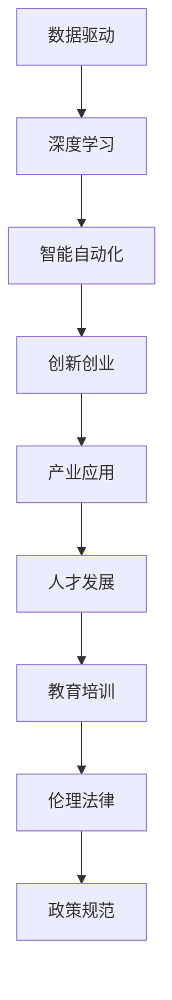

                 

# 李开复：AI 2.0 时代的未来

> 关键词：AI 2.0, 人工智能, 未来技术, 深度学习, 数据驱动, 智能自动化, 创新创业, 人才发展, 伦理法律

## 1. 背景介绍

人工智能（AI），作为人类历史上最为重要的技术革命之一，正在经历着从1.0到2.0的蜕变。这一转变不仅仅是技术的升级，更是从工具到伙伴、从效率到价值、从数据到创造的深刻变革。人工智能2.0时代，意味着AI将成为全方位的智慧解决方案，其影响将遍及各行各业，深刻改变人类的生产方式、生活模式和社会结构。在这一背景下，我们有必要深入探讨AI 2.0时代的未来，以期为即将到来的技术潮流做好准备。

### 1.1 人工智能的演变与挑战

自1956年达特茅斯会议首次提出“人工智能”一词以来，AI已经经历了多次重大演进。从早期的符号主义、知识工程到如今的深度学习、强化学习，AI的每一次进步都伴随着理念和技术上的飞跃。AI 1.0时代，以专家系统和规则为基础，主要解决特定领域的问题；而AI 2.0时代，则以数据驱动和深度学习为主，能够处理更为复杂的、大规模的、跨领域的问题。

然而，AI 2.0也面临着诸多挑战。首先是数据质量和隐私问题。高质量的标注数据是AI模型训练的基础，但获取这些数据往往需要巨大的成本和伦理考量。其次，AI的决策透明性和可解释性不足，特别是在医疗、司法等高风险领域，AI的决策过程难以解释和审查。此外，AI的普及带来了就业、安全、伦理等方面的社会问题，需要从政策和技术两方面共同解决。

## 2. 核心概念与联系

### 2.1 核心概念概述

在AI 2.0时代，以下几个核心概念将成为推动技术发展和应用普及的关键：

- **数据驱动与深度学习**：AI 2.0通过大量标注数据和深度学习算法，构建复杂、强大的模型，能够处理自然语言、图像、视频等多种模态的信息。
- **智能自动化**：AI 2.0的智能自动化技术，能够自动完成数据分析、决策制定、流程优化等任务，提升效率和准确性。
- **创新创业与产业应用**：AI 2.0技术催生了大量创新创业公司，为各行各业提供了智能解决方案，推动了产业数字化转型。
- **人才发展与教育培训**：AI 2.0时代对人才的需求日益增长，相关教育培训体系需要相应调整，培养具备跨学科知识的复合型人才。
- **伦理法律与政策规范**：AI 2.0的应用带来了伦理法律上的新挑战，需要制定适应未来发展的政策法规，保障AI技术的健康发展。

### 2.2 核心概念原理和架构的 Mermaid 流程图



以上流程图展示了AI 2.0时代的核心概念及其相互关系。数据驱动与深度学习是技术基础，智能自动化是核心能力，创新创业与产业应用是应用场景，人才发展与教育培训是人才保障，伦理法律与政策规范是管理指导。

## 3. 核心算法原理 & 具体操作步骤

### 3.1 算法原理概述

AI 2.0时代，深度学习算法是核心的驱动力。深度学习通过多层次的非线性变换，能够处理复杂的数据结构，提取高层次的特征表示，进而进行分类、预测、生成等任务。其核心原理包括：

- **反向传播**：通过链式法则计算损失函数的梯度，反向更新模型参数。
- **自适应学习率**：根据学习进度自动调整学习率，防止过早收敛或过拟合。
- **正则化技术**：如L2正则、Dropout等，防止模型过拟合。
- **卷积神经网络（CNN）**：用于图像、视频等高维数据的特征提取。
- **循环神经网络（RNN）**：用于处理序列数据，如自然语言处理。
- **生成对抗网络（GAN）**：用于生成逼真的图像、音频等数据。

### 3.2 算法步骤详解

AI 2.0的深度学习算法步骤一般包括以下几个环节：

1. **数据准备**：收集和清洗数据，将其划分为训练集、验证集和测试集。
2. **模型选择与初始化**：选择合适的深度学习模型，并进行参数初始化。
3. **模型训练**：在训练集上使用反向传播算法，不断更新模型参数，最小化损失函数。
4. **模型评估**：在验证集上评估模型性能，防止过拟合。
5. **模型部署**：将训练好的模型部署到实际应用场景中，进行推理预测。

### 3.3 算法优缺点

AI 2.0的深度学习算法具有以下优点：

- **高效建模**：能够处理复杂数据结构，自动提取特征表示，减少了人工设计的复杂度。
- **广泛应用**：广泛应用于图像、视频、自然语言处理等多个领域。
- **显著效果**：在诸多任务上取得了最先进的性能，如图像分类、语音识别、机器翻译等。

但同时也存在以下缺点：

- **计算资源需求高**：需要强大的计算平台和存储资源，尤其是大规模训练。
- **过拟合风险**：容易在少量数据上出现过拟合，特别是在复杂模型和高维数据上。
- **模型可解释性差**：深度学习模型的决策过程难以解释，缺乏透明性。
- **数据依赖性强**：模型的性能高度依赖于训练数据的质量和数量。

### 3.4 算法应用领域

AI 2.0的深度学习算法在多个领域得到了广泛应用：

- **计算机视觉**：用于图像分类、目标检测、图像生成等任务。
- **自然语言处理**：用于机器翻译、文本摘要、情感分析等任务。
- **语音识别与处理**：用于语音识别、语音合成、情感识别等任务。
- **医疗健康**：用于疾病诊断、个性化治疗、健康监测等任务。
- **金融科技**：用于风险评估、信用评分、智能投顾等任务。
- **智能制造**：用于质量检测、故障诊断、供应链优化等任务。
- **智能交通**：用于自动驾驶、交通预测、智能调度等任务。

## 4. 数学模型和公式 & 详细讲解 & 举例说明

### 4.1 数学模型构建

AI 2.0的深度学习模型构建基于神经网络架构，包括卷积神经网络（CNN）、循环神经网络（RNN）和变分自编码器（VAE）等。其中，CNN常用于图像处理，RNN用于序列数据处理，VAE用于生成模型。

### 4.2 公式推导过程

以卷积神经网络（CNN）为例，其核心公式包括：

- **卷积操作**：$C(x) = W * x + b$，其中$W$为卷积核，$x$为输入特征图，$b$为偏置项。
- **池化操作**：$P(x) = \text{max}(x)$，其中$x$为输入特征图，$P(x)$为池化后的特征图。
- **反向传播**：$\frac{\partial L}{\partial W} = \frac{\partial L}{\partial O} * \frac{\partial O}{\partial H} * \frac{\partial H}{\partial W}$，其中$L$为损失函数，$O$为输出，$H$为中间层。

### 4.3 案例分析与讲解

以图像分类任务为例，通过卷积神经网络进行图像特征提取和分类。使用MNIST数据集，将28x28的灰度图像输入卷积层，经过卷积、池化、全连接层等操作，最终输出分类结果。训练过程中，使用交叉熵损失函数，通过反向传播算法更新卷积核和偏置项，最小化分类误差。

## 5. 项目实践：代码实例和详细解释说明

### 5.1 开发环境搭建

在AI 2.0的深度学习项目开发中，常用的开发环境包括Python、TensorFlow、PyTorch等。以下是一个简单的Python+PyTorch的开发环境配置流程：

1. 安装Python和Anaconda环境。
2. 创建Python虚拟环境，如`conda create -n myenv python=3.7`.
3. 安装PyTorch和其他相关库，如`pip install torch torchvision`.
4. 设置环境变量，如`export PYTHONPATH=$PYTHONPATH:$CONDA_PREFIX/lib/python3.7/site-packages/`。

### 5.2 源代码详细实现

以图像分类任务为例，使用PyTorch实现卷积神经网络。以下是一个简单的代码示例：

```python
import torch
import torch.nn as nn
import torchvision.datasets as datasets
import torchvision.transforms as transforms

# 定义卷积神经网络模型
class Net(nn.Module):
    def __init__(self):
        super(Net, self).__init__()
        self.conv1 = nn.Conv2d(1, 32, kernel_size=3, padding=1)
        self.pool = nn.MaxPool2d(kernel_size=2, stride=2)
        self.conv2 = nn.Conv2d(32, 64, kernel_size=3, padding=1)
        self.fc1 = nn.Linear(7*7*64, 256)
        self.fc2 = nn.Linear(256, 10)
    
    def forward(self, x):
        x = nn.functional.relu(self.conv1(x))
        x = self.pool(x)
        x = nn.functional.relu(self.conv2(x))
        x = self.pool(x)
        x = x.view(-1, 7*7*64)
        x = nn.functional.relu(self.fc1(x))
        x = self.fc2(x)
        return x

# 加载数据集并进行预处理
train_dataset = datasets.MNIST(root='./data', train=True, transform=transforms.ToTensor(), download=True)
test_dataset = datasets.MNIST(root='./data', train=False, transform=transforms.ToTensor())

# 定义数据加载器
train_loader = torch.utils.data.DataLoader(train_dataset, batch_size=64, shuffle=True)
test_loader = torch.utils.data.DataLoader(test_dataset, batch_size=64, shuffle=False)

# 定义模型和优化器
model = Net()
optimizer = torch.optim.Adam(model.parameters(), lr=0.001)

# 定义损失函数
criterion = nn.CrossEntropyLoss()

# 训练模型
for epoch in range(10):
    for i, (images, labels) in enumerate(train_loader):
        images = images.view(images.size(0), 1, 28, 28)
        outputs = model(images)
        loss = criterion(outputs, labels)
        optimizer.zero_grad()
        loss.backward()
        optimizer.step()
        if (i+1) % 100 == 0:
            print('Epoch [%d/%d], Step [%d/%d], Loss: %.4f'
                  % (epoch+1, 10, i+1, len(train_dataset)//64, loss.item()))

# 评估模型
correct = 0
total = 0
with torch.no_grad():
    for images, labels in test_loader:
        images = images.view(images.size(0), 1, 28, 28)
        outputs = model(images)
        _, predicted = torch.max(outputs.data, 1)
        total += labels.size(0)
        correct += (predicted == labels).sum().item()
print('Accuracy of the network on the 10000 test images: %d %%' % (100 * correct / total))
```

### 5.3 代码解读与分析

上述代码中，我们定义了一个简单的卷积神经网络模型，用于处理MNIST手写数字识别任务。首先，我们使用`nn.Conv2d`定义了两个卷积层和两个全连接层，用于特征提取和分类。然后，通过`nn.functional.relu`激活函数，引入非线性变换。最后，使用`nn.CrossEntropyLoss`作为损失函数，通过反向传播算法最小化分类误差。

## 6. 实际应用场景

### 6.1 智慧医疗

AI 2.0技术在智慧医疗领域的应用，能够显著提升医疗服务的效率和质量。例如，通过深度学习模型，可以自动分析医疗影像，快速检测病变；通过自然语言处理技术，可以自动整理病历，辅助医生诊断；通过智能推荐系统，可以为患者推荐个性化的治疗方案。这些应用不仅能够节省医生的工作量，还能够提高诊疗的准确性和及时性。

### 6.2 智能制造

AI 2.0技术在智能制造领域的应用，能够实现生产过程的自动化和智能化。例如，通过图像识别技术，可以实时监测生产线上产品的质量；通过自然语言处理技术，可以自动生成生产指令和调度方案；通过智能推荐系统，可以为生产设备提供维护建议，减少故障停机时间。这些应用不仅能够提高生产效率，还能够降低运营成本。

### 6.3 智能交通

AI 2.0技术在智能交通领域的应用，能够实现交通系统的智能化管理。例如，通过图像识别技术，可以自动检测交通违规行为；通过自然语言处理技术，可以自动处理交通监控视频；通过智能推荐系统，可以为交通管理提供优化方案。这些应用不仅能够提高交通安全，还能够优化交通流量，减少拥堵。

### 6.4 未来应用展望

未来，AI 2.0技术的应用前景更加广阔，以下是一些可能的趋势：

1. **跨领域应用**：AI 2.0技术将跨越更多领域，如金融、教育、农业等，推动各个行业的智能化转型。
2. **人机协作**：AI 2.0技术将与人类协同工作，辅助人类完成复杂任务，提高工作效率和质量。
3. **自适应学习**：AI 2.0技术将具备自适应学习能力，能够不断从新数据中学习，保持性能的持续提升。
4. **隐私保护**：AI 2.0技术将注重数据隐私和安全，通过差分隐私、联邦学习等技术，保障数据隐私。
5. **伦理规范**：AI 2.0技术将建立伦理规范，确保AI系统的透明性、公平性和安全性。

## 7. 工具和资源推荐

### 7.1 学习资源推荐

为了帮助开发者深入学习AI 2.0技术，以下是一些优质的学习资源：

1. Coursera的《深度学习专项课程》：由斯坦福大学教授Andrew Ng主讲，系统介绍了深度学习的基本概念和实现方法。
2. Udacity的《深度学习纳米学位》：由Google Brain的Sergey Levine等知名教授主讲，涵盖深度学习的应用和实践。
3. Google AI博客：Google AI团队定期发布深度学习技术的最新进展和应用案例，是了解前沿技术的窗口。
4. PyTorch官方文档：PyTorch官方文档详细介绍了PyTorch的用法和最佳实践，是PyTorch用户的必备指南。
5. TensorFlow官方文档：TensorFlow官方文档详细介绍了TensorFlow的用法和最佳实践，是TensorFlow用户的必备指南。

### 7.2 开发工具推荐

在AI 2.0的深度学习项目开发中，常用的开发工具包括：

1. PyTorch：由Facebook开发，支持动态计算图，适合快速迭代研究和实验。
2. TensorFlow：由Google开发，支持静态计算图，适合大规模工程应用和生产部署。
3. Keras：由François Chollet开发，是一个高层API，易于上手，适合快速原型设计和实验。
4. Jupyter Notebook：一个交互式的笔记本环境，支持Python代码的编写和执行，适合学习和实验。
5. Google Colab：谷歌提供的免费Jupyter Notebook环境，支持GPU和TPU计算资源，适合大规模实验和训练。

### 7.3 相关论文推荐

为了深入了解AI 2.0技术的最新进展，以下是一些推荐的论文：

1. "Deep Learning" by Ian Goodfellow et al.（Ian Goodfellow的深度学习书籍）：系统介绍了深度学习的基本原理和实现方法。
2. "ImageNet Classification with Deep Convolutional Neural Networks" by Alex Krizhevsky et al.（ImageNet图像分类）：介绍了深度卷积神经网络的经典应用。
3. "Attention is All You Need" by Ashish Vaswani et al.（Transformer模型）：介绍了Transformer模型的原理和应用。
4. "Generative Adversarial Nets" by Ian Goodfellow et al.（GAN模型）：介绍了生成对抗网络的原理和应用。
5. "Reinforcement Learning: An Introduction" by Richard S. Sutton et al.（强化学习）：介绍了强化学习的基本原理和应用。

## 8. 总结：未来发展趋势与挑战

### 8.1 研究成果总结

AI 2.0技术在深度学习、自然语言处理、计算机视觉等多个领域取得了显著的进展，为各行各业提供了智能解决方案。通过数据驱动和深度学习，AI 2.0技术能够处理复杂、大规模的跨领域问题，提升了效率和准确性。

### 8.2 未来发展趋势

未来，AI 2.0技术将持续演进，主要趋势包括：

1. **多模态学习**：AI 2.0技术将支持多模态数据的融合，如图像、视频、音频和文本的联合分析，提升跨领域的学习能力。
2. **自适应学习**：AI 2.0技术将具备自适应学习能力，能够不断从新数据中学习，保持性能的持续提升。
3. **跨领域应用**：AI 2.0技术将跨越更多领域，如金融、教育、农业等，推动各个行业的智能化转型。
4. **人机协作**：AI 2.0技术将与人类协同工作，辅助人类完成复杂任务，提高工作效率和质量。
5. **隐私保护**：AI 2.0技术将注重数据隐私和安全，通过差分隐私、联邦学习等技术，保障数据隐私。
6. **伦理规范**：AI 2.0技术将建立伦理规范，确保AI系统的透明性、公平性和安全性。

### 8.3 面临的挑战

AI 2.0技术在发展过程中也面临诸多挑战：

1. **数据隐私和安全**：AI 2.0技术需要处理大量数据，存在数据泄露和隐私风险。
2. **模型透明性**：AI 2.0技术需要提高模型的透明性，确保决策过程的可解释性和可审查性。
3. **伦理和社会问题**：AI 2.0技术需要解决伦理和社会问题，如就业、安全、歧视等。
4. **计算资源需求**：AI 2.0技术需要强大的计算资源，存在成本和资源瓶颈。
5. **技术标准和规范**：AI 2.0技术需要建立统一的技术标准和规范，确保技术的可互操作性和可复用性。

### 8.4 研究展望

未来，AI 2.0技术需要在以下几个方面进行深入研究：

1. **多模态数据融合**：研究多模态数据的联合分析方法，提升跨领域的学习能力。
2. **自适应学习算法**：研究自适应学习算法，提高模型在动态环境下的性能和鲁棒性。
3. **隐私保护技术**：研究隐私保护技术，如差分隐私、联邦学习等，保障数据隐私和安全。
4. **模型透明性**：研究模型透明性技术，提高模型的可解释性和可审查性。
5. **伦理和社会问题**：研究伦理和社会问题，制定合理的伦理规范和社会标准。

## 9. 附录：常见问题与解答

**Q1: 什么是AI 2.0技术？**

A: AI 2.0技术是深度学习、自然语言处理、计算机视觉等技术的结合，能够处理复杂、大规模的跨领域问题，提升效率和准确性。AI 2.0技术通过数据驱动和深度学习，实现了从工具到伙伴、从效率到价值、从数据到创造的深刻变革。

**Q2: AI 2.0技术的应用前景如何？**

A: AI 2.0技术的应用前景非常广阔，涉及智慧医疗、智能制造、智能交通等多个领域。未来，AI 2.0技术将不断跨越更多领域，推动各行各业的智能化转型，提升效率和质量，创造更多社会价值。

**Q3: AI 2.0技术面临哪些挑战？**

A: AI 2.0技术在发展过程中面临诸多挑战，包括数据隐私和安全、模型透明性、伦理和社会问题、计算资源需求和技术标准等。未来需要从技术、政策和社会等多个方面共同努力，确保AI 2.0技术的健康发展。

**Q4: AI 2.0技术的未来趋势是什么？**

A: AI 2.0技术的未来趋势包括多模态学习、自适应学习、跨领域应用、人机协作、隐私保护和伦理规范等。未来，AI 2.0技术将不断演进，推动各行各业的智能化转型，提升效率和质量，创造更多社会价值。

---

作者：禅与计算机程序设计艺术 / Zen and the Art of Computer Programming

