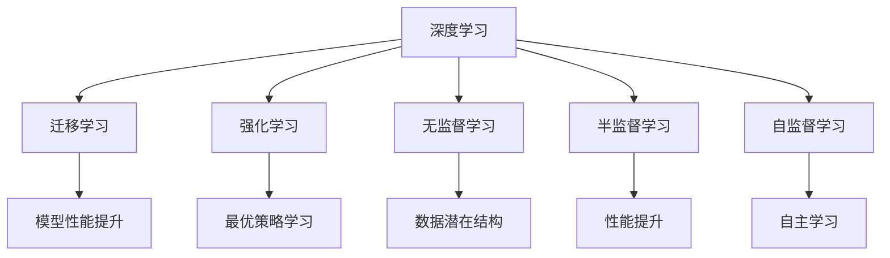
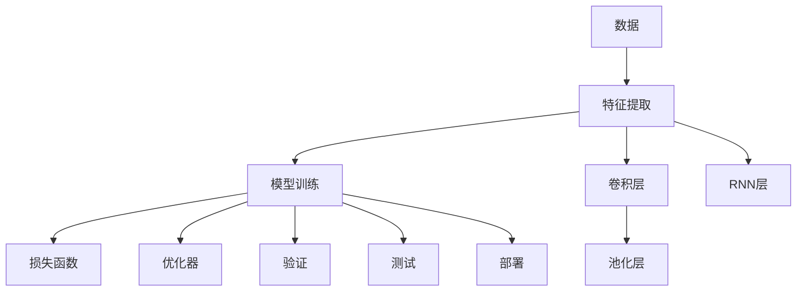
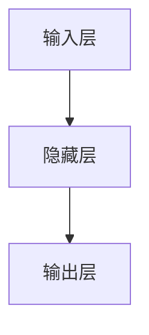

                 

# 李开复：AI 2.0 时代的未来展望

人工智能的飞速发展正在重塑人类社会的各个层面，从经济到教育，从医疗到娱乐。作为一名深度学习领域的专家，我有幸见证并参与了这一变革过程。本文将从AI 2.0时代的背景出发，探讨其核心概念、关键技术、应用领域以及未来展望，希望能为读者带来有益的洞见。

## 1. 背景介绍

### 1.1 问题由来

AI 1.0 时代的核心是符号逻辑和专家系统的研发，但随着数据规模的爆炸和计算能力的提升，传统的基于规则的系统显得捉襟见肘。进入AI 2.0 时代，深度学习和神经网络成为核心驱动力。这一时期，AI 技术在图像识别、语音识别、自然语言处理等领域取得了突破性进展。

然而，随着技术的进步，AI 2.0 也面临着诸多挑战，包括算法鲁棒性不足、数据隐私安全、以及模型的可解释性等问题。这些问题成为制约AI 2.0 技术发展的瓶颈，需要我们进一步探索和解决。

### 1.2 问题核心关键点

AI 2.0 时代的关键技术包括深度学习、卷积神经网络(CNN)、循环神经网络(RNN)、自注意力机制(Attention)、生成对抗网络(GAN)等。这些技术的发展，使得AI 模型能够处理复杂的非结构化数据，并在特定任务上表现出卓越的性能。但同时，我们也需要关注算法伦理、安全性、普适性等议题，以确保AI 技术的发展方向符合人类的价值观。

## 2. 核心概念与联系

### 2.1 核心概念概述

AI 2.0 时代涉及多个核心概念，包括深度学习、迁移学习、强化学习、无监督学习、半监督学习、自监督学习等。这些概念通过协同作用，构建了一个强大而灵活的AI 模型框架。

- **深度学习**：利用多层神经网络进行特征提取和建模。
- **迁移学习**：将一个领域的知识迁移到另一个领域，以提升模型在新任务上的表现。
- **强化学习**：通过与环境的交互，使模型学习最优策略，以达到特定目标。
- **无监督学习**：在没有标签的情况下，学习数据的潜在结构和规律。
- **半监督学习**：结合少量标签和大量无标签数据，提高模型性能。
- **自监督学习**：利用数据的隐含信息，进行自主学习和模型训练。

这些概念之间存在密切的联系，如图：



### 2.2 核心概念原理和架构的 Mermaid 流程图



## 3. 核心算法原理 & 具体操作步骤

### 3.1 算法原理概述

AI 2.0 时代的核心算法原理包括深度神经网络的构建和训练过程。这些算法原理通过反向传播、梯度下降等优化方法，使得模型能够自动学习数据的表示和规律，并在特定任务上表现出卓越的性能。

深度神经网络由多层非线性变换组成，每一层负责提取数据的不同特征。训练过程通过最小化损失函数，优化模型参数，使得模型输出与真实标签尽可能接近。这一过程通常需要使用反向传播算法，自动计算梯度，并使用梯度下降等优化方法更新参数。

### 3.2 算法步骤详解

深度神经网络的训练过程通常包括以下步骤：

1. **数据准备**：收集和预处理数据，包括数据清洗、标准化、划分训练集和验证集等。
2. **模型构建**：设计合适的神经网络结构，如卷积神经网络、循环神经网络等，并进行初始化。
3. **模型训练**：使用训练集进行迭代训练，优化模型参数，最小化损失函数。
4. **验证和测试**：在验证集上进行模型验证，评估模型性能，防止过拟合。在测试集上评估模型泛化能力。
5. **模型部署**：将训练好的模型部署到实际应用中，进行推理预测。

### 3.3 算法优缺点

深度神经网络具有以下优点：
- **灵活性高**：可以处理大规模非结构化数据，适用于各种复杂的任务。
- **性能优异**：在图像识别、语音识别、自然语言处理等领域表现出色。
- **可扩展性强**：通过增加网络层数和节点数，可以进一步提升模型性能。

同时，深度神经网络也存在以下缺点：
- **计算量大**：训练过程需要大量计算资源，成本较高。
- **模型复杂**：参数数量庞大，模型可解释性差，难以理解内部工作机制。
- **过拟合风险**：训练过程中容易过拟合，需要采用正则化等技术加以应对。

### 3.4 算法应用领域

深度神经网络在图像识别、语音识别、自然语言处理、推荐系统、游戏AI等领域得到了广泛应用。这些领域的数据量大、任务复杂，深度神经网络能够通过学习和提取特征，有效应对这些挑战。

## 4. 数学模型和公式 & 详细讲解 & 举例说明

### 4.1 数学模型构建

AI 2.0 时代常用的数学模型包括卷积神经网络(CNN)、循环神经网络(RNN)、自注意力机制(Attention)等。这些模型的构建通常包括输入层、隐藏层和输出层，如图：



### 4.2 公式推导过程

以卷积神经网络为例，其基本公式如下：

$$
h^i(x) = \sigma(W^i h^{i-1}(x) + b^i)
$$

其中 $h^i(x)$ 表示第 $i$ 层的输出，$\sigma$ 表示激活函数，$W^i$ 和 $b^i$ 分别表示第 $i$ 层的权重和偏置。

### 4.3 案例分析与讲解

以图像分类任务为例，使用CNN模型进行图像特征提取和分类。首先，将图像输入卷积层进行特征提取，得到卷积特征图。然后，通过池化层对特征图进行降维，最终送入全连接层进行分类。

## 5. 项目实践：代码实例和详细解释说明

### 5.1 开发环境搭建

AI 2.0 时代常用的开发环境包括Python、TensorFlow、PyTorch等。以下是一个简单的TensorFlow开发环境搭建流程：

1. 安装Anaconda：从官网下载并安装Anaconda，用于创建独立的Python环境。
2. 创建并激活虚拟环境：
```bash
conda create -n tf-env python=3.8 
conda activate tf-env
```

3. 安装TensorFlow：
```bash
pip install tensorflow
```

4. 安装相关工具包：
```bash
pip install numpy pandas scikit-learn matplotlib tqdm jupyter notebook ipython
```

### 5.2 源代码详细实现

以下是一个简单的TensorFlow代码示例，用于图像分类任务：

```python
import tensorflow as tf
from tensorflow.keras import layers

model = tf.keras.Sequential([
    layers.Conv2D(32, (3,3), activation='relu', input_shape=(28,28,1)),
    layers.MaxPooling2D((2,2)),
    layers.Flatten(),
    layers.Dense(64, activation='relu'),
    layers.Dense(10, activation='softmax')
])

model.compile(optimizer='adam',
              loss='categorical_crossentropy',
              metrics=['accuracy'])

model.fit(train_images, train_labels, epochs=10,
          validation_data=(test_images, test_labels))
```

### 5.3 代码解读与分析

上述代码首先定义了一个包含卷积层、池化层和全连接层的神经网络模型。然后，使用`compile`方法设置优化器、损失函数和评估指标。最后，使用`fit`方法进行模型训练。

## 6. 实际应用场景

### 6.1 智能推荐系统

AI 2.0 时代的智能推荐系统能够根据用户的历史行为和实时数据，推荐个性化的商品、内容和服务。这一技术在电商、视频、音乐等领域得到了广泛应用。

### 6.2 医疗诊断系统

AI 2.0 时代的医疗诊断系统利用深度学习技术，对医学影像、病历数据进行分析和诊断，辅助医生进行决策。例如，使用卷积神经网络对医学影像进行分类和分割，提取肿瘤、病变等关键信息。

### 6.3 智能客服系统

AI 2.0 时代的智能客服系统能够通过自然语言处理技术，理解用户意图，并提供精准的回复。这一技术在银行、保险、电信等行业得到了广泛应用。

### 6.4 未来应用展望

未来，AI 2.0 技术将进一步深入各个领域，推动智慧城市、智慧农业、智慧交通等产业的发展。AI 2.0 将不仅限于数据处理和任务执行，还将具备自我学习和进化能力，成为人类智能的可靠助手。

## 7. 工具和资源推荐

### 7.1 学习资源推荐

为了帮助开发者系统掌握AI 2.0 技术的理论基础和实践技巧，这里推荐一些优质的学习资源：

1. 《深度学习》系列书籍：由多位AI 专家共同撰写，全面介绍深度学习的基本概念和经典模型。
2. CS231n《卷积神经网络》课程：斯坦福大学开设的计算机视觉课程，讲解卷积神经网络的基本原理和应用。
3. CS224N《自然语言处理》课程：斯坦福大学开设的NLP课程，讲解自然语言处理的基本概念和经典模型。
4. 《TensorFlow官方文档》：TensorFlow的官方文档，提供详细的API文档和样例代码，适合快速上手。
5. GitHub开源项目：GitHub上丰富的开源项目，可以从中学习先进的AI 2.0 技术，并贡献自己的代码。

### 7.2 开发工具推荐

高效的工具是成功实现AI 2.0 项目的关键。以下是几款常用的开发工具：

1. Jupyter Notebook：Python的交互式开发环境，方便快速迭代和调试代码。
2. TensorBoard：TensorFlow配套的可视化工具，可以实时监测模型训练状态，并提供丰富的图表呈现方式。
3. Weights & Biases：模型训练的实验跟踪工具，可以记录和可视化模型训练过程中的各项指标，方便对比和调优。
4. PyTorch：灵活的深度学习框架，适合快速迭代研究。
5. Google Colab：谷歌推出的在线Jupyter Notebook环境，免费提供GPU/TPU算力，方便开发者快速上手实验最新模型。

### 7.3 相关论文推荐

AI 2.0 技术的发展源于学界的持续研究。以下是几篇奠基性的相关论文，推荐阅读：

1. AlexNet：卷积神经网络的经典之作，引入了池化层和dropout技术，提高了图像分类的精度。
2. RNN和LSTM：循环神经网络和长短时记忆网络，解决了序列数据的建模问题，广泛应用于语音识别和自然语言处理。
3. Attention Mechanism：自注意力机制，提升了深度学习模型对序列数据的建模能力，广泛应用于机器翻译、图像处理等领域。
4. GAN和变分自编码器：生成对抗网络和变分自编码器，提高了深度学习模型生成高质量样本的能力，广泛应用于图像生成、音乐生成等领域。
5. AlphaGo：使用深度学习技术和强化学习技术，开发的围棋AI，展示了AI 2.0 技术在游戏AI领域的巨大潜力。

这些论文代表了大规模深度学习技术的发展脉络，通过学习这些前沿成果，可以帮助研究者把握学科前进方向，激发更多的创新灵感。

## 8. 总结：未来发展趋势与挑战

### 8.1 研究成果总结

AI 2.0 时代的核心研究成果包括深度学习、卷积神经网络、循环神经网络、自注意力机制、生成对抗网络等。这些技术的不断发展，使得AI 模型能够处理大规模非结构化数据，并在特定任务上表现出卓越的性能。

### 8.2 未来发展趋势

未来，AI 2.0 技术将呈现以下几个发展趋势：

1. **模型规模持续增大**：随着算力成本的下降和数据规模的扩张，深度学习模型的参数量还将持续增长，模型规模将进一步扩大。
2. **迁移学习技术进步**：迁移学习技术将更加完善，能够在不同领域和任务之间高效迁移知识，提升模型的泛化能力。
3. **多模态学习兴起**：多模态学习技术将得到广泛应用，能够融合视觉、语音、文本等多种模态数据，提升模型的智能水平。
4. **强化学习与AI 2.0 结合**：强化学习技术将与AI 2.0 技术深度融合，实现更加智能的决策系统和自主学习系统。
5. **自监督学习快速发展**：自监督学习技术将得到更加广泛的应用，能够在大规模无标签数据上进行模型训练，提升模型的性能和鲁棒性。
6. **AI 2.0 技术与伦理道德结合**：AI 2.0 技术将更加注重伦理道德，确保技术发展符合人类的价值观和社会规范。

### 8.3 面临的挑战

AI 2.0 技术在发展过程中也面临诸多挑战，需要持续探索和解决：

1. **数据隐私和安全**：大规模深度学习模型的训练需要大量数据，如何保护数据隐私和安全成为重要问题。
2. **模型可解释性**：深度学习模型通常被视为"黑盒"系统，难以理解其内部工作机制和决策逻辑，如何提高模型的可解释性是一个重要研究方向。
3. **计算资源消耗**：深度学习模型的训练和推理需要大量计算资源，如何优化计算资源消耗，降低成本，是一个重要挑战。
4. **模型鲁棒性不足**：当前深度学习模型面临域外数据时，泛化性能往往大打折扣，如何提高模型的鲁棒性，避免过拟合，是一个重要问题。
5. **模型伦理道德**：深度学习模型可能学习到有害的偏见和信息，如何从数据和算法层面消除模型偏见，确保模型行为符合伦理道德，是一个重要研究方向。

### 8.4 研究展望

未来，AI 2.0 技术需要在以下几个方面进行深入研究：

1. **数据隐私和安全保护**：研究如何保护数据隐私和安全，确保数据不被滥用。
2. **模型可解释性和透明性**：研究如何提高模型的可解释性和透明性，使模型决策过程更加透明和可理解。
3. **计算资源的优化和高效利用**：研究如何优化计算资源消耗，提高模型训练和推理的效率。
4. **模型的鲁棒性和泛化能力**：研究如何提高模型的鲁棒性和泛化能力，使其能够更好地应对域外数据和噪声干扰。
5. **伦理道德和法律规范**：研究如何确保AI 2.0 技术的应用符合伦理道德和法律规范，避免有害的社会影响。

这些研究方向将推动AI 2.0 技术的进一步发展，使AI 2.0 技术更加安全、可靠、透明和可控。

## 9. 附录：常见问题与解答

**Q1：AI 2.0 技术在医疗诊断中的应用有哪些？**

A: AI 2.0 技术在医疗诊断领域有着广泛的应用，主要包括：
- 医学影像分析：使用卷积神经网络对医学影像进行分类和分割，提取病变和肿瘤等关键信息。
- 病历数据分析：使用自然语言处理技术对病历数据进行分析和提取，辅助医生进行诊断和治疗决策。
- 药物研发：使用生成对抗网络等技术，辅助药物分子设计和优化，加速新药开发进程。

**Q2：AI 2.0 技术在智能推荐系统中的应用有哪些？**

A: AI 2.0 技术在智能推荐系统中有着广泛的应用，主要包括：
- 商品推荐：使用深度学习技术，根据用户的历史行为和实时数据，推荐个性化的商品。
- 内容推荐：使用自然语言处理技术，对用户评论、评分等数据进行分析，推荐个性化的内容。
- 服务推荐：使用多模态学习技术，融合视觉、语音、文本等多种模态数据，推荐个性化的服务。

**Q3：AI 2.0 技术在智慧城市中的应用有哪些？**

A: AI 2.0 技术在智慧城市中有着广泛的应用，主要包括：
- 交通管理：使用深度学习技术，对交通数据进行分析和预测，优化交通管理方案。
- 环境监测：使用计算机视觉技术，对城市环境进行实时监测，提升环境治理水平。
- 应急管理：使用自然语言处理技术，对社会事件进行实时分析，提升应急响应速度。

**Q4：AI 2.0 技术在智慧农业中的应用有哪些？**

A: AI 2.0 技术在智慧农业中有着广泛的应用，主要包括：
- 农作物监测：使用计算机视觉技术，对农作物生长状态进行实时监测，优化农业生产。
- 病虫害预测：使用深度学习技术，对病虫害数据进行分析和预测，提前采取防治措施。
- 农业机器人：使用强化学习技术，优化农业机器人的决策和行为，提升农业生产效率。

---

作者：禅与计算机程序设计艺术 / Zen and the Art of Computer Programming

