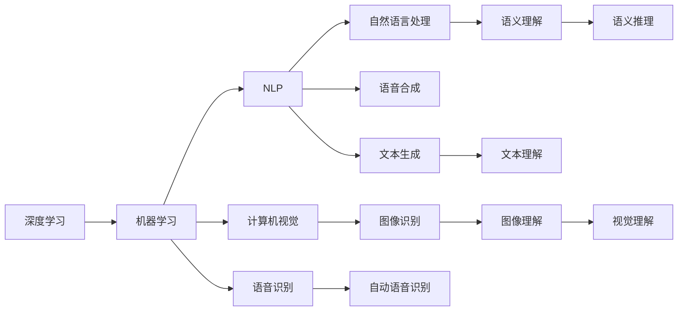

                 

# 李开复：AI 2.0 时代的机遇

> 关键词：AI 2.0, 人工智能, 创新创业, 大数据, 云计算, 智能化转型

## 1. 背景介绍

随着AI技术的快速发展和应用的不断深入，我们已经步入了AI 2.0时代。这是一个全新的时代，一个AI与各行各业深度融合、共同进化的时代。在这个时代，AI不仅是技术，更是一种全新的思维方式、一种全新的商业模式。在AI 2.0时代，每一位企业和个人都面临前所未有的机遇和挑战。本文将从AI 2.0的概念出发，探讨其在各个领域的机遇和挑战，为读者提供一份全面而深入的视角。

## 2. 核心概念与联系

### 2.1 核心概念概述

要理解AI 2.0时代的机遇，首先需要了解几个核心概念：

- **AI 2.0**：即人工智能2.0，是指新一代AI技术的演进，包括但不限于深度学习、机器学习、自然语言处理、计算机视觉、语音识别等前沿技术的突破。AI 2.0不仅关注技术本身，更注重技术在实际应用中的深度融合和创新。
- **深度学习**：一种基于神经网络的机器学习技术，通过多层神经元的非线性组合，可以自动从大量数据中学习复杂模式，实现高精度的预测和分类。
- **机器学习**：利用数据和算法，使计算机系统能够从经验中学习和改进，而无需显式地编程。机器学习包括监督学习、非监督学习和强化学习等多种形式。
- **自然语言处理(NLP)**：让计算机能够理解和生成自然语言的技术。NLP在AI 2.0时代得到了极大的发展，使得机器能够处理语言中的复杂语义和语法结构。
- **计算机视觉**：让计算机能够理解和分析图像和视频中的视觉信息，实现自动化的视觉处理和识别。
- **语音识别**：让计算机能够理解和转录人类语音，实现语音交互和自动语音识别。

这些核心概念相互联系、相互促进，共同构成了AI 2.0时代的技术基础。

### 2.2 核心概念原理和架构的 Mermaid 流程图



这个流程图展示了深度学习、机器学习与NLP、计算机视觉、语音识别等核心技术之间的联系和交互。

## 3. 核心算法原理 & 具体操作步骤

### 3.1 算法原理概述

AI 2.0时代的核心算法原理主要集中在深度学习、机器学习和自然语言处理等方面。下面分别介绍这些技术的基本原理。

#### 3.1.1 深度学习

深度学习是一种基于神经网络的机器学习技术。其核心思想是通过多层神经元的非线性组合，自动从大量数据中学习复杂模式。深度学习模型包括卷积神经网络(CNN)、循环神经网络(RNN)、长短时记忆网络(LSTM)、变压器(Transformer)等。这些模型通过自动学习数据的特征，实现高精度的预测和分类。

#### 3.1.2 机器学习

机器学习通过数据和算法，使计算机系统能够从经验中学习和改进。常用的机器学习算法包括监督学习、非监督学习和强化学习。监督学习通过标记的数据集进行训练，非监督学习通过无标记的数据集进行训练，强化学习通过与环境的交互进行训练。

#### 3.1.3 自然语言处理

自然语言处理是指让计算机能够理解和生成自然语言的技术。NLP的核心任务包括词向量嵌入、文本分类、命名实体识别、情感分析、机器翻译等。NLP技术在AI 2.0时代得到了极大的发展，使得机器能够处理语言中的复杂语义和语法结构。

### 3.2 算法步骤详解

下面以机器翻译为例，详细讲解AI 2.0时代机器翻译的算法步骤。

#### 3.2.1 数据准备

机器翻译的数据准备包括两个阶段：数据收集和数据预处理。数据收集阶段需要收集源语言和目标语言的平行语料库，通常包括新闻、小说、科技论文等。数据预处理阶段需要将数据进行清洗、分词、词性标注等操作，以提高数据质量。

#### 3.2.2 模型选择

选择合适的机器翻译模型是机器翻译成功的关键。常用的模型包括基于规则的模型、统计机器翻译模型、基于神经网络的模型等。其中，基于神经网络的模型，如Transformer，因其强大的泛化能力和效率，成为主流的选择。

#### 3.2.3 模型训练

在选择了合适的模型后，需要对模型进行训练。训练过程包括设置超参数、划分训练集和验证集、迭代优化模型参数等步骤。训练过程中需要使用反向传播算法进行梯度更新，以最小化损失函数。

#### 3.2.4 模型评估

模型训练完成后，需要进行模型评估。评估指标包括BLEU、ROUGE等自动评价指标，以及人工评估指标，如流畅度、准确度等。评估结果可以帮助调整模型参数，进一步提升翻译质量。

### 3.3 算法优缺点

#### 3.3.1 优点

1. **高精度**：深度学习等技术能够自动从大量数据中学习复杂模式，实现高精度的预测和分类。
2. **高效性**：基于神经网络的模型能够并行计算，具有较高的计算效率。
3. **泛化能力**：机器学习模型通过数据驱动，具有较强的泛化能力，能够适应新数据。
4. **自适应性**：自然语言处理技术能够自动理解和生成自然语言，具有较强的自适应性。

#### 3.3.2 缺点

1. **数据需求大**：深度学习等技术需要大量标注数据进行训练，数据需求大。
2. **模型复杂**：深度学习模型结构复杂，训练和推理过程需要高性能计算资源。
3. **易过拟合**：模型复杂可能导致过拟合，需要更多的正则化技术进行优化。
4. **可解释性不足**：深度学习模型往往是“黑盒”，难以解释其内部工作机制。

### 3.4 算法应用领域

AI 2.0时代的算法在多个领域得到了广泛应用，包括但不限于医疗、金融、制造、零售等。下面以医疗为例，探讨AI 2.0技术在医疗领域的应用。

#### 3.4.1 医疗领域的应用

1. **疾病预测与诊断**：通过分析医疗数据，预测患者的疾病风险，帮助医生进行早期诊断和治疗。
2. **个性化治疗方案**：基于患者的基因、生活习惯等数据，制定个性化的治疗方案。
3. **药物研发**：利用AI技术加速新药研发，降低研发成本和风险。
4. **智能辅助诊疗**：利用AI技术辅助医生进行病历分析、手术规划等，提高诊疗效率。

## 4. 数学模型和公式 & 详细讲解 & 举例说明

### 4.1 数学模型构建

AI 2.0技术的数学模型通常包括深度学习模型和机器学习模型。以深度学习模型为例，其数学模型构建如下：

设输入为 $x$，输出为 $y$，模型参数为 $\theta$，则深度学习模型的预测公式为：

$$
y = f(x; \theta)
$$

其中 $f$ 为模型的非线性映射函数。

### 4.2 公式推导过程

以神经网络为例，其公式推导过程如下：

设输入层有 $n$ 个神经元，输出层有 $m$ 个神经元，隐藏层有 $h$ 个神经元。则神经网络的输出公式为：

$$
y = g(W_{h}x + b_{h})
$$

其中 $W_{h}$ 为隐藏层的权重矩阵，$b_{h}$ 为隐藏层的偏置向量。$g$ 为激活函数。

### 4.3 案例分析与讲解

以神经网络在图像识别中的应用为例。图像识别任务需要将输入的图像识别为特定类别。神经网络通过多层卷积和池化操作，提取图像的特征，再通过全连接层进行分类。其训练过程如下：

1. 数据准备：收集大量的标注图像数据。
2. 模型选择：选择卷积神经网络模型。
3. 模型训练：通过反向传播算法，最小化损失函数，更新模型参数。
4. 模型评估：使用测试集进行评估，优化模型参数。

## 5. 项目实践：代码实例和详细解释说明

### 5.1 开发环境搭建

AI 2.0技术通常使用Python编程语言，结合TensorFlow、PyTorch等深度学习框架进行开发。以下是在Python环境下搭建AI 2.0开发环境的示例：

1. 安装Python：从官网下载并安装Python，建议选择3.x版本。
2. 安装深度学习框架：使用pip安装TensorFlow、PyTorch等深度学习框架。
3. 安装相关库：使用pip安装NumPy、SciPy、Pandas等常用库。
4. 配置环境：设置环境变量，配置好GPU、CPU等硬件资源。

### 5.2 源代码详细实现

以神经网络在图像识别中的应用为例，展示代码实现：

```python
import tensorflow as tf
from tensorflow.keras import layers

# 定义卷积层
def conv2d(x, filters, kernel_size, strides, padding):
    x = layers.Conv2D(filters, kernel_size, strides, padding)(x)
    x = layers.BatchNormalization()(x)
    x = layers.Activation('relu')(x)
    return x

# 定义神经网络模型
model = tf.keras.Sequential([
    conv2d(inputs, filters=32, kernel_size=(3,3), strides=(1,1), padding='same'),
    conv2d(x, filters=64, kernel_size=(3,3), strides=(2,2), padding='same'),
    conv2d(x, filters=128, kernel_size=(3,3), strides=(2,2), padding='same'),
    layers.Flatten(),
    layers.Dense(1024, activation='relu'),
    layers.Dense(10, activation='softmax')
])

# 编译模型
model.compile(optimizer='adam', loss='sparse_categorical_crossentropy', metrics=['accuracy'])

# 训练模型
model.fit(train_images, train_labels, epochs=10, batch_size=32, validation_data=(val_images, val_labels))

# 评估模型
test_loss, test_acc = model.evaluate(test_images, test_labels)
print('Test accuracy:', test_acc)
```

### 5.3 代码解读与分析

以上代码实现了一个基本的卷积神经网络模型。通过定义卷积层、激活函数、池化层等组件，构建了一个包含多个卷积层和全连接层的神经网络。训练过程中，使用Adam优化器和交叉熵损失函数，进行反向传播和参数更新。评估过程中，使用测试集进行精度计算。

## 6. 实际应用场景

### 6.4 未来应用展望

AI 2.0时代的应用场景非常广泛，以下是几个典型的应用场景：

#### 6.4.1 智能医疗

智能医疗是AI 2.0时代的重要应用之一。AI技术在医疗领域的应用包括疾病预测与诊断、个性化治疗方案、药物研发、智能辅助诊疗等。通过AI技术，可以提高医疗服务的效率和质量，降低医疗成本。

#### 6.4.2 智能制造

智能制造是指通过AI技术优化生产过程，提高生产效率和质量。AI 2.0技术在智能制造中的应用包括质量检测、生产调度、设备维护等。通过AI技术，可以实现智能化生产，降低生产成本，提高产品品质。

#### 6.4.3 智能零售

智能零售是指通过AI技术优化零售过程，提高顾客体验和销售效率。AI 2.0技术在智能零售中的应用包括库存管理、顾客推荐、销售预测等。通过AI技术，可以提高零售企业的运营效率，增加销售额。

#### 6.4.4 智能金融

智能金融是指通过AI技术优化金融服务，提高金融效率和安全性。AI 2.0技术在智能金融中的应用包括信用评估、风险管理、反欺诈等。通过AI技术，可以提高金融服务的质量和安全性，降低金融风险。

## 7. 工具和资源推荐

### 7.1 学习资源推荐

为了帮助开发者系统掌握AI 2.0技术的理论基础和实践技巧，这里推荐一些优质的学习资源：

1. Coursera AI课程：由斯坦福大学等名校开设的AI课程，涵盖深度学习、机器学习、自然语言处理等多个方面。
2. DeepLearning.AI课程：由吴恩达教授开设的深度学习课程，涵盖深度学习的基本原理和实践技巧。
3. TensorFlow官方文档：TensorFlow官方文档，详细介绍了TensorFlow的使用方法和应用场景。
4. PyTorch官方文档：PyTorch官方文档，详细介绍了PyTorch的使用方法和应用场景。
5. Kaggle竞赛平台：Kaggle是全球最大的数据科学竞赛平台，提供丰富的数据集和竞赛任务，帮助开发者实践AI技术。

### 7.2 开发工具推荐

高效的开发离不开优秀的工具支持。以下是几款用于AI 2.0技术开发的常用工具：

1. Jupyter Notebook：支持Python编程，集成多款数据可视化工具，方便开发者进行数据探索和模型调试。
2. TensorBoard：TensorFlow配套的可视化工具，可实时监测模型训练状态，并提供丰富的图表呈现方式。
3. Keras：基于TensorFlow和Theano开发的高级神经网络API，使用方便，易于上手。
4. PyTorch：由Facebook开发的深度学习框架，支持动态计算图，灵活性高。
5. Anaconda：支持Python编程的集成开发环境，提供丰富的科学计算库和工具。

### 7.3 相关论文推荐

AI 2.0技术的发展源于学界的持续研究。以下是几篇奠基性的相关论文，推荐阅读：

1. Deep Learning：Ian Goodfellow等著作的深度学习经典教材，涵盖深度学习的基本原理和应用场景。
2. Convolutional Neural Networks for Visual Recognition：Alex Krizhevsky等在ImageNet上的突破性论文，开创了卷积神经网络的时代。
3. Attention is All You Need：Google的研究团队在NIPS上发表的Transformer论文，提出自注意力机制，为神经网络带来了革命性的提升。
4. ImageNet Classification with Deep Convolutional Neural Networks：Alex Krizhevsky等在ImageNet上的突破性论文，开创了卷积神经网络的时代。
5. Natural Language Processing with Transformers：Jacob Devlin等在2018年提出的BERT模型，展示了Transformer在自然语言处理任务中的强大能力。

这些论文代表了AI 2.0技术的发展脉络，帮助研究者把握学科前进方向，激发更多的创新灵感。

## 8. 总结：未来发展趋势与挑战

### 8.1 研究成果总结

AI 2.0技术的快速发展，使得其在各个领域得到了广泛应用。通过深度学习、机器学习和自然语言处理等技术，AI 2.0时代带来了前所未有的机遇和挑战。本文从AI 2.0的概念出发，探讨了其在各个领域的应用，为读者提供了一份全面而深入的视角。

### 8.2 未来发展趋势

AI 2.0技术的未来发展趋势主要集中在以下几个方面：

1. **深度学习技术的进一步发展**：深度学习技术将继续向更深层次和更广泛领域拓展，推动AI技术的全面发展。
2. **多模态学习技术的突破**：多模态学习技术能够融合视觉、听觉等多种信息，实现更加全面和准确的AI应用。
3. **自适应学习技术的成熟**：自适应学习技术能够根据环境和用户需求自动调整模型参数，提高AI系统的灵活性和可扩展性。
4. **模型压缩和优化技术的进步**：模型压缩和优化技术能够提高AI模型的计算效率和资源利用率，降低AI系统的开发和维护成本。

### 8.3 面临的挑战

AI 2.0技术在发展过程中，也面临着诸多挑战：

1. **数据需求大**：深度学习等技术需要大量标注数据进行训练，数据需求大。
2. **模型复杂**：深度学习模型结构复杂，训练和推理过程需要高性能计算资源。
3. **可解释性不足**：深度学习模型往往是“黑盒”，难以解释其内部工作机制。
4. **伦理和安全问题**：AI技术的广泛应用带来了伦理和安全问题，如隐私保护、模型偏见等。

### 8.4 研究展望

未来，AI 2.0技术需要在以下几个方面寻求新的突破：

1. **深度学习技术的优化**：优化深度学习模型结构，提高其计算效率和鲁棒性。
2. **多模态学习技术的融合**：融合视觉、听觉等多种信息，实现更加全面和准确的AI应用。
3. **自适应学习技术的探索**：探索自适应学习技术，提高AI系统的灵活性和可扩展性。
4. **模型压缩和优化技术的研究**：研究模型压缩和优化技术，提高AI模型的计算效率和资源利用率。
5. **伦理和安全问题的研究**：研究AI技术的伦理和安全问题，确保AI系统的公平性和安全性。

总之，AI 2.0技术具有广阔的发展前景，但同时也面临着诸多挑战。未来，需要通过多学科的协同合作，解决这些挑战，推动AI技术向更广泛、更深入、更安全的方向发展。

## 9. 附录：常见问题与解答

**Q1：什么是AI 2.0技术？**

A: AI 2.0技术是指新一代AI技术的演进，包括但不限于深度学习、机器学习、自然语言处理、计算机视觉、语音识别等前沿技术的突破。AI 2.0不仅关注技术本身，更注重技术在实际应用中的深度融合和创新。

**Q2：AI 2.0技术在医疗领域的应用有哪些？**

A: AI 2.0技术在医疗领域的应用包括疾病预测与诊断、个性化治疗方案、药物研发、智能辅助诊疗等。通过AI技术，可以提高医疗服务的效率和质量，降低医疗成本。

**Q3：AI 2.0技术的未来发展趋势是什么？**

A: AI 2.0技术的未来发展趋势主要集中在深度学习技术的进一步发展、多模态学习技术的突破、自适应学习技术的成熟、模型压缩和优化技术的进步等方面。

**Q4：AI 2.0技术在实际应用中面临哪些挑战？**

A: AI 2.0技术在实际应用中面临的挑战包括数据需求大、模型复杂、可解释性不足、伦理和安全问题等。

**Q5：如何克服AI 2.0技术面临的挑战？**

A: 克服AI 2.0技术面临的挑战需要多学科的协同合作，通过优化深度学习模型结构、融合多模态学习技术、探索自适应学习技术、研究模型压缩和优化技术、研究伦理和安全问题等方式，推动AI技术向更广泛、更深入、更安全的方向发展。

---

作者：禅与计算机程序设计艺术 / Zen and the Art of Computer Programming

