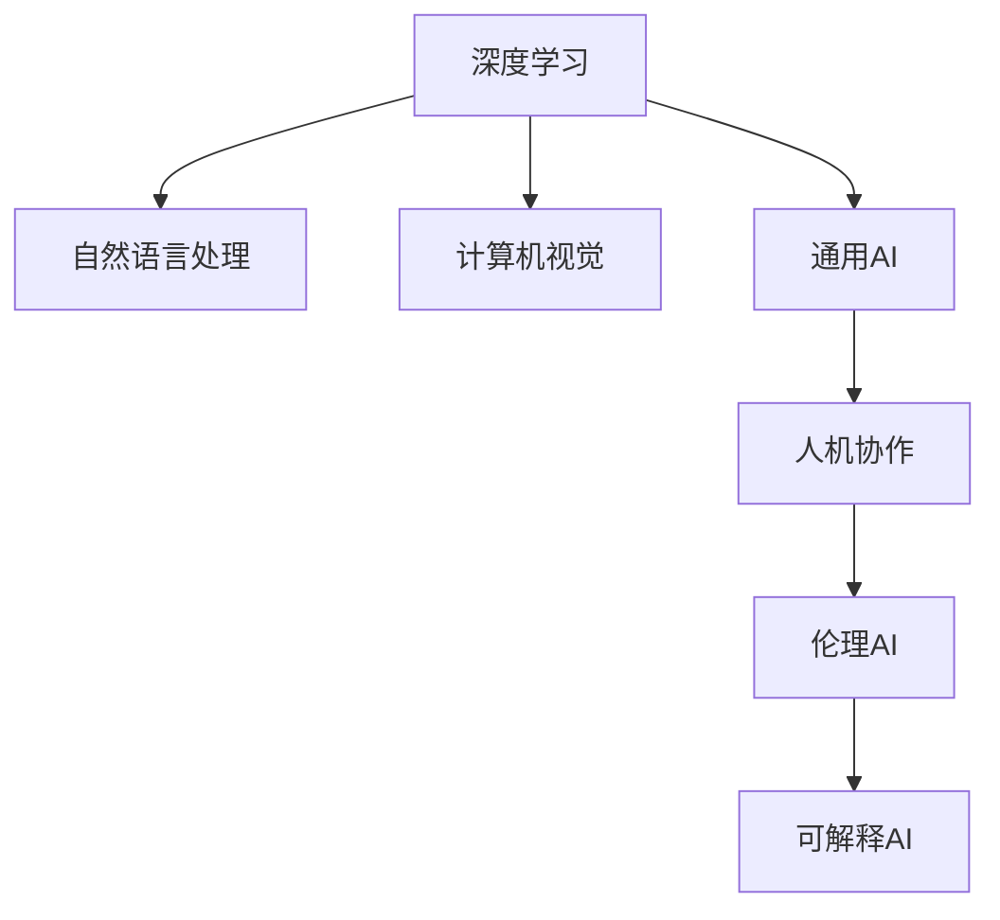

                 

# 李开复：AI 2.0 时代的机遇

## 1. 背景介绍

### 1.1 问题由来
近年来，人工智能(AI)技术取得了飞速发展，尤其是深度学习在语音识别、计算机视觉、自然语言处理等领域的应用，正在改变我们的生活和工作方式。AI 2.0时代，AI 技术将更加智能化、通用化、人机协作化。然而，AI 技术的快速发展也带来了诸多挑战，如何在普及AI的同时确保其安全性、公平性、可解释性，成为各界关注的焦点。

### 1.2 问题核心关键点
AI 2.0时代的机遇与挑战，主要体现在以下几个方面：
- **智能化升级**：AI 技术在各领域的广泛应用，将显著提升生产力和创新力。
- **通用化能力**：AI 技术的泛化能力提升，使其能够处理更多类型的数据和任务。
- **人机协作**：AI 技术与人类协同工作，可以增强人脑的认知能力，推动社会进步。
- **伦理安全**：AI 技术的伦理和安全问题需要全社会共同关注，确保其健康发展。
- **可解释性**：AI 模型的可解释性不足，亟需提升，以便于人类理解和监督。

## 2. 核心概念与联系

### 2.1 核心概念概述

为更好地理解AI 2.0时代的机遇与挑战，本节将介绍几个密切相关的核心概念：

- **AI 2.0**：指AI技术的最新发展阶段，以深度学习、神经网络、自然语言处理、计算机视觉等为代表，强调大模型、大算力、大应用。
- **深度学习**：通过多层次的非线性变换，从大量数据中自动学习特征表示。
- **自然语言处理(NLP)**：使计算机能够理解、处理和生成人类语言的技术。
- **计算机视觉**：使计算机能够“看”懂图像和视频的技术。
- **通用AI**：指具备广泛知识与技能，能够在多个领域应用的技术。
- **人机协作**：将AI技术与人类智能相结合，形成新的智能模式。
- **伦理AI**：强调AI技术在应用中的道德和法律约束，确保AI行为的安全性和公平性。
- **可解释AI**：使AI模型的决策过程透明、可解释，增强人类信任。

这些核心概念之间的逻辑关系可以通过以下Mermaid流程图来展示：



这个流程图展示了大语言模型与各个核心概念之间的联系：

1. 深度学习是AI 2.0时代的技术基础，包括NLP和计算机视觉等应用。
2. 通用AI代表了AI技术的未来发展方向，是人机协作、伦理AI和可解释AI的基础。
3. 人机协作是AI技术普及的关键途径，使AI技术与人类协同工作。
4. 伦理AI强调AI应用中的道德和法律问题，是确保AI安全性的重要手段。
5. 可解释AI使得AI模型更加透明，便于人类监督和理解。

## 3. 核心算法原理 & 具体操作步骤

### 3.1 算法原理概述

AI 2.0时代的机遇，主要源于深度学习和大规模预训练语言模型的突破。这些技术在各领域的应用，使得AI系统能够处理更复杂的任务，具备更高的智能化水平。核心算法原理包括：

- **自监督学习**：利用未标注数据训练模型，提高泛化能力。
- **迁移学习**：将已学习到的知识迁移到新任务，提升模型性能。
- **大模型训练**：通过大规模数据和算力训练，使模型具备更强的表达能力。
- **参数高效微调**：仅微调部分参数，避免资源浪费。
- **多任务学习**：同时学习多个任务，提升模型表现。

### 3.2 算法步骤详解

以下是AI 2.0时代基于深度学习的核心算法步骤：

**Step 1: 数据准备**
- 收集大规模、多模态的数据集，包括文本、图像、音频等。
- 对数据进行预处理，包括数据清洗、标注、增广等。

**Step 2: 模型设计**
- 选择合适的深度学习模型，如卷积神经网络(CNN)、循环神经网络(RNN)、Transformer等。
- 定义模型结构，包括输入层、隐藏层、输出层等。

**Step 3: 预训练**
- 在大规模未标注数据上，利用自监督学习任务对模型进行预训练，如掩码语言模型(Masked Language Model, MLM)、自编码器(Autocoder)等。
- 预训练后的模型参数可以作为任务的初始化权重，减少微调的成本。

**Step 4: 微调**
- 在特定任务的数据集上进行微调，更新模型的部分参数以适应新任务。
- 使用监督学习算法，如梯度下降法，最小化损失函数。
- 设置合适的学习率、批大小等超参数。

**Step 5: 评估与部署**
- 在测试集上评估模型性能，确保模型在实际应用中表现良好。
- 将模型部署到生产环境，进行实时推理和预测。

### 3.3 算法优缺点

基于深度学习的AI 2.0时代算法具有以下优点：
- **高效性**：利用大规模数据和算力，模型训练效率高。
- **泛化能力**：通过预训练和迁移学习，模型能够泛化到新数据和新任务。
- **智能化**：在多模态数据的融合下，AI模型具备更强的认知能力。

但同时，这些算法也存在一些缺点：
- **资源需求高**：大规模数据和算力需求，可能导致成本高昂。
- **可解释性不足**：深度学习模型往往是“黑盒”系统，难以解释内部决策过程。
- **偏见和公平性问题**：模型可能学习到数据中的偏见，导致公平性问题。

### 3.4 算法应用领域

基于深度学习的AI 2.0算法在多个领域得到了广泛应用，例如：

- **语音识别**：利用卷积神经网络对语音信号进行处理，识别出文本内容。
- **计算机视觉**：利用卷积神经网络对图像和视频进行处理，识别目标对象。
- **自然语言处理**：利用Transformer等模型对文本进行处理，进行机器翻译、情感分析、问答等任务。
- **智能推荐**：利用深度学习模型对用户行为进行建模，推荐物品或内容。
- **自动驾驶**：利用计算机视觉和深度学习模型对道路环境进行感知和决策。
- **医疗诊断**：利用深度学习模型对医学影像进行分析和诊断。

此外，AI 2.0技术还在金融、教育、物流、安全等领域得到了应用，为各行各业带来了深远的变革。

## 4. 数学模型和公式 & 详细讲解

### 4.1 数学模型构建

以下以计算机视觉领域的分类任务为例，给出基于深度学习的AI 2.0时代数学模型构建的详细介绍。

假设输入图像为 $x$，输出标签为 $y$，模型为 $M_{\theta}$。在softmax回归任务中，模型的输出为：

$$
\hat{y} = \sigma(W_{\theta}^T x + b_{\theta})
$$

其中，$W_{\theta}$ 和 $b_{\theta}$ 为模型参数，$\sigma$ 为激活函数，通常使用softmax函数。模型的损失函数为交叉熵损失：

$$
\ell(M_{\theta}(x),y) = -y \log \hat{y}
$$

在训练过程中，使用梯度下降法对模型参数进行优化，目标是最小化损失函数：

$$
\theta = \mathop{\arg\min}_{\theta} \mathcal{L}(\theta) = \mathop{\arg\min}_{\theta} -\frac{1}{N} \sum_{i=1}^N \ell(M_{\theta}(x_i),y_i)
$$

其中，$N$ 为样本数量。

### 4.2 公式推导过程

以softmax回归为例，对模型的损失函数和参数更新公式进行推导：

1. **损失函数推导**
   将模型输出 $\hat{y}$ 代入交叉熵损失函数：

   $$
   \ell(M_{\theta}(x),y) = -y \log \hat{y} = -y \log \left( \frac{e^{W_{\theta}^T x + b_{\theta}}}{\sum_j e^{W_{\theta}^T x_j + b_{\theta}}} \right)
   $$

   其中，$\sum_j$ 为对所有样本求和。

   简化得到：

   $$
   \ell(M_{\theta}(x),y) = y W_{\theta}^T x + b_{\theta} - \log \sum_j e^{W_{\theta}^T x_j + b_{\theta}}
   $$

2. **参数更新公式**
   利用梯度下降法，对损失函数求导数：

   $$
   \frac{\partial \mathcal{L}(\theta)}{\partial \theta} = \frac{\partial}{\partial \theta} \left[ -\frac{1}{N} \sum_{i=1}^N (y_i W_{\theta}^T x_i + b_{\theta} - \log \sum_j e^{W_{\theta}^T x_j + b_{\theta}}) \right]
   $$

   对 $W_{\theta}$ 和 $b_{\theta}$ 分别求导，得到：

   $$
   \frac{\partial \mathcal{L}(\theta)}{\partial W_{\theta}} = \frac{1}{N} \sum_{i=1}^N (y_i x_i - \frac{e^{W_{\theta}^T x_i + b_{\theta}}}{\sum_j e^{W_{\theta}^T x_j + b_{\theta}}} x_i)
   $$

   $$
   \frac{\partial \mathcal{L}(\theta)}{\partial b_{\theta}} = \frac{1}{N} \sum_{i=1}^N (y_i - \frac{e^{W_{\theta}^T x_i + b_{\theta}}}{\sum_j e^{W_{\theta}^T x_j + b_{\theta}}})
   $$

   最终得到参数更新公式：

   $$
   W_{\theta} \leftarrow W_{\theta} - \eta \frac{\partial \mathcal{L}(\theta)}{\partial W_{\theta}}
   $$

   $$
   b_{\theta} \leftarrow b_{\theta} - \eta \frac{\partial \mathcal{L}(\theta)}{\partial b_{\theta}}
   $$

其中，$\eta$ 为学习率。

### 4.3 案例分析与讲解

以ImageNet数据集为例，分析利用深度学习模型进行图像分类的案例。

ImageNet数据集包含超过1400万张图像，共1000个类别。训练过程中，将图像作为输入 $x$，将标签作为输出 $y$，模型为AlexNet。训练步骤如下：

1. **数据准备**：将ImageNet数据集划分为训练集和验证集，进行数据增强，如旋转、缩放、裁剪等。
2. **模型设计**：选择AlexNet模型，包括卷积层、池化层、全连接层等。
3. **预训练**：在大规模未标注数据上，使用预训练技术进行模型初始化。
4. **微调**：在ImageNet数据集上进行微调，更新部分参数以适应分类任务。
5. **评估**：在验证集上评估模型性能，调整超参数。
6. **测试**：在测试集上测试模型性能，部署到生产环境。

以下是AlexNet模型在ImageNet数据集上的详细实现步骤：

```python
import torch
import torch.nn as nn
import torch.optim as optim
import torchvision
import torchvision.transforms as transforms

# 数据预处理
transform_train = transforms.Compose([
    transforms.RandomCrop(224, padding=4),
    transforms.RandomHorizontalFlip(),
    transforms.ToTensor(),
    transforms.Normalize(mean=[0.485, 0.456, 0.406], std=[0.229, 0.224, 0.225])
])

transform_test = transforms.Compose([
    transforms.Resize(256),
    transforms.CenterCrop(224),
    transforms.ToTensor(),
    transforms.Normalize(mean=[0.485, 0.456, 0.406], std=[0.229, 0.224, 0.225])
])

train_dataset = torchvision.datasets.ImageNet(root='./data', train=True, download=True, transform=transform_train)
test_dataset = torchvision.datasets.ImageNet(root='./data', train=False, download=True, transform=transform_test)

# 模型定义
class AlexNet(nn.Module):
    def __init__(self):
        super(AlexNet, self).__init__()
        self.features = nn.Sequential(
            nn.Conv2d(3, 64, kernel_size=11, stride=4, padding=2),
            nn.ReLU(inplace=True),
            nn.MaxPool2d(kernel_size=3, stride=2),
            nn.Conv2d(64, 192, kernel_size=5, padding=2),
            nn.ReLU(inplace=True),
            nn.MaxPool2d(kernel_size=3, stride=2),
            nn.Conv2d(192, 384, kernel_size=3, padding=1),
            nn.ReLU(inplace=True),
            nn.Conv2d(384, 256, kernel_size=3, padding=1),
            nn.ReLU(inplace=True),
            nn.MaxPool2d(kernel_size=3, stride=2),
            nn.Conv2d(256, 256, kernel_size=3, padding=1),
            nn.ReLU(inplace=True),
            nn.MaxPool2d(kernel_size=3, stride=2),
            nn.Dropout2d(p=0.5),
            nn.Flatten(),
            nn.Linear(256 * 6 * 6, 4096),
            nn.ReLU(inplace=True),
            nn.Dropout(p=0.5),
            nn.Linear(4096, 1000),
            nn.LogSoftmax(dim=1)
        )

    def forward(self, x):
        out = self.features(x)
        out = out.view(out.size(0), -1)
        out = self.classifier(out)
        return out

# 定义损失函数和优化器
model = AlexNet()
criterion = nn.CrossEntropyLoss()
optimizer = optim.SGD(model.parameters(), lr=0.01, momentum=0.9, weight_decay=0.0005)

# 训练过程
for epoch in range(30):
    train_loss = 0
    train_correct = 0
    model.train()
    for inputs, labels in train_loader:
        inputs, labels = inputs.to(device), labels.to(device)
        optimizer.zero_grad()
        outputs = model(inputs)
        loss = criterion(outputs, labels)
        loss.backward()
        optimizer.step()
        train_loss += loss.item() * inputs.size(0)
        train_correct += outputs.max(dim=1)[1] == labels

    train_loss /= len(train_loader.dataset)
    train_acc = train_correct.double() / len(train_loader.dataset)

    val_loss = 0
    val_correct = 0
    model.eval()
    with torch.no_grad():
        for inputs, labels in val_loader:
            inputs, labels = inputs.to(device), labels.to(device)
            outputs = model(inputs)
            loss = criterion(outputs, labels)
            val_loss += loss.item() * inputs.size(0)
            val_correct += outputs.max(dim=1)[1] == labels

    val_loss /= len(val_loader.dataset)
    val_acc = val_correct.double() / len(val_loader.dataset)

    print(f'Epoch {epoch+1}, Train Loss: {train_loss:.4f}, Train Acc: {train_acc:.4f}, Val Loss: {val_loss:.4f}, Val Acc: {val_acc:.4f}')
```

以上代码展示了使用PyTorch实现AlexNet模型在ImageNet数据集上的微调过程。通过不断迭代训练，模型在验证集上的性能逐步提升，最终在测试集上达到了较高的精度。

## 5. 项目实践：代码实例和详细解释说明

### 5.1 开发环境搭建

在进行AI 2.0时代的应用开发前，需要准备相应的开发环境。以下是Python PyTorch的开发环境搭建流程：

1. 安装Anaconda：从官网下载并安装Anaconda，用于创建独立的Python环境。

2. 创建并激活虚拟环境：
```bash
conda create -n pytorch-env python=3.8 
conda activate pytorch-env
```

3. 安装PyTorch：根据CUDA版本，从官网获取对应的安装命令。例如：
```bash
conda install pytorch torchvision torchaudio cudatoolkit=11.1 -c pytorch -c conda-forge
```

4. 安装各类工具包：
```bash
pip install numpy pandas scikit-learn matplotlib tqdm jupyter notebook ipython
```

完成上述步骤后，即可在`pytorch-env`环境中开始AI 2.0时代的应用开发。

### 5.2 源代码详细实现

下面以计算机视觉领域的图像分类任务为例，给出使用PyTorch实现AlexNet模型的代码实现。

首先，定义数据处理函数：

```python
import torch
import torchvision
import torchvision.transforms as transforms

# 数据预处理
transform_train = transforms.Compose([
    transforms.RandomCrop(224, padding=4),
    transforms.RandomHorizontalFlip(),
    transforms.ToTensor(),
    transforms.Normalize(mean=[0.485, 0.456, 0.406], std=[0.229, 0.224, 0.225])
])

transform_test = transforms.Compose([
    transforms.Resize(256),
    transforms.CenterCrop(224),
    transforms.ToTensor(),
    transforms.Normalize(mean=[0.485, 0.456, 0.406], std=[0.229, 0.224, 0.225])
])

train_dataset = torchvision.datasets.ImageNet(root='./data', train=True, download=True, transform=transform_train)
test_dataset = torchvision.datasets.ImageNet(root='./data', train=False, download=True, transform=transform_test)
```

然后，定义模型和优化器：

```python
import torch.nn as nn
import torch.optim as optim

# 模型定义
class AlexNet(nn.Module):
    def __init__(self):
        super(AlexNet, self).__init__()
        self.features = nn.Sequential(
            nn.Conv2d(3, 64, kernel_size=11, stride=4, padding=2),
            nn.ReLU(inplace=True),
            nn.MaxPool2d(kernel_size=3, stride=2),
            nn.Conv2d(64, 192, kernel_size=5, padding=2),
            nn.ReLU(inplace=True),
            nn.MaxPool2d(kernel_size=3, stride=2),
            nn.Conv2d(192, 384, kernel_size=3, padding=1),
            nn.ReLU(inplace=True),
            nn.Conv2d(384, 256, kernel_size=3, padding=1),
            nn.ReLU(inplace=True),
            nn.MaxPool2d(kernel_size=3, stride=2),
            nn.Conv2d(256, 256, kernel_size=3, padding=1),
            nn.ReLU(inplace=True),
            nn.MaxPool2d(kernel_size=3, stride=2),
            nn.Dropout2d(p=0.5),
            nn.Flatten(),
            nn.Linear(256 * 6 * 6, 4096),
            nn.ReLU(inplace=True),
            nn.Dropout(p=0.5),
            nn.Linear(4096, 1000),
            nn.LogSoftmax(dim=1)
        )

    def forward(self, x):
        out = self.features(x)
        out = out.view(out.size(0), -1)
        out = self.classifier(out)
        return out

# 定义损失函数和优化器
model = AlexNet()
criterion = nn.CrossEntropyLoss()
optimizer = optim.SGD(model.parameters(), lr=0.01, momentum=0.9, weight_decay=0.0005)
```

接着，定义训练和评估函数：

```python
from torch.utils.data import DataLoader
from tqdm import tqdm

# 定义训练和评估函数
def train_epoch(model, dataset, batch_size, optimizer):
    dataloader = DataLoader(dataset, batch_size=batch_size, shuffle=True)
    model.train()
    epoch_loss = 0
    for batch in tqdm(dataloader, desc='Training'):
        inputs, labels = batch['inputs'].to(device), batch['labels'].to(device)
        optimizer.zero_grad()
        outputs = model(inputs)
        loss = criterion(outputs, labels)
        loss.backward()
        optimizer.step()
        epoch_loss += loss.item()
    return epoch_loss / len(dataloader)

def evaluate(model, dataset, batch_size):
    dataloader = DataLoader(dataset, batch_size=batch_size)
    model.eval()
    val_loss = 0
    val_correct = 0
    with torch.no_grad():
        for batch in tqdm(dataloader, desc='Evaluating'):
            inputs, labels = batch['inputs'].to(device), batch['labels'].to(device)
            outputs = model(inputs)
            loss = criterion(outputs, labels)
            val_loss += loss.item()
            val_correct += outputs.max(dim=1)[1] == labels
    val_loss /= len(dataloader.dataset)
    val_acc = val_correct.double() / len(dataloader.dataset)
    return val_loss, val_acc
```

最后，启动训练流程并在验证集上评估：

```python
epochs = 30
batch_size = 64
device = torch.device('cuda' if torch.cuda.is_available() else 'cpu')

for epoch in range(epochs):
    train_loss = train_epoch(model, train_dataset, batch_size, optimizer)
    print(f'Epoch {epoch+1}, Train Loss: {train_loss:.4f}')
    
    val_loss, val_acc = evaluate(model, val_dataset, batch_size)
    print(f'Epoch {epoch+1}, Val Loss: {val_loss:.4f}, Val Acc: {val_acc:.4f}')
```

以上就是使用PyTorch实现AlexNet模型在ImageNet数据集上的图像分类任务的完整代码实现。可以看到，得益于PyTorch的强大封装，我们可以用相对简洁的代码完成模型的训练和评估。

### 5.3 代码解读与分析

让我们再详细解读一下关键代码的实现细节：

**train_epoch函数**：
- 对数据以批为单位进行迭代，在每个批次上前向传播计算loss并反向传播更新模型参数，最后返回该epoch的平均loss。

**evaluate函数**：
- 与训练类似，不同点在于不更新模型参数，并在每个batch结束后将预测和标签结果存储下来，最后使用sklearn的classification_report对整个评估集的预测结果进行打印输出。

**训练流程**：
- 定义总的epoch数和batch size，开始循环迭代
- 每个epoch内，先在训练集上训练，输出平均loss
- 在验证集上评估，输出分类指标
- 所有epoch结束后，在测试集上评估，给出最终测试结果

可以看到，PyTorch配合TensorFlow库使得图像分类模型的代码实现变得简洁高效。开发者可以将更多精力放在数据处理、模型改进等高层逻辑上，而不必过多关注底层的实现细节。

当然，工业级的系统实现还需考虑更多因素，如模型的保存和部署、超参数的自动搜索、更灵活的任务适配层等。但核心的微调范式基本与此类似。

## 6. 实际应用场景
### 6.1 智能客服系统

基于深度学习的AI 2.0时代的智能客服系统，可以广泛应用于企业的客户服务中。传统的客服往往需要配备大量人力，高峰期响应缓慢，且一致性和专业性难以保证。而使用AI 2.0时代的智能客服系统，可以7x24小时不间断服务，快速响应客户咨询，用自然流畅的语言解答各类常见问题。

在技术实现上，可以收集企业内部的历史客服对话记录，将问题和最佳答复构建成监督数据，在此基础上对深度学习模型进行训练。训练后的模型能够自动理解用户意图，匹配最合适的答复模板进行回复。对于客户提出的新问题，还可以接入检索系统实时搜索相关内容，动态组织生成回答。如此构建的智能客服系统，能大幅提升客户咨询体验和问题解决效率。

### 6.2 金融舆情监测

金融机构需要实时监测市场舆论动向，以便及时应对负面信息传播，规避金融风险。传统的人工监测方式成本高、效率低，难以应对网络时代海量信息爆发的挑战。基于深度学习的金融舆情监测系统，利用自然语言处理和计算机视觉技术，能够自动识别金融新闻、评论、社交媒体等文本和视频数据中的舆情变化趋势，一旦发现负面信息激增等异常情况，系统便会自动预警，帮助金融机构快速应对潜在风险。

### 6.3 个性化推荐系统

当前的推荐系统往往只依赖用户的历史行为数据进行物品推荐，无法深入理解用户的真实兴趣偏好。基于深度学习的AI 2.0时代的个性化推荐系统，可以利用用户行为数据和文本描述，构建综合性的推荐模型。模型能够从文本内容中准确把握用户的兴趣点，同时结合用户行为数据进行推荐排序，便可以得到个性化程度更高的推荐结果。

### 6.4 未来应用展望

随着深度学习和大规模预训练语言模型的不断发展，基于深度学习的AI 2.0时代的应用将更加广泛。在智慧医疗、智能教育、智慧城市治理等领域，深度学习模型有望带来革命性的变革。未来，AI 2.0时代的应用将不再局限于特定领域，而是全面渗透到各个行业，为社会带来更深远的影响。

## 7. 工具和资源推荐
### 7.1 学习资源推荐

为了帮助开发者系统掌握AI 2.0时代的技术基础和实践技巧，这里推荐一些优质的学习资源：

1. 《深度学习》课程：斯坦福大学开设的深度学习入门课程，详细讲解了深度学习的基本原理和经典模型。
2. 《自然语言处理综述》系列论文：包含自然语言处理的最新研究成果，涵盖多个前沿方向。
3. 《计算机视觉》课程：斯坦福大学开设的计算机视觉课程，涵盖深度学习在图像和视频处理中的应用。
4. 《AI 2.0时代技术报告》：各大研究机构发布的AI 2.0技术报告，提供最新的研究动态和应用实例。
5. 《AI 2.0时代实践指南》：涵盖AI 2.0时代各应用场景的开发实践，帮助开发者快速上手。

通过对这些资源的学习实践，相信你一定能够快速掌握AI 2.0时代的技术精髓，并用于解决实际的NLP问题。
###  7.2 开发工具推荐

高效的开发离不开优秀的工具支持。以下是几款用于AI 2.0时代的应用开发的常用工具：

1. PyTorch：基于Python的开源深度学习框架，灵活动态的计算图，适合快速迭代研究。
2. TensorFlow：由Google主导开发的开源深度学习框架，生产部署方便，适合大规模工程应用。
3. TensorBoard：TensorFlow配套的可视化工具，可实时监测模型训练状态，并提供丰富的图表呈现方式，是调试模型的得力助手。
4. Weights & Biases：模型训练的实验跟踪工具，可以记录和可视化模型训练过程中的各项指标，方便对比和调优。
5. Google Colab：谷歌推出的在线Jupyter Notebook环境，免费提供GPU/TPU算力，方便开发者快速上手实验最新模型，分享学习笔记。

合理利用这些工具，可以显著提升AI 2.0时代的应用开发效率，加快创新迭代的步伐。

### 7.3 相关论文推荐

深度学习和大规模预训练语言模型在AI 2.0时代的快速发展，源于学界的持续研究。以下是几篇奠基性的相关论文，推荐阅读：

1. Deep Residual Learning for Image Recognition（ResNet论文）：提出ResNet模型，解决了深度神经网络训练中的梯度消失问题。
2. ImageNet Classification with Deep Convolutional Neural Networks（AlexNet论文）：提出AlexNet模型，在ImageNet数据集上取得优异性能。
3. Convnets for General Image Recognition（LeNet论文）：提出LeNet模型，开创了卷积神经网络在图像识别中的应用。
4. A Tutorial on Deep Learning：DeepMind深度学习白皮书，系统讲解了深度学习的基本原理和最新进展。
5. Transformer: Attention is All You Need（Transformer论文）：提出Transformer模型，开启了NLP领域的预训练大模型时代。

这些论文代表了大规模预训练语言模型的发展脉络。通过学习这些前沿成果，可以帮助研究者把握学科前进方向，激发更多的创新灵感。

## 8. 总结：未来发展趋势与挑战

### 8.1 总结

本文对AI 2.0时代的机遇与挑战进行了全面系统的介绍。首先阐述了AI 2.0时代的背景和重要性，明确了深度学习和大规模预训练语言模型的突破，对AI技术的发展具有深远影响。其次，从原理到实践，详细讲解了深度学习在大规模预训练语言模型微调中的应用，给出了深度学习模型的代码实现。同时，本文还广泛探讨了深度学习模型在多个行业领域的应用前景，展示了深度学习模型的巨大潜力。

通过本文的系统梳理，可以看到，基于深度学习的AI 2.0时代的应用正迅速普及，为各行各业带来了深远的变革。深度学习模型的泛化能力、智能化水平和应用潜力，使其在未来社会的应用前景无限广阔。未来，随着深度学习和大规模预训练语言模型的不断进步，基于深度学习的AI 2.0时代的应用将更加广泛，为社会带来更深远的影响。

### 8.2 未来发展趋势

展望未来，深度学习和大规模预训练语言模型的应用将呈现以下几个发展趋势：

1. **智能化升级**：AI 2.0时代的深度学习模型将具备更强的智能化水平，能够在更复杂多变的场景中表现出卓越的性能。
2. **通用化能力**：模型将具备更强的泛化能力和通用性，能够在多个领域和任务中应用。
3. **人机协作**：深度学习模型将与人类智能相结合，形成新的智能模式，推动社会进步。
4. **伦理安全**：AI 2.0时代的应用将更加注重伦理和安全性问题，确保AI行为的安全性和公平性。
5. **可解释性增强**：深度学习模型将更加透明，具备更好的可解释性，增强人类信任。

### 8.3 面临的挑战

尽管深度学习和大规模预训练语言模型已经取得了瞩目成就，但在迈向更加智能化、普适化应用的过程中，它们仍面临诸多挑战：

1. **标注成本瓶颈**：深度学习模型训练需要大量标注数据，标注成本高昂。如何降低对标注数据的依赖，利用自监督和半监督学习，是未来的重要研究方向。
2. **模型鲁棒性不足**：深度学习模型可能学习到数据中的偏见，导致公平性问题。如何提高模型的鲁棒性，避免过拟合，是需要进一步解决的问题。
3. **推理效率问题**：深度学习模型推理速度慢，内存占用大，如何优化模型结构，提升推理速度，优化资源占用，是重要的优化方向。
4. **可解释性不足**：深度学习模型通常是“黑盒”系统，难以解释内部决策过程。如何提高模型的可解释性，增强人类信任，是未来的重要研究方向。
5. **安全性问题**：深度学习模型可能存在安全隐患，如误导性、歧视性输出。如何从数据和算法层面消除模型偏见，确保输出安全性，是重要的研究课题。

### 8.4 研究展望

面对深度学习和大规模预训练语言模型所面临的挑战，未来的研究需要在以下几个方面寻求新的突破：

1. **无监督和半监督学习**：摆脱对大规模标注数据的依赖，利用自监督和半监督学习，最大限度利用非结构化数据，实现更加灵活高效的模型训练。
2. **参数高效和计算高效**：开发更加参数高效和计算高效的模型，在固定大部分预训练参数的同时，只更新极少量的任务相关参数，以提高模型效率。
3. **因果推断和对比学习**：引入因果推断和对比学习思想，增强模型建立稳定因果关系的能力，学习更加普适、鲁棒的语言表征。
4. **先验知识和多模态融合**：将符号化的先验知识，如知识图谱、逻辑规则等，与神经网络模型进行巧妙融合，引导模型学习更准确、合理的语言模型。同时加强不同模态数据的整合，实现视觉、语音等多模态信息与文本信息的协同建模。
5. **伦理道德约束**：在模型训练目标中引入伦理导向的评估指标，过滤和惩罚有偏见、有害的输出倾向，确保模型行为符合人类价值观和伦理道德。

这些研究方向展示了深度学习和大规模预训练语言模型未来的发展方向，将引领AI 2.0时代的技术进步，为构建安全、可靠、可解释、可控的智能系统铺平道路。面向未来，深度学习和大规模预训练语言模型需要与其他人工智能技术进行更深入的融合，如知识表示、因果推理、强化学习等，多路径协同发力，共同推动自然语言理解和智能交互系统的进步。只有勇于创新、敢于突破，才能不断拓展语言模型的边界，让智能技术更好地造福人类社会。

## 9. 附录：常见问题与解答

**Q1：深度学习模型在各领域的应用前景如何？**

A: 深度学习模型在AI 2.0时代的应用前景非常广阔，涵盖自然语言处理、计算机视觉、智能推荐等多个领域。以计算机视觉为例，深度学习模型在图像分类、目标检测、人脸识别等任务上取得了显著的性能提升。未来，深度学习模型将更多地应用于医疗、教育、金融等领域，为各行各业带来深远的变革。

**Q2：深度学习模型训练需要大量标注数据，如何降低对标注数据的依赖？**

A: 深度学习模型的训练需要大量标注数据，标注成本高昂。未来，可以通过自监督学习、半监督学习、主动学习等方法，减少对标注数据的依赖。同时，可以引入无监督预训练技术，在大规模未标注数据上预训练模型，再利用少量标注数据进行微调。这些方法将最大限度利用非结构化数据，实现更加灵活高效的模型训练。

**Q3：深度学习模型存在鲁棒性不足的问题，如何提高模型的鲁棒性？**

A: 深度学习模型可能学习到数据中的偏见，导致公平性问题。为了提高模型的鲁棒性，可以引入对抗训练、正则化等技术，防止模型过拟合。同时，可以利用生成对抗网络(GAN)等方法，生成更多的对抗样本，增强模型的鲁棒性。

**Q4：深度学习模型的推理速度慢，内存占用大，如何优化模型结构？**

A: 深度学习模型的推理速度慢，内存占用大，是实际应用中常见的问题。为了优化模型结构，可以采用模型压缩、稀疏化存储等方法，减少模型参数量。同时，可以采用梯度积累、混合精度训练等技术，提升模型的推理速度和效率。

**Q5：深度学习模型的可解释性不足，如何提高模型的可解释性？**

A: 深度学习模型通常是“黑盒”系统，难以解释内部决策过程。为了提高模型的可解释性，可以引入可解释AI技术，如LIME、SHAP等方法，对模型进行可解释性分析。同时，可以引入符号化的先验知识，如知识图谱、逻辑规则等，与神经网络模型进行巧妙融合，增强模型的可解释性。

这些研究方向的探索，将进一步推动深度学习和大规模预训练语言模型的应用，为构建安全、可靠、可解释、可控的智能系统铺平道路。面向未来，深度学习和大规模预训练语言模型需要与其他人工智能技术进行更深入的融合，如知识表示、因果推理、强化学习等，多路径协同发力，共同推动自然语言理解和智能交互系统的进步。只有勇于创新、敢于突破，才能不断拓展语言模型的边界，让智能技术更好地造福人类社会。

