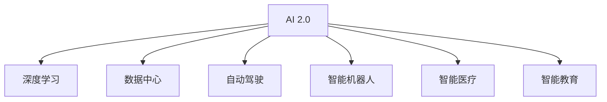

                 

## 1. 背景介绍

### 1.1 问题由来

随着人工智能(AI)技术的迅速发展，我们正处于一个全新的时代——AI 2.0时代。在这个时代，AI不仅限于专家和学者，而是已经开始渗透到各行各业，改变了我们的工作方式、生活方式乃至思维方式。AI 2.0时代的核心特点包括更广泛的自动化、更强大的自适应能力和更智能的决策支持。在这个过程中，AI与大数据、云计算、物联网、增强现实(AR)、虚拟现实(VR)等技术的深度融合，构建了一个庞大的生态系统，极大地推动了人类社会的进步。

### 1.2 问题核心关键点

AI 2.0时代的发展和应用，涉及一系列关键技术和管理问题：

- **技术的融合与演进**：AI、大数据、云计算等技术的深度融合，为AI 2.0时代的到来提供了坚实的技术基础。
- **数据的重要性**：在AI 2.0时代，数据是关键资源。数据的收集、存储、处理和利用，成为推动AI发展的核心动力。
- **算力的支持**：随着AI任务的复杂性增加，算力需求也在不断增长。云计算和边缘计算等技术为AI 2.0时代的算力需求提供了有力支撑。
- **模型的优化与训练**：在大规模数据和复杂任务下，模型的优化和训练成为提升AI性能的关键。
- **应用场景的拓展**：AI 2.0时代的生态系统，包括智能制造、智能医疗、智能金融、智能教育等多个领域，为AI技术的应用提供了广阔空间。

### 1.3 问题研究意义

深入理解AI 2.0时代的生态系统，不仅有助于把握AI技术的最新进展，还能够为各行各业提供切实可行的解决方案。这将有助于提升产业的智能化水平，推动经济社会的可持续发展，同时也为AI技术的发展方向和未来趋势提供重要参考。

## 2. 核心概念与联系

### 2.1 核心概念概述

为更好地理解AI 2.0时代的生态系统，本节将介绍几个核心概念：

- **AI 2.0**：指基于深度学习等先进技术，能够自动学习、推理、决策的智能系统，正在逐步取代传统人工智能。
- **深度学习**：基于人工神经网络，通过多层次的非线性变换，对数据进行特征提取和模式识别，是AI 2.0时代的主流技术。
- **数据中心**：AI 2.0时代的数据中心是数据处理和存储的核心，通过云计算等技术为AI任务提供强大的算力支持。
- **自动驾驶**：基于AI和计算机视觉技术，使车辆能够自主导航、避障、决策，是AI 2.0时代的重要应用之一。
- **智能机器人**：通过AI技术，使机器人具备感知、决策、执行等功能，广泛应用于工业制造、医疗护理等领域。
- **智能医疗**：通过AI技术，提高诊断准确性、治疗方案优化、个性化医疗等，改善患者的治疗体验和预后效果。
- **智能教育**：利用AI技术，进行个性化学习推荐、智能辅导、情感分析等，提升教育质量和效率。

这些核心概念之间的逻辑关系可以通过以下Mermaid流程图来展示：



这个流程图展示了许多关键技术之间的关系：

1. AI 2.0时代基于深度学习等先进技术，实现了自动学习、推理和决策。
2. 数据中心提供强大的算力支持，是AI任务处理和存储的核心。
3. 自动驾驶、智能机器人、智能医疗、智能教育等应用，是基于AI 2.0技术的实际落地。

## 3. 核心算法原理 & 具体操作步骤
### 3.1 算法原理概述

AI 2.0时代的核心算法原理包括深度学习、强化学习、迁移学习等，其中深度学习是主流的技术手段。

- **深度学习**：通过多层神经网络对数据进行特征提取和模式识别，实现复杂的任务处理。
- **强化学习**：通过与环境的互动，使智能体学习到最优策略，常用于自动驾驶、机器人控制等应用。
- **迁移学习**：通过知识迁移，使AI模型能够在新领域快速适应，减少从头训练的需求，提升效率。

### 3.2 算法步骤详解

AI 2.0时代的算法步骤一般包括以下几个关键步骤：

**Step 1: 数据准备**
- 收集、清洗、标注相关数据，用于训练和评估AI模型。

**Step 2: 模型选择**
- 根据任务类型选择合适的深度学习模型，如卷积神经网络(CNN)、循环神经网络(RNN)、变分自编码器(VAE)等。

**Step 3: 模型训练**
- 使用训练数据集对模型进行训练，优化模型的参数和结构。

**Step 4: 模型评估**
- 使用验证集或测试集对训练好的模型进行评估，判断其性能和泛化能力。

**Step 5: 模型部署**
- 将训练好的模型部署到实际应用场景中，进行实时推理和决策。

### 3.3 算法优缺点

AI 2.0时代的算法具有以下优点：

- **高效**：深度学习等算法在处理大规模数据和高维度特征时，具有较高的效率。
- **泛化能力**：通过迁移学习等技术，AI模型能够适应新领域和新任务，具有较强的泛化能力。
- **自我学习**：强化学习等算法能够不断自我优化，适应动态环境变化。

但同时也存在一些缺点：

- **数据依赖**：AI 2.0时代的算法对数据质量和数量要求较高，数据缺失或不准确会影响模型性能。
- **计算资源需求高**：深度学习等算法需要大量的计算资源，对硬件设备要求较高。
- **模型复杂度高**：深度学习模型结构复杂，难以解释和调试，容易出现过拟合等问题。

### 3.4 算法应用领域

AI 2.0时代的算法在多个领域得到了广泛应用，例如：

- **计算机视觉**：用于图像识别、物体检测、人脸识别等，如自动驾驶中的道路识别。
- **自然语言处理(NLP)**：用于文本分类、情感分析、机器翻译等，如智能客服中的对话系统。
- **语音识别**：用于语音转文本、说话人识别等，如智能音箱中的语音助手。
- **智能制造**：用于质量检测、设备维护、生产调度等，如工业机器人的视觉引导。
- **智能医疗**：用于疾病诊断、治疗方案优化、个性化医疗等，如基于AI的影像分析系统。
- **智能金融**：用于风险评估、投资策略优化、客户分析等，如基于AI的信用评分系统。
- **智能教育**：用于个性化学习推荐、智能辅导、学习效果评估等，如基于AI的智能教育平台。

## 4. 数学模型和公式 & 详细讲解 & 举例说明
### 4.1 数学模型构建

AI 2.0时代的数学模型构建一般包括以下几个关键步骤：

- **定义问题**：明确AI任务的具体目标，如图像分类、语音识别等。
- **构建模型**：选择合适的模型结构，如卷积神经网络(CNN)、循环神经网络(RNN)等。
- **设计损失函数**：定义模型预测与真实标签之间的差异，如交叉熵损失、均方误差损失等。
- **优化算法**：选择合适的优化算法，如随机梯度下降(SGD)、Adam等。

### 4.2 公式推导过程

以图像分类任务为例，我们以卷积神经网络(CNN)为基础，推导其训练过程的数学公式。

设输入图像为 $x$，其标签为 $y$，CNN模型的输出为 $z$。假设模型中有 $K$ 个类别，则标签 $y$ 可以通过 softmax 函数表示为 $y = (y_1, y_2, ..., y_K)$，其中 $y_i$ 表示样本属于第 $i$ 个类别的概率。模型输出 $z$ 也可以表示为 $z = (z_1, z_2, ..., z_K)$。

设损失函数为交叉熵损失，则模型的训练目标可以表示为：

$$
\min_{\theta} \sum_{i=1}^K L(y_i, z_i)
$$

其中 $L(y_i, z_i)$ 为交叉熵损失函数，可以表示为：

$$
L(y_i, z_i) = -y_i \log z_i
$$

将交叉熵损失函数代入训练目标中，得到：

$$
\min_{\theta} \sum_{i=1}^K (-y_i \log z_i)
$$

通过链式法则，对模型参数 $\theta$ 求偏导数，得到模型参数的更新规则：

$$
\theta \leftarrow \theta - \eta \nabla_{\theta} \sum_{i=1}^K (-y_i \log z_i)
$$

其中 $\eta$ 为学习率，$\nabla_{\theta} \sum_{i=1}^K (-y_i \log z_i)$ 为损失函数对模型参数的梯度，可以通过反向传播算法高效计算。

### 4.3 案例分析与讲解

以智能医疗中的影像分析系统为例，展示如何使用深度学习算法实现疾病诊断。

假设系统的训练数据集为 $D=\{(x_i, y_i)\}_{i=1}^N$，其中 $x_i$ 为医学影像，$y_i$ 为疾病标签（如肿瘤、心脏病等）。系统的目标是通过训练深度学习模型，学习影像特征和疾病标签之间的关系，从而实现自动诊断。

在训练过程中，可以使用卷积神经网络(CNN)作为模型结构，对医学影像进行特征提取。具体步骤如下：

1. 对医学影像 $x_i$ 进行预处理，如归一化、裁剪、调整尺寸等。
2. 将预处理后的影像输入CNN模型，进行特征提取。
3. 将提取的特征输入全连接层，输出疾病的概率分布。
4. 使用交叉熵损失函数，计算模型预测与真实标签之间的差异。
5. 使用随机梯度下降(SGD)算法，更新模型参数 $\theta$，最小化损失函数。
6. 在验证集上评估模型性能，判断是否收敛。

通过上述步骤，可以训练出一个准确的疾病诊断模型，用于新样本的自动诊断。

## 5. 项目实践：代码实例和详细解释说明
### 5.1 开发环境搭建

在进行AI 2.0时代的项目实践前，我们需要准备好开发环境。以下是使用Python进行TensorFlow开发的环境配置流程：

1. 安装Anaconda：从官网下载并安装Anaconda，用于创建独立的Python环境。

2. 创建并激活虚拟环境：
```bash
conda create -n tf-env python=3.8 
conda activate tf-env
```

3. 安装TensorFlow：根据CUDA版本，从官网获取对应的安装命令。例如：
```bash
conda install tensorflow -c tensorflow -c conda-forge
```

4. 安装各类工具包：
```bash
pip install numpy pandas scikit-learn matplotlib tqdm jupyter notebook ipython
```

完成上述步骤后，即可在`tf-env`环境中开始AI 2.0时代的应用开发。

### 5.2 源代码详细实现

下面我们以智能医疗中的疾病诊断任务为例，给出使用TensorFlow进行卷积神经网络(CNN)训练的代码实现。

首先，定义疾病诊断任务的数据处理函数：

```python
import tensorflow as tf
from tensorflow.keras import layers

class DiseaseDataset(tf.data.Dataset):
    def __init__(self, images, labels, batch_size=32):
        self.images = images
        self.labels = labels
        self.batch_size = batch_size

    def __len__(self):
        return len(self.images) // self.batch_size

    def __getitem__(self, item):
        start = item * self.batch_size
        end = start + self.batch_size
        return self.images[start:end], self.labels[start:end]

# 定义数据集
train_dataset = DiseaseDataset(train_images, train_labels)
val_dataset = DiseaseDataset(val_images, val_labels)
test_dataset = DiseaseDataset(test_images, test_labels)
```

然后，定义模型和优化器：

```python
from tensorflow.keras import models, layers

model = models.Sequential([
    layers.Conv2D(32, (3, 3), activation='relu', input_shape=(256, 256, 3)),
    layers.MaxPooling2D((2, 2)),
    layers.Conv2D(64, (3, 3), activation='relu'),
    layers.MaxPooling2D((2, 2)),
    layers.Conv2D(128, (3, 3), activation='relu'),
    layers.MaxPooling2D((2, 2)),
    layers.Flatten(),
    layers.Dense(128, activation='relu'),
    layers.Dense(10)
])

optimizer = tf.keras.optimizers.Adam()
```

接着，定义训练和评估函数：

```python
def train_step(images, labels):
    with tf.GradientTape() as tape:
        predictions = model(images, training=True)
        loss = tf.keras.losses.sparse_categorical_crossentropy(labels, predictions)
    gradients = tape.gradient(loss, model.trainable_variables)
    optimizer.apply_gradients(zip(gradients, model.trainable_variables))

def evaluate_step(images, labels):
    predictions = model(images)
    accuracy = tf.keras.metrics.sparse_categorical_accuracy(labels, predictions)
    return accuracy
```

最后，启动训练流程并在测试集上评估：

```python
epochs = 10

for epoch in range(epochs):
    for images, labels in train_dataset:
        train_step(images, labels)
    
    for images, labels in val_dataset:
        accuracy = evaluate_step(images, labels)
        print(f"Epoch {epoch+1}, accuracy on validation set: {accuracy:.4f}")
    
    for images, labels in test_dataset:
        accuracy = evaluate_step(images, labels)
        print(f"Epoch {epoch+1}, accuracy on test set: {accuracy:.4f}")
```

以上就是使用TensorFlow进行CNN训练的完整代码实现。可以看到，得益于TensorFlow的强大封装，我们可以用相对简洁的代码完成CNN模型的训练。

### 5.3 代码解读与分析

让我们再详细解读一下关键代码的实现细节：

**DiseaseDataset类**：
- `__init__`方法：初始化图像、标签和批次大小。
- `__len__`方法：返回数据集的样本数量。
- `__getitem__`方法：对单个样本进行处理，将其划分为批次，返回图像和标签。

**模型定义**：
- `Sequential`模型：使用Sequential模型定义CNN的层结构。
- `Conv2D`层：使用卷积层提取图像特征。
- `MaxPooling2D`层：使用池化层降低特征维度。
- `Flatten`层：将特征展开成一维向量。
- `Dense`层：使用全连接层进行分类。

**优化器定义**：
- `Adam`优化器：使用Adam优化器更新模型参数。

**训练和评估函数**：
- `train_step`函数：在每个批次上计算损失函数，使用梯度下降更新模型参数。
- `evaluate_step`函数：对测试集进行评估，计算准确率。

**训练流程**：
- 定义总的epoch数和批次大小，开始循环迭代。
- 每个epoch内，先训练，然后在验证集和测试集上评估模型的性能。
- 打印每个epoch的验证集和测试集准确率。

可以看到，TensorFlow提供的高级API使得模型训练和评估变得简单易懂，开发者可以更多地关注模型的设计和高层次的逻辑。

当然，工业级的系统实现还需考虑更多因素，如模型的保存和部署、超参数的自动搜索、更灵活的任务适配层等。但核心的训练流程基本与此类似。

## 6. 实际应用场景
### 6.1 智能客服系统

基于AI 2.0时代的深度学习模型，智能客服系统可以实现高效、智能的客户服务。传统客服往往需要配备大量人力，高峰期响应缓慢，且一致性和专业性难以保证。而使用深度学习模型进行训练，可以7x24小时不间断服务，快速响应客户咨询，用自然流畅的语言解答各类常见问题。

在技术实现上，可以收集企业内部的历史客服对话记录，将问题和最佳答复构建成监督数据，在此基础上对深度学习模型进行训练。训练后的模型能够自动理解用户意图，匹配最合适的答案模板进行回复。对于客户提出的新问题，还可以接入检索系统实时搜索相关内容，动态组织生成回答。如此构建的智能客服系统，能大幅提升客户咨询体验和问题解决效率。

### 6.2 金融舆情监测

金融机构需要实时监测市场舆论动向，以便及时应对负面信息传播，规避金融风险。传统的人工监测方式成本高、效率低，难以应对网络时代海量信息爆发的挑战。基于AI 2.0时代的文本分类和情感分析技术，为金融舆情监测提供了新的解决方案。

具体而言，可以收集金融领域相关的新闻、报道、评论等文本数据，并对其进行主题标注和情感标注。在此基础上对深度学习模型进行微调，使其能够自动判断文本属于何种主题，情感倾向是正面、中性还是负面。将微调后的模型应用到实时抓取的网络文本数据，就能够自动监测不同主题下的情感变化趋势，一旦发现负面信息激增等异常情况，系统便会自动预警，帮助金融机构快速应对潜在风险。

### 6.3 个性化推荐系统

当前的推荐系统往往只依赖用户的历史行为数据进行物品推荐，无法深入理解用户的真实兴趣偏好。基于AI 2.0时代的深度学习模型，个性化推荐系统可以更好地挖掘用户行为背后的语义信息，从而提供更精准、多样的推荐内容。

在实践中，可以收集用户浏览、点击、评论、分享等行为数据，提取和用户交互的物品标题、描述、标签等文本内容。将文本内容作为模型输入，用户的后续行为（如是否点击、购买等）作为监督信号，在此基础上对深度学习模型进行微调。微调后的模型能够从文本内容中准确把握用户的兴趣点。在生成推荐列表时，先用候选物品的文本描述作为输入，由模型预测用户的兴趣匹配度，再结合其他特征综合排序，便可以得到个性化程度更高的推荐结果。

### 6.4 未来应用展望

随着AI 2.0时代的深度学习模型和微调方法的不断发展，基于微调范式将在更多领域得到应用，为传统行业带来变革性影响。

在智慧医疗领域，基于AI 2.0时代的深度学习模型，医疗问答、病历分析、药物研发等应用将提升医疗服务的智能化水平，辅助医生诊疗，加速新药开发进程。

在智能教育领域，AI 2.0时代的深度学习模型可应用于作业批改、学情分析、知识推荐等方面，因材施教，促进教育公平，提高教学质量。

在智慧城市治理中，AI 2.0时代的深度学习模型可应用于城市事件监测、舆情分析、应急指挥等环节，提高城市管理的自动化和智能化水平，构建更安全、高效的未来城市。

此外，在企业生产、社会治理、文娱传媒等众多领域，基于AI 2.0时代的深度学习模型的微调方法也将不断涌现，为NLP技术带来了全新的突破。随着预训练模型和微调方法的不断进步，相信NLP技术将在更广阔的应用领域大放异彩。

## 7. 工具和资源推荐
### 7.1 学习资源推荐

为了帮助开发者系统掌握AI 2.0时代的深度学习模型的微调理论基础和实践技巧，这里推荐一些优质的学习资源：

1. 《深度学习》系列书籍：由多位AI领域权威专家合著，系统介绍了深度学习的基本原理和应用场景，适合初学者和专业人士阅读。
2. CS231n《卷积神经网络》课程：斯坦福大学开设的经典课程，涵盖卷积神经网络的结构、优化算法、模型调参等内容，是深度学习的重要基础。
3. 《动手学深度学习》书籍：由清华大学AI研究院教授联合编写，结合代码实例，深入浅出地讲解深度学习的理论和实践。
4. Kaggle竞赛平台：全球知名的数据科学竞赛平台，提供了大量的真实数据集和竞赛任务，是深度学习模型的实战演练场所。
5. TensorFlow官方文档：TensorFlow的官方文档，提供了丰富的API文档、代码样例和详细的使用指南，是TensorFlow开发的重要参考资料。

通过对这些资源的学习实践，相信你一定能够快速掌握AI 2.0时代的深度学习模型的微调精髓，并用于解决实际的AI应用问题。

### 7.2 开发工具推荐

高效的开发离不开优秀的工具支持。以下是几款用于AI 2.0时代的深度学习模型微调开发的常用工具：

1. TensorFlow：基于Python的开源深度学习框架，灵活动态的计算图，适合快速迭代研究。是目前主流的深度学习框架之一。
2. PyTorch：基于Python的开源深度学习框架，提供了动态计算图和丰富的优化算法，适合深度学习和科研应用。
3. Keras：高级神经网络API，提供了简单易用的API接口，支持TensorFlow和Theano等后端，适合初学者和快速原型开发。
4. Jupyter Notebook：交互式编程环境，支持代码、文档、数据一体化展示，是数据科学和机器学习开发的重要工具。
5. Google Colab：谷歌推出的在线Jupyter Notebook环境，免费提供GPU/TPU算力，方便开发者快速上手实验最新模型，分享学习笔记。

合理利用这些工具，可以显著提升AI 2.0时代的深度学习模型微调的开发效率，加快创新迭代的步伐。

### 7.3 相关论文推荐

AI 2.0时代的深度学习模型的微调技术不断发展，涌现出众多经典论文。以下是几篇奠基性的相关论文，推荐阅读：

1. ImageNet Classification with Deep Convolutional Neural Networks：提出卷积神经网络(CNN)，并在ImageNet数据集上取得突破性成果。
2. AlexNet: One MilliOn Tiny Images for Training Deep Networks：引入深度残差网络(ResNet)，解决深度学习中的梯度消失问题。
3. Attention is All You Need：提出Transformer结构，开启了NLP领域的预训练大模型时代。
4. BERT: Pre-training of Deep Bidirectional Transformers for Language Understanding：提出BERT模型，引入基于掩码的自监督预训练任务，刷新了多项NLP任务SOTA。
5. Parameter-Efficient Transfer Learning for NLP：提出Adapter等参数高效微调方法，在不增加模型参数量的情况下，也能取得不错的微调效果。
6. GANs Trained by a Two Time-Scale Update Rule Converge to the Naive Mode of Competition：提出生成对抗网络(GAN)，为深度学习模型提供了新的研究方向。
7. Efficient Estimation of Word Representations in Vector Space：提出Word2Vec模型，开创了基于向量空间表示的词嵌入技术。

这些论文代表了大模型微调技术的发展脉络。通过学习这些前沿成果，可以帮助研究者把握学科前进方向，激发更多的创新灵感。

## 8. 总结：未来发展趋势与挑战
### 8.1 总结

本文对AI 2.0时代的深度学习模型的微调方法进行了全面系统的介绍。首先阐述了AI 2.0时代的发展和应用，明确了深度学习等技术在其中的核心作用。其次，从原理到实践，详细讲解了深度学习模型的构建、训练、评估等核心步骤，给出了深度学习模型训练的完整代码实例。同时，本文还广泛探讨了深度学习模型在智能客服、金融舆情、个性化推荐等多个领域的应用前景，展示了深度学习模型微调范式的巨大潜力。

通过本文的系统梳理，可以看到，AI 2.0时代的深度学习模型微调技术正在成为AI发展的核心范式，极大地拓展了深度学习模型的应用边界，催生了更多的落地场景。受益于大规模数据和深度学习技术的发展，深度学习模型在性能和应用范围上不断提升，推动了AI技术的全面普及。未来，伴随深度学习模型的进一步演进和优化，相信AI 2.0时代的深度学习模型微调技术将引领AI技术迈向更高的台阶，为构建更加智能、高效、安全的人工智能系统铺平道路。

### 8.2 未来发展趋势

展望未来，AI 2.0时代的深度学习模型微调技术将呈现以下几个发展趋势：

1. **模型规模持续增大**：随着算力成本的下降和数据规模的扩张，深度学习模型的参数量还将持续增长。超大规模深度学习模型蕴含的丰富知识，有望支撑更加复杂多变的下游任务微调。
2. **模型结构更加复杂**：随着任务复杂性的增加，深度学习模型的结构将更加复杂，如多模态深度学习模型、混合网络结构等。
3. **模型训练效率提高**：随着分布式训练、硬件加速等技术的进步，深度学习模型的训练速度将显著提升。
4. **模型泛化能力增强**：通过迁移学习、元学习等技术，深度学习模型将具备更强的泛化能力，能够在更广泛的应用场景中表现出色。
5. **模型鲁棒性提升**：通过对抗训练、数据增强等技术，深度学习模型将具备更强的鲁棒性，能够抵御攻击和噪声干扰。
6. **模型可解释性增强**：通过可解释性技术，深度学习模型将能够提供更好的决策解释，增强用户信任和模型可信度。

### 8.3 面临的挑战

尽管AI 2.0时代的深度学习模型微调技术已经取得了瞩目成就，但在迈向更加智能化、普适化应用的过程中，它仍面临着诸多挑战：

1. **数据依赖**：深度学习模型对数据质量和数量要求较高，数据缺失或不准确会影响模型性能。
2. **计算资源需求高**：深度学习模型需要大量的计算资源，对硬件设备要求较高。
3. **模型复杂度高**：深度学习模型结构复杂，难以解释和调试，容易出现过拟合等问题。
4. **鲁棒性不足**：深度学习模型面对域外数据时，泛化性能往往大打折扣。
5. **可解释性不足**：深度学习模型更像是"黑盒"系统，难以解释其内部工作机制和决策逻辑。
6. **安全性问题**：深度学习模型可能学习到有害信息，通过微调传递到下游任务，产生误导性、歧视性的输出，给实际应用带来安全隐患。

### 8.4 研究展望

面对深度学习模型微调所面临的挑战，未来的研究需要在以下几个方面寻求新的突破：

1. **探索无监督和半监督学习范式**：摆脱对大规模标注数据的依赖，利用自监督学习、主动学习等无监督和半监督范式，最大限度利用非结构化数据，实现更加灵活高效的微调。
2. **开发参数高效和计算高效的微调方法**：开发更加参数高效的微调方法，在固定大部分预训练参数的同时，只更新极少量的任务相关参数。同时优化微调模型的计算图，减少前向传播和反向传播的资源消耗，实现更加轻量级、实时性的部署。
3. **引入因果推断和博弈论工具**：将因果分析方法引入微调模型，识别出模型决策的关键特征，增强输出解释的因果性和逻辑性。借助博弈论工具刻画人机交互过程，主动探索并规避模型的脆弱点，提高系统稳定性。
4. **纳入伦理道德约束**：在模型训练目标中引入伦理导向的评估指标，过滤和惩罚有偏见、有害的输出倾向。同时加强人工干预和审核，建立模型行为的监管机制，确保输出符合人类价值观和伦理道德。

这些研究方向的探索，必将引领深度学习模型微调技术迈向更高的台阶，为构建安全、可靠、可解释、可控的智能系统铺平道路。面向未来，深度学习模型微调技术还需要与其他AI技术进行更深入的融合，如知识表示、因果推理、强化学习等，多路径协同发力，共同推动自然语言理解和智能交互系统的进步。只有勇于创新、敢于突破，才能不断拓展深度学习模型的边界，让AI技术更好地造福人类社会。

## 9. 附录：常见问题与解答

**Q1：深度学习模型微调是否适用于所有NLP任务？**

A: 深度学习模型微调在大多数NLP任务上都能取得不错的效果，特别是对于数据量较小的任务。但对于一些特定领域的任务，如医学、法律等，仅仅依靠通用语料预训练的模型可能难以很好地适应。此时需要在特定领域语料上进一步预训练，再进行微调，才能获得理想效果。此外，对于一些需要时效性、个性化很强的任务，如对话、推荐等，微调方法也需要针对性的改进优化。

**Q2：如何选择合适的深度学习模型？**

A: 选择合适的深度学习模型需要考虑任务类型、数据特点和资源限制等因素。一般来说，常用的深度学习模型包括卷积神经网络(CNN)、循环神经网络(RNN)、长短时记忆网络(LSTM)、Transformer等。卷积神经网络适用于图像识别、文本分类等任务，循环神经网络适用于序列数据处理，长短时记忆网络适用于语言模型训练，Transformer适用于自然语言处理任务。

**Q3：深度学习模型微调过程中需要注意哪些问题？**

A: 深度学习模型微调过程中需要注意以下问题：
1. 数据准备：收集、清洗、标注相关数据，用于训练和评估模型。
2. 模型选择：根据任务类型选择合适的深度学习模型。
3. 模型训练：使用训练数据集对模型进行训练，优化模型的参数和结构。
4. 模型评估：使用验证集或测试集对训练好的模型进行评估，判断其性能和泛化能力。
5. 模型部署：将训练好的模型部署到实际应用场景中，进行实时推理和决策。

**Q4：如何缓解深度学习模型微调过程中的过拟合问题？**

A: 过拟合是深度学习模型微调面临的主要挑战，尤其是在标注数据不足的情况下。缓解过拟合问题的方法包括：
1. 数据增强：通过回译、近义替换等方式扩充训练集。
2. 正则化：使用L2正则、Dropout、Early Stopping等技术，防止模型过度适应小规模训练集。
3. 对抗训练：引入对抗样本，提高模型鲁棒性。
4. 参数高效微调：只调整少量参数，减小过拟合风险。

**Q5：深度学习模型微调在落地部署时需要注意哪些问题？**

A: 将深度学习模型微调的结果转化为实际应用，还需要考虑以下因素：
1. 模型裁剪：去除不必要的层和参数，减小模型尺寸，加快推理速度。
2. 量化加速：将浮点模型转为定点模型，压缩存储空间，提高计算效率。
3. 服务化封装：将模型封装为标准化服务接口，便于集成调用。
4. 弹性伸缩：根据请求流量动态调整资源配置，平衡服务质量和成本。
5. 监控告警：实时采集系统指标，设置异常告警阈值，确保服务稳定性。

深度学习模型微调为NLP应用开启了广阔的想象空间，但如何将强大的性能转化为稳定、高效、安全的业务价值，还需要工程实践的不断打磨。

总之，深度学习模型微调技术将引领AI技术迈向更高的台阶，为构建安全、可靠、可解释、可控的智能系统铺平道路。面向未来，深度学习模型微调技术还需要与其他AI技术进行更深入的融合，如知识表示、因果推理、强化学习等，多路径协同发力，共同推动自然语言理解和智能交互系统的进步。只有勇于创新、敢于突破，才能不断拓展深度学习模型的边界，让AI技术更好地造福人类社会。

---

作者：禅与计算机程序设计艺术 / Zen and the Art of Computer Programming

