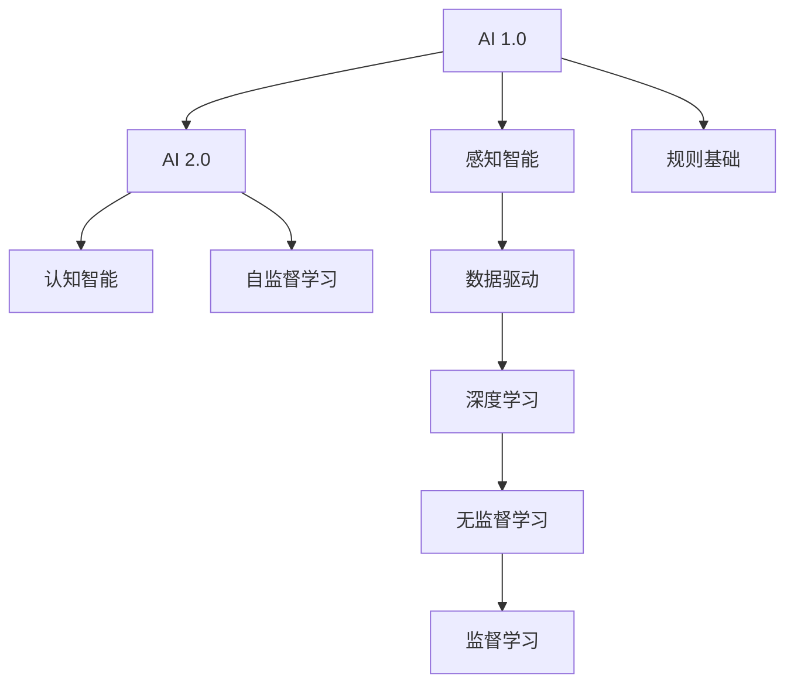

                 

# 李开复：AI 2.0 时代的科技价值

> 关键词：AI 2.0, 科技价值, 人工智能, 未来趋势, 应用场景

## 1. 背景介绍

### 1.1 问题由来

随着人工智能（AI）技术的飞速发展，我们即将迎来AI 2.0时代，即人工智能的全面普及和应用。这一时代，AI将成为各行各业的基石，深刻改变我们的生活方式、工作模式和社会结构。然而，AI的发展并非一帆风顺，技术突破、伦理挑战、安全风险等问题接踵而至。本文旨在探讨AI 2.0时代的科技价值，分析AI在未来的广泛应用场景，同时提出应对技术、伦理和安全的策略，以促进AI技术的健康发展。

### 1.2 问题核心关键点

AI 2.0时代的核心关键点包括：

- AI技术的快速演进：深度学习、强化学习、自然语言处理等技术的突破，推动了AI从感知智能向认知智能迈进。
- 应用场景的多样化：AI在医疗、教育、金融、制造业等领域的广泛应用，带来了效率提升和创新变革。
- 伦理和法律问题：数据隐私、算法透明、就业替代等伦理和法律问题，需要得到有效解决。
- 安全性挑战：对抗性攻击、模型偏见、数据泄露等安全问题，成为AI发展中的重要瓶颈。

这些关键点构成了AI 2.0时代的全景图，也指导了我们的研究方向和实践路径。

## 2. 核心概念与联系

### 2.1 核心概念概述

为了深入理解AI 2.0时代的科技价值，首先需要明确以下几个核心概念：

- **AI 1.0**：以规则为基础的传统AI技术，如专家系统、机器视觉等，适用于小规模、结构化数据的任务。
- **AI 2.0**：以数据驱动、深度学习为核心的新技术，适用于大规模、非结构化数据的任务。
- **认知智能**：AI能够理解、推理、学习、决策的能力，即能够处理抽象概念、进行复杂任务。
- **感知智能**：AI能够感知、记忆、识别、交互的能力，即能够处理感知数据、进行简单任务。
- **自监督学习**：使用未标记数据进行训练，通过数据内在关系推断标签，适用于大规模数据集。

这些概念之间的联系可以通过以下Mermaid流程图来展示：



这个流程图展示了AI技术从1.0到2.0的发展脉络，以及各种学习方法的演变。

## 3. 核心算法原理 & 具体操作步骤

### 3.1 算法原理概述

AI 2.0时代的核心算法包括深度学习、强化学习、自监督学习等。这些算法通过数据驱动的方式，从海量数据中学习复杂模式，实现了AI技术的飞速发展。以深度学习为例，其基本原理是通过多层神经网络，将输入数据映射到高维特征空间，通过反向传播算法优化模型参数，从而实现对数据的有效表示和分类。

### 3.2 算法步骤详解

以下是深度学习的典型训练步骤：

1. **数据准备**：收集并预处理训练数据，进行归一化、特征提取等预处理。
2. **模型构建**：选择合适的神经网络结构，如卷积神经网络（CNN）、循环神经网络（RNN）、变分自编码器（VAE）等，定义损失函数和优化算法。
3. **模型训练**：通过反向传播算法，更新模型参数，最小化损失函数。
4. **模型评估**：在测试集上评估模型性能，如准确率、精度、召回率等指标。
5. **模型应用**：将训练好的模型应用于实际问题，进行预测、分类、生成等任务。

### 3.3 算法优缺点

深度学习的优点包括：

- **高精度**：在大规模数据集上，深度学习能够取得比传统机器学习更高的精度。
- **自动特征提取**：深度学习通过多层网络自动提取特征，无需手工设计特征。
- **泛化能力**：深度学习模型具有较强的泛化能力，可以处理复杂、高维的非结构化数据。

然而，深度学习也存在一些缺点：

- **数据需求量大**：深度学习需要大量标注数据进行训练，否则容易出现过拟合。
- **计算资源消耗大**：深度学习模型参数量大，计算复杂度高，需要高性能计算资源。
- **解释性差**：深度学习模型通常被视为“黑盒”，难以解释其内部决策过程。

### 3.4 算法应用领域

深度学习在诸多领域都得到了广泛应用，包括计算机视觉、自然语言处理、语音识别、推荐系统等。

- **计算机视觉**：图像分类、物体检测、图像生成等任务。
- **自然语言处理**：文本分类、情感分析、机器翻译等任务。
- **语音识别**：语音转文本、语音情感识别等任务。
- **推荐系统**：用户行为预测、商品推荐等任务。

深度学习的广泛应用，使得AI 2.0时代成为可能。

## 4. 数学模型和公式 & 详细讲解 & 举例说明

### 4.1 数学模型构建

深度学习的数学模型通常由神经网络组成，包括输入层、隐藏层和输出层。以全连接神经网络为例，其数学模型可以表示为：

$$
y = \sigma(Wx + b)
$$

其中，$x$为输入向量，$W$为权重矩阵，$b$为偏置向量，$\sigma$为激活函数。

### 4.2 公式推导过程

以一个简单的二分类任务为例，其目标是最小化交叉熵损失函数：

$$
\mathcal{L} = -\frac{1}{N}\sum_{i=1}^N[y_i\log y_i + (1-y_i)\log (1-y_i)]
$$

其中，$y_i$为模型预测结果，$y$为真实标签。

### 4.3 案例分析与讲解

以图像分类任务为例，可以使用卷积神经网络（CNN）进行训练。CNN通过卷积层和池化层提取特征，通过全连接层进行分类。训练过程中，通过交叉熵损失函数进行优化，使用随机梯度下降（SGD）或其变体（如Adam、RMSprop）进行参数更新。

## 5. 项目实践：代码实例和详细解释说明

### 5.1 开发环境搭建

在进行深度学习项目实践前，需要先搭建好开发环境。以下是基于Python和TensorFlow的搭建流程：

1. 安装Anaconda：从官网下载并安装Anaconda，用于创建独立的Python环境。
2. 创建并激活虚拟环境：
```bash
conda create -n tf-env python=3.8 
conda activate tf-env
```

3. 安装TensorFlow：
```bash
pip install tensorflow==2.7
```

4. 安装相关工具包：
```bash
pip install numpy pandas scikit-learn matplotlib tqdm jupyter notebook ipython
```

完成上述步骤后，即可在`tf-env`环境中开始深度学习实践。

### 5.2 源代码详细实现

以下是一个使用TensorFlow进行图像分类的代码实现：

```python
import tensorflow as tf
from tensorflow.keras import layers, models

# 加载数据集
(x_train, y_train), (x_test, y_test) = tf.keras.datasets.mnist.load_data()

# 数据预处理
x_train = x_train.reshape(x_train.shape[0], 28, 28, 1).astype('float32') / 255
x_test = x_test.reshape(x_test.shape[0], 28, 28, 1).astype('float32') / 255
y_train = tf.keras.utils.to_categorical(y_train, 10)
y_test = tf.keras.utils.to_categorical(y_test, 10)

# 构建模型
model = models.Sequential([
    layers.Conv2D(32, (3, 3), activation='relu', input_shape=(28, 28, 1)),
    layers.MaxPooling2D((2, 2)),
    layers.Flatten(),
    layers.Dense(128, activation='relu'),
    layers.Dense(10, activation='softmax')
])

# 编译模型
model.compile(optimizer='adam', loss='categorical_crossentropy', metrics=['accuracy'])

# 训练模型
model.fit(x_train, y_train, epochs=10, batch_size=64, validation_data=(x_test, y_test))

# 评估模型
model.evaluate(x_test, y_test)
```

### 5.3 代码解读与分析

这段代码展示了如何使用TensorFlow构建和训练一个简单的卷积神经网络。首先，通过`tf.keras.datasets.mnist.load_data()`加载手写数字数据集。然后，对数据进行归一化和标签编码，使用`model.Sequential`构建模型，包含卷积层、池化层、全连接层和softmax输出层。最后，使用`model.compile`编译模型，`model.fit`训练模型，`model.evaluate`评估模型。

## 6. 实际应用场景

### 6.1 智能医疗

AI 2.0时代，智能医疗成为重要的应用领域。AI可以通过深度学习技术，辅助医生进行疾病诊断、治疗方案推荐、病历分析等任务。例如，使用卷积神经网络对医学影像进行分类，使用自然语言处理技术解析电子病历，使用强化学习优化治疗方案等。

### 6.2 智能制造

在制造业领域，AI 2.0技术可以通过预测维护、质量检测、供应链优化等方式，提升生产效率和产品质量。例如，使用深度学习对传感器数据进行异常检测，使用强化学习优化生产调度，使用生成对抗网络（GAN）生成产品设计等。

### 6.3 智能交通

AI 2.0技术在智能交通领域的应用，包括自动驾驶、交通流量预测、智能交通信号控制等。例如，使用卷积神经网络进行交通场景识别，使用生成对抗网络生成交通仿真数据，使用强化学习优化交通信号灯控制策略等。

### 6.4 未来应用展望

未来，AI 2.0技术将在更多领域得到应用，如智能家居、智能城市、智能金融等。这些应用场景将全面渗透到人们的日常生活和工作，带来更加智能、高效、便捷的生活方式。

## 7. 工具和资源推荐

### 7.1 学习资源推荐

为了帮助开发者系统掌握深度学习技术，以下是一些优质的学习资源：

1. 《深度学习》（Goodfellow et al.）：深度学习领域的经典教材，详细介绍了深度学习的理论基础和应用方法。
2. 《动手学深度学习》（李沐等）：由MXNet社区编写的实用教材，适合动手实践。
3. 《Deep Learning with Python》（Francois et al.）：使用TensorFlow实现的深度学习教程，适合Python初学者。
4. Coursera的深度学习课程：由斯坦福大学、Coursera等机构提供，系统讲解深度学习的基本概念和算法。
5. Udacity的深度学习纳米学位课程：提供实战项目和导师指导，适合进阶学习。

### 7.2 开发工具推荐

以下是几款常用的深度学习开发工具：

1. TensorFlow：由Google开发的开源深度学习框架，生产部署方便，适合大规模工程应用。
2. PyTorch：由Facebook开发的开源深度学习框架，灵活易用，适合科研和教学。
3. Keras：基于TensorFlow和Theano的高级深度学习API，易于上手。
4. JAX：由Google开发的自动微分库，支持高效计算和分布式训练。
5. MXNet：由亚马逊开发的深度学习框架，支持多种语言和多种硬件。

### 7.3 相关论文推荐

深度学习的发展得益于学界的持续研究。以下是几篇奠基性的相关论文，推荐阅读：

1. Deep Blue Book（Goodfellow et al.）：深度学习领域的经典教材，系统介绍了深度学习的理论基础和实践方法。
2. ImageNet Classification with Deep Convolutional Neural Networks（Krizhevsky et al.）：提出了使用卷积神经网络进行图像分类的突破性方法，推动了计算机视觉的发展。
3. Attention Is All You Need（Vaswani et al.）：提出了Transformer结构，开启了NLP领域的预训练大模型时代。
4. Generative Adversarial Nets（Goodfellow et al.）：提出了生成对抗网络（GAN），在图像生成、视频生成等领域取得了重要进展。
5. AlphaGo Zero（Silver et al.）：通过强化学习技术，AlphaGo Zero在围棋中取得了人类水平的表现，推动了人工智能在博弈领域的突破。

这些论文代表了大规模深度学习模型的发展脉络，帮助研究者了解深度学习的最新进展。

## 8. 总结：未来发展趋势与挑战

### 8.1 总结

本文对AI 2.0时代的科技价值进行了全面系统的探讨。首先，分析了AI 2.0时代的技术突破、应用场景、伦理和法律问题及安全挑战。其次，从深度学习的原理和操作步骤，详细讲解了深度学习的算法原理和操作步骤。最后，给出了深度学习在智能医疗、智能制造、智能交通等领域的实际应用案例。

通过本文的系统梳理，可以看到，AI 2.0技术正在全面渗透到各个行业，带来效率提升和创新变革。未来，伴随深度学习技术的不断演进，AI 2.0将在更多领域得到应用，为人类社会带来深远影响。

### 8.2 未来发展趋势

展望未来，深度学习技术的未来发展趋势包括：

1. **大模型和超大规模模型**：随着算力成本的下降和数据规模的扩张，深度学习模型将变得越来越庞大，参数量将达到数十亿甚至百亿级别，能够处理更加复杂的任务。
2. **迁移学习和多任务学习**：迁移学习和多任务学习将在大规模数据集上取得突破，能够更好地利用数据和模型知识，提升模型的泛化能力和效率。
3. **联邦学习和分布式训练**：联邦学习和分布式训练技术，将帮助处理海量数据和资源分布不均的问题，提升模型的训练效率和效果。
4. **多模态学习**：多模态学习将整合视觉、听觉、文本等多种数据源，提升模型的理解和决策能力。
5. **自适应和动态学习**：自适应学习和动态学习将帮助模型更好地适应环境变化，提升模型的灵活性和稳健性。

这些趋势凸显了深度学习技术的广阔前景，将推动AI 2.0技术向更高层次发展。

### 8.3 面临的挑战

尽管深度学习技术取得了巨大进展，但在迈向更加智能化、普适化应用的过程中，它仍面临诸多挑战：

1. **数据瓶颈**：深度学习需要大量标注数据进行训练，数据获取和标注成本较高，成为制约技术发展的瓶颈。
2. **计算资源消耗**：深度学习模型参数量大，计算复杂度高，需要高性能计算资源，存在资源消耗大的问题。
3. **模型解释性**：深度学习模型通常被视为“黑盒”，难以解释其内部决策过程，对模型应用带来挑战。
4. **安全性问题**：深度学习模型容易受到对抗性攻击、数据泄露等安全威胁，需要采取相应措施保障模型安全。
5. **伦理和法律问题**：深度学习模型可能存在算法偏见、隐私侵犯等问题，需要制定相应的伦理和法律规范。

这些挑战需要学界和业界共同努力，推动深度学习技术向更加安全、可靠、可解释的方向发展。

### 8.4 研究展望

未来，深度学习技术需要在以下几个方面进行深入研究：

1. **提高模型效率**：通过模型压缩、量化等技术，降低深度学习模型的计算资源消耗，提高模型效率。
2. **增强模型可解释性**：通过可解释性技术，提升深度学习模型的透明性和可解释性，帮助用户理解模型决策过程。
3. **解决安全性问题**：开发抗攻击和对抗训练技术，增强深度学习模型的鲁棒性和安全性。
4. **促进伦理和法律规范**：制定深度学习技术的伦理和法律规范，保障数据隐私和模型公平性。

这些研究方向将帮助深度学习技术向更加成熟、可靠、安全的方向发展，为AI 2.0时代的应用奠定坚实基础。

## 9. 附录：常见问题与解答

### Q1: 深度学习与传统机器学习的区别？

A: 深度学习与传统机器学习的区别在于，深度学习使用神经网络进行特征提取和模式学习，而传统机器学习通常使用手工设计的特征进行分类和回归。深度学习在处理大规模数据和非结构化数据方面具有优势，能够自动提取特征，适用于复杂任务。

### Q2: 深度学习的优势和局限性是什么？

A: 深度学习的优势包括高精度、自动特征提取、泛化能力强等。局限性包括数据需求量大、计算资源消耗大、模型解释性差等。

### Q3: 如何提高深度学习模型的效率？

A: 提高深度学习模型效率的方法包括模型压缩、量化加速、分布式训练、优化算法等。通过这些方法，可以降低计算资源消耗，提高模型训练和推理速度。

### Q4: 如何增强深度学习模型的可解释性？

A: 增强深度学习模型可解释性的方法包括可视化技术、特征重要性分析、规则提取等。通过这些方法，可以帮助用户理解模型决策过程，提升模型的透明性和可解释性。

### Q5: 如何应对深度学习模型中的安全性问题？

A: 应对深度学习模型中的安全性问题的方法包括对抗性训练、数据脱敏、访问控制等。通过这些方法，可以提高模型的鲁棒性和安全性，防止模型受到攻击和滥用。

---

作者：禅与计算机程序设计艺术 / Zen and the Art of Computer Programming

