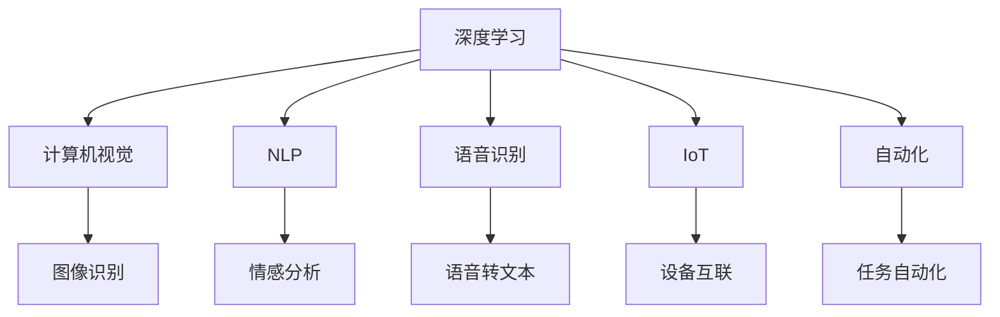

                 

# 李开复：AI 2.0 时代的趋势

> 关键词：人工智能,AI 2.0, 机器学习, 深度学习, 计算机视觉, 自然语言处理, 语音识别, 物联网, 自动化

## 1. 背景介绍

在过去几十年里，人工智能(AI)技术的发展已经经历了从符号主义(Expert Systems)、统计学派(Bayesian Network)、到机器学习(Machine Learning)再到深度学习(Deep Learning)的多次转变。每一步的进步，都为AI技术带来了新的突破和应用场景。而随着技术的不断演进，我们正处于一个新的时代——AI 2.0 时代。

### 1.1 问题由来

AI 2.0 时代的到来，源于计算机硬件的飞速进步、大数据技术的广泛应用以及算法的不断创新。通过深度学习和强化学习的融合，AI技术已经能够在大规模数据上学习到更加复杂的模式和特征，从而推动了计算机视觉、自然语言处理、语音识别等多个领域的巨大变革。

同时，随着物联网(IoT)技术的发展，AI技术的应用已经从传统的IT和互联网领域，扩展到了智能家居、智能制造、智慧城市等传统行业。AI技术的应用场景越来越广泛，深度和广度都在不断扩展。

### 1.2 问题核心关键点

AI 2.0 时代的关键点在于：

- **数据驱动**：AI技术的发展离不开大规模的数据支持。越来越多的AI系统通过在大规模数据集上进行训练，提升了模型的准确性和泛化能力。
- **算法创新**：深度学习、强化学习、迁移学习等算法的不断进步，推动了AI技术从理论到应用的突破。
- **多模态融合**：计算机视觉、自然语言处理、语音识别等多模态技术的融合，使得AI系统能够更好地理解和处理现实世界中的复杂信息。
- **自动化部署**：云平台和自动学习技术的发展，使得AI系统的部署和管理变得更加高效和智能化。
- **伦理和社会影响**：AI技术的普及带来了伦理和社会问题，如数据隐私、算法偏见、自动化失业等，需要社会各界共同关注和解决。

## 2. 核心概念与联系

### 2.1 核心概念概述

为了更好地理解AI 2.0 时代的趋势，我们需要明确几个核心概念：

- **人工智能(AI)**：一种利用计算机系统模拟人类智能的技术，包括感知、推理、学习、规划、自然语言处理等。
- **深度学习(Deep Learning)**：一种基于神经网络的机器学习方法，通过多层非线性变换提取数据中的复杂特征。
- **计算机视觉(Computer Vision)**：利用计算机技术处理和分析视觉信息，实现图像识别、物体检测、场景理解等。
- **自然语言处理(Natural Language Processing, NLP)**：研究计算机如何理解、处理和生成人类语言的技术。
- **语音识别(Speech Recognition)**：将语音信号转换为文本的技术，广泛应用于智能助理、语音控制等领域。
- **物联网(IoT)**：通过互联网将物理世界中的物体连接起来，实现设备间的互操作和数据共享。
- **自动化(Automation)**：通过AI技术自动化处理重复性、繁琐的任务，提高工作效率和准确性。

这些概念之间的联系可以通过以下Mermaid流程图来展示：



这个流程图展示了一系列AI技术的应用场景，从计算机视觉、自然语言处理到语音识别、物联网和自动化，它们之间相互依赖、相互促进，共同构成了AI 2.0 时代的核心技术架构。

## 3. 核心算法原理 & 具体操作步骤
### 3.1 算法原理概述

AI 2.0 时代的核心算法包括深度学习、强化学习、迁移学习等，这些算法在处理大规模数据、提升模型性能、实现复杂任务方面发挥了重要作用。

### 3.2 算法步骤详解

以深度学习为例，其核心步骤如下：

1. **数据准备**：收集和预处理大规模数据集，将其划分为训练集、验证集和测试集。
2. **模型构建**：选择合适的深度学习模型，如卷积神经网络(CNN)、循环神经网络(RNN)、Transformer等，并根据任务需求进行模型设计。
3. **模型训练**：使用训练集对模型进行迭代训练，通过反向传播算法更新模型参数，使得模型能够更好地拟合数据。
4. **模型评估**：在验证集上对训练好的模型进行评估，选择最优模型进行测试。
5. **模型部署**：将训练好的模型部署到实际应用场景中，进行推理和预测。

### 3.3 算法优缺点

深度学习的优点包括：

- **自动特征提取**：能够从数据中自动提取高层次的特征，减少了手动特征工程的工作量。
- **高泛化能力**：在大规模数据上进行训练，能够有效提升模型的泛化能力和鲁棒性。
- **应用广泛**：在图像识别、自然语言处理、语音识别等多个领域都有广泛应用。

深度学习的缺点包括：

- **计算资源消耗大**：深度学习模型参数量巨大，训练和推理过程中需要大量计算资源。
- **过拟合风险高**：在数据量不足或训练集过小时，容易发生过拟合现象。
- **模型可解释性差**：深度学习模型往往被视为"黑盒"，难以解释其内部工作机制。

### 3.4 算法应用领域

深度学习在AI 2.0 时代的应用非常广泛，涵盖以下领域：

- **计算机视觉**：图像识别、物体检测、图像分割、人脸识别等。
- **自然语言处理**：文本分类、情感分析、机器翻译、问答系统等。
- **语音识别**：语音转文本、语音合成、语音识别等。
- **自动驾驶**：环境感知、路径规划、行为决策等。
- **医疗影像**：图像诊断、疾病预测等。
- **金融分析**：风险预测、交易策略等。
- **智能制造**：质量检测、生产调优、设备维护等。

## 4. 数学模型和公式 & 详细讲解 & 举例说明

### 4.1 数学模型构建

以卷积神经网络(CNN)为例，其数学模型构建如下：

- **输入层**：输入图像数据，表示为矩阵 $X$。
- **卷积层**：通过卷积核对输入数据进行卷积操作，得到特征图 $F$。
- **激活函数**：对特征图进行非线性变换，引入ReLU等激活函数。
- **池化层**：对特征图进行下采样操作，降低特征图的维度，引入Max Pooling等池化函数。
- **全连接层**：将池化后的特征图展开为向量，进行线性变换，输出结果 $Y$。

### 4.2 公式推导过程

以卷积层为例，其公式推导如下：

设输入图像 $X$ 大小为 $m \times n \times c$，卷积核 $K$ 大小为 $k \times k \times c$，输出特征图 $F$ 大小为 $m' \times n' \times c'$。

卷积操作可以表示为：

$$
F_{ij} = \sum_{p=0}^{k-1}\sum_{q=0}^{k-1} K_{pq} \cdot X_{i+p,j+q}
$$

其中 $i$ 和 $j$ 表示特征图的位置，$p$ 和 $q$ 表示卷积核的位置。

### 4.3 案例分析与讲解

以ImageNet大规模视觉识别挑战为例，CNN在图像识别任务上取得了显著的性能提升。其核心在于通过多层卷积操作，自动提取图像的高级特征，并使用softmax函数进行分类。

## 5. 项目实践：代码实例和详细解释说明

### 5.1 开发环境搭建

为了进行深度学习的项目实践，需要搭建一个完整的开发环境。以下是基本的步骤：

1. **安装Python**：从官网下载并安装Python 3.x版本，用于深度学习框架的安装和开发。
2. **安装深度学习框架**：如TensorFlow、PyTorch、Keras等，用于模型的构建和训练。
3. **安装相关工具**：如NumPy、Pandas、Scikit-learn等，用于数据预处理和分析。
4. **安装可视化工具**：如TensorBoard、Keras Visdom等，用于模型训练和推理的可视化。

### 5.2 源代码详细实现

以图像识别为例，使用Keras框架进行模型实现，代码如下：

```python
from keras.models import Sequential
from keras.layers import Conv2D, MaxPooling2D, Flatten, Dense

# 构建卷积神经网络模型
model = Sequential()
model.add(Conv2D(32, (3, 3), activation='relu', input_shape=(32, 32, 3)))
model.add(MaxPooling2D((2, 2)))
model.add(Conv2D(64, (3, 3), activation='relu'))
model.add(MaxPooling2D((2, 2)))
model.add(Conv2D(64, (3, 3), activation='relu'))
model.add(Flatten())
model.add(Dense(64, activation='relu'))
model.add(Dense(10, activation='softmax'))

# 编译模型
model.compile(optimizer='adam', loss='categorical_crossentropy', metrics=['accuracy'])

# 训练模型
model.fit(train_images, train_labels, epochs=10, batch_size=32, validation_data=(val_images, val_labels))
```

### 5.3 代码解读与分析

上述代码实现了基本的卷积神经网络模型，包含了卷积层、池化层和全连接层。使用交叉熵损失函数和准确率作为评价指标，通过Adam优化器进行模型训练。

## 6. 实际应用场景

### 6.1 智能制造

在智能制造领域，深度学习技术可以应用于设备故障预测、质量检测、生产调优等多个环节，提升制造业的智能化水平和生产效率。

以设备故障预测为例，通过收集设备的运行数据，建立深度学习模型，预测设备的故障时间和原因，及时进行维护，减少停机时间，降低生产成本。

### 6.2 智慧城市

智慧城市建设中，深度学习技术可以用于智能交通管理、环境监测、公共安全等多个方面，提升城市治理的智能化和精细化水平。

以智能交通管理为例，通过安装摄像头和传感器，收集交通流量数据，建立深度学习模型，实现交通流量预测、拥堵分析和交通信号优化，缓解城市交通压力。

### 6.3 医疗影像

深度学习在医疗影像分析中具有重要作用，通过卷积神经网络等模型，可以对医学影像进行自动诊断，提升诊断的准确性和效率。

以乳腺癌检测为例，通过收集大量的医学影像数据，建立深度学习模型，自动识别乳腺癌病灶，辅助医生进行诊断和治疗决策。

### 6.4 未来应用展望

随着AI 2.0 时代的到来，深度学习技术将在更多领域发挥重要作用，推动产业升级和社会进步。

- **智能家居**：通过深度学习技术，实现智能家电的自动化控制、语音识别和自然语言处理，提升家居生活的便捷性和智能化水平。
- **智能医疗**：通过深度学习技术，实现医学影像分析、病患监护、个性化医疗等，提升医疗服务的质量和效率。
- **智能制造**：通过深度学习技术，实现设备状态监测、生产调优、智能制造等，提升制造业的智能化水平和生产效率。
- **智慧城市**：通过深度学习技术，实现交通管理、环境监测、公共安全等，提升城市治理的智能化和精细化水平。

## 7. 工具和资源推荐

### 7.1 学习资源推荐

为了深入学习AI 2.0 时代的技术，以下是一些优质的学习资源：

1. **Coursera和edX**：提供大量深度学习和AI相关的在线课程，涵盖从入门到高级的多个层次。
2. **DeepLearning.AI**：由Andrew Ng教授创立的AI课程，内容详实，体系完整，适合系统学习。
3. **Udacity和Udemy**：提供实战型的AI和深度学习项目，适合快速上手实践。
4. **arXiv和IEEE Xplore**：科研人员和工程师获取最新AI研究成果的重要平台。
5. **GitHub**：查找和分享AI和深度学习项目的代码和资源，与其他开发者交流合作。

### 7.2 开发工具推荐

以下是一些常用的开发工具，用于AI和深度学习的项目实践：

1. **TensorFlow和PyTorch**：主流深度学习框架，功能强大，社区活跃。
2. **Keras**：基于TensorFlow和Theano的高级API，易用性强，适合快速上手。
3. **Jupyter Notebook**：开源的笔记本环境，支持Python代码的交互式执行和文档记录。
4. **Visual Studio Code**：轻量级代码编辑器，支持丰富的插件和扩展，适合多语言开发。
5. **Git和GitHub**：版本控制系统，用于团队协作和代码管理。

### 7.3 相关论文推荐

深度学习技术的发展离不开学界的持续研究，以下是几篇代表性的论文，推荐阅读：

1. **AlexNet**：ImageNet大规模视觉识别挑战赛冠军，开启了深度学习在图像识别领域的应用。
2. **Inception**：提出了Inception模块，提升了深度神经网络的深度和宽度，提升了模型性能。
3. **ResNet**：提出了残差连接，解决了深度神经网络的梯度消失问题，极大地提升了模型的深度。
4. **BERT**：提出了一种基于Transformer的双向训练方法，极大地提升了自然语言处理任务的性能。
5. **AlphaGo**：利用深度学习和强化学习技术，实现了围棋世界冠军级的水平。

这些论文展示了深度学习技术的强大潜力和应用前景，推动了AI 2.0 时代的快速发展和普及。

## 8. 总结：未来发展趋势与挑战

### 8.1 研究成果总结

AI 2.0 时代的技术进步已经带来了许多突破性的成果，涵盖了计算机视觉、自然语言处理、语音识别等多个领域。深度学习技术的应用已经渗透到各行各业，推动了产业升级和社会进步。

### 8.2 未来发展趋势

AI 2.0 时代的未来发展趋势包括：

1. **多模态融合**：计算机视觉、自然语言处理、语音识别等技术将进一步融合，形成多模态智能系统。
2. **自动化部署**：云平台和自动学习技术的发展，将使AI系统的部署和管理变得更加高效和智能化。
3. **边缘计算**：在边缘设备上进行深度学习模型的推理和决策，实现实时性和低延迟性。
4. **联邦学习**：通过分布式数据训练模型，保护数据隐私，提升模型泛化能力。
5. **自适应学习**：根据用户行为和反馈，动态调整模型参数，提升模型的适应性和鲁棒性。

### 8.3 面临的挑战

AI 2.0 技术的发展也面临许多挑战：

1. **数据隐私**：大规模数据集的获取和使用需要严格的隐私保护措施。
2. **模型可解释性**：深度学习模型的"黑盒"特性，需要研究如何提升模型的可解释性。
3. **资源消耗**：深度学习模型的计算资源消耗大，需要高效利用计算资源。
4. **伦理和社会影响**：AI技术的普及带来了伦理和社会问题，需要社会各界共同关注和解决。
5. **模型鲁棒性**：深度学习模型容易受到对抗样本的攻击，需要提高模型的鲁棒性。

### 8.4 研究展望

未来的AI 2.0 技术需要在以下几个方面进行深入研究：

1. **数据隐私保护**：研究如何在大数据应用中保护用户隐私，提升数据使用的安全性。
2. **模型可解释性**：研究如何提升深度学习模型的可解释性，使其能够被用户理解和信任。
3. **计算资源优化**：研究如何高效利用计算资源，提升深度学习模型的推理速度和资源利用率。
4. **伦理和社会影响**：研究如何平衡AI技术的应用与伦理社会影响，构建公平、公正、可控的AI系统。

这些研究方向的突破，将推动AI 2.0 技术的应用和普及，为社会带来更广泛、更深入的变革。

## 9. 附录：常见问题与解答

**Q1: 深度学习在AI 2.0时代的应用前景如何？**

A: 深度学习在AI 2.0时代的应用前景非常广阔。通过深度学习技术，可以实现语音识别、自然语言处理、计算机视觉等领域的突破性进展。深度学习技术的应用不仅限于传统的IT和互联网领域，还扩展到了智能家居、智慧城市、智能制造等传统行业，推动了产业升级和社会进步。

**Q2: 如何克服深度学习模型的过拟合问题？**

A: 深度学习模型的过拟合问题可以通过以下方法解决：

1. **数据增强**：通过增加训练集的数据量和多样性，减少模型的过拟合风险。
2. **正则化**：使用L2正则化、Dropout等技术，限制模型的复杂度，防止过拟合。
3. **早停策略**：根据验证集的性能指标，及时停止训练，防止模型在训练集上过拟合。
4. **迁移学习**：利用预训练模型进行微调，减少模型对训练集数据的依赖，提升模型的泛化能力。

**Q3: AI 2.0时代的技术发展有哪些挑战？**

A: AI 2.0时代的技术发展也面临诸多挑战：

1. **数据隐私保护**：大规模数据集的获取和使用需要严格的隐私保护措施。
2. **模型可解释性**：深度学习模型的"黑盒"特性，需要研究如何提升模型的可解释性。
3. **资源消耗**：深度学习模型的计算资源消耗大，需要高效利用计算资源。
4. **伦理和社会影响**：AI技术的普及带来了伦理和社会问题，需要社会各界共同关注和解决。
5. **模型鲁棒性**：深度学习模型容易受到对抗样本的攻击，需要提高模型的鲁棒性。

这些挑战需要通过技术创新和政策支持，逐步克服，推动AI 2.0技术的发展和应用。

---

作者：禅与计算机程序设计艺术 / Zen and the Art of Computer Programming

