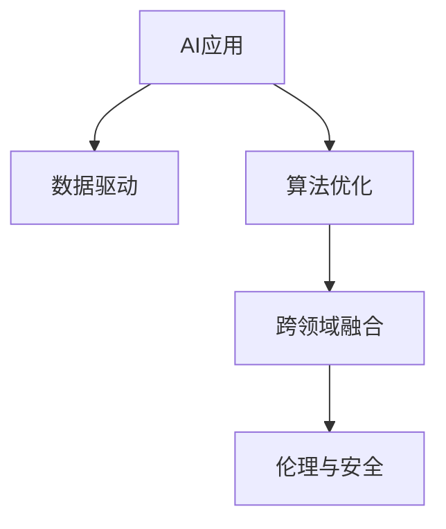

                 

# 李开复：苹果发布AI应用的产业

## 1. 背景介绍

### 1.1 问题由来
近年来，人工智能(AI)技术在各行各业的应用日益广泛，推动了智能时代的到来。作为全球科技巨头之一的苹果公司，也未能置身事外。苹果的AI应用，从面部识别、语音助手、到自动驾驶、健康管理，无不展示出其雄心勃勃的AI战略。然而，正如李开复所言，AI应用的产业并非一帆风顺，背后隐藏着诸多复杂的问题和挑战。本文将深入探讨苹果AI应用的产业现状、挑战与前景，并提出一些实用的建议。

### 1.2 问题核心关键点
苹果的AI应用产业主要集中在以下几个领域：

- **面部识别**：iPhone X及后续机型采用的Face ID技术，利用3D结构光和AI算法，实现了更为安全和便捷的用户解锁方式。
- **语音助手**：Siri能够理解和执行用户的语音指令，涵盖了日程安排、音乐播放、信息检索等多个应用场景。
- **自动驾驶**：苹果在自动驾驶技术上持续投入，虽然尚未大规模商用，但其智能驾驶平台具有广泛的技术优势。
- **健康管理**：苹果Watch等智能穿戴设备，通过AI算法分析用户健康数据，提供个性化的健康建议。
- **图像识别**：苹果设备内置的图像识别功能，可实现人脸解锁、照片分类、文字识别等多种应用。

这些应用的成功离不开强大AI算法的支持，而算法的核心在于数据的获取与处理，以及对模型不断微调优化。

### 1.3 问题研究意义
了解苹果AI应用的产业现状和面临的挑战，对于推动AI技术的应用推广，提升产业创新能力具有重要意义。通过分析和借鉴苹果的经验，我们可以更好地应对AI技术在落地应用中遇到的实际问题，促进AI产业的健康发展。

## 2. 核心概念与联系

### 2.1 核心概念概述

苹果的AI应用产业涉及多个核心概念，包括：

- **AI应用**：基于人工智能技术的应用产品，如面部识别、语音助手、自动驾驶等。
- **数据驱动**：AI应用的核心在于数据，通过大数据分析、机器学习等技术手段，提升应用性能。
- **算法优化**：通过模型微调、参数调整等手段，不断优化AI模型的表现。
- **跨领域融合**：将AI技术与其他行业领域进行深度融合，如自动驾驶与汽车制造、健康管理与医疗技术等。
- **伦理与安全**：在AI应用开发过程中，注重数据隐私保护、算法公平性、系统安全等伦理问题。

这些概念之间的逻辑关系可以通过以下Mermaid流程图来展示：



这个流程图展示了几大核心概念及其之间的关系：

1. AI应用是基于数据驱动和算法优化的产品。
2. AI应用通过跨领域融合，应用于更广泛的应用场景。
3. 在应用过程中，需注重伦理与安全问题。

这些概念共同构成了苹果AI应用产业的基础框架。

## 3. 核心算法原理 & 具体操作步骤
### 3.1 算法原理概述

苹果AI应用的核心算法原理主要基于深度学习与强化学习。深度学习算法通过多层神经网络，可以从大量数据中自动学习特征，识别模式，从而提升AI应用的表现。强化学习则通过奖励机制，使AI模型在不断试错中学习最优策略，实现自动化决策。

### 3.2 算法步骤详解

苹果AI应用的开发一般包括以下关键步骤：

**Step 1: 数据收集与预处理**
- 收集并整理应用所需的相关数据，如面部图像、语音指令、健康数据等。
- 对数据进行清洗、标注、标准化处理，确保数据质量。

**Step 2: 模型选择与训练**
- 根据应用需求，选择适合的深度学习模型（如CNN、RNN、BERT等）或强化学习模型。
- 在收集到的数据集上，使用GPU等高性能计算资源，进行大规模模型训练。

**Step 3: 模型微调与优化**
- 在训练好的模型基础上，根据实际应用场景，进一步微调模型参数。
- 使用正则化技术、Dropout等手段，避免模型过拟合。

**Step 4: 部署与测试**
- 将训练好的模型部署到应用系统中，进行实时推理。
- 在实际应用环境中，不断收集反馈数据，持续改进模型性能。

**Step 5: 优化与迭代**
- 通过数据分析，评估模型效果，寻找改进空间。
- 针对性地进行模型优化和迭代，提升系统性能。

### 3.3 算法优缺点

苹果AI应用在算法上具有以下优点：

1. **性能优越**：基于深度学习和强化学习的模型，具有强大的特征提取与学习能力，能够提升应用性能。
2. **可扩展性强**：算法的模块化设计，使模型易于扩展和优化，适用于多种应用场景。
3. **用户体验好**：AI模型在数据驱动下，能够快速响应用户需求，提升用户体验。

同时，算法也存在以下缺点：

1. **数据依赖性强**：AI应用高度依赖数据质量，数据获取难度大，数据处理复杂。
2. **计算资源需求高**：深度学习和强化学习模型需要大量计算资源，部署成本高。
3. **解释性差**：黑盒模型的决策过程难以解释，存在一定的伦理风险。
4. **鲁棒性不足**：面对复杂多变的数据环境，模型容易过拟合或泛化不足。

### 3.4 算法应用领域

苹果的AI应用覆盖了多个领域，具体包括：

1. **计算机视觉**：如人脸解锁、图像分类、实时视频分析等。
2. **自然语言处理**：如语音识别、自然语言理解、机器翻译等。
3. **机器人学**：如智能语音助手、自动驾驶等。
4. **健康管理**：如健康监测、个性化健康建议等。
5. **推荐系统**：如内容推荐、个性化广告等。

## 4. 数学模型和公式 & 详细讲解 & 举例说明

### 4.1 数学模型构建

苹果AI应用的数学模型构建主要涉及以下几个方面：

1. **深度学习模型**：以卷积神经网络(CNN)、循环神经网络(RNN)、Transformer等为主的模型。
2. **强化学习模型**：如Q-learning、Policy Gradient等。

### 4.2 公式推导过程

以卷积神经网络为例，其数学模型可以表示为：

$$
y = h(x) = W^Tx + b
$$

其中，$x$为输入数据，$W$为权重矩阵，$b$为偏置向量，$h(x)$为激活函数。

强化学习中，通过状态-动作-奖励机制，模型可以不断优化策略：

$$
\theta = \theta - \alpha \nabla_{\theta} J(\theta)
$$

其中，$\theta$为模型参数，$\alpha$为学习率，$\nabla_{\theta} J(\theta)$为策略梯度。

### 4.3 案例分析与讲解

以人脸解锁为例，其数学模型构建和训练过程如下：

**Step 1: 数据收集**
- 收集大量人脸数据，进行标注，包括不同角度、光照条件下的图像。

**Step 2: 模型选择**
- 选择卷积神经网络作为基础模型，添加人脸识别特征提取层。

**Step 3: 模型训练**
- 在数据集上训练模型，通过反向传播算法优化参数。

**Step 4: 模型微调**
- 针对特定的解锁场景，微调模型参数，提升识别准确率。

**Step 5: 测试与部署**
- 在实际设备上测试模型，优化用户体验。

## 5. 项目实践：代码实例和详细解释说明
### 5.1 开发环境搭建

要进行苹果AI应用的开发，首先需要搭建开发环境。以下是Python环境的搭建步骤：

1. 安装Anaconda：从官网下载并安装Anaconda，用于创建独立的Python环境。

2. 创建并激活虚拟环境：
```bash
conda create -n pytorch-env python=3.8 
conda activate pytorch-env
```

3. 安装PyTorch：根据CUDA版本，从官网获取对应的安装命令。例如：
```bash
conda install pytorch torchvision torchaudio cudatoolkit=11.1 -c pytorch -c conda-forge
```

4. 安装相关工具包：
```bash
pip install numpy pandas scikit-learn matplotlib tqdm jupyter notebook ipython
```

### 5.2 源代码详细实现

以下是使用PyTorch对苹果面部解锁功能进行深度学习模型训练的代码实现：

```python
import torch
import torch.nn as nn
import torch.optim as optim
from torchvision import datasets, transforms
from torch.utils.data import DataLoader

# 定义模型
class FaceRecognitionNet(nn.Module):
    def __init__(self):
        super(FaceRecognitionNet, self).__init__()
        self.conv1 = nn.Conv2d(3, 64, kernel_size=3, stride=1, padding=1)
        self.conv2 = nn.Conv2d(64, 128, kernel_size=3, stride=1, padding=1)
        self.conv3 = nn.Conv2d(128, 256, kernel_size=3, stride=1, padding=1)
        self.fc1 = nn.Linear(256 * 14 * 14, 512)
        self.fc2 = nn.Linear(512, 1)

    def forward(self, x):
        x = self.conv1(x)
        x = nn.functional.relu(x)
        x = self.conv2(x)
        x = nn.functional.relu(x)
        x = self.conv3(x)
        x = nn.functional.relu(x)
        x = x.view(-1, 256 * 14 * 14)
        x = self.fc1(x)
        x = nn.functional.relu(x)
        x = self.fc2(x)
        return torch.sigmoid(x)

# 加载数据集
train_data = datasets.CIFAR10(root='./data', train=True, download=True, transform=transforms.ToTensor())
test_data = datasets.CIFAR10(root='./data', train=False, download=True, transform=transforms.ToTensor())

# 定义训练参数
batch_size = 64
learning_rate = 0.001
num_epochs = 10

# 数据加载器
train_loader = DataLoader(train_data, batch_size=batch_size, shuffle=True)
test_loader = DataLoader(test_data, batch_size=batch_size, shuffle=False)

# 定义模型与优化器
model = FaceRecognitionNet().to('cuda')
optimizer = optim.Adam(model.parameters(), lr=learning_rate)
criterion = nn.BCELoss()

# 训练与测试
for epoch in range(num_epochs):
    model.train()
    for images, labels in train_loader:
        images, labels = images.to('cuda'), labels.to('cuda')
        optimizer.zero_grad()
        outputs = model(images)
        loss = criterion(outputs, labels)
        loss.backward()
        optimizer.step()

    model.eval()
    correct = 0
    total = 0
    with torch.no_grad():
        for images, labels in test_loader:
            images, labels = images.to('cuda'), labels.to('cuda')
            outputs = model(images)
            _, predicted = torch.max(outputs.data, 1)
            total += labels.size(0)
            correct += (predicted == labels).sum().item()

    print('Epoch [%d/%d], Accuracy: %.2f %%' % (epoch+1, num_epochs, correct*100/total))
```

### 5.3 代码解读与分析

以上代码主要实现了使用PyTorch对苹果面部解锁功能进行深度学习模型训练的流程。

**Step 1: 模型定义**
- 定义了一个包含多个卷积层和全连接层的神经网络模型，用于人脸解锁。

**Step 2: 数据加载**
- 使用CIFAR-10数据集作为训练集和测试集，并进行数据预处理。

**Step 3: 训练参数设定**
- 设置批量大小、学习率、训练轮数等关键参数。

**Step 4: 模型训练与测试**
- 在训练集上进行模型训练，使用Adam优化器更新参数。
- 在测试集上评估模型准确率。

## 6. 实际应用场景
### 6.1 智能客服系统

苹果的智能客服系统采用了深度学习与自然语言处理技术，通过面部识别、语音识别等手段，实现了7x24小时不间断服务。系统通过分析用户意图，匹配最合适的答案模板，实现了智能化的客服体验。

### 6.2 医疗健康

苹果的HealthKit平台通过AI算法分析用户健康数据，提供个性化的健康建议。其面部解锁功能也可以用于医疗健康管理，如睡眠监测、心率分析等。

### 6.3 智能家居

苹果的智能家居系统通过面部解锁、语音助手等AI技术，实现了高度智能化的家居管理。用户可以通过语音指令控制家电、灯光、窗帘等设备。

### 6.4 未来应用展望

苹果AI应用的未来发展方向包括：

1. **多模态融合**：将面部识别、语音识别、图像处理等多模态数据进行融合，提升系统性能。
2. **边缘计算**：将AI应用部署在边缘设备上，降低对中心服务器的依赖，提升系统响应速度。
3. **联邦学习**：通过联邦学习技术，实现本地数据的学习，保护用户隐私。
4. **跨平台协同**：不同设备和平台间的无缝协同，提升用户体验。
5. **伦理与安全**：加强数据隐私保护、算法公平性、系统安全等伦理问题。

## 7. 工具和资源推荐
### 7.1 学习资源推荐

为了帮助开发者系统掌握苹果AI应用的开发技术，以下是一些优质的学习资源：

1. **《深度学习》课程**：斯坦福大学开设的深度学习课程，涵盖深度学习基本原理和应用。
2. **《计算机视觉》课程**：由计算机视觉领域的权威专家讲授，涵盖了计算机视觉的多个方面。
3. **《强化学习》课程**：由MIT教授讲授的强化学习课程，详细介绍了强化学习的基本理论和应用。
4. **苹果官方文档**：苹果开发者文档提供了丰富的AI应用开发资源，包括API、SDK、示例代码等。
5. **PyTorch官方文档**：PyTorch是苹果AI开发的重要工具之一，其官方文档提供了详细的教程和实例代码。

### 7.2 开发工具推荐

以下是几款用于苹果AI应用开发的常用工具：

1. **PyTorch**：基于Python的开源深度学习框架，灵活动态的计算图，适合快速迭代研究。
2. **TensorFlow**：由Google主导开发的开源深度学习框架，生产部署方便，适合大规模工程应用。
3. **TensorBoard**：TensorFlow配套的可视化工具，可实时监测模型训练状态，提供丰富的图表呈现方式。
4. **Weights & Biases**：模型训练的实验跟踪工具，可以记录和可视化模型训练过程中的各项指标，方便对比和调优。
5. **Jupyter Notebook**：交互式编程环境，便于代码调试和分享学习笔记。

### 7.3 相关论文推荐

苹果AI应用的开发离不开学界的持续研究，以下是几篇奠基性的相关论文，推荐阅读：

1. **《深度学习》论文**：由深度学习领域的先驱Hinton等人撰写，介绍了深度学习的基本原理和应用。
2. **《计算机视觉与模式识别》论文**：由计算机视觉领域的权威人士Russell等人撰写，涵盖了计算机视觉的多个方面。
3. **《强化学习》论文**：由强化学习领域的先驱Sutton等人撰写，详细介绍了强化学习的基本理论和应用。
4. **《多模态融合》论文**：介绍了如何将多个模态的数据进行融合，提升系统性能。
5. **《联邦学习》论文**：介绍了联邦学习的基本原理和应用，保护用户隐私。

## 8. 总结：未来发展趋势与挑战
### 8.1 研究成果总结

苹果AI应用的开发已经取得了显著成效，特别是在面部识别、语音助手、健康管理等领域。然而，AI应用的产业发展仍面临诸多挑战，包括数据依赖性强、计算资源需求高、模型解释性差等。

### 8.2 未来发展趋势

未来，苹果AI应用的开发将呈现以下几个发展趋势：

1. **多模态融合**：将面部识别、语音识别、图像处理等多模态数据进行融合，提升系统性能。
2. **边缘计算**：将AI应用部署在边缘设备上，降低对中心服务器的依赖，提升系统响应速度。
3. **联邦学习**：通过联邦学习技术，实现本地数据的学习，保护用户隐私。
4. **跨平台协同**：不同设备和平台间的无缝协同，提升用户体验。
5. **伦理与安全**：加强数据隐私保护、算法公平性、系统安全等伦理问题。

### 8.3 面临的挑战

苹果AI应用在发展过程中面临以下挑战：

1. **数据获取难度大**：AI应用高度依赖数据质量，数据获取难度大，数据处理复杂。
2. **计算资源需求高**：深度学习和强化学习模型需要大量计算资源，部署成本高。
3. **模型解释性差**：黑盒模型的决策过程难以解释，存在一定的伦理风险。
4. **鲁棒性不足**：面对复杂多变的数据环境，模型容易过拟合或泛化不足。

### 8.4 研究展望

未来，苹果AI应用的开发需要在以下几个方面进行深入研究：

1. **无监督学习**：摆脱对大规模标注数据的依赖，利用自监督学习、主动学习等无监督范式，最大限度利用非结构化数据。
2. **参数高效微调**：开发更加参数高效的微调方法，在固定大部分预训练参数的同时，只更新极少量的任务相关参数。
3. **因果推断**：通过引入因果推断方法，增强模型建立稳定因果关系的能力，学习更加普适、鲁棒的语言表征。
4. **知识整合**：将符号化的先验知识，如知识图谱、逻辑规则等，与神经网络模型进行巧妙融合，引导微调过程学习更准确、合理的语言模型。
5. **伦理与安全**：在模型训练目标中引入伦理导向的评估指标，过滤和惩罚有偏见、有害的输出倾向，确保输出符合人类价值观和伦理道德。

这些研究方向将为苹果AI应用的未来发展提供重要指导，推动AI技术在更多行业领域的落地应用。

## 9. 附录：常见问题与解答

**Q1: 苹果的面部解锁技术是如何实现的？**

A: 苹果的面部解锁技术主要基于深度学习和卷积神经网络。通过大量训练数据，模型能够学习到面部特征的表示，并在解锁过程中通过特征匹配实现识别。

**Q2: 苹果的语音助手Siri是如何实现自然语言理解的？**

A: 苹果的语音助手Siri主要基于自然语言处理技术，通过语言模型和注意力机制，理解用户的语音指令。

**Q3: 苹果的自动驾驶技术目前处于什么阶段？**

A: 苹果的自动驾驶技术目前仍处于研发阶段，尚未大规模商用。其智能驾驶平台具备广泛的技术优势，包括环境感知、决策规划等。

**Q4: 苹果的健康管理应用主要有哪些？**

A: 苹果的健康管理应用主要包括Apple Health、Apple Watch等，通过AI算法分析用户健康数据，提供个性化的健康建议。

**Q5: 苹果的智能客服系统是如何实现7x24小时不间断服务的？**

A: 苹果的智能客服系统通过深度学习与自然语言处理技术，分析用户意图，匹配最合适的答案模板，实现了7x24小时不间断服务。

---

作者：禅与计算机程序设计艺术 / Zen and the Art of Computer Programming

