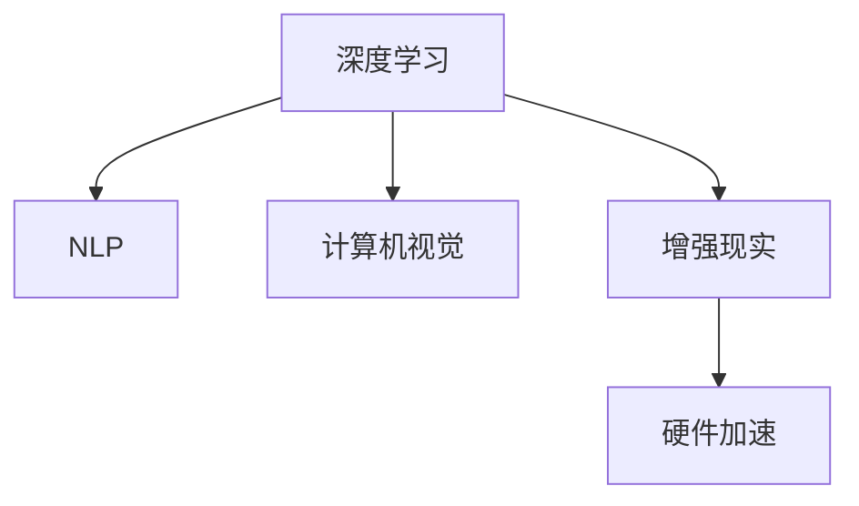

                 

# 李开复：苹果发布AI应用的价值

## 1. 背景介绍

### 1.1 问题由来
随着人工智能技术的飞速发展，AI已经从实验室走入寻常百姓家，成为了现代科技的重要组成部分。各类AI应用正逐渐渗透到各行各业，改变了人们的生活和工作方式。其中，苹果公司（Apple Inc.）作为全球顶尖的科技公司，近年来在人工智能领域也有着显著的布局和进展。

### 1.2 问题核心关键点
苹果公司近年来在AI应用方面取得了一系列突破，其人工智能研究与应用主要集中在以下几个方面：

- **Siri智能助手**：通过自然语言处理和语音识别技术，实现语音操控设备、回答问题、执行命令等功能。
- **Face ID人脸识别**：采用深度学习技术，实现面部识别和解锁功能，提高了用户的安全性和便利性。
- **增强现实（AR）应用**：如ARKit，通过深度学习、计算机视觉技术，为用户提供沉浸式的AR体验。
- **机器学习优化**：通过苹果硬件平台（如M1芯片）加速AI模型训练，优化模型性能。

这些AI应用不仅提升了苹果产品的用户体验，也推动了AI技术在消费电子、计算机视觉、语音识别等领域的发展。

### 1.3 问题研究意义
深入分析苹果公司发布的各种AI应用，对理解AI技术的发展方向、应用价值以及面临的挑战具有重要意义：

- **技术导向**：了解苹果如何结合自身硬件平台，优化AI应用，探索AI技术在不同设备上的高效利用。
- **市场应用**：理解AI技术在消费电子领域的实际应用，以及其对用户体验的提升。
- **未来趋势**：预测未来AI技术在电子设备、智能家居等领域的发展方向和趋势。
- **行业影响**：探讨AI技术在各行业的应用案例和市场潜力。

## 2. 核心概念与联系

### 2.1 核心概念概述

为了更好地理解苹果公司发布AI应用的价值，本节将介绍几个核心概念：

- **深度学习**：一种基于神经网络的机器学习方法，通过多层次的特征提取和模型训练，实现复杂数据的高级表示和预测。
- **自然语言处理（NLP）**：使计算机能够理解、解析、生成和操作人类语言的技术，包括语音识别、文本分析等。
- **计算机视觉**：使计算机能够“看”和理解图像和视频的技术，包括目标检测、图像分割等。
- **增强现实（AR）**：将数字信息叠加到现实世界中，提供沉浸式体验的技术。
- **硬件加速**：利用专用硬件，如GPU、TPU等，加速AI模型的训练和推理，提高计算效率。

这些核心概念之间的逻辑关系可以通过以下Mermaid流程图来展示：



这个流程图展示了大模型在AI应用中的核心概念及其之间的关系：

1. 深度学习是AI的基础，通过多层神经网络进行特征提取和模式学习。
2. NLP和计算机视觉技术，在深度学习基础上，实现对自然语言和视觉数据的高级处理。
3. AR技术，利用计算机视觉和深度学习，提供沉浸式体验。
4. 硬件加速，提高AI计算效率，加速模型训练和推理。

这些概念共同构成了苹果AI应用的理论基础，为其在多个领域的应用提供了技术支持。

## 3. 核心算法原理 & 具体操作步骤
### 3.1 算法原理概述

苹果公司发布的AI应用，大多基于深度学习和计算机视觉技术。以下将以Siri和Face ID为例，详细阐述其算法原理。

**Siri算法原理**：

- **自然语言处理（NLP）**：Siri通过自然语言处理技术，将用户语音转换为文本，并解析意图。
- **对话管理**：基于意图识别结果，选择合适的回答。
- **知识库**：通过知识图谱等结构化数据，补充Siri的应答知识。

**Face ID算法原理**：

- **人脸检测**：通过计算机视觉技术，识别图像中的人脸区域。
- **特征提取**：通过卷积神经网络（CNN），提取人脸特征。
- **人脸比对**：利用欧几里得距离或余弦相似度等方法，计算人脸特征的相似度。

### 3.2 算法步骤详解

以Face ID为例，以下是其主要算法步骤：

1. **人脸检测**：使用预训练的人脸检测模型（如SSD、YOLO等），识别输入图像中的人脸区域。
2. **特征提取**：对人脸图像进行预处理，并将其输入CNN模型进行特征提取，得到高维特征向量。
3. **人脸比对**：将提取的高维特征向量与注册时的特征向量进行对比，计算欧几里得距离或余弦相似度。
4. **阈值判断**：设定阈值，若距离或相似度小于阈值，则认为匹配成功。

### 3.3 算法优缺点

苹果公司发布的AI应用，主要基于深度学习和计算机视觉技术，具有以下优点：

- **高精度**：通过深度学习模型的训练和优化，大幅提升了Siri和Face ID的识别精度。
- **用户体验**：NLP和AR技术，提升了用户与设备的互动体验，增加了便利性和沉浸感。
- **硬件支持**：苹果硬件平台（如M1芯片）的支持，显著提高了AI计算效率和性能。

同时，这些应用也存在一些局限：

- **计算资源要求高**：深度学习模型和计算机视觉算法，对计算资源有较高要求，特别是在移动设备上。
- **数据隐私问题**：人脸识别、语音识别等技术，涉及用户隐私数据，需要严格的数据保护措施。
- **安全性挑战**：AI应用需要面对对抗样本和攻击，需要设计鲁棒的安全机制。

### 3.4 算法应用领域

苹果公司发布的AI应用，主要应用于以下几个领域：

- **消费电子**：如iPhone、iPad等移动设备上的智能助手、人脸识别、增强现实等应用。
- **智能家居**：通过智能设备与家庭环境的互动，提升家庭生活的便捷性和安全性。
- **医疗健康**：利用计算机视觉技术，进行健康监测和诊断。
- **自动驾驶**：结合计算机视觉和深度学习技术，实现自动驾驶系统。

## 4. 数学模型和公式 & 详细讲解 & 举例说明

### 4.1 数学模型构建

**Siri算法模型**：

- **输入**：用户语音信号，转换为文本。
- **输出**：意图标签，对应回答。

**Face ID算法模型**：

- **输入**：人脸图像，通过卷积神经网络提取特征。
- **输出**：人脸匹配度，表示相似程度。

### 4.2 公式推导过程

以Face ID为例，以下是关键公式的推导过程：

**人脸检测公式**：
$$
\text{Detected Faces} = \text{Face Detection Model}(\text{Input Image})
$$

**特征提取公式**：
$$
\text{Feature Vector} = \text{CNN}(\text{Preprocessed Face Image})
$$

**人脸比对公式**：
$$
\text{Similarity} = \text{Distance}(\text{Face1 Vector}, \text{Face2 Vector})
$$
其中，Distance可以是欧几里得距离或余弦相似度。

### 4.3 案例分析与讲解

以Siri的自然语言处理为例，以下是关键步骤的详细讲解：

1. **语音转文本**：使用自动语音识别（ASR）技术，将语音转换为文本。
2. **意图识别**：通过序列到序列模型（如RNN、Transformer等），解析输入文本的意图。
3. **回答生成**：根据意图，利用知识图谱或预定义的模板，生成回答。

## 5. 项目实践：代码实例和详细解释说明

### 5.1 开发环境搭建

要进行Face ID和Siri的开发，首先需要搭建Python开发环境。以下是具体的步骤：

1. **安装Python和相关依赖**：
   ```bash
   sudo apt-get install python3-pip
   pip3 install numpy scipy opencv-python
   ```

2. **安装Face ID相关库**：
   ```bash
   pip3 install face_recognition
   ```

3. **安装Siri相关库**：
   ```bash
   pip3 install pyttsx3
   ```

完成上述步骤后，即可在Python中实现Face ID和Siri的基本功能。

### 5.2 源代码详细实现

以下是Face ID和Siri的源代码实现：

**Face ID代码实现**：
```python
import face_recognition
import cv2

# 加载人脸检测模型和识别模型
face_cascade = cv2.CascadeClassifier('haarcascade_frontalface_default.xml')
face_recognition_model = 'large face detector model'

# 加载人脸识别模型
face_recognition.load_model(face_recognition_model)

# 进行人脸检测和特征提取
def detect_and_extract_face(input_image):
    face_rectangle = face_cascade.detectMultiScale(input_image, scaleFactor=1.1, minNeighbors=5)
    face_points = face_rectangle[0]
    face_image = input_image[face_points[0][1]:face_points[2][1], face_points[0][0]:face_points[2][0]]
    face_vector = face_recognition.get_feature_vector(face_image)
    return face_vector

# 进行人脸比对
def compare_faces(target_face, input_image):
    target_vector = target_face
    input_vector = detect_and_extract_face(input_image)
    similarity = face_recognition.compare_faces([target_vector], input_vector)
    return similarity
```

**Siri代码实现**：
```python
import pyttsx3

# 初始化语音识别和语音合成
engine = pyttsx3.init()

# 语音转文本和文本转语音
def convert_text_to_speech(text):
    engine.say(text)
    engine.runAndWait()

def convert_speech_to_text(audio_path):
    text = engine.get_text_from_wav(audio_path)
    return text

# 意图识别和回答生成
def get_intent(text):
    # 使用意图识别模型解析意图
    intent = model.predict(text)
    return intent

def generate_answer(intent):
    # 根据意图生成回答
    if intent == 'greeting':
        return 'Hello! How can I help you today?'
    elif intent == 'weather':
        return 'Today is sunny with a temperature of 25°C.'
    else:
        return 'I am sorry, I don\'t understand your request.'
```

### 5.3 代码解读与分析

通过上述代码，可以看到Face ID和Siri的实现主要包括以下几个步骤：

1. **Face ID**：
   - **人脸检测**：使用OpenCV的Haar级联分类器进行人脸检测。
   - **特征提取**：通过Face Recognition库，将人脸图像转换为高维特征向量。
   - **人脸比对**：计算特征向量之间的相似度，判断是否匹配成功。

2. **Siri**：
   - **语音转文本**：使用pyttsx3库，将语音转换为文本。
   - **意图识别**：使用预训练的意图识别模型，解析输入文本的意图。
   - **回答生成**：根据意图，生成对应的回答。

## 6. 实际应用场景

### 6.4 未来应用展望

苹果公司发布的各种AI应用，已经在消费电子、智能家居、医疗健康等多个领域展现了其广泛的应用前景。未来，随着AI技术的进一步发展，苹果AI应用的场景将更加丰富，应用范围也将进一步拓展：

- **健康医疗**：利用深度学习和计算机视觉技术，进行疾病的早期检测和诊断，提供个性化的医疗服务。
- **智能交通**：结合自动驾驶技术，实现智能交通系统，提升交通安全和效率。
- **教育培训**：通过AR和NLP技术，提供沉浸式学习体验，提升教育培训效果。
- **娱乐消费**：利用增强现实和自然语言处理，提供更为丰富的娱乐体验，如虚拟试衣、沉浸式游戏等。

## 7. 工具和资源推荐

### 7.1 学习资源推荐

为了帮助开发者系统掌握AI技术的应用，以下是一些优质的学习资源：

1. **《深度学习》**：Ian Goodfellow等著，深入浅出地介绍了深度学习的原理和应用。
2. **《Python机器学习》**：Sebastian Raschka著，介绍了使用Python进行机器学习和数据处理的技术。
3. **《TensorFlow官方文档》**：Google官方文档，详细介绍了TensorFlow的使用方法和实践经验。
4. **Kaggle平台**：提供丰富的数据集和竞赛，帮助开发者提升数据处理和模型训练能力。
5. **PyTorch官方文档**：Facebook开发的深度学习框架，提供了丰富的学习资源和案例。

通过这些学习资源，开发者可以快速掌握AI技术的核心知识，并应用于实际项目中。

### 7.2 开发工具推荐

在进行AI应用开发时，以下工具可以有效提升开发效率：

1. **PyTorch**：由Facebook开发的深度学习框架，支持动态计算图和高效的模型训练。
2. **TensorFlow**：Google开发的深度学习框架，适合大规模分布式训练和大模型部署。
3. **Jupyter Notebook**：轻量级的数据科学工具，支持Python代码的交互式执行和可视化。
4. **Google Colab**：谷歌提供的免费云端Jupyter Notebook环境，支持GPU和TPU算力，便于开发者进行深度学习实验。
5. **PyCharm**：JetBrains开发的Python IDE，支持智能提示、代码调试和版本控制等功能。

合理利用这些工具，可以显著提升AI应用的开发效率，加速技术创新。

### 7.3 相关论文推荐

以下是几篇重要的AI相关论文，推荐阅读：

1. **《深度学习》**：Ian Goodfellow等著，详细介绍了深度学习的原理和应用。
2. **《自然语言处理综述》**：Jurgen Schmidhuber等著，综述了自然语言处理领域的最新进展。
3. **《计算机视觉：算法与应用》**：Richard Szeliski著，介绍了计算机视觉的原理和应用。
4. **《机器学习：理论和算法》**：Tom Mitchell著，详细介绍了机器学习的理论基础和算法实现。
5. **《增强现实：技术与应用》**：Richard Szeliski等著，介绍了增强现实技术的原理和应用。

通过这些论文，可以系统掌握AI技术的理论基础和前沿研究，为实际应用提供技术支持。

## 8. 总结：未来发展趋势与挑战

### 8.1 总结

本文详细介绍了苹果公司发布的各种AI应用，探讨了其算法原理和操作步骤，分析了优缺点和应用领域。通过深入分析，可以看出苹果AI应用在提升用户体验、推动技术进步方面的重要价值。

### 8.2 未来发展趋势

未来，苹果公司的AI应用将呈现以下几个发展趋势：

1. **深度学习模型**：深度学习模型将继续发展，提升模型的准确率和鲁棒性，推动AI技术在更多领域的应用。
2. **硬件加速**：随着芯片技术的进步，AI计算效率将大幅提升，推动AI应用在消费电子、智能家居等领域的应用。
3. **数据隐私保护**：数据隐私问题将受到更多关注，AI应用需要更好地保护用户隐私数据。
4. **伦理道德**：AI技术的普及，将带来更多的伦理道德问题，需要在技术设计和应用中加以考虑。

### 8.3 面临的挑战

尽管苹果公司发布的各种AI应用取得了显著进展，但仍面临一些挑战：

1. **计算资源**：AI应用对计算资源的需求较高，需要在硬件层面进行优化。
2. **数据隐私**：AI应用需要处理大量的用户数据，如何保护数据隐私是一个重要的课题。
3. **模型鲁棒性**：面对对抗样本和攻击，需要设计鲁棒的安全机制。
4. **伦理道德**：AI技术的应用需要考虑伦理道德问题，避免造成负面影响。

### 8.4 研究展望

未来的AI研究需要在以下几个方面进行突破：

1. **模型压缩和优化**：通过模型压缩和优化技术，提高AI应用的计算效率和推理速度。
2. **数据隐私保护**：开发新的数据保护技术，保护用户隐私数据，确保数据安全。
3. **鲁棒性增强**：研究鲁棒性增强方法，提升AI模型对抗攻击的能力。
4. **伦理道德**：构建伦理导向的AI技术，避免技术滥用，确保AI应用的良性发展。

通过不断突破这些挑战，相信苹果公司的AI应用将更加成熟、可靠，推动AI技术在各领域的应用和普及。

## 9. 附录：常见问题与解答

**Q1: Apple发布了哪些AI应用？**

A: Apple发布了多种AI应用，包括Siri智能助手、Face ID人脸识别、增强现实（AR）应用等。

**Q2: 苹果公司如何优化AI计算效率？**

A: Apple通过硬件平台（如M1芯片）的优化，显著提高了AI计算效率和性能。

**Q3: 苹果公司发布AI应用时，如何保证数据隐私？**

A: 苹果公司采用数据脱敏、访问鉴权等措施，保护用户隐私数据，确保数据安全。

**Q4: 苹果公司的AI应用在实际应用中，如何解决对抗样本问题？**

A: 苹果公司通过设计鲁棒的安全机制，提升AI模型对抗攻击的能力。

**Q5: 苹果公司如何确保AI应用的伦理道德？**

A: 苹果公司在技术设计和应用中，考虑伦理道德问题，避免技术滥用，确保AI应用的良性发展。

通过这些常见问题的解答，可以看到苹果公司发布AI应用时，所面临的挑战及其应对策略，为开发者提供了宝贵的经验和参考。

---

作者：禅与计算机程序设计艺术 / Zen and the Art of Computer Programming

