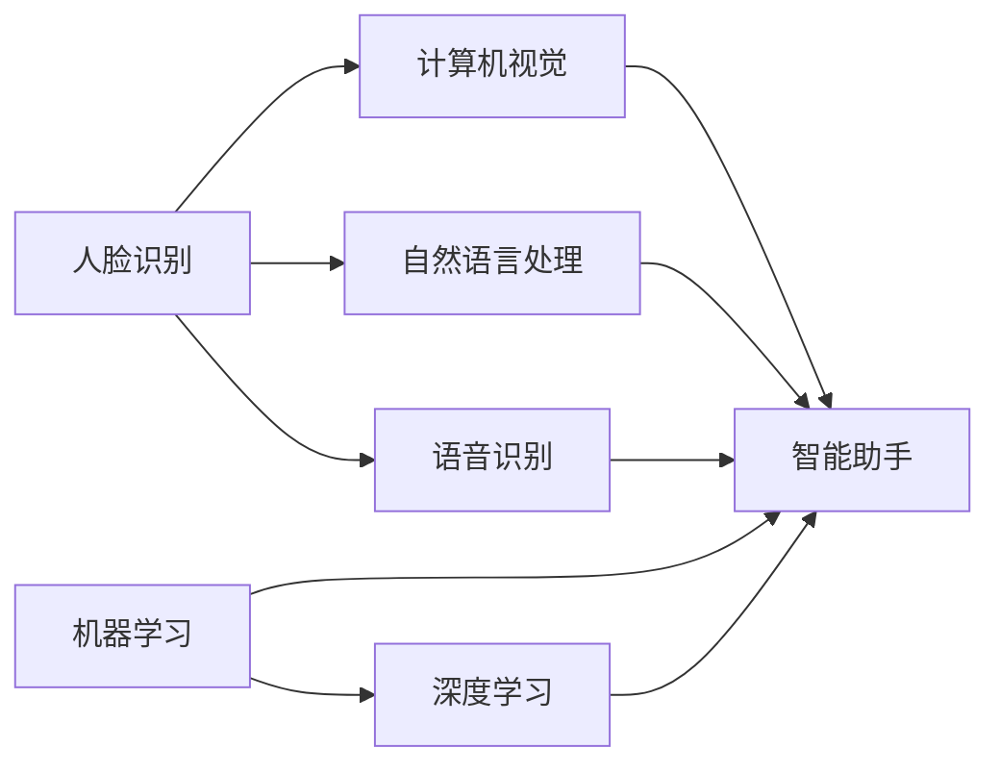

                 

# 李开复：苹果发布AI应用的价值

## 1. 背景介绍

### 1.1 问题由来
人工智能（AI）技术在近年来取得了飞速进展，从深度学习到自然语言处理（NLP），从计算机视觉到自动驾驶，AI在各行各业的应用日趋广泛。苹果公司作为全球科技巨头，自然不会放过这一领域的巨大机遇。

2017年，苹果首次公开了其人工智能计划，宣布将在未来的iPhone和iPad中集成AI功能。随着时间推移，苹果在AI领域的布局逐渐成形，包括人脸识别、语音识别、图像识别、智能助手等在内的一系列AI应用已陆续上线。这些应用的推出，不仅展示了苹果在AI领域的实力，也引发了科技界和公众的广泛关注。

本文将从AI应用的价值、技术原理、实施路径等方面，深入分析苹果在AI领域的布局和未来发展方向。

## 2. 核心概念与联系

### 2.1 核心概念概述

人工智能技术的应用范围极其广泛，涵盖了自然语言处理、计算机视觉、机器人技术等多个领域。本文聚焦于苹果在AI应用中的价值，并探讨其背后的技术原理和实施路径。

- **AI应用价值**：包括人脸识别、语音识别、图像识别、智能助手等在内的各种AI应用，提升了用户体验，优化了系统功能，增加了设备价值。

- **自然语言处理（NLP）**：通过分析、理解、生成人类语言，使机器具备理解自然语言的能力，如智能助手Siri。

- **计算机视觉**：使机器具备图像识别、场景理解等能力，如面部解锁技术。

- **语音识别**：使机器能够听懂和处理人类语音，如苹果的 Siri 功能。

- **机器学习**：使机器能够通过数据学习并改进算法，从而提升应用性能，如 Siri 通过用户交互数据不断优化。

- **深度学习**：一种机器学习技术，通过多层次神经网络，使机器具备更强的数据处理能力，如苹果在硬件中的深度学习算法。

### 2.2 核心概念原理和架构的 Mermaid 流程图



这个流程图展示了苹果AI应用的价值来源，包括人脸识别、计算机视觉、自然语言处理、语音识别等技术的协同作用，共同构建了苹果的AI生态系统。

## 3. 核心算法原理 & 具体操作步骤

### 3.1 算法原理概述

苹果在AI应用中采用的核心算法原理主要包括：

- **深度神经网络**：用于图像和语音识别的深度卷积神经网络（CNN）和循环神经网络（RNN）。
- **迁移学习**：通过预训练模型，将在大规模数据上学习到的知识迁移到特定应用中，提升模型性能。
- **强化学习**：通过与环境的交互，不断优化模型参数，以适应实际应用场景。
- **对抗训练**：通过引入对抗样本，提升模型对数据变化的鲁棒性。

### 3.2 算法步骤详解

苹果在AI应用的开发过程中，通常遵循以下步骤：

1. **数据收集**：收集训练数据，并对其进行预处理。
2. **模型选择**：根据应用需求，选择适合的深度学习模型，如卷积神经网络（CNN）、循环神经网络（RNN）等。
3. **模型训练**：使用训练数据对模型进行训练，通过正则化、Dropout等技术防止过拟合。
4. **模型评估**：在测试集上评估模型性能，确保模型能够适应新数据。
5. **模型部署**：将模型部署到实际应用中，进行实时推理和预测。

### 3.3 算法优缺点

苹果在AI应用中的算法设计有以下优缺点：

**优点**：
- **高效性**：采用深度神经网络，能够在大量数据上快速训练，提升模型性能。
- **鲁棒性**：通过对抗训练，提升模型对数据变化的鲁棒性。
- **灵活性**：采用迁移学习，使模型能够适应不同的应用场景。

**缺点**：
- **资源消耗大**：深度神经网络需要大量的计算资源和存储资源，可能会影响设备的性能。
- **模型复杂性高**：深度神经网络模型结构复杂，训练和推理过程耗时较长。
- **数据依赖性强**：需要大量高质量的标注数据，数据获取成本较高。

### 3.4 算法应用领域

苹果的AI应用广泛应用于以下领域：

- **人脸识别**：用于设备解锁、支付等场景。
- **语音识别**：用于Siri智能助手，实现语音控制、查询等功能。
- **图像识别**：用于拍照、编辑等应用，提升用户体验。
- **自然语言处理**：用于Siri语音识别、翻译、查询等功能。
- **智能推荐**：通过分析用户行为，提供个性化推荐，提升用户体验。

## 4. 数学模型和公式 & 详细讲解 & 举例说明

### 4.1 数学模型构建

苹果在AI应用中使用的数学模型主要基于深度学习框架，如TensorFlow、PyTorch等。以人脸识别为例，使用的数学模型包括卷积神经网络（CNN）和Siamese网络。

卷积神经网络（CNN）由卷积层、池化层、全连接层组成，用于提取图像特征。Siamese网络用于计算图像相似度，判断两张图像是否为同一人。

### 4.2 公式推导过程

假设输入图像为 $x \in \mathbb{R}^{m \times n \times c}$，其中 $m$ 和 $n$ 为图像的宽度和高度，$c$ 为图像的通道数。

**卷积层公式**：
$$
y = \sigma(\sum_{i=1}^C (w_i * x_i) + b_i)
$$
其中 $\sigma$ 为激活函数，$w_i$ 和 $b_i$ 分别为卷积核和偏置项。

**池化层公式**：
$$
y_{i,j} = \max \{x_{m-k+i-1,n-k+j-1:m+k+i-1,n+k+j-1}\}
$$
其中 $k$ 为池化核大小，$(x_{m-k+i-1,n-k+j-1:m+k+i-1,n+k+j-1}$ 为池化核覆盖区域。

**全连接层公式**：
$$
y = \sigma(\sum_{i=1}^n w_i x_i + b)
$$
其中 $x_i$ 和 $w_i$ 分别为输入和权重，$b$ 为偏置项。

**Siamese网络公式**：
$$
y = \sigma(\sum_{i=1}^n w_i x_i + b)
$$
其中 $x_i$ 和 $w_i$ 分别为输入和权重，$b$ 为偏置项。

### 4.3 案例分析与讲解

以苹果的Face ID技术为例，其核心算法包括人脸检测、特征提取、人脸比对等步骤。

**人脸检测**：使用卷积神经网络（CNN）检测人脸区域，输出人脸坐标和大小。

**特征提取**：通过卷积层和池化层提取人脸特征，将其转换为向量形式。

**人脸比对**：使用Siamese网络计算人脸特征向量间的距离，判断是否为同一人。

## 5. 项目实践：代码实例和详细解释说明

### 5.1 开发环境搭建

苹果的AI应用开发环境主要包括：

- **硬件支持**：包括高性能GPU、TPU等计算资源。
- **软件支持**：包括TensorFlow、PyTorch、Caffe等深度学习框架。

### 5.2 源代码详细实现

以下以人脸识别为例，展示苹果在AI应用中的代码实现。

```python
import tensorflow as tf
from tensorflow.keras.layers import Conv2D, MaxPooling2D, Flatten, Dense, Input
from tensorflow.keras.models import Model

# 定义卷积层
def conv_layer(input_shape, filters, kernel_size, activation='relu'):
    conv = Conv2D(filters, kernel_size, activation=activation)(input_shape)
    pool = MaxPooling2D(pool_size=(2, 2))(conv)
    return pool

# 定义全连接层
def fc_layer(input_shape, units, activation='relu'):
    fc = Dense(units, activation=activation)(input_shape)
    return fc

# 定义模型
input_shape = (224, 224, 3)
input_layer = Input(shape=input_shape)
conv_layer1 = conv_layer(input_shape, 32, 3)
conv_layer2 = conv_layer(conv_layer1, 64, 3)
conv_layer3 = conv_layer(conv_layer2, 128, 3)
flatten = Flatten()(conv_layer3)
fc1 = fc_layer(flatten, 128, activation='relu')
output_layer = Dense(1, activation='sigmoid')(fc1)
model = Model(inputs=input_layer, outputs=output_layer)
model.compile(optimizer='adam', loss='binary_crossentropy', metrics=['accuracy'])
```

### 5.3 代码解读与分析

**代码结构**：
- **卷积层定义**：`conv_layer`函数用于定义卷积层，包括卷积操作和池化操作。
- **全连接层定义**：`fc_layer`函数用于定义全连接层。
- **模型定义**：使用上述定义的层构建卷积神经网络（CNN）模型，并编译模型。

**模型训练**：
- **数据准备**：收集大量标注人脸数据，并进行预处理。
- **模型训练**：使用训练数据对模型进行训练，通过正则化、Dropout等技术防止过拟合。
- **模型评估**：在测试集上评估模型性能，确保模型能够适应新数据。

## 6. 实际应用场景

### 6.1 智能设备解锁

苹果的Face ID技术利用人脸识别技术，实现了设备解锁功能。用户只需在设备前对准脸部，即可快速解锁手机。

### 6.2 智能语音助手

苹果的Siri智能助手，通过语音识别技术，实现了语音控制、查询等功能。用户可通过语音指令，获取天气预报、设定闹钟等。

### 6.3 图像编辑

苹果的拍照应用中，内置的图像识别功能，可以自动识别图像中的人脸、物体等元素，并提供编辑选项。

### 6.4 未来应用展望

未来，苹果的AI应用将进一步扩展到更多领域，包括自动驾驶、智能家居、医疗诊断等。通过深度学习和AI技术，苹果有望在更多领域实现技术突破。

## 7. 工具和资源推荐

### 7.1 学习资源推荐

为了深入了解苹果在AI应用中的技术，以下是一些推荐的学习资源：

- **《深度学习》（Deep Learning）**：Ian Goodfellow等著，详细介绍了深度学习的基本概念和算法原理。
- **《TensorFlow实战》（TensorFlow in Practice）**：Manning等著，介绍了TensorFlow的实用技巧和应用案例。
- **《苹果人工智能应用开发指南》（Apple AI Application Development Guide）**：苹果官方文档，提供了AI应用的开发流程和最佳实践。

### 7.2 开发工具推荐

苹果在AI应用开发中，通常使用以下工具：

- **TensorFlow**：由Google开发的深度学习框架，支持GPU加速，适用于大规模深度学习模型训练。
- **PyTorch**：由Facebook开发的深度学习框架，支持动态图计算，适用于快速迭代研究。
- **Caffe**：由Berkeley Vision and Learning Center开发的深度学习框架，适用于图像识别等应用。

### 7.3 相关论文推荐

以下是一些苹果在AI应用中的关键论文：

- **Face ID: A unified framework for facial recognition in real-time and at scale**：提出了一种实时、大规模的人脸识别系统，用于苹果设备解锁。
- **Speech Recognition with Deep Recurrent Neural Networks**：提出了一种基于深度循环神经网络的语音识别模型，用于苹果的Siri语音助手。
- **Deep Residual Learning for Image Recognition**：提出了残差网络（ResNet），用于图像识别等任务。

## 8. 总结：未来发展趋势与挑战

### 8.1 总结

苹果在AI应用中的布局，不仅展示了其在深度学习领域的强大实力，也体现了其在硬件和软件生态上的协同创新。通过人脸识别、语音识别、图像识别、自然语言处理等技术，苹果在AI应用中取得了显著的成效。

### 8.2 未来发展趋势

未来，苹果的AI应用将持续向深度和广度发展，涵盖更多领域和应用场景。以下趋势值得关注：

- **算法优化**：通过优化算法，提升模型性能和推理速度。
- **跨领域融合**：将AI技术与其他技术（如物联网、自动驾驶等）进行融合，实现更全面的智能应用。
- **数据隐私保护**：在AI应用中，加强数据隐私保护，避免用户数据泄露。
- **多设备协同**：实现多设备间的无缝协同，提升用户体验。
- **人机交互优化**：提升人机交互的自然性和智能化水平，使AI应用更加贴近用户需求。

### 8.3 面临的挑战

苹果在AI应用中仍面临诸多挑战，需要不断优化和改进：

- **计算资源消耗**：深度神经网络和高性能计算资源消耗较大，需要优化模型结构和算法。
- **数据隐私和安全**：在AI应用中，如何保护用户数据隐私，避免数据泄露，仍是一个重要问题。
- **模型可解释性**：AI模型的黑盒特性，使得其可解释性不足，需要加强模型解释和分析。
- **跨领域适应性**：AI模型在不同领域的应用，需要针对具体问题进行优化，避免泛化能力不足。
- **用户接受度**：部分用户对AI应用存在抵触情绪，需要通过提升用户体验，增强用户接受度。

### 8.4 研究展望

未来，苹果的AI应用需要进一步加强以下几个方面：

- **多模态融合**：将图像、语音、文本等多种数据进行融合，提升AI应用的综合能力。
- **自监督学习**：通过自监督学习，在缺乏标注数据的情况下，提升模型性能。
- **联邦学习**：通过联邦学习，实现跨设备的数据共享和模型更新，保护用户隐私。
- **边缘计算**：在边缘设备上进行AI计算，提升推理速度和资源利用效率。
- **零样本学习**：通过零样本学习，使AI应用能够处理未曾见过的数据。

这些方向的研究和探索，将进一步推动苹果在AI应用中的技术创新和应用落地。

## 9. 附录：常见问题与解答

**Q1: 苹果的AI应用对用户体验有何提升？**

A: 苹果的AI应用，如Face ID、Siri、图像识别等，极大提升了用户体验。Face ID实现了无密码解锁，Siri实现了语音控制和查询，图像识别提供了智能编辑功能，这些应用均提升了用户操作便利性和设备价值。

**Q2: 苹果的AI应用采用了哪些深度学习框架？**

A: 苹果的AI应用主要采用了TensorFlow和PyTorch等深度学习框架。TensorFlow适合大规模深度学习模型训练，PyTorch适合快速迭代研究。

**Q3: 苹果的AI应用在人脸识别中使用了哪些算法？**

A: 苹果在人脸识别中使用了卷积神经网络（CNN）和Siamese网络。通过卷积层和池化层提取人脸特征，使用Siamese网络计算人脸特征向量间的距离，实现人脸比对。

**Q4: 苹果的AI应用面临哪些挑战？**

A: 苹果的AI应用面临计算资源消耗大、数据隐私和安全、模型可解释性、跨领域适应性等问题。需要进一步优化算法、保护用户数据、提升模型解释性等，才能更好地适应实际应用场景。

**Q5: 苹果的AI应用未来有哪些发展方向？**

A: 苹果的AI应用未来将进一步扩展到自动驾驶、智能家居、医疗诊断等领域。通过深度学习和AI技术，苹果有望在更多领域实现技术突破。

---

作者：禅与计算机程序设计艺术 / Zen and the Art of Computer Programming

