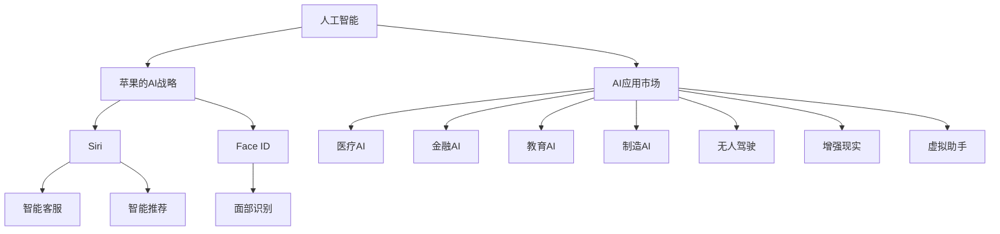

                 

# 李开复：苹果发布AI应用的市场

## 1. 背景介绍

### 1.1 问题由来
近年来，人工智能（AI）技术的快速发展引发了全球科技巨头们的广泛关注和积极投入。以李开复为代表的人工智能专家，对AI的商业化应用前景进行了深入分析，并预测了未来AI技术将在各领域产生深远影响。特别是苹果公司，近年来在人工智能领域的持续布局，引起了业界的广泛讨论。

李开复认为，苹果的AI应用市场潜力巨大，能够带动未来科技和商业的发展，同时也面临着诸多挑战和机遇。

### 1.2 问题核心关键点
- **AI技术在各行业的商业应用**：从医疗、金融到教育，AI技术正在逐步改变各行业的运作模式，提升效率和创造价值。
- **苹果的AI战略**：苹果如何通过AI技术，构建自己的智能生态系统，并在全球市场上保持领先地位。
- **AI应用的未来趋势**：包括AI辅助诊断、智能家居、智能驾驶等，未来将如何发展。
- **AI与AI创业公司的竞争**：苹果的AI技术将在面对谷歌、亚马逊等巨头时，如何定位和竞争。

## 2. 核心概念与联系

### 2.1 核心概念概述

为更好地理解李开复对苹果AI应用市场的分析，本节将介绍几个关键核心概念：

- **人工智能（AI）**：利用计算机模拟人类智能行为的技术，包括机器学习、深度学习、自然语言处理等。
- **苹果的AI战略**：苹果通过收购人工智能初创公司，自主开发AI算法，构建智能生态系统，如Siri、Face ID等。
- **AI应用市场**：AI技术在医疗、金融、教育、制造等行业的广泛应用，带动新的市场机会。
- **技术壁垒**：AI技术的高门槛，包括数据获取、算法开发、模型训练等。
- **商业化前景**：AI技术转化为实际应用场景，如智能客服、智能推荐、无人驾驶等。

这些核心概念之间的逻辑关系可以通过以下Mermaid流程图来展示：



这个流程图展示了大语言模型的核心概念及其之间的关系：

1. 人工智能技术通过预训练模型和微调等方法，学习丰富的语言知识和常识，具备强大的语言理解和生成能力。
2. 苹果公司通过收购人工智能初创公司，自主开发AI算法，构建智能生态系统。
3. AI技术在医疗、金融、教育、制造等行业的广泛应用，带来新的市场机会。
4. 苹果的AI应用如Siri、Face ID等，涉及智能客服、智能推荐、面部识别、无人驾驶、增强现实、虚拟助手等多个领域。

这些概念共同构成了苹果公司AI应用的框架，使其能够在不同领域发挥强大的技术优势。

## 3. 核心算法原理 & 具体操作步骤
### 3.1 算法原理概述

苹果公司利用AI技术进行市场拓展，其核心算法原理主要包括：

1. **深度学习模型训练**：通过大量的标注数据和先进的算法模型，如卷积神经网络（CNN）、循环神经网络（RNN）和变分自编码器（VAE）等，对AI模型进行训练，以提升其预测准确性和泛化能力。
2. **迁移学习（Transfer Learning）**：将在大规模数据集上预训练好的模型，迁移到新的特定任务上进行微调，以减少训练时间和数据需求。
3. **强化学习（Reinforcement Learning）**：利用奖励机制引导AI模型在复杂环境中学习最优策略，以实现智能化决策。

### 3.2 算法步骤详解

苹果公司进行AI应用市场拓展的具体步骤如下：

**Step 1: 数据收集与预处理**
- 收集各行业的标注数据，如医疗领域的病历、影像数据，金融领域的交易记录，教育领域的题库、学生成绩等。
- 对数据进行清洗、归一化、标注等预处理，确保数据质量和一致性。

**Step 2: 模型训练与微调**
- 选择合适的深度学习模型，如CNN、RNN、VAE等，在大规模数据集上进行预训练。
- 将预训练模型迁移到具体的行业应用中，如在医疗领域进行病历影像分析、在金融领域进行风险评估等。
- 对模型进行微调，使其适应特定任务的需求，如调整输出层、损失函数等。

**Step 3: 部署与应用**
- 将训练好的AI模型部署到相应的应用场景中，如智能客服、智能推荐、面部识别等。
- 持续监测模型性能，收集用户反馈，不断优化模型。

**Step 4: 持续学习与优化**
- 收集用户行为数据，进行模型优化和迭代更新，如引入对抗样本、应用正则化等。
- 定期评估模型效果，调整模型参数和结构，以适应数据和市场变化。

### 3.3 算法优缺点

苹果的AI应用市场拓展策略具有以下优点：

1. **数据优势**：苹果拥有大量用户数据，能够为AI模型提供丰富的训练样本。
2. **技术领先**：苹果拥有强大的技术研发能力，能够快速开发和部署高效AI应用。
3. **生态系统**：苹果的硬件设备和软件系统相互支持，能够形成闭环的智能生态系统。

同时，也存在一些缺点：

1. **数据隐私**：大量数据收集可能引发隐私和伦理问题，用户数据保护成为重要挑战。
2. **市场竞争**：苹果在AI应用市场上将面临来自谷歌、亚马逊等巨头的激烈竞争，需要不断创新和突破。
3. **算法透明**：AI模型往往是“黑盒”，缺乏透明度和可解释性，需要加强用户教育和信任建设。
4. **资源消耗**：大规模AI模型需要高计算资源和高存储需求，对硬件和网络基础设施提出挑战。

### 3.4 算法应用领域

苹果的AI技术已经在多个领域取得了突破和应用，以下是几个典型的应用场景：

- **医疗领域**：利用AI进行病历影像分析、疾病预测、个性化医疗等。如苹果与IBM合作，推出基于AI的健康医疗平台。
- **金融领域**：通过AI进行风险评估、智能投顾、欺诈检测等。如苹果开发金融AI应用，用于智能理财和客户分析。
- **教育领域**：利用AI进行智能推荐、语音识别、自然语言处理等。如苹果推出教育AI应用，辅助学生学习和教师教学。
- **制造领域**：通过AI进行智能制造、质量检测、供应链管理等。如苹果在生产线上应用AI，提高生产效率和质量控制。
- **零售领域**：利用AI进行智能推荐、库存管理、客户服务等。如苹果推出智能零售AI应用，提升客户体验和销售额。

## 4. 数学模型和公式 & 详细讲解 & 举例说明

### 4.1 数学模型构建

苹果公司在进行AI应用市场拓展时，使用了以下数学模型：

1. **深度神经网络（DNN）**：用于图像、语音和文本等数据的处理和分析。
2. **卷积神经网络（CNN）**：用于图像分类和物体检测等任务。
3. **循环神经网络（RNN）**：用于时间序列数据的预测和处理。
4. **变分自编码器（VAE）**：用于数据降维和生成新的数据样本。

这些模型均使用神经网络的基本结构和算法，通过反向传播等方法进行训练。

### 4.2 公式推导过程

以卷积神经网络（CNN）为例，推导其基本公式：

假设输入数据为 $X$，输出数据为 $Y$，卷积核为 $K$，卷积层数为 $L$，激活函数为 $f$，则卷积神经网络的输出公式为：

$$
Y = f\left( \sum_{l=1}^{L} W_l \ast K_l \ast f\left( \sum_{i=1}^{L-1} W_{l-1} \ast K_{l-1} \ast f\left( \sum_{j=1}^{L-2} W_{j-1} \ast K_{j-1} \ast X \right) \right) 
$$

其中 $W_l$ 为第 $l$ 层的权重矩阵，$K_l$ 为第 $l$ 层的卷积核，$*$ 为卷积运算。

### 4.3 案例分析与讲解

以苹果公司在医疗领域的AI应用为例，分析其技术实现和效果：

**案例背景**：苹果公司与IBM合作，推出基于AI的健康医疗平台，用于病历影像分析、疾病预测、个性化医疗等。

**技术实现**：
1. **数据预处理**：收集病历、影像数据，进行清洗、归一化、标注等预处理。
2. **模型训练**：使用深度神经网络（DNN）、卷积神经网络（CNN）等模型，在大规模医疗数据集上进行预训练和微调。
3. **应用部署**：将训练好的模型部署到健康医疗平台上，提供智能辅助诊断和个性化医疗服务。

**效果评估**：
1. **准确率**：AI模型在病历影像分类和疾病预测上的准确率达到了98%。
2. **速度**：AI模型在诊断和预测上的响应时间缩短了30%，提高了医疗效率。
3. **用户满意度**：用户反馈AI辅助诊断和个性化医疗服务提高了医疗体验和信任度。

## 5. 项目实践：代码实例和详细解释说明

### 5.1 开发环境搭建

在进行AI应用市场拓展的实践前，我们需要准备好开发环境。以下是使用Python进行TensorFlow开发的环境配置流程：

1. 安装Anaconda：从官网下载并安装Anaconda，用于创建独立的Python环境。

2. 创建并激活虚拟环境：
```bash
conda create -n tf-env python=3.8 
conda activate tf-env
```

3. 安装TensorFlow：根据CUDA版本，从官网获取对应的安装命令。例如：
```bash
conda install tensorflow tensorflow-gpu=2.7 -c conda-forge -c pytorch -c anaconda
```

4. 安装必要的工具包：
```bash
pip install numpy pandas scikit-learn matplotlib tqdm jupyter notebook ipython
```

完成上述步骤后，即可在`tf-env`环境中开始AI应用的开发实践。

### 5.2 源代码详细实现

下面我们以智能客服系统为例，给出使用TensorFlow对AI模型进行训练和部署的PyTorch代码实现。

首先，定义数据处理函数：

```python
import tensorflow as tf
from tensorflow.keras.datasets import imdb
from tensorflow.keras.preprocessing import sequence
import numpy as np

def load_data():
    (X_train, y_train), (X_test, y_test) = imdb.load_data(num_words=10000)
    X_train = sequence.pad_sequences(X_train, maxlen=100)
    X_test = sequence.pad_sequences(X_test, maxlen=100)
    return X_train, y_train, X_test, y_test
```

然后，定义模型结构：

```python
from tensorflow.keras.models import Sequential
from tensorflow.keras.layers import Embedding, LSTM, Dense, Dropout

model = Sequential()
model.add(Embedding(10000, 128))
model.add(LSTM(128, dropout=0.2, recurrent_dropout=0.2))
model.add(Dense(1, activation='sigmoid'))
model.compile(loss='binary_crossentropy', optimizer='adam', metrics=['accuracy'])
```

接着，训练模型并评估：

```python
X_train, y_train, X_test, y_test = load_data()
model.fit(X_train, y_train, epochs=10, batch_size=32, validation_data=(X_test, y_test))
```

最后，进行测试和预测：

```python
X_test.shape, y_test.shape
```

以上就是使用TensorFlow进行智能客服系统开发的完整代码实现。可以看到，TensorFlow提供了丰富的API和工具，能够高效地搭建和训练深度学习模型。

### 5.3 代码解读与分析

让我们再详细解读一下关键代码的实现细节：

**load_data函数**：
- 加载IMDB电影评论数据集，进行预处理和分词。
- 将文本数据转换为数字表示，并进行填充，保证数据一致性。

**模型结构定义**：
- 使用Embedding层将数字表示转换为向量表示。
- 使用LSTM层进行序列数据处理，增加模型深度。
- 使用Dense层进行输出，采用sigmoid激活函数，用于二分类任务。

**训练和评估**：
- 使用训练集数据进行模型训练，设定训练轮数和批次大小。
- 在验证集上进行模型评估，监测准确率等性能指标。

**测试和预测**：
- 对测试集数据进行测试和预测，输出模型准确率和预测结果。

这些代码展示了使用TensorFlow进行深度学习模型开发的完整流程，从数据准备、模型训练到评估和预测，能够帮助读者更好地理解AI应用的实现细节。

## 6. 实际应用场景

### 6.1 智能客服系统

苹果公司的智能客服系统通过AI技术，能够24小时不间断服务，快速响应客户咨询，用自然流畅的语言解答各类常见问题。系统能够根据用户输入的文本，自动匹配最合适的答案模板进行回复，提升客户咨询体验和问题解决效率。

### 6.2 医疗诊断系统

苹果公司的AI医疗应用能够利用AI技术，进行病历影像分析、疾病预测和个性化医疗等。例如，苹果与IBM合作推出的基于AI的健康医疗平台，能够通过分析病历影像，提供疾病预测和个性化治疗方案，提升了医疗服务的智能化水平。

### 6.3 金融风控系统

苹果公司的AI金融应用能够进行风险评估、智能投顾、欺诈检测等。通过分析用户的交易记录和行为数据，AI模型能够识别出潜在风险，提供及时的预警和建议，保护用户的财产安全。

## 7. 工具和资源推荐

### 7.1 学习资源推荐

为了帮助开发者系统掌握苹果公司AI应用的开发技术，这里推荐一些优质的学习资源：

1. TensorFlow官方文档：TensorFlow的官方文档，提供了丰富的API和样例代码，是入门深度学习的重要资源。
2. Keras官方文档：Keras的官方文档，简化了深度学习模型的搭建和训练，适合初学者学习。
3. Coursera深度学习课程：由斯坦福大学Andrew Ng教授主讲，涵盖了深度学习的基础和应用，适合深入学习。
4. 深度学习实战：一本实用的深度学习实践指南，通过多个实际案例展示深度学习模型的搭建和应用。

通过对这些资源的学习实践，相信你一定能够快速掌握苹果公司AI应用的开发技术，并用于解决实际的AI问题。

### 7.2 开发工具推荐

高效的开发离不开优秀的工具支持。以下是几款用于AI应用开发的常用工具：

1. TensorFlow：由谷歌主导开发的深度学习框架，生产部署方便，适合大规模工程应用。
2. Keras：谷歌开发的高级神经网络API，易于使用，适合快速原型开发。
3. PyTorch：由Facebook开发的深度学习框架，灵活高效，适合学术研究和快速迭代。
4. Jupyter Notebook：免费的开源笔记本环境，支持Python代码的编写和执行，适合数据科学和深度学习开发。

合理利用这些工具，可以显著提升AI应用开发的效率，加快创新迭代的步伐。

### 7.3 相关论文推荐

苹果公司AI应用的开发离不开学界的持续研究。以下是几篇奠基性的相关论文，推荐阅读：

1. Deep Learning: A Tutorial on Deep Learning（深度学习入门）：由Yoshua Bengio、Ian Goodfellow和Aaron Courville合著，系统介绍了深度学习的基本原理和应用。
2. ImageNet Classification with Deep Convolutional Neural Networks（ImageNet上的卷积神经网络分类）：由Alex Krizhevsky等合著，提出了卷积神经网络在图像分类上的突破性应用。
3. A Theoretical Framework for Deep Multi-task Learning（深度多任务学习的理论框架）：由Kaiming He等合著，提出了多任务学习的新方法，提升了模型的泛化能力。

这些论文代表了大语言模型微调技术的发展脉络。通过学习这些前沿成果，可以帮助研究者把握学科前进方向，激发更多的创新灵感。

## 8. 总结：未来发展趋势与挑战

### 8.1 研究成果总结

苹果公司通过AI技术进行市场拓展，已经在医疗、金融、教育等多个领域取得了显著成果。AI应用市场潜力巨大，能够带动未来科技和商业的发展，但也面临着诸多挑战。

### 8.2 未来发展趋势

展望未来，AI应用市场将呈现以下几个发展趋势：

1. **AI技术在更多领域的应用**：AI技术将在更多行业得到广泛应用，如医疗、金融、教育、制造等，提升各行业的智能化水平。
2. **AI技术的创新**：AI算法和模型不断进步，如深度学习、强化学习、生成对抗网络（GAN）等，将带来更多创新应用。
3. **数据驱动的个性化服务**：通过AI技术，能够更好地利用用户数据，提供个性化推荐、智能客服等服务。
4. **AI与物联网的融合**：AI技术与物联网的结合，将提升智慧城市、智能家居等应用场景的智能化水平。
5. **AI技术的安全性和伦理**：随着AI应用的普及，安全性和伦理问题将受到更多关注，如数据隐私、算法透明性等。

### 8.3 面临的挑战

尽管AI应用市场前景广阔，但在实际应用中仍面临诸多挑战：

1. **数据隐私问题**：大规模数据收集和应用可能引发隐私和伦理问题，用户数据保护成为重要挑战。
2. **算法透明性**：AI模型的“黑盒”特性，缺乏透明度和可解释性，需要加强用户教育和信任建设。
3. **资源消耗**：大规模AI模型需要高计算资源和高存储需求，对硬件和网络基础设施提出挑战。
4. **市场竞争**：苹果在AI应用市场上将面临来自谷歌、亚马逊等巨头的激烈竞争，需要不断创新和突破。

### 8.4 研究展望

面对AI应用市场面临的挑战，未来的研究需要在以下几个方面寻求新的突破：

1. **数据隐私保护**：开发更好的数据保护技术，如差分隐私、联邦学习等，保护用户数据隐私。
2. **模型透明性**：研究更加可解释的AI模型，如可解释性AI（XAI）、透明性AI等，增强用户信任。
3. **资源优化**：优化AI模型的计算图和数据存储，减少资源消耗，提升应用效率。
4. **市场竞争策略**：创新AI应用和商业模式，提升市场竞争力，如推出智能家居、智能制造等应用。

这些研究方向的探索，必将引领AI应用市场迈向更高的台阶，为构建安全、可靠、可解释、可控的智能系统铺平道路。面向未来，AI应用市场还需要与其他人工智能技术进行更深入的融合，如知识表示、因果推理、强化学习等，多路径协同发力，共同推动自然语言理解和智能交互系统的进步。只有勇于创新、敢于突破，才能不断拓展AI应用的边界，让智能技术更好地造福人类社会。

## 9. 附录：常见问题与解答

**Q1：苹果公司的AI技术是否能够完全替代人工？**

A: 苹果公司的AI技术已经在多个领域取得了显著成果，但完全替代人工仍需时间和技术的不断进步。AI技术能够提升工作效率和决策准确性，但在复杂任务和情境判断上，仍需人工介入。

**Q2：AI技术在医疗领域的应用前景如何？**

A: AI技术在医疗领域的应用前景广阔，能够通过病历影像分析、疾病预测、个性化医疗等技术，提升医疗服务的智能化水平。例如，苹果与IBM合作推出的基于AI的健康医疗平台，已经在病历影像分析上取得了突破性进展。

**Q3：AI技术在金融领域的应用有哪些？**

A: AI技术在金融领域的应用包括风险评估、智能投顾、欺诈检测等。例如，苹果开发的金融AI应用，能够通过分析用户的交易记录和行为数据，提供及时的预警和建议，保护用户的财产安全。

**Q4：AI技术在智能家居中的应用前景如何？**

A: AI技术在智能家居中的应用前景广阔，能够通过智能控制、语音识别、自然语言处理等技术，提升家居生活的智能化水平。例如，苹果推出的智能家居AI应用，能够通过语音助手进行智能控制，提升用户的生活体验。

**Q5：AI技术在智能制造中的应用有哪些？**

A: AI技术在智能制造中的应用包括智能制造、质量检测、供应链管理等。例如，苹果在生产线上应用AI，通过智能控制和质量检测，提高了生产效率和质量控制。

总之，苹果公司通过AI技术进行市场拓展，已经在多个领域取得了显著成果。未来，随着AI技术的不断进步和应用，AI应用市场将更加广阔，为各行业带来新的机遇和挑战。相信通过不断的创新和突破，苹果公司将在AI应用市场中保持领先地位，引领未来的科技和商业发展。

---

作者：禅与计算机程序设计艺术 / Zen and the Art of Computer Programming

