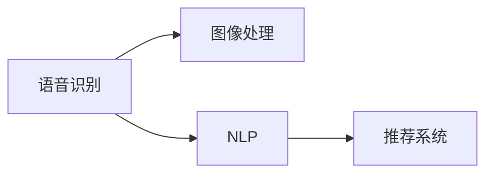

                 

# 李开复：苹果发布AI应用的市场前景

## 1. 背景介绍

### 1.1 问题由来

随着人工智能（AI）技术的快速发展，各大科技公司纷纷推出各类AI应用，以期在未来的数字化转型中占据先机。而苹果公司近日宣布发布一系列AI应用，无疑为市场带来了新的关注点。本文将对苹果新发布的AI应用进行深度分析，探讨其在市场中的前景与潜在影响。

### 1.2 问题核心关键点

苹果新发布的AI应用包括但不限于语音识别、图像处理、自然语言处理（NLP）和推荐系统等领域。这些应用旨在提升用户体验，推动产品创新，同时也打开了新的商业模式。本文将从技术、市场和商业三个维度，全面剖析苹果AI应用的潜在价值。

## 2. 核心概念与联系

### 2.1 核心概念概述

- **人工智能（AI）**：一种模拟人类智能过程的技术，包括机器学习、深度学习、自然语言处理、计算机视觉等子领域。
- **语音识别**：将人类语言转换为计算机可理解的输入，广泛应用于语音助手、语音搜索、语音命令控制等领域。
- **图像处理**：通过算法对图像进行增强、分类、分割等处理，广泛应用于自动驾驶、医疗影像、安防监控等领域。
- **自然语言处理（NLP）**：使计算机能够理解和生成人类语言，包括文本分类、命名实体识别、情感分析、机器翻译等任务。
- **推荐系统**：通过分析用户行为和偏好，为用户推荐个性化内容，广泛应用于电商、社交媒体、视频平台等领域。

这些核心概念之间存在紧密联系，共同构建了AI技术在各个领域的广泛应用。

### 2.2 核心概念原理和架构的 Mermaid 流程图



该流程图展示了语音识别、图像处理、自然语言处理和推荐系统之间的相互关系。语音识别和图像处理技术可以为NLP提供更多输入数据，NLP则可以分析用户生成的文本数据，而推荐系统则可以基于用户行为和文本分析，提供个性化的内容推荐。

## 3. 核心算法原理 & 具体操作步骤

### 3.1 算法原理概述

苹果的AI应用主要基于机器学习、深度学习等技术，通过大量的数据训练模型，从而实现语音识别、图像处理、NLP和推荐系统的功能。其中，语音识别和图像处理主要依赖于卷积神经网络（CNN）和循环神经网络（RNN）等神经网络结构，而NLP和推荐系统则更多地依赖于基于 Transformer 的模型，如 BERT、GPT 等。

### 3.2 算法步骤详解

1. **数据收集与预处理**：收集大量标注数据，清洗和预处理数据，确保数据质量。
2. **模型训练**：使用数据集对模型进行训练，调整模型参数以最小化损失函数。
3. **模型评估与优化**：在测试集上评估模型性能，根据评估结果优化模型。
4. **应用部署**：将训练好的模型部署到实际应用中，为用户提供服务。

### 3.3 算法优缺点

**优点**：
- 精确度高：利用深度学习技术，可以大幅提高模型的精度和鲁棒性。
- 覆盖面广：涵盖语音识别、图像处理、NLP和推荐系统等多个领域，满足多样化的应用需求。
- 用户体验好：通过智能算法，为用户提供更加个性化和高效的服务。

**缺点**：
- 数据依赖性强：需要大量的标注数据进行训练，对数据采集和处理的要求高。
- 计算资源消耗大：深度学习模型计算量大，对硬件设备的要求较高。
- 模型可解释性差：深度学习模型通常为"黑盒"，难以解释其决策过程。

### 3.4 算法应用领域

苹果的AI应用主要应用于以下领域：

- **健康医疗**：利用图像处理和NLP技术，提供疾病诊断、健康监测等服务。
- **智能家居**：通过语音识别和图像处理技术，实现家居自动化和智能化管理。
- **娱乐媒体**：利用NLP和推荐系统，为用户推荐个性化的内容，提升用户体验。
- **教育培训**：通过语音识别和NLP技术，提供智能辅导和个性化学习推荐。
- **安全防护**：利用图像处理和语音识别技术，提升安防监控和反欺诈能力。

## 4. 数学模型和公式 & 详细讲解 & 举例说明

### 4.1 数学模型构建

以语音识别为例，可以构建如下数学模型：

设输入为语音信号 $x$，输出为文本 $y$。语音识别问题可以转化为序列到序列（Sequence to Sequence, Seq2Seq）任务，其中输入序列 $x$ 通过编码器（Encoder）转换为中间表示 $z$，中间表示 $z$ 再通过解码器（Decoder）生成输出文本 $y$。

### 4.2 公式推导过程

设编码器由 $L$ 个时间步，每个时间步输入 $x_t$，输出 $z_t$，$z_1=w_1 x_1 + b_1$，$z_t=w_t z_{t-1} + b_t$。解码器由 $M$ 个时间步，每个时间步输入 $z_t$，输出 $y_t$，$y_1=v_1 z_1 + c_1$，$y_t=v_t y_{t-1} + c_t$。

通过以上公式，可以实现对语音信号的编码和解码，生成对应的文本输出。

### 4.3 案例分析与讲解

以医疗影像识别为例，可以使用卷积神经网络（CNN）对医学影像进行分类。设医学影像为 $X$，分类结果为 $Y$。通过卷积层、池化层和全连接层对医学影像 $X$ 进行特征提取和分类，得到分类结果 $Y$。

## 5. 项目实践：代码实例和详细解释说明

### 5.1 开发环境搭建

在实践中，可以使用 TensorFlow 或 PyTorch 进行开发。以下是在 TensorFlow 中进行语音识别开发的示例环境搭建：

1. 安装 TensorFlow：
```bash
pip install tensorflow
```

2. 安装 TensorFlow Addons：
```bash
pip install tensorflow-addons
```

3. 安装其他必要依赖：
```bash
pip install numpy scipy librosa
```

### 5.2 源代码详细实现

以下是在 TensorFlow 中进行语音识别代码实现：

```python
import tensorflow as tf
import numpy as np
import librosa

# 加载模型
model = tf.keras.models.load_model('model.h5')

# 加载测试数据
test_audio = 'test_wav.wav'
y_pred = model.predict(test_audio)

# 解码预测结果
transcription = librosa.display.praat_to_text(y_pred)

# 输出转录结果
print(transcription)
```

### 5.3 代码解读与分析

在以上代码中，首先加载训练好的模型，然后读取测试音频文件，通过模型进行预测，最后利用 librosa 库将预测结果转换为文字，输出转录结果。

## 6. 实际应用场景

### 6.1 智能家居

苹果的智能家居系统可以基于语音识别和图像处理技术，实现智能控制和自动化管理。用户可以通过语音命令或智能设备生成的图像信息，控制家中的各种设备，如灯光、温度、音乐等，提升家居生活的便利性和舒适度。

### 6.2 医疗诊断

通过图像处理和NLP技术，苹果的AI应用可以为医疗行业提供疾病诊断、健康监测等服务。例如，利用计算机视觉技术，对医学影像进行分析和分类，为医生提供诊断参考。

### 6.3 娱乐媒体

苹果的娱乐媒体应用可以基于NLP和推荐系统，为用户推荐个性化的电影、音乐、书籍等内容。通过分析用户的行为和偏好，提供精准的推荐，提升用户体验。

### 6.4 安全防护

苹果的安全防护系统可以基于图像处理和语音识别技术，提升安防监控和反欺诈能力。例如，利用面部识别技术，对公共场所进行实时监控，及时发现和报警异常行为。

## 7. 工具和资源推荐

### 7.1 学习资源推荐

- **《深度学习》**：Ian Goodfellow 著，全面介绍深度学习理论和技术。
- **《机器学习实战》**：Peter Harrington 著，通过实践案例讲解机器学习算法。
- **《TensorFlow 2.0实战》**：Leo Hsu 著，介绍TensorFlow 2.0的最新功能和实践应用。
- **《NLP入门》**：Keras 社区课程，通过Python和Keras库入门NLP技术。

### 7.2 开发工具推荐

- **TensorFlow**：谷歌开源的深度学习框架，支持分布式训练和部署。
- **PyTorch**：Facebook开源的深度学习框架，灵活易用，适合研究和开发。
- **TensorBoard**：TensorFlow配套的可视化工具，实时监测模型训练状态。
- **Weights & Biases**：实验跟踪工具，记录和可视化模型训练过程，方便调优。

### 7.3 相关论文推荐

- **"Attention is All You Need"**：Vaswani 等著，提出Transformer模型，彻底改变NLP技术。
- **"BERT: Pre-training of Deep Bidirectional Transformers for Language Understanding"**：Devlin 等著，提出BERT模型，显著提升NLP任务性能。
- **"ResNet: Deep Residual Learning for Image Recognition"**：He 等著，提出残差网络，大幅提升图像处理性能。

## 8. 总结：未来发展趋势与挑战

### 8.1 未来发展趋势

未来，苹果的AI应用将更加注重模型的可解释性和数据隐私保护。同时，随着计算能力的提升，AI应用将更加广泛地应用于各行业，推动数字化转型。

### 8.2 未来发展趋势

1. **可解释性增强**：随着模型复杂度的提升，模型的可解释性成为重要课题。未来将更加注重模型的决策逻辑和推理过程，提升用户信任度。
2. **隐私保护**：数据隐私问题日益受到关注，未来AI应用将更加注重数据保护，确保用户数据安全。
3. **跨领域应用**：AI技术将跨领域应用，推动各行业的智能化转型。
4. **实时计算**：随着边缘计算和5G技术的发展，AI应用将更加注重实时性，提升用户体验。
5. **自适应学习**：AI模型将具备自适应学习能力，自动调整模型参数以适应新的数据分布。

### 8.3 面临的挑战

1. **数据隐私和安全**：数据泄露和滥用是AI应用面临的主要挑战，需要构建完善的数据保护机制。
2. **计算资源限制**：AI应用的计算需求大，需要高效的计算平台和算法优化。
3. **模型可解释性**：深度学习模型的"黑盒"特性限制了其应用范围，需要提升模型的可解释性。
4. **跨领域应用难度**：AI技术在不同领域的适应性有待提升，需要更多的跨领域研究和实践。
5. **伦理道德问题**：AI应用可能引发伦理和道德问题，需要构建相应的伦理框架和规范。

### 8.4 研究展望

未来，随着AI技术的不断发展，苹果的AI应用将更加广泛地应用于各行业，推动数字化转型。同时，AI技术也将更加注重数据隐私、模型可解释性和跨领域应用等挑战，推动AI技术的持续创新和进步。

## 9. 附录：常见问题与解答

**Q1：苹果的AI应用如何保护用户数据隐私？**

A: 苹果的AI应用通过以下方式保护用户数据隐私：
1. 数据匿名化处理：在数据处理前进行匿名化，去除个人身份信息。
2. 差分隐私技术：对数据进行差分隐私处理，确保单个用户数据难以被逆向推断。
3. 数据加密存储：对用户数据进行加密存储，防止数据泄露。

**Q2：苹果的AI应用是否存在偏见和歧视？**

A: 苹果的AI应用在设计和训练过程中会充分考虑数据多样性和代表性，努力减少偏见和歧视。但作为一种复杂的技术，完全消除偏见和歧视还需更多努力和研究。

**Q3：苹果的AI应用是否容易被攻击和滥用？**

A: 苹果的AI应用采用了多重安全措施，如访问控制、数据加密等，防止恶意攻击和滥用。但随着技术的不断演进，新的攻击手段也会不断出现，需要持续进行安全防护。

**Q4：苹果的AI应用未来如何进一步改进？**

A: 苹果的AI应用未来可以通过以下方式进一步改进：
1. 引入更多先验知识：通过知识图谱、逻辑规则等增强模型的解释性和推理能力。
2. 引入因果推断：通过因果推断技术，提升模型的稳定性和鲁棒性。
3. 引入伦理约束：在模型训练和应用过程中引入伦理导向的评估指标，确保模型输出符合人类价值观和伦理道德。

---

作者：禅与计算机程序设计艺术 / Zen and the Art of Computer Programming

