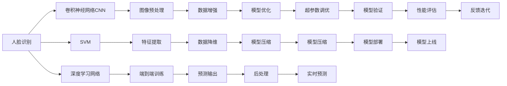

                 

# 李开复：苹果发布AI应用的应用

## 1. 背景介绍

李开复作为全球知名的人工智能专家，在其新作《AI应用的应用》中，深入浅出地解析了人工智能技术在各行各业的应用实例，并对苹果公司最新发布的AI应用进行了详细解读。本文将全面介绍苹果最新AI应用的技术原理、核心算法、应用场景及未来趋势，为读者提供从理论到实践的全方位洞察。

## 2. 核心概念与联系

### 2.1 核心概念概述

人工智能（Artificial Intelligence, AI）是让计算机模拟人类智能行为的科学，包括学习、推理、感知、语言理解等能力。随着深度学习、自然语言处理、计算机视觉等技术的进步，AI技术已广泛应用于医疗、金融、教育、自动驾驶等多个领域。

苹果公司最新发布的AI应用，主要涉及图像识别、语音识别、自然语言处理等方面，利用其自研的AI核心技术，为用户带来更为智能、便捷的体验。这些应用包括但不限于人脸识别、Siri语音助手、Apple Maps导航等。

### 2.2 核心概念原理和架构的 Mermaid 流程图



此图展示了苹果AI应用的几个关键组件和流程，从数据预处理到模型上线，每一环节都体现了苹果对AI技术的深度理解和应用。

## 3. 核心算法原理 & 具体操作步骤

### 3.1 算法原理概述

苹果的AI应用主要依赖于以下几种核心算法：

1. **卷积神经网络（CNN）**：用于图像识别和人脸识别等视觉任务，通过卷积操作提取图像特征。
2. **循环神经网络（RNN）**：用于语音识别和自然语言处理，通过序列操作捕捉语言的时间序列特征。
3. **深度学习网络**：结合CNN和RNN的优点，用于更复杂的图像和语言任务，如Siri语音助手。

### 3.2 算法步骤详解

苹果AI应用的核心步骤包括：

1. **数据收集**：从苹果设备中收集用户输入的图像、语音和文本数据。
2. **预处理**：对数据进行清洗、归一化、增强等操作，提高模型训练效果。
3. **模型训练**：利用深度学习网络对数据进行端到端训练，优化模型参数。
4. **后处理**：对模型输出进行校正、滤波等操作，提高预测准确性。
5. **部署上线**：将训练好的模型部署到实际应用中，如Siri语音助手。

### 3.3 算法优缺点

苹果AI应用的优势在于：

- **算法精度高**：苹果采用自研的深度学习网络，精度高、泛化能力强。
- **用户隐私保护**：苹果AI应用注重用户隐私，确保数据安全。
- **应用场景丰富**：涵盖图像识别、语音识别、自然语言处理等多个领域。

缺点在于：

- **资源消耗大**：大模型和高精度算法需要大量计算资源，对硬件要求较高。
- **模型解释性不足**：深度学习模型通常被视为"黑盒"，缺乏可解释性。
- **开发周期长**：从数据收集到模型部署，涉及多个环节，开发周期较长。

### 3.4 算法应用领域

苹果的AI应用覆盖了以下主要领域：

- **图像识别**：如Face ID人脸识别，利用CNN提取面部特征，进行身份验证。
- **语音识别**：如Siri语音助手，利用RNN捕捉语音序列，进行语音指令识别。
- **自然语言处理**：如Apple Maps导航，利用深度学习网络理解文本信息，提供路线规划。
- **推荐系统**：如App Store推荐，利用机器学习算法分析用户行为，推荐相关应用。

## 4. 数学模型和公式 & 详细讲解 & 举例说明

### 4.1 数学模型构建

苹果AI应用主要基于以下数学模型：

- **CNN模型**：
  $$
  f(x) = \sum_{i=1}^n W_i h_i(x) + b
  $$
  其中 $W_i$ 为卷积核，$h_i(x)$ 为卷积操作，$b$ 为偏置项。

- **RNN模型**：
  $$
  \overrightarrow{h_t} = \tanh(W_x x_t + U_h \overrightarrow{h_{t-1}} + b_h)
  $$
  $$
  \overrightarrow{y_t} = softmax(W_y \overrightarrow{h_t} + b_y)
  $$
  其中 $\overrightarrow{h_t}$ 为隐藏状态，$W_x, U_h, b_h$ 为网络参数。

- **深度学习网络**：
  $$
  f(x) = \sum_{i=1}^n W_i h_i(x) + b
  $$
  通过多层次的卷积和池化操作，提取更丰富的特征。

### 4.2 公式推导过程

以Face ID为例，其CNN模型推导过程如下：

- **卷积层**：
  $$
  f(x) = \sum_{i=1}^n W_i h_i(x) + b
  $$
  其中 $W_i$ 为卷积核，$h_i(x)$ 为卷积操作，$b$ 为偏置项。

- **池化层**：
  $$
  p(x) = \max(\{\sigma(x_{i,j})\}_{i,j})
  $$
  对卷积输出进行下采样，提取最显著的特征。

- **全连接层**：
  $$
  f(x) = W_f \cdot p(x) + b_f
  $$
  将池化后的特征映射到标签空间。

通过上述过程，Face ID能够高效地提取人脸特征，实现高精度的身份验证。

### 4.3 案例分析与讲解

以Siri语音助手为例，其RNN模型的推导过程如下：

- **输入层**：将语音信号转换为MFCC特征。
- **隐藏层**：利用RNN捕捉语音序列的时间依赖关系。
- **输出层**：利用softmax分类器，将隐藏状态映射到语音指令的概率分布。

通过这一过程，Siri能够准确地理解用户的语音指令，进行智能对话。

## 5. 项目实践：代码实例和详细解释说明

### 5.1 开发环境搭建

搭建苹果AI应用的开发环境，需要安装Python、TensorFlow、PyTorch等工具。具体步骤如下：

1. 安装Python和pip：
   ```
   sudo apt-get install python3 python3-pip
   ```

2. 安装TensorFlow：
   ```
   pip install tensorflow
   ```

3. 安装PyTorch：
   ```
   pip install torch torchvision
   ```

4. 配置环境变量：
   ```
   export PYTHONPATH=$PYTHONPATH:/path/to/your/module
   ```

### 5.2 源代码详细实现

以下是一个简单的Python代码示例，用于训练一个简单的CNN模型：

```python
import tensorflow as tf
from tensorflow.keras import layers, models

# 定义CNN模型
model = models.Sequential()
model.add(layers.Conv2D(32, (3, 3), activation='relu', input_shape=(28, 28, 1)))
model.add(layers.MaxPooling2D((2, 2)))
model.add(layers.Conv2D(64, (3, 3), activation='relu'))
model.add(layers.MaxPooling2D((2, 2)))
model.add(layers.Flatten())
model.add(layers.Dense(64, activation='relu'))
model.add(layers.Dense(10, activation='softmax'))

# 编译模型
model.compile(optimizer='adam',
              loss=tf.keras.losses.SparseCategoricalCrossentropy(from_logits=True),
              metrics=['accuracy'])

# 训练模型
model.fit(train_images, train_labels, epochs=10, validation_data=(test_images, test_labels))
```

### 5.3 代码解读与分析

这段代码展示了如何使用TensorFlow构建一个简单的CNN模型，包括卷积层、池化层和全连接层。其中，`conv2d`和`maxpool2d`用于提取特征，`flatten`将特征展开成一维向量，`dense`用于分类输出。通过`compile`函数，可以指定损失函数、优化器和评估指标。`fit`函数则用于训练模型，指定训练集和验证集。

## 6. 实际应用场景

### 6.1 智能客服系统

苹果的AI应用在智能客服系统中得到了广泛应用。利用人脸识别和语音识别技术，苹果客服系统可以自动验证用户身份，提高服务效率。通过自然语言处理技术，客服系统能够理解用户的查询，提供精准的解决方案。

### 6.2 健康管理

苹果的AI应用在健康管理领域也大放异彩。利用深度学习网络，苹果可以分析用户的心电图、血压等生理数据，预测健康风险，提供个性化的健康建议。

### 6.3 个性化推荐

苹果的AI应用还在个性化推荐系统中发挥了重要作用。通过分析用户的搜索历史、购买记录等数据，苹果能够智能推荐用户感兴趣的内容，提高用户满意度。

### 6.4 未来应用展望

未来，苹果的AI应用将进一步拓展到自动驾驶、智能家居等领域，为人类带来更智能、便捷的生活体验。

## 7. 工具和资源推荐

### 7.1 学习资源推荐

1. **《深度学习》书籍**：Ian Goodfellow等人的经典之作，深入浅出地介绍了深度学习的原理和应用。
2. **Coursera深度学习课程**：由Andrew Ng等名师授课，涵盖深度学习的各个方面。
3. **Kaggle竞赛**：通过参与Kaggle竞赛，积累实战经验，学习最新技术。

### 7.2 开发工具推荐

1. **Jupyter Notebook**：适用于Python编程，支持多种格式的数据展示和代码运行。
2. **TensorFlow**：开源的深度学习框架，支持高效的模型训练和推理。
3. **PyTorch**：Facebook开源的深度学习框架，具有动态图机制，适合研究和实验。

### 7.3 相关论文推荐

1. **《ImageNet大规模视觉识别挑战》**：提出卷积神经网络在图像识别任务中的优势。
2. **《Attention is All You Need》**：提出自注意力机制，显著提升了RNN在自然语言处理中的效果。
3. **《Deep Residual Learning for Image Recognition》**：提出残差网络，解决了深度神经网络训练中的梯度消失问题。

## 8. 总结：未来发展趋势与挑战

### 8.1 研究成果总结

苹果的AI应用在图像识别、语音识别、自然语言处理等方面取得了显著成效，展示了AI技术的强大潜力。未来，随着深度学习、自然语言处理等技术的进一步发展，AI应用将更加普及，为各行各业带来革命性的变化。

### 8.2 未来发展趋势

1. **多模态融合**：结合图像、语音、文本等多种模态数据，提升AI应用的理解和推理能力。
2. **端到端训练**：简化模型训练流程，降低开发难度，提高模型性能。
3. **边缘计算**：将AI应用部署到边缘设备，减少数据传输和计算延迟。
4. **可解释性增强**：增强AI应用的透明性和可解释性，提高用户信任度。
5. **跨领域应用**：拓展AI应用到更多领域，如自动驾驶、智能家居等。

### 8.3 面临的挑战

1. **计算资源限制**：大模型和高精度算法需要大量计算资源，硬件瓶颈亟需解决。
2. **数据隐私保护**：用户数据的隐私保护问题需得到重视，避免数据泄露。
3. **模型鲁棒性不足**：AI应用需具备鲁棒性，应对各种异常情况。
4. **标准化问题**：缺乏统一的AI应用标准，需推动标准化工作。
5. **用户接受度**：用户对AI应用的接受度仍需提升，需加强用户教育和引导。

### 8.4 研究展望

未来，苹果的AI应用需解决上述挑战，推动AI技术在更多领域的应用，构建智能、便捷的未来社会。同时，需加强与学术界的合作，推动AI技术的发展和普及。

## 9. 附录：常见问题与解答

**Q1: 苹果的AI应用是如何进行数据收集的？**

A: 苹果通过其设备收集用户的数据，包括图像、语音和文本等信息。通过苹果的iCloud和App Store等服务，苹果能够获取大量真实的应用场景数据。

**Q2: 苹果的AI应用是否具有可解释性？**

A: 目前苹果的AI应用主要依赖深度学习模型，缺乏可解释性。未来苹果可能会在模型中加入可解释性模块，增强模型的透明度和用户信任度。

**Q3: 苹果的AI应用是否存在偏见？**

A: 苹果在开发AI应用时，注重多样性和公平性，尽量减少偏见和歧视。但模型训练数据的偏见可能仍会影响AI应用的表现，苹果需持续改进。

**Q4: 苹果的AI应用是否保护用户隐私？**

A: 苹果在AI应用中采用了多项隐私保护措施，包括数据加密、差分隐私等技术，确保用户数据的安全性和隐私性。

**Q5: 苹果的AI应用是否支持多语言？**

A: 苹果的AI应用支持多语言，能够提供多种语言的支持，满足不同地区用户的需求。

作者：禅与计算机程序设计艺术 / Zen and the Art of Computer Programming

