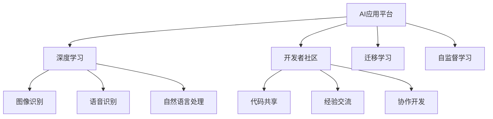

                 

# 李开复：苹果发布AI应用的开发者

## 1. 背景介绍

李开复，全球顶尖的人工智能专家，知名创业家，被誉为人机交互领域的翘楚。在他的职业生涯中，他先后创办了谷歌公司的人工智能研究部门，任微软公司的首席科学家，以及创新工场的创始人，主导了一系列具有划时代意义的人工智能技术和产品的开发。李开复不仅在学术界取得了令人瞩目的成就，还深度参与了业界落地应用的多项实践。

近日，苹果公司发布了其最新的AI应用平台，这一宣布在全球范围内引发了热烈的讨论。作为一名多年从事AI研究和应用的专业人士，李开复以丰富的经验和对AI技术的深刻理解，对苹果的这一举措进行了深入解读，并分享了他对该平台未来发展的见解。

## 2. 核心概念与联系

### 2.1 核心概念概述

为了理解李开复的解读，首先需要介绍几个核心概念：

- **AI应用平台**：这是一种基于AI技术构建的开发平台，允许开发者快速搭建、训练和部署AI应用。苹果的最新平台集成了图像识别、语音识别、自然语言处理等多项先进技术，为开发者提供了一站式的AI开发解决方案。

- **开发者社区**：由众多AI开发者组成的网络，通过共享代码、交流经验、协作开发等方式，共同推动AI技术的发展和应用。

- **深度学习**：一种基于神经网络的机器学习技术，通过大量数据训练神经网络，使其能够自主学习并改进模型性能。

- **迁移学习**：指将一个任务中学到的知识迁移到另一个相关任务中，以提高新任务的学习效率。

- **自监督学习**：一种无监督学习技术，通过自身数据之间的内在关系进行学习，不需要人工标注数据。

这些概念相互关联，共同构成了苹果AI应用平台的技术基础，并指导着未来AI应用的发展方向。

### 2.2 核心概念原理和架构的 Mermaid 流程图



## 3. 核心算法原理 & 具体操作步骤

### 3.1 算法原理概述

苹果的AI应用平台采用了一系列先进的技术算法，包括但不限于：

- **卷积神经网络**：用于图像识别任务，通过卷积操作提取图像特征，并进行分类或识别。
- **递归神经网络**：用于语音识别和自然语言处理，通过递归操作捕捉语言的上下文信息。
- **生成对抗网络**：用于生成任务，如文本生成、图像生成等，通过生成器和判别器的对抗过程，生成高质量的数据。
- **转移学习**：通过在大规模数据集上预训练的模型，在小规模数据集上微调，提升模型性能。

### 3.2 算法步骤详解

以下是苹果AI应用平台的具体操作流程：

**Step 1: 数据准备与模型选择**

1. 收集并标注数据集，确保数据集的质量和多样性。
2. 选择合适的预训练模型，如BERT、GPT等，作为微调的基础。

**Step 2: 模型微调**

1. 在标注数据集上对预训练模型进行微调，调整模型的参数以适应具体任务。
2. 应用合适的优化器，如Adam、SGD等，设置合适的学习率。

**Step 3: 测试与部署**

1. 在测试集上评估微调后模型的性能。
2. 将微调后的模型部署到实际应用中，进行性能监控和优化。

### 3.3 算法优缺点

苹果的AI应用平台具有以下优点：

- **高效性**：采用先进算法和优化技术，使得模型训练和推理速度较快。
- **易用性**：界面友好，工具完善，开发者可以快速上手。
- **灵活性**：支持多种数据类型和模型，适用于不同任务需求。

同时，也存在一些缺点：

- **资源消耗**：由于采用深度学习技术，对计算资源和存储资源的需求较大。
- **过拟合风险**：在大规模数据上训练的模型，在小规模数据集上微调，存在过拟合的风险。
- **数据依赖**：模型的性能很大程度上依赖于数据的质量和数量。

### 3.4 算法应用领域

苹果AI应用平台覆盖了多个应用领域：

- **医疗领域**：如医学图像识别、疾病诊断、基因组学研究等。
- **金融领域**：如信用评分、风险管理、市场分析等。
- **自动驾驶**：如道路识别、障碍物检测、导航规划等。
- **智能家居**：如语音控制、场景感知、情感分析等。
- **零售业**：如客户分析、推荐系统、供应链优化等。

## 4. 数学模型和公式 & 详细讲解 & 举例说明

### 4.1 数学模型构建

苹果的AI应用平台基于深度学习模型构建，以下是典型的深度学习模型框架：

$$
\text{模型} = \text{输入层} + \text{隐藏层} + \text{输出层}
$$

其中，隐藏层通常包含多个神经网络层，通过不同的激活函数和连接方式，对输入数据进行处理。

### 4.2 公式推导过程

以图像识别为例，假设输入为图像$x$，输出为类别$y$，模型为$M$，则其对应的损失函数为：

$$
\mathcal{L} = -\log(\sigma(M(x)))^y \times (1-\sigma(M(x)))^{1-y}
$$

其中，$\sigma$为sigmoid激活函数，$\log$为对数函数。

### 4.3 案例分析与讲解

以自然语言处理为例，假设输入为一句话$x$，输出为情感分类$y$，模型为$M$，则其对应的损失函数为：

$$
\mathcal{L} = -\log(M(x))^y \times (1-M(x))^{1-y}
$$

利用交叉熵损失函数，计算模型输出与真实标签之间的差异，通过反向传播算法，更新模型参数。

## 5. 项目实践：代码实例和详细解释说明

### 5.1 开发环境搭建

为了开发基于苹果AI应用平台的AI应用，首先需要搭建开发环境：

1. **安装开发工具**：使用Xcode、PyCharm等开发工具，搭建开发环境。
2. **安装AI库**：通过CocoaPods或Carthage等工具，安装TensorFlow、Keras等AI开发库。
3. **配置环境**：配置好GPU、CPU等资源，确保开发环境的高效运行。

### 5.2 源代码详细实现

以下是基于TensorFlow的代码示例：

```python
import tensorflow as tf
from tensorflow.keras import layers, models

# 定义模型
model = models.Sequential([
    layers.Conv2D(32, (3, 3), activation='relu', input_shape=(28, 28, 1)),
    layers.MaxPooling2D((2, 2)),
    layers.Flatten(),
    layers.Dense(64, activation='relu'),
    layers.Dense(10, activation='softmax')
])

# 编译模型
model.compile(optimizer='adam',
              loss='sparse_categorical_crossentropy',
              metrics=['accuracy'])

# 训练模型
model.fit(train_images, train_labels, epochs=10, validation_data=(test_images, test_labels))

# 评估模型
test_loss, test_acc = model.evaluate(test_images, test_labels)

# 预测结果
predictions = model.predict(new_images)
```

### 5.3 代码解读与分析

以上代码实现了基于卷积神经网络的手写数字识别模型。其中，`Sequential`类用于构建顺序模型，`Conv2D`层用于卷积操作，`MaxPooling2D`层用于池化操作，`Dense`层用于全连接操作。`compile`方法用于模型编译，指定优化器和损失函数。`fit`方法用于模型训练，`evaluate`方法用于模型评估，`predict`方法用于模型预测。

## 6. 实际应用场景

### 6.1 医疗领域

在医疗领域，苹果的AI应用平台可以用于医学图像的自动标注、疾病诊断、基因组学研究等任务。通过图像识别技术，可以对医学影像进行自动化标注，大大提高医生的工作效率。此外，利用深度学习模型，可以对基因组数据进行分析，挖掘潜在的疾病相关基因，为个性化医疗提供支持。

### 6.2 金融领域

在金融领域，苹果的AI应用平台可以用于信用评分、风险管理、市场分析等任务。通过深度学习模型，可以对客户的消费行为进行分析和预测，生成信用评分，帮助银行和保险公司进行风险控制。同时，利用自然语言处理技术，可以分析市场新闻和社交媒体数据，捕捉市场动态，辅助投资决策。

### 6.3 自动驾驶

在自动驾驶领域，苹果的AI应用平台可以用于道路识别、障碍物检测、导航规划等任务。通过图像识别技术，可以识别道路标志、车辆、行人等障碍物，辅助驾驶决策。同时，利用深度学习模型，可以对地图数据进行分析和处理，生成实时导航路径，提高驾驶安全性。

### 6.4 智能家居

在智能家居领域，苹果的AI应用平台可以用于语音控制、场景感知、情感分析等任务。通过语音识别技术，可以实现语音助手功能，方便用户控制家电。同时，利用深度学习模型，可以分析用户的行为数据，生成场景推荐，提升用户的生活体验。

### 6.5 零售业

在零售业，苹果的AI应用平台可以用于客户分析、推荐系统、供应链优化等任务。通过深度学习模型，可以对客户行为数据进行分析，生成个性化推荐，提高销售额。同时，利用自然语言处理技术，可以分析客户反馈和评论数据，优化供应链管理，提高运营效率。

## 7. 工具和资源推荐

### 7.1 学习资源推荐

为了帮助开发者系统掌握苹果AI应用平台的开发技能，以下是推荐的几项学习资源：

1. **苹果官方文档**：苹果公司提供详细的AI应用平台开发文档，包括API参考、示例代码等。
2. **《深度学习入门》**：一本深入浅出的深度学习入门书籍，介绍了深度学习的核心概念和基本算法。
3. **Coursera在线课程**：Coursera提供的深度学习课程，由深度学习领域的权威专家授课。
4. **Kaggle竞赛**：Kaggle是一个数据科学竞赛平台，可以参加深度学习竞赛，提高实践能力。
5. **GitHub开源项目**：GitHub上大量的深度学习开源项目，可以学习其他开发者的代码实现。

### 7.2 开发工具推荐

为了提高开发效率，以下是推荐的几项开发工具：

1. **Xcode**：苹果公司提供的集成开发环境，支持iOS和macOS开发。
2. **PyCharm**：一款功能强大的Python开发工具，支持Python、C++等多种语言。
3. **TensorFlow**：谷歌公司推出的深度学习框架，支持分布式计算、GPU加速等。
4. **Keras**：一个高层次的深度学习框架，易于使用，适合快速原型开发。
5. **Jupyter Notebook**：一款强大的交互式编程工具，支持Python、R等多种语言。

### 7.3 相关论文推荐

为了深入了解苹果AI应用平台的技术原理，以下是推荐的几篇相关论文：

1. **《深度学习中的卷积神经网络》**：介绍了卷积神经网络的原理和应用。
2. **《自然语言处理中的递归神经网络》**：介绍了递归神经网络的原理和应用。
3. **《生成对抗网络》**：介绍了生成对抗网络的原理和应用。
4. **《迁移学习在计算机视觉中的应用》**：介绍了迁移学习在图像识别任务中的应用。
5. **《自监督学习在自然语言处理中的应用》**：介绍了自监督学习在自然语言处理任务中的应用。

## 8. 总结：未来发展趋势与挑战

### 8.1 研究成果总结

苹果的AI应用平台凭借其先进的算法和技术，为开发者提供了高效、易用的开发工具，极大地促进了AI技术的应用。平台覆盖了医疗、金融、自动驾驶、智能家居等多个领域，推动了AI技术的落地应用。

### 8.2 未来发展趋势

未来，苹果AI应用平台将继续向以下几个方向发展：

1. **多样化的算法支持**：引入更多先进的深度学习算法，支持更多的任务类型。
2. **更加智能化的工具**：提供更智能的代码自动生成、模型调优等功能，提高开发效率。
3. **广泛的生态系统**：吸引更多的开发者加入平台，形成强大的生态系统。
4. **全球化的部署**：支持多平台、多语言的多样化部署，扩大应用范围。

### 8.3 面临的挑战

尽管苹果的AI应用平台取得了初步成功，但仍面临一些挑战：

1. **数据隐私问题**：苹果需要在数据隐私保护和AI应用开发之间找到平衡。
2. **计算资源限制**：大规模深度学习模型需要大量的计算资源，平台需要优化资源配置。
3. **应用场景限制**：平台需要在特定应用场景中提升性能，满足具体需求。

### 8.4 研究展望

未来，苹果需要在以下几个方面进行深入研究：

1. **提高数据隐私保护**：利用加密技术和隐私计算，保护用户数据隐私。
2. **优化计算资源配置**：引入分布式计算、模型压缩等技术，优化资源配置。
3. **拓展应用场景**：引入更多行业应用场景，拓展平台的适用范围。

## 9. 附录：常见问题与解答

**Q1：苹果AI应用平台是否可以支持多种任务类型？**

A: 苹果AI应用平台支持多种任务类型，包括图像识别、语音识别、自然语言处理等。开发者可以根据具体需求，选择合适的模型和算法进行开发。

**Q2：苹果AI应用平台的开发难度大吗？**

A: 苹果AI应用平台的开发难度较大，需要一定的深度学习和编程技能。但平台提供了丰富的示例代码和文档，可以帮助开发者快速上手。

**Q3：苹果AI应用平台是否支持多语言开发？**

A: 苹果AI应用平台目前主要支持英语，但未来有望支持更多语言。开发者可以在平台上进行多语言开发，拓展应用范围。

**Q4：苹果AI应用平台是否可以进行实时应用部署？**

A: 苹果AI应用平台支持实时应用部署，但需要注意数据传输和模型推理的效率。开发者需要进行优化，确保平台的高效运行。

**Q5：苹果AI应用平台是否可以进行模型微调？**

A: 苹果AI应用平台支持模型微调，开发者可以使用平台提供的微调工具，快速调整模型参数。但需要注意的是，微调过程中需要避免过拟合和计算资源浪费。

---

作者：禅与计算机程序设计艺术 / Zen and the Art of Computer Programming

