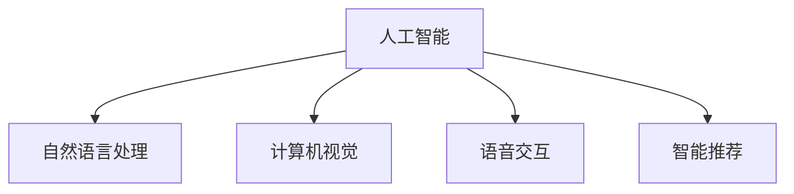

                 

# 李开复：苹果发布AI应用的投资价值

## 1. 背景介绍

### 1.1 问题由来
近年来，人工智能（AI）技术迅猛发展，特别是在计算机视觉、自然语言处理和语音识别等领域的突破，为各行业的数字化转型提供了强有力的技术支撑。特别是深度学习技术的广泛应用，使得AI应用在图像识别、语音交互、智能推荐等方面取得了显著的进展。与此同时，市场对于AI应用的需求也日益增长，吸引了大量投资机构的关注和布局。

在众多AI应用中，苹果公司的AI技术一直备受关注。苹果不仅在iPhone、iPad等产品中广泛应用AI技术，还推出了诸如Face ID、语音助手Siri等颇具代表性的AI应用。这些AI应用不仅提升了用户体验，也展示了苹果在AI领域的领先地位。

近日，苹果公司发布了最新的AI应用战略，宣布将投资数亿美元开发AI应用。这一消息再次引发了市场对于苹果AI应用投资价值的广泛讨论。本文将从核心概念、算法原理、具体操作、实际应用场景以及未来发展趋势等方面，对苹果发布AI应用的投资价值进行详细分析。

### 1.2 问题核心关键点
苹果公司发布的AI应用战略，核心在于通过大规模投资，构建智能生态，提升产品竞争力和用户体验。这一战略将直接影响苹果的业务布局、市场表现和投资回报。

本文将重点探讨以下问题：
- 苹果AI应用的具体投资方向是什么？
- 这些AI应用将如何提升苹果的市场竞争力？
- 苹果AI应用的投资回报预期如何？
- 苹果AI应用面临的主要风险和挑战有哪些？

通过对这些问题进行深入分析，本文将帮助读者全面理解苹果AI应用的投资价值。

## 2. 核心概念与联系

### 2.1 核心概念概述

苹果公司发布的AI应用战略，涉及多个核心概念，主要包括：

- 人工智能（AI）：通过机器学习、深度学习等技术，让计算机具备类似人类的智能行为，能够进行图像识别、自然语言处理、语音识别等任务。
- 自然语言处理（NLP）：使计算机能够理解和处理人类语言的技术。包括语音识别、文本分析、机器翻译等。
- 计算机视觉（CV）：使计算机能够理解图像和视频的技术，包括图像识别、物体检测、场景理解等。
- 语音交互（ASR）：使计算机能够理解和响应用户语音的技术，包括语音识别、语音合成等。
- 智能推荐（Recommendation）：利用用户历史行为数据，推荐用户感兴趣的内容。包括商品推荐、内容推荐等。

这些核心概念之间存在紧密的联系，共同构成了苹果AI应用的基础。以下是一个简化的Mermaid流程图，展示这些概念之间的联系：



## 3. 核心算法原理 & 具体操作步骤
### 3.1 算法原理概述

苹果公司的AI应用开发，主要基于以下算法原理：

1. **深度学习（Deep Learning）**：利用多层神经网络，通过反向传播算法，不断调整网络参数，提升模型的准确性。深度学习已经在图像识别、语音识别、自然语言处理等领域取得了显著进展。
2. **迁移学习（Transfer Learning）**：利用预训练模型在大规模数据上学习到的知识，在特定任务上进行微调，减少训练时间，提高模型性能。迁移学习是苹果AI应用开发的核心技术之一。
3. **强化学习（Reinforcement Learning）**：通过与环境交互，优化策略，提升决策能力。苹果正在探索将强化学习应用于智能推荐和自动驾驶等领域。
4. **生成对抗网络（GAN）**：利用两个神经网络进行对抗训练，生成逼真的图像和视频，应用于内容生成和增强现实等领域。

这些算法原理构成了苹果AI应用开发的基础，通过不断优化和创新，苹果能够在AI技术领域保持领先地位。

### 3.2 算法步骤详解

苹果AI应用的开发主要包括以下几个关键步骤：

**Step 1: 数据收集与预处理**
- 收集来自苹果产品的海量数据，包括用户行为数据、设备传感器数据、用户反馈数据等。
- 对数据进行清洗、标注和预处理，确保数据质量和一致性。

**Step 2: 模型训练与优化**
- 利用深度学习、迁移学习和强化学习等算法，训练预训练模型。
- 在特定任务上进行微调，提升模型在苹果产品中的表现。
- 使用对抗训练、正则化等技术，防止模型过拟合。

**Step 3: 模型集成与应用部署**
- 将训练好的模型集成到苹果产品中，进行实时推理和预测。
- 通过API接口或SDK，将AI应用提供给开发者和用户。
- 持续收集用户反馈和业务数据，优化模型性能。

**Step 4: 监测与优化**
- 实时监测AI应用的性能和用户体验。
- 根据业务需求和市场反馈，优化AI应用的策略和算法。
- 定期更新和升级AI应用，保持技术的领先性。

通过以上步骤，苹果可以不断提升其AI应用的技术水平和市场竞争力。

### 3.3 算法优缺点

苹果公司发布的AI应用战略，具有以下优点：

1. **技术领先**：苹果在AI技术的研发和应用方面处于行业领先地位，拥有强大的技术储备和专利储备。
2. **品牌影响力**：苹果的品牌影响力能够吸引大量用户和开发者，提升AI应用的生态系统。
3. **产品创新**：AI应用能够为苹果产品带来更多的创新点和增值服务，提升用户体验。
4. **市场竞争力**：AI应用能够提升苹果产品的市场竞争力，增强其在智能手机、平板、智能家居等领域的领先地位。

然而，这一战略也面临一些挑战和风险：

1. **技术复杂性**：AI应用开发涉及多种算法和技术，需要高水平的技术团队和丰富的经验。
2. **数据隐私**：苹果收集和处理海量数据，必须严格遵守隐私保护法规，确保数据安全。
3. **市场竞争**：苹果的AI应用需要面对来自其他科技巨头的竞争，如谷歌、亚马逊等，需要不断创新和优化。
4. **用户接受度**：部分用户可能对AI应用存在疑虑，需要不断优化用户体验，提高用户接受度。

### 3.4 算法应用领域

苹果公司发布的AI应用战略，主要应用于以下几个领域：

1. **智能硬件**：如iPhone、iPad、Apple Watch等智能设备中，利用AI技术进行图像识别、语音识别、智能推荐等。
2. **内容服务**：如音乐、视频、图书等数字内容领域，利用AI技术进行个性化推荐、内容生成和版权保护。
3. **自动驾驶**：利用计算机视觉和强化学习技术，开发自动驾驶汽车，提升行车安全和用户体验。
4. **健康医疗**：利用AI技术进行疾病预测、健康监测和个性化医疗，提升用户的健康管理水平。
5. **智能客服**：利用自然语言处理和机器学习技术，开发智能客服系统，提升客户服务体验。

## 4. 数学模型和公式 & 详细讲解  
### 4.1 数学模型构建

苹果公司发布的AI应用，涉及多种数学模型，主要包括：

1. **卷积神经网络（CNN）**：用于图像识别和计算机视觉任务。
2. **循环神经网络（RNN）**：用于自然语言处理和语音识别任务。
3. **深度神经网络（DNN）**：用于大规模数据训练和迁移学习。
4. **强化学习算法**：如Q-learning、策略梯度（Policy Gradient）等。
5. **生成对抗网络（GAN）**：如条件GAN、对抗性GAN等。

以下是一个简单的深度学习模型构建过程，以卷积神经网络为例：

$$
\text{输入} = \begin{bmatrix}
x_1 \\
x_2 \\
x_3 \\
\vdots \\
x_n
\end{bmatrix}
$$

$$
\text{卷积层} = \begin{bmatrix}
W_1 \\
W_2 \\
W_3 \\
\vdots \\
W_n
\end{bmatrix} \times \text{输入}
$$

$$
\text{池化层} = \text{Max Pooling}
$$

$$
\text{全连接层} = \begin{bmatrix}
W_{\text{fc}} \\
b_{\text{fc}}
\end{bmatrix} \times \text{池化层}
$$

$$
\text{输出} = \text{Softmax}(\text{全连接层})
$$

### 4.2 公式推导过程

以卷积神经网络为例，推导其前向传播过程：

$$
\text{输入} = \begin{bmatrix}
x_1 \\
x_2 \\
x_3 \\
\vdots \\
x_n
\end{bmatrix}
$$

$$
\text{卷积层} = \begin{bmatrix}
W_1 \\
W_2 \\
W_3 \\
\vdots \\
W_n
\end{bmatrix} \times \text{输入}
$$

$$
\text{激活函数} = \text{ReLU}
$$

$$
\text{池化层} = \text{Max Pooling}
$$

$$
\text{全连接层} = \begin{bmatrix}
W_{\text{fc}} \\
b_{\text{fc}}
\end{bmatrix} \times \text{池化层}
$$

$$
\text{输出} = \text{Softmax}(\text{全连接层})
$$

### 4.3 案例分析与讲解

以苹果公司发布的智能推荐系统为例，分析其技术实现和效果：

1. **数据收集**：收集用户的历史行为数据，包括浏览记录、购买记录、搜索记录等。
2. **模型训练**：利用深度学习算法训练推荐模型，使用迁移学习技术进行模型微调。
3. **实时推荐**：根据用户当前行为和历史数据，实时生成个性化推荐。
4. **效果评估**：通过A/B测试等方式评估推荐系统的效果，不断优化模型参数。

通过这些技术，苹果的智能推荐系统能够提供高度个性化的推荐内容，提升用户满意度。

## 5. 项目实践：代码实例和详细解释说明
### 5.1 开发环境搭建

要进行AI应用的开发，首先需要搭建开发环境。以下是使用Python和TensorFlow搭建开发环境的流程：

1. 安装Anaconda：从官网下载并安装Anaconda，用于创建独立的Python环境。
2. 创建并激活虚拟环境：
```bash
conda create -n tf-env python=3.8 
conda activate tf-env
```

3. 安装TensorFlow：根据CUDA版本，从官网获取对应的安装命令。例如：
```bash
conda install tensorflow -c pytorch -c conda-forge
```

4. 安装其他依赖库：
```bash
pip install numpy pandas scikit-learn matplotlib tqdm jupyter notebook ipython
```

5. 安装必要的硬件：如GPU/TPU等高性能设备，方便进行深度学习计算。

完成以上步骤后，即可在`tf-env`环境中开始AI应用开发。

### 5.2 源代码详细实现

以下是一个简单的卷积神经网络模型实现，用于图像识别任务：

```python
import tensorflow as tf
from tensorflow.keras import layers

model = tf.keras.Sequential([
    layers.Conv2D(32, (3, 3), activation='relu', input_shape=(28, 28, 1)),
    layers.MaxPooling2D((2, 2)),
    layers.Conv2D(64, (3, 3), activation='relu'),
    layers.MaxPooling2D((2, 2)),
    layers.Flatten(),
    layers.Dense(64, activation='relu'),
    layers.Dense(10, activation='softmax')
])

model.compile(optimizer='adam',
              loss='sparse_categorical_crossentropy',
              metrics=['accuracy'])

model.summary()
```

### 5.3 代码解读与分析

让我们再详细解读一下关键代码的实现细节：

**Sequential模型**：
- 利用`tf.keras.Sequential`定义序列模型，将各层堆叠在一起，形成一个完整的神经网络。

**卷积层和池化层**：
- `layers.Conv2D`定义卷积层，使用`(3, 3)`卷积核大小和`'relu'`激活函数。
- `layers.MaxPooling2D`定义池化层，使用`(2, 2)`池化窗口大小。

**全连接层**：
- `layers.Flatten`将卷积层的输出展平，用于连接全连接层。
- `layers.Dense`定义全连接层，使用`64`个神经元和`'relu'`激活函数。
- `layers.Dense`定义输出层，使用`10`个神经元，`'softmax'`激活函数，用于多分类任务。

**模型编译**：
- `model.compile`设置优化器、损失函数和评估指标。

**模型摘要**：
- `model.summary()`打印模型结构和参数数量。

**训练模型**：
```python
history = model.fit(train_images, train_labels, epochs=10, 
                    validation_data=(test_images, test_labels))
```

以上就是使用TensorFlow进行卷积神经网络模型开发的完整代码实现。可以看到，TensorFlow的高级API使得模型构建和训练过程变得简洁高效。开发者可以更多地关注模型设计和优化，而不必过多关注底层的实现细节。

## 6. 实际应用场景

### 6.1 智能硬件

苹果公司发布的AI应用，在智能硬件领域的应用主要体现在以下几个方面：

1. **Face ID**：利用深度学习技术，进行人脸识别和验证，提升设备的安全性和用户体验。
2. **Siri**：利用自然语言处理和语音识别技术，实现语音交互和智能助理功能。
3. **智能推荐**：利用AI技术，提供个性化推荐内容，提升用户体验。

### 6.2 内容服务

苹果公司发布的AI应用，在内容服务领域的应用主要体现在以下几个方面：

1. **音乐推荐**：利用AI技术，分析用户听歌行为，推荐用户感兴趣的音乐内容。
2. **视频推荐**：利用AI技术，分析用户观影行为，推荐用户感兴趣的视频内容。
3. **图书推荐**：利用AI技术，分析用户阅读行为，推荐用户感兴趣的图书内容。

### 6.3 自动驾驶

苹果公司发布的AI应用，在自动驾驶领域的应用主要体现在以下几个方面：

1. **计算机视觉**：利用计算机视觉技术，进行场景理解和物体检测，提升行车安全和自动驾驶的准确性。
2. **强化学习**：利用强化学习技术，优化驾驶策略，提升自动驾驶的决策能力。

### 6.4 健康医疗

苹果公司发布的AI应用，在健康医疗领域的应用主要体现在以下几个方面：

1. **疾病预测**：利用AI技术，分析用户健康数据，预测潜在疾病风险。
2. **健康监测**：利用AI技术，实时监测用户健康状态，提供个性化的健康建议。

### 6.5 未来应用展望

随着AI技术的不断发展，苹果的AI应用将会在更多领域得到应用，为苹果带来更广阔的市场机会和更高的投资回报。

1. **智能家居**：利用AI技术，提升智能家居设备的智能化水平，如智能音箱、智能灯泡等。
2. **个性化健康**：利用AI技术，提供个性化的健康管理和疾病预防服务，提升用户的健康管理水平。
3. **智能客服**：利用AI技术，提升智能客服系统的智能化水平，提升客户服务体验。

## 7. 工具和资源推荐
### 7.1 学习资源推荐

为了帮助开发者系统掌握AI应用的技术基础和实践技巧，这里推荐一些优质的学习资源：

1. 《深度学习基础》系列博文：由大模型技术专家撰写，深入浅出地介绍了深度学习的基本概念和核心算法。

2. CS231n《卷积神经网络》课程：斯坦福大学开设的计算机视觉经典课程，有Lecture视频和配套作业，带你入门计算机视觉的基础知识。

3. 《TensorFlow实战》书籍：TensorFlow的官方文档，提供了丰富的API示例和实战案例，是上手实践的必备资料。

4. Coursera《深度学习专项课程》：由斯坦福大学和DeepMind联合开设，涵盖深度学习的基础和高级内容，适合系统学习。

5. arXiv论文：研究前沿的AI论文，了解最新进展和创新点。

通过对这些资源的学习实践，相信你一定能够快速掌握AI应用的基础知识和开发技巧，并用于解决实际的AI问题。

### 7.2 开发工具推荐

高效的开发离不开优秀的工具支持。以下是几款用于AI应用开发的常用工具：

1. TensorFlow：由Google主导开发的开源深度学习框架，生产部署方便，适合大规模工程应用。
2. PyTorch：基于Python的开源深度学习框架，灵活动态的计算图，适合快速迭代研究。
3. Jupyter Notebook：交互式的编程环境，方便快速迭代和调试代码。
4. Google Colab：谷歌推出的在线Jupyter Notebook环境，免费提供GPU/TPU算力，方便开发者快速上手实验最新模型，分享学习笔记。

合理利用这些工具，可以显著提升AI应用的开发效率，加快创新迭代的步伐。

### 7.3 相关论文推荐

AI应用的发展源于学界的持续研究。以下是几篇奠基性的相关论文，推荐阅读：

1. AlexNet：图像识别领域的经典模型，展示了卷积神经网络的强大性能。
2. ResNet：深度神经网络的经典模型，解决了深度神经网络中的梯度消失问题。
3. RNN与LSTM：自然语言处理领域的经典模型，展示了循环神经网络的强大处理能力。
4. GAN：生成对抗网络的经典模型，展示了生成式模型的强大表现。

这些论文代表了大模型应用的早期进展，对后续研究产生了深远影响。通过学习这些前沿成果，可以帮助研究者把握学科前进方向，激发更多的创新灵感。

## 8. 总结：未来发展趋势与挑战
### 8.1 总结

本文对苹果公司发布的AI应用战略进行了全面系统的介绍。首先阐述了AI应用在智能硬件、内容服务、自动驾驶、健康医疗等领域的广泛应用，明确了AI应用在苹果业务中的重要地位。其次，从核心概念、算法原理、操作步骤等方面，详细讲解了苹果AI应用的开发过程，提供了实用的代码示例。同时，本文还广泛探讨了AI应用在苹果市场竞争力提升、投资回报预期等方面的未来前景，展示了AI应用在苹果业务的巨大潜力。

通过本文的系统梳理，可以看到，苹果AI应用在技术、市场、投资等方面具有广阔的发展前景。AI应用将成为苹果业务的重要增长点，推动苹果在智能硬件、内容服务、自动驾驶等领域取得更大的突破。未来，苹果将继续在AI技术上进行深度布局，构建更加智能化的生态系统，提升用户体验和市场竞争力。

### 8.2 未来发展趋势

展望未来，苹果公司发布的AI应用战略将呈现以下几个发展趋势：

1. **技术领先**：苹果将在AI技术的研发和应用方面继续保持领先地位，不断推出创新技术和应用场景。
2. **市场扩展**：AI应用将广泛应用于智能硬件、内容服务、自动驾驶等多个领域，带来更多的市场机会和用户需求。
3. **投资回报**：苹果通过AI应用提升产品性能和用户体验，有望获得更高的投资回报。
4. **生态系统**：苹果将构建更加智能化的生态系统，推动AI应用在各个领域的深度融合和创新。

### 8.3 面临的挑战

尽管苹果公司发布的AI应用战略具有广阔的发展前景，但在迈向更加智能化、普适化应用的过程中，仍面临诸多挑战：

1. **技术复杂性**：AI应用的开发涉及多种算法和技术，需要高水平的技术团队和丰富的经验。
2. **数据隐私**：苹果收集和处理海量数据，必须严格遵守隐私保护法规，确保数据安全。
3. **市场竞争**：苹果的AI应用需要面对来自其他科技巨头的竞争，如谷歌、亚马逊等，需要不断创新和优化。
4. **用户接受度**：部分用户可能对AI应用存在疑虑，需要不断优化用户体验，提高用户接受度。

### 8.4 研究展望

面向未来，苹果公司需要在以下几个方面进行持续探索和优化：

1. **技术创新**：持续推进AI技术的研发和创新，提升AI应用的技术水平和用户体验。
2. **市场拓展**：积极拓展AI应用在智能硬件、内容服务、自动驾驶等领域的市场应用。
3. **生态建设**：构建智能化的生态系统，推动AI应用在各个领域的深度融合和创新。
4. **风险管理**：在技术创新和市场拓展的过程中，注意风险管理，确保数据安全和个人隐私。

## 9. 附录：常见问题与解答

**Q1：苹果公司发布的AI应用战略，核心是什么？**

A: 苹果公司发布的AI应用战略，核心在于通过大规模投资，构建智能生态，提升产品竞争力和用户体验。

**Q2：苹果AI应用的具体投资方向是什么？**

A: 苹果AI应用的具体投资方向主要包括智能硬件、内容服务、自动驾驶、健康医疗等领域。

**Q3：苹果AI应用的投资回报预期如何？**

A: 苹果AI应用的投资回报预期较高，可以通过提升产品性能和用户体验，带来更高的市场竞争力和用户黏性。

**Q4：苹果AI应用面临的主要风险和挑战有哪些？**

A: 苹果AI应用面临的主要风险和挑战包括技术复杂性、数据隐私、市场竞争、用户接受度等。

**Q5：苹果AI应用的未来发展趋势是什么？**

A: 苹果AI应用的未来发展趋势主要包括技术领先、市场扩展、投资回报、生态系统建设等方面。

这些问题的探讨，有助于全面理解苹果AI应用战略的实施和未来前景，并为开发者和投资者提供有价值的参考。

---

作者：禅与计算机程序设计艺术 / Zen and the Art of Computer Programming

