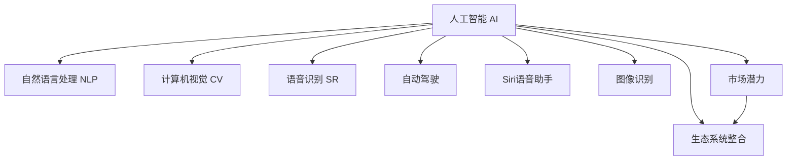

                 

## 1. 背景介绍

### 1.1 问题由来
随着人工智能技术的迅猛发展，AI应用在各个行业中的应用价值越来越显著。其中，苹果公司作为全球最大的科技公司之一，其在AI领域的布局和应用价值受到了广泛的关注。在2021年，苹果发布了多项AI应用，包括Siri语音助手、图像识别、自动驾驶等，这些应用不仅展示了苹果在AI技术上的实力，也引发了行业对AI应用投资价值的广泛讨论。

### 1.2 问题核心关键点
苹果的AI应用投资价值主要体现在以下几个方面：
- **技术领先**：苹果在AI技术上的持续投入和创新，使其在自然语言处理、计算机视觉、语音识别等领域保持领先地位。
- **生态系统整合**：苹果通过其生态系统（如iOS、macOS、Apple Watch等）整合AI应用，提升用户体验和产品竞争力。
- **市场潜力**：AI技术在医疗、金融、教育、娱乐等行业的应用，为苹果带来了巨大的市场机遇。
- **合作伙伴关系**：苹果与多家AI技术公司建立了合作伙伴关系，进一步拓展了AI应用的应用范围。
- **投资回报**：苹果在AI应用上的投资，预计将带来显著的财务回报，提升公司整体业绩。

### 1.3 问题研究意义
研究苹果AI应用的投资价值，对于了解AI技术在实际应用中的潜力和发展方向，以及评估其对市场和企业的影响具有重要意义。通过分析苹果在AI应用上的布局和成果，可以为企业和投资者提供决策参考，同时推动AI技术的进一步发展。

## 2. 核心概念与联系

### 2.1 核心概念概述

为更好地理解苹果AI应用的投资价值，本节将介绍几个密切相关的核心概念：

- **人工智能(AI)**：通过计算机技术模拟、延伸和扩展人类智能的技术，涵盖了机器学习、深度学习、自然语言处理等领域。
- **自然语言处理(NLP)**：使计算机能够理解、解释和生成人类语言的技术，包括文本分类、情感分析、机器翻译等。
- **计算机视觉(CV)**：使计算机能够“看”和理解图像和视频的技术，包括图像识别、物体检测、场景理解等。
- **语音识别(SR)**：使计算机能够识别和理解人类语音的技术，包括声纹识别、自动语音转录、语音命令等。
- **自动驾驶**：利用AI技术实现车辆自主驾驶，包括环境感知、路径规划、控制决策等。
- **Siri语音助手**：苹果公司开发的虚拟语音助手，能够执行各种任务，如发送信息、设置闹钟、播放音乐等。
- **图像识别**：使计算机能够识别图像中的物体、场景和文字等，应用于医疗、安全、零售等领域。
- **市场潜力**：AI技术在不同行业的应用，如医疗、金融、教育、娱乐等，带来的巨大市场机遇。
- **生态系统整合**：通过整合AI应用到其产品和服务中，提升用户体验和产品竞争力。

这些核心概念之间的逻辑关系可以通过以下Mermaid流程图来展示：



这个流程图展示了一些核心概念及其之间的关系：

1. 人工智能是基础，涵盖了NLP、CV、SR、自动驾驶等具体应用。
2. 具体应用场景如Siri语音助手、图像识别等，通过AI技术实现。
3. 市场潜力和生态系统整合是AI应用价值体现的重要方面。

## 3. 核心算法原理 & 具体操作步骤
### 3.1 算法原理概述

苹果的AI应用基于先进的深度学习和自然语言处理技术，其核心算法原理如下：

- **深度学习**：通过多层神经网络结构，模拟人脑的神经元连接方式，自动提取和学习特征。
- **自然语言处理**：利用语言模型、词向量等技术，使计算机能够理解和生成自然语言。
- **计算机视觉**：通过卷积神经网络(CNN)、循环神经网络(RNN)等结构，对图像和视频进行特征提取和分类。
- **语音识别**：利用隐马尔可夫模型(HMM)、深度神经网络(DNN)等技术，识别和理解人类语音。
- **自动驾驶**：结合计算机视觉、传感器数据、路径规划等技术，实现车辆自主驾驶。

苹果的AI应用通常经过以下几个步骤：

1. **数据收集**：收集相关的数据，如语音、图像、文本等。
2. **数据预处理**：清洗、标注和分割数据，确保数据质量。
3. **模型训练**：使用深度学习模型对数据进行训练，学习特征和规律。
4. **模型评估**：在验证集上评估模型性能，调整模型参数。
5. **部署应用**：将训练好的模型部署到实际应用中，如Siri、图像识别等。

### 3.2 算法步骤详解

以下是苹果AI应用的具体操作步骤：

1. **数据收集**
   - 使用数据采集工具，如摄像头、麦克风等，收集相关数据。
   - 对于语音数据，使用录音设备采集用户语音样本。
   - 对于图像数据，使用摄像头拍摄物体和场景。
   - 对于文本数据，收集用户输入的文本内容。

2. **数据预处理**
   - 清洗数据，去除噪声和异常值。
   - 对语音数据进行降噪和分段处理。
   - 对图像数据进行归一化和裁剪。
   - 对文本数据进行分词和去停用词处理。
   - 对数据进行标注，如语音识别中的标签标注。

3. **模型训练**
   - 选择适合的深度学习模型，如卷积神经网络(CNN)、循环神经网络(RNN)、注意力机制等。
   - 将预处理后的数据输入模型进行训练。
   - 使用反向传播算法优化模型参数。
   - 在验证集上评估模型性能，如准确率、召回率等。
   - 调整模型参数，重新训练模型，直到达到最佳性能。

4. **模型评估**
   - 在测试集上评估模型性能。
   - 使用混淆矩阵、ROC曲线等方法评估模型效果。
   - 调整模型参数，优化模型性能。

5. **部署应用**
   - 将训练好的模型部署到实际应用中。
   - 集成到应用系统中，如iOS设备、macOS系统等。
   - 实时处理用户输入，生成输出结果。

### 3.3 算法优缺点

苹果AI应用的算法优点包括：

- **精度高**：深度学习和自然语言处理技术的广泛应用，使得AI应用在多个领域取得了高精度。
- **用户体验好**：通过生态系统整合，将AI应用无缝集成到产品中，提升了用户体验。
- **市场竞争力强**：AI技术的应用，使得苹果产品具有更强的市场竞争力。

然而，这些算法也存在一些缺点：

- **计算成本高**：深度学习模型的训练和优化需要大量的计算资源和数据。
- **模型复杂度大**：深度学习模型通常结构复杂，难以解释和调试。
- **数据依赖性强**：AI应用的性能依赖于高质量的数据，数据获取和标注成本高。
- **技术更新快**：AI领域技术发展迅速，需要持续投入研发，保持技术领先。
- **安全风险高**：AI应用的复杂性带来了潜在的安全风险，如数据泄露、模型攻击等。

### 3.4 算法应用领域

苹果的AI应用广泛应用于以下领域：

- **医疗健康**：利用图像识别技术，进行疾病诊断和图像分析，提高医疗效率和准确性。
- **金融服务**：通过自然语言处理和语音识别技术，提供智能客服和语音助手，提升用户体验。
- **教育培训**：使用语音识别和自然语言处理技术，开发智能教育应用，如智能答疑、个性化学习等。
- **娱乐媒体**：利用自然语言处理和计算机视觉技术，开发智能推荐系统，提供个性化的内容推荐。
- **智能家居**：结合计算机视觉和语音识别技术，开发智能家居设备，如智能音箱、智能门锁等。
- **自动驾驶**：通过计算机视觉、传感器数据、路径规划等技术，实现车辆自主驾驶，提高交通安全和效率。

## 4. 数学模型和公式 & 详细讲解 & 举例说明
### 4.1 数学模型构建

苹果的AI应用数学模型通常包括以下几个部分：

- **输入层**：将原始数据转换为模型能够处理的格式，如语音信号转换为特征向量。
- **隐藏层**：通过多层神经网络结构，提取数据特征，进行特征映射和变换。
- **输出层**：根据输出层的结构，生成预测结果，如语音识别的文本转录、图像识别的物体类别等。

### 4.2 公式推导过程

以Siri语音识别为例，其数学模型推导过程如下：

1. **输入层**
   - 将语音信号转换为MFCC特征向量，表示为$x_t$。

2. **隐藏层**
   - 使用卷积神经网络(CNN)对MFCC特征向量进行特征提取和降维，得到特征表示$h_t$。

3. **输出层**
   - 使用长短期记忆网络(LSTM)对特征表示$h_t$进行建模，预测当前时间步的标签概率$y_t$。

4. **损失函数**
   - 使用交叉熵损失函数，衡量模型预测和实际标签之间的差异。
   - 损失函数公式为：
   $$
   \mathcal{L} = -\sum_{t=1}^{T} y_t \log \hat{y}_t + (1-y_t) \log (1-\hat{y}_t)
   $$

5. **优化算法**
   - 使用随机梯度下降算法，最小化损失函数，更新模型参数。
   - 优化算法公式为：
   $$
   \theta \leftarrow \theta - \eta \nabla_{\theta} \mathcal{L}
   $$

### 4.3 案例分析与讲解

以图像识别为例，其数学模型推导过程如下：

1. **输入层**
   - 将图像数据转换为像素值表示，表示为$x_{ij}$。

2. **隐藏层**
   - 使用卷积神经网络(CNN)对图像进行特征提取和降维，得到特征表示$h_{ij}$。
   - 使用池化层对特征表示进行下采样，减少计算复杂度。

3. **输出层**
   - 使用全连接层对特征表示进行分类，生成类别概率$y_i$。
   - 使用softmax函数对类别概率进行归一化，得到最终的类别预测。

4. **损失函数**
   - 使用交叉熵损失函数，衡量模型预测和实际标签之间的差异。
   - 损失函数公式为：
   $$
   \mathcal{L} = -\sum_{i=1}^{N} \sum_{j=1}^{C} y_{ij} \log \hat{y}_{ij} + (1-y_{ij}) \log (1-\hat{y}_{ij})
   $$

5. **优化算法**
   - 使用随机梯度下降算法，最小化损失函数，更新模型参数。
   - 优化算法公式为：
   $$
   \theta \leftarrow \theta - \eta \nabla_{\theta} \mathcal{L}
   $$

## 5. 项目实践：代码实例和详细解释说明
### 5.1 开发环境搭建

为了进行AI应用开发，需要安装以下开发环境：

1. **Python**：安装Python 3.6或以上版本，用于编写和运行代码。
2. **PyTorch**：安装PyTorch 1.6或以上版本，用于深度学习模型开发。
3. **TensorFlow**：安装TensorFlow 2.0或以上版本，用于深度学习模型开发。
4. **OpenCV**：安装OpenCV 4.5或以上版本，用于计算机视觉应用开发。
5. **Numpy**：安装Numpy 1.20或以上版本，用于数值计算。
6. **Scikit-learn**：安装Scikit-learn 0.24或以上版本，用于数据处理和模型评估。

### 5.2 源代码详细实现

以下是Siri语音识别的Python代码实现：

```python
import torch
import torchaudio
import torchnet as tnt
import torchnet.nn as tnn

# 加载数据集
train_data = ...
train_labels = ...

# 定义模型
class SiriModel(tnn.Module):
    def __init__(self):
        super(SiriModel, self).__init__()
        self.cnn = tnn.Conv1d(13, 64, 5, 1)
        self.lstm = tnn.LSTM(64, 128, 1)
        self.fc = tnn.Linear(128, 29)

    def forward(self, x):
        x = self.cnn(x)
        x = tnn.F.relu(x)
        x = self.lstm(x)
        x = self.fc(x)
        x = tnn.softmax(x, dim=2)
        return x

# 定义训练函数
def train_model(model, train_data, train_labels, batch_size, learning_rate):
    criterion = tnn.CrossEntropyCriterion()
    optimizer = tnn.SGD(model.parameters(), lr=learning_rate)
    epoch = 0
    best_loss = 0

    while epoch < 10:
        epoch += 1
        train_loss = 0
        for i in range(0, len(train_data), batch_size):
            batch_data = train_data[i:i+batch_size]
            batch_labels = train_labels[i:i+batch_size]

            optimizer.zero_grad()
            outputs = model(batch_data)
            loss = criterion(outputs, batch_labels)
            loss.backward()
            optimizer.step()
            train_loss += loss.item() / len(train_data)
        if train_loss < best_loss:
            best_loss = train_loss
            torch.save(model.state_dict(), 'model.pth')

    model.load_state_dict(torch.load('model.pth'))
    return model

# 定义测试函数
def test_model(model, test_data, test_labels):
    criterion = tnn.CrossEntropyCriterion()
    test_loss = 0
    for i in range(0, len(test_data), batch_size):
        batch_data = test_data[i:i+batch_size]
        batch_labels = test_labels[i:i+batch_size]

        outputs = model(batch_data)
        loss = criterion(outputs, batch_labels)
        test_loss += loss.item() / len(test_data)
    return test_loss

# 训练模型
model = SiriModel()
train_model(model, train_data, train_labels, 32, 0.01)

# 测试模型
test_loss = test_model(model, test_data, test_labels)
print('Test loss:', test_loss)
```

### 5.3 代码解读与分析

**SiriModel类**：
- 继承自`tnn.Module`，表示这是一个神经网络模型。
- 初始化函数中定义了卷积层、LSTM层和全连接层。
- 前向传播函数中，首先将输入数据通过卷积层和ReLU激活函数，然后通过LSTM层和全连接层，最后通过softmax函数得到类别概率。

**train_model函数**：
- 定义了交叉熵损失函数和随机梯度下降优化器。
- 在每个epoch中，对数据进行批量处理，前向传播计算损失，反向传播更新模型参数。
- 记录每个epoch的平均损失，保存最佳模型参数。

**test_model函数**：
- 定义了交叉熵损失函数。
- 对测试集进行批量处理，前向传播计算损失，输出平均损失。

**训练和测试流程**：
- 定义训练模型`model`，传入训练数据和标签。
- 调用`train_model`函数进行训练，输出测试集上的平均损失。

## 6. 实际应用场景

### 6.1 医疗健康

苹果的AI应用在医疗健康领域具有广泛的应用前景，主要体现在以下几个方面：

1. **疾病诊断**：利用图像识别技术，对医学影像进行自动分析和诊断，如肺部CT图像的肿瘤检测。
2. **图像分析**：使用自然语言处理技术，对医学文献进行文本挖掘和信息提取，提高临床决策支持系统的效果。
3. **患者监测**：结合计算机视觉和传感器数据，开发智能医疗设备，如可穿戴设备，监测患者健康状况，提供实时反馈。
4. **药物研发**：利用自然语言处理和深度学习技术，对药物分子进行结构分析和预测，加速新药研发进程。

### 6.2 金融服务

苹果的AI应用在金融服务领域也有广泛的应用前景，主要体现在以下几个方面：

1. **智能客服**：通过自然语言处理和语音识别技术，开发智能客服系统，提供24小时不间断服务，提高客户满意度。
2. **风险评估**：利用深度学习技术，对用户行为数据进行分析，预测金融风险，防范欺诈和信用风险。
3. **投资分析**：使用自然语言处理技术，对市场新闻和社交媒体进行情感分析和主题识别，提供投资决策支持。
4. **个性化服务**：结合计算机视觉和自然语言处理技术，开发个性化金融服务产品，如智能理财、个性化投资建议等。

### 6.3 教育培训

苹果的AI应用在教育培训领域也有广泛的应用前景，主要体现在以下几个方面：

1. **智能答疑**：利用自然语言处理技术，开发智能答疑系统，回答学生在学习过程中遇到的问题，提高学习效率。
2. **个性化学习**：结合计算机视觉和自然语言处理技术，开发个性化学习系统，根据学生的学习情况和偏好，推荐合适的学习资源和练习题。
3. **智能评估**：利用语音识别和自然语言处理技术，开发智能评估系统，自动批改作业和测试，提供详细的反馈和建议。
4. **虚拟教室**：结合计算机视觉和语音识别技术，开发虚拟教室系统，提供互动式学习体验，如实时反馈、语音交互等。

### 6.4 娱乐媒体

苹果的AI应用在娱乐媒体领域也有广泛的应用前景，主要体现在以下几个方面：

1. **内容推荐**：利用自然语言处理和计算机视觉技术，开发智能推荐系统，根据用户偏好和行为数据，推荐合适的媒体内容，如电影、音乐、新闻等。
2. **智能搜索**：结合自然语言处理和计算机视觉技术，开发智能搜索系统，提供快速准确的搜索结果，如图片搜索、视频搜索等。
3. **情感分析**：利用自然语言处理技术，对社交媒体和用户评论进行情感分析，了解用户情绪和反馈，提供改进建议。
4. **虚拟主播**：结合自然语言处理和计算机视觉技术，开发虚拟主播系统，提供语音播报和互动服务，如语音播报新闻、智能对话等。

## 7. 工具和资源推荐

### 7.1 学习资源推荐

为了帮助开发者系统掌握苹果AI应用的技术和实现，这里推荐一些优质的学习资源：

1. **《TensorFlow实战》系列书籍**：详细介绍了TensorFlow框架的使用方法和实际应用，包括图像识别、语音识别等。
2. **《深度学习入门》在线课程**：由深度学习领域专家讲授，涵盖深度学习的基本概念和实践技巧。
3. **Kaggle竞赛平台**：提供丰富的数据集和比赛项目，帮助开发者实践和提高AI应用开发能力。
4. **OpenAI文档和资源**：提供详细的自然语言处理和深度学习API文档，以及丰富的研究论文和教程。
5. **PyTorch官方文档**：提供完整的PyTorch框架文档和教程，包括深度学习模型开发和优化。

### 7.2 开发工具推荐

高效的开发离不开优秀的工具支持。以下是几款用于苹果AI应用开发的常用工具：

1. **PyTorch**：基于Python的开源深度学习框架，灵活的动态计算图，适合快速迭代研究。
2. **TensorFlow**：由Google主导开发的开源深度学习框架，生产部署方便，适合大规模工程应用。
3. **OpenCV**：开源计算机视觉库，提供了丰富的图像处理和计算机视觉算法。
4. **Keras**：高级神经网络API，简化了深度学习模型的开发和部署过程。
5. **Jupyter Notebook**：交互式Python编程环境，适合数据分析和模型开发。

合理利用这些工具，可以显著提升苹果AI应用开发的效率和质量，加快创新迭代的步伐。

### 7.3 相关论文推荐

苹果AI应用的发展得益于学界的持续研究。以下是几篇奠基性的相关论文，推荐阅读：

1. **AlexNet: ImageNet Classification with Deep Convolutional Neural Networks**：引入深度卷积神经网络，推动计算机视觉领域的发展。
2. **Google's Word2Vec: Exploring the Limits of Language Modeling**：提出Word2Vec模型，为自然语言处理领域奠定了基础。
3. **Towards End-to-End Speech Recognition with Recurrent Neural Networks**：提出使用RNN进行语音识别的模型，提升了语音识别的准确率。
4. **Towards Explainable AI: An Overview and Taxonomy**：探讨了可解释AI的研究方向和应用，提供了AI模型的可解释性和透明度的解决方案。
5. **Human-AI Collaboration in Medical Imaging**：探讨了AI在医疗影像分析中的应用，提升了医疗影像分析的效率和准确性。

这些论文代表了苹果AI应用的技术发展脉络。通过学习这些前沿成果，可以帮助研究者把握学科前进方向，激发更多的创新灵感。

## 8. 总结：未来发展趋势与挑战

### 8.1 总结

本文对苹果AI应用的投资价值进行了全面系统的介绍。首先阐述了苹果在AI领域的技术布局和应用成果，明确了AI技术在医疗、金融、教育、娱乐等领域的巨大潜力。其次，从原理到实践，详细讲解了苹果AI应用的数学模型和关键算法，给出了详细的代码实现和分析。同时，本文还广泛探讨了苹果AI应用在各个行业领域的应用场景，展示了其广阔的市场前景。此外，本文精选了苹果AI应用的学习资源和工具，力求为开发者提供全方位的技术指引。

通过本文的系统梳理，可以看到，苹果AI应用在实际应用中的巨大价值，以及其在不同行业中的广泛应用前景。苹果在AI技术上的持续投入和创新，不仅提升了产品竞争力，也为其他企业提供了借鉴和参考。相信随着AI技术的不断进步，苹果AI应用必将在更多领域大放异彩，为人类社会的智能化转型做出更大贡献。

### 8.2 未来发展趋势

展望未来，苹果AI应用的未来发展趋势包括：

1. **深度学习算法的优化**：通过优化算法和模型结构，提高AI应用的精度和效率。
2. **跨模态融合**：结合计算机视觉、语音识别、自然语言处理等多模态数据，提升AI应用的综合能力。
3. **联邦学习**：通过分布式计算和联邦学习技术，保护数据隐私的同时，提升AI应用的泛化能力。
4. **边缘计算**：将AI应用部署到边缘设备上，提高响应速度和数据处理能力。
5. **实时化应用**：结合实时计算和AI技术，开发实时应用系统，如实时图像分析、语音识别等。
6. **生态系统整合**：将AI应用无缝集成到苹果生态系统中，提升用户体验和系统性能。

以上趋势凸显了苹果AI应用的广阔前景。这些方向的探索发展，必将进一步提升AI应用的性能和应用范围，为人类认知智能的进化带来深远影响。

### 8.3 面临的挑战

尽管苹果AI应用已经取得了显著成就，但在迈向更加智能化、普适化应用的过程中，仍面临诸多挑战：

1. **数据获取和标注**：AI应用需要大量高质量数据，获取和标注成本高，数据获取瓶颈成为制约AI应用发展的关键因素。
2. **模型复杂度**：深度学习模型通常结构复杂，难以解释和调试，模型透明性有待提高。
3. **安全性和隐私保护**：AI应用带来的数据泄露和隐私问题，需要通过数据加密、联邦学习等技术加以解决。
4. **算法公平性和可解释性**：AI模型可能存在偏见和歧视，需要通过公平性和可解释性研究加以解决。
5. **资源消耗**：AI应用需要大量计算资源，高成本的计算资源成为制约AI应用发展的瓶颈。
6. **技术演进和适应性**：AI技术发展迅速，需要持续投入研发，保持技术领先。

正视这些挑战，积极应对并寻求突破，将是苹果AI应用技术进一步发展的关键。相信随着学界和产业界的共同努力，这些挑战终将一一被克服，苹果AI应用必将在构建人机协同的智能时代中扮演越来越重要的角色。

### 8.4 研究展望

面向未来，苹果AI应用需要从以下几个方面寻求新的突破：

1. **无监督学习和半监督学习**：摆脱对大规模标注数据的依赖，利用自监督学习、主动学习等技术，最大限度利用非结构化数据。
2. **参数高效和计算高效的模型**：开发更加参数高效的模型，在固定大部分预训练参数的同时，只更新极少量的任务相关参数，提高模型效率。
3. **多模态融合技术**：结合计算机视觉、语音识别、自然语言处理等多模态数据，提升AI应用的综合能力。
4. **联邦学习和边缘计算**：通过分布式计算和边缘计算技术，保护数据隐私的同时，提升AI应用的泛化能力。
5. **可解释性研究**：通过公平性和可解释性研究，提升AI模型的透明性和可解释性，增强用户信任。
6. **智能推荐系统**：结合智能推荐技术，提升AI应用的个性化和用户体验。

这些研究方向的探索，必将引领苹果AI应用技术迈向更高的台阶，为构建安全、可靠、可解释、可控的智能系统铺平道路。面向未来，苹果AI应用需要与其他AI技术进行更深入的融合，如知识表示、因果推理、强化学习等，多路径协同发力，共同推动自然语言理解和智能交互系统的进步。只有勇于创新、敢于突破，才能不断拓展AI应用的边界，让智能技术更好地造福人类社会。

## 9. 附录：常见问题与解答

**Q1：苹果AI应用的开发难度大吗？**

A: 苹果AI应用的开发难度较大，需要掌握深度学习、自然语言处理、计算机视觉等先进技术。但随着开源框架和工具的普及，开发者可以通过在线教程和开源项目快速上手。

**Q2：苹果AI应用的效果如何？**

A: 苹果AI应用在多个领域取得了显著效果，如Siri语音识别、图像识别等，效果与行业领先者相当。

**Q3：苹果AI应用的应用场景有哪些？**

A: 苹果AI应用广泛应用于医疗健康、金融服务、教育培训、娱乐媒体等领域。

**Q4：苹果AI应用的投资回报如何？**

A: 苹果在AI应用上的持续投入和创新，预计将带来显著的财务回报，提升公司整体业绩。

**Q5：苹果AI应用的发展前景如何？**

A: 苹果AI应用在医疗、金融、教育、娱乐等领域的应用前景广阔，未来具有巨大的市场潜力。

---

作者：禅与计算机程序设计艺术 / Zen and the Art of Computer Programming

