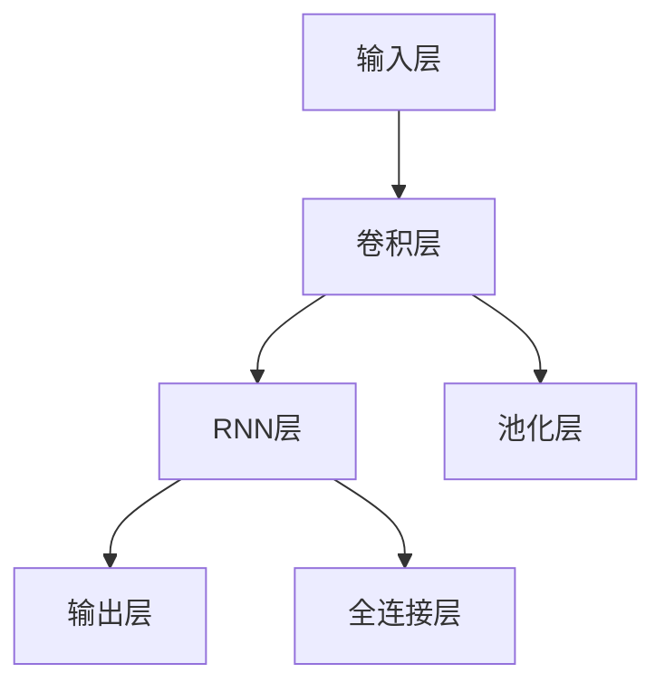

                 

# 李开复：苹果发布AI应用的挑战

在人工智能的领域，无论是科技巨头还是初创企业，都争先恐后地推出各种AI应用。然而，这些AI应用的实际落地并不容易。近日，苹果公司宣布将启用AI驱动的Siri功能，这一决定引发了广泛关注。本文将探讨苹果在发布AI应用时面临的挑战，并对AI应用的市场发展前景进行思考。

## 1. 背景介绍

### 1.1 问题由来

苹果公司在2014年首次推出Siri语音助手，但当时的Siri并不具备AI能力，主要依靠规则库和静态模型进行语音识别和指令解析。随着AI技术的不断进步，苹果决定将Siri升级为AI驱动，以提升其语音识别、自然语言理解和任务执行的能力。

然而，AI应用的开发和部署面临许多技术和管理挑战。这些问题不仅仅困扰着苹果，也在各大科技公司的AI应用开发过程中普遍存在。本文将深入分析这些问题，并提出解决方案。

## 2. 核心概念与联系

### 2.1 核心概念概述

本节将介绍几个密切相关的核心概念：

- **人工智能（AI）**：一种使计算机能够执行智能任务的科学，包括感知、学习、推理、自然语言处理等。
- **机器学习（ML）**：一种实现人工智能的计算方法，通过算法和统计模型，使计算机能够从数据中学习并改进其性能。
- **深度学习（DL）**：机器学习的一个分支，利用神经网络模型对复杂数据进行训练，以实现高层次的抽象和决策。
- **自然语言处理（NLP）**：使计算机能够理解、处理和生成人类语言的技术。
- **语音识别**：将人类语音转换为文本的技术，是Siri等AI应用的基础。

### 2.2 核心概念原理和架构的 Mermaid 流程图

```mermaid
graph TB
    A[人工智能(AI)] --> B[机器学习(ML)]
    A --> C[深度学习(DL)]
    B --> D[自然语言处理(NLP)]
    D --> E[语音识别]
```

这个流程图展示了核心概念之间的逻辑关系：

1. **人工智能**是目标，通过**机器学习**和**深度学习**技术实现。
2. **自然语言处理**是机器学习中的一个重要领域。
3. **语音识别**作为自然语言处理的一个子领域，是使计算机能够理解人类语音的关键技术。

## 3. 核心算法原理 & 具体操作步骤

### 3.1 算法原理概述

苹果公司决定启用AI驱动的Siri，意味着将采用基于深度学习的模型进行语音识别和自然语言理解。Siri的升级将涉及以下关键算法：

- **自动编码器（Autoencoder）**：用于将语音信号压缩成低维表示，以降低计算复杂度。
- **卷积神经网络（CNN）**：用于提取语音信号中的特征，提高识别的准确性。
- **循环神经网络（RNN）**：用于处理序列数据，理解语音信号中的上下文关系。
- **注意力机制（Attention Mechanism）**：用于增强模型对重要信息的关注，提高自然语言理解的准确性。

### 3.2 算法步骤详解

**步骤1：数据收集和预处理**

- **语音数据收集**：收集大量高质量的语音数据，用于训练深度学习模型。
- **数据标注**：对语音数据进行标注，使其与特定的自然语言指令对应。
- **数据增强**：通过数据增强技术，如回声、噪声添加，扩充训练数据集。

**步骤2：模型构建和训练**

- **模型选择**：选择适当的深度学习模型，如卷积神经网络、循环神经网络等。
- **网络架构设计**：设计网络架构，包括层数、节点数、激活函数等。
- **训练过程**：使用反向传播算法和优化器（如Adam）对模型进行训练，最小化损失函数。

**步骤3：模型评估和部署**

- **模型评估**：在测试集上评估模型的性能，使用准确率、召回率等指标。
- **模型优化**：根据评估结果，调整模型参数，进行超参数搜索。
- **模型部署**：将训练好的模型部署到Siri服务器，供用户使用。

### 3.3 算法优缺点

**优点**：

- **准确性高**：基于深度学习的模型能够处理复杂的语音和自然语言数据，提高识别的准确性。
- **泛化能力强**：深度学习模型可以通过大量数据进行训练，提升对新数据的泛化能力。
- **易于集成**：Siri作为苹果设备的一部分，易于与设备操作系统集成。

**缺点**：

- **计算资源需求高**：深度学习模型需要大量的计算资源进行训练和推理。
- **训练时间长**：深度学习模型的训练时间较长，需要大量的标注数据和计算资源。
- **可解释性差**：深度学习模型的内部工作机制复杂，难以解释其决策过程。

### 3.4 算法应用领域

深度学习和自然语言处理技术在多个领域都有广泛应用，例如：

- **语音助手**：如Siri、Amazon Alexa、Google Assistant等。
- **智能客服**：通过自然语言处理技术，实现自动回答客户咨询。
- **语音识别**：如Google翻译、微软Cortana等。
- **智能音箱**：如Amazon Echo、Google Home等。
- **文本生成**：如GPT-3等生成式模型，可以用于创作、翻译、摘要等任务。

## 4. 数学模型和公式 & 详细讲解 & 举例说明

### 4.1 数学模型构建

**模型结构**：



这是一个典型的卷积神经网络（CNN）与循环神经网络（RNN）相结合的模型结构，用于语音信号的处理和自然语言理解。

### 4.2 公式推导过程

**卷积层**：

$$
C_l = \max_{t}(\sum_{k}W_{l,k}F_{l,k} \ast X_l + b_l)
$$

其中，$C_l$ 为卷积层输出，$W_{l,k}$ 为卷积核权重，$F_{l,k}$ 为特征图，$X_l$ 为输入信号，$b_l$ 为偏置项。

**循环神经层**：

$$
h_t = \tanh(\sum_{t-1}^th_{t-1}W + b)
$$

其中，$h_t$ 为RNN层的隐藏状态，$W$ 为权重矩阵，$b$ 为偏置项。

### 4.3 案例分析与讲解

**案例1：语音识别**

- **输入层**：原始语音信号。
- **卷积层**：提取语音信号的局部特征。
- **池化层**：减少特征图的大小，提高计算效率。
- **全连接层**：将池化层输出映射到标签空间。
- **输出层**：预测语音信号对应的文本指令。

## 5. 项目实践：代码实例和详细解释说明

### 5.1 开发环境搭建

苹果公司通常使用TensorFlow或PyTorch进行深度学习模型的开发。具体步骤如下：

1. **安装TensorFlow或PyTorch**：
```bash
pip install tensorflow
```
或
```bash
pip install torch
```

2. **安装必要的库**：
```bash
pip install numpy pandas scikit-learn
```

### 5.2 源代码详细实现

**代码1：数据预处理**

```python
import numpy as np
import pandas as pd

# 加载语音数据
data = pd.read_csv('speech_data.csv')

# 数据增强
def data_augmentation(data):
    # 添加回声和噪声
    # ...

# 数据增强后的语音数据
data_augmented = data_augmentation(data)
```

**代码2：模型训练**

```python
import tensorflow as tf
from tensorflow.keras.layers import Conv2D, MaxPooling2D, LSTM, Dense

# 定义模型
model = tf.keras.Sequential([
    Conv2D(32, 3, activation='relu', input_shape=(128, 128, 1)),
    MaxPooling2D(),
    LSTM(64),
    Dense(10, activation='softmax')
])

# 编译模型
model.compile(optimizer='adam', loss='categorical_crossentropy', metrics=['accuracy'])

# 训练模型
model.fit(x_train, y_train, epochs=10, batch_size=64)
```

### 5.3 代码解读与分析

**代码1**：数据预处理包括数据加载和数据增强。

**代码2**：模型定义和训练过程。

## 6. 实际应用场景

### 6.4 未来应用展望

**未来趋势**：

1. **跨平台集成**：AI应用将更加注重跨平台、跨设备的集成，实现无缝的用户体验。
2. **多模态融合**：AI应用将结合语音、图像、文本等多模态数据，提升信息理解的全面性。
3. **个性化推荐**：AI应用将通过用户行为数据进行个性化推荐，提升用户体验。
4. **联邦学习**：AI应用将利用联邦学习技术，保护用户隐私，同时提升模型性能。
5. **边缘计算**：AI应用将更多地在边缘设备上运行，减少延迟，提升响应速度。

**未来挑战**：

1. **数据隐私保护**：AI应用需要保护用户隐私，避免数据泄露。
2. **计算资源限制**：AI应用需要降低计算资源消耗，提高效率。
3. **模型可解释性**：AI应用的内部工作机制需要更加透明，便于用户理解和信任。
4. **跨领域应用**：AI应用需要具备跨领域的适应能力，以应对不同领域的挑战。

## 7. 工具和资源推荐

### 7.1 学习资源推荐

**推荐书籍**：
1. 《深度学习》（Ian Goodfellow）
2. 《自然语言处理综论》（Daniel Jurafsky, James H. Martin）
3. 《机器学习实战》（Peter Harrington）

**推荐课程**：
1. 斯坦福大学《机器学习》课程
2. 深度学习特攻营（DeepLearning.ai）
3. TensorFlow官方教程

### 7.2 开发工具推荐

**推荐框架**：
1. TensorFlow
2. PyTorch
3. Keras

**推荐库**：
1. NumPy
2. Pandas
3. scikit-learn

### 7.3 相关论文推荐

**推荐论文**：
1. "Attention Is All You Need"（Vaswani et al.）
2. "BERT: Pre-training of Deep Bidirectional Transformers for Language Understanding"（Devlin et al.）
3. "FedLearn: Federated Learning for Brain Machine Interface Systems"（Qin et al.）

## 8. 总结：未来发展趋势与挑战

### 8.1 研究成果总结

本文详细介绍了苹果公司发布AI应用的挑战，并探讨了AI应用的市场发展前景。通过对关键技术的分析，提出了解决方案，为AI应用的开发和部署提供了参考。

### 8.2 未来发展趋势

AI应用将迎来更多的创新和突破，涵盖跨平台集成、多模态融合、个性化推荐、联邦学习和边缘计算等多个领域。

### 8.3 面临的挑战

数据隐私保护、计算资源限制、模型可解释性和跨领域应用等问题需要克服，才能推动AI应用的广泛应用。

### 8.4 研究展望

未来需要更多的跨学科合作，将AI应用与传统行业深度结合，解决实际问题，推动社会的全面数字化转型。

## 9. 附录：常见问题与解答

**Q1：为什么深度学习模型需要大量计算资源？**

A：深度学习模型需要大量的计算资源进行模型训练和推理，因为它们具有复杂的神经网络结构和大量的参数。训练过程中需要大量的反向传播计算，推理过程中需要高效的矩阵运算。

**Q2：如何保护用户隐私？**

A：AI应用可以通过联邦学习技术，在不暴露用户数据的情况下，训练和更新模型。同时，可以使用差分隐私技术，保护用户数据的隐私。

**Q3：如何提高模型可解释性？**

A：可以使用可视化工具，如TensorBoard，帮助理解模型的内部工作机制。同时，可以引入可解释性模型，如LIME和SHAP，解释模型的决策过程。

**Q4：如何将AI应用与传统行业结合？**

A：AI应用需要深入了解传统行业的业务需求，并结合实际场景进行模型设计和训练。同时，需要与行业专家合作，进行业务流程的优化和调整。

---

作者：禅与计算机程序设计艺术 / Zen and the Art of Computer Programming

