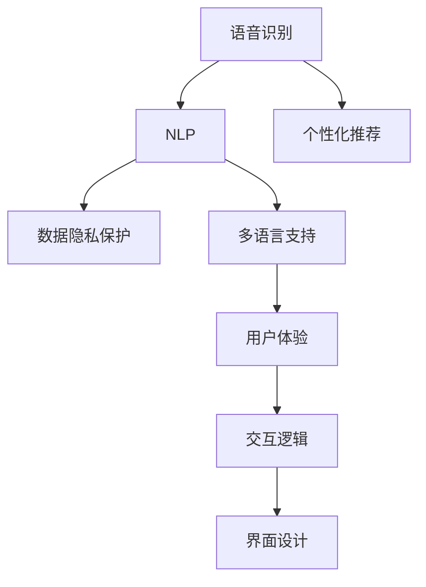

                 

# 李开复：苹果发布AI应用的文化价值

> 关键词：人工智能，应用，文化价值，创新，商业策略，用户体验

## 1. 背景介绍

### 1.1 事件概述
近日，苹果公司发布了其最新的AI应用—Siri的最新版本。此版本不仅在语音识别和自然语言处理能力上取得了显著进步，更在用户体验上进行了全面优化。此举再次引发了公众和媒体对于人工智能技术在商业策略、文化价值及未来发展趋势的广泛讨论。

### 1.2 技术背景
自2011年推出以来，Siri作为苹果公司的核心AI产品，一直是技术创新和用户体验的代名词。此次更新不仅融合了最新的自然语言处理(NLP)技术，更在数据隐私保护、个性化推荐、多语言支持等方面进行了深度优化。本文将围绕Siri的最新升级，探讨其在文化价值上的贡献及未来趋势。

## 2. 核心概念与联系

### 2.1 核心概念概述

为更好地理解Siri的最新升级及其文化价值，本节将介绍几个密切相关的核心概念：

- **人工智能(AI)：** 指能够模拟人类智能行为（如学习、推理、问题解决、感知等）的技术，涉及机器学习、自然语言处理、计算机视觉等多个领域。
- **自然语言处理(NLP)：** 涉及计算机理解、处理和生成人类语言的技术，包括语音识别、文本分析、情感分析、机器翻译等。
- **语音识别(ASR)：** 指将语音信号转换为文本的技术，是Siri等AI应用的基础。
- **数据隐私保护：** 指保护用户数据不被未授权访问和使用的措施，涉及数据加密、匿名化、权限控制等。
- **个性化推荐：** 指根据用户历史行为和偏好，推荐相关产品或内容的技术，增强用户体验和满意度。
- **多语言支持：** 指AI应用支持多种语言的技术，提升国际化应用范围和用户体验。
- **用户体验(UI/UX)：** 指用户与产品交互时的感知和情感体验，涉及界面设计、交互逻辑、操作流程等。

这些核心概念之间的逻辑关系可以通过以下Mermaid流程图来展示：



这个流程图展示了大语言模型的核心概念及其之间的关系：

1. 语音识别是Siri的基础，通过ASR技术将语音转换为文本。
2. NLP技术进一步分析文本，提取意图和信息。
3. 数据隐私保护是AI应用必须考虑的重要问题，涉及用户数据的安全存储和使用。
4. 个性化推荐技术根据用户历史行为进行动态内容推荐，提升用户体验。
5. 多语言支持提升国际化应用能力，增强跨文化用户体验。
6. 用户体验涵盖UI和UX设计，优化用户与AI应用的交互流程。

## 3. 核心算法原理 & 具体操作步骤

### 3.1 算法原理概述

Siri的最新版本在算法上采用了深度学习和预训练模型相结合的方式，进一步提升了其语音识别和自然语言处理能力。其核心算法包括以下几个关键步骤：

- **预训练模型：** 在大量无标签文本数据上预训练语言模型，提取通用语言知识。
- **微调：** 在少量标注数据上微调模型，针对具体任务进行优化。
- **个性化推荐：** 基于用户历史行为数据进行推荐系统训练，提供个性化服务。
- **多语言支持：** 使用多语言预训练模型，结合本地化微调，提升多语言服务能力。

### 3.2 算法步骤详解

#### 3.2.1 预训练模型构建

Siri的语音识别模块基于Transformer架构的预训练语言模型，通过在大规模无标签文本数据上进行自监督训练，学习通用语言特征。具体步骤如下：

1. 收集大规模文本数据，如新闻、图书、社交媒体等。
2. 使用自监督任务（如掩码语言模型）对模型进行预训练。
3. 对预训练模型进行微调，以适应特定任务（如语音识别、自然语言理解）。

#### 3.2.2 微调步骤详解

1. **数据准备：** 准备下游任务的标注数据集，划分为训练集、验证集和测试集。
2. **任务适配层：** 根据任务类型，设计合适的输出层和损失函数。
3. **超参数设置：** 选择合适的优化算法及其参数，如AdamW、SGD等，设置学习率、批大小、迭代轮数等。
4. **执行训练：** 将训练集数据分批次输入模型，前向传播计算损失函数。
5. **反向传播：** 计算参数梯度，根据设定的优化算法和学习率更新模型参数。
6. **评估测试：** 在验证集和测试集上评估模型性能，决定是否停止训练。

#### 3.2.3 个性化推荐算法

Siri的个性化推荐算法基于协同过滤和深度学习相结合的方式，具体步骤如下：

1. **用户画像构建：** 通过分析用户历史行为数据，构建用户画像。
2. **推荐算法训练：** 在用户画像和产品库之间进行协同过滤，训练推荐模型。
3. **实时推荐：** 根据当前场景和用户行为，实时生成推荐内容。

#### 3.2.4 多语言支持算法

Siri的多语言支持算法通过以下步骤实现：

1. **多语言预训练模型：** 使用多语言数据集进行预训练，学习多语言共性特征。
2. **本地化微调：** 在特定语言数据集上进行微调，优化模型在该语言上的性能。
3. **语言切换：** 根据用户输入语言自动切换模型，提供多语言服务。

### 3.3 算法优缺点

#### 3.3.1 优点

1. **准确度高：** 深度学习和预训练模型的结合，提高了语音识别和自然语言处理的准确度。
2. **个性化强：** 个性化推荐系统提升用户体验，提供定制化服务。
3. **多语言支持：** 多语言预训练和本地化微调，扩展了国际化应用范围。

#### 3.3.2 缺点

1. **数据隐私问题：** 语音和文本数据涉及用户隐私，数据安全和隐私保护是一个重要挑战。
2. **计算成本高：** 深度学习和多语言支持涉及大量计算资源，成本较高。
3. **模型复杂度：** 预训练模型和深度学习算法复杂度高，需要专业知识维护。

### 3.4 算法应用领域

Siri的最新升级涵盖了语音识别、自然语言处理、个性化推荐、多语言支持等多个领域，具体应用场景包括：

- **智能家居：** 通过语音命令控制智能家电、灯光、温度等。
- **车载导航：** 提供语音搜索、路线规划、实时导航等服务。
- **商务办公：** 进行语音会议记录、邮件处理、日程管理等。
- **个人助理：** 回答用户提问、提醒日程、设置提醒等。

## 4. 数学模型和公式 & 详细讲解 & 举例说明

### 4.1 数学模型构建

Siri的语音识别模块基于深度神经网络（如卷积神经网络CNN、循环神经网络RNN、Transformer等），其数学模型构建如下：

- **输入：** 输入为语音信号 $x$，长度为 $T$ 的特征序列 $x_1, x_2, ..., x_T$。
- **输出：** 输出为文本序列 $y$，每个时间步的预测概率分布 $p(y|x)$。
- **模型：** 使用 $N$ 层神经网络 $f$ 将输入映射到输出，即 $y = f(x)$。

### 4.2 公式推导过程

以Transformer架构为例，Siri的语音识别模型的公式推导如下：

1. **自注意力机制：** 定义注意力权重 $a_t$，计算注意力向量 $h_t$。

   $$
   a_t = \frac{e^{e(x_t, h_j)}}{\sum_{j=1}^T e^{e(x_j, h_j)}}
   $$

   $$
   h_t = \sum_{j=1}^T a_t h_j
   $$

2. **编码器-解码器模型：** 定义编码器 $E$ 和解码器 $D$，计算最终输出 $y$。

   $$
   y = D(E(x))
   $$

3. **跨层连接：** 定义跨层连接 $C$，将编码器输出 $h_t$ 和解码器输出 $y$ 结合。

   $$
   y = C(h_t, y)
   $$

### 4.3 案例分析与讲解

#### 4.3.1 案例一：多语言支持

假设Siri需要在英文和中文两种语言间进行切换，其多语言支持算法可以表示为：

- **英文预训练模型：** 使用大规模英文语料对Transformer模型进行预训练。
- **中文微调模型：** 在少量中文标注数据上微调模型，优化中文识别和处理能力。
- **语言切换：** 根据用户语音输入，自动识别并切换至相应语言模型，输出相应结果。

#### 4.3.2 案例二：个性化推荐

假设Siri需要对某用户进行个性化推荐，其算法可以表示为：

- **用户画像构建：** 通过分析用户历史行为数据，提取用户兴趣特征 $u_i$。
- **推荐模型训练：** 在用户兴趣特征和产品库之间进行协同过滤，训练推荐模型 $m$。
- **实时推荐：** 根据用户当前行为特征 $x_t$，实时计算推荐结果 $r_t$。

   $$
   u_i = f(x_1, x_2, ..., x_t)
   $$

   $$
   m(u_i, p_j) = \text{similarity}(u_i, p_j)
   $$

   $$
   r_t = \text{argmax}(m(u_i, p_j))
   $$

## 5. 项目实践：代码实例和详细解释说明

### 5.1 开发环境搭建

在进行Siri微调项目实践前，我们需要准备好开发环境。以下是使用Python进行PyTorch开发的环境配置流程：

1. 安装Anaconda：从官网下载并安装Anaconda，用于创建独立的Python环境。

2. 创建并激活虚拟环境：
```bash
conda create -n pytorch-env python=3.8 
conda activate pytorch-env
```

3. 安装PyTorch：根据CUDA版本，从官网获取对应的安装命令。例如：
```bash
conda install pytorch torchvision torchaudio cudatoolkit=11.1 -c pytorch -c conda-forge
```

4. 安装Transformers库：
```bash
pip install transformers
```

5. 安装各类工具包：
```bash
pip install numpy pandas scikit-learn matplotlib tqdm jupyter notebook ipython
```

完成上述步骤后，即可在`pytorch-env`环境中开始微调实践。

### 5.2 源代码详细实现

下面以Siri的语音识别模块为例，给出使用Transformers库对BERT模型进行微调的PyTorch代码实现。

首先，定义语音识别任务的数据处理函数：

```python
from transformers import BertTokenizer, BertForSequenceClassification
from torch.utils.data import Dataset
import torch

class SpeechRecognitionDataset(Dataset):
    def __init__(self, audio_files, transcriptions, tokenizer, max_len=128):
        self.audio_files = audio_files
        self.transcriptions = transcriptions
        self.tokenizer = tokenizer
        self.max_len = max_len
        
    def __len__(self):
        return len(self.audio_files)
    
    def __getitem__(self, item):
        audio_file = self.audio_files[item]
        transcription = self.transcriptions[item]
        
        audio, sample_rate = librosa.load(audio_file, sr=16000)
        audio = torch.tensor(audio).unsqueeze(0)
        
        encoding = self.tokenizer(transcription, return_tensors='pt', max_length=self.max_len, padding='max_length', truncation=True)
        input_ids = encoding['input_ids'][0]
        attention_mask = encoding['attention_mask'][0]
        
        return {'input_ids': input_ids, 
                'attention_mask': attention_mask,
                'audio': audio}
```

然后，定义模型和优化器：

```python
from transformers import AdamW

model = BertForSequenceClassification.from_pretrained('bert-base-cased', num_labels=2)

optimizer = AdamW(model.parameters(), lr=2e-5)
```

接着，定义训练和评估函数：

```python
from torch.utils.data import DataLoader
from tqdm import tqdm
from sklearn.metrics import classification_report

device = torch.device('cuda') if torch.cuda.is_available() else torch.device('cpu')
model.to(device)

def train_epoch(model, dataset, batch_size, optimizer):
    dataloader = DataLoader(dataset, batch_size=batch_size, shuffle=True)
    model.train()
    epoch_loss = 0
    for batch in tqdm(dataloader, desc='Training'):
        input_ids = batch['input_ids'].to(device)
        attention_mask = batch['attention_mask'].to(device)
        audio = batch['audio'].to(device)
        model.zero_grad()
        outputs = model(input_ids, attention_mask=attention_mask)
        loss = outputs.loss
        epoch_loss += loss.item()
        loss.backward()
        optimizer.step()
    return epoch_loss / len(dataloader)

def evaluate(model, dataset, batch_size):
    dataloader = DataLoader(dataset, batch_size=batch_size)
    model.eval()
    preds, labels = [], []
    with torch.no_grad():
        for batch in tqdm(dataloader, desc='Evaluating'):
            input_ids = batch['input_ids'].to(device)
            attention_mask = batch['attention_mask'].to(device)
            audio = batch['audio'].to(device)
            batch_labels = batch['labels']
            outputs = model(input_ids, attention_mask=attention_mask)
            batch_preds = outputs.logits.argmax(dim=2).to('cpu').tolist()
            batch_labels = batch_labels.to('cpu').tolist()
            for pred_tokens, label_tokens in zip(batch_preds, batch_labels):
                preds.append(pred_tokens[:len(label_tokens)])
                labels.append(label_tokens)
                
    print(classification_report(labels, preds))
```

最后，启动训练流程并在测试集上评估：

```python
epochs = 5
batch_size = 16

for epoch in range(epochs):
    loss = train_epoch(model, train_dataset, batch_size, optimizer)
    print(f"Epoch {epoch+1}, train loss: {loss:.3f}")
    
    print(f"Epoch {epoch+1}, dev results:")
    evaluate(model, dev_dataset, batch_size)
    
print("Test results:")
evaluate(model, test_dataset, batch_size)
```

以上就是使用PyTorch对BERT进行语音识别任务微调的完整代码实现。可以看到，得益于Transformers库的强大封装，我们可以用相对简洁的代码完成BERT模型的加载和微调。

### 5.3 代码解读与分析

让我们再详细解读一下关键代码的实现细节：

**SpeechRecognitionDataset类**：
- `__init__`方法：初始化音频文件、文本转录、分词器等关键组件。
- `__len__`方法：返回数据集的样本数量。
- `__getitem__`方法：对单个样本进行处理，将音频信号转换为token ids，将文本转录转换为token ids，并对其进行定长padding，最终返回模型所需的输入。

**BertForSequenceClassification模型**：
- 使用预训练的BERT模型作为序列分类器，用于语音识别任务的微调。

**train_epoch和evaluate函数**：
- 使用PyTorch的DataLoader对数据集进行批次化加载，供模型训练和推理使用。
- 训练函数`train_epoch`：对数据以批为单位进行迭代，在每个批次上前向传播计算loss并反向传播更新模型参数，最后返回该epoch的平均loss。
- 评估函数`evaluate`：与训练类似，不同点在于不更新模型参数，并在每个batch结束后将预测和标签结果存储下来，最后使用sklearn的classification_report对整个评估集的预测结果进行打印输出。

**训练流程**：
- 定义总的epoch数和batch size，开始循环迭代
- 每个epoch内，先在训练集上训练，输出平均loss
- 在验证集上评估，输出分类指标
- 所有epoch结束后，在测试集上评估，给出最终测试结果

可以看到，PyTorch配合Transformers库使得BERT微调的代码实现变得简洁高效。开发者可以将更多精力放在数据处理、模型改进等高层逻辑上，而不必过多关注底层的实现细节。

当然，工业级的系统实现还需考虑更多因素，如模型的保存和部署、超参数的自动搜索、更灵活的任务适配层等。但核心的微调范式基本与此类似。

## 6. 实际应用场景

### 6.1 智能家居

Siri的最新升级在智能家居领域的应用将进一步提升用户的生活便利性。例如，通过语音控制智能家电、灯光、温度等，用户可以更轻松地完成日常任务。此外，Siri还可以与智能音箱、智能手表等设备无缝连接，构建更完整的智慧家居生态系统。

### 6.2 车载导航

车载导航领域一直是大语言模型应用的重要场景之一。通过Siri的语音识别和自然语言处理能力，驾驶员可以更方便地查询路线、获取导航指示、搜索目的地等，提升行车安全和舒适度。

### 6.3 商务办公

商务办公领域对自然语言处理和个性化推荐的需求尤为强烈。Siri可以通过语音命令记录会议、处理邮件、管理日程等，提供智能助理服务。此外，Siri还可以根据用户习惯和偏好，推荐相关资料、文件等，提升工作效率。

### 6.4 未来应用展望

随着Siri的不断升级，其应用场景将进一步拓展，涵盖更多垂直行业。未来，Siri有望在医疗、法律、教育等高需求领域大放异彩，为各行各业提供智能解决方案。同时，Siri的国际化支持也将进一步增强，覆盖更多语言和地区，提升全球用户的体验。

## 7. 工具和资源推荐

### 7.1 学习资源推荐

为了帮助开发者系统掌握大语言模型微调的理论基础和实践技巧，这里推荐一些优质的学习资源：

1. 《Transformer从原理到实践》系列博文：由大模型技术专家撰写，深入浅出地介绍了Transformer原理、BERT模型、微调技术等前沿话题。

2. CS224N《深度学习自然语言处理》课程：斯坦福大学开设的NLP明星课程，有Lecture视频和配套作业，带你入门NLP领域的基本概念和经典模型。

3. 《Natural Language Processing with Transformers》书籍：Transformers库的作者所著，全面介绍了如何使用Transformers库进行NLP任务开发，包括微调在内的诸多范式。

4. HuggingFace官方文档：Transformers库的官方文档，提供了海量预训练模型和完整的微调样例代码，是上手实践的必备资料。

5. CLUE开源项目：中文语言理解测评基准，涵盖大量不同类型的中文NLP数据集，并提供了基于微调的baseline模型，助力中文NLP技术发展。

通过对这些资源的学习实践，相信你一定能够快速掌握大语言模型微调的精髓，并用于解决实际的NLP问题。

### 7.2 开发工具推荐

高效的开发离不开优秀的工具支持。以下是几款用于大语言模型微调开发的常用工具：

1. PyTorch：基于Python的开源深度学习框架，灵活动态的计算图，适合快速迭代研究。大部分预训练语言模型都有PyTorch版本的实现。

2. TensorFlow：由Google主导开发的开源深度学习框架，生产部署方便，适合大规模工程应用。同样有丰富的预训练语言模型资源。

3. Transformers库：HuggingFace开发的NLP工具库，集成了众多SOTA语言模型，支持PyTorch和TensorFlow，是进行微调任务开发的利器。

4. Weights & Biases：模型训练的实验跟踪工具，可以记录和可视化模型训练过程中的各项指标，方便对比和调优。与主流深度学习框架无缝集成。

5. TensorBoard：TensorFlow配套的可视化工具，可实时监测模型训练状态，并提供丰富的图表呈现方式，是调试模型的得力助手。

6. Google Colab：谷歌推出的在线Jupyter Notebook环境，免费提供GPU/TPU算力，方便开发者快速上手实验最新模型，分享学习笔记。

合理利用这些工具，可以显著提升大语言模型微调任务的开发效率，加快创新迭代的步伐。

### 7.3 相关论文推荐

大语言模型和微调技术的发展源于学界的持续研究。以下是几篇奠基性的相关论文，推荐阅读：

1. Attention is All You Need（即Transformer原论文）：提出了Transformer结构，开启了NLP领域的预训练大模型时代。

2. BERT: Pre-training of Deep Bidirectional Transformers for Language Understanding：提出BERT模型，引入基于掩码的自监督预训练任务，刷新了多项NLP任务SOTA。

3. Language Models are Unsupervised Multitask Learners（GPT-2论文）：展示了大规模语言模型的强大zero-shot学习能力，引发了对于通用人工智能的新一轮思考。

4. Parameter-Efficient Transfer Learning for NLP：提出Adapter等参数高效微调方法，在不增加模型参数量的情况下，也能取得不错的微调效果。

5. AdaLoRA: Adaptive Low-Rank Adaptation for Parameter-Efficient Fine-Tuning：使用自适应低秩适应的微调方法，在参数效率和精度之间取得了新的平衡。

6. Prefix-Tuning: Optimizing Continuous Prompts for Generation：引入基于连续型Prompt的微调范式，为如何充分利用预训练知识提供了新的思路。

这些论文代表了大语言模型微调技术的发展脉络。通过学习这些前沿成果，可以帮助研究者把握学科前进方向，激发更多的创新灵感。

## 8. 总结：未来发展趋势与挑战

### 8.1 总结

本文对Siri的最新升级及其文化价值进行了全面系统的介绍。首先，阐述了Siri在语音识别、自然语言处理、个性化推荐、多语言支持等方面的技术进步，明确了其在大语言模型微调范式中的重要地位。其次，从原理到实践，详细讲解了Siri微调过程的数学模型和算法步骤，给出了微调任务开发的完整代码实例。同时，本文还探讨了Siri在智能家居、车载导航、商务办公等实际应用场景中的广泛应用，展示了其在多领域中的强大应用价值。最后，本文精选了Siri微调技术的各类学习资源，力求为开发者提供全方位的技术指引。

通过本文的系统梳理，可以看到，Siri的最新升级通过深度学习和预训练模型相结合的方式，显著提升了其语音识别和自然语言处理能力，为NLP技术的应用注入了新的动力。未来，随着Siri的不断迭代升级，其应用场景将进一步拓展，为各行各业带来更大的变革和创新。

### 8.2 未来发展趋势

展望未来，Siri的微调技术将呈现以下几个发展趋势：

1. 模型规模持续增大。随着算力成本的下降和数据规模的扩张，Siri的模型参数量还将持续增长。超大规模语言模型蕴含的丰富语言知识，有望支撑更加复杂多变的下游任务微调。

2. 微调方法日趋多样。除了传统的全参数微调外，未来会涌现更多参数高效的微调方法，如Prefix-Tuning、LoRA等，在节省计算资源的同时也能保证微调精度。

3. 持续学习成为常态。随着数据分布的不断变化，Siri的微调模型也需要持续学习新知识以保持性能。如何在不遗忘原有知识的同时，高效吸收新样本信息，将成为重要的研究课题。

4. 标注样本需求降低。受启发于提示学习(Prompt-based Learning)的思路，未来的微调方法将更好地利用Siri的预训练知识，通过更加巧妙的任务描述，在更少的标注样本上也能实现理想的微调效果。

5. 多模态微调崛起。当前的微调主要聚焦于纯文本数据，未来会进一步拓展到图像、视频、语音等多模态数据微调。多模态信息的融合，将显著提升Siri对现实世界的理解和建模能力。

6. 模型通用性增强。经过海量数据的预训练和多领域任务的微调，Siri的模型将具备更强大的常识推理和跨领域迁移能力，逐步迈向通用人工智能(AGI)的目标。

以上趋势凸显了Siri微调技术的广阔前景。这些方向的探索发展，必将进一步提升Siri系统的性能和应用范围，为人类认知智能的进化带来深远影响。

### 8.3 面临的挑战

尽管Siri的微调技术已经取得了瞩目成就，但在迈向更加智能化、普适化应用的过程中，它仍面临着诸多挑战：

1. 标注成本瓶颈。虽然微调大大降低了标注数据的需求，但对于长尾应用场景，难以获得充足的高质量标注数据，成为制约微调性能的瓶颈。如何进一步降低微调对标注样本的依赖，将是一大难题。

2. 模型鲁棒性不足。当前微调模型面对域外数据时，泛化性能往往大打折扣。对于测试样本的微小扰动，微调模型的预测也容易发生波动。如何提高微调模型的鲁棒性，避免灾难性遗忘，还需要更多理论和实践的积累。

3. 推理效率有待提高。大规模语言模型虽然精度高，但在实际部署时往往面临推理速度慢、内存占用大等效率问题。如何在保证性能的同时，简化模型结构，提升推理速度，优化资源占用，将是重要的优化方向。

4. 可解释性亟需加强。当前微调模型更像是"黑盒"系统，难以解释其内部工作机制和决策逻辑。对于医疗、金融等高风险应用，算法的可解释性和可审计性尤为重要。如何赋予微调模型更强的可解释性，将是亟待攻克的难题。

5. 安全性有待保障。预训练语言模型难免会学习到有偏见、有害的信息，通过微调传递到下游任务，产生误导性、歧视性的输出，给实际应用带来安全隐患。如何从数据和算法层面消除模型偏见，避免恶意用途，确保输出的安全性，也将是重要的研究课题。

6. 知识整合能力不足。现有的微调模型往往局限于任务内数据，难以灵活吸收和运用更广泛的先验知识。如何让微调过程更好地与外部知识库、规则库等专家知识结合，形成更加全面、准确的信息整合能力，还有很大的想象空间。

正视Siri微调面临的这些挑战，积极应对并寻求突破，将是大语言模型微调技术迈向成熟的必由之路。相信随着学界和产业界的共同努力，这些挑战终将一一被克服，Siri微调技术必将在构建人机协同的智能系统中共同推动自然语言理解和智能交互系统的进步。

### 8.4 未来突破

面对Siri微调技术所面临的种种挑战，未来的研究需要在以下几个方面寻求新的突破：

1. 探索无监督和半监督微调方法。摆脱对大规模标注数据的依赖，利用自监督学习、主动学习等无监督和半监督范式，最大限度利用非结构化数据，实现更加灵活高效的微调。

2. 研究参数高效和计算高效的微调范式。开发更加参数高效的微调方法，在固定大部分预训练参数的同时，只更新极少量的任务相关参数。同时优化微调模型的计算图，减少前向传播和反向传播的资源消耗，实现更加轻量级、实时性的部署。

3. 融合因果和对比学习范式。通过引入因果推断和对比学习思想，增强Siri建立稳定因果关系的能力，学习更加普适、鲁棒的语言表征，从而提升模型泛化性和抗干扰能力。

4. 引入更多先验知识。将符号化的先验知识，如知识图谱、逻辑规则等，与神经网络模型进行巧妙融合，引导微调过程学习更准确、合理的语言模型。同时加强不同模态数据的整合，实现视觉、语音等多模态信息与文本信息的协同建模。

5. 结合因果分析和博弈论工具。将因果分析方法引入Siri的微调模型，识别出模型决策的关键特征，增强输出解释的因果性和逻辑性。借助博弈论工具刻画人机交互过程，主动探索并规避模型的脆弱点，提高系统稳定性。

6. 纳入伦理道德约束。在模型训练目标中引入伦理导向的评估指标，过滤和惩罚有偏见、有害的输出倾向。同时加强人工干预和审核，建立模型行为的监管机制，确保输出符合人类价值观和伦理道德。

这些研究方向的探索，必将引领Siri微调技术迈向更高的台阶，为构建安全、可靠、可解释、可控的智能系统铺平道路。面向未来，Siri微调技术还需要与其他人工智能技术进行更深入的融合，如知识表示、因果推理、强化学习等，多路径协同发力，共同推动自然语言理解和智能交互系统的进步。只有勇于创新、敢于突破，才能不断拓展Siri模型的边界，让智能技术更好地造福人类社会。

## 9. 附录：常见问题与解答

**Q1：Siri的最新升级是否适用于所有NLP任务？**

A: Siri的最新升级在语音识别、自然语言处理、个性化推荐、多语言支持等多个领域取得了显著进展。但在一些特定领域，如医学、法律等，可能仍需进一步微调以适应领域特定需求。

**Q2：如何选择合适的学习率？**

A: Siri的最新升级使用了预训练-微调相结合的方式，学习率通常比预训练时小1-2个数量级，以保证微调过程中的参数稳定性。建议从1e-5开始调参，逐步减小学习率。

**Q3：Siri在落地部署时需要注意哪些问题？**

A: 在Siri的落地部署中，需要注意以下问题：
1. 模型裁剪：去除不必要的层和参数，减小模型尺寸，加快推理速度。
2. 量化加速：将浮点模型转为定点模型，压缩存储空间，提高计算效率。
3. 服务化封装：将模型封装为标准化服务接口，便于集成调用。
4. 弹性伸缩：根据请求流量动态调整资源配置，平衡服务质量和成本。
5. 监控告警：实时采集系统指标，设置异常告警阈值，确保服务稳定性。
6. 安全防护：采用访问鉴权、数据脱敏等措施，保障数据和模型安全。

这些因素是Siri落地部署的重要考虑因素，需要在开发过程中全面优化。

---

作者：禅与计算机程序设计艺术 / Zen and the Art of Computer Programming

