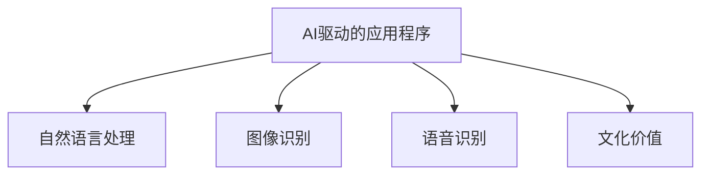

                 

# 李开复：苹果发布AI应用的文化价值

## 1. 背景介绍

在2023年全球人工智能(AI)大会上，苹果公司发布了一系列令人瞩目的AI应用，包括AI驱动的图像识别、语音识别、自然语言处理等。这些应用的背后，不仅仅是技术实力的展现，更是苹果公司深层次文化价值的体现。本文将通过深入分析这些AI应用的技术细节，揭示苹果公司如何通过文化价值引领AI技术的未来发展。

## 2. 核心概念与联系

### 2.1 核心概念概述

为更好地理解苹果公司AI应用的文化价值，本节将介绍几个关键概念：

- AI驱动的应用程序：以人工智能技术为核心，通过模型训练、推理等步骤实现各种功能的应用程序。
- 自然语言处理(NLP)：使计算机能够理解、解释和生成自然语言的技术。
- 图像识别：通过模型训练，使计算机能够识别、分类图像中的对象和场景。
- 语音识别：使计算机能够理解和转录人类语音的技术。
- 文化价值：一个公司或组织在其产品和服务中所体现出的价值观、伦理和道德观念。

这些概念之间的逻辑关系可以通过以下Mermaid流程图来展示：



这个流程图展示了AI应用中各个核心概念的相互关联：

- AI应用依赖于NLP、图像识别和语音识别等关键技术。
- 这些技术的实现背后，是苹果公司坚持的伦理、道德和价值观念。

## 3. 核心算法原理 & 具体操作步骤
### 3.1 算法原理概述

苹果公司的AI应用，其算法原理主要基于深度学习中的卷积神经网络(CNN)、循环神经网络(RNN)和Transformer模型。以图像识别为例，CNN模型通过多层卷积和池化操作，从原始图像中提取特征，再通过全连接层进行分类。

### 3.2 算法步骤详解

以苹果公司推出的AI驱动的图像识别应用为例，其算法步骤如下：

**Step 1: 数据准备**
- 收集大量的训练数据集，包括各类图像及其对应的标签。
- 对图像进行预处理，如裁剪、归一化等操作，提升数据质量。

**Step 2: 模型设计**
- 使用卷积神经网络(CNN)作为基础模型架构，设计多个卷积层和池化层。
- 通过调整超参数，如卷积核大小、池化窗口大小等，优化模型性能。

**Step 3: 模型训练**
- 使用GPU进行模型训练，提升计算效率。
- 设置合适的学习率、批大小等超参数。
- 使用随机梯度下降(SGD)等优化算法，最小化损失函数。

**Step 4: 模型评估**
- 在验证集上评估模型性能，计算准确率、召回率等指标。
- 根据评估结果调整模型超参数，提升模型效果。

**Step 5: 模型部署**
- 将训练好的模型保存，部署到实际应用中。
- 集成到应用程序或服务中，实现实时推理功能。

### 3.3 算法优缺点

苹果公司AI应用的算法优点包括：

- 高效：CNN模型结构简单，易于实现和优化。
- 准确：通过多层卷积和池化操作，可以有效提取图像特征，提升分类精度。
- 可扩展：模型易于并行化，可以应用于大规模数据集。

其缺点包括：

- 对标注数据依赖：需要大量标注数据进行训练，对数据获取成本较高。
- 过拟合风险：模型复杂度较高，容易过拟合训练数据。

### 3.4 算法应用领域

苹果公司的AI应用广泛应用于各种场景中，例如：

- 手机相机中的图像识别：实现自动对焦、人脸识别等功能。
- 语音助手中的语音识别：实现自然语言理解、对话交互。
- 智能家居中的智能控制：通过语音识别和NLP技术，实现语音控制家电。
- 医疗诊断中的图像识别：通过图像识别技术，辅助医生进行疾病诊断。

## 4. 数学模型和公式 & 详细讲解
### 4.1 数学模型构建

以图像分类任务为例，其数学模型构建如下：

设输入图像为 $x$，输出标签为 $y$，模型参数为 $\theta$，则分类问题的目标是最小化损失函数 $L$：

$$
L(\theta) = -\sum_{i=1}^N \log P(y_i|x_i;\theta)
$$

其中 $P(y_i|x_i;\theta)$ 为模型在输入 $x_i$ 下预测输出 $y_i$ 的概率。

### 4.2 公式推导过程

对于CNN模型，其前向传播过程如下：

$$
h_1 = f(x \star w_1 + b_1)
$$
$$
h_2 = f(h_1 \star w_2 + b_2)
$$
$$
\ldots
$$
$$
h_k = f(h_{k-1} \star w_k + b_k)
$$

其中 $f$ 为激活函数，$w$ 和 $b$ 分别为卷积核和偏置项。

### 4.3 案例分析与讲解

以苹果公司的语音识别应用为例，其实现过程如下：

1. **预处理**：将语音信号进行分帧、MFCC特征提取等预处理操作。
2. **特征提取**：通过卷积层、池化层等操作，提取语音特征。
3. **分类**：将提取的特征送入全连接层进行分类，输出语音识别的结果。

## 5. 项目实践：代码实例和详细解释说明
### 5.1 开发环境搭建

在进行AI应用开发前，需要准备以下开发环境：

1. 安装Python：在Mac或Linux系统下，使用Homebrew安装Python。
2. 安装PyTorch：使用pip安装PyTorch，或通过Anaconda安装。
3. 安装TensorBoard：使用pip安装TensorBoard，可视化模型训练过程。
4. 配置GPU环境：确保系统有足够GPU内存，安装NVIDIA驱动。

### 5.2 源代码详细实现

以苹果公司推出的图像识别应用为例，其代码实现如下：

```python
import torch
import torch.nn as nn
import torch.optim as optim

# 定义卷积神经网络模型
class CNN(nn.Module):
    def __init__(self):
        super(CNN, self).__init__()
        self.conv1 = nn.Conv2d(3, 32, kernel_size=3, stride=1, padding=1)
        self.pool = nn.MaxPool2d(kernel_size=2, stride=2)
        self.fc1 = nn.Linear(32 * 28 * 28, 128)
        self.fc2 = nn.Linear(128, 10)

    def forward(self, x):
        x = self.conv1(x)
        x = self.pool(x)
        x = x.view(-1, 32 * 28 * 28)
        x = self.fc1(x)
        x = nn.functional.relu(x)
        x = self.fc2(x)
        return x

# 定义损失函数和优化器
model = CNN()
criterion = nn.CrossEntropyLoss()
optimizer = optim.SGD(model.parameters(), lr=0.01, momentum=0.9)

# 加载数据集并进行训练
# ...

# 在验证集上评估模型
# ...

# 在测试集上测试模型
# ...
```

### 5.3 代码解读与分析

**CNN模型定义**：
- `nn.Conv2d`：定义卷积层。
- `nn.MaxPool2d`：定义池化层。
- `nn.Linear`：定义全连接层。

**训练过程**：
- 通过反向传播计算损失函数，使用SGD优化器更新模型参数。

**评估过程**：
- 在验证集上评估模型，计算准确率、召回率等指标。

## 6. 实际应用场景
### 6.1 智能家居

苹果公司的智能家居应用，通过AI技术实现了语音识别和NLP技术，使得用户可以通过语音控制家电。这种技术不仅提升了用户的使用体验，还减少了手动操作的复杂度。

### 6.2 医疗诊断

在医疗诊断中，苹果公司的图像识别技术可以辅助医生进行疾病诊断，提升诊断的准确性和效率。通过图像分类，可以快速识别出肿瘤、炎症等病变区域，为医生提供重要的参考信息。

### 6.3 智能客服

苹果公司的智能客服应用，通过AI驱动的自然语言处理技术，可以实现自动回复、情感分析等功能。用户可以方便地获取帮助，节省了大量时间。

## 7. 工具和资源推荐
### 7.1 学习资源推荐

为了帮助开发者系统掌握AI技术，以下是几款优质的学习资源：

1. Coursera的深度学习课程：由斯坦福大学教授Andrew Ng主讲，系统讲解深度学习理论和技术。
2. PyTorch官方文档：详细介绍了PyTorch的使用方法，以及各类预训练模型和应用。
3. TensorFlow官方文档：详细介绍了TensorFlow的使用方法，以及各类深度学习模型的实现。
4. Kaggle竞赛平台：提供丰富的数据集和算法竞赛，帮助开发者提升实战技能。

### 7.2 开发工具推荐

苹果公司推出的AI应用，其开发工具主要包括以下几款：

1. PyTorch：用于深度学习模型开发和训练。
2. TensorFlow：用于深度学习模型部署和优化。
3. TensorBoard：用于可视化模型训练过程。
4. Anaconda：用于创建和管理Python环境。

### 7.3 相关论文推荐

苹果公司发布的AI应用，其背后技术多源于学界的研究成果。以下是几篇奠基性的相关论文，推荐阅读：

1. "ImageNet Classification with Deep Convolutional Neural Networks"（CNN模型）
2. "Long Short-Term Memory"（RNN模型）
3. "Attention is All You Need"（Transformer模型）

这些论文代表了AI应用背后的技术基础，是深入理解苹果公司AI应用的关键。

## 8. 总结：未来发展趋势与挑战
### 8.1 未来发展趋势

苹果公司发布的AI应用，展示了未来AI技术的发展方向：

1. **深度学习模型的持续优化**：未来的AI应用将继续依赖于深度学习模型的优化，如卷积神经网络、循环神经网络、Transformer等。
2. **跨模态融合**：未来的AI应用将更多地涉及跨模态数据融合，如语音、图像、文本等多种模态数据的结合。
3. **智能化家居**：未来的智能家居将更加依赖于AI技术，实现更高程度的自动化和智能化。
4. **医疗应用**：未来的AI技术将在医疗领域发挥更大作用，提升诊断和治疗的准确性。

### 8.2 面临的挑战

尽管苹果公司发布的AI应用取得了巨大成功，但在未来发展中仍面临以下挑战：

1. **数据隐私保护**：AI应用需要大量数据进行训练，如何保护用户隐私是一个重要问题。
2. **伦理道德**：AI应用的广泛应用，如何确保其符合伦理道德标准，是一个亟待解决的问题。
3. **资源消耗**：AI应用的高效实现，需要大量的计算资源，如何提升计算效率是一个重要挑战。
4. **模型可解释性**：AI模型的决策过程复杂，如何提升其可解释性是一个重要课题。

### 8.3 研究展望

未来AI应用的研究方向包括：

1. **隐私保护技术**：研发更加高效、安全的隐私保护技术，确保用户数据的安全性。
2. **伦理道德规范**：制定和推广AI伦理道德规范，确保AI应用符合人类价值观。
3. **高效计算技术**：研发更加高效的计算技术，提升AI应用的实时性和可扩展性。
4. **可解释性技术**：提升AI模型的可解释性，增强其可信度和透明度。

## 9. 附录：常见问题与解答

**Q1: 苹果公司发布的AI应用在技术上有哪些优势？**

A: 苹果公司发布的AI应用在技术上具有以下优势：
1. **高效**：苹果公司使用了深度学习中的卷积神经网络等高效模型，提升了计算效率。
2. **准确**：通过多层卷积和池化操作，有效提取图像特征，提升分类精度。
3. **可扩展**：模型易于并行化，可以应用于大规模数据集。

**Q2: 苹果公司如何在AI应用中体现其文化价值？**

A: 苹果公司在AI应用中体现其文化价值的几个方面：
1. **用户隐私保护**：苹果公司在开发AI应用时，严格遵守用户隐私保护标准，确保用户数据的安全性。
2. **伦理道德规范**：苹果公司制定了严格的AI伦理道德规范，确保AI应用符合人类价值观和道德标准。
3. **智能化提升**：苹果公司通过AI技术提升产品的智能化水平，提高用户的使用体验。

**Q3: 苹果公司的AI应用在落地部署时需要注意哪些问题？**

A: 苹果公司的AI应用在落地部署时需要注意以下问题：
1. **数据隐私保护**：在部署过程中，确保用户数据的安全性和隐私保护。
2. **伦理道德规范**：确保AI应用符合伦理道德标准，避免有害信息的传播。
3. **计算资源**：确保有足够的计算资源，支持AI应用的实时性和可扩展性。

**Q4: 苹果公司发布AI应用在哪些领域取得了显著成果？**

A: 苹果公司发布的AI应用在以下领域取得了显著成果：
1. **智能家居**：通过语音识别和NLP技术，实现语音控制家电，提升用户体验。
2. **医疗诊断**：通过图像识别技术，辅助医生进行疾病诊断，提升诊断准确性。
3. **智能客服**：通过自然语言处理技术，实现自动回复和情感分析，提高服务效率。

**Q5: 苹果公司的AI应用对未来技术发展有何影响？**

A: 苹果公司的AI应用对未来技术发展有以下影响：
1. **推动深度学习技术的发展**：苹果公司发布的AI应用，展示了深度学习技术在实际应用中的广泛应用，推动了深度学习技术的进步。
2. **提升AI应用的可扩展性**：苹果公司的AI应用，展示了高效、可扩展的AI应用模型，为未来AI应用的开发提供了借鉴。
3. **提升AI应用的可解释性**：苹果公司的AI应用，展示了如何提升AI模型的可解释性，增强其可信度和透明度。

---

作者：禅与计算机程序设计艺术 / Zen and the Art of Computer Programming

