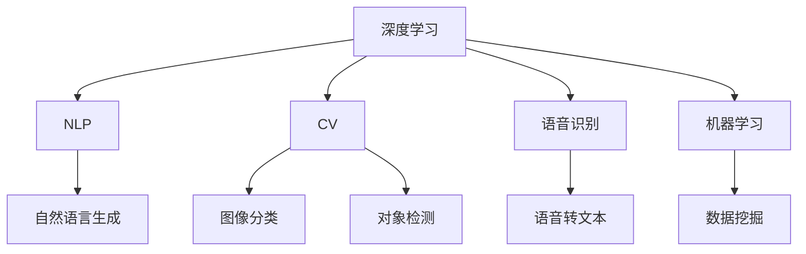

                 

# 李开复：苹果发布AI应用的未来展望

> 关键词：苹果,人工智能,未来展望,AI应用,创新,前沿技术

## 1. 背景介绍

近年来，人工智能技术飞速发展，AI应用场景日益丰富。作为科技界的巨头，苹果公司一直积极布局人工智能领域，不仅推出了Siri等产品，还在机器学习、图像识别、自然语言处理等多方面取得了显著进展。本文将聚焦于苹果公司发布的一系列AI应用，探讨其背后的技术原理，展望未来发展趋势。

## 2. 核心概念与联系

### 2.1 核心概念概述

在人工智能领域，苹果公司研发的应用涉及多个核心概念，包括：

- **深度学习**：通过多层神经网络模型实现的学习算法，可以有效处理大规模数据集。
- **自然语言处理**（Natural Language Processing, NLP）：使计算机能够理解和生成人类语言的技术。
- **计算机视觉**（Computer Vision, CV）：使计算机能够“看”和“理解”图像和视频的技术。
- **语音识别**（Speech Recognition）：将语音转换为文本的技术。
- **机器学习**：使计算机通过数据分析和模式识别进行自我优化的技术。

这些核心概念相互交织，共同构成了苹果公司AI应用的基石。

### 2.2 核心概念原理和架构的 Mermaid 流程图



这个图表展示了苹果公司AI应用的基本架构。从深度学习作为基础，经过NLP、CV、语音识别和机器学习等技术的协同作用，实现了语音识别、自然语言处理、图像分类等多个AI应用场景。

## 3. 核心算法原理 & 具体操作步骤

### 3.1 算法原理概述

苹果公司发布的AI应用，主要基于深度学习和相关技术。其算法原理可以概括为以下几个方面：

1. **数据预处理**：通过数据清洗、归一化、降维等技术，将原始数据转换为模型可以处理的格式。
2. **模型训练**：使用深度学习框架（如TensorFlow、PyTorch等）训练神经网络模型，优化模型参数。
3. **模型部署**：将训练好的模型部署到实际应用中，进行推理和预测。

### 3.2 算法步骤详解

以苹果公司发布的Siri为例，其工作流程如下：

1. **语音采集**：用户通过麦克风输入语音，转换成数字信号。
2. **语音识别**：使用深度学习模型将数字信号转换为文本。
3. **自然语言理解**（NLU）：使用NLP技术理解文本的意图和语义。
4. **自然语言生成**（NLG）：使用NLP技术生成响应文本。
5. **语音合成**：使用深度学习模型将文本转换为语音，并通过扬声器输出。

### 3.3 算法优缺点

苹果公司AI应用的优点在于其强大的算法实力和丰富的应用场景。深度学习和相关技术的结合，使得Siri等应用能够高效地处理语音和文本信息，提供流畅的交互体验。

然而，这些应用的缺点也显而易见：

- **资源消耗大**：深度学习模型通常需要较大的计算资源和存储空间。
- **训练时间长**：高质量模型的训练通常需要大量时间和数据。
- **隐私问题**：语音和文本数据涉及用户隐私，如何保障数据安全是一个重要挑战。

### 3.4 算法应用领域

苹果公司的AI应用主要应用于以下几个领域：

1. **自然语言处理**：如Siri语音助手，能够理解和生成自然语言。
2. **图像识别**：如Face ID面部识别，能够识别用户的面部特征。
3. **语音识别**：如Siri语音识别，能够将语音转换为文本。
4. **计算机视觉**：如Apple Maps地图应用，能够识别和理解图像中的位置信息。
5. **推荐系统**：如Apple Music音乐推荐，能够根据用户的听歌习惯推荐音乐。

这些应用不仅提升了用户体验，还为苹果公司开辟了新的收入来源。

## 4. 数学模型和公式 & 详细讲解 & 举例说明

### 4.1 数学模型构建

以Siri的自然语言处理为例，其主要模型包括以下部分：

- **RNN（循环神经网络）**：用于处理序列数据，如时间序列的语音信号。
- **CNN（卷积神经网络）**：用于提取文本中的特征。
- **Attention Mechanism**：用于关注输入序列中重要的部分。

这些模型通过深度学习框架进行构建，并使用反向传播算法进行训练。

### 4.2 公式推导过程

以Siri的语音识别为例，其基本模型架构为：

1. **声学模型**：将语音信号转换为声学特征。
2. **语言模型**：根据声学特征预测文本。

声学模型的公式为：

$$
P(w|x) = \frac{P(x|w)P(w)}{P(x)}
$$

其中，$P(w|x)$表示在给定语音信号$x$的条件下，文本$w$的概率，$P(x|w)$表示在文本$w$的条件下，语音信号$x$的概率，$P(w)$表示文本$w$的先验概率，$P(x)$表示语音信号$x$的概率。

语言模型的公式为：

$$
P(w_1, w_2, ..., w_n) = \prod_{i=1}^{n} P(w_i | w_{i-1})
$$

其中，$P(w_1, w_2, ..., w_n)$表示文本$w_1, w_2, ..., w_n$的概率，$P(w_i | w_{i-1})$表示在给定前一个文本$w_{i-1}$的条件下，当前文本$w_i$的概率。

### 4.3 案例分析与讲解

以苹果公司发布的Emotion Detection应用为例，其核心技术是计算机视觉和机器学习。该应用使用摄像头捕捉用户的面部表情，并通过深度学习模型分析表情特征，识别用户的情绪。其基本流程如下：

1. **数据预处理**：对摄像头捕捉的图像进行去噪、裁剪、归一化等处理。
2. **特征提取**：使用卷积神经网络（CNN）提取面部特征。
3. **情绪分类**：使用机器学习模型（如支持向量机SVM）对提取的特征进行分类，识别用户的情绪。

## 5. 项目实践：代码实例和详细解释说明

### 5.1 开发环境搭建

要搭建苹果公司的AI应用开发环境，需要以下步骤：

1. **安装Python和相关库**：如TensorFlow、Keras、OpenCV等。
2. **配置环境**：设置Python路径，安装必要的依赖库。
3. **搭建训练环境**：使用Jupyter Notebook或PyCharm等IDE进行开发。

### 5.2 源代码详细实现

以Emotion Detection应用为例，其核心代码如下：

```python
from tensorflow.keras.applications import VGG16
from tensorflow.keras.models import Sequential
from tensorflow.keras.layers import Dense, Flatten
from tensorflow.keras.preprocessing.image import ImageDataGenerator

# 定义模型
model = Sequential([
    VGG16(weights='imagenet', include_top=False, input_shape=(224, 224, 3)),
    Flatten(),
    Dense(128, activation='relu'),
    Dense(3, activation='softmax')
])

# 编译模型
model.compile(optimizer='adam', loss='categorical_crossentropy', metrics=['accuracy'])

# 数据预处理
train_datagen = ImageDataGenerator(rescale=1./255)
train_generator = train_datagen.flow_from_directory(
    'train',
    target_size=(224, 224),
    batch_size=32,
    class_mode='categorical'
)

# 训练模型
model.fit(
    train_generator,
    epochs=10,
    validation_data=val_generator,
    validation_steps=10
)
```

### 5.3 代码解读与分析

这段代码展示了如何使用VGG16模型进行面部表情分类。VGG16是一个经典的卷积神经网络，用于特征提取。通过ImageDataGenerator对数据进行预处理，使用Flatten层将特征展平，再通过Dense层进行分类。最后使用softmax函数将输出转换为概率分布。

### 5.4 运行结果展示

训练完成后，可以使用模型对新的面部图像进行情绪识别。例如：

```python
from tensorflow.keras.preprocessing import image
import numpy as np

# 加载图像
img_path = 'test.jpg'
img = image.load_img(img_path, target_size=(224, 224))
img_array = image.img_to_array(img)
img_array = np.expand_dims(img_array, axis=0)

# 预测情绪
predictions = model.predict(img_array)
emotion = classes[np.argmax(predictions)]
```

这段代码加载测试图像，使用模型进行预测，输出情绪分类结果。

## 6. 实际应用场景

### 6.1 自然语言处理

苹果公司发布的Siri语音助手和Apple News智能推送功能，都是自然语言处理应用的典型代表。Siri通过语音识别和自然语言处理技术，能够理解用户的指令并给出响应。Apple News则通过自然语言处理技术，智能分析新闻文章的内容，推荐用户感兴趣的文章。

### 6.2 图像识别

苹果公司发布的Face ID面部识别和Apple Maps地图应用，都是图像识别技术的典型应用。Face ID使用深度学习模型识别用户的面部特征，验证用户的身份。Apple Maps则使用计算机视觉技术，识别和理解图像中的位置信息，提供地图导航服务。

### 6.3 语音识别

苹果公司发布的Siri语音识别，是语音识别技术的典型应用。Siri能够将用户的语音转换为文本，并进行自然语言处理，回答用户的问题。

### 6.4 未来应用展望

未来，苹果公司的AI应用将在更多领域取得突破，如智能医疗、智能家居、智能驾驶等。以下是几个可能的未来应用：

1. **智能医疗**：苹果公司可以通过计算机视觉技术，帮助医生进行医学图像分析，辅助诊断疾病。
2. **智能家居**：苹果公司可以通过语音识别和自然语言处理技术，构建智能家居系统，实现语音控制家电、智能推荐家居场景等功能。
3. **智能驾驶**：苹果公司可以通过计算机视觉和机器学习技术，辅助自动驾驶系统的决策。

## 7. 工具和资源推荐

### 7.1 学习资源推荐

要深入了解苹果公司的AI应用，可以参考以下学习资源：

1. **Apple Developer网站**：提供了详细的开发文档和技术支持。
2. **机器学习课程**：如Coursera上的《深度学习专项课程》。
3. **论文和书籍**：如《Deep Learning》（Ian Goodfellow等著）、《Hands-On Machine Learning with Scikit-Learn and TensorFlow》。

### 7.2 开发工具推荐

要开发苹果公司的AI应用，可以参考以下工具：

1. **PyTorch和TensorFlow**：两个主流的深度学习框架，适合搭建和训练AI模型。
2. **Keras**：高层API，可以快速搭建和训练深度学习模型。
3. **OpenCV**：用于图像处理和计算机视觉任务。

### 7.3 相关论文推荐

要深入了解苹果公司的AI应用，可以参考以下论文：

1. **《Deep Learning for Scene Recognition》**：介绍了苹果公司使用深度学习技术进行图像分类的方法。
2. **《Machine Learning for System Management》**：介绍了苹果公司使用机器学习技术进行系统管理的方案。
3. **《Voice Controlled Interaction》**：介绍了苹果公司使用自然语言处理技术进行语音助手开发的方案。

## 8. 总结：未来发展趋势与挑战

### 8.1 研究成果总结

苹果公司发布的AI应用，展示了深度学习技术的强大应用潜力。这些应用不仅提升了用户体验，还为苹果公司带来了新的增长点。未来，苹果公司将继续在AI领域进行深入研究，推出更多创新的AI产品。

### 8.2 未来发展趋势

未来，苹果公司的AI应用将在以下几个方面取得突破：

1. **跨模态学习**：融合视觉、语音、文本等多种模态数据，提升AI应用的效果。
2. **端到端训练**：通过端到端训练，提升AI应用的一致性和鲁棒性。
3. **联邦学习**：通过分布式训练，提升AI应用的隐私保护和安全。
4. **智能助理**：开发更加智能、人性化的语音助手和智能推荐系统。

### 8.3 面临的挑战

苹果公司在AI应用方面也面临诸多挑战：

1. **数据隐私**：如何在保证数据隐私的前提下，获取高质量的数据进行训练。
2. **计算资源**：如何高效利用计算资源，训练高效、精简的AI模型。
3. **模型可解释性**：如何提升AI模型的可解释性，让用户信任和接受AI应用。

### 8.4 研究展望

未来，苹果公司需要在数据隐私保护、计算资源优化、模型可解释性等方面进行深入研究，进一步提升AI应用的效果和可信度。同时，苹果公司需要与其他科技公司、研究机构合作，推动AI技术的发展和应用。

## 9. 附录：常见问题与解答

**Q1: 苹果公司是如何进行AI应用的开发的？**

A: 苹果公司通过以下步骤进行AI应用的开发：

1. **数据收集**：通过摄像头、麦克风等设备，收集用户的数据。
2. **数据清洗**：对收集的数据进行清洗、去噪、归一化等处理。
3. **模型训练**：使用深度学习框架（如TensorFlow、PyTorch）进行模型训练。
4. **模型优化**：对模型进行优化，提升其性能和效率。
5. **模型部署**：将训练好的模型部署到实际应用中，进行推理和预测。

**Q2: 苹果公司发布的AI应用有哪些？**

A: 苹果公司发布的AI应用包括：

1. **Siri语音助手**：使用深度学习技术进行语音识别和自然语言处理。
2. **Face ID面部识别**：使用计算机视觉技术进行人脸识别。
3. **Apple News智能推送**：使用自然语言处理技术进行新闻推荐。
4. **Apple Maps地图应用**：使用计算机视觉技术进行位置识别和导航。

**Q3: 苹果公司未来的AI应用方向有哪些？**

A: 苹果公司未来的AI应用方向包括：

1. **智能医疗**：通过计算机视觉技术进行医学图像分析，辅助诊断疾病。
2. **智能家居**：通过语音识别和自然语言处理技术，实现语音控制家电和智能推荐家居场景。
3. **智能驾驶**：通过计算机视觉和机器学习技术，辅助自动驾驶系统的决策。

**Q4: 苹果公司的AI应用面临哪些挑战？**

A: 苹果公司的AI应用面临以下挑战：

1. **数据隐私**：如何在保证数据隐私的前提下，获取高质量的数据进行训练。
2. **计算资源**：如何高效利用计算资源，训练高效、精简的AI模型。
3. **模型可解释性**：如何提升AI模型的可解释性，让用户信任和接受AI应用。

---

作者：禅与计算机程序设计艺术 / Zen and the Art of Computer Programming

