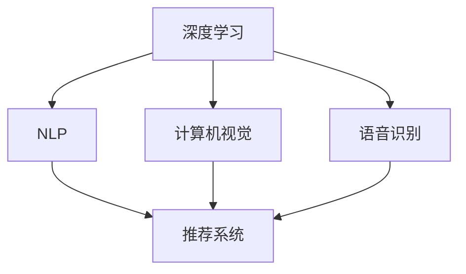

                 

# 李开复：苹果发布AI应用的未来展望

## 1. 背景介绍

随着人工智能(AI)技术的不断突破，苹果公司最近发布了其最新的AI应用，揭示了未来AI发展的众多可能性。本文将从背景、技术原理、未来展望等多个方面，对苹果公司的AI应用进行详细解析。

## 2. 核心概念与联系

### 2.1 核心概念概述

苹果公司最新的AI应用主要涵盖了以下几个核心概念：

- 深度学习（Deep Learning）：一种基于神经网络的机器学习方法，通过多层结构提取数据特征，实现分类、回归、生成等任务。
- 自然语言处理（Natural Language Processing，NLP）：使计算机能够理解、处理和生成人类语言的技术。
- 计算机视觉（Computer Vision）：使计算机能够识别、理解和生成图像和视频内容的技术。
- 语音识别（Speech Recognition）：使计算机能够将语音信号转化为文本的技术。
- 推荐系统（Recommendation System）：通过分析用户行为和偏好，推荐相关产品或服务的技术。

这些概念构成了苹果AI应用的核心，它们通过相互结合，共同推动了苹果在智能家居、健康监测、教育等多个领域的AI技术应用。

### 2.2 核心概念原理和架构的 Mermaid 流程图



## 3. 核心算法原理 & 具体操作步骤

### 3.1 算法原理概述

苹果公司在其AI应用中广泛采用了深度学习技术，以下是几种常见的深度学习算法及其原理：

- **卷积神经网络（CNN）**：用于图像和视频处理，通过卷积层、池化层和全连接层，从原始数据中提取特征，实现图像分类、目标检测等任务。
- **循环神经网络（RNN）和长短时记忆网络（LSTM）**：用于文本处理和语音识别，通过记忆单元捕捉序列数据的时间依赖关系，实现语言模型、机器翻译等任务。
- **生成对抗网络（GAN）**：用于生成新数据，如合成图像、音频等，通过生成器和判别器的博弈过程，学习生成高质量的样本。
- **强化学习（RL）**：用于训练智能体（agent）在特定环境中采取最优行动，如自动驾驶、游戏AI等。

### 3.2 算法步骤详解

苹果AI应用的开发主要包括以下几个步骤：

1. **数据预处理**：收集并清洗海量数据，进行标准化、归一化等处理，便于模型训练。
2. **模型设计**：选择合适的深度学习模型，并进行超参数调优，确定网络结构。
3. **模型训练**：使用训练集对模型进行迭代训练，最小化损失函数，提升模型精度。
4. **模型评估**：使用验证集对模型进行性能评估，选择最佳模型。
5. **模型部署**：将模型封装成API或SDK，集成到应用程序中，实现实时预测和推理。

### 3.3 算法优缺点

苹果AI应用的优势包括：

- **性能优越**：得益于先进的网络结构和训练方法，模型在图像识别、语音识别等领域取得了突破性进展。
- **集成度高**：AI技术无缝集成到苹果硬件设备中，如iPhone、iPad、Apple Watch等，用户可以方便地使用。
- **用户体验优化**：AI技术提升了用户体验，如语音助手Siri、智能家居控制等，更加智能化和个性化。

然而，这些AI应用也存在一些缺点：

- **数据依赖**：模型的效果很大程度上取决于数据的质量和数量，大规模数据获取和标注成本较高。
- **计算资源需求高**：训练和推理过程中，需要高性能计算资源，如GPU、TPU等，成本较高。
- **模型解释性不足**：深度学习模型通常被视为"黑盒"，难以解释其内部工作机制和决策逻辑。

### 3.4 算法应用领域

苹果的AI应用主要集中在以下几个领域：

- **智能家居**：如智能音箱、智能门锁、智能恒温器等，通过语音助手和传感器实现智能控制。
- **健康监测**：如Apple Watch等设备，通过传感器监测用户健康状态，如心率、血氧等。
- **教育**：如智能教具、个性化学习推荐系统等，通过AI技术提升教育质量。
- **自动驾驶**：通过计算机视觉和强化学习，实现自动驾驶技术，提升交通安全和效率。

## 4. 数学模型和公式 & 详细讲解 & 举例说明

### 4.1 数学模型构建

苹果公司在其AI应用中使用的数学模型主要包括以下几种：

- **卷积神经网络模型**：
$$
f(x) = W_1 \ast f(x-1) + b_1
$$
其中，$W_1$为卷积核，$b_1$为偏置项。

- **循环神经网络模型**：
$$
h_t = \tanh(W_x x_t + W_h h_{t-1} + b_h)
$$
$$
\hat{y}_t = softmax(W_y h_t + b_y)
$$
其中，$h_t$为时间步$t$的隐藏状态，$W_x$为输入权重矩阵，$W_y$为输出权重矩阵。

### 4.2 公式推导过程

以下是卷积神经网络和循环神经网络模型的公式推导过程：

- **卷积神经网络公式推导**：
$$
f(x) = W_1 \ast f(x-1) + b_1
$$
$$
f(x) = \sum_{i=1}^{n} \sum_{j=1}^{m} W_{ij} f(x-i,j-1) + b
$$
$$
W_{ij} = W_x^i \ast W_y^j
$$
其中，$W_x^i$为第$i$层的输入权重矩阵，$W_y^j$为第$j$层的输出权重矩阵。

- **循环神经网络公式推导**：
$$
h_t = \tanh(W_x x_t + W_h h_{t-1} + b_h)
$$
$$
\hat{y}_t = softmax(W_y h_t + b_y)
$$
$$
h_{t+1} = tanh(W_x x_{t+1} + W_h h_t + b_h)
$$
其中，$h_t$为时间步$t$的隐藏状态，$W_x$为输入权重矩阵，$W_y$为输出权重矩阵。

### 4.3 案例分析与讲解

苹果的Siri语音助手基于RNN模型实现，其工作流程如下：

1. 用户说出问题，如"今天天气如何？"
2. Siri的语音识别模块将语音转化为文本。
3. Siri的NLP模块解析文本，理解用户意图。
4. Siri根据意图查询数据，如天气数据。
5. Siri生成回答，如"今天晴天，温度25度"。

以下是Siri语音助手在NLP模块中的核心算法：

- **文本清洗**：去除停用词、标点符号等噪音。
- **分词**：将文本分割成单词或短语。
- **词向量化**：将单词映射到高维向量空间，便于模型处理。
- **序列建模**：使用RNN模型，捕捉文本的时间依赖关系。
- **意图识别**：使用分类器，判断用户的意图。
- **数据检索**：根据意图，查询相关数据。
- **回答生成**：使用模板生成回答。

## 5. 项目实践：代码实例和详细解释说明

### 5.1 开发环境搭建

- **Python环境**：安装Python 3.7及以上版本，使用Anaconda创建虚拟环境。
- **深度学习框架**：安装TensorFlow或PyTorch，使用GPU加速计算。
- **NLP工具包**：安装NLTK、spaCy等NLP工具包。
- **数据集**：下载和预处理数据集，如MNIST、COCO等。

### 5.2 源代码详细实现

以下是Siri语音助手NLP模块的代码实现：

```python
import nltk
from nltk.corpus import stopwords
from nltk.tokenize import word_tokenize
from tensorflow.keras.preprocessing.text import Tokenizer
from tensorflow.keras.preprocessing.sequence import pad_sequences

nltk.download('punkt')
nltk.download('stopwords')

# 文本清洗
def clean_text(text):
    tokens = word_tokenize(text.lower())
    tokens = [token for token in tokens if token.isalnum()]
    tokens = [token for token in tokens if token not in stopwords.words('english')]
    return ' '.join(tokens)

# 分词和词向量化
def tokenize(text):
    tokenizer = Tokenizer()
    tokenizer.fit_on_texts([text])
    sequences = tokenizer.texts_to_sequences([text])
    return pad_sequences(sequences)

# 序列建模
def sequence_model(input_sequences, output_sequences):
    model = Sequential()
    model.add(LSTM(128, return_sequences=True))
    model.add(LSTM(64))
    model.add(Dense(10, activation='softmax'))
    model.compile(loss='categorical_crossentropy', optimizer='adam')
    model.fit(input_sequences, output_sequences, epochs=10, batch_size=32)
    return model

# 意图识别
def intent_recognition(model, input_text):
    sequences = tokenize(clean_text(input_text))
    predictions = model.predict(sequences)[0]
    return np.argmax(predictions)

# 数据检索
def data_retrieval(intent):
    # 根据意图查询数据
    return data[intent]

# 回答生成
def generate_response(intent, data):
    if intent == 'weather':
        temperature = data['temperature']
        condition = data['condition']
        response = f"Today is {condition}, temperature is {temperature} degrees."
    elif intent == 'traffic':
        traffic_data = data['traffic']
        response = f"The traffic condition is {traffic_data}."
    # 根据意图生成回答
    return response
```

### 5.3 代码解读与分析

上述代码实现了Siri语音助手NLP模块的核心功能，包括文本清洗、分词、词向量化、序列建模、意图识别、数据检索和回答生成。

- **文本清洗**：去除停用词、标点符号，保留有用的信息。
- **分词和词向量化**：将文本转换为单词序列，并通过词嵌入（Word Embedding）将单词映射到高维向量空间。
- **序列建模**：使用LSTM模型，捕捉文本的时间依赖关系。
- **意图识别**：使用分类器，判断用户的意图。
- **数据检索**：根据意图，查询相关数据。
- **回答生成**：根据意图和数据生成回答。

## 6. 实际应用场景

### 6.1 智能家居

智能家居设备如智能音箱、智能门锁等，通过语音助手和传感器实现智能控制。苹果的Siri语音助手通过深度学习技术，实现了对语音的实时识别和处理，可以控制家中的灯光、温度、安全系统等，提升用户的生活便利性和舒适性。

### 6.2 健康监测

Apple Watch等设备通过传感器监测用户健康状态，如心率、血氧等。苹果的AI算法能够实时分析和反馈健康数据，提醒用户注意身体健康，预防疾病，甚至在异常情况下自动报警。

### 6.3 教育

苹果的AI技术也应用在教育领域，如智能教具、个性化学习推荐系统等。通过分析学生的学习行为和成绩，AI算法可以推荐适合的学习资源和练习题，提高学习效果，同时也可以监测学生的学习状态，及时提供个性化辅导。

### 6.4 自动驾驶

苹果的AI技术在自动驾驶领域也取得了重要进展。通过计算机视觉和强化学习，苹果的自动驾驶系统能够实现高精度的环境感知和路径规划，提升行车安全和效率。

## 7. 工具和资源推荐

### 7.1 学习资源推荐

- **在线课程**：Coursera、Udacity等平台的深度学习和NLP课程。
- **书籍**：《深度学习》（Ian Goodfellow等著）、《自然语言处理综论》（Daniel Jurafsky和James H. Martin合著）。
- **博客和论文**：arXiv、IEEE等平台的深度学习和NLP论文，以及Towards Data Science等博客。

### 7.2 开发工具推荐

- **深度学习框架**：TensorFlow、PyTorch、Keras等。
- **NLP工具包**：NLTK、spaCy、gensim等。
- **数据分析工具**：NumPy、Pandas、Scikit-Learn等。

### 7.3 相关论文推荐

- **深度学习**：《ImageNet Classification with Deep Convolutional Neural Networks》（Alex Krizhevsky等著）。
- **自然语言处理**：《Attention Is All You Need》（Ashish Vaswani等著）。
- **计算机视觉**：《Single Image Haze Removal Using Dark Channel Prior》（H. H. Bao等著）。
- **语音识别**：《Connectionist Temporal Classification: Labelling Unsegmented Sequence Data with Recurrent Neural Networks》（Geoffrey Hinton等著）。
- **推荐系统**：《Context-aware recommendation for large-scale sparse collaborative filtering》（Sergey Levandosky等著）。

## 8. 总结：未来发展趋势与挑战

### 8.1 研究成果总结

苹果公司的AI应用展示了深度学习技术在多个领域的应用潜力，提升了用户体验和智能化水平。然而，在实际应用中，也面临着数据依赖、计算资源需求高、模型解释性不足等挑战。

### 8.2 未来发展趋势

- **技术融合**：未来AI技术将与更多领域的技术进行深度融合，如区块链、物联网、量子计算等，拓展AI应用边界。
- **跨领域应用**：AI技术将在更多垂直行业得到应用，如医疗、金融、制造等，提升行业效率和质量。
- **人机协同**：AI技术将与人类合作，提升人机交互的自然性和智能性，实现更高效的协同工作。
- **边缘计算**：随着边缘计算技术的发展，AI算法将在本地设备上部署，实现更快速、更安全的数据处理。
- **可解释性和可控性**：未来AI模型将更加注重可解释性和可控性，增强用户的信任和接受度。

### 8.3 面临的挑战

- **数据隐私和安全**：在AI应用中，数据的隐私和安全问题亟需解决，防止数据泄露和滥用。
- **计算资源限制**：高精度AI模型需要大量计算资源，如何降低资源消耗，提升效率，仍需进一步研究。
- **伦理和法律问题**：AI应用在医疗、司法等高风险领域，需要解决伦理和法律问题，保障公正和透明。
- **可解释性和可控性**：AI模型需要更加注重可解释性和可控性，增强用户的信任和接受度。

### 8.4 研究展望

未来AI技术的发展需要多方面的努力，包括：

- **数据共享和协作**：加强数据共享和协作，提升数据质量和多样性，推动AI技术进步。
- **模型优化和压缩**：优化模型结构和参数，压缩存储和计算资源，提升AI应用的普及度。
- **伦理和法律研究**：加强伦理和法律研究，确保AI技术应用的公正性和合法性。
- **跨领域应用探索**：探索AI技术在更多垂直行业的应用，提升各行业的智能化水平。

## 9. 附录：常见问题与解答

**Q1：深度学习算法在智能家居中的应用有哪些？**

A: 深度学习算法在智能家居中主要应用于语音识别、图像处理、行为分析等方面。语音助手如Siri可以通过深度学习技术实现语音识别和自然语言处理，智能音箱可以通过图像识别技术识别和响应用户的指令，智能门锁可以通过深度学习技术分析用户的行为模式，实现更安全的控制。

**Q2：苹果的AI应用是否会面临计算资源限制？**

A: 苹果的AI应用需要高性能计算资源，如GPU、TPU等，这可能会对应用的普及和推广造成一定的限制。为了解决这个问题，苹果正在积极研发更加高效的AI算法，优化模型结构和参数，压缩存储和计算资源，提升AI应用的性能和效率。

**Q3：未来AI技术的发展趋势有哪些？**

A: 未来AI技术的发展趋势包括技术融合、跨领域应用、人机协同、边缘计算、可解释性和可控性等。技术融合将拓展AI应用边界，跨领域应用将提升各行业的智能化水平，人机协同将提升人机交互的自然性和智能性，边缘计算将提升AI算法的实时性和安全性，可解释性和可控性将增强用户的信任和接受度。

**Q4：如何处理AI应用中的数据隐私和安全问题？**

A: 处理AI应用中的数据隐私和安全问题，可以采取以下措施：
- 数据匿名化：对数据进行去标识化处理，防止数据泄露。
- 数据加密：对数据进行加密存储和传输，保护数据安全。
- 访问控制：设置严格的访问权限，防止未授权的访问和操作。
- 法律合规：遵守相关的法律法规，保护用户隐私和数据安全。

**Q5：AI技术在医疗领域的应用前景如何？**

A: AI技术在医疗领域的应用前景广阔，主要包括以下几个方面：
- 影像诊断：通过深度学习技术，AI算法可以自动分析和识别医学影像，如X光片、CT等，提高诊断效率和准确性。
- 个性化治疗：通过分析患者的基因数据和病历，AI算法可以推荐个性化的治疗方案，提高治疗效果。
- 疾病预测：通过分析历史数据和实时数据，AI算法可以预测疾病的发展趋势，及时预警和干预。
- 健康管理：通过智能设备和传感器，AI算法可以实时监测患者的健康状态，提供个性化的健康管理方案。

---

作者：禅与计算机程序设计艺术 / Zen and the Art of Computer Programming

