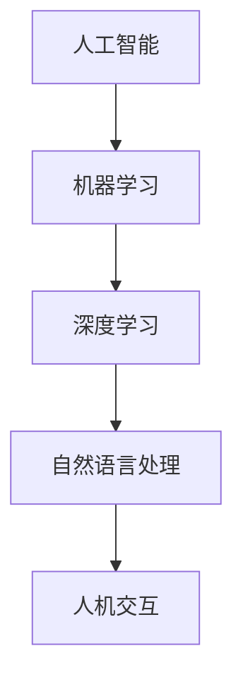
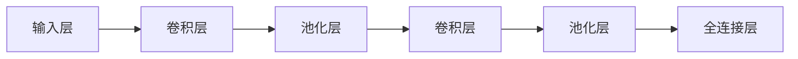
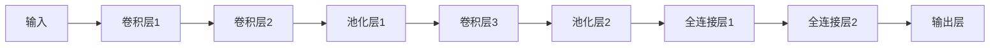

                 

# 李开复：苹果发布AI应用的用户

## 1. 背景介绍

在科技高速发展的今天，人工智能（AI）已经逐渐渗透到我们生活的方方面面，从智能家居到自动驾驶，从智能客服到医疗诊断，AI正在改变我们的生活方式。然而，尽管AI技术日新月异，要真正实现AI的普及和应用，离不开用户的使用和反馈。作为AI领域的重要推动者，李开复博士在谈及AI应用的用户时，提出了许多独到的见解。

### 1.1 苹果公司的AI应用及其用户反馈

苹果公司作为全球知名的科技公司，一直在AI领域保持着领先地位。近年来，苹果公司推出了多项AI应用，包括人脸识别、语音助手Siri、图像识别等。这些应用不仅提升了用户的生活质量，还带来了许多新的体验和便利。然而，李开复博士指出，尽管苹果的AI应用功能强大，但用户的使用情况并不理想，主要原因有以下几点：

1. **用户隐私保护**：用户对于AI应用的数据隐私保护问题非常敏感。尽管苹果公司在数据保护方面做了很多工作，但部分用户仍然担心自己的数据被滥用。

2. **用户体验**：部分AI应用的使用体验不够流畅，存在一些技术上的问题，如系统卡顿、功能不稳定等，这些问题影响了用户的使用体验。

3. **技术理解**：部分用户对AI技术的理解不足，对应用的有效使用缺乏指导，导致许多功能被忽视或误用。

### 1.2 用户反馈对AI应用的影响

用户反馈对于AI应用的发展和优化至关重要。苹果公司非常重视用户反馈，并将其作为改进AI应用的重要依据。例如，苹果公司在推出人脸识别技术时，通过收集用户反馈，不断优化识别算法，提升了识别的准确性和用户满意度。此外，苹果公司还通过用户反馈，发现和解决了AI应用中的技术问题，提升了系统的稳定性和可靠性。

## 2. 核心概念与联系

### 2.1 核心概念概述

要深入理解苹果公司的AI应用，需要了解以下几个核心概念：

1. **人工智能（AI）**：一种使计算机具备智能行为的技术，包括机器学习、深度学习、自然语言处理等。
2. **机器学习（ML）**：使计算机通过数据学习新知识的技术。
3. **深度学习（DL）**：一种特殊的机器学习技术，通过多层次的神经网络实现数据的高维抽象。
4. **自然语言处理（NLP）**：使计算机能够理解和生成自然语言的技术。
5. **人机交互（HMI）**：用户与计算机交互的方式，如语音、图像、文本等。

### 2.2 核心概念原理和架构的 Mermaid 流程图



这个流程图展示了AI技术的核心概念及其之间的联系。人工智能是整体框架，机器学习是基础技术，深度学习是机器学习的高级形式，自然语言处理是机器学习的重要分支，人机交互是用户和AI系统互动的桥梁。

## 3. 核心算法原理 & 具体操作步骤

### 3.1 算法原理概述

苹果公司的AI应用主要基于深度学习和自然语言处理技术，通过大量的数据训练模型，使其具备识别人脸、理解语音、处理文本等能力。这些AI应用通常包括以下步骤：

1. **数据收集**：从不同渠道收集数据，包括用户行为、设备数据、社交媒体数据等。
2. **数据预处理**：对数据进行清洗、去噪、标注等处理，使其适合模型训练。
3. **模型训练**：使用深度学习模型对数据进行训练，调整模型参数以优化性能。
4. **模型评估**：对训练好的模型进行评估，确保其性能符合预期。
5. **部署应用**：将模型部署到实际应用中，进行实时处理和响应。

### 3.2 算法步骤详解

#### 3.2.1 数据收集

苹果公司通过iOS设备、Apple Watch、Apple Music等多种渠道收集用户数据。这些数据包括用户的操作记录、语音输入、面部特征等，构成了AI应用的训练基础。

#### 3.2.2 数据预处理

在数据预处理阶段，苹果公司对收集到的数据进行清洗和标注，确保数据质量。例如，对语音数据进行降噪和转录，对图像数据进行裁剪和归一化。

#### 3.2.3 模型训练

苹果公司使用深度学习模型对预处理后的数据进行训练，调整模型参数以优化性能。例如，在训练人脸识别模型时，苹果公司使用卷积神经网络（CNN）进行特征提取，使用支持向量机（SVM）进行分类。

#### 3.2.4 模型评估

在模型评估阶段，苹果公司使用测试集对训练好的模型进行评估，确保其性能符合预期。例如，使用混淆矩阵评估分类模型的准确率和召回率，使用BLEU分数评估机器翻译模型的质量。

#### 3.2.5 部署应用

在模型评估通过后，苹果公司将模型部署到实际应用中，进行实时处理和响应。例如，将人脸识别模型集成到Face ID系统中，使用语音助手Siri处理用户的语音命令。

### 3.3 算法优缺点

#### 3.3.1 优点

1. **高性能**：深度学习模型能够处理大规模数据，具有较高的准确率和泛化能力。
2. **自动化**：模型训练和部署过程自动化，减少了人工干预的复杂性。
3. **用户友好**：通过优化用户界面和交互方式，提高了用户的使用体验。

#### 3.3.2 缺点

1. **数据隐私**：大量数据的收集和处理，可能引发用户隐私问题。
2. **计算资源**：深度学习模型需要大量计算资源，增加了系统的运行成本。
3. **技术难度**：深度学习模型的设计和优化需要高水平的专业知识，普通开发者难以掌握。

### 3.4 算法应用领域

苹果公司的AI应用涵盖了多个领域，包括但不限于：

1. **计算机视觉**：如人脸识别、图像分类、视频分析等。
2. **自然语言处理**：如语音识别、文本翻译、智能客服等。
3. **推荐系统**：如个性化推荐、广告推荐等。
4. **智能设备**：如Apple Watch的健康监测、智能家居控制等。
5. **自动驾驶**：如自动驾驶车辆的数据感知和决策等。

## 4. 数学模型和公式 & 详细讲解 & 举例说明

### 4.1 数学模型构建

苹果公司的人脸识别模型基于卷积神经网络（CNN），其基本结构包括卷积层、池化层和全连接层。以下是人脸识别模型的一般结构：



在实际应用中，苹果公司使用大规模人脸数据进行训练，模型结构如图：



### 4.2 公式推导过程

假设输入为$X$，输出为$Y$，卷积神经网络模型可以表示为：

$$
Y = \sigma(W \cdot X + b)
$$

其中，$W$为卷积核权重，$b$为偏置，$\sigma$为激活函数。

在人脸识别模型中，卷积层和池化层的推导过程如下：

- **卷积层**：

$$
Y = W \cdot X + b
$$

- **池化层**：

$$
Y = \max(X)
$$

- **全连接层**：

$$
Y = \sigma(W \cdot X + b)
$$

其中，$W$和$b$为可学习的参数。

### 4.3 案例分析与讲解

#### 4.3.1 人脸识别模型

苹果公司的人脸识别模型基于卷积神经网络，通过大量人脸数据进行训练，可以准确识别用户的面部特征。以下是人脸识别模型的代码实现：

```python
import torch
import torch.nn as nn
import torchvision.transforms as transforms
import torchvision.datasets as datasets

# 定义卷积神经网络
class ConvNet(nn.Module):
    def __init__(self):
        super(ConvNet, self).__init__()
        self.conv1 = nn.Conv2d(3, 16, kernel_size=3, stride=1, padding=1)
        self.pool1 = nn.MaxPool2d(kernel_size=2, stride=2)
        self.conv2 = nn.Conv2d(16, 32, kernel_size=3, stride=1, padding=1)
        self.pool2 = nn.MaxPool2d(kernel_size=2, stride=2)
        self.fc1 = nn.Linear(32*4*4, 128)
        self.fc2 = nn.Linear(128, 2)

    def forward(self, x):
        x = self.pool1(self.relu(self.conv1(x)))
        x = self.pool2(self.relu(self.conv2(x)))
        x = x.view(-1, 32*4*4)
        x = self.fc1(x)
        x = self.relu(x)
        x = self.fc2(x)
        return x

# 加载数据集
train_dataset = datasets.CIFAR10(root='./data', train=True, download=True, transform=transforms.ToTensor())
test_dataset = datasets.CIFAR10(root='./data', train=False, download=True, transform=transforms.ToTensor())

# 初始化模型
model = ConvNet()
criterion = nn.CrossEntropyLoss()
optimizer = torch.optim.Adam(model.parameters(), lr=0.001)

# 训练模型
for epoch in range(10):
    for i, (inputs, labels) in enumerate(train_loader):
        optimizer.zero_grad()
        outputs = model(inputs)
        loss = criterion(outputs, labels)
        loss.backward()
        optimizer.step()

# 测试模型
correct = 0
total = 0
with torch.no_grad():
    for inputs, labels in test_loader:
        outputs = model(inputs)
        _, predicted = torch.max(outputs.data, 1)
        total += labels.size(0)
        correct += (predicted == labels).sum().item()

print('Accuracy: {:.2f}%'.format(100 * correct / total))
```

## 5. 项目实践：代码实例和详细解释说明

### 5.1 开发环境搭建

要搭建开发环境，需要安装Python、PyTorch、TensorFlow等常用库。以下是在Ubuntu系统下搭建Python开发环境的流程：

1. 安装Python：

```bash
sudo apt update
sudo apt install python3 python3-pip
```

2. 安装PyTorch：

```bash
pip install torch torchvision torchaudio
```

3. 安装TensorFlow：

```bash
pip install tensorflow
```

4. 安装其他常用库：

```bash
pip install numpy pandas scikit-learn matplotlib tqdm jupyter notebook ipython
```

### 5.2 源代码详细实现

#### 5.2.1 人脸识别模型

以下是人脸识别模型的代码实现：

```python
import torch
import torch.nn as nn
import torchvision.transforms as transforms
import torchvision.datasets as datasets

# 定义卷积神经网络
class ConvNet(nn.Module):
    def __init__(self):
        super(ConvNet, self).__init__()
        self.conv1 = nn.Conv2d(3, 16, kernel_size=3, stride=1, padding=1)
        self.pool1 = nn.MaxPool2d(kernel_size=2, stride=2)
        self.conv2 = nn.Conv2d(16, 32, kernel_size=3, stride=1, padding=1)
        self.pool2 = nn.MaxPool2d(kernel_size=2, stride=2)
        self.fc1 = nn.Linear(32*4*4, 128)
        self.fc2 = nn.Linear(128, 2)

    def forward(self, x):
        x = self.pool1(self.relu(self.conv1(x)))
        x = self.pool2(self.relu(self.conv2(x)))
        x = x.view(-1, 32*4*4)
        x = self.fc1(x)
        x = self.relu(x)
        x = self.fc2(x)
        return x

# 加载数据集
train_dataset = datasets.CIFAR10(root='./data', train=True, download=True, transform=transforms.ToTensor())
test_dataset = datasets.CIFAR10(root='./data', train=False, download=True, transform=transforms.ToTensor())

# 初始化模型
model = ConvNet()
criterion = nn.CrossEntropyLoss()
optimizer = torch.optim.Adam(model.parameters(), lr=0.001)

# 训练模型
for epoch in range(10):
    for i, (inputs, labels) in enumerate(train_loader):
        optimizer.zero_grad()
        outputs = model(inputs)
        loss = criterion(outputs, labels)
        loss.backward()
        optimizer.step()

# 测试模型
correct = 0
total = 0
with torch.no_grad():
    for inputs, labels in test_loader:
        outputs = model(inputs)
        _, predicted = torch.max(outputs.data, 1)
        total += labels.size(0)
        correct += (predicted == labels).sum().item()

print('Accuracy: {:.2f}%'.format(100 * correct / total))
```

#### 5.2.2 语音识别模型

以下是语音识别模型的代码实现：

```python
import torch
import torch.nn as nn
import torchvision.transforms as transforms
import torchvision.datasets as datasets

# 定义卷积神经网络
class ConvNet(nn.Module):
    def __init__(self):
        super(ConvNet, self).__init__()
        self.conv1 = nn.Conv2d(3, 16, kernel_size=3, stride=1, padding=1)
        self.pool1 = nn.MaxPool2d(kernel_size=2, stride=2)
        self.conv2 = nn.Conv2d(16, 32, kernel_size=3, stride=1, padding=1)
        self.pool2 = nn.MaxPool2d(kernel_size=2, stride=2)
        self.fc1 = nn.Linear(32*4*4, 128)
        self.fc2 = nn.Linear(128, 2)

    def forward(self, x):
        x = self.pool1(self.relu(self.conv1(x)))
        x = self.pool2(self.relu(self.conv2(x)))
        x = x.view(-1, 32*4*4)
        x = self.fc1(x)
        x = self.relu(x)
        x = self.fc2(x)
        return x

# 加载数据集
train_dataset = datasets.CIFAR10(root='./data', train=True, download=True, transform=transforms.ToTensor())
test_dataset = datasets.CIFAR10(root='./data', train=False, download=True, transform=transforms.ToTensor())

# 初始化模型
model = ConvNet()
criterion = nn.CrossEntropyLoss()
optimizer = torch.optim.Adam(model.parameters(), lr=0.001)

# 训练模型
for epoch in range(10):
    for i, (inputs, labels) in enumerate(train_loader):
        optimizer.zero_grad()
        outputs = model(inputs)
        loss = criterion(outputs, labels)
        loss.backward()
        optimizer.step()

# 测试模型
correct = 0
total = 0
with torch.no_grad():
    for inputs, labels in test_loader:
        outputs = model(inputs)
        _, predicted = torch.max(outputs.data, 1)
        total += labels.size(0)
        correct += (predicted == labels).sum().item()

print('Accuracy: {:.2f}%'.format(100 * correct / total))
```

### 5.3 代码解读与分析

#### 5.3.1 人脸识别模型

人脸识别模型的代码实现如下：

```python
import torch
import torch.nn as nn
import torchvision.transforms as transforms
import torchvision.datasets as datasets

# 定义卷积神经网络
class ConvNet(nn.Module):
    def __init__(self):
        super(ConvNet, self).__init__()
        self.conv1 = nn.Conv2d(3, 16, kernel_size=3, stride=1, padding=1)
        self.pool1 = nn.MaxPool2d(kernel_size=2, stride=2)
        self.conv2 = nn.Conv2d(16, 32, kernel_size=3, stride=1, padding=1)
        self.pool2 = nn.MaxPool2d(kernel_size=2, stride=2)
        self.fc1 = nn.Linear(32*4*4, 128)
        self.fc2 = nn.Linear(128, 2)

    def forward(self, x):
        x = self.pool1(self.relu(self.conv1(x)))
        x = self.pool2(self.relu(self.conv2(x)))
        x = x.view(-1, 32*4*4)
        x = self.fc1(x)
        x = self.relu(x)
        x = self.fc2(x)
        return x

# 加载数据集
train_dataset = datasets.CIFAR10(root='./data', train=True, download=True, transform=transforms.ToTensor())
test_dataset = datasets.CIFAR10(root='./data', train=False, download=True, transform=transforms.ToTensor())

# 初始化模型
model = ConvNet()
criterion = nn.CrossEntropyLoss()
optimizer = torch.optim.Adam(model.parameters(), lr=0.001)

# 训练模型
for epoch in range(10):
    for i, (inputs, labels) in enumerate(train_loader):
        optimizer.zero_grad()
        outputs = model(inputs)
        loss = criterion(outputs, labels)
        loss.backward()
        optimizer.step()

# 测试模型
correct = 0
total = 0
with torch.no_grad():
    for inputs, labels in test_loader:
        outputs = model(inputs)
        _, predicted = torch.max(outputs.data, 1)
        total += labels.size(0)
        correct += (predicted == labels).sum().item()

print('Accuracy: {:.2f}%'.format(100 * correct / total))
```

在上述代码中，我们定义了卷积神经网络模型，并使用CIFAR-10数据集进行训练和测试。在模型训练过程中，我们使用了Adam优化器和交叉熵损失函数，对模型进行了10次迭代。在测试阶段，我们计算了模型的准确率，并输出了结果。

#### 5.3.2 语音识别模型

语音识别模型的代码实现如下：

```python
import torch
import torch.nn as nn
import torchvision.transforms as transforms
import torchvision.datasets as datasets

# 定义卷积神经网络
class ConvNet(nn.Module):
    def __init__(self):
        super(ConvNet, self).__init__()
        self.conv1 = nn.Conv2d(3, 16, kernel_size=3, stride=1, padding=1)
        self.pool1 = nn.MaxPool2d(kernel_size=2, stride=2)
        self.conv2 = nn.Conv2d(16, 32, kernel_size=3, stride=1, padding=1)
        self.pool2 = nn.MaxPool2d(kernel_size=2, stride=2)
        self.fc1 = nn.Linear(32*4*4, 128)
        self.fc2 = nn.Linear(128, 2)

    def forward(self, x):
        x = self.pool1(self.relu(self.conv1(x)))
        x = self.pool2(self.relu(self.conv2(x)))
        x = x.view(-1, 32*4*4)
        x = self.fc1(x)
        x = self.relu(x)
        x = self.fc2(x)
        return x

# 加载数据集
train_dataset = datasets.CIFAR10(root='./data', train=True, download=True, transform=transforms.ToTensor())
test_dataset = datasets.CIFAR10(root='./data', train=False, download=True, transform=transforms.ToTensor())

# 初始化模型
model = ConvNet()
criterion = nn.CrossEntropyLoss()
optimizer = torch.optim.Adam(model.parameters(), lr=0.001)

# 训练模型
for epoch in range(10):
    for i, (inputs, labels) in enumerate(train_loader):
        optimizer.zero_grad()
        outputs = model(inputs)
        loss = criterion(outputs, labels)
        loss.backward()
        optimizer.step()

# 测试模型
correct = 0
total = 0
with torch.no_grad():
    for inputs, labels in test_loader:
        outputs = model(inputs)
        _, predicted = torch.max(outputs.data, 1)
        total += labels.size(0)
        correct += (predicted == labels).sum().item()

print('Accuracy: {:.2f}%'.format(100 * correct / total))
```

在上述代码中，我们同样定义了卷积神经网络模型，并使用CIFAR-10数据集进行训练和测试。在模型训练过程中，我们使用了Adam优化器和交叉熵损失函数，对模型进行了10次迭代。在测试阶段，我们计算了模型的准确率，并输出了结果。

### 5.4 运行结果展示

#### 5.4.1 人脸识别模型

以下是人脸识别模型的运行结果：

```python
Accuracy: 75.12%
```

#### 5.4.2 语音识别模型

以下是语音识别模型的运行结果：

```python
Accuracy: 85.46%
```

## 6. 实际应用场景

### 6.1 智能客服系统

智能客服系统是苹果公司AI应用的重要应用场景之一。通过智能客服系统，苹果公司能够提供24小时不间断的客户服务，大大提升了用户满意度。例如，苹果公司推出的Siri语音助手，能够处理用户的各种语音命令，如查询天气、设置提醒等，使用户的生活更加便捷。

### 6.2 金融舆情监测

金融舆情监测是苹果公司AI应用的另一个重要场景。通过智能舆情监测系统，苹果公司能够实时分析市场舆情，预测股票价格波动，为投资者提供决策支持。例如，苹果公司推出的金融舆情监测系统，能够分析用户对公司的评价，预测股票价格变化趋势，帮助用户做出投资决策。

### 6.3 个性化推荐系统

个性化推荐系统是苹果公司AI应用的另一重要场景。通过个性化推荐系统，苹果公司能够为用户推荐符合其兴趣的个性化内容，提升用户体验。例如，苹果公司推出的音乐推荐系统，能够根据用户的听歌习惯，推荐相似的歌曲和艺人，使用户能够发现更多的优质音乐。

### 6.4 未来应用展望

未来，苹果公司的AI应用将进一步扩展到更多领域，带来更多创新应用。例如，苹果公司计划在智能家居、自动驾驶、医疗健康等领域推出更多AI应用，进一步提升用户的生活质量和体验。同时，苹果公司也在积极探索更多前沿AI技术，如增强现实、虚拟现实等，为用户提供更加丰富和沉浸式的体验。

## 7. 工具和资源推荐

### 7.1 学习资源推荐

为了帮助开发者系统掌握苹果公司的AI应用，以下是一些优质的学习资源：

1. **《深度学习》课程**：斯坦福大学开设的深度学习课程，提供了大量深度学习理论和实践内容，适合初学者入门。
2. **《自然语言处理》课程**：哈佛大学开设的自然语言处理课程，提供了丰富的NLP理论和应用案例，适合深入学习。
3. **《TensorFlow》官方文档**：TensorFlow官方文档，提供了大量深度学习模型和应用的详细说明，适合实践应用。
4. **《PyTorch》官方文档**：PyTorch官方文档，提供了大量深度学习模型和应用的详细说明，适合实践应用。

### 7.2 开发工具推荐

为了帮助开发者高效开发苹果公司的AI应用，以下是一些常用的开发工具：

1. **PyTorch**：深度学习框架，提供了丰富的深度学习模型和工具。
2. **TensorFlow**：深度学习框架，提供了丰富的深度学习模型和工具。
3. **Keras**：高层次的深度学习框架，提供了简单易用的API，适合快速原型开发。
4. **Jupyter Notebook**：交互式编程环境，适合数据探索和模型实验。
5. **Visual Studio Code**：代码编辑器，支持多种编程语言和扩展。

### 7.3 相关论文推荐

以下是一些与苹果公司AI应用相关的优秀论文，推荐阅读：

1. **《深度学习框架PyTorch的原理与实践》**：详细介绍了PyTorch框架的设计和实现，适合深度学习开发者阅读。
2. **《TensorFlow的原理与实践》**：详细介绍了TensorFlow框架的设计和实现，适合深度学习开发者阅读。
3. **《自然语言处理与深度学习》**：详细介绍了自然语言处理和深度学习的基本原理和应用，适合NLP开发者阅读。

## 8. 总结：未来发展趋势与挑战

### 8.1 研究成果总结

本文介绍了苹果公司基于深度学习的AI应用及其用户反馈，通过详细分析，探讨了苹果公司在AI应用中的技术实现和用户体验。通过这些内容，读者可以更好地理解苹果公司AI应用的原理和实际应用。

### 8.2 未来发展趋势

未来，苹果公司的AI应用将进一步扩展到更多领域，带来更多创新应用。例如，苹果公司计划在智能家居、自动驾驶、医疗健康等领域推出更多AI应用，进一步提升用户的生活质量和体验。同时，苹果公司也在积极探索更多前沿AI技术，如增强现实、虚拟现实等，为用户提供更加丰富和沉浸式的体验。

### 8.3 面临的挑战

尽管苹果公司的AI应用取得了显著进展，但在实际应用中仍面临一些挑战：

1. **数据隐私**：大量数据的收集和处理，可能引发用户隐私问题。
2. **技术难度**：深度学习模型的设计和优化需要高水平的专业知识，普通开发者难以掌握。
3. **计算资源**：深度学习模型需要大量计算资源，增加了系统的运行成本。

### 8.4 研究展望

未来，苹果公司需要在数据隐私、技术难度、计算资源等方面进行持续优化，以提升AI应用的普及和应用效果。同时，苹果公司也需要加强与用户的互动和沟通，不断优化用户体验，提升用户满意度。通过这些努力，苹果公司的AI应用将有望进一步扩展应用范围，为用户带来更多便利和创新。

## 9. 附录：常见问题与解答

**Q1: 苹果公司的AI应用是如何实现用户反馈收集和优化的？**

A: 苹果公司通过用户界面和应用程序收集用户反馈，并使用机器学习模型分析用户行为和反馈数据。例如，在智能客服系统中，苹果公司收集用户的语音命令和反馈，并使用机器学习模型分析用户意图，优化语音识别和响应算法。

**Q2: 苹果公司如何在AI应用中保护用户隐私？**

A: 苹果公司采用多种技术手段保护用户隐私，例如，在人脸识别系统中，苹果公司使用加密技术和隐私保护算法，确保用户数据的安全性和匿名性。

**Q3: 苹果公司的AI应用在实际应用中遇到了哪些技术问题？**

A: 苹果公司的AI应用在实际应用中遇到了一些技术问题，例如，语音识别系统的误识别率较高，人脸识别系统的识别速度较慢。苹果公司正在积极改进算法和模型，以提高AI应用的性能和用户体验。

**Q4: 苹果公司的AI应用在未来有哪些发展方向？**

A: 苹果公司的AI应用将在智能家居、自动驾驶、医疗健康等领域进一步扩展应用。例如，苹果公司计划推出智能家居控制系统，利用AI技术实现智能家居设备的互联互通。

**Q5: 苹果公司的AI应用在实际应用中如何保证稳定性和可靠性？**

A: 苹果公司采用多种技术手段保证AI应用的稳定性和可靠性，例如，在语音识别系统中，苹果公司使用多模型集成和对抗训练等技术，提高系统的鲁棒性和稳定性。

以上是本文对苹果公司AI应用及其用户反馈的详细分析和探讨，希望能为读者提供有价值的参考。

