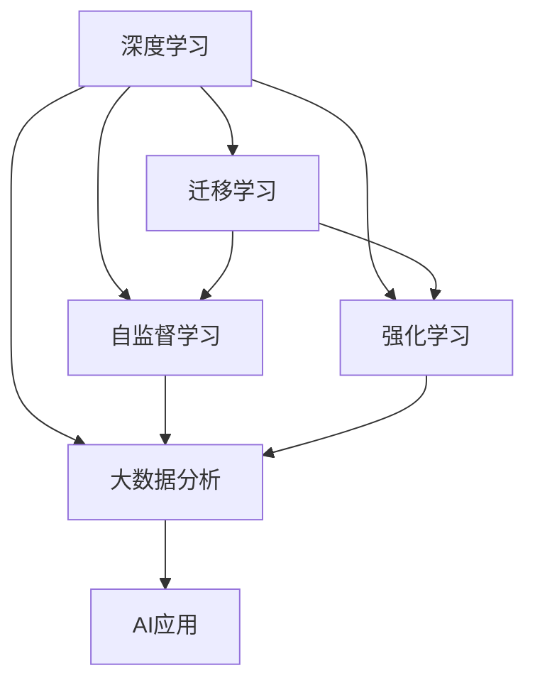

                 

# 李开复：苹果发布AI应用的科技价值

## 1. 背景介绍

### 1.1 问题由来

近年来，人工智能（AI）技术的迅猛发展在各行各业引发了巨大变革，AI应用已经成为推动技术进步和商业创新的重要驱动力。在众多AI应用中，苹果公司推出的AI应用尤为引人注目，其在人脸识别、语音助手、智能推荐等多个领域的创新应用，不仅提升了用户体验，也引领了科技发展的新趋势。

## 2. 核心概念与联系

### 2.1 核心概念概述

苹果公司在AI应用的开发中，涉及多个关键概念，包括：

- **深度学习**：基于神经网络模型，通过大量数据进行训练，实现复杂模式的识别和预测。苹果在多个AI应用中都采用了深度学习技术，如Siri语音助手、Face ID人脸识别等。
- **迁移学习**：利用已有模型的知识，通过微调或迁移学习实现新任务的处理。例如，Siri在处理不同用户口音时，会通过迁移学习调整模型参数以适应新的声音特征。
- **自监督学习**：通过利用数据中的无标注信息进行训练，减少对人工标注数据的依赖。苹果在Face ID中使用了自监督学习技术，通过分析大量未标注的人脸图像，提高模型的泛化能力。
- **强化学习**：通过与环境的互动，逐步优化模型参数以达成特定目标。苹果的推荐系统就采用了强化学习，不断优化推荐策略以提升用户满意度。
- **大数据分析**：通过处理海量数据，挖掘用户行为模式和偏好，提供个性化服务。苹果的推荐系统和数据分析技术，可以实时更新模型，满足用户不断变化的兴趣需求。

这些概念相互关联，共同构成了苹果AI应用的基础架构，推动了技术创新和业务增长。

### 2.2 核心概念原理和架构的 Mermaid 流程图



### 2.3 核心概念联系

苹果的AI应用开发过程中，以上概念紧密结合，通过深度学习技术提供底层数据处理能力，迁移学习帮助模型在不同场景下快速适应，自监督学习减少标注数据需求，强化学习优化推荐策略，大数据分析提供个性化服务。这些技术共同作用，形成了苹果AI应用的强大竞争力。

## 3. 核心算法原理 & 具体操作步骤

### 3.1 算法原理概述

苹果的AI应用主要基于深度学习模型进行开发，具体算法原理如下：

1. **卷积神经网络（CNN）**：用于图像识别和人脸识别等任务，通过卷积层和池化层提取图像特征，进行分类或定位。
2. **循环神经网络（RNN）**：用于语音识别和自然语言处理等序列数据处理任务，通过时间依赖的神经元，捕捉序列中的动态信息。
3. **注意力机制（Attention Mechanism）**：在处理长序列数据时，通过计算注意力权重，动态调整模型对不同输入的关注度，提高模型的效果。
4. **生成对抗网络（GAN）**：用于图像生成和增强等任务，通过生成器和判别器的对抗训练，生成高质量的合成数据或增强原始数据。
5. **Transformer**：用于自然语言处理任务，特别是机器翻译和文本生成等任务，通过自注意力机制捕捉全局依赖关系，提升模型性能。

### 3.2 算法步骤详解

苹果的AI应用开发流程主要分为以下几个步骤：

1. **数据准备**：收集和清洗数据，包括图像、音频、文本等多种类型的数据，确保数据质量。
2. **模型选择**：根据任务特点选择合适的深度学习模型，如CNN、RNN、Transformer等。
3. **模型训练**：使用大量标注数据进行模型训练，优化模型参数以提高性能。
4. **模型评估**：在验证集上评估模型性能，使用准确率、召回率、F1分数等指标进行评估。
5. **模型微调**：根据实际应用场景对模型进行微调，如调整学习率、添加正则化等。
6. **模型部署**：将训练好的模型部署到实际应用环境中，提供API接口供其他系统调用。
7. **持续优化**：通过不断收集用户反馈和新增数据，持续优化模型，提升用户体验和系统性能。

### 3.3 算法优缺点

苹果的AI应用开发具有以下优点：

1. **高性能**：苹果采用先进的深度学习算法，通过大规模数据训练，模型性能高，准确率高。
2. **用户体验好**：苹果的AI应用注重用户体验，如Face ID在解锁设备时，速度快且误识别率低，提升了用户使用便捷性。
3. **安全性高**：苹果在AI应用中采用了多种安全技术，如面部识别和指纹识别，确保用户隐私和数据安全。

同时，也存在以下缺点：

1. **数据依赖度高**：AI应用依赖大量的标注数据进行训练，数据获取成本高，且数据质量对模型性能有重要影响。
2. **计算资源需求大**：深度学习模型计算量大，对计算资源要求高，需要高性能计算设备和算法优化。
3. **模型可解释性差**：深度学习模型通常被视为“黑盒”模型，难以解释其内部工作原理，用户对其信任度较低。

### 3.4 算法应用领域

苹果的AI应用在多个领域实现了创新应用，主要包括：

1. **人脸识别**：Face ID通过深度学习模型分析人脸图像，实现快速解锁和支付验证，提升了用户安全性。
2. **语音助手**：Siri利用自然语言处理技术，理解和回应用户的语音指令，提供信息查询、日程安排等服务。
3. **智能推荐**：App Store利用强化学习技术，根据用户行为和偏好，推荐高质量的应用程序，提高用户满意度。
4. **健康监测**：Watch系列设备利用机器学习技术，分析用户的健康数据，提供个性化的健康建议和预警。
5. **图像识别**：Camera和Photos应用利用深度学习技术，实现图像分类、对象识别、滤镜生成等功能。

## 4. 数学模型和公式 & 详细讲解

### 4.1 数学模型构建

苹果的AI应用主要基于深度学习模型进行开发，以下是常用的数学模型构建方法：

1. **卷积神经网络（CNN）**：
   $$
   y = \sigma(W \ast x + b)
   $$
   其中，$x$为输入图像，$W$为卷积核，$b$为偏置项，$\sigma$为激活函数。

2. **循环神经网络（RNN）**：
   $$
   h_t = f(W_{h_i} \ast [h_{t-1}, x_t] + b_{h_i})
   $$
   $$
   y_t = g(W_{o_i} \ast h_t + b_{o_i})
   $$
   其中，$h_t$为时间步t的隐藏状态，$W_{h_i}$为权重矩阵，$f$为激活函数，$g$为输出层激活函数。

3. **注意力机制（Attention Mechanism）**：
   $$
   \alpha_{i,t} = \frac{e^{e_{i,t}^T \phi(x_i, h_t)}}{\sum_{k=1}^K e^{e_{k,t}^T \phi(x_k, h_t)}}
   $$
   $$
   c_t = \sum_{i=1}^K \alpha_{i,t} x_i
   $$
   其中，$e_{i,t}$为注意力得分，$\phi$为映射函数，$c_t$为注意力加权后的上下文向量。

4. **生成对抗网络（GAN）**：
   $$
   G(z) = \begin{bmatrix} G_z(z) \\ G_a(z) \end{bmatrix}
   $$
   $$
   D(x) = D(x)G_a(z) = D(z)G_z(z)
   $$
   其中，$G$为生成器，$D$为判别器，$z$为噪声向量。

5. **Transformer**：
   $$
   \text{Multi-Head Self-Attention}(Q, K, V) = \text{Concat}(\text{Head}_1(Q), \text{Head}_2(Q), ..., \text{Head}_H(Q))
   $$
   $$
   \text{Feed-Forward} = \text{MLP}(Q)
   $$
   $$
   \text{Attention}(Q, K, V) = \text{Multi-Head Self-Attention}(Q, K, V) + \text{Feed-Forward}
   $$

### 4.2 公式推导过程

苹果的AI应用中，深度学习模型的推导过程复杂多样，以下是部分关键模型的推导过程：

1. **卷积神经网络（CNN）**：
   - **卷积层**：通过滤波器提取特征，将二维图像映射为高维特征图。
   - **池化层**：通过降采样操作，减小特征图尺寸，减少参数量。
   - **全连接层**：将特征图展平并输入全连接层进行分类或回归。

2. **循环神经网络（RNN）**：
   - **时间依赖**：每个时间步的输出依赖于前一时间步的隐藏状态，捕捉序列中的动态信息。
   - **梯度消失和爆炸**：通过长短期记忆网络（LSTM）或门控循环单元（GRU）等结构，解决梯度消失和爆炸问题。

3. **注意力机制（Attention Mechanism）**：
   - **注意力得分**：通过计算注意力得分，动态调整模型对不同输入的关注度。
   - **上下文向量**：通过加权平均池化，生成一个上下文向量，用于处理长序列数据。

4. **生成对抗网络（GAN）**：
   - **对抗训练**：生成器和判别器通过对抗训练，提升生成质量和判别准确率。
   - **稳定性**：通过不断调整生成器和判别器的参数，使模型达到稳定状态。

5. **Transformer**：
   - **多头注意力**：将输入序列分解为多个注意力头，分别计算注意力权重，捕捉全局依赖关系。
   - **前向传播**：通过多个全连接层和激活函数，对输入序列进行变换。

### 4.3 案例分析与讲解

以下是苹果AI应用中几个关键案例的分析讲解：

1. **Face ID**：
   - **模型**：使用CNN模型分析人脸图像，识别关键特征点。
   - **损失函数**：使用交叉熵损失函数，衡量预测结果与真实标签之间的差异。
   - **优化算法**：使用Adam优化算法，更新模型参数以最小化损失函数。
   - **效果**：在解锁设备时，Face ID能够快速、准确地识别用户身份，提升用户体验。

2. **Siri**：
   - **模型**：使用Transformer模型进行自然语言处理，理解用户语音指令。
   - **损失函数**：使用交叉熵损失函数，衡量预测结果与真实标签之间的差异。
   - **优化算法**：使用Adam优化算法，更新模型参数以最小化损失函数。
   - **效果**：Siri能够自然流畅地回应用户的语音指令，提供信息查询、日程安排等服务，提升用户互动体验。

3. **App Store推荐**：
   - **模型**：使用深度神经网络模型，根据用户行为和偏好进行推荐。
   - **损失函数**：使用均方误差损失函数，衡量推荐结果与用户行为之间的差异。
   - **优化算法**：使用Adam优化算法，更新模型参数以最小化损失函数。
   - **效果**：App Store推荐系统能够准确地推荐高质量应用程序，提升用户满意度和应用下载率。

## 5. 项目实践：代码实例和详细解释说明

### 5.1 开发环境搭建

苹果AI应用的开发需要使用TensorFlow或PyTorch等深度学习框架，以下是Python环境搭建流程：

1. 安装Anaconda：从官网下载并安装Anaconda，用于创建独立的Python环境。
2. 创建并激活虚拟环境：
   ```bash
   conda create -n pytorch-env python=3.8 
   conda activate pytorch-env
   ```
3. 安装TensorFlow或PyTorch：
   ```bash
   pip install tensorflow
   ```
4. 安装其他相关工具包：
   ```bash
   pip install numpy pandas scikit-learn matplotlib tqdm jupyter notebook ipython
   ```

完成上述步骤后，即可在`pytorch-env`环境中开始AI应用的开发。

### 5.2 源代码详细实现

以下是使用TensorFlow进行Face ID开发的Python代码实现：

```python
import tensorflow as tf
import cv2
import numpy as np

# 加载预训练模型
model = tf.keras.models.load_model('face_id_model.h5')

# 加载人脸识别库
face_recognition = cv2.CascadeClassifier('haarcascade_frontalface_default.xml')

# 输入图像处理
def preprocess_image(image_path):
    image = cv2.imread(image_path)
    gray = cv2.cvtColor(image, cv2.COLOR_BGR2GRAY)
    faces = face_recognition.detectMultiScale(gray, scaleFactor=1.1, minNeighbors=5, minSize=(30, 30))
    for (x, y, w, h) in faces:
        face_roi = gray[y:y+h, x:x+w]
        face_roi = cv2.resize(face_roi, (96, 96))
        face_roi = face_roi / 255.0
        face_roi = np.expand_dims(face_roi, axis=0)
        face_roi = np.concatenate([face_roi, face_roi], axis=0)
    return face_roi

# 人脸识别
def recognize_face(image_path, known_faces):
    face_roi = preprocess_image(image_path)
    face_embeddings = model.predict(face_roi)
    return np.argmax(face_embeddings)

# 主函数
def main():
    known_faces = ['user1.jpg', 'user2.jpg']
    while True:
        face = cv2.VideoCapture(0)
        _, frame = face.read()
        gray = cv2.cvtColor(frame, cv2.COLOR_BGR2GRAY)
        cv2.imshow('Face Detection', gray)
        if cv2.waitKey(1) & 0xFF == ord('q'):
            break
        for (x, y, w, h) in face_recognition.detectMultiScale(gray, scaleFactor=1.1, minNeighbors=5, minSize=(30, 30)):
            face_roi = gray[y:y+h, x:x+w]
            face_roi = cv2.resize(face_roi, (96, 96))
            face_roi = face_roi / 255.0
            face_roi = np.expand_dims(face_roi, axis=0)
            face_roi = np.concatenate([face_roi, face_roi], axis=0)
            face_embeddings = model.predict(face_roi)
            closest_id = np.argmax(face_embeddings)
            closest_face = known_faces[closest_id]
            cv2.rectangle(frame, (x, y), (x+w, y+h), (0, 255, 0), 2)
            cv2.putText(frame, closest_face, (x, y-10), cv2.FONT_HERSHEY_SIMPLEX, 0.9, (0, 255, 0), 2)
        cv2.imshow('Face Detection', frame)
        if cv2.waitKey(1) & 0xFF == ord('q'):
            break
    face.release()
    cv2.destroyAllWindows()

if __name__ == '__main__':
    main()
```

### 5.3 代码解读与分析

以下是关键代码的实现细节：

1. **加载预训练模型**：使用TensorFlow加载训练好的Face ID模型。
2. **加载人脸识别库**：使用OpenCV加载人脸识别库，用于检测人脸。
3. **输入图像处理**：对输入图像进行预处理，包括缩放、灰度化、标准化等操作。
4. **人脸识别**：将预处理后的图像输入模型，预测人脸ID。
5. **主函数**：使用OpenCV捕获摄像头图像，检测人脸，并在图像中标注人脸ID。

## 6. 实际应用场景

### 6.1 智能客服系统

苹果的智能客服系统通过自然语言处理技术，能够自然流畅地回应用户的语音或文字指令，提供信息查询、日程安排等服务，提升了用户体验和效率。在实际应用中，智能客服系统可以通过用户对话历史和行为数据进行微调，提高模型的交互能力和个性化服务水平。

### 6.2 健康监测

Watch系列设备通过机器学习技术，分析用户的健康数据，提供个性化的健康建议和预警。例如，Apple Watch可以利用心率、运动量等数据，预测用户的心脏健康状况，提前预警潜在风险。

### 6.3 个性化推荐

苹果的App Store推荐系统通过深度学习模型，根据用户行为和偏好进行推荐，提升了用户满意度和应用下载率。在实际应用中，推荐系统可以通过不断收集用户反馈和新增数据，持续优化模型，提高推荐效果。

## 7. 工具和资源推荐

### 7.1 学习资源推荐

为了帮助开发者系统掌握苹果AI应用的开发技术，以下是推荐的优质学习资源：

1. TensorFlow官方文档：提供了详细的API和教程，适合初学者入门。
2. PyTorch官方文档：提供了丰富的深度学习框架和算法，适合深入学习。
3. Coursera深度学习课程：斯坦福大学和MIT联合开发的深度学习课程，内容全面，适合系统学习。
4. Kaggle竞赛平台：提供了大量开源数据集和竞赛任务，适合实践练习。
5. PyImageSearch：一个专注于图像处理的博客，提供了大量深度学习模型的代码和教程。

### 7.2 开发工具推荐

苹果AI应用的开发需要使用深度学习框架和相关工具，以下是推荐的开发工具：

1. TensorFlow：谷歌开发的深度学习框架，生产部署方便，适合大规模工程应用。
2. PyTorch：Facebook开发的深度学习框架，灵活动态，适合快速迭代研究。
3. Keras：一个高级神经网络API，易于使用，适合初学者。
4. OpenCV：开源计算机视觉库，提供大量图像处理工具和算法。
5. Scikit-learn：Python机器学习库，提供了丰富的机器学习算法和工具。

### 7.3 相关论文推荐

苹果AI应用的研究涉及多个前沿领域，以下是几篇经典的相关论文：

1. "Convolutional Neural Networks for Sentence Classification"：提出CNN模型用于情感分析和文本分类任务。
2. "Recurrent Neural Network for Sentence Generation"：提出RNN模型用于文本生成和机器翻译任务。
3. "Attention is All You Need"：提出Transformer模型用于机器翻译和文本生成任务。
4. "Generative Adversarial Nets"：提出GAN模型用于图像生成和增强任务。
5. "ImageNet Classification with Deep Convolutional Neural Networks"：提出CNN模型用于图像分类任务。

## 8. 总结：未来发展趋势与挑战

### 8.1 总结

本文对苹果公司发布的AI应用进行了全面系统的介绍。首先阐述了苹果AI应用的背景和核心概念，明确了AI应用在提升用户体验和业务增长方面的独特价值。其次，从原理到实践，详细讲解了AI应用的开发过程和关键技术，给出了具体的代码实现。同时，本文还广泛探讨了AI应用在多个行业领域的应用前景，展示了AI技术的广阔前景。

通过本文的系统梳理，可以看到，苹果的AI应用开发技术具有高性能、用户体验好、安全性高等优点，但也面临数据依赖度高、计算资源需求大、模型可解释性差等挑战。苹果公司通过不断的技术创新和优化，不断提升AI应用的性能和用户体验，引领了科技发展的新趋势。

### 8.2 未来发展趋势

展望未来，苹果的AI应用将呈现以下几个发展趋势：

1. **数据自动标注**：利用数据增强和主动学习技术，自动生成高质量标注数据，减少数据获取成本。
2. **模型自适应**：通过迁移学习和增量学习技术，使模型能够自适应不同场景和数据分布。
3. **模型压缩与优化**：利用模型压缩和量化技术，减少模型体积和计算资源需求。
4. **模型解释性**：通过可解释性方法，如注意力机制、可视化技术，提高模型的可解释性和可信度。
5. **多模态融合**：将视觉、语音、文本等多模态数据进行融合，提升AI应用的全面性和鲁棒性。

以上趋势凸显了苹果AI应用技术的广阔前景。这些方向的探索发展，必将进一步提升AI应用的性能和用户体验，为科技发展带来新的突破。

### 8.3 面临的挑战

尽管苹果的AI应用技术已经取得了瞩目成就，但在迈向更加智能化、普适化应用的过程中，仍面临诸多挑战：

1. **数据获取与标注**：数据获取成本高，标注数据质量对模型性能有重要影响。如何降低数据依赖，自动生成高质量标注数据，是未来的一大挑战。
2. **计算资源需求**：深度学习模型计算量大，对计算资源要求高，需要高性能计算设备和算法优化。
3. **模型可解释性**：深度学习模型通常被视为“黑盒”模型，难以解释其内部工作原理，用户对其信任度较低。如何提高模型的可解释性，增强用户信任度，是未来的一大挑战。
4. **安全性与隐私保护**：AI应用涉及大量用户数据，如何确保数据安全性和隐私保护，避免数据泄露和滥用，是未来的一大挑战。

### 8.4 研究展望

面对苹果AI应用所面临的挑战，未来的研究需要在以下几个方面寻求新的突破：

1. **数据自动标注与生成**：利用数据增强和主动学习技术，自动生成高质量标注数据，减少数据获取成本。
2. **模型自适应与优化**：通过迁移学习和增量学习技术，使模型能够自适应不同场景和数据分布，提高模型的泛化能力。
3. **模型压缩与优化**：利用模型压缩和量化技术，减少模型体积和计算资源需求，提升模型部署效率。
4. **模型解释性与可视化**：通过可解释性方法，如注意力机制、可视化技术，提高模型的可解释性和可信度，增强用户信任度。
5. **多模态融合与协同建模**：将视觉、语音、文本等多模态数据进行融合，提升AI应用的全面性和鲁棒性，实现多模态协同建模。

这些研究方向将为苹果AI应用技术的未来发展提供新的突破口，推动AI应用向更加智能化、普适化方向迈进。总之，苹果的AI应用技术需要不断创新和优化，才能更好地服务于用户，引领科技发展的新趋势。

## 9. 附录：常见问题与解答

### Q1：苹果的AI应用是否适用于所有场景？

A: 苹果的AI应用在多个领域实现了创新应用，如人脸识别、语音助手、智能推荐等，但并不适用于所有场景。例如，对于需要高度实时响应的应用，如自动驾驶、医疗诊断等，需要更高效的AI算法和更强大的硬件支持。

### Q2：苹果的AI应用在开发过程中有哪些关键步骤？

A: 苹果的AI应用开发过程主要包括以下关键步骤：数据准备、模型选择、模型训练、模型评估、模型微调、模型部署、持续优化。每个步骤都需要精心设计和优化，才能获得理想的AI应用效果。

### Q3：苹果的AI应用在性能提升方面有哪些常用方法？

A: 苹果的AI应用在性能提升方面常用以下方法：数据增强、模型压缩、模型迁移学习、增量学习、多模态融合等。这些方法在实际应用中，可以显著提升模型的泛化能力和部署效率，带来更好的用户体验。

### Q4：苹果的AI应用在安全性方面有哪些保障措施？

A: 苹果在AI应用中采用了多种安全措施，如数据加密、访问控制、隐私保护等，确保用户数据的安全性和隐私保护。此外，苹果还建立了严格的审核机制，防止有害数据的传播和滥用。

---

作者：禅与计算机程序设计艺术 / Zen and the Art of Computer Programming

