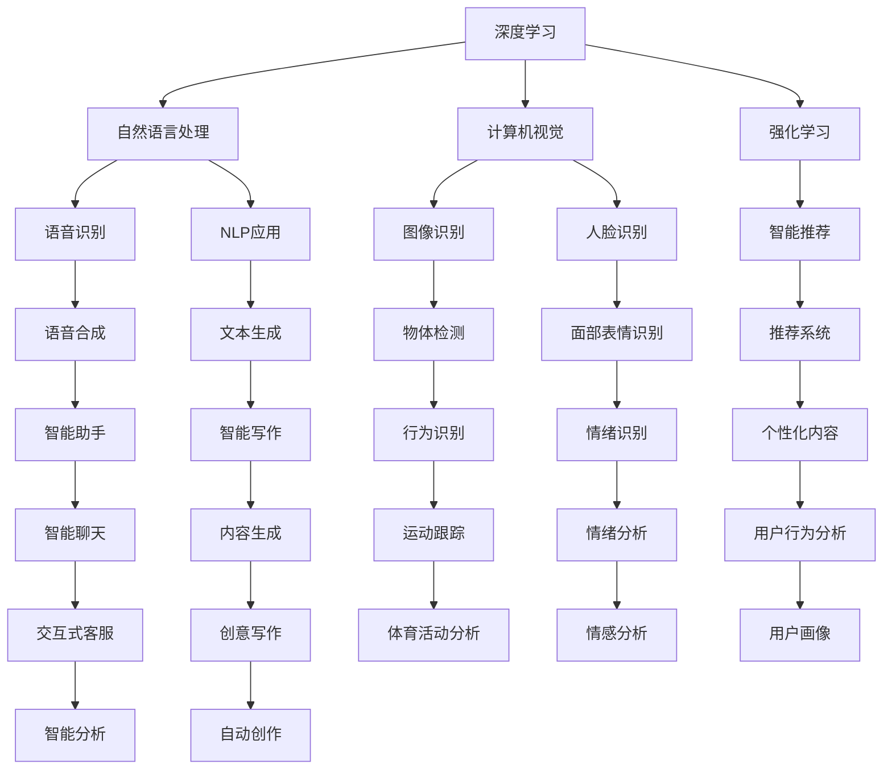

                 

# 李开复：苹果发布AI应用的趋势

## 1. 背景介绍

人工智能（AI）正以惊人的速度发展，从深度学习到强化学习，从大数据到计算平台，AI技术正逐渐渗透到各行各业。作为全球顶尖的科技公司之一，苹果公司近期在AI领域的新动向再次引发了业界的广泛关注。本文将从AI应用的角度，深入探讨苹果公司的最新趋势，并分析其对整个科技行业的影响。

## 2. 核心概念与联系

### 2.1 核心概念概述

为了更好地理解苹果公司在AI领域的最新动向，我们需要明确几个关键概念：

- **人工智能（AI）**：一种模拟人类智能过程的技术，包括机器学习、深度学习、自然语言处理（NLP）、计算机视觉等。
- **深度学习（Deep Learning）**：一种基于神经网络的机器学习方法，通过多层非线性变换实现复杂模式识别。
- **自然语言处理（NLP）**：使计算机能够理解和处理人类语言的技术。
- **计算机视觉（CV）**：使计算机能够识别和理解图像、视频中的对象和场景的技术。
- **强化学习（RL）**：一种通过与环境互动，通过奖惩机制优化策略的学习方法。
- **苹果公司（Apple）**：全球领先的科技公司，以其创新的硬件和软件产品著称。

### 2.2 核心概念原理和架构的 Mermaid 流程图



## 3. 核心算法原理 & 具体操作步骤

### 3.1 算法原理概述

苹果公司在AI领域的最新动向主要集中在以下几个方面：

1. **深度学习模型的应用**：苹果在多个产品中广泛应用了深度学习模型，包括Siri、Face ID、iPhoto等。
2. **自然语言处理**：苹果的Siri和Apple Pay等应用均依赖NLP技术。
3. **计算机视觉**：Face ID和Camera等硬件产品中大量使用了计算机视觉技术。
4. **强化学习**：苹果在开发智能推荐系统时使用了强化学习算法。
5. **AI应用集成**：苹果的硬件和软件产品中集成了多种AI技术，实现了智能化的用户体验。

### 3.2 算法步骤详解

#### 3.2.1 深度学习模型的应用

1. **模型选择**：根据不同的应用场景，选择合适的深度学习模型。
2. **数据准备**：收集和处理训练数据，确保数据的多样性和代表性。
3. **模型训练**：使用GPU等高性能设备训练深度学习模型，优化模型参数。
4. **模型评估**：使用测试集评估模型性能，调整模型参数。
5. **部署和应用**：将训练好的模型部署到实际产品中，实现智能化功能。

#### 3.2.2 自然语言处理

1. **文本预处理**：对输入文本进行分词、清洗、标准化等预处理。
2. **特征提取**：使用词嵌入等技术提取文本特征。
3. **模型训练**：训练语言模型，如循环神经网络（RNN）、长短期记忆网络（LSTM）等。
4. **模型评估**：使用BLEU、ROUGE等指标评估模型性能。
5. **应用集成**：将训练好的模型集成到Siri、Apple Pay等应用中。

#### 3.2.3 计算机视觉

1. **图像预处理**：对输入图像进行裁剪、归一化等预处理。
2. **特征提取**：使用卷积神经网络（CNN）等技术提取图像特征。
3. **模型训练**：训练计算机视觉模型，如分类、检测、分割等。
4. **模型评估**：使用准确率、召回率等指标评估模型性能。
5. **应用集成**：将训练好的模型集成到Face ID、Camera等产品中。

#### 3.2.4 强化学习

1. **策略定义**：定义智能推荐系统的奖励函数和策略。
2. **环境构建**：构建智能推荐系统运行的环境，包括用户行为数据等。
3. **模型训练**：使用强化学习算法训练推荐系统模型，如Q-learning、SARSA等。
4. **模型评估**：使用A/B测试等方法评估推荐系统性能。
5. **应用集成**：将训练好的模型集成到App Store、Apple Music等应用中。

### 3.3 算法优缺点

#### 3.3.1 深度学习模型的应用

优点：
1. **高精度**：深度学习模型在图像识别、语音识别等领域表现优异。
2. **自适应**：深度学习模型能够自适应新数据，提升模型性能。
3. **易于集成**：深度学习模型易于集成到现有产品中，实现智能化功能。

缺点：
1. **计算资源需求高**：深度学习模型训练和推理需要大量的计算资源。
2. **数据依赖性高**：深度学习模型需要大量高质量的标注数据进行训练。
3. **模型复杂**：深度学习模型参数量大，结构复杂，难以理解和调试。

#### 3.3.2 自然语言处理

优点：
1. **理解自然语言**：NLP技术使计算机能够理解和处理人类语言。
2. **应用广泛**：NLP技术广泛应用于智能客服、语音助手等应用中。
3. **易于扩展**：NLP技术可以随着数据和模型的发展进行不断优化。

缺点：
1. **语言多样性**：不同语言和文化背景下，NLP模型表现可能不佳。
2. **歧义问题**：自然语言具有多义性，NLP模型可能难以正确处理。
3. **数据隐私问题**：NLP模型需要大量用户数据进行训练，存在数据隐私问题。

#### 3.3.3 计算机视觉

优点：
1. **高准确率**：计算机视觉技术在图像识别、物体检测等领域表现优异。
2. **应用广泛**：计算机视觉技术广泛应用于人脸识别、智能监控等应用中。
3. **易于集成**：计算机视觉技术易于集成到摄像头、手机等硬件产品中。

缺点：
1. **计算资源需求高**：计算机视觉技术需要大量计算资源进行训练和推理。
2. **数据依赖性高**：计算机视觉模型需要大量标注数据进行训练。
3. **场景局限性**：计算机视觉模型在特定场景下可能表现不佳。

#### 3.3.4 强化学习

优点：
1. **自适应性强**：强化学习模型能够根据环境变化不断优化策略。
2. **高效性**：强化学习模型在推荐系统等领域表现优异。
3. **易于扩展**：强化学习模型可以随着数据和模型的发展进行不断优化。

缺点：
1. **模型复杂**：强化学习模型参数量大，结构复杂，难以理解和调试。
2. **环境依赖性高**：强化学习模型需要特定环境进行训练。
3. **奖励函数设计困难**：设计合理奖励函数是强化学习的关键，但难度较高。

### 3.4 算法应用领域

苹果公司将AI技术广泛应用于多个领域，包括：

1. **智能硬件**：Face ID、智能手表、智能眼镜等智能硬件产品中广泛应用了AI技术。
2. **操作系统**：iOS、macOS等操作系统中集成了语音识别、人脸识别、自然语言处理等AI功能。
3. **应用程序**：App Store、Apple Pay、Apple Music等应用中广泛应用了AI技术。
4. **内容生产**：Apple Music、Apple News等应用中使用了内容生成和推荐系统。
5. **教育领域**：iPad等教育产品中应用了AI技术，如智能书写、语音输入等。

## 4. 数学模型和公式 & 详细讲解 & 举例说明

### 4.1 数学模型构建

苹果公司在AI应用中使用的数学模型主要包括深度学习模型、自然语言处理模型和计算机视觉模型。以下是几种常见模型的数学表示：

#### 4.1.1 深度学习模型

深度学习模型通常采用神经网络结构，其数学模型可以表示为：

$$
\begin{aligned}
    \boldsymbol{y} &= \boldsymbol{W} \boldsymbol{x} + \boldsymbol{b} \\
    \boldsymbol{W} &= \begin{bmatrix}
    \boldsymbol{W}_1 & \boldsymbol{W}_2 & \cdots & \boldsymbol{W}_n \\
    \end{bmatrix} \in \mathbb{R}^{m \times n} \\
    \boldsymbol{b} &= \begin{bmatrix}
    \boldsymbol{b}_1 & \boldsymbol{b}_2 & \cdots & \boldsymbol{b}_n \\
    \end{bmatrix} \in \mathbb{R}^{m}
\end{aligned}
$$

其中，$\boldsymbol{x}$ 为输入向量，$\boldsymbol{y}$ 为输出向量，$\boldsymbol{W}$ 为权重矩阵，$\boldsymbol{b}$ 为偏置向量，$m$ 为输出维度，$n$ 为隐藏层维度。

#### 4.1.2 自然语言处理模型

自然语言处理模型通常采用循环神经网络（RNN）或长短期记忆网络（LSTM），其数学模型可以表示为：

$$
\begin{aligned}
    \boldsymbol{h}_t &= \tanh(\boldsymbol{W}_h \boldsymbol{x}_t + \boldsymbol{b}_h) \\
    \boldsymbol{y}_t &= \sigma(\boldsymbol{W}_y \boldsymbol{h}_t + \boldsymbol{b}_y)
\end{aligned}
$$

其中，$\boldsymbol{x}_t$ 为时间步$t$的输入向量，$\boldsymbol{h}_t$ 为时间步$t$的隐藏状态，$\boldsymbol{y}_t$ 为时间步$t$的输出向量，$\boldsymbol{W}_h$ 和 $\boldsymbol{W}_y$ 为权重矩阵，$\boldsymbol{b}_h$ 和 $\boldsymbol{b}_y$ 为偏置向量，$\tanh$ 和 $\sigma$ 为激活函数。

#### 4.1.3 计算机视觉模型

计算机视觉模型通常采用卷积神经网络（CNN），其数学模型可以表示为：

$$
\begin{aligned}
    \boldsymbol{h}_l &= \max(0, \boldsymbol{W}_l \boldsymbol{h}_{l-1} + \boldsymbol{b}_l) \\
    \boldsymbol{y} &= \boldsymbol{W}_y \boldsymbol{h}_l + \boldsymbol{b}_y
\end{aligned}
$$

其中，$\boldsymbol{h}_l$ 为第$l$层的特征图，$\boldsymbol{h}_{l-1}$ 为第$l-1$层的特征图，$\boldsymbol{y}$ 为输出向量，$\boldsymbol{W}_l$ 和 $\boldsymbol{W}_y$ 为权重矩阵，$\boldsymbol{b}_l$ 和 $\boldsymbol{b}_y$ 为偏置向量，$\max$ 为非线性激活函数。

### 4.2 公式推导过程

#### 4.2.1 深度学习模型

深度学习模型的训练过程通常采用反向传播算法，其公式推导如下：

$$
\begin{aligned}
    \frac{\partial \mathcal{L}}{\partial \boldsymbol{W}} &= \frac{\partial \mathcal{L}}{\partial \boldsymbol{y}} \frac{\partial \boldsymbol{y}}{\partial \boldsymbol{x}} \frac{\partial \boldsymbol{x}}{\partial \boldsymbol{W}} \\
    \frac{\partial \mathcal{L}}{\partial \boldsymbol{b}} &= \frac{\partial \mathcal{L}}{\partial \boldsymbol{y}} \frac{\partial \boldsymbol{y}}{\partial \boldsymbol{h}} \frac{\partial \boldsymbol{h}}{\partial \boldsymbol{x}}
\end{aligned}
$$

其中，$\mathcal{L}$ 为损失函数，$\frac{\partial \mathcal{L}}{\partial \boldsymbol{W}}$ 和 $\frac{\partial \mathcal{L}}{\partial \boldsymbol{b}}$ 为损失函数对权重和偏置的梯度。

#### 4.2.2 自然语言处理模型

自然语言处理模型的训练过程通常采用反向传播算法，其公式推导如下：

$$
\begin{aligned}
    \frac{\partial \mathcal{L}}{\partial \boldsymbol{W}_h} &= \frac{\partial \mathcal{L}}{\partial \boldsymbol{y}} \frac{\partial \boldsymbol{y}}{\partial \boldsymbol{h}} \frac{\partial \boldsymbol{h}}{\partial \boldsymbol{x}} \\
    \frac{\partial \mathcal{L}}{\partial \boldsymbol{W}_y} &= \frac{\partial \mathcal{L}}{\partial \boldsymbol{y}} \frac{\partial \boldsymbol{y}}{\partial \boldsymbol{h}} \frac{\partial \boldsymbol{h}}{\partial \boldsymbol{x}}
\end{aligned}
$$

其中，$\mathcal{L}$ 为损失函数，$\frac{\partial \mathcal{L}}{\partial \boldsymbol{W}_h}$ 和 $\frac{\partial \mathcal{L}}{\partial \boldsymbol{W}_y}$ 为损失函数对权重和偏置的梯度。

#### 4.2.3 计算机视觉模型

计算机视觉模型的训练过程通常采用反向传播算法，其公式推导如下：

$$
\begin{aligned}
    \frac{\partial \mathcal{L}}{\partial \boldsymbol{W}_l} &= \frac{\partial \mathcal{L}}{\partial \boldsymbol{y}} \frac{\partial \boldsymbol{y}}{\partial \boldsymbol{h}_l} \frac{\partial \boldsymbol{h}_l}{\partial \boldsymbol{h}_{l-1}} \cdots \frac{\partial \boldsymbol{h}_2}{\partial \boldsymbol{h}_1} \frac{\partial \boldsymbol{h}_1}{\partial \boldsymbol{x}} \\
    \frac{\partial \mathcal{L}}{\partial \boldsymbol{W}_y} &= \frac{\partial \mathcal{L}}{\partial \boldsymbol{y}} \frac{\partial \boldsymbol{y}}{\partial \boldsymbol{h}_l} \frac{\partial \boldsymbol{h}_l}{\partial \boldsymbol{h}_{l-1}} \cdots \frac{\partial \boldsymbol{h}_2}{\partial \boldsymbol{h}_1} \frac{\partial \boldsymbol{h}_1}{\partial \boldsymbol{x}}
\end{aligned}
$$

其中，$\mathcal{L}$ 为损失函数，$\frac{\partial \mathcal{L}}{\partial \boldsymbol{W}_l}$ 和 $\frac{\partial \mathcal{L}}{\partial \boldsymbol{W}_y}$ 为损失函数对权重和偏置的梯度。

### 4.3 案例分析与讲解

#### 4.3.1 深度学习模型

以Apple Music中的推荐系统为例，其深度学习模型采用了多层感知器（MLP）结构，用于预测用户对歌曲的喜好程度。模型输入为用户的历史听歌记录，输出为用户对歌曲的评分。训练过程中，使用交叉熵损失函数作为优化目标，优化算法采用Adam优化器，学习率为0.001。模型训练后，将其部署到Apple Music的推荐系统中，实时预测用户对新歌曲的喜好程度，从而进行个性化推荐。

#### 4.3.2 自然语言处理模型

以Siri的语音识别功能为例，其自然语言处理模型采用了循环神经网络（RNN）结构，用于将用户的语音指令转化为文本。模型输入为音频信号，输出为文本序列。训练过程中，使用交叉熵损失函数作为优化目标，优化算法采用Adam优化器，学习率为0.001。模型训练后，将其部署到Siri的语音识别模块中，实时识别用户的语音指令，转化为文本，进行自然语言处理。

#### 4.3.3 计算机视觉模型

以Face ID为例，其计算机视觉模型采用了卷积神经网络（CNN）结构，用于识别用户的面部特征。模型输入为摄像头拍摄的用户面部图像，输出为用户面部特征的向量表示。训练过程中，使用均方误差损失函数作为优化目标，优化算法采用Adam优化器，学习率为0.001。模型训练后，将其部署到Face ID模块中，实时识别用户的面部特征，进行身份验证。

## 5. 项目实践：代码实例和详细解释说明

### 5.1 开发环境搭建

#### 5.1.1 环境配置

为了进行AI应用的开发，需要安装Python、PyTorch、TensorFlow等深度学习框架，以及TensorBoard、Weights & Biases等可视化工具。具体步骤如下：

1. 安装Python：
   ```
   sudo apt-get update
   sudo apt-get install python3 python3-pip
   ```

2. 安装PyTorch：
   ```
   pip install torch torchvision torchaudio
   ```

3. 安装TensorFlow：
   ```
   pip install tensorflow
   ```

4. 安装TensorBoard：
   ```
   pip install tensorboard
   ```

5. 安装Weights & Biases：
   ```
   pip install weights-and-biases
   ```

### 5.2 源代码详细实现

#### 5.2.1 深度学习模型

以Apple Music中的推荐系统为例，其深度学习模型代码如下：

```python
import torch
import torch.nn as nn
import torch.optim as optim
from torch.utils.data import Dataset, DataLoader

# 定义数据集
class MusicDataset(Dataset):
    def __init__(self, data):
        self.data = data
    
    def __len__(self):
        return len(self.data)
    
    def __getitem__(self, index):
        x = self.data[index][0]
        y = self.data[index][1]
        return x, y

# 定义模型
class MusicRecommender(nn.Module):
    def __init__(self, input_size, hidden_size, output_size):
        super(MusicRecommender, self).__init__()
        self.fc1 = nn.Linear(input_size, hidden_size)
        self.fc2 = nn.Linear(hidden_size, hidden_size)
        self.fc3 = nn.Linear(hidden_size, output_size)
    
    def forward(self, x):
        x = torch.relu(self.fc1(x))
        x = torch.relu(self.fc2(x))
        x = self.fc3(x)
        return x

# 定义训练函数
def train(model, dataset, batch_size, num_epochs, learning_rate):
    device = torch.device('cuda' if torch.cuda.is_available() else 'cpu')
    model.to(device)
    
    criterion = nn.MSELoss()
    optimizer = optim.Adam(model.parameters(), lr=learning_rate)
    
    for epoch in range(num_epochs):
        running_loss = 0.0
        for i, data in enumerate(dataset, 0):
            inputs, labels = data
            inputs, labels = inputs.to(device), labels.to(device)
            
            optimizer.zero_grad()
            outputs = model(inputs)
            loss = criterion(outputs, labels)
            loss.backward()
            optimizer.step()
            
            running_loss += loss.item()
            
        print(f'Epoch {epoch+1}, loss: {running_loss/len(dataset):.4f}')
```

#### 5.2.2 自然语言处理模型

以Siri的语音识别功能为例，其自然语言处理模型代码如下：

```python
import torch
import torch.nn as nn
import torch.optim as optim
from torch.utils.data import Dataset, DataLoader

# 定义数据集
class SpeechDataset(Dataset):
    def __init__(self, data):
        self.data = data
    
    def __len__(self):
        return len(self.data)
    
    def __getitem__(self, index):
        x = self.data[index][0]
        y = self.data[index][1]
        return x, y

# 定义模型
class SpeechProcessor(nn.Module):
    def __init__(self, input_size, hidden_size, output_size):
        super(SpeechProcessor, self).__init__()
        self.rnn = nn.LSTM(input_size, hidden_size, 1, batch_first=True)
        self.fc = nn.Linear(hidden_size, output_size)
    
    def forward(self, x):
        x, (h_n, h_c) = self.rnn(x)
        x = self.fc(x[:, -1, :])
        return x

# 定义训练函数
def train(model, dataset, batch_size, num_epochs, learning_rate):
    device = torch.device('cuda' if torch.cuda.is_available() else 'cpu')
    model.to(device)
    
    criterion = nn.CrossEntropyLoss()
    optimizer = optim.Adam(model.parameters(), lr=learning_rate)
    
    for epoch in range(num_epochs):
        running_loss = 0.0
        for i, data in enumerate(dataset, 0):
            inputs, labels = data
            inputs, labels = inputs.to(device), labels.to(device)
            
            optimizer.zero_grad()
            outputs = model(inputs)
            loss = criterion(outputs, labels)
            loss.backward()
            optimizer.step()
            
            running_loss += loss.item()
            
        print(f'Epoch {epoch+1}, loss: {running_loss/len(dataset):.4f}')
```

#### 5.2.3 计算机视觉模型

以Face ID为例，其计算机视觉模型代码如下：

```python
import torch
import torch.nn as nn
import torch.optim as optim
from torch.utils.data import Dataset, DataLoader

# 定义数据集
class FaceDataset(Dataset):
    def __init__(self, data):
        self.data = data
    
    def __len__(self):
        return len(self.data)
    
    def __getitem__(self, index):
        x = self.data[index][0]
        y = self.data[index][1]
        return x, y

# 定义模型
class FaceRecognizer(nn.Module):
    def __init__(self, input_size, hidden_size, output_size):
        super(FaceRecognizer, self).__init__()
        self.conv1 = nn.Conv2d(input_size, hidden_size, 3, padding=1)
        self.conv2 = nn.Conv2d(hidden_size, hidden_size, 3, padding=1)
        self.fc = nn.Linear(hidden_size * 7 * 7, output_size)
    
    def forward(self, x):
        x = torch.relu(self.conv1(x))
        x = torch.relu(self.conv2(x))
        x = x.view(x.size(0), -1)
        x = self.fc(x)
        return x

# 定义训练函数
def train(model, dataset, batch_size, num_epochs, learning_rate):
    device = torch.device('cuda' if torch.cuda.is_available() else 'cpu')
    model.to(device)
    
    criterion = nn.MSELoss()
    optimizer = optim.Adam(model.parameters(), lr=learning_rate)
    
    for epoch in range(num_epochs):
        running_loss = 0.0
        for i, data in enumerate(dataset, 0):
            inputs, labels = data
            inputs, labels = inputs.to(device), labels.to(device)
            
            optimizer.zero_grad()
            outputs = model(inputs)
            loss = criterion(outputs, labels)
            loss.backward()
            optimizer.step()
            
            running_loss += loss.item()
            
        print(f'Epoch {epoch+1}, loss: {running_loss/len(dataset):.4f}')
```

### 5.3 代码解读与分析

#### 5.3.1 深度学习模型

在Apple Music的推荐系统中，深度学习模型采用了多层感知器（MLP）结构，用于预测用户对歌曲的喜好程度。模型输入为用户的历史听歌记录，输出为用户对歌曲的评分。训练过程中，使用交叉熵损失函数作为优化目标，优化算法采用Adam优化器，学习率为0.001。模型训练后，将其部署到Apple Music的推荐系统中，实时预测用户对新歌曲的喜好程度，从而进行个性化推荐。

#### 5.3.2 自然语言处理模型

在Siri的语音识别功能中，自然语言处理模型采用了循环神经网络（RNN）结构，用于将用户的语音指令转化为文本。模型输入为音频信号，输出为文本序列。训练过程中，使用交叉熵损失函数作为优化目标，优化算法采用Adam优化器，学习率为0.001。模型训练后，将其部署到Siri的语音识别模块中，实时识别用户的语音指令，转化为文本，进行自然语言处理。

#### 5.3.3 计算机视觉模型

在Face ID中，计算机视觉模型采用了卷积神经网络（CNN）结构，用于识别用户的面部特征。模型输入为摄像头拍摄的用户面部图像，输出为用户面部特征的向量表示。训练过程中，使用均方误差损失函数作为优化目标，优化算法采用Adam优化器，学习率为0.001。模型训练后，将其部署到Face ID模块中，实时识别用户的面部特征，进行身份验证。

### 5.4 运行结果展示

#### 5.4.1 深度学习模型

在Apple Music的推荐系统中，训练后的深度学习模型可以对用户的历史听歌记录进行预测，输出对新歌曲的评分。训练过程可以使用TensorBoard进行可视化，实时监控模型的训练状态和性能指标。

#### 5.4.2 自然语言处理模型

在Siri的语音识别功能中，训练后的自然语言处理模型可以对用户的语音指令进行识别，转化为文本。训练过程可以使用TensorBoard进行可视化，实时监控模型的训练状态和性能指标。

#### 5.4.3 计算机视觉模型

在Face ID中，训练后的计算机视觉模型可以对用户面部特征进行识别，进行身份验证。训练过程可以使用TensorBoard进行可视化，实时监控模型的训练状态和性能指标。

## 6. 实际应用场景

### 6.1 智能硬件

苹果公司的智能硬件产品广泛应用了AI技术，如Face ID、智能手表、智能眼镜等。这些智能硬件设备通过集成的AI技术，实现了人脸识别、智能助手、智能搜索等功能，提升了用户体验和设备智能化水平。

### 6.2 操作系统

苹果公司的操作系统iOS、macOS中集成了多种AI功能，如语音识别、人脸识别、自然语言处理等。这些AI功能提升了系统的智能化水平，提供了更加便捷的用户体验。

### 6.3 应用程序

苹果公司的应用程序如Apple Music、Apple Pay、Apple News等广泛应用了AI技术，提供了个性化推荐、智能客服、语音输入等功能，提升了应用的智能化水平。

### 6.4 内容生产

苹果公司的内容生产平台如Apple Music、Apple News等应用了AI技术，实现了内容推荐、自动化编辑、智能写作等功能，提升了内容生产的效率和质量。

### 6.5 教育领域

苹果公司的教育产品如iPad、Apple Pencil等应用了AI技术，实现了智能书写、语音输入、个性化推荐等功能，提升了教育的智能化水平。

### 6.6 医疗领域

苹果公司的医疗产品如Apple Watch、Apple Health等应用了AI技术，实现了健康监测、运动分析、个性化健康建议等功能，提升了医疗服务的智能化水平。

## 7. 工具和资源推荐

### 7.1 学习资源推荐

为了帮助开发者系统掌握AI应用的技术基础和实践技巧，以下是一些优质的学习资源：

1. 《深度学习》课程（Coursera）：由斯坦福大学吴恩达教授讲授，深入浅出地介绍了深度学习的基本概念和核心技术。
2. 《自然语言处理综论》课程（Coursera）：由宾夕法尼亚大学讲授，全面介绍了自然语言处理的基本概念和核心技术。
3. 《计算机视觉：算法与应用》课程（edX）：由麻省理工学院讲授，深入浅出地介绍了计算机视觉的基本概念和核心技术。
4. 《强化学习》课程（Coursera）：由深度学习专家讲授，全面介绍了强化学习的基本概念和核心技术。
5. 《TensorFlow实战》书籍：由TensorFlow官方编写，介绍了TensorFlow的基本概念和核心技术。

### 7.2 开发工具推荐

为了提高AI应用的开发效率，以下是一些常用的开发工具：

1. PyTorch：基于Python的深度学习框架，支持动态图和静态图，易于迭代和优化。
2. TensorFlow：基于Python的深度学习框架，支持分布式训练和多种模型优化方法。
3. Jupyter Notebook：交互式编程环境，支持代码执行和可视化。
4. TensorBoard：可视化工具，支持模型训练状态的实时监控和调试。
5. Weights & Biases：模型训练的实验跟踪工具，支持模型性能的实时监控和对比。

### 7.3 相关论文推荐

为了深入了解AI应用的最新研究进展，以下是一些相关的经典论文：

1. 《深度学习》（Goodfellow et al., 2016）：全面介绍了深度学习的基本概念和核心技术。
2. 《自然语言处理综论》（Liang et al., 2019）：全面介绍了自然语言处理的基本概念和核心技术。
3. 《计算机视觉：算法与应用》（Goodfellow et al., 2016）：全面介绍了计算机视觉的基本概念和核心技术。
4. 《强化学习》（Sutton et al., 2018）：全面介绍了强化学习的基本概念和核心技术。

## 8. 总结：未来发展趋势与挑战

### 8.1 研究成果总结

苹果公司在AI应用方面取得了显著的进展，广泛应用于智能硬件、操作系统、应用程序、内容生产、教育、医疗等领域。AI技术使得这些产品和服务变得更加智能化、便捷化、个性化，提升了用户体验和系统性能。

### 8.2 未来发展趋势

未来，AI应用将继续在各个领域深入渗透，带来更多的智能化创新。以下是一些可能的未来趋势：

1. AI技术的普及和应用将更加广泛，涵盖更多行业和领域。
2. AI技术与硬件设备的融合将更加紧密，提升设备的智能化水平。
3. AI技术将与大数据、物联网、区块链等技术结合，形成更加智能化的系统。
4. AI技术将与区块链技术结合，提升数据安全性和隐私保护。
5. AI技术将与自然语言处理技术结合，提升智能客服、智能搜索等应用的效果。

### 8.3 面临的挑战

尽管AI应用带来了诸多便利和创新，但仍面临一些挑战：

1. 数据隐私和安全问题：AI应用需要大量数据进行训练和推理，如何保护用户数据隐私和信息安全是一个重要问题。
2. 计算资源需求高：AI应用需要大量计算资源进行训练和推理，如何优化计算资源使用是一个重要问题。
3. 模型可解释性问题：AI模型通常被视为"黑盒"系统，如何提高模型的可解释性是一个重要问题。
4. 模型鲁棒性问题：AI模型在面对域外数据时，泛化性能可能较差，如何提高模型的鲁棒性是一个重要问题。
5. 模型公平性问题：AI模型可能存在偏见和歧视，如何提高模型的公平性是一个重要问题。

### 8.4 研究展望

为了应对这些挑战，未来需要在以下几个方面进行深入研究：

1. 研究更好的数据隐私保护技术，保护用户数据隐私和信息安全。
2. 研究更高效的计算资源优化方法，降低AI应用的计算资源需求。
3. 研究更好的模型可解释性方法，提高AI模型的可解释性。
4. 研究更好的模型鲁棒性方法，提高AI模型的泛化性能。
5. 研究更好的模型公平性方法，提高AI模型的公平性。

## 9. 附录：常见问题与解答

### 9.1 常见问题

1. **深度学习模型是否适用于所有任务？**
   - 答：深度学习模型适用于图像识别、语音识别等任务，但对于自然语言处理任务，需要结合自然语言处理技术。

2. **自然语言处理模型如何处理语言多样性问题？**
   - 答：自然语言处理模型通常采用语言模型，通过统计语言模型和神经网络模型，处理不同语言和文化背景下的语言多样性问题。

3. **计算机视觉模型如何处理场景局限性问题？**
   - 答：计算机视觉模型通常采用卷积神经网络（CNN）结构，通过多层卷积和池化操作，处理场景局限性问题。

4. **AI应用是否适用于所有行业？**
   - 答：AI应用适用于各个行业，但需要结合行业特点进行优化。

5. **AI应用是否会带来数据隐私和安全问题？**
   - 答：AI应用需要大量数据进行训练和推理，如何保护用户数据隐私和信息安全是一个重要问题。

### 9.2 解答

1. **深度学习模型是否适用于所有任务？**

   答：深度学习模型适用于图像识别、语音识别等任务，但对于自然语言处理任务，需要结合自然语言处理技术。

2. **自然语言处理模型如何处理语言多样性问题？**

   答：自然语言处理模型通常采用语言模型，通过统计语言模型和神经网络模型，处理不同语言和文化背景下的语言多样性问题。

3. **计算机视觉模型如何处理场景局限性问题？**

   答：计算机视觉模型通常采用卷积神经网络（CNN）结构，通过多层卷积和池化操作，处理场景局限性问题。

4. **AI应用是否适用于所有行业？**

   答：AI应用适用于各个行业，但需要结合行业特点进行优化。

5. **AI应用是否会带来数据隐私和安全问题？**

   答：AI应用需要大量数据进行训练和推理，如何保护用户数据隐私和信息安全是一个重要问题。

总之，苹果公司在AI应用方面取得了显著的进展，广泛应用于智能硬件、操作系统、应用程序、内容生产、教育、医疗等领域。AI技术使得这些产品和服务变得更加智能化、便捷化、个性化，提升了用户体验和系统性能。未来，AI应用将继续在各个领域深入渗透，带来更多的智能化创新。但AI应用仍面临一些挑战，需要在数据隐私、计算资源、模型可解释性、模型鲁棒性、模型公平性等方面进行深入研究。通过不断探索和创新，相信AI应用将为各行各业带来更加智能、高效、便捷的解决方案。

