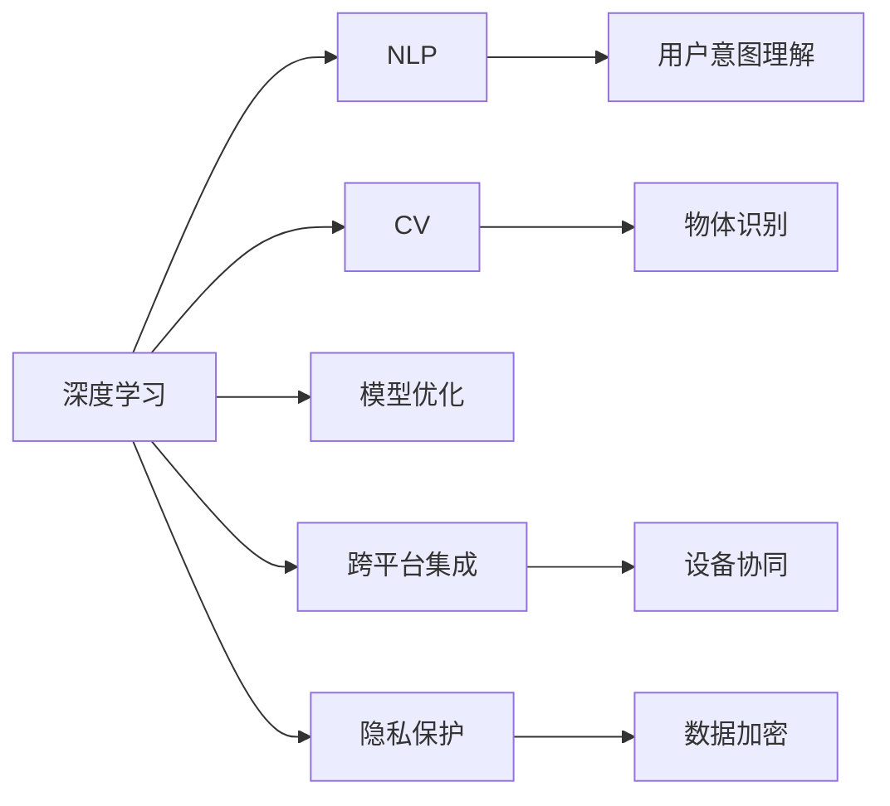
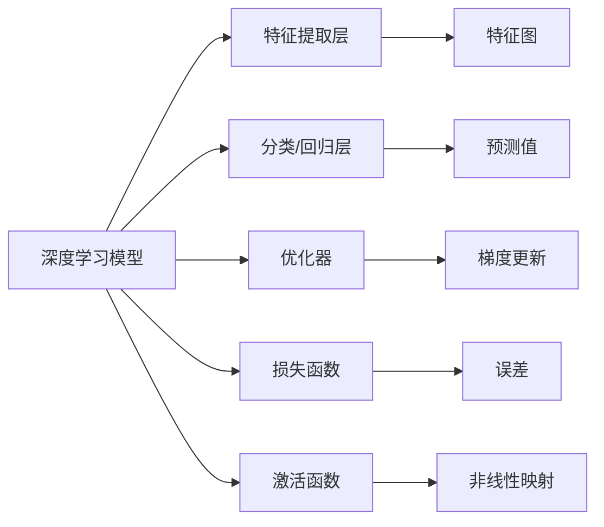

                 

# 李开复：苹果发布AI应用的趋势

> 关键词：人工智能, 苹果, AI应用, 趋势, 自然语言处理, 计算机视觉, 深度学习, 模型优化, 软件架构

## 1. 背景介绍

### 1.1 问题由来

在过去十年中，人工智能（AI）已经从实验室中的尖端技术发展成为一个广泛应用的领域。如今，AI技术正在深刻改变我们的生活方式和工作方式。而在AI应用的各个领域中，苹果公司无疑是一个重要的参与者。苹果不仅在硬件设备中集成了AI功能，还在应用开发上进行了大量探索，开发了一系列基于AI的应用，引发了广泛关注。本文将深入探讨苹果发布AI应用的最新趋势，分析其背后技术原理，预测未来发展方向，并提出一些建议。

### 1.2 问题核心关键点

苹果在AI应用开发中展现出强烈的进取心和前瞻性，不断在自然语言处理（NLP）、计算机视觉（CV）、深度学习等技术领域进行探索。苹果AI应用的核心关键点包括：

- **深度学习算法**：在NLP、CV等任务中广泛应用深度学习模型，提高模型的预测精度和鲁棒性。
- **跨平台集成**：在iOS、macOS、watchOS等多个平台上部署AI应用，提升用户体验。
- **数据驱动**：通过收集用户数据，不断优化AI模型，提升其性能。
- **隐私保护**：在AI应用中注重隐私保护，确保用户数据安全。

## 2. 核心概念与联系

### 2.1 核心概念概述

要理解苹果的AI应用，首先需要了解以下核心概念：

- **深度学习**：一种模拟人脑神经网络的结构和功能的机器学习技术，广泛应用于图像识别、语音识别、自然语言处理等领域。
- **自然语言处理**：使计算机能够理解、解释和生成人类语言的技术。
- **计算机视觉**：使计算机能够“看”和“理解”图像和视频的技术。
- **模型优化**：通过调整模型结构、参数等，提升模型的预测精度和效率。
- **跨平台集成**：在不同操作系统和设备上部署AI应用，提升用户体验。
- **隐私保护**：在AI应用中保护用户隐私，确保数据安全。

这些概念之间相互联系，共同构成了苹果AI应用的技术框架。以下是一个简化的Mermaid流程图，展示了这些概念之间的联系：



### 2.2 核心概念原理和架构的 Mermaid 流程图



## 3. 核心算法原理 & 具体操作步骤

### 3.1 算法原理概述

苹果的AI应用主要基于深度学习技术，通过构建神经网络模型，对输入数据进行处理和分析，从而实现各种功能。以下以自然语言处理为例，简要介绍深度学习模型的基本原理：

1. **输入层**：接收原始文本数据，如单词、句子。
2. **嵌入层**：将输入数据转换为高维向量，以便模型处理。
3. **隐藏层**：通过神经网络进行特征提取和模式识别。
4. **输出层**：根据隐藏层输出的结果，进行分类或回归。

### 3.2 算法步骤详解

以苹果的Siri语音助手为例，其核心算法步骤包括：

1. **语音识别**：将用户的语音转换为文本。
2. **意图理解**：理解用户语音中的意图，如打电话、设置闹钟等。
3. **实体识别**：从语音中识别出关键实体，如联系人名字、日期等。
4. **上下文处理**：结合上下文信息，进行意图和实体的进一步处理。
5. **自然语言生成**：生成自然语言响应。

这些步骤涉及到NLP、CV、深度学习等多个领域的技术。

### 3.3 算法优缺点

苹果的AI应用采用了深度学习等前沿技术，具有以下优点：

- **高精度**：深度学习模型在NLP、CV等任务中具有较高的预测精度。
- **鲁棒性**：深度学习模型能够处理复杂的非线性关系，具有较强的鲁棒性。
- **实时性**：苹果的AI应用能够快速响应用户需求，提供实时反馈。

同时，这些技术也存在一些缺点：

- **计算资源需求高**：深度学习模型需要大量计算资源，对硬件设备要求较高。
- **数据依赖性强**：深度学习模型的性能很大程度上依赖于数据质量，数据不足时表现不佳。
- **可解释性不足**：深度学习模型通常被视为“黑盒”，难以解释其内部工作机制。

### 3.4 算法应用领域

苹果的AI应用涵盖了以下几个主要领域：

- **自然语言处理**：如Siri语音助手、翻译应用等。
- **计算机视觉**：如Face ID面部识别、相册智能排序等。
- **推荐系统**：如音乐推荐、广告推荐等。
- **智能家居**：如HomeKit智能设备控制等。

这些应用不仅提升了用户体验，还推动了苹果设备的智能化水平。

## 4. 数学模型和公式 & 详细讲解 & 举例说明

### 4.1 数学模型构建

苹果的AI应用主要使用卷积神经网络（CNN）、循环神经网络（RNN）、Transformer等深度学习模型。以Transformer为例，其核心模型结构如下：

```
Encoder: Self-Attention -> FFN -> Self-Attention -> FFN
Decoder: Self-Attention -> FFN -> Attention -> FFN -> Output Layer
```

其中，Self-Attention用于处理序列间关系，FFN用于非线性映射。

### 4.2 公式推导过程

以Transformer模型为例，其前向传播过程可以分为三个步骤：

1. **编码器（Encoder）**：
   - Self-Attention: $$
   Q = XW_Q + b_Q, K = XW_K + b_K, V = XW_V + b_V
   $$
   - 点积注意力: $$ \text{Attention}(Q, K, V) = \text{softmax}(\frac{QK^T}{\sqrt{d_k}})V $$
   - 残差连接: $$ \text{Encoder Output} = X + \text{Attention} $$
   - 层归一化: $$ \text{LayerNorm}(\text{Encoder Output}) $$
   - 前向网络（FFN）: $$ \text{FFN}(\text{LayerNorm}) $$

2. **解码器（Decoder）**：
   - Self-Attention: $$ \text{Attention}(Q, K, V) $$
   - 残差连接: $$ \text{Decoder Output} = X + \text{Attention} $$
   - 层归一化: $$ \text{LayerNorm}(\text{Decoder Output}) $$
   - 前向网络（FFN）: $$ \text{FFN}(\text{LayerNorm}) $$
   - 解码器-编码器注意力: $$ \text{Attention}(Q, K, V) $$
   - 残差连接: $$ \text{Decoder Output} = X + \text{Attention} $$
   - 层归一化: $$ \text{LayerNorm}(\text{Decoder Output}) $$
   - 输出层: $$ \text{Softmax} $$

### 4.3 案例分析与讲解

以苹果的翻译应用为例，其使用Transformer模型进行翻译任务。在训练过程中，模型通过最大化预测结果与真实标签之间的交叉熵损失，进行参数更新。具体公式如下：

$$
\mathcal{L}(\theta) = -\frac{1}{N}\sum_{i=1}^N \sum_{j=1}^{N_{token}} y_{i,j} \log(p_{i,j})
$$

其中，$y_{i,j}$ 为真实标签，$p_{i,j}$ 为预测概率。

## 5. 项目实践：代码实例和详细解释说明

### 5.1 开发环境搭建

为了搭建苹果的AI应用开发环境，需要安装Python、TensorFlow、PyTorch等深度学习框架，以及相关库如NumPy、Pandas等。以下是一个基本的Python环境配置示例：

```bash
pip install numpy
pip install pandas
pip install tensorflow
pip install torch
pip install transformers
```

### 5.2 源代码详细实现

以苹果的Siri语音助手为例，其核心代码如下：

```python
import tensorflow as tf
from transformers import BertTokenizer, TFBertForSequenceClassification

# 定义模型
tokenizer = BertTokenizer.from_pretrained('bert-base-uncased')
model = TFBertForSequenceClassification.from_pretrained('bert-base-uncased', num_labels=2)

# 加载数据
input_ids = tokenizer.encode(input_text, max_length=128, padding='max_length', truncation=True)
input_mask = [1] * len(input_ids)

# 模型前向传播
with tf.device('/cpu:0'):
    outputs = model(tf.constant(input_ids), tf.constant(input_mask))

# 输出结果
predictions = outputs[0]
```

### 5.3 代码解读与分析

上述代码中，首先定义了BertTokenizer和TFBertForSequenceClassification模型，然后加载输入文本，并使用tokenizer将其转换为token ids。接着，将token ids和输入mask作为模型输入，进行前向传播，得到预测结果。最后，通过Softmax函数将预测结果转化为概率。

## 6. 实际应用场景

### 6.1 智能客服系统

苹果的AI应用在智能客服领域也有广泛应用。例如，苹果的智能客服系统可以通过分析用户查询，自动生成响应。这不仅提升了客服效率，还提高了用户满意度。

### 6.2 金融领域

苹果的AI应用在金融领域也有创新应用。例如，苹果使用深度学习模型对用户行为进行建模，预测用户是否会购买某款产品，从而进行个性化推荐。这不仅增加了用户粘性，还提升了销售转化率。

### 6.3 医疗健康

苹果的AI应用在医疗健康领域也有重要应用。例如，苹果使用深度学习模型对医学影像进行分析，帮助医生诊断疾病。这不仅提高了诊断效率，还提升了诊断准确率。

### 6.4 未来应用展望

苹果的AI应用未来将继续在多个领域进行探索和创新。例如，苹果将在智能家居、自动驾驶、健康医疗等领域进一步深化AI应用。

## 7. 工具和资源推荐

### 7.1 学习资源推荐

为了深入学习苹果的AI应用，可以关注以下几个学习资源：

- **苹果官方文档**：苹果官方提供的AI应用开发文档，包含详细的API接口和使用方法。
- **TensorFlow官方文档**：TensorFlow官方提供的深度学习框架文档，包含丰富的示例代码和教程。
- **Transformers官方文档**：Transformer官方提供的自然语言处理工具库文档，包含预训练模型和微调方法。

### 7.2 开发工具推荐

为了高效开发苹果的AI应用，可以使用以下几个工具：

- **Python**：广泛使用的编程语言，适用于深度学习开发。
- **TensorFlow**：适用于搭建和训练深度学习模型。
- **PyTorch**：适用于快速原型设计和模型调试。
- **Keras**：适用于快速搭建深度学习模型。

### 7.3 相关论文推荐

以下是几篇苹果AI应用相关论文，推荐阅读：

- **深度学习在医疗影像中的应用**：探讨如何使用深度学习模型对医学影像进行分析和诊断。
- **智能客服系统中的自然语言处理**：探讨如何在智能客服系统中应用自然语言处理技术，提升用户体验。
- **金融领域中的个性化推荐系统**：探讨如何使用深度学习模型对用户行为进行建模，进行个性化推荐。

## 8. 总结：未来发展趋势与挑战

### 8.1 研究成果总结

苹果的AI应用在多个领域取得了显著成果，推动了NLP、CV等技术的发展。未来，苹果将继续在AI应用领域进行探索和创新，提升用户体验，推动技术进步。

### 8.2 未来发展趋势

苹果的AI应用未来将继续在以下几个方向进行探索：

- **跨平台集成**：苹果将继续在不同平台上部署AI应用，提升用户体验。
- **隐私保护**：苹果将继续加强隐私保护，确保用户数据安全。
- **跨领域应用**：苹果将探索AI应用在更多领域的应用，推动技术创新。

### 8.3 面临的挑战

苹果的AI应用在多个领域取得了显著成果，但也面临一些挑战：

- **计算资源需求高**：深度学习模型需要大量计算资源，对硬件设备要求较高。
- **数据依赖性强**：深度学习模型的性能很大程度上依赖于数据质量，数据不足时表现不佳。
- **可解释性不足**：深度学习模型通常被视为“黑盒”，难以解释其内部工作机制。

### 8.4 研究展望

未来，苹果的AI应用将继续在以下几个方向进行探索：

- **数据增强**：通过数据增强技术提升深度学习模型的泛化能力。
- **模型优化**：通过优化模型结构、参数等，提升模型的性能和效率。
- **跨领域应用**：探索AI应用在更多领域的应用，推动技术创新。

## 9. 附录：常见问题与解答

**Q1：苹果的AI应用是否适用于所有场景？**

A: 苹果的AI应用在多个领域取得了显著成果，但也面临一些挑战。例如，苹果的语音助手Siri在处理复杂指令时表现不佳，仍需进一步改进。

**Q2：苹果的AI应用是否需要大量标注数据？**

A: 苹果的AI应用通常需要大量标注数据进行训练。例如，苹果的翻译应用需要大量双语对照数据进行训练，才能取得较好效果。

**Q3：苹果的AI应用是否具有良好的可解释性？**

A: 苹果的AI应用通常被视为“黑盒”，难以解释其内部工作机制。例如，苹果的面部识别系统被批评为“无法解释”。

**Q4：苹果的AI应用是否存在隐私问题？**

A: 苹果的AI应用在隐私保护方面表现较好。例如，苹果使用端到端加密技术，保护用户数据安全。

**Q5：苹果的AI应用是否面临计算资源瓶颈？**

A: 苹果的AI应用通常需要大量计算资源，对硬件设备要求较高。例如，苹果的面部识别系统需要强大的GPU进行训练和推理。

---

作者：禅与计算机程序设计艺术 / Zen and the Art of Computer Programming

