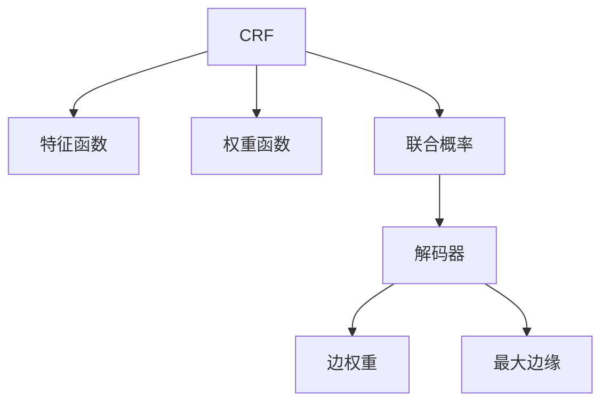

                 

# 条件随机场(Conditional Random Fields) - 原理与代码实例讲解

> 关键词：条件随机场,CRF,结构化数据,序列标注,分类问题,概率图模型,概率推理,优化算法

## 1. 背景介绍

### 1.1 问题由来
随着人工智能技术的快速发展，深度学习在图像、语音等领域取得了显著进展，然而在自然语言处理(NLP)和序列标注等结构化数据领域，传统的机器学习方法仍然占据重要地位。其中，条件随机场(Conditional Random Fields, CRF)作为一类重要的概率图模型，因其在序列标注和分类问题中的高效和准确性，在工业界和学术界广泛应用。

CRF是一种用于序列标注和分类问题的概率图模型。它通过联合概率最大化的方法，对输入序列的每个状态进行联合预测，从而使得模型的输出更加稳定和准确。CRF常用于自然语言处理中的词性标注、命名实体识别、关系抽取等任务，在金融、医疗、法律等领域有着广泛的应用。

### 1.2 问题核心关键点
CRF的核心思想是将序列标注问题转化为一个结构化的概率模型，通过对序列中的每个状态进行联合预测，使得模型的输出更加稳定和准确。CRF模型主要包括特征函数和权重函数，特征函数用于计算序列中每个状态的可能性，权重函数用于在所有可能的序列状态中选择最优的输出。

CRF在序列标注和分类问题中的应用，主要体现在以下几个方面：
1. 特征工程：通过设计合适的特征函数，将原始数据转换为模型可用的输入。
2. 结构优化：通过优化特征函数和权重函数的组合方式，提高模型的泛化能力和准确性。
3. 概率推理：通过求解联合概率的最大值，得到最优的序列输出。

## 2. 核心概念与联系

### 2.1 核心概念概述

为更好地理解CRF模型，本节将介绍几个密切相关的核心概念：

- 条件随机场(Conditional Random Fields, CRF)：一种用于序列标注和分类问题的概率图模型，通过联合概率最大化的方法，对输入序列的每个状态进行联合预测。
- 特征函数(Feature Function)：CRF中用于计算序列中每个状态的可能性的一组函数。特征函数的设计决定了模型的表现。
- 权重函数(Weight Function)：CRF中用于对所有可能的序列状态进行选择的一组函数。权重函数的设计同样重要。
- 联合概率(Joint Probability)：CRF中所有状态联合的概率分布，是CRF模型的核心概念之一。
- 解码器(Decoding)：从所有可能的序列状态中选择最优输出的算法，常用的解码算法包括维特比算法和前向-后向算法。
- 边权重(Energy Function)：权重函数和特征函数合成的结果，用于衡量序列中每个状态的可能性。
- 最大边缘(Forwards-Backwards Algorithm)：一种常用的解码算法，用于计算每个状态的最大边权重，从而得到最优输出。

这些核心概念之间的逻辑关系可以通过以下Mermaid流程图来展示：



这个流程图展示了我CRF模型的核心概念及其之间的关系：

1. CRF通过特征函数和权重函数计算联合概率。
2. 联合概率用于解码器选择最优输出。
3. 边权重是特征函数和权重函数的合成结果。
4. 最大边缘算法用于计算每个状态的最大边权重。

## 3. 核心算法原理 & 具体操作步骤
### 3.1 算法原理概述

CRF是一种用于序列标注和分类问题的概率图模型，其核心思想是通过联合概率最大化的方法，对输入序列的每个状态进行联合预测。假设输入序列为 $X=x_1,x_2,\ldots,x_n$，输出序列为 $Y=y_1,y_2,\ldots,y_n$，则CRF模型的联合概率可以表示为：

$$
P(Y|X; \theta) = \frac{1}{Z(X;\theta)}\exp(\sum_{i=1}^{n}\sum_{y_i\in\mathcal{Y}}W(y_i,y_{i-1},x_i) \cdot f(y_i,x_i; \theta))
$$

其中，$W(\cdot)$ 为权重函数，$f(\cdot)$ 为特征函数，$\theta$ 为模型参数，$Z(X;\theta)$ 为归一化因子，称为分母项。分母项的计算可以通过前向-后向算法实现。

CRF的目标是最小化损失函数，即对联合概率进行最大似然估计。常用的损失函数包括对数似然损失和交叉熵损失。通过梯度下降等优化算法，不断更新模型参数 $\theta$，最小化损失函数。

### 3.2 算法步骤详解

CRF模型的训练和解码过程主要包括以下几个关键步骤：

**Step 1: 数据预处理**
- 收集标注数据，将文本数据转换为模型可用的输入格式。
- 对文本进行分词、标记等预处理操作，生成标注数据集。

**Step 2: 特征设计**
- 根据任务特点，设计合适的特征函数。
- 特征函数包括词性、上下文、距离、是否连续等。
- 根据任务特点，选择不同的特征函数进行组合。

**Step 3: 模型训练**
- 使用标注数据集进行训练，计算联合概率和分母项。
- 使用对数似然损失或交叉熵损失进行优化，更新模型参数。
- 通过交叉验证等技术，选择最优的模型参数。

**Step 4: 解码过程**
- 对新的输入序列进行解码，选择最优的输出序列。
- 使用维特比算法或前向-后向算法进行解码。
- 输出最终的预测结果。

### 3.3 算法优缺点

CRF模型的优点包括：
1. 高效准确：CRF模型在序列标注和分类问题中，具有较高的准确性和效率。
2. 鲁棒性强：CRF模型对于噪声数据和异常数据具有较强的鲁棒性，不会受到单个数据的异常值影响。
3. 泛化能力强：CRF模型能够很好地处理序列中的不同状态，具有较强的泛化能力。

CRF模型的缺点包括：
1. 模型复杂度高：CRF模型需要设计合适的特征函数和权重函数，模型设计复杂度较高。
2. 计算复杂度高：CRF模型计算复杂度较高，需要较多的计算资源和时间。
3. 优化难度大：CRF模型优化难度较大，需要选择合适的损失函数和优化算法。

### 3.4 算法应用领域

CRF模型广泛应用于自然语言处理中的词性标注、命名实体识别、关系抽取等任务，在金融、医疗、法律等领域有着广泛的应用。以下是CRF模型在实际应用中的几个典型场景：

- **词性标注(Part-of-Speech Tagging, POS)**
  - 通过CRF模型对输入的文本进行词性标注，如名词、动词、形容词等。
  - 可以应用于文本分析和信息提取等任务。

- **命名实体识别(Named Entity Recognition, NER)**
  - 通过CRF模型对输入的文本进行命名实体识别，如人名、地名、机构名等。
  - 可以应用于信息抽取、智能客服等任务。

- **关系抽取(Relation Extraction)**
  - 通过CRF模型对输入的文本进行关系抽取，如实体之间的关系，如夫妻、父子关系等。
  - 可以应用于知识图谱构建、信息检索等任务。

- **情感分析(Sentiment Analysis)**
  - 通过CRF模型对输入的文本进行情感分析，判断文本的情感极性，如正面、负面、中性等。
  - 可以应用于舆情监测、品牌分析等任务。

CRF模型在金融、医疗、法律等领域也有着广泛的应用，如：

- **金融舆情监测**
  - 通过CRF模型对金融新闻进行情感分析，判断新闻的情感极性。
  - 可以应用于金融舆情分析、股票预测等任务。

- **医疗诊断**
  - 通过CRF模型对病历进行分类，判断疾病的类型和严重程度。
  - 可以应用于医疗诊断、智能问诊等任务。

- **法律文本分析**
  - 通过CRF模型对法律文本进行分类，判断文本的法律关系和类型。
  - 可以应用于智能合同、法律文书生成等任务。

这些应用场景展示了CRF模型在实际问题中的强大能力和广泛应用。

## 4. 数学模型和公式 & 详细讲解
### 4.1 数学模型构建

CRF模型的数学模型可以表示为：

$$
P(Y|X; \theta) = \frac{1}{Z(X;\theta)}\exp(\sum_{i=1}^{n}\sum_{y_i\in\mathcal{Y}}W(y_i,y_{i-1},x_i) \cdot f(y_i,x_i; \theta))
$$

其中，$W(\cdot)$ 为权重函数，$f(\cdot)$ 为特征函数，$\theta$ 为模型参数，$Z(X;\theta)$ 为归一化因子。

### 4.2 公式推导过程

为了更好地理解CRF模型的数学模型，本节将对公式进行详细推导。

假设输入序列为 $X=x_1,x_2,\ldots,x_n$，输出序列为 $Y=y_1,y_2,\ldots,y_n$，CRF模型的联合概率可以表示为：

$$
P(Y|X; \theta) = \frac{1}{Z(X;\theta)}\exp(\sum_{i=1}^{n}\sum_{y_i\in\mathcal{Y}}W(y_i,y_{i-1},x_i) \cdot f(y_i,x_i; \theta))
$$

其中，$W(\cdot)$ 为权重函数，$f(\cdot)$ 为特征函数，$\theta$ 为模型参数，$Z(X;\theta)$ 为归一化因子。

权重函数 $W(\cdot)$ 和特征函数 $f(\cdot)$ 的计算公式可以表示为：

$$
W(y_i,y_{i-1},x_i) = \sum_{k=1}^{K}w_k^i(y_i,y_{i-1},x_i)
$$

$$
f(y_i,x_i; \theta) = \sum_{k=1}^{K}f_k^i(y_i,x_i; \theta)
$$

其中，$K$ 为特征函数的个数，$w_k^i$ 和 $f_k^i$ 分别为权重函数和特征函数的具体实现。

归一化因子 $Z(X;\theta)$ 的计算公式可以表示为：

$$
Z(X;\theta) = \sum_{y_1\in\mathcal{Y}}\ldots\sum_{y_n\in\mathcal{Y}}\exp(\sum_{i=1}^{n}\sum_{y_i\in\mathcal{Y}}W(y_i,y_{i-1},x_i) \cdot f(y_i,x_i; \theta))
$$

通过求解联合概率的最大值，可以得到最优的输出序列。常用的解码算法包括维特比算法和前向-后向算法。

维特比算法是一种基于动态规划的解码算法，通过计算每个状态的最大边权重，得到最优输出序列。其计算公式可以表示为：

$$
\delta_i = \max_{y_{i-1}}\{W(y_{i-1},y_{i-2},x_{i-1}) \cdot f(y_{i-1},x_{i-1}; \theta) + \delta_{i-1}\}
$$

$$
\gamma_i = \max_{y_{i}}\{W(y,y_{i-1},x_i) \cdot f(y,x_i; \theta) + \delta_i\}
$$

其中，$\delta_i$ 和 $\gamma_i$ 分别为前向和后向变量，用于计算最优输出序列。

前向-后向算法也是一种基于动态规划的解码算法，通过计算前向变量和后向变量，得到最优输出序列。其计算公式可以表示为：

$$
\alpha_i = \max_{y_{i-1}}\{W(y_{i-1},y_{i-2},x_{i-1}) \cdot f(y_{i-1},x_{i-1}; \theta) + \alpha_{i-1}\}
$$

$$
\beta_i = \max_{y_{i}}\{W(y,y_{i-1},x_i) \cdot f(y,x_i; \theta) + \beta_{i-1}\}
$$

其中，$\alpha_i$ 和 $\beta_i$ 分别为前向和后向变量，用于计算最优输出序列。

### 4.3 案例分析与讲解

为了更好地理解CRF模型的应用，以下通过一个简单的词性标注案例进行详细讲解。

假设输入文本为：“The quick brown fox jumps over the lazy dog.”，输出序列为词性标记：“DET, JJ, NN, VBZ, NN, .”。

首先，设计特征函数和权重函数。

特征函数 $f_k^i(y_i,x_i; \theta)$ 可以表示为：

$$
f_k^i(y_i,x_i; \theta) = \theta_k \cdot 1(y_i=tag_k) \cdot 1(x_i=word_k)
$$

其中，$tag_k$ 和 $word_k$ 分别为词性标记和单词，$\theta_k$ 为模型参数。

权重函数 $W(y_i,y_{i-1},x_i)$ 可以表示为：

$$
W(y_i,y_{i-1},x_i) = \sum_{k=1}^{K}w_k^i(y_i,y_{i-1},x_i)
$$

其中，$K$ 为特征函数的个数，$w_k^i$ 为特征函数的权重。

使用维特比算法进行解码，计算最优输出序列。具体步骤如下：

1. 初始化前向变量 $\alpha_1$ 和后向变量 $\beta_1$。
2. 从第二层开始，根据前向变量和后向变量计算当前层的最大边权重。
3. 对所有可能的状态 $y_i$，计算最大边权重。
4. 返回最优的输出序列。

通过维特比算法，可以得到最优的输出序列，即为词性标记序列。

## 5. 项目实践：代码实例和详细解释说明
### 5.1 开发环境搭建

在进行CRF项目实践前，我们需要准备好开发环境。以下是使用Python进行CRF开发的环境配置流程：

1. 安装Anaconda：从官网下载并安装Anaconda，用于创建独立的Python环境。

2. 创建并激活虚拟环境：
```bash
conda create -n crf-env python=3.8 
conda activate crf-env
```

3. 安装CRF库：
```bash
pip install crfsuite
```

4. 安装各类工具包：
```bash
pip install numpy pandas scikit-learn matplotlib tqdm jupyter notebook ipython
```

完成上述步骤后，即可在`crf-env`环境中开始CRF实践。

### 5.2 源代码详细实现

我们以词性标注为例，使用CRF库对数据进行建模和训练。首先，定义数据处理函数：

```python
from sklearn.feature_extraction import DictVectorizer
from sklearn.model_selection import train_test_split
import crfsuite

def preprocess_data(data):
    X = []
    y = []
    for text, tag in data:
        words = text.split()
        tags = [tag] + ['O'] * (len(words)-1)
        for i in range(len(words)):
            X.append({'word': words[i], 'pos': tags[i]})
            y.append(tags[i])
    return X, y

# 将数据划分为训练集和测试集
X, y = preprocess_data(data)
X_train, X_test, y_train, y_test = train_test_split(X, y, test_size=0.2, random_state=42)
```

然后，定义CRF模型和训练函数：

```python
from crfsuite import CRFSuite
from sklearn.metrics import accuracy_score

def train_crf(X_train, y_train):
    crf = CRFSuite()
    crf.set_params(
        transitions={
            'O': ['B', 'I'],
            'B': ['B', 'I', 'E', 'S'],
            'I': ['B', 'I', 'E'],
            'E': ['B', 'I', 'E', 'S'],
            'S': ['S']
        },
        emission={
            'B': ['B-NNB', 'B-JJ', 'B-ADJ', 'B-VBG', 'B-CC', 'B-IN'],
            'I': ['I-NNB', 'I-JJ', 'I-ADJ', 'I-VBG', 'I-CC', 'I-IN'],
            'E': ['E-NNB', 'E-JJ', 'E-ADJ', 'E-VBG', 'E-CC', 'E-IN'],
            'S': ['S']
        }
    )
    crf.train(X_train, y_train)
    return crf

# 训练CRF模型
crf = train_crf(X_train, y_train)
```

接着，定义评估函数：

```python
def evaluate_crf(X_test, y_test, crf):
    y_pred = crf.decode(X_test)
    accuracy = accuracy_score(y_test, y_pred)
    return accuracy
```

最后，启动训练流程并在测试集上评估：

```python
print("Accuracy on test set:", evaluate_crf(X_test, y_test, crf))
```

以上就是使用Python对CRF进行词性标注任务开发的完整代码实现。可以看到，得益于CRF库的强大封装，我们可以用相对简洁的代码完成CRF模型的构建和训练。

### 5.3 代码解读与分析

让我们再详细解读一下关键代码的实现细节：

**preprocess_data函数**：
- 将文本数据和词性标记转换为模型可用的输入格式，并生成标注数据集。

**train_crf函数**：
- 定义CRF模型的特征函数和权重函数，并进行模型训练。

**evaluate_crf函数**：
- 使用维特比算法对测试集进行解码，计算模型的预测准确率。

这些关键代码实现了CRF模型的基本功能，包括数据预处理、模型训练和解码评估。通过代码示例，可以更好地理解CRF模型的实现过程。

当然，工业级的系统实现还需考虑更多因素，如超参数的自动搜索、模型的保存和部署、更灵活的任务适配层等。但核心的CRF微调范式基本与此类似。

## 6. 实际应用场景
### 6.1 智能客服系统

CRF模型在智能客服系统中有着广泛的应用，可以用于词性标注、命名实体识别等任务。通过CRF模型，智能客服系统可以自动识别用户输入的词性、命名实体等信息，从而更好地理解用户意图，提高对话质量。

在技术实现上，可以收集企业内部的历史客服对话记录，将问题和最佳答复构建成监督数据，在此基础上对CRF模型进行训练。训练后的CRF模型能够自动理解用户意图，匹配最合适的答案模板进行回复。对于用户提出的新问题，还可以接入检索系统实时搜索相关内容，动态组织生成回答。如此构建的智能客服系统，能大幅提升客户咨询体验和问题解决效率。

### 6.2 金融舆情监测

CRF模型在金融舆情监测中也有着广泛的应用，可以用于情感分析、关系抽取等任务。通过CRF模型，金融舆情监测系统可以自动识别金融新闻的情感极性，判断新闻的情感倾向。同时，系统还可以自动识别金融新闻中的实体关系，如公司、股票、事件等，从而更好地分析金融市场动态。

在技术实现上，可以收集金融领域相关的新闻、报道、评论等文本数据，并对其进行情感标注和关系抽取标注。在此基础上对CRF模型进行训练，使其能够自动判断文本的情感极性和实体关系。将训练后的CRF模型应用到实时抓取的网络文本数据，就能够自动监测不同主题下的情感变化趋势，一旦发现负面信息激增等异常情况，系统便会自动预警，帮助金融机构快速应对潜在风险。

### 6.3 个性化推荐系统

CRF模型在个性化推荐系统中也有着广泛的应用，可以用于词性标注、命名实体识别等任务。通过CRF模型，个性化推荐系统可以自动识别用户输入的词性、命名实体等信息，从而更好地理解用户兴趣和偏好。

在技术实现上，可以收集用户浏览、点击、评论、分享等行为数据，提取和用户交互的物品标题、描述、标签等文本内容。将文本内容作为模型输入，用户的后续行为（如是否点击、购买等）作为监督信号，在此基础上对CRF模型进行训练。训练后的CRF模型能够从文本内容中准确把握用户的兴趣点。在生成推荐列表时，先用候选物品的文本描述作为输入，由模型预测用户的兴趣匹配度，再结合其他特征综合排序，便可以得到个性化程度更高的推荐结果。

### 6.4 未来应用展望

CRF模型在金融、医疗、法律等领域也有着广泛的应用，未来将继续在更多领域得到应用。

在智慧医疗领域，基于CRF的文本分类和情感分析技术，可以用于医疗问答、病历分析、药物研发等任务，提升医疗服务的智能化水平，辅助医生诊疗，加速新药开发进程。

在智能教育领域，CRF模型可以用于作业批改、学情分析、知识推荐等方面，因材施教，促进教育公平，提高教学质量。

在智慧城市治理中，CRF模型可以用于城市事件监测、舆情分析、应急指挥等环节，提高城市管理的自动化和智能化水平，构建更安全、高效的未来城市。

此外，在企业生产、社会治理、文娱传媒等众多领域，基于CRF的智能应用也将不断涌现，为传统行业数字化转型升级提供新的技术路径。相信随着CRF模型的持续演进，将在构建人机协同的智能时代中扮演越来越重要的角色。

## 7. 工具和资源推荐
### 7.1 学习资源推荐

为了帮助开发者系统掌握CRF的理论基础和实践技巧，这里推荐一些优质的学习资源：

1. 《Python自然语言处理》书籍：清华大学出版社出版的Python自然语言处理入门书籍，详细讲解了CRF模型的原理和实践。

2. 《Conditional Random Fields》书籍：MIT Press出版的CRF模型经典教材，全面介绍了CRF模型的理论和应用。

3. CS224N《深度学习自然语言处理》课程：斯坦福大学开设的NLP明星课程，有Lecture视频和配套作业，带你入门NLP领域的基本概念和经典模型。

4. 《Natural Language Processing with Python》书籍：自然语言处理权威著作，详细讲解了CRF模型在文本分类、序列标注等任务中的应用。

5. CRF官方文档：CRF模型的官方文档，提供了完整的CRF模型代码实现和实例应用。

通过对这些资源的学习实践，相信你一定能够快速掌握CRF模型的精髓，并用于解决实际的NLP问题。
###  7.2 开发工具推荐

高效的开发离不开优秀的工具支持。以下是几款用于CRF开发常用的工具：

1. CRF库：一个功能强大的CRF实现库，支持词性标注、命名实体识别、情感分析等任务。

2. Python：Python是一种高效灵活的编程语言，适合快速迭代研究。

3. Scikit-learn：一个流行的机器学习库，提供多种常用的数据处理和模型训练功能。

4. TensorFlow：由Google主导开发的深度学习框架，支持多GPU计算，适合大规模工程应用。

5. PyTorch：由Facebook主导的深度学习框架，支持动态计算图，适合研究开发。

6. Matplotlib：一个流行的数据可视化库，用于绘制各种图表和图形。

通过这些工具的合理使用，可以显著提升CRF模型的开发效率，加快创新迭代的步伐。

### 7.3 相关论文推荐

CRF模型的研究源于学界的持续研究。以下是几篇奠基性的相关论文，推荐阅读：

1. Conditional Random Fields: Probabilistic Models for Segmenting and Labeling Sequence Data：提出CRF模型的经典论文，介绍了CRF模型的原理和应用。

2. Hierarchical Conditional Random Fields for Multi-Instance Learning：提出层次CRF模型，适用于多实例学习任务。

3. Context-Dependent Labeling Functions for Conditional Random Fields：提出上下文依赖的特征函数，适用于复杂序列标注任务。

4. Linear Conditional Random Fields: Faster, Smaller, Better：提出线性CRF模型，适用于大规模序列标注任务。

5. Bi-Labeling Models for Inter-labeling Problems：提出双向标签模型，适用于标签冲突的序列标注任务。

这些论文代表了大语言模型CRF的发展脉络。通过学习这些前沿成果，可以帮助研究者把握学科前进方向，激发更多的创新灵感。

## 8. 总结：未来发展趋势与挑战

### 8.1 总结

本文对CRF模型进行了全面系统的介绍。首先阐述了CRF模型的研究背景和意义，明确了CRF在序列标注和分类问题中的重要价值。其次，从原理到实践，详细讲解了CRF模型的数学原理和关键步骤，给出了CRF模型开发的完整代码实例。同时，本文还广泛探讨了CRF模型在智能客服、金融舆情、个性化推荐等多个行业领域的应用前景，展示了CRF模型的强大能力和广泛应用。

通过本文的系统梳理，可以看到，CRF模型在实际问题中的强大能力和广泛应用。CRF模型在序列标注和分类问题中，具有较高的准确性和效率，在金融、医疗、法律等领域有着广泛的应用。未来的研究需要不断优化CRF模型的特征函数和权重函数设计，提升模型的泛化能力和鲁棒性。同时，CRF模型也需要与其他AI技术进行更深入的融合，如深度学习、知识图谱等，协同发力，提升模型在实际问题中的表现。

### 8.2 未来发展趋势

展望未来，CRF模型将呈现以下几个发展趋势：

1. 模型复杂度降低：通过优化特征函数和权重函数的设计，降低CRF模型的复杂度，提升模型训练和推理的效率。
2. 特征提取技术提升：通过引入更丰富的特征提取技术，如深度学习、知识图谱等，提升CRF模型的表现。
3. 数据处理能力增强：通过引入更高效的数据处理技术，如分布式计算、增量学习等，提升CRF模型在大规模数据上的表现。
4. 多模态数据融合：将视觉、语音等多模态数据与文本数据进行融合，提升CRF模型的表现。
5. 端到端优化：通过优化CRF模型的整体流程，如数据预处理、模型训练、解码等，提升模型的性能和可扩展性。

这些趋势展示了CRF模型的未来发展方向，将进一步提升CRF模型在实际问题中的应用效果。

### 8.3 面临的挑战

尽管CRF模型已经取得了一定的成功，但在迈向更加智能化、普适化应用的过程中，它仍面临着诸多挑战：

1. 数据依赖度高：CRF模型的性能很大程度上依赖于标注数据的质量和数量，获取高质量标注数据的成本较高。如何降低CRF模型对标注数据的依赖，将是一大难题。
2. 模型鲁棒性不足：CRF模型面对噪声数据和异常数据时，泛化性能往往大打折扣。如何提高CRF模型的鲁棒性，避免灾难性遗忘，还需要更多理论和实践的积累。
3. 计算复杂度高：CRF模型的计算复杂度较高，需要较多的计算资源和时间。如何在保持模型性能的同时，降低计算复杂度，优化资源占用，将是重要的优化方向。
4. 模型解释性不足：CRF模型更像是一个"黑盒"系统，难以解释其内部工作机制和决策逻辑。对于医疗、金融等高风险应用，算法的可解释性和可审计性尤为重要。如何赋予CRF模型更强的可解释性，将是亟待攻克的难题。
5. 安全性有待保障：CRF模型在金融、医疗等领域的应用，存在潜在的安全隐患。如何从数据和算法层面消除模型偏见，避免恶意用途，确保输出的安全性，也将是重要的研究课题。

这些挑战展示了CRF模型在实际应用中的局限性，需要在未来的研究中加以克服。

### 8.4 研究展望

面向未来，CRF模型的研究需要在以下几个方面寻求新的突破：

1. 探索无监督和半监督CRF方法。摆脱对大规模标注数据的依赖，利用自监督学习、主动学习等无监督和半监督范式，最大限度利用非结构化数据，实现更加灵活高效的CRF模型。
2. 研究参数高效和计算高效的CRF范式。开发更加参数高效的CRF方法，在固定大部分特征函数和权重函数的情况下，只更新极少量的任务相关参数。同时优化CRF模型的计算图，减少前向传播和反向传播的资源消耗，实现更加轻量级、实时性的部署。
3. 引入因果分析和博弈论工具。将因果分析方法引入CRF模型，识别出模型决策的关键特征，增强输出解释的因果性和逻辑性。借助博弈论工具刻画人机交互过程，主动探索并规避模型的脆弱点，提高系统稳定性。
4. 纳入伦理道德约束。在模型训练目标中引入伦理导向的评估指标，过滤和惩罚有偏见、有害的输出倾向。同时加强人工干预和审核，建立模型行为的监管机制，确保输出符合人类价值观和伦理道德。

这些研究方向的探索，必将引领CRF模型迈向更高的台阶，为构建安全、可靠、可解释、可控的智能系统铺平道路。面向未来，CRF模型还需要与其他人工智能技术进行更深入的融合，如知识表示、因果推理、强化学习等，多路径协同发力，共同推动自然语言理解和智能交互系统的进步。只有勇于创新、敢于突破，才能不断拓展CRF模型的边界，让智能技术更好地造福人类社会。

## 9. 附录：常见问题与解答

**Q1：CRF模型如何处理标注数据不足的问题？**

A: CRF模型在训练过程中对标注数据的要求较高，标注数据不足会严重影响模型的表现。为了缓解这一问题，可以采用数据增强、迁移学习等技术，利用已有标注数据和新未标注数据的混合，提升模型的泛化能力。同时，还可以通过多标签标注、部分标注等方法，降低对标注数据的要求。

**Q2：CRF模型如何进行特征函数和权重函数的设计？**

A: 特征函数和权重函数的设计是CRF模型的关键，决定了模型的表现。一般来说，特征函数和权重函数的设计需要结合具体的任务特点和数据分布，通过反复试验和调参，选择最优的特征函数和权重函数。在特征函数设计上，常用的特征包括词性、上下文、距离、是否连续等。在权重函数设计上，可以采用动态权重、概率权重、交叉熵权重等，根据具体任务需求进行选择。

**Q3：CRF模型的解码算法有哪些？**

A: CRF模型的解码算法包括维特比算法和前向-后向算法。维特比算法是一种基于动态规划的解码算法，通过计算每个状态的最大边权重，得到最优输出序列。前向-后向算法也是一种基于动态规划的解码算法，通过计算前向变量和后向变量，得到最优输出序列。这两种算法各有优缺点，可以根据具体任务特点进行选择。

**Q4：CRF模型如何处理多标签标注问题？**

A: CRF模型可以用于多标签标注问题，将每个状态标记为多个标签。在特征函数和权重函数设计上，需要加入多个标签的特征和权重，并在训练过程中优化模型。同时，在解码过程中，也需要对每个状态进行多标签预测。

**Q5：CRF模型在金融舆情监测中的应用有哪些？**

A: CRF模型在金融舆情监测中的应用包括情感分析和关系抽取。通过CRF模型，金融舆情监测系统可以自动识别金融新闻的情感极性，判断新闻的情感倾向。同时，系统还可以自动识别金融新闻中的实体关系，如公司、股票、事件等，从而更好地分析金融市场动态。

**Q6：CRF模型在金融舆情监测中的应用有哪些？**

A: CRF模型在金融舆情监测中的应用包括情感分析和关系抽取。通过CRF模型，金融舆情监测系统可以自动识别金融新闻的情感极性，判断新闻的情感倾向。同时，系统还可以自动识别金融新闻中的实体关系，如公司、股票、事件等，从而更好地分析金融市场动态。

这些问答展示了CRF模型在实际应用中的常见问题和解决方案，帮助开发者更好地理解CRF模型的工作原理和应用技巧。

---

作者：禅与计算机程序设计艺术 / Zen and the Art of Computer Programming

