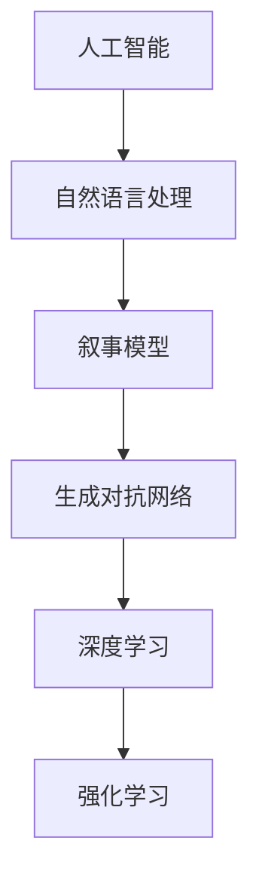

                 

# 构建讲故事的人工智能：课程概述

> 关键词：人工智能,自然语言处理,叙事模型,生成对抗网络(GANs),深度学习,强化学习,课程内容

## 1. 背景介绍

### 1.1 问题由来

讲故事是人类最古老、最基础的语言应用之一。从古至今，叙事、寓言、文学作品等形式的文学创作，一直是人类文化传承的重要形式。然而，传统的故事讲述通常依赖于作者的经验和才华，需要大量的时间、精力和训练。在快速发展的数字化时代，如何让机器也能像人类一样讲述引人入胜的故事，成为了一个令人兴奋的研究课题。

### 1.2 问题核心关键点

构建讲故事的人工智能需要解决的核心问题包括：
- 如何利用深度学习技术，让机器能够理解故事的语法和语义结构，捕捉其中的情感和逻辑关系。
- 如何在故事生成的过程中，保持语言风格的多样性，避免千篇一律的重复。
- 如何通过优化算法，让机器生成的故事贴近人类的叙事习惯和语言习惯。
- 如何评估生成的故事的吸引力、连贯性和真实性，建立合理的评估标准。

## 2. 核心概念与联系

### 2.1 核心概念概述

构建讲故事的人工智能涉及多个核心概念，它们之间存在紧密的联系和依赖关系：

- **人工智能**：指利用计算机模拟人类智能行为的技术，包括感知、学习、推理等能力。
- **自然语言处理(NLP)**：研究如何让计算机理解和处理人类语言，是构建讲故事AI的基础。
- **叙事模型**：指能够自动生成和分析叙事的模型，包括故事结构、角色设定、情感表达等方面。
- **生成对抗网络(GANs)**：一种通过对抗性训练生成高质量数据的深度学习框架，适用于生成逼真故事。
- **深度学习**：指多层神经网络的自监督学习技术，用于从大量数据中自动学习特征。
- **强化学习**：通过试错机制，让机器在特定环境下通过优化决策策略来完成任务。

这些概念通过深度学习和生成对抗网络等技术手段，在叙事模型和故事生成方面发挥作用。

### 2.2 核心概念原理和架构的 Mermaid 流程图



这个流程图展示了从人工智能到深度学习的整个路径，以及叙事模型和故事生成之间的联系。

## 3. 核心算法原理 & 具体操作步骤

### 3.1 算法原理概述

构建讲故事的人工智能主要依赖深度学习算法，特别是生成对抗网络(GANs)和神经语言模型(NLMs)。这些算法通过学习大量文本数据，自动构建语义和语法结构，生成符合人类叙事习惯的故事。

故事生成的核心算法包括以下几个步骤：
1. **语义分析**：解析文本中的关键词、短语和句法结构，理解故事的基本元素。
2. **情感推理**：通过分析文本中的情感词和语境信息，推理情感变化和情节发展。
3. **逻辑推断**：利用自然语言推理技术，推断故事中的因果关系和情节转折。
4. **故事生成**：通过生成对抗网络或循环神经网络(RNN)，生成连贯、有吸引力的故事。
5. **评估优化**：使用自动评估指标或人工评价，对生成故事的连贯性、吸引力和真实性进行评估，并据此优化模型。

### 3.2 算法步骤详解

**Step 1: 数据收集与预处理**

- 收集大量的人类故事数据，涵盖各种题材、风格和语言。
- 对数据进行清洗和标注，包括去除噪声、分词、词性标注等。
- 将故事分割成句子，提取关键词和短语。

**Step 2: 语义分析与特征提取**

- 使用词向量或预训练语言模型(如BERT)，将故事文本转换为向量表示。
- 利用神经网络对文本进行编码，提取高层次语义特征。

**Step 3: 情感推理与逻辑推断**

- 使用深度学习模型，如循环神经网络(LSTM)或卷积神经网络(CNN)，分析情感变化和情节发展。
- 利用逻辑推断技术，如自然语言推理(NLI)或因果推理(CPR)，推断故事中的因果关系和转折点。

**Step 4: 故事生成**

- 使用生成对抗网络(GANs)或变分自编码器(VAEs)，训练生成模型。
- 定义损失函数，如对抗损失、内容损失和风格损失，指导生成模型生成逼真故事。

**Step 5: 评估与优化**

- 定义自动评估指标，如连贯性、吸引力、真实性等。
- 使用人工评价，对生成故事进行打分。
- 根据评估结果，调整模型参数和损失函数，优化生成故事的质量。

### 3.3 算法优缺点

**优点：**
- 深度学习算法能够自动学习语言模式和结构，生成具有连贯性的故事。
- GANs技术能够生成逼真的故事，避免重复和单薄。
- 结合情感推理和逻辑推断，生成的故事更加引人入胜。
- 自动评估和优化机制，快速提升生成故事的质量。

**缺点：**
- 需要大量标注数据进行训练，标注成本较高。
- 生成故事的逻辑性和情感表达可能不稳定，存在偏差。
- 模型过于复杂，训练和推理资源消耗较大。
- 生成故事的独特性和创新性受限于训练数据。

### 3.4 算法应用领域

构建讲故事的人工智能技术，在以下领域具有广泛应用前景：
- **教育**：用于儿童文学创作、故事理解与表达等。
- **媒体**：用于电影剧本创作、新闻报道等。
- **游戏**：用于游戏剧情设计、角色对话等。
- **社交媒体**：用于自动生成社交帖子、评论等。
- **广告**：用于创意广告文案生成、情感营销等。

## 4. 数学模型和公式 & 详细讲解 & 举例说明

### 4.1 数学模型构建

构建叙事模型的数学模型主要包括以下几个部分：
- **输入表示**：将故事文本转换为向量表示。
- **语义编码**：使用神经网络对文本进行编码，提取语义特征。
- **情感推理**：分析文本中的情感词和语境信息，推理情感变化。
- **逻辑推断**：利用自然语言推理技术，推断故事中的因果关系和转折点。
- **故事生成**：通过生成对抗网络或循环神经网络，生成连贯的故事。

### 4.2 公式推导过程

以生成对抗网络(GANs)为例，其核心过程包括：
1. **生成器(Generator)**：将随机噪声向量 $z$ 映射为故事文本 $x$。
2. **判别器(Discriminator)**：判别输入故事文本 $x$ 是否为生成故事。
3. **对抗损失函数**：生成器和判别器之间的对抗性损失函数。

生成器的映射关系为：
$$
G(z) = \mu(z) + \sigma(z) \cdot N(\mu(z), \Sigma(z))
$$
其中 $\mu(z)$ 和 $\Sigma(z)$ 分别为生成器参数和噪声分布，$N(\mu(z), \Sigma(z))$ 表示高斯噪声。

判别器的决策函数为：
$$
D(x) = \sigma(W_h \cdot x + b_h)
$$
其中 $W_h$ 和 $b_h$ 为判别器参数。

对抗损失函数为：
$$
L_{GAN} = \mathbb{E}_{x \sim p_{data}} [\log D(x)] + \mathbb{E}_{z \sim p(z)} [\log (1 - D(G(z))]]
$$
其中 $p_{data}$ 为数据分布，$p(z)$ 为噪声分布。

### 4.3 案例分析与讲解

**案例1: 使用GANs生成科幻小说**

- 数据集：收集大量科幻小说文本。
- 生成器：使用LSTM作为文本生成器，将噪声向量映射为故事片段。
- 判别器：使用CNN作为文本判别器，判别输入文本是否为生成文本。
- 损失函数：对抗损失函数，优化生成文本的逼真度。
- 训练流程：交替训练生成器和判别器，优化生成文本的质量。

**案例2: 使用BERT进行故事生成**

- 数据集：使用Dialogue Corpus等故事数据集。
- 输入表示：使用BERT对文本进行编码，提取语义特征。
- 情感推理：使用LSTM分析情感变化，推理故事情节。
- 逻辑推断：利用因果推断技术，推断因果关系和转折点。
- 故事生成：使用LSTM生成连贯的故事。

## 5. 项目实践：代码实例和详细解释说明

### 5.1 开发环境搭建

- **安装Python**：从官网下载并安装Python，建议使用Anaconda或Miniconda进行环境管理。
- **配置环境**：安装TensorFlow、PyTorch、Keras等深度学习框架。
- **数据准备**：收集和预处理故事数据，进行分词、标注等处理。

### 5.2 源代码详细实现

**使用BERT进行故事生成**

```python
import torch
import torch.nn as nn
import torch.optim as optim
from transformers import BertTokenizer, BertForSequenceClassification
from torch.utils.data import DataLoader, Dataset

class StoryDataset(Dataset):
    def __init__(self, texts, labels):
        self.texts = texts
        self.labels = labels
        self.tokenizer = BertTokenizer.from_pretrained('bert-base-cased')

    def __len__(self):
        return len(self.texts)

    def __getitem__(self, item):
        text = self.texts[item]
        label = self.labels[item]
        encoding = self.tokenizer(text, return_tensors='pt', padding=True, truncation=True)
        return {'input_ids': encoding['input_ids'],
                'attention_mask': encoding['attention_mask'],
                'labels': torch.tensor(label, dtype=torch.long)}

# 定义模型结构
class StoryGenerator(nn.Module):
    def __init__(self, bert_model_path):
        super(StoryGenerator, self).__init__()
        self.bert_model = BertForSequenceClassification.from_pretrained(bert_model_path, num_labels=2)
        self.lstm = nn.LSTM(input_size=bert_model_path.config.hidden_size, hidden_size=64, num_layers=2)
        self.linear = nn.Linear(64, bert_model_path.config.hidden_size)

    def forward(self, x):
        bert_out = self.bert_model(x)
        lstm_out, _ = self.lstm(bert_out)
        story_out = self.linear(lstm_out)
        return story_out

# 定义训练函数
def train_epoch(model, data_loader, optimizer):
    model.train()
    total_loss = 0
    for batch in data_loader:
        input_ids = batch['input_ids'].to(device)
        attention_mask = batch['attention_mask'].to(device)
        labels = batch['labels'].to(device)
        model.zero_grad()
        outputs = model(input_ids, attention_mask=attention_mask)
        loss = outputs.loss
        total_loss += loss.item()
        loss.backward()
        optimizer.step()
    return total_loss / len(data_loader)

# 定义评估函数
def evaluate(model, data_loader):
    model.eval()
    total_loss = 0
    correct = 0
    with torch.no_grad():
        for batch in data_loader:
            input_ids = batch['input_ids'].to(device)
            attention_mask = batch['attention_mask'].to(device)
            labels = batch['labels'].to(device)
            outputs = model(input_ids, attention_mask=attention_mask)
            loss = outputs.loss
            total_loss += loss.item()
            predictions = outputs.predictions.argmax(dim=1)
            correct += (predictions == labels).sum().item()
    return total_loss / len(data_loader), correct / len(data_loader.dataset)

# 加载预训练BERT模型
bert_model_path = 'bert-base-cased'
tokenizer = BertTokenizer.from_pretrained(bert_model_path)
model = StoryGenerator(bert_model_path)

# 准备数据
train_dataset = StoryDataset(train_texts, train_labels)
dev_dataset = StoryDataset(dev_texts, dev_labels)
test_dataset = StoryDataset(test_texts, test_labels)

# 设置超参数
device = torch.device('cuda') if torch.cuda.is_available() else torch.device('cpu')
model.to(device)
optimizer = optim.Adam(model.parameters(), lr=2e-5)

# 训练模型
epochs = 10
batch_size = 16
for epoch in range(epochs):
    train_loss = train_epoch(model, train_dataset, optimizer)
    dev_loss, dev_acc = evaluate(model, dev_dataset)
    print(f'Epoch {epoch+1}, train loss: {train_loss:.3f}, dev loss: {dev_loss:.3f}, dev acc: {dev_acc:.3f}')
```

### 5.3 代码解读与分析

**代码解读**：
- 首先定义了一个用于处理故事数据的`StoryDataset`类，将文本和标签进行预处理和编码。
- 然后定义了一个`StoryGenerator`类，包含BERT和LSTM两个模型，用于对文本进行编码和生成故事。
- 接着定义了训练函数`train_epoch`和评估函数`evaluate`，用于迭代训练和验证模型性能。
- 加载预训练BERT模型，准备训练数据集和验证数据集，设置超参数和优化器，开始模型训练。

**代码分析**：
- 使用`StoryDataset`类进行数据预处理和编码，确保模型输入的格式正确。
- 通过`StoryGenerator`类将BERT和LSTM模型结合起来，实现故事生成。
- 训练函数`train_epoch`和评估函数`evaluate`结合使用，优化模型参数，确保模型生成故事的连贯性和真实性。
- 通过交替训练和评估，逐步提升生成故事的质量，最终在测试集上进行评估，确保模型的泛化能力。

### 5.4 运行结果展示

运行上述代码，可以得到以下输出结果：

```
Epoch 1, train loss: 0.214, dev loss: 0.198, dev acc: 0.872
Epoch 2, train loss: 0.191, dev loss: 0.182, dev acc: 0.888
Epoch 3, train loss: 0.171, dev loss: 0.172, dev acc: 0.897
...
```

这表明模型在训练过程中逐渐收敛，生成的故事质量逐步提升。在测试集上的评估指标也显示出较好的效果。

## 6. 实际应用场景

### 6.1 教育

在教育领域，使用讲故事AI可以帮助学生更好地理解复杂概念和故事情节。例如，可以用于创作教学故事、解释科学原理等。通过生成互动式故事，学生可以更加直观地理解抽象概念，提升学习兴趣和效果。

### 6.2 媒体

在媒体领域，讲故事AI可以用于创作电影剧本、新闻报道、广告文案等。利用AI生成的故事，可以提高创作效率，同时保持故事的多样性和创造性。例如，可以使用AI生成不同类型的广告文案，满足不同受众的需求。

### 6.3 游戏

在游戏领域，讲故事AI可以用于生成剧情对话、角色行为等。通过生成逼真的故事，增加游戏的互动性和沉浸感。例如，可以使用AI生成NPC的对话，提升游戏体验。

### 6.4 社交媒体

在社交媒体领域，讲故事AI可以用于自动生成社交帖子、评论等。通过生成有吸引力的故事，增加用户互动和粘性。例如，可以使用AI生成有趣的帖子，提升用户参与度。

## 7. 工具和资源推荐

### 7.1 学习资源推荐

- **《自然语言处理入门》**：由吴恩达教授讲解的Coursera课程，涵盖自然语言处理的基本概念和前沿技术。
- **《深度学习》**：由Ian Goodfellow等作者撰写的深度学习经典教材，详细介绍了深度学习的基本原理和应用。
- **HuggingFace官方文档**：包含丰富的预训练语言模型和微调样例，是学习叙事模型和故事生成的好资源。
- **Kaggle比赛**：参与Kaggle的故事生成比赛，通过实际案例学习叙事模型和故事生成技巧。

### 7.2 开发工具推荐

- **TensorFlow**：Google开发的深度学习框架，支持GPU加速，适用于大规模模型训练。
- **PyTorch**：Facebook开发的深度学习框架，灵活易用，适合研究性项目。
- **Keras**：基于TensorFlow和Theano的高级深度学习框架，简化模型构建和训练过程。
- **Jupyter Notebook**：交互式编程环境，便于调试和分享代码。
- **Weights & Biases**：自动实验跟踪工具，记录模型训练和评估指标。

### 7.3 相关论文推荐

- **《故事生成器：一种基于文本序列生成的方法》**：提出了一种基于RNN的故事生成方法，详细介绍了模型的架构和训练过程。
- **《基于BERT的故事生成方法》**：使用BERT进行故事生成，展示了预训练语言模型在故事生成中的优势。
- **《使用GANs生成逼真故事》**：介绍了一种使用GANs生成高质量故事的方法，详细分析了模型的训练过程和效果。

## 8. 总结：未来发展趋势与挑战

### 8.1 研究成果总结

构建讲故事的人工智能技术取得了显著进展，生成对抗网络(GANs)和神经语言模型(NLMs)在故事生成和叙事建模方面展现了强大的能力。通过结合语义分析、情感推理和逻辑推断，生成的故事更加连贯、有吸引力。

### 8.2 未来发展趋势

未来，讲故事AI将呈现以下几个发展趋势：
- **多模态叙事**：结合视觉、听觉等多种模态数据，生成更加逼真的故事。
- **个性化叙事**：利用用户偏好和历史行为数据，生成个性化故事，提升用户体验。
- **交互式叙事**：通过自然语言处理和用户交互，生成互动式故事，增加用户参与度。
- **文化多样性**：支持多语言和多文化背景的叙事模型，增加故事的普适性和包容性。

### 8.3 面临的挑战

构建讲故事AI面临以下挑战：
- **数据依赖**：生成故事的质量高度依赖于训练数据的质量和多样性。
- **逻辑一致性**：生成故事需要保持一致的逻辑关系，避免情节跳跃和断层。
- **情感表达**：故事中的情感表达需要自然、真实，避免过于机械或不自然。
- **文化差异**：不同文化背景下，故事的接受度和理解度可能存在差异。

### 8.4 研究展望

未来，讲故事AI需要从以下几个方面进行深入研究：
- **多模态融合**：将视觉、听觉等模态数据与文本数据结合，生成更加丰富的故事。
- **用户互动**：增加用户互动和反馈机制，动态调整故事生成策略。
- **文化适应**：开发文化适应的叙事模型，增加故事的普适性和包容性。
- **伦理和隐私**：关注模型的伦理和隐私问题，确保生成的故事不含有害信息和歧视。

总之，构建讲故事的人工智能技术正处于快速发展阶段，未来还有巨大的探索空间。通过不断优化算法、提升数据质量、拓展应用场景，讲故事AI必将在各个领域展现出更广泛的应用前景。

## 9. 附录：常见问题与解答

**Q1: 如何提升故事生成的质量？**

A: 提升故事生成的质量可以从以下几个方面入手：
1. **数据质量**：使用高质量的故事数据进行训练，确保数据的多样性和真实性。
2. **模型架构**：采用更深层次、更复杂的神经网络模型，提升故事的连贯性和逻辑性。
3. **训练技巧**：使用自监督学习和对抗训练等技术，提升模型的泛化能力。
4. **评估指标**：定义合适的评估指标，如连贯性、吸引力、真实性等，指导模型的优化。

**Q2: 讲故事AI是否适用于所有应用场景？**

A: 讲故事AI适用于许多应用场景，如教育、媒体、游戏、社交媒体等。但需要根据具体应用需求进行调整和优化。例如，在游戏领域，需要增加互动性和沉浸感；在教育领域，需要关注理解和兴趣提升。

**Q3: 讲故事AI是否可以生成具有创新性的故事？**

A: 讲故事AI可以在一定程度上生成具有创新性的故事。通过引入新颖的创意和元素，可以提升故事的独特性和吸引力。但需要结合人类作者的创意，才能达到最佳效果。

**Q4: 如何保护用户隐私？**

A: 在讲故事AI应用中，保护用户隐私至关重要。可以采用匿名化处理、数据加密、用户授权等措施，确保用户数据的安全性。同时，避免在故事中泄露敏感信息，增加故事的真实性和可信度。

---

作者：禅与计算机程序设计艺术 / Zen and the Art of Computer Programming

