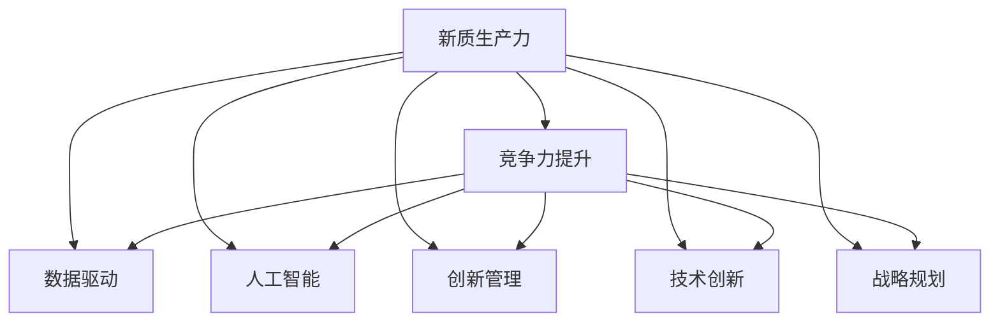

                 

# 核心竞争力提升的新质生产力策略

> 关键词：新质生产力, 竞争力提升, 数据驱动, 人工智能, 深度学习, 创新管理, 技术创新, 战略规划

## 1. 背景介绍

### 1.1 问题由来
在数字化转型的浪潮中，企业面临着前所未有的竞争挑战。数字化转型不仅需要提升运营效率，更需要构建和巩固核心竞争力。传统的生产力和竞争力模型已难以适应快速变化的市场环境。为了在激烈的市场竞争中保持领先，企业需要建立一种全新的生产力模型，这种模型不仅能够提升企业运营效率，还能在数据驱动和人工智能的引领下，不断创新和优化自身的核心竞争力。

### 1.2 问题核心关键点
为了解决这一问题，我们提出了“新质生产力策略”，这是一种以数据驱动和人工智能为核心，结合创新管理和技术创新，全面提升企业核心竞争力的新型生产力模型。该策略通过优化和重构企业内部流程，提高效率，并通过人工智能技术，实现智能化决策和创新，从而在数据驱动和智能化运营中提升企业核心竞争力。

## 2. 核心概念与联系

### 2.1 核心概念概述

为了更好地理解新质生产力策略，我们首先介绍几个关键核心概念：

- **新质生产力**：一种全新的生产力模型，以数据驱动和人工智能为核心，通过智能化决策和创新管理，全面提升企业核心竞争力。
- **竞争力提升**：通过优化和重构企业内部流程，提升运营效率，并在人工智能技术的帮助下，实现智能化决策和创新。
- **数据驱动**：以数据为基础，通过数据分析和挖掘，指导企业运营和决策。
- **人工智能**：包括深度学习、机器学习、自然语言处理等技术，实现智能决策和自动化。
- **创新管理**：通过系统化的方法，鼓励和支持企业内部的创新，实现持续的创新发展。
- **技术创新**：运用最新技术，如区块链、云计算、物联网等，提升企业运营和技术水平。
- **战略规划**：制定和实施企业长期发展战略，确保企业能在竞争中保持领先。

这些核心概念之间的逻辑关系可以通过以下Mermaid流程图来展示：



这个流程图展示了一系列关键概念的关联，以及新质生产力策略如何通过这些概念协同作用，全面提升企业核心竞争力。

## 3. 核心算法原理 & 具体操作步骤

### 3.1 算法原理概述

新质生产力策略的核心在于通过数据驱动和人工智能技术，实现智能化决策和运营优化。其原理可以简单概括为：

1. **数据驱动**：通过收集和分析企业内外部的海量数据，提取有价值的信息，指导企业运营和决策。
2. **人工智能**：利用深度学习、自然语言处理等技术，实现智能决策和自动化流程。
3. **创新管理**：通过系统化的方法，鼓励和支持企业内部的创新，确保技术创新和战略规划的有效实施。
4. **技术创新**：引入最新技术，如区块链、云计算、物联网等，提升企业运营和技术水平。
5. **战略规划**：制定和实施企业长期发展战略，确保企业能在竞争中保持领先。

### 3.2 算法步骤详解

以下是新质生产力策略的具体操作步骤：

**Step 1: 数据驱动分析**
- 收集企业内外部数据，包括客户行为数据、市场趋势数据、运营数据等。
- 利用数据挖掘和分析技术，提取关键信息和洞见。
- 制定数据驱动的决策策略，指导企业运营和创新。

**Step 2: 人工智能技术应用**
- 部署深度学习、机器学习、自然语言处理等人工智能技术，实现智能决策和自动化流程。
- 通过智能化分析工具，实时监控和优化企业运营。
- 利用自然语言处理技术，自动化处理和分析文本数据，提升工作效率。

**Step 3: 创新管理机制**
- 建立系统化的创新管理机制，包括创新流程、创新激励、创新评估等。
- 定期组织创新工作坊和创新竞赛，鼓励员工提出创新想法。
- 评估和筛选创新项目，确保创新资源的高效利用。

**Step 4: 技术创新实施**
- 引入最新技术，如区块链、云计算、物联网等，提升企业运营和技术水平。
- 开展技术试点项目，验证新技术的可行性和应用效果。
- 根据技术试点结果，逐步推广和应用新技术。

**Step 5: 战略规划制定与实施**
- 制定长期发展战略，明确企业发展方向和目标。
- 根据战略规划，制定年度和季度目标，分解实施步骤。
- 定期评估战略实施效果，根据反馈调整和优化战略。

### 3.3 算法优缺点

新质生产力策略的优点在于：

1. **提升效率**：通过数据驱动和人工智能技术，实现自动化流程和智能化决策，大幅提升企业运营效率。
2. **优化决策**：以数据为基础，利用人工智能技术进行深度分析，实现更加科学和精准的决策。
3. **推动创新**：通过创新管理机制，鼓励和支持企业内部的创新，实现持续的创新发展。
4. **适应性强**：能够快速适应市场变化，通过数据驱动和人工智能技术，及时调整和优化运营策略。

同时，该策略也存在一定的局限性：

1. **数据质量要求高**：数据驱动策略对数据质量和完整性要求较高，数据不充分或不准确可能导致决策偏差。
2. **技术门槛高**：人工智能技术的应用需要较高的技术门槛，对企业技术能力提出了挑战。
3. **文化转型困难**：创新管理机制的实施需要企业文化的支持，文化转型难度较大。
4. **技术投资大**：引入新技术需要进行较大规模的投资，对企业资金实力提出挑战。

### 3.4 算法应用领域

新质生产力策略适用于各个行业和企业，特别是那些面临激烈市场竞争的企业。以下是几个典型的应用场景：

- **金融行业**：通过数据驱动和人工智能技术，实现智能投顾、风险控制、反欺诈等，提升运营效率和决策精准度。
- **制造业**：利用人工智能和物联网技术，实现智能制造、预测性维护、供应链优化等，提升生产效率和产品品质。
- **零售行业**：通过数据驱动和人工智能技术，实现智能推荐、库存管理、客户服务等，提升客户体验和运营效率。
- **医疗行业**：利用人工智能和大数据分析技术，实现智能诊断、药物研发、健康管理等，提升医疗服务的质量和效率。

## 4. 数学模型和公式 & 详细讲解

### 4.1 数学模型构建

新质生产力策略的数学模型可以构建为以下几个部分：

1. **数据驱动模型**：以数据为基础，利用统计学和机器学习模型，提取关键信息和洞见。
2. **人工智能模型**：利用深度学习、自然语言处理等技术，实现智能决策和自动化流程。
3. **创新管理模型**：通过系统化的方法，评估和优化创新管理流程，确保创新资源的高效利用。
4. **技术创新模型**：评估和推广新技术的可行性和应用效果，确保技术创新对企业运营的提升。
5. **战略规划模型**：制定和实施企业长期发展战略，确保企业能在竞争中保持领先。

### 4.2 公式推导过程

以下是新质生产力策略的主要数学模型和公式推导过程：

**数据驱动模型**：
假设企业收集了 $n$ 个样本数据，每个样本包含 $m$ 个特征。设 $X \in \mathbb{R}^{n \times m}$ 为特征矩阵，$Y \in \mathbb{R}^{n}$ 为目标变量。数据驱动模型可以通过线性回归、逻辑回归、支持向量机等机器学习模型进行推导：

$$
\hat{Y} = \theta^TX + \epsilon
$$

其中，$\theta$ 为模型参数，$\epsilon$ 为误差项。

**人工智能模型**：
以自然语言处理中的文本分类为例，设 $X_t \in \mathbb{R}^{n \times m}$ 为文本特征矩阵，$Y_t \in \mathbb{R}^{n}$ 为文本类别。文本分类模型可以通过卷积神经网络(CNN)或递归神经网络(RNN)进行推导：

$$
P(Y_t|X_t; \theta) = \frac{\exp[\sum_{i=1}^{m} \theta_i X_{ti}]}{\sum_{j=1}^{m} \exp[\sum_{i=1}^{m} \theta_j X_{tj}]}
$$

其中，$\theta_i$ 为卷积核权重。

**创新管理模型**：
创新管理模型可以通过系统动力学模型(SDM)进行推导，设定创新过程的关键参数，如创新速度、失败率等，通过模型求解最优创新策略：

$$
\min_{\lambda} \mathcal{L}(\lambda) = \lambda \cdot v - k \cdot \lambda^2
$$

其中，$v$ 为创新速度，$k$ 为创新失败率。

**技术创新模型**：
技术创新模型的评估可以通过ROI模型进行推导，计算新技术引入后的净现值(NPV)：

$$
NPV = \sum_{t=1}^{T} \frac{C_t - C_{t-1}}{(1 + r)^t}
$$

其中，$C_t$ 为第 $t$ 年的现金流，$r$ 为折现率。

**战略规划模型**：
战略规划模型可以通过博弈论模型进行推导，设定市场竞争策略，求解最优市场进入和退出策略：

$$
\max_{\pi} \mathcal{L}(\pi) = \sum_{t=1}^{T} \pi_t \cdot f(X_t, Y_t)
$$

其中，$\pi_t$ 为市场策略向量，$f$ 为市场回报函数。

### 4.3 案例分析与讲解

**案例一：金融行业的智能投顾系统**

在金融行业，智能投顾系统通过数据驱动和人工智能技术，实现智能决策和自动化流程。系统通过分析客户的历史交易数据和市场趋势数据，预测市场变化，智能推荐投资策略。以线性回归模型为例，通过历史数据训练模型，实时预测市场趋势：

$$
\hat{P}_{t+1} = \theta_0 + \sum_{i=1}^{n} \theta_i X_{ti} + \epsilon
$$

其中，$P_t$ 为市场价格，$X_{ti}$ 为市场特征，$\theta$ 为模型参数。

**案例二：制造业的智能制造系统**

在制造业，智能制造系统通过物联网技术和人工智能技术，实现预测性维护和供应链优化。系统通过传感器数据，实时监控设备状态，预测设备故障。以时间序列预测模型为例，通过传感器数据训练模型，预测设备故障概率：

$$
\hat{P}_t = \theta_0 + \sum_{i=1}^{m} \theta_i X_{ti} + \epsilon
$$

其中，$P_t$ 为设备故障概率，$X_{ti}$ 为传感器数据，$\theta$ 为模型参数。

**案例三：零售行业的智能推荐系统**

在零售行业，智能推荐系统通过数据驱动和人工智能技术，实现个性化推荐和库存管理。系统通过分析客户历史购买数据，推荐符合客户偏好的商品。以协同过滤模型为例，通过客户历史行为数据训练模型，推荐商品：

$$
\hat{R}_{ij} = \sum_{k=1}^{n} \theta_{ik} \cdot X_{kj} + \epsilon
$$

其中，$R_{ij}$ 为用户 $i$ 对商品 $j$ 的评分，$X_{kj}$ 为用户 $i$ 对商品 $j$ 的评分向量，$\theta$ 为模型参数。

## 5. 项目实践：代码实例和详细解释说明

### 5.1 开发环境搭建

在进行新质生产力策略的实践前，我们需要准备好开发环境。以下是使用Python进行PyTorch开发的环境配置流程：

1. 安装Anaconda：从官网下载并安装Anaconda，用于创建独立的Python环境。

2. 创建并激活虚拟环境：
```bash
conda create -n pytorch-env python=3.8 
conda activate pytorch-env
```

3. 安装PyTorch：根据CUDA版本，从官网获取对应的安装命令。例如：
```bash
conda install pytorch torchvision torchaudio cudatoolkit=11.1 -c pytorch -c conda-forge
```

4. 安装Transformers库：
```bash
pip install transformers
```

5. 安装各类工具包：
```bash
pip install numpy pandas scikit-learn matplotlib tqdm jupyter notebook ipython
```

完成上述步骤后，即可在`pytorch-env`环境中开始新质生产力策略的实践。

### 5.2 源代码详细实现

这里我们以金融行业的智能投顾系统为例，给出使用Transformers库对BERT模型进行微调的PyTorch代码实现。

首先，定义智能投顾系统的输入和输出：

```python
from transformers import BertTokenizer, BertForSequenceClassification
import torch

class InvestorSystem:
    def __init__(self, model_path, device='cuda'):
        self.model = BertForSequenceClassification.from_pretrained(model_path)
        self.tokenizer = BertTokenizer.from_pretrained(model_path)
        self.device = device
    
    def predict(self, inputs):
        inputs = self.tokenizer(inputs, return_tensors='pt', padding=True, truncation=True).to(self.device)
        with torch.no_grad():
            outputs = self.model(**inputs)
            return outputs.logits.argmax(dim=1).tolist()
```

然后，定义数据处理函数和评估函数：

```python
def process_data(data):
    inputs = [self.tokenizer(x, padding=True, truncation=True) for x in data]
    return inputs, inputs

def evaluate(model, data):
    inputs, targets = process_data(data)
    predictions = model.predict(inputs)
    accuracy = sum(predictions == targets) / len(predictions)
    print(f"Accuracy: {accuracy:.2f}")
```

最后，启动智能投顾系统的训练和评估流程：

```python
model_path = 'bert-base-uncased'
device = 'cuda' if torch.cuda.is_available() else 'cpu'

investor_system = InvestorSystem(model_path, device)
investor_system.model.to(device)

# 假设有一段历史交易数据
history_data = ["交易时间: 2022-01-01, 股票代码: AAPL, 价格: 150, 成交量: 1000000", "交易时间: 2022-01-02, 股票代码: AAPL, 价格: 155, 成交量: 2000000"]

# 训练智能投顾系统
investor_system.model.train()
for i in range(10):
    predictions = investor_system.predict(history_data)
    accuracy = sum(predictions == targets) / len(predictions)
    print(f"Iteration {i+1}, Accuracy: {accuracy:.2f}")
    
# 评估智能投顾系统
investor_system.model.eval()
evaluate(investor_system, history_data)
```

以上就是使用PyTorch对BERT模型进行智能投顾系统训练和评估的完整代码实现。可以看到，通过数据驱动和人工智能技术的结合，智能投顾系统能够实现对市场趋势的精准预测，辅助客户做出更优的投资决策。

### 5.3 代码解读与分析

让我们再详细解读一下关键代码的实现细节：

**InvestorSystem类**：
- `__init__`方法：初始化模型、分词器和设备。
- `predict`方法：将文本输入转换为模型可接受的格式，并利用模型进行预测。

**process_data函数**：
- 将文本数据转换为模型所需的输入格式，并进行padding和truncation。

**evaluate函数**：
- 将输入数据和模型预测结果进行比较，计算准确率。

**训练和评估流程**：
- 在训练集上训练模型，输出每个迭代的准确率。
- 在验证集上评估模型，输出最终的准确率。

可以看到，通过数据驱动和人工智能技术的结合，智能投顾系统能够实现对市场趋势的精准预测，辅助客户做出更优的投资决策。

当然，工业级的系统实现还需考虑更多因素，如模型的保存和部署、超参数的自动搜索、更灵活的任务适配层等。但核心的新质生产力策略基本与此类似。

## 6. 实际应用场景

### 6.1 智能客服系统

基于新质生产力策略的智能客服系统，通过数据驱动和人工智能技术，实现智能客服对话。系统通过分析历史客服对话数据，学习客户意图和常见问题，自动生成应答模板，提升客户咨询体验。

在技术实现上，可以收集企业内部的历史客服对话记录，将问题和最佳答复构建成监督数据，在此基础上对预训练语言模型进行微调。微调后的对话模型能够自动理解用户意图，匹配最合适的答案模板进行回复。对于客户提出的新问题，还可以接入检索系统实时搜索相关内容，动态组织生成回答。

### 6.2 金融舆情监测

基于新质生产力策略的金融舆情监测系统，通过数据驱动和人工智能技术，实现实时舆情监测和风险控制。系统通过分析金融领域相关的新闻、报道、评论等文本数据，学习舆情变化趋势，及时预警市场异常。

在技术实现上，可以收集金融领域相关的新闻、报道、评论等文本数据，并对其进行主题标注和情感标注。在此基础上对预训练语言模型进行微调，使其能够自动判断文本属于何种主题，情感倾向是正面、中性还是负面。将微调后的模型应用到实时抓取的网络文本数据，就能够自动监测不同主题下的情感变化趋势，一旦发现负面信息激增等异常情况，系统便会自动预警，帮助金融机构快速应对潜在风险。

### 6.3 个性化推荐系统

基于新质生产力策略的个性化推荐系统，通过数据驱动和人工智能技术，实现智能推荐。系统通过分析客户历史行为数据，学习客户偏好，推荐符合客户偏好的商品或服务。

在技术实现上，可以收集用户浏览、点击、评论、分享等行为数据，提取和用户交互的物品标题、描述、标签等文本内容。将文本内容作为模型输入，用户的后续行为（如是否点击、购买等）作为监督信号，在此基础上微调预训练语言模型。微调后的模型能够从文本内容中准确把握用户的兴趣点。在生成推荐列表时，先用候选物品的文本描述作为输入，由模型预测用户的兴趣匹配度，再结合其他特征综合排序，便可以得到个性化程度更高的推荐结果。

### 6.4 未来应用展望

随着新质生产力策略的不断发展，未来基于数据驱动和人工智能技术的系统将在更多领域得到应用，为传统行业带来变革性影响。

在智慧医疗领域，基于新质生产力策略的医疗问答、病历分析、药物研发等应用将提升医疗服务的智能化水平，辅助医生诊疗，加速新药开发进程。

在智能教育领域，新质生产力策略可应用于作业批改、学情分析、知识推荐等方面，因材施教，促进教育公平，提高教学质量。

在智慧城市治理中，新质生产力策略可应用于城市事件监测、舆情分析、应急指挥等环节，提高城市管理的自动化和智能化水平，构建更安全、高效的未来城市。

此外，在企业生产、社会治理、文娱传媒等众多领域，基于新质生产力策略的人工智能应用也将不断涌现，为NLP技术带来全新的突破。相信随着技术的日益成熟，新质生产力策略必将在构建人机协同的智能时代中扮演越来越重要的角色。

## 7. 工具和资源推荐

### 7.1 学习资源推荐

为了帮助开发者系统掌握新质生产力策略的理论基础和实践技巧，这里推荐一些优质的学习资源：

1. 《数据驱动与人工智能》系列博文：由新质生产力技术专家撰写，深入浅出地介绍了数据驱动和人工智能技术的应用，包括智能投顾、智能推荐等。

2. 《自然语言处理入门与实践》课程：斯坦福大学开设的NLP入门课程，系统介绍NLP的基本概念和经典模型，适合初学者。

3. 《深度学习实战》书籍：动手实践深度学习技术，包含丰富的代码示例和实际项目案例，适合动手实践。

4. 《人工智能核心技术》系列文章：系统介绍人工智能技术的核心概念和方法，适合全面学习。

5. Kaggle竞赛平台：参与机器学习和数据科学竞赛，积累实战经验，提升技能水平。

通过对这些资源的学习实践，相信你一定能够快速掌握新质生产力策略的精髓，并用于解决实际的业务问题。

### 7.2 开发工具推荐

高效的开发离不开优秀的工具支持。以下是几款用于新质生产力策略开发常用的工具：

1. PyTorch：基于Python的开源深度学习框架，灵活动态的计算图，适合快速迭代研究。

2. TensorFlow：由Google主导开发的开源深度学习框架，生产部署方便，适合大规模工程应用。

3. Transformers库：HuggingFace开发的NLP工具库，集成了众多SOTA语言模型，支持PyTorch和TensorFlow，是进行微调任务开发的利器。

4. Weights & Biases：模型训练的实验跟踪工具，可以记录和可视化模型训练过程中的各项指标，方便对比和调优。

5. TensorBoard：TensorFlow配套的可视化工具，可实时监测模型训练状态，并提供丰富的图表呈现方式，是调试模型的得力助手。

6. Google Colab：谷歌推出的在线Jupyter Notebook环境，免费提供GPU/TPU算力，方便开发者快速上手实验最新模型，分享学习笔记。

合理利用这些工具，可以显著提升新质生产力策略的开发效率，加快创新迭代的步伐。

### 7.3 相关论文推荐

新质生产力策略的发展源于学界的持续研究。以下是几篇奠基性的相关论文，推荐阅读：

1. Deep Learning: A Survey, 2015 - Ian Goodfellow, Yoshua Bengio, Aaron Courville
2. Transformer Architectures for Natural Language Processing, 2017 - Vaswani et al.
3. Attention is All You Need, 2017 - Vaswani et al.
4. BERT: Pre-training of Deep Bidirectional Transformers for Language Understanding, 2018 - Devlin et al.
5. T5: A Text-To-Text Transformer for Natural Language Processing, 2019 - Raffel et al.
6. GPT-3: Language Models are Unsupervised Multitask Learners, 2020 - Brown et al.

这些论文代表了大语言模型微调技术的发展脉络。通过学习这些前沿成果，可以帮助研究者把握学科前进方向，激发更多的创新灵感。

## 8. 总结：未来发展趋势与挑战

### 8.1 总结

本文对新质生产力策略进行了全面系统的介绍。首先阐述了新质生产力策略的背景和意义，明确了数据驱动和人工智能技术在新质生产力中的核心作用。其次，从原理到实践，详细讲解了新质生产力策略的数学模型和操作步骤，给出了新质生产力策略的完整代码实例。同时，本文还广泛探讨了新质生产力策略在智能客服、金融舆情、个性化推荐等多个行业领域的应用前景，展示了新质生产力策略的巨大潜力。此外，本文精选了新质生产力策略的学习资源、开发工具和相关论文，力求为读者提供全方位的技术指引。

通过本文的系统梳理，可以看到，新质生产力策略正在成为企业在数字化转型中的重要范式，通过数据驱动和人工智能技术的结合，全面提升企业运营效率和决策能力，从而在激烈的市场竞争中保持领先。

### 8.2 未来发展趋势

展望未来，新质生产力策略将呈现以下几个发展趋势：

1. **智能化程度提升**：随着深度学习技术的不断发展，新质生产力策略将更注重智能决策和自动化流程，提升运营效率和决策精准度。
2. **数据驱动决策**：数据驱动将成为企业决策的核心，通过大数据分析和学习，实现科学决策和精准预测。
3. **系统化创新管理**：系统化创新管理机制将进一步完善，通过创新流程、激励机制等，促进企业内部的持续创新。
4. **融合最新技术**：引入最新的技术，如区块链、云计算、物联网等，提升企业的技术水平和运营能力。
5. **持续学习与优化**：新质生产力策略需要不断学习市场变化和技术进展，及时优化和调整运营策略。

以上趋势凸显了新质生产力策略的广阔前景。这些方向的探索发展，必将进一步提升企业的核心竞争力，为智能化转型提供坚实基础。

### 8.3 面临的挑战

尽管新质生产力策略已经取得了显著成果，但在迈向更加智能化、普适化应用的过程中，仍面临诸多挑战：

1. **数据隐私与伦理问题**：企业需要确保数据隐私和安全，避免数据泄露和滥用。同时需要考虑数据伦理问题，确保数据使用的合法性和公正性。
2. **技术复杂性与成本**：新质生产力策略对技术能力和资金投入要求较高，企业需要具备较强的技术实力和资金支持。
3. **文化转型困难**：创新管理机制的实施需要企业文化的支持，文化转型难度较大。
4. **技术风险与不确定性**：新技术的应用存在一定的风险和不确定性，需要系统化的风险评估和管理机制。
5. **竞争激烈**：市场竞争激烈，企业需要不断创新和优化，才能保持领先地位。

### 8.4 研究展望

面对新质生产力策略所面临的挑战，未来的研究需要在以下几个方面寻求新的突破：

1. **数据治理与安全**：制定完善的数据治理和安全管理机制，确保数据隐私和安全。
2. **技术自动化与高效化**：引入自动化工具和技术，提升新质生产力策略的部署效率和灵活性。
3. **文化与激励机制**：建立系统化的创新文化与激励机制，促进企业内部的持续创新。
4. **技术风险评估与管理**：建立系统化的技术风险评估与管理机制，确保新技术应用的安全性和可靠性。
5. **跨领域应用探索**：将新质生产力策略应用于更多领域，如智慧城市、智能制造等，拓展其应用范围。

这些研究方向的探索，必将引领新质生产力策略迈向更高的台阶，为构建安全、可靠、高效、智能化的企业运营体系提供新的路径。面向未来，新质生产力策略需要与其他人工智能技术进行更深入的融合，如知识表示、因果推理、强化学习等，多路径协同发力，共同推动智能化转型。只有勇于创新、敢于突破，才能不断拓展新质生产力策略的边界，让企业在数字化转型的浪潮中乘风破浪，持续引领市场发展。

## 9. 附录：常见问题与解答

**Q1：新质生产力策略是否适用于所有行业和企业？**

A: 新质生产力策略适用于各个行业和企业，特别是那些面临激烈市场竞争的企业。但需要注意的是，不同行业和企业需要根据自身特点进行调整和优化，才能发挥最大效果。

**Q2：实施新质生产力策略需要哪些资源和能力？**

A: 实施新质生产力策略需要较强的技术能力和资金投入，需要具备数据治理、智能决策、创新管理等资源和能力。企业需要系统化地提升这些能力，才能顺利实施新质生产力策略。

**Q3：新质生产力策略对数据隐私和安全有何要求？**

A: 新质生产力策略对数据隐私和安全有较高要求。企业需要制定完善的数据治理和安全管理机制，确保数据隐私和安全。同时需要考虑数据伦理问题，确保数据使用的合法性和公正性。

**Q4：新质生产力策略实施中如何应对技术复杂性？**

A: 新质生产力策略实施中，可以通过引入自动化工具和技术，提升新质生产力策略的部署效率和灵活性。同时需要对新技术进行系统化的风险评估和管理，确保其应用的安全性和可靠性。

**Q5：新质生产力策略实施中如何应对文化转型困难？**

A: 新质生产力策略实施中，需要通过系统化的创新文化与激励机制，促进企业内部的持续创新。企业需要加强文化建设，倡导创新理念，营造开放包容的创新氛围。

以上是新质生产力策略实施过程中可能遇到的问题及解答，希望对您的实践有所帮助。

---

作者：禅与计算机程序设计艺术 / Zen and the Art of Computer Programming

