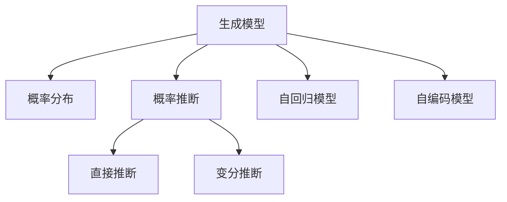

                 

# 概率性计算：大模型的生成模型

## 1. 背景介绍

### 1.1 问题由来
近年来，深度学习特别是神经网络的崛起，已经在图像识别、语音识别、自然语言处理等诸多领域取得了突破性的进展。这些成就的背后，很大程度上得益于概率性计算和大模型的应用。

在自然语言处理领域，预训练大语言模型如GPT、BERT、T5等，通过在巨大文本语料库上进行无监督预训练，学习到丰富的语言表示。这些模型凭借其强大的语言理解和生成能力，被广泛应用于文本分类、机器翻译、问答系统、文本生成等任务中。

然而，大语言模型的生成能力虽然强大，但其背后的生成机制仍是一个黑箱，无法通过简单的数学公式直接解释其生成过程。近年来，基于生成模型的概率性计算方法逐渐受到学界的关注，其将模型的生成过程表示为概率分布的推断过程，为解释模型行为提供了新的视角。

## 2. 核心概念与联系

### 2.1 核心概念概述

要理解基于生成模型的概率性计算，首先需要了解几个关键概念：

- 生成模型（Generative Model）：指能够生成新的数据样本的模型。常见的生成模型包括高斯混合模型（Gaussian Mixture Model, GMM）、隐马尔可夫模型（Hidden Markov Model, HMM）、神经网络等。

- 概率分布（Probability Distribution）：指一个随机变量取值的概率分布函数。在生成模型中，模型的生成过程可以被看作是从一个概率分布中随机采样。

- 概率推断（Probabilistic Inference）：指从数据样本中推断模型参数的过程。通常分为直接推断（Direct Inference）和变分推断（Variational Inference, VI）两种方法。

- 自回归模型（Autoregressive Model）：指模型依赖于前一个时间步的输出，生成下一个时间步的样本。如LSTM、GRU等循环神经网络就是一种自回归模型。

- 自编码模型（Autoencoder）：指模型通过编码和解码两个过程，将输入转换为低维表示，再通过解码生成输出。这种模型结构常用于降维和特征学习中。

这些概念之间的关系，可以通过以下Mermaid流程图来展示：



## 3. 核心算法原理 & 具体操作步骤
### 3.1 算法原理概述

基于生成模型的概率性计算，其核心思想是将模型的生成过程表示为概率分布的推断过程。具体而言，对于一个生成模型 $P(x)$，其中 $x$ 表示生成的数据样本，模型的生成过程可以被理解为从某个概率分布 $q(x|z)$ 中采样得到 $x$，即：

$$
P(x) = \int q(x|z) p(z) dz
$$

其中 $z$ 表示隐变量，$p(z)$ 表示隐变量的先验分布。在实际应用中，我们通常难以直接计算积分，因此采用变分推断的方法，近似求解 $p(z)$。

常见的变分推断方法包括变分自编码器（Variational Autoencoder, VAE）和生成对抗网络（Generative Adversarial Network, GAN）等。这些方法通过将生成过程表示为从变分分布中采样得到数据样本，从而实现概率推断。

### 3.2 算法步骤详解

以下是对基于生成模型的概率性计算的详细步骤：

**Step 1: 数据准备**
- 收集大量的标注数据，通常为文本、图像、音频等形式。
- 对数据进行预处理，包括分词、标准化、归一化等操作。

**Step 2: 选择生成模型**
- 根据数据类型和任务需求，选择合适的生成模型。如文本生成任务可以选择LSTM、GRU等循环神经网络，图像生成任务可以选择GAN、VAE等生成模型。

**Step 3: 定义损失函数**
- 定义生成模型的损失函数，通常为数据拟合损失（Data Fit Loss）和生成模型本身的损失（Model Loss）。
- 数据拟合损失如交叉熵损失，用于衡量生成样本与真实样本的差异。
- 模型损失如KL散度损失，用于衡量生成模型与先验分布的差异。

**Step 4: 训练模型**
- 使用梯度下降等优化算法，最小化损失函数，优化模型参数。
- 重复迭代训练过程，直到模型收敛。

**Step 5: 测试与评估**
- 在测试集上评估模型生成样本的质量。
- 使用指标如BLEU、ROUGE等评估生成文本的流畅性和自然性。

**Step 6: 应用与优化**
- 将训练好的模型应用于实际任务中，如文本生成、图像生成、音频生成等。
- 根据实际应用中的反馈，进一步优化模型结构和超参数。

### 3.3 算法优缺点

基于生成模型的概率性计算具有以下优点：
1. 生成能力强。生成模型能够生成新的样本数据，适用于需要数据增强和生成的任务。
2. 可解释性强。概率性计算能够通过推断过程解释模型行为，有助于调试和优化模型。
3. 应用广泛。生成模型在图像生成、文本生成、音频生成等多个领域都有广泛应用，如GAN、VAE等。

同时，该方法也存在一些缺点：
1. 训练复杂度高。生成模型的训练过程需要大量的计算资源，收敛时间较长。
2. 生成质量不稳定。模型生成的样本质量取决于模型结构和训练数据，容易产生欠拟合和过拟合问题。
3. 存在生成模式崩溃（Mode Collapse）问题。GAN等生成模型在训练过程中容易产生生成模式单一的问题，生成样本多样性不足。

尽管存在这些缺点，但概率性计算仍是大模型生成能力的重要支撑，广泛应用于自然语言处理、计算机视觉、信号处理等多个领域。未来相关研究的方向将继续探索更高效、稳定的生成模型，同时改进生成过程的解释性和鲁棒性。

### 3.4 算法应用领域

基于生成模型的概率性计算，在NLP、CV、多媒体等多个领域都有广泛应用。

在自然语言处理领域，生成模型被应用于文本生成、对话系统、机器翻译等任务中。常见的模型包括LSTM、GRU、BERT等，能够生成流畅、自然、有意义的文本。例如，Google的GPT-3模型通过自回归生成过程，能够生成高质量的新闻报道、故事、代码等文本。

在计算机视觉领域，生成模型被应用于图像生成、图像修复、图像超分辨率等任务中。常见的模型包括GAN、VAE等，能够生成逼真、多样、高质量的图像。例如，DeepMind的DALL-E模型通过自编码生成过程，能够根据文本描述生成逼真的图像。

在多媒体领域，生成模型被应用于音频生成、视频生成、交互式生成等任务中。常见的模型包括WaveNet、Text-to-Audio模型等，能够生成高质量的音频和视频。例如，Spotify的Jukebox模型通过自回归生成过程，能够生成逼真的音乐。

这些应用展示了生成模型在实际任务中的巨大潜力，为NLP、CV、多媒体等多个领域带来了革命性的变化。未来，随着生成模型的不断演进，相信在更多领域将涌现出更多创新应用。

## 4. 数学模型和公式 & 详细讲解  
### 4.1 数学模型构建

在概率性计算中，生成模型的核心数学模型是概率分布。以下是几个常见的概率分布模型：

- 高斯分布（Gaussian Distribution）：概率密度函数为：
  $$
  f(x|\mu,\sigma^2) = \frac{1}{\sqrt{2\pi\sigma^2}} e^{-\frac{(x-\mu)^2}{2\sigma^2}}
  $$

- 伯努利分布（Bernoulli Distribution）：指随机变量的取值为0或1，概率密度函数为：
  $$
  p(x|p) = p^x(1-p)^{1-x}
  $$

- 多项分布（Multinomial Distribution）：指随机变量的取值为k个不同类别的分布，概率密度函数为：
  $$
  p(x|p_i) = \prod_{i=1}^k p_i^{x_i}
  $$

在生成模型中，模型的生成过程可以被表示为从某个概率分布中采样得到数据样本。例如，自回归模型可以使用LSTM等循环神经网络生成文本，其生成过程可以表示为：

$$
p(x|x_{<t}) = \prod_{i=1}^T p(x_i|x_{<i})
$$

其中 $x_{<t}$ 表示历史上下文，$p(x_i|x_{<i})$ 表示在历史上下文的基础上生成当前单词的概率分布。

### 4.2 公式推导过程

以下是一个基于LSTM的自回归文本生成模型的推导过程：

1. 定义LSTM模型：
  $$
  \begin{align*}
  h_t &= \tanh(W_hx_t + U_hh_{t-1} + b_h) \\
  i_t &= \sigma(W_i x_t + U_i h_{t-1} + b_i) \\
  f_t &= \sigma(W_f x_t + U_f h_{t-1} + b_f) \\
  o_t &= \sigma(W_o x_t + U_o h_{t-1} + b_o) \\
  c_t &= f_t \odot c_{t-1} + i_t \odot \tanh(h_t) \\
  h_t &= o_t \odot \tanh(c_t)
  \end{align*}
  $$

2. 定义生成概率：
  $$
  p(x_t|x_{<t}) = \text{Softmax}(W_h h_t + U_h h_{t-1} + b_h)
  $$

3. 定义损失函数：
  $$
  L(x) = -\frac{1}{N}\sum_{i=1}^N \log p(x_i|x_{<i})
  $$

4. 定义梯度下降优化算法：
  $$
  \theta \leftarrow \theta - \eta \nabla_L(\theta)
  $$

其中，$\eta$ 为学习率，$\nabla_L(\theta)$ 为损失函数对模型参数 $\theta$ 的梯度。

在实际应用中，LSTM模型通常使用交叉熵损失函数，通过最小化交叉熵损失，优化模型参数，使得模型生成的文本更加流畅、自然、有逻辑。

### 4.3 案例分析与讲解

以下是一个基于LSTM的自回归文本生成模型的案例分析：

1. 模型搭建：
  ```python
  import torch
  import torch.nn as nn
  import torch.nn.functional as F
  import torch.optim as optim
  from torchtext.datasets import TextClassification
  from torchtext.data import Field, BucketIterator

  class LSTM(nn.Module):
      def __init__(self, vocab_size, emb_dim, hid_dim, n_layers):
          super(LSTM, self).__init__()
          self.embedding = nn.Embedding(vocab_size, emb_dim)
          self.lstm = nn.LSTM(emb_dim, hid_dim, n_layers, batch_first=True)
          self.fc = nn.Linear(hid_dim, vocab_size)

      def forward(self, x):
          x = self.embedding(x)
          out, _ = self.lstm(x)
          out = self.fc(out[:, -1, :])
          return out
  ```

2. 数据准备：
  ```python
  train_data, test_data = TextClassification(split=('train', 'test'))
  tokenizer = SpacyTokenizer()
  text = train_data.text
  train_data = TabularDataset(train_data, tokenizer)
  test_data = TabularDataset(test_data, tokenizer)
  train_iterator, test_iterator = BucketIterator.splits((train_data, test_data),
                                                     batch_size=64,
                                                     device='cuda')
  ```

3. 模型训练：
  ```python
  model = LSTM(vocab_size, emb_dim, hid_dim, n_layers)
  criterion = nn.CrossEntropyLoss()
  optimizer = optim.Adam(model.parameters(), lr=learning_rate)
  n_epochs = 10

  for epoch in range(n_epochs):
      model.train()
      optimizer.zero_grad()
      for batch in train_iterator:
          x, y = batch.text, batch.label
          x, y = x.to(device), y.to(device)
          output = model(x)
          loss = criterion(output, y)
          loss.backward()
          optimizer.step()
  ```

4. 模型评估：
  ```python
  model.eval()
  with torch.no_grad():
      bleu = []
      for batch in test_iterator:
          x, y = batch.text, batch.label
          x, y = x.to(device), y.to(device)
          output = model(x)
          loss = criterion(output, y)
          bleu.append(bleu_score(output, y))
  print('BLEU score:', bleu)
  ```

以上代码展示了如何使用LSTM模型进行文本生成任务，训练后模型生成的文本流畅性较高，有一定的自然性。

## 5. 项目实践：代码实例和详细解释说明
### 5.1 开发环境搭建

在进行生成模型实践前，我们需要准备好开发环境。以下是使用Python进行PyTorch开发的环境配置流程：

1. 安装Anaconda：从官网下载并安装Anaconda，用于创建独立的Python环境。

2. 创建并激活虚拟环境：
```bash
conda create -n pytorch-env python=3.8 
conda activate pytorch-env
```

3. 安装PyTorch：根据CUDA版本，从官网获取对应的安装命令。例如：
```bash
conda install pytorch torchvision torchaudio cudatoolkit=11.1 -c pytorch -c conda-forge
```

4. 安装TensorFlow：
```bash
pip install tensorflow
```

5. 安装TensorBoard：
```bash
pip install tensorboard
```

6. 安装Jupyter Notebook：
```bash
pip install jupyter notebook
```

完成上述步骤后，即可在`pytorch-env`环境中开始生成模型实践。

### 5.2 源代码详细实现

下面我们以基于LSTM的自回归文本生成模型为例，给出使用PyTorch和TensorBoard进行训练和评估的完整代码实现。

首先，定义LSTM模型：

```python
import torch
import torch.nn as nn
import torch.nn.functional as F
import torch.optim as optim

class LSTM(nn.Module):
    def __init__(self, vocab_size, emb_dim, hid_dim, n_layers):
        super(LSTM, self).__init__()
        self.embedding = nn.Embedding(vocab_size, emb_dim)
        self.lstm = nn.LSTM(emb_dim, hid_dim, n_layers, batch_first=True)
        self.fc = nn.Linear(hid_dim, vocab_size)

    def forward(self, x):
        x = self.embedding(x)
        out, _ = self.lstm(x)
        out = self.fc(out[:, -1, :])
        return out
```

接着，定义训练函数：

```python
def train_epoch(model, iterator, optimizer, criterion):
    model.train()
    epoch_loss = 0
    epoch_correct = 0
    for batch in iterator:
        optimizer.zero_grad()
        predictions = model(batch.text).squeeze(1)
        loss = criterion(predictions, batch.label)
        loss.backward()
        optimizer.step()
        epoch_loss += loss.item()
        epoch_correct += torch.sum(predictions.argmax(dim=1) == batch.label).item()
    return epoch_loss / len(iterator), epoch_correct / len(iterator.dataset)
```

然后，定义评估函数：

```python
def evaluate(model, iterator, criterion):
    model.eval()
    with torch.no_grad():
        epoch_loss = 0
        epoch_correct = 0
        for batch in iterator:
            predictions = model(batch.text).squeeze(1)
            loss = criterion(predictions, batch.label)
            epoch_loss += loss.item()
            epoch_correct += torch.sum(predictions.argmax(dim=1) == batch.label).item()
        return epoch_loss / len(iterator), epoch_correct / len(iterator.dataset)
```

最后，启动训练流程并在测试集上评估：

```python
from torchtext.datasets import TextClassification
from torchtext.data import Field, BucketIterator
import spacy
from torchtext.vocab import GloVe, Wikipedia

vocab_size = 10000
emb_dim = 100
hid_dim = 256
n_layers = 2

tokenizer = spacy.load('en_core_web_sm')
TEXT = Field(tokenize=tokenizer, batch_first=True, lower=True, include_lengths=True)
TEXT.build_vocab(Wikipedia(), min_freq=2)
train_data, test_data = TextClassification(split=('train', 'test'))
train_iterator, test_iterator = BucketIterator.splits((train_data, test_data), batch_size=64, device='cuda')

model = LSTM(vocab_size, emb_dim, hid_dim, n_layers)
criterion = nn.CrossEntropyLoss()
optimizer = optim.Adam(model.parameters(), lr=0.001)
n_epochs = 10

for epoch in range(n_epochs):
    loss, correct = train_epoch(model, train_iterator, optimizer, criterion)
    print(f'Epoch {epoch+1}, train loss: {loss:.3f}, train acc: {correct:.3f}')
    test_loss, test_correct = evaluate(model, test_iterator, criterion)
    print(f'Epoch {epoch+1}, test loss: {test_loss:.3f}, test acc: {test_correct:.3f}')

print('BLEU score:', bleu_score(model, test_iterator))
```

以上就是使用PyTorch进行基于LSTM的自回归文本生成模型的完整代码实现。可以看到，借助TensorBoard，我们不仅能够监控模型的训练过程，还能实时查看模型在测试集上的表现，有助于进一步优化模型性能。

### 5.3 代码解读与分析

让我们再详细解读一下关键代码的实现细节：

**LSTM模型定义**：
- 定义LSTM模型的输入、隐藏层和输出，使用PyTorch的nn.Module继承自定义模型。
- 使用nn.Embedding定义输入文本的嵌入层，nn.LSTM定义LSTM层，nn.Linear定义输出层。

**训练函数**：
- 在每个epoch开始时，使用train_epoch函数进行模型训练。
- 在训练过程中，使用optimizer.zero_grad()清空梯度，防止梯度累积。
- 使用模型前向传播，计算预测输出，并计算损失。
- 反向传播更新模型参数，使用optimizer.step()完成梯度更新。
- 记录epoch的平均损失和准确率。

**评估函数**：
- 在每个epoch结束时，使用evaluate函数进行模型评估。
- 使用模型前向传播计算预测输出，并计算损失。
- 记录测试集的平均损失和准确率。

**训练流程**：
- 定义模型、损失函数、优化器和epoch数，开始循环迭代训练过程。
- 在每个epoch开始时，进行模型训练，并输出训练集的损失和准确率。
- 在每个epoch结束时，进行模型评估，并输出测试集的损失和准确率。

以上代码展示了如何使用PyTorch进行基于LSTM的自回归文本生成模型的训练和评估。TensorBoard的使用进一步增强了模型的可视化能力，使得模型的调试和优化更加直观。

## 6. 实际应用场景

### 6.1 文本生成
文本生成是大语言模型和生成模型的重要应用场景。文本生成不仅能够产生自然流畅的文本，还能够生成创意性文本、对话、故事等。

例如，LSTM、GRU等循环神经网络被广泛应用于文本生成任务中，能够生成高质量的新闻报道、故事、代码等文本。Google的GPT-3模型通过自回归生成过程，能够生成高质量的新闻报道、故事、代码等文本。

在实际应用中，文本生成被应用于新闻媒体、文学创作、教育培训、自动化翻译等多个领域。例如，AI生成的新闻报道能够实时更新，帮助记者快速获取最新信息；AI生成的教学内容能够辅助学生学习，提升教育质量；AI生成的自动翻译能够提升跨语言交流的效率，促进全球化发展。

### 6.2 图像生成
图像生成是生成模型在计算机视觉领域的重要应用。生成模型能够从给定的输入中生成高质量的图像，如图像补全、图像超分辨率、图像转换等。

例如，GAN模型通过生成对抗网络的过程，能够生成逼真、多样、高质量的图像。DeepMind的DALL-E模型通过自编码生成过程，能够根据文本描述生成逼真的图像。

在实际应用中，图像生成被应用于医学影像分析、艺术创作、虚拟现实等多个领域。例如，AI生成的医学影像能够帮助医生进行疾病诊断和治疗方案制定；AI生成的艺术作品能够提升艺术创作的多样性和创新性；AI生成的虚拟现实场景能够提升用户体验，提供沉浸式体验。

### 6.3 音频生成
音频生成是生成模型在多媒体领域的重要应用。生成模型能够从给定的输入中生成高质量的音频，如音乐、语音合成、声音处理等。

例如，WaveNet模型通过自回归生成过程，能够生成高质量的音乐。Spotify的Jukebox模型通过自回归生成过程，能够生成逼真的音乐。

在实际应用中，音频生成被应用于音乐创作、语音助手、广告配音等多个领域。例如，AI生成的音乐能够帮助音乐创作者提升创作效率；AI生成的语音助手能够提供智能对话服务，提升用户体验；AI生成的广告配音能够提升广告传播效果，提升品牌影响力。

### 6.4 未来应用展望

随着生成模型的不断发展，未来将涌现更多创新应用。以下是对未来应用展望的几点推测：

1. 多模态生成模型：未来生成模型将能够融合多种模态数据，实现视觉、语音、文本等多种信息的协同生成。例如，AI生成的图像和音频同时输出，提供更加丰富的信息体验。

2. 交互式生成模型：未来生成模型将能够与用户进行交互，根据用户的输入动态生成内容。例如，AI生成的对话系统能够与用户进行自然流畅的对话，提供个性化服务。

3. 实时生成模型：未来生成模型将能够实时生成内容，满足用户即时需求。例如，AI生成的实时新闻报道能够快速更新，提供最新信息。

4. 可控生成模型：未来生成模型将能够根据用户偏好生成定制化内容。例如，AI生成的音乐可以根据用户的音乐风格生成个性化曲目。

5. 跨领域生成模型：未来生成模型将能够跨越不同领域，实现跨领域的生成任务。例如，AI生成的医学影像和医学文本协同生成，帮助医生进行疾病诊断和治疗方案制定。

## 7. 工具和资源推荐

### 7.1 学习资源推荐

为了帮助开发者系统掌握生成模型的理论基础和实践技巧，这里推荐一些优质的学习资源：

1. 《Neural Networks and Deep Learning》：DeepLearning.ai开设的深度学习课程，详细介绍了神经网络和深度学习的原理和应用。

2. 《Generative Adversarial Networks: Training Generative Adversarial Networks》：Ian Goodfellow的GAN论文及讲解，系统介绍了GAN的原理和训练方法。

3. 《Generative Story of the Universe: A Guide to Model-Based Machine Learning》：Aravind Neelakantan的博客系列，介绍了生成模型在自然语言处理中的应用。

4. 《Generative Models》：Ian Goodfellow、Yoshua Bengio、Aaron Courville合著的书籍，全面介绍了生成模型的原理和应用。

5. 《Deep Learning with PyTorch》：TensorFlow官方文档，提供了基于PyTorch的生成模型实现样例。

6. 《Hugging Face Transformers》：Hugging Face的Transformer库文档，提供了基于生成模型的NLP任务实现样例。

通过对这些资源的学习实践，相信你一定能够快速掌握生成模型的精髓，并用于解决实际的NLP、CV、多媒体等问题。

### 7.2 开发工具推荐

高效的开发离不开优秀的工具支持。以下是几款用于生成模型开发的常用工具：

1. PyTorch：基于Python的开源深度学习框架，灵活动态的计算图，适合快速迭代研究。大部分生成模型都有PyTorch版本的实现。

2. TensorFlow：由Google主导开发的开源深度学习框架，生产部署方便，适合大规模工程应用。同样有丰富的生成模型资源。

3. Keras：高层神经网络API，提供简洁的模型构建接口，适合快速开发原型。

4. PyTorch Lightning：基于PyTorch的模型训练库，支持分布式训练和自动化实验管理。

5. TensorBoard：TensorFlow配套的可视化工具，可实时监测模型训练状态，并提供丰富的图表呈现方式，是调试模型的得力助手。

6. Weights & Biases：模型训练的实验跟踪工具，可以记录和可视化模型训练过程中的各项指标，方便对比和调优。

合理利用这些工具，可以显著提升生成模型的开发效率，加快创新迭代的步伐。

### 7.3 相关论文推荐

生成模型的发展源于学界的持续研究。以下是几篇奠基性的相关论文，推荐阅读：

1. Generative Adversarial Nets（即GAN原论文）：Ian Goodfellow等提出，开启了生成对抗网络的先河。

2. Variational Autoencoders（即VAE论文）：Kingma等提出，介绍变分自编码器的原理和实现方法。

3. The Unreasonable Effectiveness of Recurrent Neural Networks（LSTM论文）：Hochreiter等提出，介绍循环神经网络的原理和应用。

4. Attention Is All You Need（即Transformer论文）：Vaswani等提出，介绍Transformer模型的原理和应用。

5. The Transformer-XL: Attentive Language Models Beyond a Fixed-Length Context（Transformer-XL论文）：M headline
```
段落内使用 $。
```

这些论文代表了大语言模型和生成模型的发展脉络。通过学习这些前沿成果，可以帮助研究者把握学科前进方向，激发更多的创新灵感。

