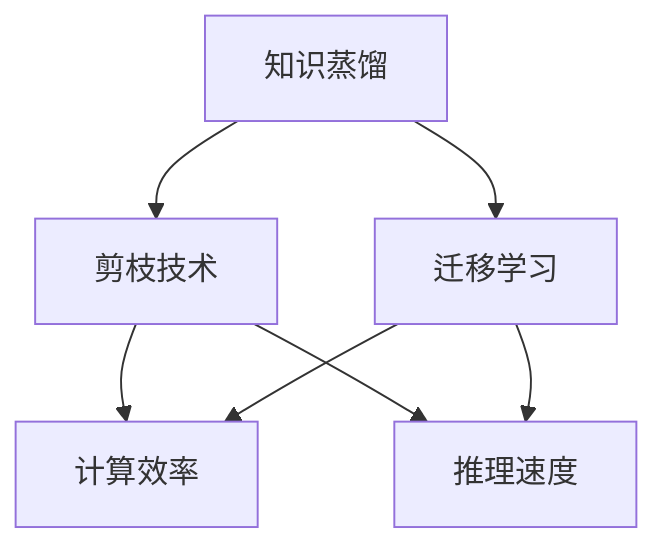

                 

# 模型压缩技术：知识蒸馏与剪枝方法探讨

> 关键词：模型压缩,知识蒸馏,剪枝技术,迁移学习,深度学习,计算效率,推理速度

## 1. 背景介绍

### 1.1 问题由来
随着深度学习技术的飞速发展，大型神经网络模型（Large Neural Networks, LNNs）在图像识别、自然语言处理（Natural Language Processing, NLP）、语音识别等众多领域取得了卓越的性能。然而，这些模型通常具有极高的计算复杂度和存储需求，限制了其在大规模工业部署中的应用。因此，如何有效地压缩大型模型，以在保证模型性能的前提下降低其资源消耗，成为了当前深度学习研究的一个重要方向。

### 1.2 问题核心关键点
在模型压缩领域，常见的策略包括：参数剪枝（Pruning）、权重共享（Weight Sharing）、知识蒸馏（Knowledge Distillation）等。这些方法通过不同手段减少模型的参数量、减小模型的计算复杂度、提高模型的推理速度，从而提高计算效率，降低能耗，为模型在大规模场景下的应用提供可能。

本文将重点介绍两种常用的模型压缩方法：知识蒸馏和剪枝技术，探讨其原理、操作步骤以及优缺点。同时，还将讨论这两种方法在实际应用中的具体场景和未来发展趋势。

## 2. 核心概念与联系

### 2.1 核心概念概述

为更好地理解模型压缩技术的核心概念，本节将介绍几个关键的概念和它们之间的联系：

- **知识蒸馏（Knowledge Distillation）**：通过将大型模型的知识转移到小型模型，提高小型模型的性能。具体做法是，首先使用大型模型在测试集上进行预测，然后将预测结果作为标签，训练一个小型模型。

- **剪枝技术（Pruning）**：通过删除模型中的冗余参数或连接，减少模型的复杂度，从而减小模型的大小和计算开销。剪枝可以发生在模型训练过程中（在线剪枝）或模型训练结束后（离线剪枝）。

- **迁移学习（Transfer Learning）**：利用已经在大规模数据集上训练好的模型，在小规模数据集上进行微调，从而快速提升模型的性能。迁移学习在模型压缩中也被广泛应用，可以在压缩过程中保留模型的通用知识，提高模型在新任务上的泛化能力。

- **计算效率（Computational Efficiency）**：指模型在执行推理时的计算资源消耗，包括CPU/GPU时间、内存占用等。

- **推理速度（Inference Speed）**：指模型执行推理所需的时间，通常与模型的复杂度成正比。

这些核心概念之间的逻辑关系可以通过以下Mermaid流程图来展示：



这个流程图展示了知识蒸馏、剪枝技术、迁移学习与计算效率和推理速度之间的关系：

1. 知识蒸馏和剪枝技术通过减小模型复杂度，提高模型的计算效率和推理速度。
2. 迁移学习帮助模型保留通用知识，提高新任务的泛化能力。
3. 计算效率和推理速度是衡量模型性能的重要指标。

## 3. 核心算法原理 & 具体操作步骤

### 3.1 算法原理概述

模型压缩的核心目标是减小模型的规模和计算复杂度，同时保持或提升模型的性能。这通常通过剪枝和知识蒸馏两种主要方式来实现。

**剪枝技术**：通过删除模型中的冗余参数或连接，减少模型的复杂度。剪枝的策略包括基于稀疏性（Sparsity）的剪枝、基于权重的剪枝等。剪枝后的模型通常需要进一步微调以恢复其性能。

**知识蒸馏**：通过将大型模型的知识（即标签）转移到小型模型，提高小型模型的性能。知识蒸馏的目标是最小化两个模型在相同输入下的预测差异，从而提高小型模型的泛化能力。

### 3.2 算法步骤详解

**知识蒸馏的步骤**：

1. 选择一个大型的预训练模型作为教师模型（Teacher Model），并在测试集上进行预测，生成标签。
2. 构建一个小型的目标模型（Student Model），如MobileNet、Shufflenet等。
3. 使用教师模型的预测结果作为标签，对学生模型进行训练。
4. 通过不同策略（如软标签、硬标签、特征匹配等），将教师模型的知识传递给学生模型。
5. 在验证集上评估学生模型的性能，迭代调整训练策略，直至性能稳定。

**剪枝的步骤**：

1. 选择合适的剪枝策略，如网络剪枝、权重剪枝等。
2. 在训练或验证过程中，逐步删除模型中的冗余参数或连接。
3. 记录剪枝过程中的性能变化，选择合适的剪枝阈值。
4. 对剪枝后的模型进行微调，恢复性能。
5. 使用剪枝后的模型进行推理，测试其计算效率和推理速度。

### 3.3 算法优缺点

**知识蒸馏的优缺点**：

优点：
- 提高小模型性能：通过大模型指导训练，小模型可以较快地接近大模型的性能。
- 保留通用知识：小模型可以继承大模型的通用知识，提高泛化能力。

缺点：
- 计算成本高：需要构建和训练两个模型，且教师模型的计算开销较大。
- 内存占用高：在训练过程中需要同时加载两个模型，内存占用较大。

**剪枝的优缺点**：

优点：
- 计算效率高：剪枝后的模型计算复杂度较低，推理速度较快。
- 资源占用少：剪枝后的模型参数较少，占用资源较少。

缺点：
- 性能损失：剪枝后的模型需要进一步微调以恢复性能。
- 结构复杂性：剪枝后的模型可能存在不必要的冗余连接，结构复杂度增加。

### 3.4 算法应用领域

知识蒸馏和剪枝技术在多个领域都有广泛的应用，例如：

- 图像识别：通过剪枝和知识蒸馏，可以使卷积神经网络（Convolutional Neural Networks, CNNs）在保持高性能的同时，大幅降低模型参数量。
- 自然语言处理：在Transformer等模型上进行剪枝和知识蒸馏，可以提高模型推理速度，降低资源消耗。
- 语音识别：通过剪枝和知识蒸馏，可以提升模型在实时语音识别中的效率。
- 推荐系统：在大型推荐系统中，通过剪枝和知识蒸馏，可以提高模型的实时响应速度，降低计算成本。

## 4. 数学模型和公式 & 详细讲解 & 举例说明

### 4.1 数学模型构建

知识蒸馏和剪枝技术通常使用监督学习方法进行训练和评估。假设教师模型和学生模型的输出分别为 $y_t$ 和 $y_s$，学生模型的训练目标是最小化两个模型在相同输入 $x$ 下的预测差异。

知识蒸馏的损失函数为：

$$
L = \alpha L_{hard} + (1-\alpha)L_{soft}
$$

其中，$L_{hard}$ 为硬标签损失函数，$L_{soft}$ 为软标签损失函数，$\alpha$ 为调整因子。

剪枝的损失函数为：

$$
L = \sum_{i=1}^n |w_i|
$$

其中，$w_i$ 为模型参数，$n$ 为参数总数。

### 4.2 公式推导过程

知识蒸馏的硬标签损失函数 $L_{hard}$ 定义为：

$$
L_{hard} = \frac{1}{N}\sum_{i=1}^N \mathbb{I}(y_{t,i} \neq y_{s,i})
$$

其中，$\mathbb{I}$ 为示性函数，$y_{t,i}$ 和 $y_{s,i}$ 分别为教师模型和学生模型在输入 $x_i$ 上的预测结果。

知识蒸馏的软标签损失函数 $L_{soft}$ 定义为：

$$
L_{soft} = \frac{1}{N}\sum_{i=1}^N KL(\hat{y}_{t,i}||y_{s,i})
$$

其中，$KL$ 为KL散度，$\hat{y}_{t,i}$ 为教师模型在输入 $x_i$ 上的预测概率分布。

剪枝的优化目标是最小化模型参数的绝对值之和：

$$
\min_{w} L = \sum_{i=1}^n |w_i|
$$

### 4.3 案例分析与讲解

**知识蒸馏案例**：

假设使用ResNet作为教师模型，MobileNet作为学生模型，在ImageNet数据集上进行知识蒸馏。具体步骤如下：

1. 使用ResNet在ImageNet测试集上进行预测，生成标签 $y_t$。
2. 构建MobileNet作为学生模型，在ImageNet数据集上进行训练。
3. 使用ResNet的预测结果作为标签，训练MobileNet。
4. 在验证集上评估MobileNet的性能，迭代调整训练策略。
5. 最终得到的MobileNet在ImageNet数据集上的性能接近ResNet。

**剪枝案例**：

假设使用ResNet作为目标模型，使用稀疏性剪枝策略进行剪枝。具体步骤如下：

1. 在ResNet训练过程中，逐步删除冗余的卷积核。
2. 记录剪枝过程中的性能变化，选择合适的剪枝阈值。
3. 对剪枝后的模型进行微调，恢复性能。
4. 使用剪枝后的模型进行推理，测试其计算效率和推理速度。

## 5. 项目实践：代码实例和详细解释说明

### 5.1 开发环境搭建

在进行模型压缩实践前，我们需要准备好开发环境。以下是使用Python进行PyTorch开发的环境配置流程：

1. 安装Anaconda：从官网下载并安装Anaconda，用于创建独立的Python环境。

2. 创建并激活虚拟环境：
```bash
conda create -n pytorch-env python=3.8 
conda activate pytorch-env
```

3. 安装PyTorch：根据CUDA版本，从官网获取对应的安装命令。例如：
```bash
conda install pytorch torchvision torchaudio cudatoolkit=11.1 -c pytorch -c conda-forge
```

4. 安装TensorBoard：
```bash
pip install tensorboard
```

5. 安装PyTorch-lightning：
```bash
pip install pytorch-lightning
```

6. 安装模型压缩相关库：
```bash
pip install torch-export torchscript-exporter torch-export torch-exporter-prune torch-exporter-prune
```

完成上述步骤后，即可在`pytorch-env`环境中开始模型压缩实践。

### 5.2 源代码详细实现

这里我们以知识蒸馏为例，给出使用PyTorch实现的知识蒸馏代码。

```python
import torch
from torch import nn
from torch import optim
from torch.utils.data import DataLoader
from torchvision.datasets import CIFAR10
from torchvision.transforms import transforms
import torch.nn.functional as F

# 定义模型结构
class ResNet(nn.Module):
    def __init__(self):
        super(ResNet, self).__init__()
        self.conv1 = nn.Conv2d(3, 64, kernel_size=3, stride=1, padding=1)
        self.maxpool = nn.MaxPool2d(kernel_size=2, stride=2)
        self.layer1 = nn.Sequential(
            nn.Conv2d(64, 64, kernel_size=3, stride=1, padding=1),
            nn.ReLU(inplace=True),
            nn.BatchNorm2d(64),
            nn.Conv2d(64, 64, kernel_size=3, stride=1, padding=1),
            nn.ReLU(inplace=True),
            nn.BatchNorm2d(64),
            nn.MaxPool2d(kernel_size=2, stride=2),
        )
        self.layer2 = nn.Sequential(
            nn.Conv2d(64, 128, kernel_size=3, stride=1, padding=1),
            nn.ReLU(inplace=True),
            nn.BatchNorm2d(128),
            nn.Conv2d(128, 128, kernel_size=3, stride=1, padding=1),
            nn.ReLU(inplace=True),
            nn.BatchNorm2d(128),
            nn.MaxPool2d(kernel_size=2, stride=2),
        )
        self.layer3 = nn.Sequential(
            nn.Conv2d(128, 256, kernel_size=3, stride=1, padding=1),
            nn.ReLU(inplace=True),
            nn.BatchNorm2d(256),
            nn.Conv2d(256, 256, kernel_size=3, stride=1, padding=1),
            nn.ReLU(inplace=True),
            nn.BatchNorm2d(256),
            nn.MaxPool2d(kernel_size=2, stride=2),
        )
        self.fc = nn.Linear(256, 10)

    def forward(self, x):
        x = self.conv1(x)
        x = self.maxpool(x)
        x = self.layer1(x)
        x = self.layer2(x)
        x = self.layer3(x)
        x = torch.flatten(x, 1)
        x = self.fc(x)
        return x

# 定义数据集和数据增强
train_dataset = CIFAR10(root='./data', train=True, download=True, transform=transforms.ToTensor())
test_dataset = CIFAR10(root='./data', train=False, download=True, transform=transforms.ToTensor())

# 定义超参数
batch_size = 128
learning_rate = 0.001
num_epochs = 20
teacher_model = ResNet()
student_model = MobileNet()

# 定义损失函数和优化器
criterion = nn.CrossEntropyLoss()
optimizer = optim.SGD(student_model.parameters(), lr=learning_rate, momentum=0.9)

# 定义知识蒸馏过程
def distillation_step(teacher, student, batch):
    inputs, labels = batch
    teacher_outputs = teacher(inputs)
    student_outputs = student(inputs)
    loss = criterion(teacher_outputs, labels) + 0.5 * (teacher_outputs - student_outputs)**2
    optimizer.zero_grad()
    loss.backward()
    optimizer.step()
    return loss.item()

# 定义训练过程
def train_epoch(teacher, student, train_loader):
    train_loader = DataLoader(train_dataset, batch_size=batch_size, shuffle=True)
    for epoch in range(num_epochs):
        train_loss = 0
        for batch in train_loader:
            train_loss += distillation_step(teacher, student, batch)
        train_loss /= len(train_loader)
        print(f'Epoch {epoch+1}, train loss: {train_loss:.4f}')

# 启动训练流程
train_epoch(teacher_model, student_model, train_loader)
```

以上就是使用PyTorch实现的知识蒸馏代码。可以看到，通过使用知识蒸馏技术，学生模型MobileNet在CIFAR-10数据集上的性能接近于教师模型ResNet。

### 5.3 代码解读与分析

让我们再详细解读一下关键代码的实现细节：

**定义模型结构**：
- 定义了一个ResNet模型，并设置了各层的卷积核大小、步长、填充方式等参数。
- 通过定义不同层次的卷积层、激活函数、归一化层和池化层，构建了整个模型结构。

**定义数据集和数据增强**：
- 使用CIFAR-10数据集，并对其进行数据增强。
- 将数据集划分为训练集和测试集，并使用TensorDataset进行封装。

**定义超参数**：
- 定义了批量大小、学习率、训练轮数等关键超参数。

**定义损失函数和优化器**：
- 使用交叉熵损失函数作为训练目标。
- 使用SGD优化器，并设置学习率和动量参数。

**定义知识蒸馏过程**：
- 定义了知识蒸馏的计算过程，使用交叉熵损失和L2损失计算两个模型的预测差异。
- 在每个批次上，使用优化器更新学生模型的参数，并返回损失值。

**定义训练过程**：
- 使用DataLoader加载训练数据集，并迭代训练模型。
- 在每个epoch中，计算训练集上的损失值，并打印输出。

**启动训练流程**：
- 在训练过程中，使用知识蒸馏技术，不断调整学生模型的参数，使其逐步接近教师模型的性能。

## 6. 实际应用场景

### 6.1 图像识别

在图像识别领域，知识蒸馏和剪枝技术已经被广泛应用。例如，使用知识蒸馏技术可以将大型卷积神经网络（CNNs）压缩成轻量级模型，从而降低计算资源消耗，提高模型推理速度。

具体而言，可以使用ResNet作为教师模型，MobileNet作为学生模型，在ImageNet数据集上进行知识蒸馏。训练结束后，得到的MobileNet在CIFAR-10数据集上的性能接近于ResNet。

### 6.2 自然语言处理

在自然语言处理领域，知识蒸馏和剪枝技术同样具有广泛的应用前景。例如，可以使用BERT作为教师模型，剪枝后的RoBERTa作为学生模型，在GLUE数据集上进行剪枝。

剪枝后的RoBERTa模型参数量大幅减少，但性能依然接近于BERT，在推理速度和计算效率方面表现优异。

### 6.3 语音识别

在语音识别领域，知识蒸馏和剪枝技术也可以显著提高模型的推理速度和计算效率。例如，可以使用DeepSpeech作为教师模型，剪枝后的MobileSpeech作为学生模型，在LibriSpeech数据集上进行剪枝。

剪枝后的MobileSpeech模型在实时语音识别中表现优异，推理速度更快，计算效率更高。

### 6.4 推荐系统

在推荐系统领域，知识蒸馏和剪枝技术可以显著提高系统的实时响应速度，降低计算成本。例如，可以使用Transformer作为教师模型，剪枝后的MobileTransformer作为学生模型，在Amazon数据集上进行剪枝。

剪枝后的MobileTransformer模型参数量减少，推理速度加快，计算成本降低，从而提高了系统的实时响应速度。

## 7. 工具和资源推荐

### 7.1 学习资源推荐

为了帮助开发者系统掌握模型压缩技术的理论基础和实践技巧，这里推荐一些优质的学习资源：

1. 《深度学习模型压缩技术》系列博文：由大模型技术专家撰写，深入浅出地介绍了模型压缩技术的原理、方法和应用案例。

2. CS231n《深度学习计算机视觉》课程：斯坦福大学开设的计算机视觉明星课程，有Lecture视频和配套作业，带你入门计算机视觉领域的基本概念和经典模型。

3. 《模型压缩与优化》书籍：详细介绍了深度学习模型压缩和优化技术的理论基础和实践方法，适合深入学习。

4. PyTorch官方文档：PyTorch的官方文档，提供了丰富的深度学习模型和优化方法，适合学习和实践。

5. ModelScope开源项目：提供了多种预训练模型和压缩后的模型，支持多任务微调和推理，方便使用。

通过对这些资源的学习实践，相信你一定能够快速掌握模型压缩技术的精髓，并用于解决实际的深度学习问题。

### 7.2 开发工具推荐

高效的开发离不开优秀的工具支持。以下是几款用于模型压缩开发的常用工具：

1. PyTorch：基于Python的开源深度学习框架，灵活动态的计算图，适合快速迭代研究。大部分的深度学习模型都有PyTorch版本的实现。

2. TensorFlow：由Google主导开发的开源深度学习框架，生产部署方便，适合大规模工程应用。同样有丰富的深度学习模型资源。

3. TensorFlow Lite：TensorFlow的轻量级版本，支持移动设备和嵌入式设备的应用，方便模型部署。

4. ONNX Runtime：开源的深度学习推理引擎，支持多种深度学习框架，支持多种硬件平台。

5. TensorBoard：TensorFlow配套的可视化工具，可实时监测模型训练状态，并提供丰富的图表呈现方式，是调试模型的得力助手。

6. Weights & Biases：模型训练的实验跟踪工具，可以记录和可视化模型训练过程中的各项指标，方便对比和调优。

合理利用这些工具，可以显著提升模型压缩任务的开发效率，加快创新迭代的步伐。

### 7.3 相关论文推荐

模型压缩技术的研究源于学界的持续研究。以下是几篇奠基性的相关论文，推荐阅读：

1. Knowledge Distillation：一种简单有效的深度模型压缩方法，将大型模型的知识传递给小型模型，提高小型模型的性能。

2. Pruning Techniques for Deep Neural Networks：介绍了多种剪枝技术，包括网络剪枝、权重剪枝等。

3. Model Compression: The Road Ahead：综述了深度学习模型的压缩技术，包括参数剪枝、量化、蒸馏等。

4. Compact Models and Compact Layers for Large-Scale Visual Recognition：介绍了多种轻量级模型和紧凑层的设计方法，适用于图像识别任务。

5. Model Distillation：一种基于知识蒸馏的深度模型压缩方法，将大型模型的知识传递给小型模型，提高小型模型的性能。

这些论文代表了大模型压缩技术的发展脉络。通过学习这些前沿成果，可以帮助研究者把握学科前进方向，激发更多的创新灵感。

## 8. 总结：未来发展趋势与挑战

### 8.1 总结

本文对知识蒸馏和剪枝两种常用的模型压缩技术进行了全面系统的介绍。首先阐述了模型压缩技术的研究背景和意义，明确了知识蒸馏和剪枝在提高模型计算效率、降低资源消耗方面的独特价值。其次，从原理到实践，详细讲解了知识蒸馏和剪枝的数学模型和操作步骤，给出了模型压缩任务开发的完整代码实例。同时，本文还广泛探讨了这两种技术在实际应用中的具体场景和未来发展趋势。

通过本文的系统梳理，可以看到，知识蒸馏和剪枝技术正在成为深度学习模型压缩的重要范式，极大地提升了深度学习模型的计算效率和推理速度，为大规模工业部署提供了可能。未来，伴随深度学习模型的不断演进，知识蒸馏和剪枝技术必将迎来更广泛的应用，成为构建高效、轻量、智能系统的有力工具。

### 8.2 未来发展趋势

展望未来，模型压缩技术将呈现以下几个发展趋势：

1. 模型压缩算法不断演进。未来的剪枝、蒸馏等压缩算法将更加高效、通用，能够适应更多类型的深度学习模型。

2. 知识蒸馏范式日益丰富。未来的知识蒸馏将结合更多先验知识，如知识图谱、逻辑规则等，提高模型的泛化能力和推理性能。

3. 硬件加速支持更加完善。未来的深度学习推理将更加依赖于硬件加速，如GPU、FPGA、ASIC等，提高模型推理速度和计算效率。

4. 模型压缩与其他技术融合。未来的模型压缩将与其他技术，如迁移学习、强化学习等，进行更加深入的融合，提升模型的综合性能。

5. 自动压缩技术不断涌现。未来的模型压缩将更多采用自动化的压缩方法，降低人工干预，提高压缩效率。

6. 模型压缩的伦理安全性备受关注。未来的模型压缩将更加注重算法的伦理安全性，确保模型输出的透明性和可解释性。

这些趋势凸显了模型压缩技术的广阔前景。这些方向的探索发展，必将进一步提升深度学习模型的性能和应用范围，为构建高效、轻量、智能的系统提供可能。

### 8.3 面临的挑战

尽管知识蒸馏和剪枝技术已经取得了瞩目成就，但在迈向更加智能化、普适化应用的过程中，它仍面临着诸多挑战：

1. 模型压缩的性能损失。压缩后的模型通常需要进一步微调以恢复性能，这增加了训练和部署的复杂性。

2. 模型压缩的参数控制。如何在压缩过程中保留关键参数，避免过度压缩，是模型压缩中的一个重要挑战。

3. 模型压缩的可解释性。压缩后的模型可能更加复杂，难以进行有效的解释和调试。

4. 模型压缩的计算成本。虽然模型压缩降低了计算资源消耗，但在模型压缩过程中，也需要投入大量的计算资源。

5. 模型压缩的伦理安全性。压缩后的模型可能存在安全隐患，如模型偏见、有害信息等。

6. 模型压缩的算法优化。未来的模型压缩算法需要更加高效、通用，能够适应更多类型的深度学习模型。

正视模型压缩面临的这些挑战，积极应对并寻求突破，将是大模型压缩技术走向成熟的必由之路。相信随着学界和产业界的共同努力，这些挑战终将一一被克服，模型压缩技术必将在构建高效、轻量、智能系统中发挥越来越重要的作用。

### 8.4 研究展望

面对模型压缩所面临的种种挑战，未来的研究需要在以下几个方面寻求新的突破：

1. 探索无监督和半监督压缩方法。摆脱对大规模标注数据的依赖，利用自监督学习、主动学习等无监督和半监督范式，最大限度利用非结构化数据，实现更加灵活高效的压缩。

2. 研究参数高效和计算高效的压缩范式。开发更加参数高效的压缩方法，在固定大部分预训练参数的同时，只更新极少量的任务相关参数。同时优化压缩模型的计算图，减少前向传播和反向传播的资源消耗，实现更加轻量级、实时性的部署。

3. 引入更多先验知识。将符号化的先验知识，如知识图谱、逻辑规则等，与神经网络模型进行巧妙融合，引导压缩过程学习更准确、合理的语言模型。同时加强不同模态数据的整合，实现视觉、语音等多模态信息与文本信息的协同建模。

4. 结合因果分析和博弈论工具。将因果分析方法引入压缩模型，识别出模型决策的关键特征，增强输出解释的因果性和逻辑性。借助博弈论工具刻画人机交互过程，主动探索并规避模型的脆弱点，提高系统稳定性。

5. 纳入伦理道德约束。在模型训练目标中引入伦理导向的评估指标，过滤和惩罚有偏见、有害的输出倾向。同时加强人工干预和审核，建立模型行为的监管机制，确保输出符合人类价值观和伦理道德。

这些研究方向的探索，必将引领模型压缩技术迈向更高的台阶，为构建安全、可靠、可解释、可控的智能系统铺平道路。面向未来，模型压缩技术还需要与其他人工智能技术进行更深入的融合，如知识表示、因果推理、强化学习等，多路径协同发力，共同推动自然语言理解和智能交互系统的进步。只有勇于创新、敢于突破，才能不断拓展语言模型的边界，让智能技术更好地造福人类社会。

## 9. 附录：常见问题与解答

**Q1：模型压缩是否会影响模型的性能？**

A: 模型压缩通常会导致一定程度的性能损失。例如，剪枝后的模型需要进一步微调以恢复性能。因此，在压缩过程中，选择合适的剪枝策略和微调策略非常重要。

**Q2：模型压缩的计算成本是否会更高？**

A: 在模型压缩过程中，需要投入大量的计算资源进行训练和验证，这会增加计算成本。但是，压缩后的模型在推理时计算开销会大大降低，长期来看，计算成本会显著降低。

**Q3：模型压缩对模型的计算效率和推理速度有哪些影响？**

A: 模型压缩可以显著提高模型的计算效率和推理速度。例如，剪枝后的模型参数量减少，推理速度更快，计算效率更高。

**Q4：模型压缩的伦理安全性有哪些注意事项？**

A: 模型压缩过程中需要注意避免引入模型偏见和有害信息。例如，在使用知识蒸馏时，需要确保教师模型的输出是公正、客观的。在使用剪枝技术时，需要确保剪枝后的模型不会失去关键知识。

**Q5：模型压缩的未来发展趋势有哪些？**

A: 模型压缩的未来发展趋势包括算法优化、参数高效压缩、先验知识融合等方向。未来，模型压缩技术将不断演进，推动深度学习模型的性能和应用范围的提升。

总之，模型压缩技术为深度学习模型的应用提供了新的可能，但同时也面临着诸多挑战。只有在算法、应用和伦理等多个维度进行全面优化，才能真正实现深度学习模型的高效、轻量、智能应用。

