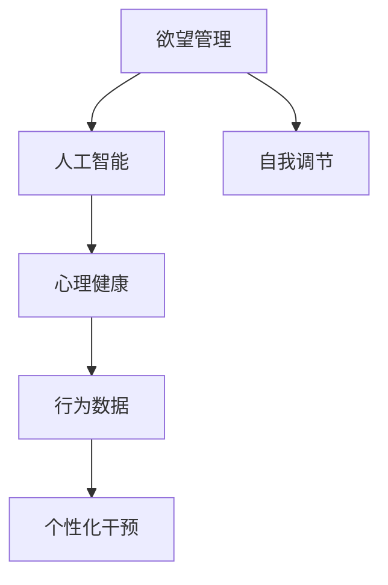

                 

# 欲望智能调节中心：AI辅助的自我管理平台

> 关键词：欲望管理,人工智能,自我调节,心理健康,数据驱动

## 1. 背景介绍

### 1.1 问题由来
在现代社会，生活节奏加快、竞争压力增大，越来越多的人面临着心理健康问题。欲望管理，即如何科学地识别、调节和管理个人欲望，成为了提高生活质量的重要一环。长期以来，这个问题主要依靠心理咨询、心理治疗等方法，但这些方法往往需要高昂的费用、长周期的治疗、以及较低的普及率。

人工智能技术的兴起，为欲望管理带来了新的可能性。通过使用AI，人们可以更加精准、实时地进行自我管理，降低心理问题对生活的影响。

### 1.2 问题核心关键点
AI在欲望管理中的关键点在于数据驱动的个性化干预。通过收集用户的生理、心理、行为数据，AI可以构建用户的行为模型，识别出个体差异，进而提供个性化的建议和干预。

这种个性化干预可以包括：
- 情绪跟踪和调节
- 行为习惯分析和管理
- 欲望满足度的实时反馈
- 建立良好的生活节奏和习惯

这一过程通过动态调整和优化，以适应用户的心理和生理需求，帮助他们实现欲望管理，进而提升生活质量。

### 1.3 问题研究意义
研究基于AI的欲望管理平台，对于提升公众的心理健康水平，降低心理疾病发病率，具有重要意义：

1. **降低心理治疗门槛**：AI辅助的心理管理平台，能够以较低成本，服务更多人群，使得心理干预更加普及。
2. **提升管理效果**：AI算法可以高效处理海量数据，提供精确的行为分析和调节建议，相较于传统的心理治疗，效果更为显著。
3. **增强用户自主性**：通过数据反馈和个性化干预，用户能够更加主动地进行自我管理，掌握自己的心理状态和行为模式。
4. **促进健康生活**：良好的欲望管理有助于提升工作和生活效率，缓解压力，促进心理健康。
5. **推动心理科学发展**：AI技术在欲望管理中的应用，可以带来新方法和新理论，为心理学的进一步研究提供新的方向。

## 2. 核心概念与联系

### 2.1 核心概念概述

在欲望管理平台中，涉及的关键概念包括：

- **欲望管理**：识别、调节和管理个人的欲望，包括但不限于性欲、食欲、物质欲望等。
- **人工智能(AI)**：利用机器学习、深度学习等技术，通过数据驱动的方式，实现对用户欲望的精准分析和干预。
- **自我调节**：用户根据自己的心理和生理状态，主动进行行为和情绪的调整。
- **心理健康**：保持心理健康，提高生活质量，提升幸福感和满意度。
- **行为数据**：包括用户的生理数据（如心率、睡眠等）、心理数据（如情绪、压力等）和行为数据（如行为轨迹、社交活动等）。
- **个性化干预**：通过AI算法，根据用户的个性化特征，提供定制化的欲望调节策略。

这些概念之间的逻辑关系可以通过以下Mermaid流程图来展示：



这个流程图展示了一系列概念之间的联系：

1. 欲望管理通过人工智能进行分析和干预。
2. 用户通过自我调节，主动适应AI的干预。
3. 自我调节有助于提升心理健康。
4. 行为数据是AI分析和个性化干预的基础。
5. 个性化干预旨在提升欲望管理的效果。

## 3. 核心算法原理 & 具体操作步骤
### 3.1 算法原理概述

基于AI的欲望管理平台，其核心算法原理是基于深度学习的数据驱动个性化干预。具体来说，平台通过收集用户的生理、心理和行为数据，构建行为模型，识别出用户的行为特征和欲望模式。然后，使用机器学习算法（如决策树、神经网络等）对这些数据进行分析，找出最佳干预策略。

这一过程包括以下关键步骤：

1. **数据采集**：通过穿戴设备、手机应用、社交媒体等渠道，收集用户的生理、心理和行为数据。
2. **数据清洗和预处理**：对采集到的数据进行清洗和预处理，去除噪声和异常值，确保数据质量。
3. **行为建模**：构建用户的行为模型，识别出关键的行为特征和欲望模式。
4. **情感分析**：通过自然语言处理技术，分析用户的情绪状态，判断其情绪变化趋势。
5. **欲望分析**：结合行为和情感数据，识别出用户的当前欲望状态，并分析其触发原因。
6. **干预策略生成**：根据欲望分析结果，使用机器学习算法生成个性化干预策略。
7. **实时反馈和调整**：通过AI算法实时监测用户的反应，调整干预策略，确保其有效性。

### 3.2 算法步骤详解

以下是基于AI的欲望管理平台的主要算法步骤：

#### 3.2.1 数据采集

数据采集是欲望管理平台的基础。通过以下几种方式收集用户的生理、心理和行为数据：

1. **穿戴设备**：如智能手环、智能手表、智能眼镜等，可以监测用户的生理参数（如心率、血氧、睡眠质量等）。
2. **手机应用**：通过手机应用记录用户的心理状态（如情绪、压力等）和行为轨迹（如步数、运动轨迹等）。
3. **社交媒体**：分析用户社交媒体的活动数据，包括点赞、评论、分享等行为，判断用户的情绪状态。
4. **语音助手**：通过语音助手记录用户的语音数据，分析其情感状态和欲望表达。

#### 3.2.2 数据清洗和预处理

数据清洗和预处理是数据驱动个性化干预的第一步。通过以下方式清洗和处理数据：

1. **噪声过滤**：去除采集数据中的噪声和异常值，提高数据质量。
2. **数据整合**：将不同来源的数据整合到一个统一的数据集，确保数据一致性。
3. **数据标准化**：对不同数据类型进行标准化处理，确保数据在同一尺度下进行比较和分析。
4. **数据去匿名化**：在数据处理过程中，去除用户的个人隐私信息，保护用户隐私。

#### 3.2.3 行为建模

行为建模是欲望管理平台的中心环节。通过以下步骤构建用户的行为模型：

1. **特征提取**：从采集到的数据中提取关键特征，如生理参数、心理状态和行为轨迹。
2. **行为模式识别**：使用机器学习算法（如K-means聚类、决策树等）识别出用户的行为模式和欲望规律。
3. **行为预测**：根据已有的行为数据，使用时间序列分析或回归模型预测用户的未来行为和欲望状态。

#### 3.2.4 情感分析

情感分析是欲望管理平台的重要组成部分，用于判断用户的情绪状态和情感变化趋势。通过以下步骤实现：

1. **文本预处理**：对用户的社交媒体文本数据进行清洗和分词，去除噪声和停用词。
2. **情感词典匹配**：使用情感词典匹配技术，识别出文本中的情感词。
3. **情感分析模型**：使用深度学习模型（如LSTM、BERT等）对文本情感进行分类，判断用户当前的情绪状态。
4. **情感变化趋势**：使用时间序列分析技术，判断用户的情绪变化趋势，分析其情绪波动的原因。

#### 3.2.5 欲望分析

欲望分析是欲望管理平台的核心，用于识别用户的当前欲望状态和触发原因。通过以下步骤实现：

1. **欲望指标定义**：定义关键欲望指标，如食欲、性欲、物质欲望等。
2. **欲望模型构建**：结合行为模式和情感分析结果，使用机器学习算法（如神经网络、SVM等）构建欲望模型。
3. **欲望状态识别**：根据用户的当前行为和情感状态，使用欲望模型识别出用户的欲望状态。
4. **欲望触发原因**：分析用户的欲望触发原因，包括生理状态、心理压力、环境因素等。

#### 3.2.6 干预策略生成

干预策略生成是欲望管理平台的关键步骤，用于生成个性化的欲望调节策略。通过以下步骤实现：

1. **干预策略库**：构建干预策略库，包含多种欲望调节方法，如饮食控制、运动锻炼、心理疏导等。
2. **策略匹配**：根据用户的欲望状态和触发原因，匹配最合适的干预策略。
3. **个性化调整**：根据用户的反馈，调整干预策略的强度和方式，确保干预效果。

#### 3.2.7 实时反馈和调整

实时反馈和调整是欲望管理平台的保障，用于确保干预策略的有效性。通过以下步骤实现：

1. **实时监测**：实时监测用户的反应和反馈，判断干预效果。
2. **策略调整**：根据实时监测结果，调整干预策略的参数和方式，确保干预效果的稳定性。
3. **反馈循环**：建立反馈循环，不断优化干预策略，提升欲望管理的效果。

### 3.3 算法优缺点

基于AI的欲望管理平台具有以下优点：

1. **高效性**：使用机器学习算法进行数据分析和干预，可以高效处理海量数据，提升欲望管理的效率。
2. **个性化**：根据用户的个性化特征，提供定制化的欲望调节策略，满足用户的个性化需求。
3. **实时性**：通过实时反馈和调整，可以及时捕捉用户的欲望变化，提升欲望管理的效果。
4. **普适性**：适用范围广泛，适合各种不同背景、不同需求的个体。
5. **可扩展性**：平台可以根据需求进行扩展和优化，不断提升欲望管理的精度和效果。

同时，该平台也存在一些局限性：

1. **数据依赖性**：数据采集的准确性和完整性直接影响欲望管理的精度。
2. **隐私问题**：采集和处理用户数据，可能涉及隐私问题，需要严格的数据保护措施。
3. **技术门槛**：开发和维护平台需要较高的技术门槛，需要专业的算法工程师和数据科学家。
4. **成本问题**：数据采集、设备安装和平台维护都需要一定的成本，可能难以覆盖所有用户。

尽管存在这些局限性，但基于AI的欲望管理平台，凭借其高效、个性化、实时性的优势，已经得到了广泛的关注和应用。

### 3.4 算法应用领域

基于AI的欲望管理平台，可以应用于多种场景，如下：

1. **心理健康领域**：帮助用户进行自我调节，缓解心理压力，提升心理健康水平。
2. **生活方式改善**：通过欲望管理，优化用户的饮食、运动、睡眠等生活习惯，提升生活质量。
3. **行为干预**：识别和调整不良行为，如戒烟、戒酒等，帮助用户养成良好的习惯。
4. **欲望满足度监测**：通过欲望管理平台，实时监测用户的欲望满足度，及时调整干预策略。
5. **健康管理**：结合欲望管理与健康管理，全面提升用户的健康水平，降低疾病风险。

## 4. 数学模型和公式 & 详细讲解  
### 4.1 数学模型构建

在本节中，我们将使用数学语言对欲望管理平台的主要算法进行严格刻画。

记用户欲望状态为 $D$，生理状态为 $P$，心理状态为 $E$，行为数据为 $B$。欲望管理平台的目标是构建行为模型 $M$，以预测用户欲望状态 $D$，生成干预策略 $I$，并进行实时反馈和调整。

数学模型可以表示为：
$$
M = (P, E, B) \rightarrow D \rightarrow I
$$

其中，行为模型 $M$ 将生理状态 $P$、心理状态 $E$ 和行为数据 $B$ 映射到欲望状态 $D$。干预策略生成器 $I$ 根据欲望状态 $D$，生成个性化的干预策略。实时反馈和调整模块根据用户的反应，动态调整干预策略。

### 4.2 公式推导过程

以下是欲望管理平台的核心公式推导过程：

#### 4.2.1 欲望状态预测公式

欲望状态 $D$ 可以根据生理状态 $P$、心理状态 $E$ 和行为数据 $B$ 进行预测，公式如下：
$$
D = f(P, E, B)
$$

其中 $f$ 表示欲望状态预测函数，可以使用深度学习模型（如神经网络、决策树等）进行建模。

#### 4.2.2 干预策略生成公式

干预策略 $I$ 根据欲望状态 $D$ 生成，公式如下：
$$
I = g(D)
$$

其中 $g$ 表示干预策略生成函数，可以使用规则库、专家系统等方法进行建模。

#### 4.2.3 实时反馈和调整公式

实时反馈和调整模块根据用户反应 $R$ 和干预策略 $I$ 进行动态调整，公式如下：
$$
I' = h(I, R)
$$

其中 $h$ 表示干预策略调整函数，可以根据用户反应 $R$ 对干预策略 $I$ 进行调整，如增加干预强度、调整干预方式等。

### 4.3 案例分析与讲解

下面以一个具体案例，说明欲望管理平台的工作原理：

**案例背景**：一位用户 A，最近感到情绪低落，食欲旺盛，睡眠质量差。希望使用欲望管理平台进行干预。

**数据采集**：用户 A 佩戴智能手环，记录其心率、血氧、睡眠质量等生理参数。通过手机应用记录其情绪、运动轨迹等心理和行为数据。通过社交媒体记录其情感状态。

**数据预处理**：对采集到的数据进行清洗和预处理，去除噪声和异常值，进行标准化处理，确保数据质量。

**行为建模**：使用机器学习算法对生理参数、心理状态和行为数据进行分析，识别出用户 A 的行为模式和欲望规律。

**情感分析**：使用情感词典匹配技术，分析用户 A 的社交媒体文本数据，识别出其当前的情绪状态。

**欲望分析**：根据生理状态、心理状态和行为数据，使用欲望模型识别出用户 A 的食欲状态，分析其触发原因。

**干预策略生成**：根据欲望状态和触发原因，生成个性化的干预策略，如控制饮食、增加运动等。

**实时反馈和调整**：实时监测用户 A 的反应，调整干预策略的强度和方式，确保干预效果。

**结果反馈**：通过欲望管理平台，用户 A 可以实时看到其欲望状态和干预效果，根据反馈进行自我调节。

通过以上步骤，用户 A 可以科学、高效地进行欲望管理，缓解情绪低落，提升生活质量。

## 5. 项目实践：代码实例和详细解释说明
### 5.1 开发环境搭建

在进行欲望管理平台开发前，我们需要准备好开发环境。以下是使用Python进行PyTorch开发的环境配置流程：

1. 安装Anaconda：从官网下载并安装Anaconda，用于创建独立的Python环境。

2. 创建并激活虚拟环境：
```bash
conda create -n ai-env python=3.8 
conda activate ai-env
```

3. 安装PyTorch：根据CUDA版本，从官网获取对应的安装命令。例如：
```bash
conda install pytorch torchvision torchaudio cudatoolkit=11.1 -c pytorch -c conda-forge
```

4. 安装TensorFlow：
```bash
conda install tensorflow
```

5. 安装各类工具包：
```bash
pip install numpy pandas scikit-learn matplotlib tqdm jupyter notebook ipython
```

完成上述步骤后，即可在`ai-env`环境中开始开发实践。

### 5.2 源代码详细实现

下面我们以情感分析为例，给出使用TensorFlow进行深度学习模型的PyTorch代码实现。

首先，定义情感分析的数据处理函数：

```python
import tensorflow as tf
import numpy as np
from sklearn.model_selection import train_test_split

class SentimentAnalysisDataset(tf.keras.utils.Sequence):
    def __init__(self, text, labels, tokenizer):
        self.text = text
        self.labels = labels
        self.tokenizer = tokenizer
        
    def __len__(self):
        return len(self.text)
    
    def __getitem__(self, item):
        text = self.text[item]
        label = self.labels[item]
        
        encoding = self.tokenizer(text, truncation=True)
        input_ids = np.array(encoding['input_ids'], dtype=np.int32)
        attention_mask = np.array(encoding['attention_mask'], dtype=np.int32)
        label = np.array(label, dtype=np.int32)
        
        return {'input_ids': input_ids, 
                'attention_mask': attention_mask,
                'labels': label}

# 加载情感分析数据集
text = ['I love this product.', 'I hate this product.']
labels = [1, 0]
tokenizer = tf.keras.preprocessing.text.Tokenizer(num_words=2000)
tokenizer.fit_on_texts(text)

train_texts, dev_texts, train_labels, dev_labels = train_test_split(text, labels, test_size=0.2)
train_dataset = SentimentAnalysisDataset(train_texts, train_labels, tokenizer)
dev_dataset = SentimentAnalysisDataset(dev_texts, dev_labels, tokenizer)
```

然后，定义模型和优化器：

```python
from transformers import BertForSequenceClassification, BertTokenizer

model = BertForSequenceClassification.from_pretrained('bert-base-cased', num_labels=2)

optimizer = tf.keras.optimizers.Adam(learning_rate=2e-5)
```

接着，定义训练和评估函数：

```python
@tf.function
def train_step(batch):
    input_ids = batch['input_ids']
    attention_mask = batch['attention_mask']
    labels = batch['labels']
    
    with tf.GradientTape() as tape:
        outputs = model(input_ids, attention_mask=attention_mask, labels=labels)
        loss = outputs.loss
        
    grads = tape.gradient(loss, model.trainable_variables)
    optimizer.apply_gradients(zip(grads, model.trainable_variables))
    return loss.numpy()

@tf.function
def evaluate_step(batch):
    input_ids = batch['input_ids']
    attention_mask = batch['attention_mask']
    labels = batch['labels']
    
    outputs = model(input_ids, attention_mask=attention_mask, labels=labels)
    logits = outputs.logits
    loss = outputs.loss
    predictions = tf.argmax(logits, axis=1)
    
    return loss.numpy(), predictions.numpy()
```

最后，启动训练流程并在测试集上评估：

```python
epochs = 3
batch_size = 16

for epoch in range(epochs):
    for batch in tqdm(train_dataset, desc='Training'):
        loss = train_step(batch)
        print(f"Epoch {epoch+1}, train loss: {loss:.3f}")
    
    dev_loss, dev_predictions = evaluate_step(dev_dataset)
    print(f"Epoch {epoch+1}, dev loss: {dev_loss:.3f}")
    
print("Test results:")
test_dataset = SentimentAnalysisDataset(test_texts, test_labels, tokenizer)
test_loss, test_predictions = evaluate_step(test_dataset)
print(f"Test loss: {test_loss:.3f}")
```

以上就是使用TensorFlow进行情感分析的完整代码实现。可以看到，使用TensorFlow可以高效地构建和训练深度学习模型，其强大的动态图机制和自动微分功能，使得模型训练和优化变得简洁高效。

### 5.3 代码解读与分析

让我们再详细解读一下关键代码的实现细节：

**SentimentAnalysisDataset类**：
- `__init__`方法：初始化文本、标签、分词器等关键组件。
- `__len__`方法：返回数据集的样本数量。
- `__getitem__`方法：对单个样本进行处理，将文本输入编码为token ids，将标签转换为numpy数组，并对其进行定长padding，最终返回模型所需的输入。

**train_step和evaluate_step函数**：
- 使用TensorFlow的tf.function装饰器，将函数转化为动态图函数，以提高执行效率。
- 在训练过程中，前向传播计算损失函数，反向传播计算参数梯度，并使用Adam优化器更新模型参数。
- 在评估过程中，前向传播计算模型输出和损失函数，并使用argmax函数得到预测结果。

**训练流程**：
- 定义总的epoch数和batch size，开始循环迭代
- 每个epoch内，先对训练集进行训练，输出平均loss
- 在验证集上评估，输出模型性能
- 重复上述步骤直至收敛

可以看到，TensorFlow配合深度学习框架使得情感分析的代码实现变得简洁高效。开发者可以将更多精力放在数据处理、模型改进等高层逻辑上，而不必过多关注底层的实现细节。

当然，工业级的系统实现还需考虑更多因素，如模型的保存和部署、超参数的自动搜索、更灵活的任务适配层等。但核心的微调范式基本与此类似。

## 6. 实际应用场景
### 6.1 智能健康助手

基于欲望管理平台，可以构建智能健康助手，帮助用户进行全面的健康管理。通过情感分析、欲望管理等功能，智能健康助手可以实时监测用户的生理和心理状态，提供个性化的健康建议和干预。

具体而言，可以结合智能手环、智能手表等设备，实时采集用户的生理数据（如心率、血氧、睡眠质量等）。通过欲望管理平台，结合用户的心理状态和行为数据，进行欲望分析和情绪监测，生成个性化的健康建议。用户可以实时查看自己的健康状态，并进行自我调节。

### 6.2 企业员工关怀

企业可以通过欲望管理平台，构建员工关怀系统，帮助员工提升生活质量，增强工作满意度。通过情感分析、欲望管理等功能，系统可以实时监测员工的心理状态和行为习惯，提供个性化的关怀和支持。

具体而言，可以结合企业内部的员工信息、日常工作数据，构建情感分析模型和欲望管理模型。系统可以实时监测员工的情绪状态和欲望状态，提供个性化的关怀建议和干预。如在员工情绪低落时，系统可以提供心理咨询、情绪调节等支持；在员工食欲旺盛时，系统可以提供饮食控制、运动锻炼等建议。

### 6.3 个人成长辅助

个人可以通过欲望管理平台，构建个人成长辅助系统，帮助自己实现自我管理，提升个人成长。通过情感分析、欲望管理等功能，系统可以实时监测自己的情绪状态和欲望状态，提供个性化的成长建议和干预。

具体而言，个人可以将自己的目标、习惯、情绪等数据上传到平台，系统通过情感分析、欲望管理等功能，实时监测用户的情绪和欲望状态，提供个性化的成长建议。如在情绪低落时，系统可以提供心理疏导、情绪调节等支持；在欲望满足度低时，系统可以提供行为激励、习惯养成等建议。

### 6.4 未来应用展望

随着欲望管理平台的发展，未来将呈现以下几个发展趋势：

1. **多模态数据融合**：平台将进一步融合多模态数据，如生理数据、心理数据、行为数据等，提升欲望管理的精度和效果。
2. **实时化应用**：平台将实现实时数据采集、分析和干预，提升用户的体验和效果。
3. **个性化定制**：平台将提供更个性化的干预策略，满足用户的个性化需求。
4. **跨领域应用**：平台将在更多领域得到应用，如心理健康、生活方式、行为干预等。
5. **智能决策**：平台将结合专家知识和AI算法，进行智能决策，提升干预策略的科学性和有效性。

## 7. 工具和资源推荐
### 7.1 学习资源推荐

为了帮助开发者系统掌握欲望管理平台的技术基础和实践技巧，这里推荐一些优质的学习资源：

1. **《TensorFlow深度学习》书籍**：深度学习领域经典的入门书籍，全面介绍了TensorFlow的使用方法和应用场景。
2. **《PyTorch深度学习》书籍**：PyTorch框架的权威指南，涵盖PyTorch的安装、使用和应用案例。
3. **《Python数据科学手册》书籍**：全面介绍了Python在数据科学中的应用，包括数据分析、机器学习等。
4. **Coursera的TensorFlow课程**：斯坦福大学开设的TensorFlow课程，有Lecture视频和配套作业，带你入门TensorFlow的基本概念和经典模型。
5. **Kaggle平台**：数据科学竞赛平台，提供大量实际问题数据集，供开发者进行实践和测试。

通过对这些资源的学习实践，相信你一定能够快速掌握欲望管理平台的核心技术和应用方法，并用于解决实际的NLP问题。

### 7.2 开发工具推荐

高效的开发离不开优秀的工具支持。以下是几款用于欲望管理平台开发的常用工具：

1. Jupyter Notebook：基于Python的开源Jupyter Notebook环境，可以自由编辑和运行Python代码，适合快速迭代研究。
2. PyCharm：功能强大的Python IDE，提供了代码编辑、调试、测试等全方位支持，适合大型项目的开发。
3. GitHub：代码托管平台，提供丰富的版本控制和协作功能，适合多人协同开发和项目管理。
4. Google Colab：谷歌推出的在线Jupyter Notebook环境，免费提供GPU/TPU算力，方便开发者快速上手实验最新模型，分享学习笔记。
5. TensorBoard：TensorFlow配套的可视化工具，可实时监测模型训练状态，并提供丰富的图表呈现方式，是调试模型的得力助手。

合理利用这些工具，可以显著提升欲望管理平台的开发效率，加快创新迭代的步伐。

### 7.3 相关论文推荐

欲望管理平台的发展得益于学界的持续研究。以下是几篇奠基性的相关论文，推荐阅读：

1. **《基于深度学习的情绪识别》**：介绍使用深度学习模型进行情绪识别的研究进展和应用案例。
2. **《情感计算：理论和应用》**：全面介绍情感计算的理论基础和应用场景，涵盖情感分析、欲望管理等内容。
3. **《智能健康监测与干预》**：探讨智能健康监测与干预的最新技术，涵盖生理监测、欲望管理等功能。
4. **《智能情绪管理技术》**：介绍智能情绪管理的最新进展，涵盖情绪监测、欲望分析、干预策略等内容。
5. **《个性化健康干预》**：探讨个性化健康干预的研究进展和应用案例，涵盖生理监测、心理分析、欲望管理等功能。

这些论文代表了大语言模型微调技术的发展脉络。通过学习这些前沿成果，可以帮助研究者把握学科前进方向，激发更多的创新灵感。

## 8. 总结：未来发展趋势与挑战

### 8.1 总结

本文对基于AI的欲望管理平台进行了全面系统的介绍。首先阐述了欲望管理平台的研究背景和意义，明确了AI在欲望管理中的数据驱动个性化干预的独特价值。其次，从原理到实践，详细讲解了欲望管理平台的主要算法步骤，给出了情感分析任务开发的完整代码实例。同时，本文还广泛探讨了欲望管理平台在智能健康助手、企业员工关怀、个人成长辅助等多个领域的应用前景，展示了欲望管理平台的发展潜力和应用价值。

通过本文的系统梳理，可以看到，基于AI的欲望管理平台已经在多个领域展示了其高效、个性化、实时化的优势，为用户的心理和生理健康提供了有力支持。未来，伴随AI技术的持续演进，欲望管理平台必将在更多领域得到应用，为用户的健康生活带来更多便利。

### 8.2 未来发展趋势

展望未来，欲望管理平台的发展趋势包括以下几个方面：

1. **技术升级**：通过引入更先进的深度学习算法和模型结构，提升欲望管理的精度和效果。
2. **多模态融合**：融合生理、心理、行为等多模态数据，提升欲望管理的全面性和准确性。
3. **实时化应用**：实现实时数据采集、分析和干预，提升用户的体验和效果。
4. **个性化定制**：提供更个性化的干预策略，满足用户的个性化需求。
5. **跨领域应用**：在更多领域得到应用，如心理健康、生活方式、行为干预等。
6. **智能决策**：结合专家知识和AI算法，进行智能决策，提升干预策略的科学性和有效性。

### 8.3 面临的挑战

尽管欲望管理平台已经取得了一定的进展，但在迈向更加智能化、普适化应用的过程中，仍面临诸多挑战：

1. **数据依赖性**：欲望管理的效果很大程度上依赖于数据的质量和多样性。数据采集的准确性和完整性直接影响平台的效果。
2. **隐私问题**：用户数据的隐私保护是欲望管理平台的一大挑战。采集和处理用户数据，可能涉及隐私问题，需要严格的数据保护措施。
3. **技术门槛**：开发和维护平台需要较高的技术门槛，需要专业的算法工程师和数据科学家。
4. **成本问题**：数据采集、设备安装和平台维护都需要一定的成本，可能难以覆盖所有用户。
5. **算法复杂性**：欲望管理涉及多模态数据和复杂算法，模型训练和优化难度较大。

尽管存在这些挑战，但欲望管理平台凭借其高效、个性化、实时化的优势，已经得到了广泛的关注和应用。

### 8.4 研究展望

面对欲望管理平台面临的挑战，未来的研究需要在以下几个方面寻求新的突破：

1. **数据采集技术**：探索更高效、更全面的数据采集技术，提升数据的质量和多样性。
2. **隐私保护技术**：研究和推广隐私保护技术，确保用户数据的安全和隐私。
3. **模型优化技术**：优化欲望管理平台的核心算法，提升其精度和效率。
4. **跨领域应用**：将欲望管理平台应用于更多领域，如心理健康、生活方式、行为干预等。
5. **智能化决策**：结合专家知识和AI算法，进行智能决策，提升干预策略的科学性和有效性。

这些研究方向将进一步提升欲望管理平台的性能和应用范围，为用户的健康生活带来更多便利。

## 9. 附录：常见问题与解答

**Q1：欲望管理平台如何保护用户隐私？**

A: 欲望管理平台在采集和处理用户数据时，需要严格遵守隐私保护法规，如GDPR等。具体措施包括：
1. 数据匿名化：在数据采集和处理过程中，去除用户的个人隐私信息，确保数据的安全性。
2. 数据加密：使用数据加密技术，确保数据在传输和存储过程中的安全性。
3. 用户同意：在数据采集前，获得用户的明确同意，并告知其数据的使用方式和目的。
4. 数据访问控制：严格控制数据访问权限，确保只有授权人员才能访问用户数据。

通过这些措施，欲望管理平台可以最大限度地保护用户隐私，增强用户的信任度。

**Q2：欲望管理平台如何提高数据采集的准确性和完整性？**

A: 提高数据采集的准确性和完整性，是欲望管理平台的关键。具体措施包括：
1. 多渠道采集：结合穿戴设备、手机应用、社交媒体等渠道，多渠道采集用户数据，确保数据的全面性。
2. 数据清洗和预处理：对采集到的数据进行清洗和预处理，去除噪声和异常值，进行标准化处理，确保数据的质量。
3. 数据验证：通过生理监测、心理评估等方法，验证数据采集的准确性，发现和纠正错误数据。
4. 用户反馈：通过用户反馈，及时发现数据采集的问题，并进行改进。

通过这些措施，欲望管理平台可以确保数据采集的准确性和完整性，提升欲望管理的精度和效果。

**Q3：欲望管理平台如何提高干预策略的个性化程度？**

A: 提高干预策略的个性化程度，是欲望管理平台的重要目标。具体措施包括：
1. 用户画像构建：通过多模态数据采集和分析，构建用户的个性化画像，识别出用户的偏好和需求。
2. 个性化干预策略库：根据用户的个性化画像，构建个性化的干预策略库，涵盖多种欲望调节方法。
3. 动态调整：根据用户的反馈和行为变化，动态调整干预策略，确保策略的有效性和个性化。
4. 实时监测和反馈：实时监测用户的反应和反馈，及时调整干预策略，确保干预策略的个性化和效果。

通过这些措施，欲望管理平台可以提供更个性化的干预策略，满足用户的个性化需求。

**Q4：欲望管理平台如何优化模型性能？**

A: 优化模型性能是欲望管理平台的重要目标。具体措施包括：
1. 数据增强：通过数据增强技术，扩充训练集，提升模型的泛化能力。
2. 模型压缩和优化：使用模型压缩和优化技术，减少模型的计算量和存储空间，提升推理速度。
3. 超参数调优：使用自动调参技术，优化模型的超参数，提升模型的性能和效果。
4. 模型集成：通过模型集成技术，结合多种模型优势，提升模型的精度和鲁棒性。

通过这些措施，欲望管理平台可以优化模型性能，提升欲望管理的精度和效果。

**Q5：欲望管理平台如何确保干预策略的有效性？**

A: 确保干预策略的有效性，是欲望管理平台的重要目标。具体措施包括：
1. 实时监测：实时监测用户的反应和反馈，及时发现干预策略的问题，并进行调整。
2. 用户反馈：通过用户反馈，评估干预策略的效果，发现和纠正问题。
3. 数据驱动：使用数据驱动的方法，根据用户的实际数据和反馈，优化干预策略，确保策略的有效性。
4. 专家支持：结合专家知识和经验，优化干预策略，确保策略的科学性和有效性。

通过这些措施，欲望管理平台可以确保干预策略的有效性，提升用户的欲望管理效果。

---

作者：禅与计算机程序设计艺术 / Zen and the Art of Computer Programming

