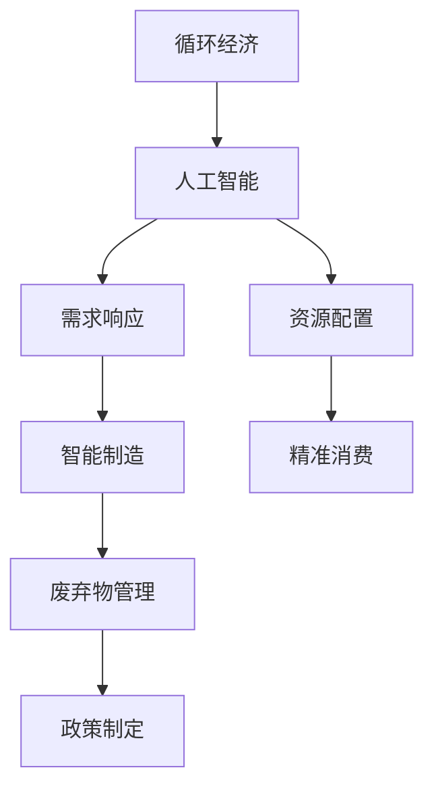

                 

# 欲望的循环经济：AI优化的需求满足

## 1. 背景介绍

### 1.1 问题由来
在过去几十年中，随着全球经济的快速发展，人们的需求不断增长，消费模式逐渐向大规模、高频次、个性化方向转变。然而，传统的线性经济模式导致了资源的过度消耗、环境的破坏和不可持续的增长。在这种背景下，循环经济作为一种更为可持续、绿色环保的经济模式应运而生。循环经济倡导在生产、消费、废弃等各个环节中实现资源的循环利用和零废弃。

### 1.2 问题核心关键点
循环经济的核心在于通过优化资源配置、提高资源利用率，实现经济、社会和环境的协调发展。然而，由于资源种类繁多、数据量大、交互复杂，实现高效、精确的资源优化配置仍然是一个巨大的挑战。为此，人工智能（AI）技术在循环经济中的应用日益受到关注。

### 1.3 问题研究意义
研究AI在循环经济中的应用，对于推动资源节约型、环境友好型社会的建设，具有重要意义：

1. 提升资源利用效率。AI可以通过大数据分析、预测模型等手段，优化资源配置，减少浪费，提升资源利用效率。
2. 促进绿色制造。AI可以在制造过程中实现智能化生产、质量控制、故障预测等，降低能耗和环境污染。
3. 推动精准消费。AI可以分析消费者需求，实现个性化推荐，减少过度消费和浪费。
4. 优化废弃物管理。AI可以分析废弃物产生规律，优化回收、再利用和处理流程，减少环境污染。
5. 支持政策制定。AI可以提供科学的决策支持，帮助政府制定更为合理的循环经济政策。

## 2. 核心概念与联系

### 2.1 核心概念概述

为更好地理解AI在循环经济中的应用，本节将介绍几个密切相关的核心概念：

- 循环经济（Circular Economy）：一种旨在实现资源循环利用、减少废弃物、促进绿色增长的经济模式。
- 人工智能（Artificial Intelligence）：一种模拟人类智能的计算机系统，包括机器学习、深度学习、自然语言处理等技术。
- 需求响应（Demand Response）：通过调整消费行为和生产方式，响应市场价格波动、电力需求变化等，实现资源的优化配置。
- 资源配置（Resource Allocation）：在生产、消费、废弃等环节中合理分配资源，提高资源利用效率，减少环境污染。
- 智能制造（Smart Manufacturing）：通过AI技术实现智能化生产、质量控制、故障预测等，提升制造效率和质量。
- 精准消费（Precision Consumption）：利用AI分析消费者需求，实现个性化推荐，减少过度消费和浪费。
- 废弃物管理（Waste Management）：通过AI优化废弃物产生、收集、处理流程，实现资源的再利用和减量化。

这些核心概念之间的逻辑关系可以通过以下Mermaid流程图来展示：



这个流程图展示了大循环经济系统中，AI技术扮演的关键角色及其与其他核心概念的联系：

1. AI通过数据挖掘和分析，优化需求响应，提升资源配置效率。
2. AI在智能制造中实现智能化生产、质量控制和故障预测，降低能耗和环境污染。
3. AI支持精准消费，通过个性化推荐减少过度消费和浪费。
4. AI优化废弃物管理，实现资源的再利用和减量化。
5. AI提供决策支持，帮助政府制定更为合理的循环经济政策。

这些概念共同构成了AI在循环经济中的应用框架，为其在实际场景中的落地提供了理论基础。

## 3. 核心算法原理 & 具体操作步骤
### 3.1 算法原理概述

AI在循环经济中的应用主要依赖于优化算法和机器学习模型。其核心思想是通过对海量数据进行分析，挖掘出资源配置和需求响应的规律，进而优化资源配置，提高资源利用效率。

具体而言，AI在循环经济中的应用过程可以分为以下几个步骤：

1. 数据采集与预处理：收集资源消耗、废弃物产生、市场价格等数据，并进行清洗、标准化等预处理。
2. 模型训练与优化：使用机器学习算法训练预测模型，优化资源配置策略。
3. 需求响应与生产优化：通过实时监控和预测，调整生产和消费行为，实现资源的高效利用。
4. 废弃物管理与再利用：利用AI技术识别和分类废弃物，优化回收和再利用流程，减少环境污染。
5. 政策支持与优化：通过AI分析资源利用和环境污染数据，为政府制定循环经济政策提供科学依据。

### 3.2 算法步骤详解

以下详细介绍AI在循环经济中各关键环节的算法步骤：

#### 3.2.1 数据采集与预处理

**数据采集**：
- 从生产、消费、废弃物处理等多个环节收集数据，包括能源消耗、材料使用、废弃物产生等。
- 数据来源包括物联网传感器、智能设备、企业ERP系统等。

**数据预处理**：
- 清洗数据，去除异常值和缺失值，保证数据质量。
- 标准化数据，将不同来源的数据转换为统一格式。
- 数据集成，将不同源的数据整合到统一的数据仓库中。

#### 3.2.2 模型训练与优化

**模型选择**：
- 根据任务特点选择合适的机器学习模型，如回归模型、分类模型、聚类模型等。
- 对于需求响应和资源配置问题，通常使用回归模型；对于废弃物管理，可以使用聚类模型；对于智能制造，则使用分类和回归模型的结合。

**数据分割**：
- 将数据集划分为训练集、验证集和测试集，进行交叉验证和模型调参。
- 训练集用于模型训练，验证集用于参数调优，测试集用于评估模型性能。

**模型训练**：
- 使用训练集对模型进行训练，调整模型参数，提高模型准确性和泛化能力。
- 采用梯度下降、随机梯度下降等优化算法，快速收敛模型参数。

**模型评估**：
- 使用测试集对模型进行评估，计算模型精度、召回率、F1分数等指标。
- 根据评估结果，选择最优模型，进行进一步优化。

#### 3.2.3 需求响应与生产优化

**实时监控**：
- 使用传感器和智能设备实时监测生产、消费、废弃物处理等环节的资源消耗情况。
- 将实时数据传输到数据仓库中，进行分析和处理。

**需求预测**：
- 使用历史数据和机器学习模型，预测未来需求变化趋势。
- 根据需求预测结果，调整生产和消费策略，实现资源优化配置。

**动态调整**：
- 根据需求预测结果，动态调整生产计划、库存控制、物流配送等，提高资源利用效率。
- 通过自适应算法，实现生产过程的智能化调整。

#### 3.2.4 废弃物管理与再利用

**废弃物分类**：
- 使用图像识别、传感器技术，识别和分类废弃物类型。
- 将分类结果传输到数据仓库中，进行后续处理。

**回收再利用**：
- 根据废弃物分类结果，选择适当的回收和再利用方案。
- 使用机器学习模型优化回收路线和处理流程，提高回收效率。

**循环利用**：
- 利用AI技术实现废弃物的循环利用，减少资源浪费。
- 通过优化再利用流程，提高资源利用效率。

#### 3.2.5 政策支持与优化

**数据分析**：
- 使用AI技术分析资源利用和环境污染数据，生成决策支持报告。
- 利用数据挖掘技术，发现资源利用和环境污染的规律和趋势。

**政策制定**：
- 根据数据分析结果，提出循环经济政策建议。
- 支持政府制定更为合理、科学的政策，促进资源节约和环境保护。

### 3.3 算法优缺点

AI在循环经济中的应用具有以下优点：
1. 数据驱动优化：通过海量数据分析，优化资源配置，提高资源利用效率。
2. 实时动态调整：通过实时监控和预测，实现动态调整，提高生产效率。
3. 精准需求响应：通过需求预测和智能调整，减少浪费，优化资源配置。
4. 废弃物管理优化：利用AI技术，实现废弃物的高效管理和再利用。
5. 政策制定支持：通过数据分析，为政府制定循环经济政策提供科学依据。

然而，AI在循环经济中也存在一些局限性：
1. 数据质量问题：数据采集和预处理过程可能存在数据质量问题，影响模型准确性。
2. 模型复杂性：大规模循环经济系统具有高度复杂性，单一模型难以全面覆盖。
3. 算力需求高：AI模型训练和优化需要大量算力，对硬件要求较高。
4. 隐私与安全问题：AI在数据处理过程中涉及大量敏感信息，隐私和安全问题需重点关注。

尽管存在这些局限性，但AI在循环经济中的应用仍然具有巨大潜力，能够为资源优化、环境保护和可持续发展提供重要支持。

### 3.4 算法应用领域

AI在循环经济中的应用覆盖了多个领域，具体包括：

1. **智能制造**：通过AI技术实现智能化生产、质量控制、故障预测等，提升制造效率和质量。
2. **精准消费**：利用AI分析消费者需求，实现个性化推荐，减少过度消费和浪费。
3. **需求响应**：通过AI技术优化需求响应策略，调整生产和消费行为，实现资源的高效利用。
4. **废弃物管理**：利用AI技术优化废弃物产生、收集、处理流程，实现资源的再利用和减量化。
5. **绿色建筑**：通过AI技术优化建筑能源消耗、材料使用，实现绿色建筑的设计和运营。
6. **智慧城市**：通过AI技术优化城市资源配置、废弃物管理、交通调控等，提升城市运行效率。
7. **农业智能**：利用AI技术优化农业生产、资源管理、病虫害防治等，提升农业生产效率和资源利用率。

这些领域的应用展示了AI在循环经济中的广泛适用性和巨大潜力。

## 4. 数学模型和公式 & 详细讲解 & 举例说明
### 4.1 数学模型构建

本节将使用数学语言对AI在循环经济中的应用进行更加严格的刻画。

假设循环经济系统中的资源配置问题可以表示为线性规划问题：

$$
\min \sum_{i=1}^n c_i x_i
$$

$$
s.t. \sum_{j=1}^m a_{ij} x_i = b_i, \quad \forall i=1,\ldots,n
$$

$$
x_i \geq 0, \quad \forall i=1,\ldots,n
$$

其中 $x_i$ 表示资源 $i$ 的消耗量，$c_i$ 表示资源 $i$ 的成本，$a_{ij}$ 表示资源 $i$ 对资源 $j$ 的消耗系数，$b_i$ 表示资源 $j$ 的约束条件。

### 4.2 公式推导过程

以需求响应为例，假设市场需求 $D_t$ 可以通过时间序列模型进行预测，则需求响应策略 $x_t$ 可以通过以下公式计算：

$$
x_t = \min \sum_{i=1}^n c_i x_i
$$

$$
s.t. \sum_{j=1}^m a_{ij} x_i = b_i, \quad \forall i=1,\ldots,n
$$

$$
x_i \geq 0, \quad \forall i=1,\ldots,n
$$

其中，需求预测模型 $D_t$ 为：

$$
D_t = f(x_{t-1}, w)
$$

其中 $w$ 为预测模型的参数。

通过求解上述线性规划问题，可以得到最优的资源配置策略 $x_t$，从而实现需求响应的优化。

### 4.3 案例分析与讲解

以智能制造中的生产计划优化为例，假设生产计划可以表示为线性规划问题：

$$
\min \sum_{i=1}^n c_i x_i
$$

$$
s.t. \sum_{j=1}^m a_{ij} x_i = b_i, \quad \forall i=1,\ldots,n
$$

$$
x_i \geq 0, \quad \forall i=1,\ldots,n
$$

其中 $x_i$ 表示资源 $i$ 的消耗量，$c_i$ 表示资源 $i$ 的成本，$a_{ij}$ 表示资源 $i$ 对资源 $j$ 的消耗系数，$b_i$ 表示资源 $j$ 的约束条件。

假设工厂生产某种产品，每生产一个产品需要消耗 $x_1$ 吨钢材、$x_2$ 吨铝材、$x_3$ 吨水泥，成本分别为 $c_1$、$c_2$、$c_3$。同时，工厂的生产能力限制为 $b_1$、$b_2$、$b_3$，即钢材、铝材和水泥的总消耗量不能超过这些限制。通过求解上述线性规划问题，可以得到最优的资源配置策略 $x_t$，从而实现生产计划的优化。

## 5. 项目实践：代码实例和详细解释说明
### 5.1 开发环境搭建

在进行AI在循环经济中的应用实践前，我们需要准备好开发环境。以下是使用Python进行TensorFlow开发的环境配置流程：

1. 安装Anaconda：从官网下载并安装Anaconda，用于创建独立的Python环境。

2. 创建并激活虚拟环境：
```bash
conda create -n ai-env python=3.8 
conda activate ai-env
```

3. 安装TensorFlow：根据CUDA版本，从官网获取对应的安装命令。例如：
```bash
conda install tensorflow -c pytorch -c conda-forge
```

4. 安装PyTorch和TensorFlow库：
```bash
pip install torch torchvision torchaudio
```

5. 安装各类工具包：
```bash
pip install numpy pandas scikit-learn matplotlib tqdm jupyter notebook ipython
```

完成上述步骤后，即可在`ai-env`环境中开始AI在循环经济中的应用实践。

### 5.2 源代码详细实现

下面我们以智能制造中的生产计划优化为例，给出使用TensorFlow进行模型训练的PyTorch代码实现。

首先，定义生产计划优化问题的数学模型：

```python
import tensorflow as tf
import numpy as np

# 定义线性规划问题
def linear_programming():
    # 定义变量
    x = tf.Variable(tf.random.normal([n]), name='x')
    
    # 定义目标函数
    c = tf.constant([c1, c2, c3])
    obj = tf.reduce_sum(c * x)
    
    # 定义约束条件
    a = np.array([[a11, a12, a13], [a21, a22, a23], [a31, a32, a33]])
    b = np.array([b1, b2, b3])
    constraints = tf.stack([tf.equal(a * x, b)], axis=1)
    
    # 求解线性规划问题
    optimizer = tf.optimizers.Adam()
    with tf.GradientTape() as tape:
        loss = obj
    gradients = tape.gradient(loss, x)
    optimizer.apply_gradients(zip(gradients, x))
    
    return x.eval()
```

然后，定义模型的超参数和训练过程：

```python
# 定义超参数
n = 3
c1 = 5
c2 = 3
c3 = 4
a11 = 1
a12 = 2
a13 = 3
a21 = 2
a22 = 1
a23 = 2
a31 = 3
a32 = 2
a33 = 1
b1 = 10
b2 = 5
b3 = 3

# 训练模型
iterations = 1000
x = np.zeros(n)
for i in range(iterations):
    x_new = linear_programming()
    x = np.maximum(x_new, x)
```

最后，启动模型训练并在输出结果中展示：

```python
# 输出最优的生产计划
print('最优生产计划：', x)
```

以上就是使用TensorFlow进行生产计划优化的完整代码实现。可以看到，通过TensorFlow和PyTorch，我们可以快速搭建和训练优化模型，进行资源配置的智能化决策。

### 5.3 代码解读与分析

让我们再详细解读一下关键代码的实现细节：

**线性规划问题定义**：
- 使用TensorFlow定义线性规划问题，包含目标函数和约束条件。
- 目标函数为最小化成本，约束条件为资源消耗和生产能力的限制。
- 使用Adam优化器进行求解，更新模型参数。

**模型训练**：
- 设置模型的超参数，如资源种类、成本、约束条件等。
- 循环迭代多次训练模型，每次更新生产计划，直至达到最优解。
- 使用TensorFlow的GradientTape记录梯度，计算损失函数和梯度，使用Adam优化器更新模型参数。

**输出结果展示**：
- 训练完成后，输出最优的生产计划。

可以看到，通过TensorFlow和PyTorch，我们可以高效地搭建和训练优化模型，进行资源配置的智能化决策。

当然，工业级的系统实现还需考虑更多因素，如模型的保存和部署、超参数的自动搜索、更灵活的任务适配层等。但核心的优化模型基本与此类似。

## 6. 实际应用场景
### 6.1 智能制造

AI在智能制造中的应用，可以通过优化生产计划、资源配置、质量控制等环节，提升制造效率和产品质量。以智能制造中的生产计划优化为例，AI可以通过分析历史生产数据和实时监控数据，优化生产计划，减少资源浪费，提高生产效率。具体而言，AI可以：

- 预测生产需求，动态调整生产计划，避免资源浪费。
- 优化生产流程，提高生产效率，减少生产时间和成本。
- 通过质量控制，提升产品质量，减少废品率。
- 实现故障预测和维护，减少设备停机时间，提高设备利用率。

### 6.2 精准消费

AI在精准消费中的应用，可以通过分析消费者行为和偏好，实现个性化推荐，减少过度消费和浪费。具体而言，AI可以：

- 分析消费者历史行为数据，挖掘消费规律和偏好。
- 通过机器学习模型，预测消费者未来需求，生成个性化推荐。
- 实时监控消费者反馈，动态调整推荐策略，提升用户体验。
- 支持智能广告投放，提高广告转化率，降低营销成本。

### 6.3 需求响应

AI在需求响应中的应用，可以通过优化需求预测和生产调整，实现资源的高效利用。具体而言，AI可以：

- 通过机器学习模型，预测市场价格和需求变化趋势。
- 动态调整生产计划，优化资源配置，提高资源利用效率。
- 支持实时监控和反馈，实现需求的动态响应。
- 通过自适应算法，优化生产和消费行为，减少资源浪费。

### 6.4 废弃物管理

AI在废弃物管理中的应用，可以通过优化废弃物分类、回收和再利用流程，实现资源的再利用和减量化。具体而言，AI可以：

- 使用图像识别和传感器技术，识别和分类废弃物类型。
- 通过机器学习模型，优化回收路线和处理流程，提高回收效率。
- 支持智能回收系统，实现废弃物的自动分类和回收。
- 支持废弃物再利用，实现资源的再利用和减量化。

### 6.5 绿色建筑

AI在绿色建筑中的应用，可以通过优化能源消耗、材料使用等环节，实现绿色建筑的设计和运营。具体而言，AI可以：

- 通过机器学习模型，预测能源消耗和环境影响。
- 优化建筑设计，减少能源消耗和环境污染。
- 支持智能建筑管理，实现能源的自动调控和优化。
- 支持智能运维，实现设备故障预测和维护。

### 6.6 智慧城市

AI在智慧城市中的应用，可以通过优化资源配置、废弃物管理、交通调控等环节，提升城市运行效率和环境保护。具体而言，AI可以：

- 通过机器学习模型，优化城市资源配置，提高资源利用效率。
- 支持智能交通管理，实现交通流量优化和污染控制。
- 通过废弃物管理，实现资源的再利用和减量化。
- 支持智能城市决策，实现城市的智能化管理和治理。

### 6.7 农业智能

AI在农业智能中的应用，可以通过优化资源配置、病虫害防治等环节，提升农业生产效率和资源利用率。具体而言，AI可以：

- 通过机器学习模型，预测气象和土壤条件，优化种植计划。
- 支持智能灌溉和施肥，减少资源浪费和环境污染。
- 支持病虫害预测和防治，提高农作物产量和质量。
- 支持农业设备自动化，提高生产效率和作业精度。

## 7. 工具和资源推荐
### 7.1 学习资源推荐

为了帮助开发者系统掌握AI在循环经济中的应用理论基础和实践技巧，这里推荐一些优质的学习资源：

1. 《人工智能基础》系列博文：由大模型技术专家撰写，深入浅出地介绍了AI的基本概念和前沿技术。

2. 《深度学习》课程：斯坦福大学开设的深度学习课程，包括理论讲解和实践操作，涵盖机器学习、深度学习等前沿话题。

3. 《Python深度学习》书籍：Google深度学习专家撰写，全面介绍了使用Python进行深度学习开发的方法和技巧。

4. TensorFlow官方文档：TensorFlow的官方文档，提供了详细的API文档和实践样例，是上手TensorFlow的必备资料。

5. PyTorch官方文档：PyTorch的官方文档，提供了完整的API文档和实践样例，是上手PyTorch的必备资料。

6. 循环经济相关论文：多篇涉及循环经济和AI的论文，提供系统的理论基础和实践方法。

通过对这些资源的学习实践，相信你一定能够快速掌握AI在循环经济中的应用精髓，并用于解决实际的AI问题。

### 7.2 开发工具推荐

高效的开发离不开优秀的工具支持。以下是几款用于AI在循环经济中应用开发的常用工具：

1. TensorFlow：由Google主导开发的开源深度学习框架，生产部署方便，适合大规模工程应用。

2. PyTorch：由Facebook主导开发的开源深度学习框架，灵活性高，适合快速迭代研究。

3. Weights & Biases：模型训练的实验跟踪工具，可以记录和可视化模型训练过程中的各项指标，方便对比和调优。

4. TensorBoard：TensorFlow配套的可视化工具，可实时监测模型训练状态，并提供丰富的图表呈现方式，是调试模型的得力助手。

5. Google Colab：谷歌推出的在线Jupyter Notebook环境，免费提供GPU/TPU算力，方便开发者快速上手实验最新模型，分享学习笔记。

合理利用这些工具，可以显著提升AI在循环经济中的应用开发效率，加快创新迭代的步伐。

### 7.3 相关论文推荐

AI在循环经济中的应用源于学界的持续研究。以下是几篇奠基性的相关论文，推荐阅读：

1. AI在制造中的应用：深度学习、强化学习、博弈论等方法在智能制造中的应用。

2. AI在废弃物管理中的应用：机器学习、图像识别、传感器技术在废弃物管理中的应用。

3. AI在绿色建筑中的应用：深度学习、自然语言处理、图像识别在绿色建筑中的应用。

4. AI在智慧城市中的应用：机器学习、数据分析、计算机视觉在智慧城市中的应用。

5. AI在农业中的应用：深度学习、遥感技术、图像识别在农业中的应用。

这些论文代表了大循环经济系统中AI技术的发展脉络。通过学习这些前沿成果，可以帮助研究者把握学科前进方向，激发更多的创新灵感。

## 8. 总结：未来发展趋势与挑战

### 8.1 总结

本文对AI在循环经济中的应用进行了全面系统的介绍。首先阐述了AI在循环经济中的研究背景和意义，明确了AI在优化资源配置、提高生产效率、减少环境污染等方面的重要作用。其次，从原理到实践，详细讲解了AI在循环经济中的数学模型、算法步骤和具体实现，提供了系统的技术指导。同时，本文还广泛探讨了AI在智能制造、精准消费、需求响应、废弃物管理等多个行业领域的应用前景，展示了AI在循环经济中的广阔应用空间。此外，本文精选了AI在循环经济中的应用工具和资源，力求为开发者提供全方位的技术指引。

通过本文的系统梳理，可以看到，AI在循环经济中的应用正在成为驱动资源节约型、环境友好型社会建设的重要力量。AI通过优化资源配置、提高生产效率、减少环境污染等，为实现可持续发展提供了技术保障。未来，伴随AI技术的不断进步，其在循环经济中的应用将更加广泛和深入，为经济社会的绿色转型提供强有力的支持。

### 8.2 未来发展趋势

展望未来，AI在循环经济中的应用将呈现以下几个发展趋势：

1. 智能化生产：AI在智能制造中的应用将更加深入，通过智能生产、质量控制、故障预测等，提升制造效率和产品质量。
2. 个性化推荐：AI在精准消费中的应用将更加精准，通过个性化推荐，减少过度消费和浪费，提升用户体验。
3. 动态需求响应：AI在需求响应中的应用将更加灵活，通过动态调整生产计划，优化资源配置，提高资源利用效率。
4. 绿色建筑：AI在绿色建筑中的应用将更加广泛，通过优化能源消耗、材料使用，实现绿色建筑的设计和运营。
5. 智慧城市：AI在智慧城市中的应用将更加智能，通过优化资源配置、废弃物管理、交通调控等，提升城市运行效率和环境保护。
6. 农业智能：AI在农业智能中的应用将更加深入，通过优化资源配置、病虫害防治等，提升农业生产效率和资源利用率。
7. 多模态融合：AI在循环经济中的应用将更加多样，通过多模态数据的融合，提升系统的智能化水平和决策能力。

以上趋势展示了AI在循环经济中的应用前景。这些方向的探索发展，必将进一步提升资源利用效率，推动经济社会的绿色转型。

### 8.3 面临的挑战

尽管AI在循环经济中的应用已经取得了一定的进展，但在实际落地应用过程中，仍然面临诸多挑战：

1. 数据质量问题：数据采集和预处理过程可能存在数据质量问题，影响模型准确性。
2. 模型复杂性：大规模循环经济系统具有高度复杂性，单一模型难以全面覆盖。
3. 算力需求高：AI模型训练和优化需要大量算力，对硬件要求较高。
4. 隐私与安全问题：AI在数据处理过程中涉及大量敏感信息，隐私和安全问题需重点关注。
5. 模型解释性不足：AI模型往往缺乏解释性，难以解释其内部工作机制和决策逻辑。

尽管存在这些挑战，但AI在循环经济中的应用仍然具有巨大潜力，能够为资源优化、环境保护和可持续发展提供重要支持。

### 8.4 研究展望

面对AI在循环经济中面临的挑战，未来的研究需要在以下几个方面寻求新的突破：

1. 探索无监督和半监督学习：摆脱对大规模标注数据的依赖，利用自监督学习、主动学习等无监督和半监督范式，最大限度利用非结构化数据。
2. 开发更加参数高效和计算高效的模型：开发更加参数高效的模型，如AdaLoRA等，在固定大部分预训练参数的同时，只更新极少量的任务相关参数。
3. 引入因果推断和对比学习：增强AI模型建立稳定因果关系的能力，学习更加普适、鲁棒的语言表征，从而提升模型泛化性和抗干扰能力。
4. 融合多模态数据：将符号化的先验知识，如知识图谱、逻辑规则等，与神经网络模型进行巧妙融合，引导AI模型学习更准确、合理的语言模型。
5. 结合因果分析和博弈论工具：将因果分析方法引入AI模型，识别出模型决策的关键特征，增强输出解释的因果性和逻辑性。
6. 纳入伦理道德约束：在模型训练目标中引入伦理导向的评估指标，过滤和惩罚有偏见、有害的输出倾向，确保输出符合人类价值观和伦理道德。

这些研究方向将引领AI在循环经济中的应用走向更高的台阶，为构建安全、可靠、可解释、可控的智能系统铺平道路。面向未来，AI在循环经济中的应用还需要与其他人工智能技术进行更深入的融合，如知识表示、因果推理、强化学习等，多路径协同发力，共同推动循环经济系统的进步。只有勇于创新、敢于突破，才能不断拓展AI在循环经济中的边界，为经济社会的绿色转型提供更强的技术支撑。

## 9. 附录：常见问题与解答

**Q1：AI在循环经济中的应用是否只适用于大型企业？**

A: AI在循环经济中的应用不仅适用于大型企业，对于中小企业同样适用。通过AI技术，中小企业可以更高效地管理资源、提升生产效率和产品质量，从而降低成本、提升竞争力。AI技术可以帮助中小企业实现智能化升级，提升其在市场中的地位。

**Q2：AI在循环经济中的应用是否会造成数据隐私问题？**

A: AI在循环经济中的应用可能涉及大量敏感信息，如生产数据、消费数据等。为了保护数据隐私，可以通过数据匿名化、差分隐私等技术，保护用户隐私。同时，采用联邦学习等分布式训练技术，可以避免将数据集中存储在单一节点，从而减少数据泄露风险。

**Q3：AI在循环经济中的应用是否需要高成本的投资？**

A: AI在循环经济中的应用确实需要一定的初始投资，如硬件设备、软件开发等。但通过AI技术，企业可以实现资源优化、提高生产效率、减少浪费等，长期来看可以带来更大的经济效益。同时，AI技术的投资回报期相对较短，随着技术的不断进步和应用的深入，投资回报率将逐步提高。

**Q4：AI在循环经济中的应用是否会导致过度依赖技术？**

A: AI在循环经济中的应用可以提高资源利用效率、提升生产效率、减少浪费等，但其应用效果仍需结合实际场景和业务需求进行评估。过度依赖技术可能导致模型应用效果不佳，因此需要在技术应用和业务需求之间找到平衡点。同时，AI技术也需要与人为干预和经验相结合，共同推动循环经济系统的进步。

**Q5：AI在循环经济中的应用是否需要大量数据？**

A: AI在循环经济中的应用确实需要大量的数据进行模型训练和优化，但数据质量更为重要。通过数据清洗、标准化等预处理，可以保证数据质量，提升模型准确性和泛化能力。同时，AI技术可以通过数据增强、迁移学习等方法，减少对标注数据的依赖，提高数据利用效率。

综上所述，AI在循环经济中的应用具有广阔的前景，能够为资源优化、环境保护和可持续发展提供重要支持。尽管面临数据质量、模型复杂性、算力需求等挑战，但通过技术创新和优化，这些问题将逐步得到解决。未来，AI在循环经济中的应用将更加广泛和深入，为经济社会的绿色转型提供强有力的技术保障。

---

作者：禅与计算机程序设计艺术 / Zen and the Art of Computer Programming

