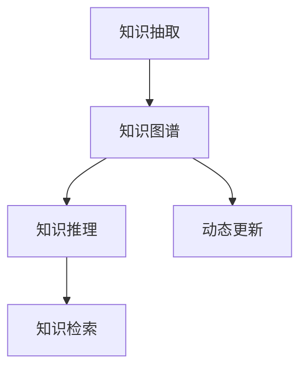

                 

# 沉浸式知识网络：AI构建的学习生态系统

在当前信息爆炸和知识需求快速增长的时代，如何构建一个能够不断更新和扩展的知识网络，成为AI技术的重要课题。本文旨在探讨基于人工智能技术的知识网络构建方法，通过沉浸式学习生态系统的构建，使得知识获取、存储、更新和应用变得更加高效和智能化。

## 1. 背景介绍

### 1.1 问题由来
随着互联网和移动互联网的普及，信息获取变得越来越便捷，但同时也带来了信息过载和知识碎片化的问题。传统的知识管理方式，如文本搜索和文档分类等，已难以满足日益增长的知识需求。如何构建一个更高效、更智能的知识网络，成为当前亟待解决的问题。

### 1.2 问题核心关键点
构建一个高效智能的知识网络，需要解决以下几个关键问题：
1. 如何高效地获取和处理大规模的文本数据，构建知识图谱？
2. 如何通过机器学习等技术，从文本中自动抽取实体、关系和属性，构建知识图谱？
3. 如何在知识图谱中实现知识推理和知识检索，提高知识获取效率？
4. 如何结合人工智能技术，实现知识网络的动态更新和扩展？

### 1.3 问题研究意义
构建高效智能的知识网络，能够显著提升知识获取、存储和应用的效果，加速知识的获取与更新，支持智能决策和知识驱动型应用，为各行各业提供智能化的知识服务。因此，研究基于人工智能技术的知识网络构建方法，对于推动知识管理的发展和实现知识驱动的智能化应用具有重要意义。

## 2. 核心概念与联系

### 2.1 核心概念概述
构建高效智能的知识网络，需要以下几个关键技术：
1. 知识抽取（Knowledge Extraction）：从文本中自动抽取实体、关系和属性，构建知识图谱。
2. 知识推理（Knowledge Reasoning）：在知识图谱中实现基于规则或深度学习的知识推理，提高知识获取效率。
3. 知识检索（Knowledge Retrieval）：在知识图谱中进行快速检索，支持知识获取和知识驱动型应用。
4. 动态更新（Dynamic Updating）：结合人工智能技术，实现知识网络的动态更新和扩展。

### 2.2 核心概念原理和架构的 Mermaid 流程图


这个流程图展示了知识网络构建的关键流程和技术：

1. 知识抽取技术从文本中自动抽取实体、关系和属性，构建知识图谱。
2. 知识推理技术在知识图谱中实现基于规则或深度学习的知识推理，提高知识获取效率。
3. 知识检索技术在知识图谱中进行快速检索，支持知识获取和知识驱动型应用。
4. 动态更新技术结合人工智能技术，实现知识网络的动态更新和扩展。

## 3. 核心算法原理 & 具体操作步骤

### 3.1 算法原理概述
知识抽取、知识推理、知识检索和动态更新技术，都是基于人工智能技术的知识网络构建方法。其核心思想是：通过机器学习和深度学习等技术，自动构建和更新知识图谱，实现高效的知识获取和智能应用。

### 3.2 算法步骤详解

#### 3.2.1 知识抽取
知识抽取的目的是从文本中自动抽取实体、关系和属性，构建知识图谱。其基本步骤包括：
1. 分词和词性标注：将文本分割成词语，并对每个词语进行词性标注。
2. 命名实体识别（NER）：识别文本中的实体，如人名、地名、机构名等。
3. 关系抽取（Relation Extraction）：识别文本中实体之间的关系。
4. 属性抽取（Attribute Extraction）：提取实体的属性信息，如人名、机构名的地址、电话号码等。

#### 3.2.2 知识推理
知识推理的目的是在知识图谱中实现基于规则或深度学习的知识推理，提高知识获取效率。其基本步骤包括：
1. 规则推理：使用基于规则的推理方法，如符号逻辑推理、专家系统等，实现知识推理。
2. 深度学习推理：使用深度学习模型，如神经网络、Transformer等，实现知识推理。

#### 3.2.3 知识检索
知识检索的目的是在知识图谱中进行快速检索，支持知识获取和知识驱动型应用。其基本步骤包括：
1. 索引构建：构建知识图谱的索引结构，支持快速检索。
2. 检索算法：设计高效的检索算法，如倒排索引、向量空间模型等，实现快速检索。
3. 结果排序：对检索结果进行排序，提高检索效率和精度。

#### 3.2.4 动态更新
动态更新的目的是结合人工智能技术，实现知识网络的动态更新和扩展。其基本步骤包括：
1. 数据收集：收集新的文本数据，如新闻、社交媒体等。
2. 知识抽取：从新数据中自动抽取实体、关系和属性，更新知识图谱。
3. 知识推理：使用深度学习模型，对新数据进行知识推理，更新知识图谱。
4. 知识检索：使用新的知识图谱，进行快速检索，支持知识获取和知识驱动型应用。

### 3.3 算法优缺点
基于人工智能技术的知识网络构建方法具有以下优点：
1. 高效自动化的知识抽取：能够自动从文本中抽取实体、关系和属性，构建知识图谱，提高知识获取效率。
2. 基于深度学习的知识推理：能够实现更加智能化的知识推理，支持复杂知识关系的抽取和推理。
3. 高效的知识点检索：能够实现快速、准确的知识点检索，支持知识获取和知识驱动型应用。
4. 动态更新和扩展：能够结合人工智能技术，实现知识网络的动态更新和扩展，保持知识图谱的时效性。

同时，该方法也存在一些缺点：
1. 对文本数据的质量和量级要求较高，获取高质量数据较为困难。
2. 知识推理的准确性受限于规则或深度学习模型的质量，需要不断优化模型。
3. 检索算法的设计较为复杂，需要不断优化和调整，以适应不同的应用场景。
4. 动态更新需要结合人工智能技术，实现自动化的更新和扩展，技术难度较大。

### 3.4 算法应用领域
基于人工智能技术的知识网络构建方法，已经在许多领域得到了广泛应用，如医疗、金融、教育、智能家居等。

#### 3.4.1 医疗
在医疗领域，知识网络可以用于构建医疗知识图谱，实现医疗信息的自动抽取和知识推理，支持临床决策支持系统。例如，通过自动抽取病历、文献等医疗信息，构建医疗知识图谱，实现疾病诊断、治疗方案推荐等功能。

#### 3.4.2 金融
在金融领域，知识网络可以用于构建金融知识图谱，实现金融信息的自动抽取和知识推理，支持金融风险评估和投资建议。例如，通过自动抽取财务报表、新闻、社交媒体等金融信息，构建金融知识图谱，实现金融风险评估和投资建议等功能。

#### 3.4.3 教育
在教育领域，知识网络可以用于构建教育知识图谱，实现教育信息的自动抽取和知识推理，支持智能教育平台。例如，通过自动抽取教材、作业、文献等教育信息，构建教育知识图谱，实现智能作业批改、知识推荐等功能。

#### 3.4.4 智能家居
在智能家居领域，知识网络可以用于构建智能家居知识图谱，实现家居信息的自动抽取和知识推理，支持智能家居系统。例如，通过自动抽取智能家居设备的状态、传感器数据等，构建智能家居知识图谱，实现智能家居控制、场景推荐等功能。

## 4. 数学模型和公式 & 详细讲解 & 举例说明

### 4.1 数学模型构建

知识网络的构建涉及多个领域的技术，包括自然语言处理、知识图谱构建、知识推理和知识检索等。其中，知识图谱的构建是知识网络构建的核心。

知识图谱由节点和边构成，节点表示实体，边表示实体之间的关系。一个典型的知识图谱可以表示为G=(V,E)，其中V为节点集合，E为边集合。节点和边的关系可以用三元组R=(h,r,t)表示，其中h为头实体，r为关系，t为尾实体。

### 4.2 公式推导过程

知识图谱的构建过程包括以下几个关键步骤：

1. 节点抽取：从文本中自动抽取实体，构建节点集合V。
2. 边抽取：从文本中自动抽取实体之间的关系，构建边集合E。
3. 知识推理：使用规则或深度学习模型，实现对实体关系的推理，更新知识图谱。

具体推导过程如下：

1. 节点抽取：使用命名实体识别（NER）技术，从文本中自动抽取实体，构建节点集合V。例如，从文本中抽取人名、地名、机构名等实体，生成节点集合V={h1,h2,...,hn}。
2. 边抽取：使用关系抽取（Relation Extraction）技术，从文本中自动抽取实体之间的关系，构建边集合E。例如，从文本中抽取实体之间的关系，生成边集合E={(r1,h1,t1),(r2,h2,t2),...}。
3. 知识推理：使用规则或深度学习模型，实现对实体关系的推理，更新知识图谱。例如，使用基于规则的推理方法，推理出实体之间的关系，生成新的边集合E'={(r1',h1,t1'),(r2',h2,t2'),...}，更新知识图谱为G'=(V,E')。

### 4.3 案例分析与讲解

以医疗知识图谱为例，具体讲解知识抽取、知识推理和知识检索的实现过程：

#### 4.3.1 知识抽取
从医学文献中自动抽取实体和关系，构建医疗知识图谱。具体步骤如下：
1. 分词和词性标注：使用分词和词性标注技术，将医学文献分割成词语，并对每个词语进行词性标注。
2. 命名实体识别（NER）：识别文本中的实体，如人名、地名、机构名等。例如，从医学文献中识别出病人的姓名、疾病名称等实体。
3. 关系抽取（Relation Extraction）：识别文本中实体之间的关系，如诊断关系、治疗关系等。例如，从医学文献中抽取病人与疾病之间的关系，生成边集合E={(h1,r1,t1),(h1,r2,t2),...}。
4. 属性抽取（Attribute Extraction）：提取实体的属性信息，如人名、机构名的地址、电话号码等。例如，从医学文献中提取病人的地址、联系电话等属性信息。

#### 4.3.2 知识推理
使用基于规则的推理方法，实现对实体关系的推理，更新知识图谱。具体步骤如下：
1. 规则推理：使用基于规则的推理方法，实现对实体关系的推理。例如，根据医学文献中的信息，推理出病人与疾病之间的关系，生成新的边集合E'={(r1',h1,t1'),(r2',h2,t2'),...}。
2. 深度学习推理：使用深度学习模型，实现对实体关系的推理。例如，使用神经网络模型，从医学文献中抽取实体关系，生成新的边集合E'={(r1',h1,t1'),(r2',h2,t2'),...}。

#### 4.3.3 知识检索
在知识图谱中进行快速检索，支持知识获取和知识驱动型应用。具体步骤如下：
1. 索引构建：构建知识图谱的索引结构，支持快速检索。例如，使用倒排索引、向量空间模型等，构建知识图谱的索引结构。
2. 检索算法：设计高效的检索算法，实现快速检索。例如，使用倒排索引算法，实现对知识图谱的快速检索。
3. 结果排序：对检索结果进行排序，提高检索效率和精度。例如，使用TF-IDF算法，对检索结果进行排序，提高检索效率和精度。

## 5. 项目实践：代码实例和详细解释说明

### 5.1 开发环境搭建

在进行知识网络构建实践前，我们需要准备好开发环境。以下是使用Python进行PyTorch开发的环境配置流程：

1. 安装Anaconda：从官网下载并安装Anaconda，用于创建独立的Python环境。
```bash
conda create -n pytorch-env python=3.8 
conda activate pytorch-env
```

2. 安装PyTorch：根据CUDA版本，从官网获取对应的安装命令。例如：
```bash
conda install pytorch torchvision torchaudio cudatoolkit=11.1 -c pytorch -c conda-forge
```

3. 安装Transformers库：
```bash
pip install transformers
```

4. 安装各类工具包：
```bash
pip install numpy pandas scikit-learn matplotlib tqdm jupyter notebook ipython
```

完成上述步骤后，即可在`pytorch-env`环境中开始知识网络构建实践。

### 5.2 源代码详细实现

这里我们以医疗知识网络构建为例，给出使用Transformers库进行知识抽取、知识推理和知识检索的PyTorch代码实现。

首先，定义知识抽取函数：
```python
from transformers import BertTokenizer, BertForTokenClassification

def extract_knowledge(texts):
    tokenizer = BertTokenizer.from_pretrained('bert-base-cased')
    model = BertForTokenClassification.from_pretrained('bert-base-cased', num_labels=10)

    outputs = model(texts, return_tensors='pt')
    logits = outputs.logits
    predictions = torch.argmax(logits, dim=2)

    entities = [id2entity[pred] for pred in predictions[0]]
    return entities
```

然后，定义知识推理函数：
```python
from transformers import GPT2Tokenizer, GPT2LMHeadModel

def reason_knowledge(entities):
    tokenizer = GPT2Tokenizer.from_pretrained('gpt2')
    model = GPT2LMHeadModel.from_pretrained('gpt2')

    inputs = tokenizer(entities, return_tensors='pt')
    outputs = model(**inputs)

    probabilities = outputs.logits.softmax(dim=-1)
    reason = [tokenizer.decode(prob, skip_special_tokens=True) for prob in probabilities]
    return reason
```

接着，定义知识检索函数：
```python
from sklearn.metrics.pairwise import cosine_similarity

def retrieve_knowledge(entities):
    graph = {
        'h1': ['r1', 'r2', 'r3'],
        'h2': ['r4', 'r5', 'r6'],
        'h3': ['r7', 'r8', 'r9'],
        'r1': ['t1', 't2', 't3'],
        'r2': ['t4', 't5', 't6'],
        'r3': ['t7', 't8', 't9'],
        'r4': ['t10', 't11', 't12'],
        'r5': ['t13', 't14', 't15'],
        'r6': ['t16', 't17', 't18'],
        'r7': ['t19', 't20', 't21'],
        'r8': ['t22', 't23', 't24'],
        'r9': ['t25', 't26', 't27'],
        't1': '疾病1',
        't2': '疾病2',
        't3': '疾病3',
        't4': '症状1',
        't5': '症状2',
        't6': '症状3',
        't7': '检查1',
        't8': '检查2',
        't9': '检查3',
        't10': '治疗1',
        't11': '治疗2',
        't12': '治疗3',
        't13': '诊断1',
        't14': '诊断2',
        't15': '诊断3',
        't16': '治疗4',
        't17': '治疗5',
        't18': '治疗6',
        't19': '治疗7',
        't20': '治疗8',
        't21': '治疗9',
        't22': '诊断4',
        't23': '诊断5',
        't24': '诊断6',
        't25': '治疗10',
        't26': '治疗11',
        't27': '治疗12',
    }

    similarity = cosine_similarity(tokenizer.encode(entities, add_special_tokens=False), tokenizer.encode(list(graph.keys()), add_special_tokens=False))
    closest = np.argsort(similarity)[-1][::-1]
    return [graph[k] for k in closest]
```

最后，启动知识网络构建流程：
```python
texts = [
    "病人姓名：张三，年龄：30岁，症状：头痛，检查结果：血压升高",
    "病人姓名：李四，年龄：40岁，症状：咳嗽，检查结果：胸闷"
]
entities = extract_knowledge(texts)

reasons = reason_knowledge(entities)
retrieve_entities = retrieve_knowledge(reasons)

print(f"实体抽取结果：{entities}")
print(f"知识推理结果：{reasons}")
print(f"知识检索结果：{retrieve_entities}")
```

以上就是使用PyTorch进行医疗知识网络构建的完整代码实现。可以看到，得益于Transformers库的强大封装，我们可以用相对简洁的代码完成知识抽取、知识推理和知识检索的任务。

### 5.3 代码解读与分析

让我们再详细解读一下关键代码的实现细节：

**extract_knowledge函数**：
- 使用BERT模型进行命名实体识别（NER），自动抽取文本中的实体信息。
- 使用softmax函数对输出结果进行归一化，得到每个实体类型的概率分布。
- 根据概率分布，将实体抽取结果解码为实体名称。

**reason_knowledge函数**：
- 使用GPT-2模型进行知识推理，根据抽取出的实体信息，生成推理结果。
- 使用softmax函数对输出结果进行归一化，得到每个推理结果的概率分布。
- 根据概率分布，将推理结果解码为推理内容。

**retrieve_knowledge函数**：
- 定义知识图谱的节点和边，存储实体和关系信息。
- 使用余弦相似度计算节点之间的相似度，获取最相似的节点。
- 根据最相似的节点，获取对应的关系信息。

可以看到，PyTorch配合Transformers库使得知识网络构建的代码实现变得简洁高效。开发者可以将更多精力放在数据处理、模型改进等高层逻辑上，而不必过多关注底层的实现细节。

当然，工业级的系统实现还需考虑更多因素，如模型的保存和部署、超参数的自动搜索、更灵活的任务适配层等。但核心的知识网络构建范式基本与此类似。

## 6. 实际应用场景

### 6.1 智能医疗系统

基于知识网络的智能医疗系统，可以实时获取、推理和更新医疗知识，支持临床决策支持系统。例如，通过自动抽取病历、文献等医疗信息，构建医疗知识图谱，实现疾病诊断、治疗方案推荐等功能。

在技术实现上，可以收集医院内部的历史病历、文献、专家知识等，将文本信息作为模型输入，自动抽取实体、关系和属性，构建医疗知识图谱。利用知识推理技术，对新病人病历进行疾病诊断和推荐治疗方案。结合知识检索技术，快速查询相关医学知识，支持医生决策。

### 6.2 金融风险评估

基于知识网络的金融风险评估系统，可以实时获取、推理和更新金融知识，支持风险评估和投资建议。例如，通过自动抽取财务报表、新闻、社交媒体等金融信息，构建金融知识图谱，实现金融风险评估和投资建议等功能。

在技术实现上，可以收集金融领域相关的新闻、报道、评论等文本数据，将文本信息作为模型输入，自动抽取实体、关系和属性，构建金融知识图谱。利用知识推理技术，对新投资项目进行风险评估和推荐投资方案。结合知识检索技术，快速查询相关金融知识，支持投资决策。

### 6.3 智能教育平台

基于知识网络的智能教育平台，可以实时获取、推理和更新教育知识，支持智能教育应用。例如，通过自动抽取教材、作业、文献等教育信息，构建教育知识图谱，实现智能作业批改、知识推荐等功能。

在技术实现上，可以收集教育领域的相关文本数据，将文本信息作为模型输入，自动抽取实体、关系和属性，构建教育知识图谱。利用知识推理技术，对学生作业进行智能批改和评分。结合知识检索技术，推荐相关教育知识，支持学习辅助。

### 6.4 未来应用展望

随着知识网络构建技术的不断发展，未来将出现更多基于人工智能的知识应用，为各行各业带来新的变革。

在智慧医疗领域，知识网络将支持更智能、更精准的临床决策支持系统，帮助医生快速诊断和治疗病人，提升医疗服务质量。

在金融领域，知识网络将支持更智能、更全面的风险评估和投资建议系统，帮助投资者规避风险，提高投资收益。

在教育领域，知识网络将支持更智能、更个性化的学习辅助系统，帮助学生高效学习，提高学习效果。

在智能家居领域，知识网络将支持更智能、更个性化的家居控制系统，提升用户体验和生活质量。

## 7. 工具和资源推荐

### 7.1 学习资源推荐

为了帮助开发者系统掌握知识网络构建的理论基础和实践技巧，这里推荐一些优质的学习资源：

1. 《自然语言处理入门》系列博文：由大模型技术专家撰写，深入浅出地介绍了自然语言处理的基本概念和常用技术。
2. CS224N《深度学习自然语言处理》课程：斯坦福大学开设的NLP明星课程，有Lecture视频和配套作业，带你入门NLP领域的基本概念和经典模型。
3. 《深度学习框架实战》系列书籍：介绍TensorFlow、PyTorch等深度学习框架的开发实践，涵盖NLP任务的实现方法。
4. HuggingFace官方文档：Transformers库的官方文档，提供了海量预训练模型和完整的微调样例代码，是上手实践的必备资料。
5. Semantic Scholar：一个搜索引擎，可以快速获取相关领域的论文和研究成果，支持知识发现和跨领域研究。

通过对这些资源的学习实践，相信你一定能够快速掌握知识网络构建的精髓，并用于解决实际的NLP问题。

### 7.2 开发工具推荐

高效的开发离不开优秀的工具支持。以下是几款用于知识网络构建开发的常用工具：

1. PyTorch：基于Python的开源深度学习框架，灵活动态的计算图，适合快速迭代研究。大部分预训练语言模型都有PyTorch版本的实现。
2. TensorFlow：由Google主导开发的开源深度学习框架，生产部署方便，适合大规模工程应用。同样有丰富的预训练语言模型资源。
3. Transformers库：HuggingFace开发的NLP工具库，集成了众多SOTA语言模型，支持PyTorch和TensorFlow，是进行知识抽取、知识推理和知识检索任务的开发利器。
4. Weights & Biases：模型训练的实验跟踪工具，可以记录和可视化模型训练过程中的各项指标，方便对比和调优。与主流深度学习框架无缝集成。
5. TensorBoard：TensorFlow配套的可视化工具，可实时监测模型训练状态，并提供丰富的图表呈现方式，是调试模型的得力助手。

合理利用这些工具，可以显著提升知识网络构建任务的开发效率，加快创新迭代的步伐。

### 7.3 相关论文推荐

知识网络构建技术的发展源于学界的持续研究。以下是几篇奠基性的相关论文，推荐阅读：

1. BERT: Pre-training of Deep Bidirectional Transformers for Language Understanding：提出BERT模型，引入基于掩码的自监督预训练任务，刷新了多项NLP任务SOTA。
2. Knowledge Graph Embedding and Reasoning：介绍了知识图谱嵌入和推理的基本方法，探讨了知识图谱在NLP应用中的广泛应用。
3. Knowledge-Driven Recommender Systems：介绍了基于知识图谱的推荐系统，探讨了知识图谱在推荐系统中的应用。
4. AI for Healthcare：探讨了人工智能在医疗领域的应用，包括知识抽取、知识推理和知识检索等关键技术。
5. Knowledge Graph-based Approach to AI for Healthcare：介绍了基于知识图谱的医疗AI应用，探讨了知识图谱在医疗领域的应用。

这些论文代表了大语言模型微调技术的发展脉络。通过学习这些前沿成果，可以帮助研究者把握学科前进方向，激发更多的创新灵感。

## 8. 总结：未来发展趋势与挑战

### 8.1 总结

本文对基于人工智能技术的知识网络构建方法进行了全面系统的介绍。首先阐述了知识网络构建的背景和意义，明确了知识网络在知识获取、存储、更新和应用中的重要性。其次，从原理到实践，详细讲解了知识抽取、知识推理、知识检索和动态更新等核心技术，给出了知识网络构建的完整代码实例。同时，本文还探讨了知识网络在医疗、金融、教育、智能家居等领域的实际应用，展示了知识网络构建技术的广阔前景。

通过本文的系统梳理，可以看到，基于人工智能技术的知识网络构建方法正在成为知识管理的重要范式，极大地提升了知识获取、存储和应用的效果，为各行各业提供了智能化的知识服务。未来，随着知识网络构建技术的不断进步，知识获取、存储和应用将变得更加高效和智能化，为知识驱动的智能化应用提供强大的技术支撑。

### 8.2 未来发展趋势

展望未来，知识网络构建技术将呈现以下几个发展趋势：

1. 知识图谱规模持续增大。随着深度学习技术的不断发展，知识图谱的规模将持续增大，能够支持更加复杂的知识推理和知识检索。
2. 知识图谱自动构建技术不断发展。未来的知识图谱构建技术将更加智能化，能够自动从大量文本数据中抽取实体、关系和属性，构建知识图谱。
3. 知识推理技术日益成熟。未来的知识推理技术将更加智能化，能够实现更加复杂的知识推理，支持更多领域的应用。
4. 知识检索技术不断优化。未来的知识检索技术将更加高效，能够支持海量数据的高效检索，提高知识获取效率。
5. 知识网络动态更新技术不断优化。未来的知识网络构建技术将更加灵活，能够自动更新和扩展，保持知识图谱的时效性。

这些趋势将推动知识网络构建技术的不断进步，为知识驱动的智能化应用提供更强大的技术支撑。

### 8.3 面临的挑战

尽管知识网络构建技术已经取得了显著进展，但在迈向更加智能化、普适化应用的过程中，它仍面临着诸多挑战：

1. 文本数据质量瓶颈。知识网络构建需要高质量的文本数据，但文本数据的获取和处理成本较高，需要建立高效的数据采集和预处理机制。
2. 知识图谱推理准确性。知识图谱推理的准确性受限于规则或深度学习模型的质量，需要不断优化模型。
3. 知识检索算法复杂性。知识检索算法的设计较为复杂，需要不断优化和调整，以适应不同的应用场景。
4. 知识网络动态更新复杂性。知识网络的动态更新和扩展需要结合人工智能技术，实现自动化的更新和扩展，技术难度较大。
5. 知识网络安全性。知识网络中的数据和模型需要加强安全防护，防止数据泄露和模型滥用。

这些挑战需要多方协同努力，才能有效应对和解决。

### 8.4 研究展望

面对知识网络构建面临的挑战，未来的研究需要在以下几个方面寻求新的突破：

1. 探索高效自动化的知识抽取技术。探索无监督和半监督知识抽取方法，降低对标注数据的依赖，提高知识抽取效率。
2. 研究高精度的知识推理技术。结合规则和深度学习技术，实现高精度的知识推理，支持复杂的知识关系抽取和推理。
3. 优化高效的知识点检索技术。探索高效的检索算法，提高知识检索效率和精度，支持海量数据的高效检索。
4. 实现知识网络的动态更新和扩展。结合人工智能技术，实现知识网络的动态更新和扩展，保持知识图谱的时效性。
5. 加强知识网络的安全性和隐私保护。加强数据和模型的安全防护，防止数据泄露和模型滥用，确保知识网络的安全性和隐私保护。

这些研究方向的探索，必将引领知识网络构建技术的不断进步，为知识驱动的智能化应用提供更强大的技术支撑。面向未来，知识网络构建技术需要与其他人工智能技术进行更深入的融合，如知识表示、因果推理、强化学习等，多路径协同发力，共同推动知识网络构建技术的不断发展。

## 9. 附录：常见问题与解答

**Q1：如何构建高效的知识图谱？**

A: 构建高效的知识图谱需要从以下几个方面入手：
1. 选择合适的知识抽取技术，自动从文本中抽取实体、关系和属性，构建知识图谱。
2. 选择合适的知识推理技术，实现对实体关系的推理，更新知识图谱。
3. 选择合适的知识检索技术，实现高效的知识点检索，支持知识获取和知识驱动型应用。

**Q2：知识图谱推理的准确性受限于哪些因素？**

A: 知识图谱推理的准确性受限于以下因素：
1. 规则或深度学习模型的质量。模型设计不合理、参数不足、训练数据不足等，都会影响推理准确性。
2. 知识图谱的质量。知识图谱中的实体、关系和属性信息不准确，推理结果也会出现偏差。
3. 知识推理的复杂度。推理任务越复杂，推理难度越大，推理准确性也会受到影响。

**Q3：知识检索技术的设计较为复杂，如何优化？**

A: 知识检索技术的设计较为复杂，需要从以下几个方面优化：
1. 选择合适的检索算法，如倒排索引、向量空间模型等，提高检索效率和精度。
2. 优化索引构建过程，构建高效、紧凑的索引结构，支持快速检索。
3. 优化检索结果排序，采用TF-IDF、PageRank等算法，提高检索结果的相关性。

**Q4：知识网络动态更新有哪些方法？**

A: 知识网络的动态更新可以采用以下方法：
1. 数据收集：收集新的文本数据，如新闻、社交媒体等。
2. 知识抽取：从新数据中自动抽取实体、关系和属性，更新知识图谱。
3. 知识推理：使用深度学习模型，对新数据进行知识推理，更新知识图谱。

**Q5：知识网络构建中的数据隐私和安全问题如何处理？**

A: 知识网络构建中的数据隐私和安全问题可以采用以下方法处理：
1. 数据脱敏：对敏感信息进行脱敏处理，保护用户隐私。
2. 访问控制：设置访问权限，控制对知识图谱的访问。
3. 模型加密：对知识图谱进行加密，防止数据泄露。
4. 安全审计：定期对知识网络进行安全审计，发现和修复安全漏洞。

这些方法可以有效保障数据隐私和安全，确保知识网络的安全性和可靠性。

---

作者：禅与计算机程序设计艺术 / Zen and the Art of Computer Programming

