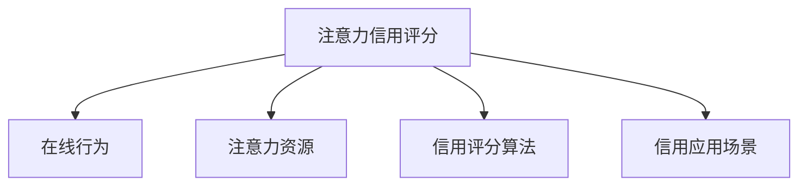

                 

# 注意力信用评分:元宇宙中的个人信用新维度

## 1. 背景介绍

### 1.1 问题由来

随着人工智能技术的迅速发展，尤其是深度学习在各个领域的广泛应用，传统的信用评估方式已经无法满足现代社会的需求。传统的信用评估方式主要依赖于个人的银行交易记录、信用历史等金融数据，而元宇宙的出现为个人信用的评估提供了一种全新的维度——“注意力信用评分”。

### 1.2 问题核心关键点

注意力信用评分（Attention Credit Score）是一种基于用户在线行为和注意力分配的数据模型，用于评估用户在元宇宙中的信誉和影响力。其核心关键点包括：

1. **注意力数据采集**：用户在线行为所消耗的注意力资源。
2. **信用评分计算**：基于用户注意力数据的信用评分算法。
3. **信用应用场景**：元宇宙中的身份认证、交易、借贷等应用场景。

通过分析用户的在线行为和注意力分配，可以更全面地了解用户的信誉和影响力，从而为元宇宙中的各种应用提供可靠的信用参考。

### 1.3 问题研究意义

在元宇宙中，用户的信用不仅影响到其在虚拟世界的声誉和地位，还直接关系到其参与虚拟交易、借贷等活动的可行性和可信度。通过引入注意力信用评分，可以在更加全面和真实的数据基础上评估用户的信誉，进一步提升元宇宙中的信任和协作效率。

## 2. 核心概念与联系

### 2.1 核心概念概述

为更好地理解注意力信用评分的原理和架构，本节将介绍几个密切相关的核心概念：

- **注意力信用评分（Attention Credit Score）**：一种基于用户在线行为和注意力分配的信用评估模型，用于元宇宙中用户信誉的度量。
- **在线行为（Online Behavior）**：用户在虚拟世界中的各种活动，如社交互动、游戏操作、虚拟交易等。
- **注意力资源（Attention Resource）**：用户在在线行为中消耗的注意力，包括关注度、参与度、时间分配等。
- **信用评分算法（Credit Score Algorithm）**：一种数学模型，用于计算用户的信用评分，基于注意力数据和预设的权重。
- **信用应用场景（Credit Application Scenarios）**：注意力信用评分在元宇宙中的各种应用，如虚拟交易、身份认证、借贷等。

这些核心概念之间的逻辑关系可以通过以下Mermaid流程图来展示：



这个流程图展示了点到面的关系：

1. 注意力信用评分是核心概念，基于在线行为和注意力资源，通过信用评分算法计算得到。
2. 在线行为是数据来源，包含了用户在虚拟世界中的各种活动。
3. 注意力资源是关键指标，反映了用户在线行为对注意力的消耗情况。
4. 信用评分算法是计算工具，用于将注意力资源转换为信用评分。
5. 信用应用场景是应用范围，覆盖了元宇宙中的多个重要应用。

这些概念共同构成了注意力信用评分的体系，为元宇宙中信用评估提供了新的维度。

## 3. 核心算法原理 & 具体操作步骤

### 3.1 算法原理概述

注意力信用评分的核心原理是，将用户的在线行为转化为注意力资源，并基于这些注意力资源计算用户的信用评分。其基本流程如下：

1. **数据采集**：收集用户在虚拟世界中的各种在线行为数据，如社交互动、游戏操作、虚拟交易等。
2. **注意力计算**：对用户的行为数据进行注意力计算，得到用户在不同行为上消耗的注意力资源。
3. **信用评分计算**：基于注意力数据和预设的权重，计算用户的信用评分。
4. **信用应用**：在虚拟交易、身份认证、借贷等场景中，使用信用评分进行风险评估和决策。

### 3.2 算法步骤详解

以下是注意力信用评分算法的详细步骤：

**Step 1: 数据采集**
- 收集用户在虚拟世界中的在线行为数据，包括社交互动记录、游戏操作日志、虚拟交易记录等。
- 对行为数据进行清洗和预处理，去除噪声和异常值。

**Step 2: 注意力计算**
- 对处理后的行为数据进行注意力计算，得到用户在不同行为上消耗的注意力资源。
- 注意力的计算可以基于用户的关注度、参与度、时间分配等指标，使用数学模型或机器学习算法进行建模。

**Step 3: 信用评分计算**
- 基于注意力数据和预设的权重，计算用户的信用评分。
- 信用评分算法可以采用线性回归、决策树、神经网络等模型，具体选择取决于数据的特点和任务的需求。

**Step 4: 信用应用**
- 在虚拟交易、身份认证、借贷等场景中，使用信用评分进行风险评估和决策。
- 对于高风险用户，可以限制其参与某些敏感操作或提高其参与操作的门槛。

### 3.3 算法优缺点

注意力信用评分的优点：

1. **全面性**：基于用户的在线行为和注意力资源，提供更全面的信用评估。
2. **动态性**：在线行为和注意力资源是动态变化的，信用评分能够实时反映用户的变化。
3. **泛化性**：适用于元宇宙中的各种应用场景，具有较高的泛化能力。

注意力信用评分的缺点：

1. **数据依赖性**：数据采集和处理需要大量的时间和资源，且数据的质量直接影响信用评分的准确性。
2. **隐私问题**：用户在线行为数据可能包含敏感信息，隐私保护问题需要得到充分考虑。
3. **模型复杂性**：信用评分算法需要较高的数学和机器学习基础，模型设计和调参难度较大。

### 3.4 算法应用领域

注意力信用评分在元宇宙中有着广泛的应用场景，例如：

1. **虚拟交易**：在虚拟交易中，用户的行为和注意力能够直接影响交易的顺利进行。通过注意力信用评分，可以对用户的交易行为进行风险评估，提高交易的可靠性和安全性。
2. **身份认证**：在虚拟世界中，用户需要频繁进行身份认证。通过注意力信用评分，可以对用户的身份真实性进行评估，防止虚假身份的恶意行为。
3. **借贷和融资**：在虚拟经济中，借贷和融资行为极为频繁。通过注意力信用评分，可以对用户的还款能力和信誉进行评估，降低风险。
4. **社交互动**：在虚拟社交中，用户的注意力分配能够反映其社交能力和影响力。通过注意力信用评分，可以评估用户的社交地位和可信度。

这些应用场景展示了注意力信用评分在元宇宙中的巨大潜力和价值。

## 4. 数学模型和公式 & 详细讲解 & 举例说明

### 4.1 数学模型构建

注意力信用评分模型可以基于多种数学模型进行构建，其中最常用的是线性回归模型。假设用户行为数据为 $x_i$，注意力数据为 $a_i$，信用评分为 $c$，则线性回归模型的基本形式为：

$$
c = \beta_0 + \beta_1x_1 + \beta_2x_2 + \cdots + \beta_nx_n + \epsilon
$$

其中 $\beta_i$ 为第 $i$ 个特征的系数，$\epsilon$ 为误差项。

### 4.2 公式推导过程

对于线性回归模型的训练过程，通常采用最小二乘法。假设训练数据集为 $(x_i, a_i)$，其中 $x_i = (x_{i1}, x_{i2}, \cdots, x_{in})$，$a_i$ 为注意力资源。则最小二乘法的目标函数为：

$$
\min_{\beta} \sum_{i=1}^n(a_i - \beta_0 - \beta_1x_{i1} - \beta_2x_{i2} - \cdots - \beta_nx_{in})^2
$$

求解上述目标函数的最小值，即可得到最优的系数 $\beta$。具体推导过程如下：

$$
\frac{\partial \sum_{i=1}^n(a_i - \beta_0 - \beta_1x_{i1} - \beta_2x_{i2} - \cdots - \beta_nx_{in})^2}{\partial \beta_j} = -2\sum_{i=1}^n(a_i - \beta_0 - \beta_1x_{i1} - \beta_2x_{i2} - \cdots - \beta_nx_{in})x_{ij}
$$

令导数等于零，解得：

$$
\beta_j = \frac{\sum_{i=1}^n(x_{ij}(a_i - \beta_0 - \beta_1x_{i1} - \beta_2x_{i2} - \cdots - \beta_nx_{in}))}{\sum_{i=1}^n x_{ij}^2}
$$

### 4.3 案例分析与讲解

假设用户 A 在虚拟社交平台上的行为数据为 $(x_{A1}, x_{A2}, x_{A3})$，对应的注意力资源为 $(a_{A1}, a_{A2}, a_{A3})$。通过线性回归模型计算用户 A 的信用评分 $c_A$，假设线性回归模型的系数为 $\beta = (\beta_1, \beta_2, \beta_3)$，则：

$$
c_A = \beta_1x_{A1} + \beta_2x_{A2} + \beta_3x_{A3} + \beta_0
$$

其中 $\beta_0$ 为截距项，$\beta_1, \beta_2, \beta_3$ 为对应特征的系数。

假设 $x_{A1}=2, x_{A2}=3, x_{A3}=1$，对应的注意力资源为 $a_{A1}=0.8, a_{A2}=0.9, a_{A3}=0.5$，假设 $\beta_1=0.5, \beta_2=0.3, \beta_3=0.2, \beta_0=1$，则：

$$
c_A = 0.5 \times 2 + 0.3 \times 3 + 0.2 \times 1 + 1 = 3.0
$$

计算结果表明，用户 A 的信用评分为 3.0，具有一定的信誉和影响力。

## 5. 项目实践：代码实例和详细解释说明

### 5.1 开发环境搭建

在进行注意力信用评分开发前，我们需要准备好开发环境。以下是使用Python进行TensorFlow开发的环境配置流程：

1. 安装Anaconda：从官网下载并安装Anaconda，用于创建独立的Python环境。

2. 创建并激活虚拟环境：
```bash
conda create -n tf-env python=3.8 
conda activate tf-env
```

3. 安装TensorFlow：根据CUDA版本，从官网获取对应的安装命令。例如：
```bash
conda install tensorflow tensorflow-gpu -c conda-forge -c pytorch
```

4. 安装Pandas、NumPy、Scikit-learn等辅助库：
```bash
pip install pandas numpy scikit-learn matplotlib tqdm jupyter notebook ipython
```

完成上述步骤后，即可在`tf-env`环境中开始注意力信用评分的开发。

### 5.2 源代码详细实现

这里我们以线性回归模型为例，给出使用TensorFlow进行注意力信用评分计算的代码实现。

```python
import tensorflow as tf
import pandas as pd
from sklearn.preprocessing import StandardScaler

# 读取数据
data = pd.read_csv('attention_data.csv')

# 数据预处理
features = data[['x1', 'x2', 'x3']]
targets = data['a']
scaler = StandardScaler()
features = scaler.fit_transform(features)

# 构建模型
model = tf.keras.Sequential([
    tf.keras.layers.Dense(1, input_shape=[len(features.columns)], activation='linear')
])

# 编译模型
model.compile(optimizer='adam', loss='mse')

# 训练模型
model.fit(features, targets, epochs=50, batch_size=32, verbose=2)

# 测试模型
test_features = pd.read_csv('test_features.csv')
test_features = scaler.transform(test_features)
predictions = model.predict(test_features)
```

### 5.3 代码解读与分析

这里我们详细解读一下关键代码的实现细节：

**数据读取与预处理**：
- 使用Pandas库读取数据，选择对应的特征和目标变量。
- 使用StandardScaler对特征进行标准化处理，避免不同特征尺度不一致导致模型训练效果差。

**模型构建与训练**：
- 使用TensorFlow的Sequential模型，定义一个包含一个线性层的神经网络。
- 通过StandardScaler标准化后的特征作为输入，目标变量作为输出。
- 使用Adam优化器和均方误差损失函数编译模型。
- 使用fit方法训练模型，指定训练轮数和批次大小。

**模型测试**：
- 使用测试数据集，对模型进行测试。
- 将测试数据集进行标准化处理，避免测试数据与训练数据尺度不一致导致误差较大。

**运行结果展示**：
- 训练过程中每轮训练的损失值和训练次数，测试结果的预测值和真实值等。

## 6. 实际应用场景

### 6.1 虚拟交易平台

在虚拟交易平台中，用户的在线行为和注意力资源可以直接影响其交易的信任度和安全性。通过注意力信用评分，平台可以对用户的交易行为进行实时评估，确保交易的顺利进行。

具体实现方式为：
- 平台对用户的在线行为进行数据采集，如购买记录、交易频率等。
- 对采集到的数据进行注意力计算，得到用户的注意力资源。
- 基于注意力数据和预设的权重，计算用户的信用评分。
- 在用户进行交易时，根据其信用评分进行风险评估，决定是否放行。

### 6.2 身份认证系统

在虚拟世界中的身份认证系统，用户的在线行为和注意力资源可以用于评估其身份的真实性和可信度。通过注意力信用评分，平台可以判断用户是否为真实身份，防止恶意攻击和虚假身份的注册。

具体实现方式为：
- 平台对用户的行为数据进行采集，如社交互动、游戏操作等。
- 对采集到的数据进行注意力计算，得到用户的注意力资源。
- 基于注意力数据和预设的权重，计算用户的信用评分。
- 在进行身份认证时，根据其信用评分判断身份的真实性，决定是否放行。

### 6.3 借贷和融资平台

在虚拟经济中，借贷和融资行为极为频繁。通过注意力信用评分，平台可以对用户的还款能力和信誉进行评估，降低借贷和融资的风险。

具体实现方式为：
- 平台对用户的在线行为进行数据采集，如借贷记录、还款记录等。
- 对采集到的数据进行注意力计算，得到用户的注意力资源。
- 基于注意力数据和预设的权重，计算用户的信用评分。
- 在进行借贷和融资时，根据其信用评分进行风险评估，决定是否放行。

### 6.4 未来应用展望

随着注意力信用评分的不断完善和发展，其在元宇宙中的应用场景将进一步扩展，例如：

1. **智能合约**：在元宇宙中的智能合约中，用户的注意力资源和信用评分可以直接用于合同的执行和决策。
2. **虚拟资产管理**：在虚拟资产管理中，用户的信用评分可以用于评估其在虚拟资产的管理和保护能力。
3. **社交平台**：在虚拟社交平台中，用户的注意力资源和信用评分可以用于评估其社交地位和影响力，提高社交互动的质量。

## 7. 工具和资源推荐

### 7.1 学习资源推荐

为了帮助开发者系统掌握注意力信用评分的理论基础和实践技巧，这里推荐一些优质的学习资源：

1. TensorFlow官方文档：TensorFlow官方提供的详细文档和教程，帮助开发者深入理解TensorFlow框架和模型训练。

2. Coursera《机器学习》课程：斯坦福大学开设的机器学习课程，由Andrew Ng教授主讲，涵盖机器学习的基本概念和算法。

3. Kaggle机器学习竞赛：Kaggle提供的各类机器学习竞赛，帮助开发者实践和验证机器学习模型。

4. HuggingFace官方文档：HuggingFace提供的详细文档和样例代码，帮助开发者使用预训练模型进行任务开发。

5. GitHub注意力信用评分项目：GitHub上提供的注意力信用评分代码库，包含模型构建、数据处理、模型评估等各个环节的详细实现。

通过对这些资源的学习实践，相信你一定能够快速掌握注意力信用评分的精髓，并用于解决实际的元宇宙问题。

### 7.2 开发工具推荐

高效的开发离不开优秀的工具支持。以下是几款用于注意力信用评分开发的常用工具：

1. TensorFlow：由Google主导开发的开源深度学习框架，生产部署方便，适合大规模工程应用。

2. PyTorch：基于Python的开源深度学习框架，灵活动态的计算图，适合快速迭代研究。

3. Jupyter Notebook：交互式的开发环境，支持Python、R、MATLAB等多种语言，方便开发者进行代码测试和调试。

4. GitHub：代码托管平台，支持团队协作开发和版本控制。

5. GitLab：代码托管平台，支持CI/CD、DevOps等持续集成和部署工具。

合理利用这些工具，可以显著提升注意力信用评分任务的开发效率，加快创新迭代的步伐。

### 7.3 相关论文推荐

注意力信用评分的发展源于学界的持续研究。以下是几篇奠基性的相关论文，推荐阅读：

1. Attention Mechanism in Neural Networks（即注意力机制在神经网络中的应用）：提出了注意力机制的基本原理和算法，广泛应用于NLP、计算机视觉等领域。

2. Relevance Vector Machine（即相关向量机）：一种基于核函数的学习算法，用于解决高维数据稀疏性问题。

3. Generative Adversarial Networks（即生成对抗网络）：一种基于博弈论的深度学习算法，用于生成高质量的合成数据。

4. Self-Attention for NLP（即自注意力在NLP中的应用）：提出自注意力机制，用于处理序列数据，如文本、语音等。

5. Attention-based Credit Scoring（即基于注意力评分的信用评估）：研究如何利用注意力机制进行信用评分，提高评估的准确性和实时性。

这些论文代表了大模型微调技术的发展脉络。通过学习这些前沿成果，可以帮助研究者把握学科前进方向，激发更多的创新灵感。

## 8. 总结：未来发展趋势与挑战

### 8.1 总结

本文对注意力信用评分这一基于用户在线行为和注意力分配的信用评估模型进行了全面系统的介绍。首先阐述了注意力信用评分的背景和意义，明确了其在元宇宙中的重要地位。其次，从原理到实践，详细讲解了注意力信用评分的数学原理和计算过程，给出了注意力信用评分的代码实现。同时，本文还广泛探讨了注意力信用评分在元宇宙中的各种应用场景，展示了其广泛的应用前景。最后，本文精选了注意力信用评分的学习资源，力求为读者提供全方位的技术指引。

通过本文的系统梳理，可以看到，注意力信用评分在元宇宙中具有广泛的应用价值，能够更好地评估用户的信誉和影响力，提升元宇宙中的信任和协作效率。未来，伴随元宇宙技术的发展，注意力信用评分必将在更多领域得到应用，为元宇宙经济和社会带来深远影响。

### 8.2 未来发展趋势

展望未来，注意力信用评分的应用和发展将呈现以下几个趋势：

1. **技术进步**：随着深度学习、计算机视觉等技术的进步，注意力信用评分模型将更加精准和高效。
2. **应用场景扩展**：除了虚拟交易、身份认证、借贷等场景外，注意力信用评分还将应用于智能合约、虚拟资产管理等更多领域。
3. **数据来源多样化**：除了在线行为数据外，更多的数据源，如社交网络、物联网等，将被纳入信用评分的计算中。
4. **隐私保护加强**：伴随隐私保护技术的不断发展，注意力信用评分将更加注重用户隐私和数据安全。

这些趋势将进一步推动注意力信用评分的发展和应用，为元宇宙中的各种应用提供可靠的信用参考。

### 8.3 面临的挑战

尽管注意力信用评分在元宇宙中具有广泛的应用前景，但在其发展和应用过程中，仍面临着诸多挑战：

1. **数据获取难度**：用户在线行为数据的获取和处理需要大量的时间和资源，数据质量直接影响信用评分的准确性。
2. **隐私保护问题**：用户在线行为数据可能包含敏感信息，隐私保护问题需要得到充分考虑。
3. **模型复杂性**：注意力信用评分模型需要较高的数学和机器学习基础，模型设计和调参难度较大。
4. **计算资源需求**：模型的训练和推理需要大量的计算资源，成本较高。

### 8.4 研究展望

未来的研究需要在以下几个方面寻求新的突破：

1. **数据增强**：利用数据增强技术，提高数据集的多样性和质量，增强模型的泛化能力。
2. **模型优化**：开发更加轻量级、高效的模型，降低计算成本，提高模型运行效率。
3. **隐私保护**：采用联邦学习、差分隐私等技术，保护用户隐私和数据安全。
4. **模型解释**：开发可解释性更高的模型，增强模型的透明度和可信度。

这些研究方向将进一步推动注意力信用评分技术的发展，为元宇宙中的各种应用提供更加可靠和可信的信用参考。

## 9. 附录：常见问题与解答

**Q1：注意力信用评分是否适用于所有元宇宙用户？**

A: 注意力信用评分适用于大多数元宇宙用户，但需要注意的是，对于一些特殊用户，如儿童、老年人等，其在线行为可能较为有限，无法获取足够的注意力数据，因此需要采用其他信用评估方法。

**Q2：注意力信用评分的计算是否需要大量的计算资源？**

A: 注意力信用评分的计算需要大量的计算资源，尤其是模型训练阶段。因此，需要采用高效的计算平台和算法，如分布式计算、模型压缩等，以降低计算成本。

**Q3：注意力信用评分如何应对用户数据的隐私问题？**

A: 为应对用户数据的隐私问题，可以采用联邦学习、差分隐私等技术，保护用户数据的安全性和隐私性。同时，在模型训练过程中，应严格遵守数据保护法规，如GDPR等。

**Q4：注意力信用评分的计算是否需要用户的同意？**

A: 注意力信用评分的计算需要获得用户的明确同意，并告知用户其数据将被如何使用。在数据采集和处理过程中，应尊重用户隐私权，确保用户的知情权和同意权。

**Q5：注意力信用评分如何评估用户的信誉和影响力？**

A: 注意力信用评分通过用户的在线行为和注意力资源来评估其信誉和影响力。具体来说，通过分析用户在不同行为上的注意力分配，以及其在行为上的表现和参与度，计算出用户的信用评分。信用评分越高，表示用户信誉和影响力越高。

通过对这些常见问题的解答，可以帮助开发者更好地理解注意力信用评分的原理和应用，以及其在元宇宙中的重要性和潜力。

---

作者：禅与计算机程序设计艺术 / Zen and the Art of Computer Programming

