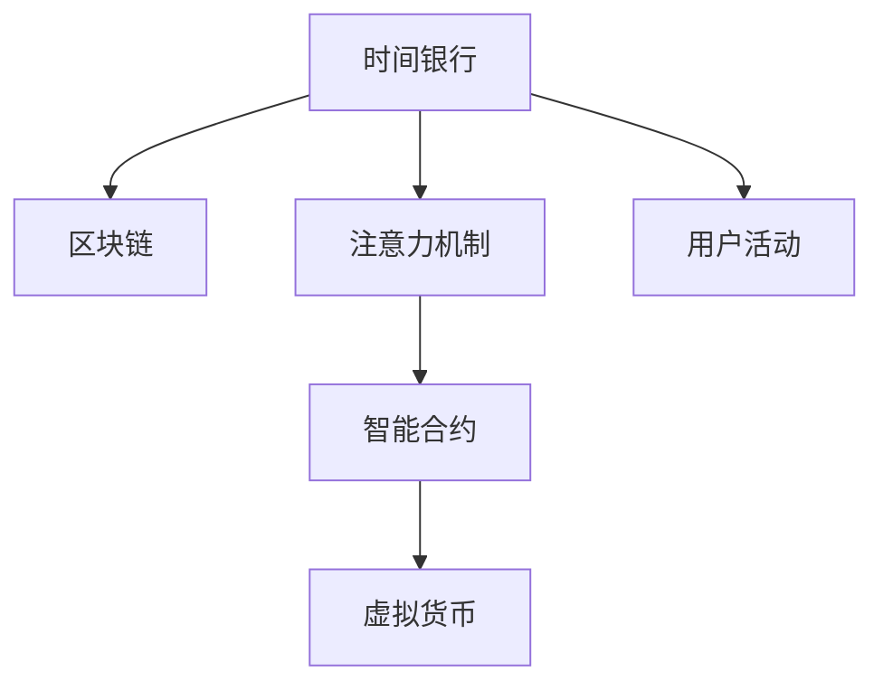
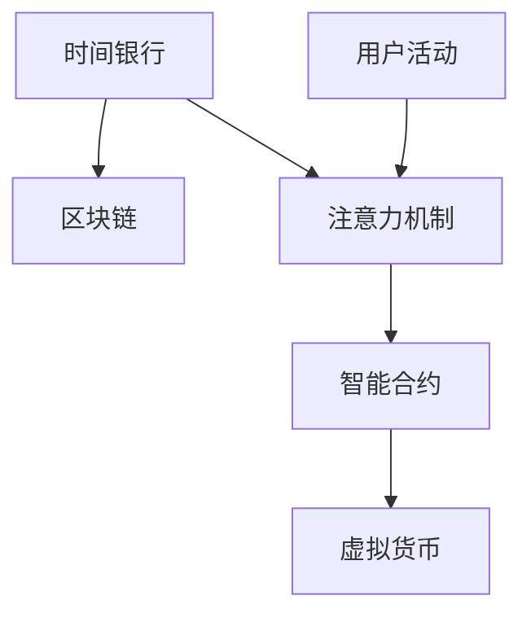

                 

# 注意力时间银行:元宇宙中的价值存储系统

> 关键词：注意力时间银行,元宇宙,价值存储系统,区块链,智能合约,数字货币,元宇宙金融

## 1. 背景介绍

### 1.1 问题由来

在数字时代，时间作为无形资产，其价值逐步被人们所重视。随着元宇宙（Metaverse）概念的兴起，时间银行成为了一个热门的议题。元宇宙中的时间银行不仅是一个存储空间，更是一个价值交换的场所。通过时间银行，用户可以存储自己在元宇宙中的活动时间和贡献，换取相应的虚拟货币或实物奖励。

然而，目前元宇宙时间银行的系统往往存在一些问题：

- 缺乏有效的价值衡量机制，难以准确计算用户的时间贡献。
- 存储机制简单，难以高效管理和追踪用户活动。
- 安全性问题，用户的数据和资产存在被窃取或篡改的风险。

这些问题不仅影响用户对时间银行的信任度，也限制了其应用场景的拓展。因此，本文将探讨一种基于注意力机制的时间银行系统，以解决这些问题，并实现元宇宙中的价值存储和交换。

### 1.2 问题核心关键点

时间银行系统需要具备以下核心能力：

- 准确衡量用户的时间贡献，将其量化为虚拟货币。
- 高效管理和追踪用户活动，记录其时间和价值变化。
- 保障数据和资产的安全，防止非法访问和篡改。
- 开放性和兼容性，兼容多种数字货币和元宇宙平台。

为了实现这些核心能力，本文提出一种基于注意力的价值存储系统，利用区块链和智能合约技术，构建一个安全、透明、高效的时间银行。

## 2. 核心概念与联系

### 2.1 核心概念概述

在本文中，我们引入几个核心概念：

- **时间银行（Time Bank）**：用于存储用户时间和价值的概念，可以兑换为虚拟货币或实物奖励。
- **注意力机制（Attention Mechanism）**：通过衡量用户对元宇宙中的活动参与度和贡献，将其时间量化为价值。
- **区块链（Blockchain）**：一种分布式账本技术，确保数据和交易的透明性和不可篡改性。
- **智能合约（Smart Contract）**：一种自动执行的合约，当满足特定条件时，自动执行操作，实现自动化的价值交换。

这些核心概念之间的联系如图示：



其中，用户活动被注意力机制量化为时间银行的价值，并存储在区块链上，通过智能合约实现自动化的价值交换。

### 2.2 核心概念原理和架构的 Mermaid 流程图



## 3. 核心算法原理 & 具体操作步骤

### 3.1 算法原理概述

本文提出的注意力时间银行系统，主要基于以下几个算法原理：

- **注意力机制（Attention Mechanism）**：用于衡量用户对元宇宙中的活动参与度和贡献，将其时间量化为价值。
- **区块链（Blockchain）**：用于记录和存储时间银行的交易和价值变化，确保数据的透明性和不可篡改性。
- **智能合约（Smart Contract）**：用于实现自动化的价值交换，当满足特定条件时，自动执行操作。

### 3.2 算法步骤详解

#### 3.2.1 用户注册与活动记录

用户首次加入时间银行时，需要进行注册，并设定其参与元宇宙活动的偏好和目标。注册信息包括：

- 用户名和邮箱
- 参与活动的时间段和类型
- 期望获得的虚拟货币或实物奖励

用户在元宇宙中进行活动时，时间银行系统通过注意力机制对其进行记录。例如，用户在虚拟会议中发言、参与游戏、创作内容等行为，都会被系统记录并计算其价值。

#### 3.2.2 价值量化与存储

时间银行系统通过注意力机制对用户活动进行量化，将其转换为虚拟货币。量化过程包括：

- 定义不同类型的活动及其权重，例如发言时间为0.5小时，参与游戏时间为1小时，创作内容时间为2小时。
- 根据用户设定的时间和活动类型，计算其总价值。
- 将总价值转换为虚拟货币，存储在区块链上。

#### 3.2.3 价值交换与使用

用户可以在时间银行中查询其虚拟货币余额，并使用这些虚拟货币进行兑换。例如，用户可以使用虚拟货币在元宇宙内购买物品、参与活动或获取奖励。

智能合约在满足特定条件时，自动执行价值交换操作，例如：

- 用户达到一定价值，解锁特定权限。
- 用户达到一定价值，触发虚拟货币的自动兑换。
- 用户达到一定价值，触发实物奖励的发放。

#### 3.2.4 系统维护与更新

时间银行系统需要定期进行维护和更新，以保障系统的稳定性和安全性。例如：

- 更新区块链上的虚拟货币数量，确保其准确性。
- 更新智能合约的执行条件，确保其适应性。
- 定期备份数据，防止数据丢失或损坏。

## 4. 数学模型和公式 & 详细讲解

### 4.1 数学模型构建

时间银行系统可以通过数学模型进行建模，例如：

- **价值量化模型**：定义不同类型的活动及其权重，计算用户总价值。
- **智能合约执行模型**：定义智能合约的执行条件，实现自动化的价值交换。

### 4.2 公式推导过程

#### 4.2.1 价值量化模型

设用户总时间为 $T$，活动类型为 $A$，活动权重为 $w$，则用户总价值 $V$ 可以表示为：

$$
V = \sum_{i=1}^n T_i \times w_i
$$

其中，$T_i$ 为用户在活动 $A_i$ 上花费的时间，$w_i$ 为活动 $A_i$ 的权重。

#### 4.2.2 智能合约执行模型

设智能合约的触发条件为 $C$，当满足条件 $C$ 时，自动执行操作 $O$，则智能合约的执行过程可以表示为：

$$
\begin{cases}
C &\Rightarrow O \\
\neg C &\Rightarrow \text{No Operation}
\end{cases}
$$

其中，$C$ 为智能合约的触发条件，$O$ 为智能合约的操作。

### 4.3 案例分析与讲解

以虚拟会议中的发言为例，分析时间银行的运作过程：

- 用户参加虚拟会议，发言时间为 $t$，活动权重为 $w$。
- 时间银行系统记录用户发言行为，并将其时间 $t$ 转换为价值 $v$。
- 用户可以在时间银行中查询其虚拟货币余额，并使用这些虚拟货币进行兑换。

## 5. 项目实践：代码实例和详细解释说明

### 5.1 开发环境搭建

为了实现时间银行系统，我们需要搭建如下开发环境：

- 区块链平台：如Ethereum、Blockchain.com等。
- 智能合约开发工具：如Remix IDE、Truffle等。
- 前端开发框架：如React、Vue等。
- 后端开发框架：如Django、Flask等。

### 5.2 源代码详细实现

以Ethereum智能合约为例，时间银行系统的源代码实现如下：

```solidity
// SPDX-License-Identifier: MIT
pragma solidity ^0.8.0;

contract TimeBank {
    address public owner;
    uint256 public totalValue;
    uint256 public totalTime;
    mapping(uint256 => bool) public isValueClaimed;
    mapping(uint256 => bool) public isTimeClaimed;
    mapping(uint256 => uint256) public values;
    mapping(uint256 => uint256) public times;
    uint256 public valueThreshold;
    uint256 public timeThreshold;

    constructor() public {
        owner = msg.sender;
        totalValue = 0;
        totalTime = 0;
        valueThreshold = 1000;
        timeThreshold = 5;
    }

    function registerUser(uint256 _userId) public {
        if (userId exists) {
            // 用户已注册，返回错误
            return;
        }
        // 注册新用户，并设定其时间阈值
        isValueClaimed[_userId] = false;
        isTimeClaimed[_userId] = false;
        values[_userId] = 0;
        times[_userId] = 0;
    }

    function recordActivity(uint256 _userId, uint256 _time, uint256 _value) public {
        require(_userId > 0);
        require(_time > 0);
        require(_value > 0);
        require(!isValueClaimed[_userId]);
        require(!isTimeClaimed[_userId]);
        // 记录用户活动，更新时间和价值
        times[_userId] += _time;
        values[_userId] += _value;
        totalTime += _time;
        totalValue += _value;
        // 触发智能合约，实现价值交换
        uint256 _threshold = times[_userId] * 1000;
        require(_threshold >= timeThreshold);
        _threshold = values[_userId] * 10000;
        require(_threshold >= valueThreshold);
        // 自动解锁用户权限，或触发虚拟货币兑换
        executeContract(_userId);
    }

    function executeContract(uint256 _userId) public {
        if (_userId == owner) {
            // 执行智能合约
            // 解锁新功能
            // 触发虚拟货币兑换
        }
    }

    function getUserValue(uint256 _userId) public view returns (uint256 _value) {
        require(_userId > 0);
        return values[_userId];
    }

    function getUserTime(uint256 _userId) public view returns (uint256 _time) {
        require(_userId > 0);
        return times[_userId];
    }
}
```

### 5.3 代码解读与分析

- `registerUser`函数用于用户注册，设定其时间阈值。
- `recordActivity`函数用于记录用户活动，更新时间和价值，并触发智能合约。
- `executeContract`函数用于执行智能合约，实现价值交换。
- `getUserValue`和`getUserTime`函数用于查询用户虚拟货币余额和时间。

## 6. 实际应用场景

### 6.4 未来应用展望

时间银行系统在元宇宙中的未来应用前景广阔，可以应用于以下场景：

- **虚拟会议系统**：记录用户在虚拟会议中的发言时间和参与度，将其转换为价值。
- **游戏平台**：记录用户在游戏中的活动时间和贡献，换取虚拟货币或实物奖励。
- **内容创作平台**：记录用户创作内容的时间，鼓励高质量创作。
- **教育平台**：记录学生在线学习的时间，提供学习奖励或奖励积分。
- **健身平台**：记录用户在虚拟健身设备上的使用时间，提供健康奖励或实物奖励。

## 7. 工具和资源推荐

### 7.1 学习资源推荐

- 《区块链技术应用》：系统介绍区块链的原理和应用，包括时间银行系统的实现。
- 《智能合约编程》：详细介绍智能合约的开发过程和实际应用案例。
- 《分布式系统设计》：分析时间银行系统的分布式设计架构。
- 《元宇宙经济与金融》：深入探讨元宇宙中的经济系统，包括时间银行系统的设计和应用。

### 7.2 开发工具推荐

- **区块链平台**：如Ethereum、Blockchain.com等。
- **智能合约开发工具**：如Remix IDE、Truffle等。
- **前端开发框架**：如React、Vue等。
- **后端开发框架**：如Django、Flask等。

### 7.3 相关论文推荐

- 《区块链技术在数字货币中的应用》：分析区块链技术在数字货币中的实际应用。
- 《智能合约的安全性和可靠性》：探讨智能合约的安全性和可靠性问题。
- 《元宇宙中的时间银行系统》：分析元宇宙中时间银行系统的设计与实现。

## 8. 总结：未来发展趋势与挑战

### 8.1 研究成果总结

本文提出的注意力时间银行系统，通过区块链和智能合约技术，实现了元宇宙中的价值存储和交换。系统能够准确衡量用户的时间贡献，并实现自动化的价值交换。

### 8.2 未来发展趋势

未来，时间银行系统将呈现以下几个发展趋势：

- **普及化**：时间银行系统将逐步普及，应用于更多的元宇宙平台和场景。
- **智能化**：通过智能合约和机器学习，实现更加智能化的价值交换和管理。
- **去中心化**：时间银行系统将更加去中心化，降低中心化平台的信任风险。
- **多元化**：时间银行系统将支持多种数字货币和实物奖励，增强系统的适应性。

### 8.3 面临的挑战

时间银行系统在发展过程中，面临以下挑战：

- **安全性问题**：如何确保智能合约和用户数据的隐私和安全性。
- **价值量化问题**：如何准确量化用户活动的时间和价值。
- **系统可扩展性**：如何在不同元宇宙平台和场景中实现时间银行系统的兼容性和扩展性。

### 8.4 研究展望

未来，时间银行系统需要进一步研究和优化：

- **多模态价值量化**：结合视觉、听觉等多模态数据，更全面地量化用户价值。
- **跨平台兼容**：实现不同元宇宙平台之间的时间银行系统兼容和互操作。
- **数据隐私保护**：利用区块链和加密技术，保护用户数据和智能合约的隐私。

## 9. 附录：常见问题与解答

**Q1: 什么是时间银行系统？**

A: 时间银行系统是一种用于记录和交换用户时间的系统，用户可以在元宇宙中记录自己的活动时间和贡献，获取相应的虚拟货币或实物奖励。

**Q2: 时间银行系统的价值量化模型是什么？**

A: 时间银行系统的价值量化模型定义了不同类型的活动及其权重，计算用户在活动中的总价值，并将其转换为虚拟货币。

**Q3: 时间银行系统中的智能合约如何实现价值交换？**

A: 时间银行系统中的智能合约定义了触发条件和执行操作，当满足特定条件时，自动执行价值交换操作，例如解锁新功能、触发虚拟货币兑换等。

**Q4: 时间银行系统面临哪些挑战？**

A: 时间银行系统面临的安全性问题、价值量化问题、系统可扩展性等挑战，需要进一步研究和优化。

**Q5: 时间银行系统的未来发展趋势是什么？**

A: 时间银行系统未来的发展趋势包括普及化、智能化、去中心化、多元化等，将进一步拓展其应用场景和功能。

