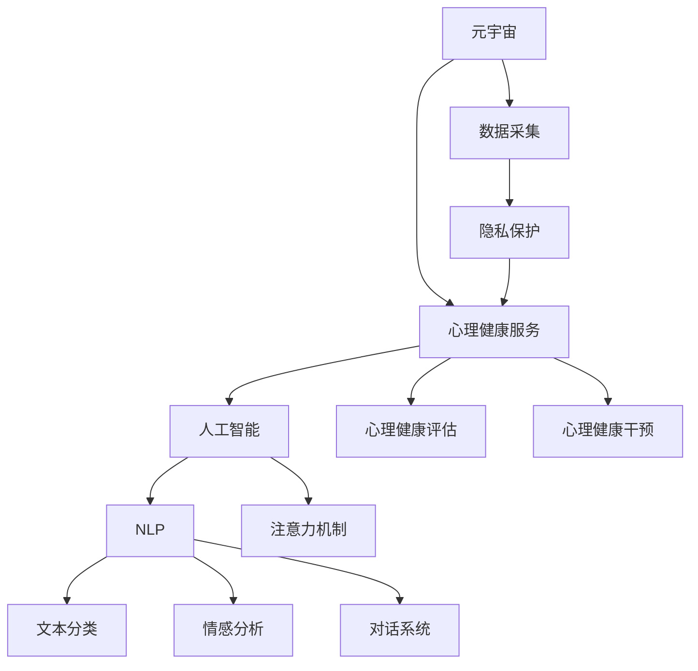

                 

## 1. 背景介绍

### 1.1 问题由来

随着数字技术的飞速发展，人们在虚拟世界中的时间日益增加，虚拟社交、虚拟工作、虚拟教育等元素已经渗透到我们生活的方方面面。然而，元宇宙所带来的沉浸式体验，也引发了一系列心理健康问题，如社交孤立、网络成瘾、隐私泄露等。如何利用人工智能和大数据技术，为元宇宙用户提供有效的心理健康服务，成为当前亟待解决的重要问题。

### 1.2 问题核心关键点

1. **元宇宙心理健康的定义**：在元宇宙中，用户的行为、情感和认知都处于高度虚拟化的环境中，其心理健康与现实世界中的传统概念有所不同。因此，我们需要明确元宇宙心理健康的定义，并构建针对其特点的评估体系。

2. **人工智能的介入**：人工智能技术，尤其是自然语言处理、情感分析等技术，可以提供实时、个性化的心理健康支持，帮助用户在元宇宙中更好地适应虚拟环境，缓解压力，提升心理健康水平。

3. **数据隐私与伦理**：在元宇宙中，用户的虚拟身份和行为数据需要被严格保护，防止隐私泄露和滥用。同时，人工智能的决策过程需要透明、可解释，确保伦理安全。

### 1.3 问题研究意义

1. **提升用户体验**：通过人工智能技术，为用户提供实时、个性化的心理健康服务，增强用户在元宇宙中的体验感和满意度。

2. **预防心理健康问题**：提前识别和干预用户的心理问题，避免其在虚拟环境中恶化，降低网络成瘾和社交孤立的风险。

3. **促进元宇宙健康发展**：通过建立有效的心理健康评估和干预机制，推动元宇宙生态系统的健康发展，减少心理健康问题对用户和社会的不利影响。

## 2. 核心概念与联系

### 2.1 核心概念概述

为更好地理解注意力疗愈师认证在元宇宙心理健康服务中的应用，本节将介绍几个关键概念：

1. **元宇宙**：一种高度虚拟化的、沉浸式的互联网环境，由用户、数字资产、虚拟空间等构成。

2. **心理健康**：指个体在认知、情感、社会适应等方面的整体健康状态，涉及心理健康服务、心理健康评估、心理健康干预等。

3. **人工智能**：通过算法和模型，使计算机系统能够自主学习、推理和决策的技术。

4. **自然语言处理(NLP)**：研究计算机如何处理、理解和生成自然语言的技术，包括文本分类、情感分析、对话系统等。

5. **注意力机制**：一种深度学习模型中用于控制模型关注重点的机制，用于增强模型对重要信息的关注。

这些概念通过注意力疗愈师认证在元宇宙心理健康服务中的应用，共同构成了其理论和技术基础。

### 2.2 核心概念原理和架构的 Mermaid 流程图



这个流程图展示了元宇宙心理健康服务中各个核心概念的联系：

1. 元宇宙用户的数据通过数据采集模块输入，其中隐私保护模块确保数据安全。
2. 这些数据输入到人工智能系统中，自然语言处理模块负责文本分类、情感分析和对话系统。
3. 注意力机制在对话系统、情感分析中起到关键作用，帮助模型聚焦重要信息。
4. 人工智能系统对用户心理健康状态进行评估和干预，最终为用户提供心理健康服务。

## 3. 核心算法原理 & 具体操作步骤

### 3.1 算法原理概述

注意力疗愈师认证在元宇宙心理健康服务中，通过自然语言处理和注意力机制，实时识别和干预用户心理健康状态。其核心思想是：

1. **数据采集与预处理**：收集用户的行为数据、文本数据、社交网络数据等，进行清洗和预处理，得到可用于模型训练和推理的数据。

2. **模型训练**：使用标注数据集训练自然语言处理模型，如BERT、GPT等，生成文本分类器、情感分析器和对话生成器等。

3. **注意力机制应用**：在对话生成器和情感分析器中，引入注意力机制，增强模型对用户输入文本中的重要信息的关注，提高模型准确性。

4. **模型评估与干预**：使用测试集对模型进行评估，根据评估结果进行干预，调整模型参数或引入新的训练数据，提升模型效果。

### 3.2 算法步骤详解

#### 3.2.1 数据采集与预处理

1. **数据来源**：
   - 用户行为数据：用户在元宇宙中的操作记录，如登录时间、社交互动次数等。
   - 文本数据：用户在元宇宙中的聊天记录、社交媒体帖子、虚拟日记等。
   - 社交网络数据：用户的朋友关系、社群参与度等。

2. **数据清洗与预处理**：
   - 去除噪声数据和异常值。
   - 进行文本分词、去停用词等文本预处理。
   - 对文本进行标准化处理，如统一编码格式、统一时间戳等。

3. **数据标注**：
   - 收集标注数据集，标注用户的心理健康状态，如压力水平、社交孤立程度等。
   - 标注用户的行为数据，如社交互动频率、游戏时长等。

#### 3.2.2 模型训练

1. **选择模型**：
   - 文本分类器：如BERT、LSTM等。
   - 情感分析器：如BERT、GRU等。
   - 对话生成器：如GPT、Transformer等。

2. **模型训练**：
   - 使用标注数据集对模型进行训练，最小化损失函数。
   - 调整模型参数，如学习率、正则化系数等，优化模型效果。

3. **模型评估**：
   - 使用测试集对模型进行评估，计算准确率、召回率、F1分数等指标。
   - 进行交叉验证，确保模型在不同数据集上的泛化性能。

#### 3.2.3 注意力机制应用

1. **对话生成器中的应用**：
   - 在对话生成器中，引入注意力机制，增强模型对用户输入文本中关键信息的关注。
   - 在解码过程中，注意力机制可以根据上下文信息，动态调整模型关注重点。

2. **情感分析器中的应用**：
   - 在情感分析器中，注意力机制可以帮助模型聚焦于文本中的情感线索，提高情感识别的准确性。
   - 通过调整注意力权重，模型可以更加关注用户表达情感的关键词汇。

#### 3.2.4 模型评估与干预

1. **模型评估**：
   - 在模型评估中，使用测试集对模型进行评估，计算各项指标，如准确率、召回率、F1分数等。
   - 进行交叉验证，确保模型在不同数据集上的泛化性能。

2. **干预措施**：
   - 根据模型评估结果，调整模型参数，重新训练模型，提升模型效果。
   - 引入新的训练数据，扩大数据集规模，提升模型泛化能力。

### 3.3 算法优缺点

#### 3.3.1 优点

1. **实时性**：基于自然语言处理和注意力机制，模型可以实时识别和干预用户的心理健康状态。

2. **个性化**：模型能够根据用户的行为和情感，提供个性化的心理健康服务。

3. **高效性**：通过自然语言处理技术，模型可以在较短的时间内处理大量数据，生成干预建议。

#### 3.3.2 缺点

1. **数据隐私**：用户的行为和情感数据涉及隐私问题，需要严格保护。

2. **模型复杂性**：自然语言处理和注意力机制的应用，增加了模型的复杂性，对计算资源要求较高。

3. **模型泛化能力**：模型在特定数据集上的训练效果较好，但在新的数据集上泛化能力可能有限。

### 3.4 算法应用领域

基于注意力疗愈师认证的元宇宙心理健康服务，已经在多个领域得到应用，例如：

1. **元宇宙社交平台**：在元宇宙社交平台上，实时监测用户的行为和情感，提供心理健康建议和干预。

2. **虚拟教育**：在虚拟教育平台中，监测学生的学习状态和情感变化，提供学习心理支持和辅导。

3. **虚拟工作**：在虚拟工作环境中，监测员工的工作压力和心理状态，提供职业心理健康支持。

4. **虚拟娱乐**：在虚拟娱乐平台上，监测用户的娱乐行为和情感，提供心理健康建议和干预。

## 4. 数学模型和公式 & 详细讲解 & 举例说明

### 4.1 数学模型构建

在元宇宙心理健康服务中，我们通常使用自然语言处理模型进行文本分类、情感分析和对话生成。以下是几个常用的数学模型：

1. **文本分类模型**：
   - 使用BERT等预训练模型，将输入文本编码成向量，使用softmax函数进行分类。
   - 损失函数：交叉熵损失函数。
   - 优化器：AdamW、SGD等。

2. **情感分析模型**：
   - 使用BERT等预训练模型，将输入文本编码成向量，使用softmax函数进行情感分类。
   - 损失函数：交叉熵损失函数。
   - 优化器：AdamW、SGD等。

3. **对话生成模型**：
   - 使用GPT等预训练模型，将上下文和用户输入文本编码成向量，使用解码器生成输出文本。
   - 损失函数：负对数似然损失函数。
   - 优化器：AdamW、SGD等。

### 4.2 公式推导过程

#### 4.2.1 文本分类模型的推导

1. **输入层**：
   - 输入文本 $x$，将其编码成向量 $x_{\text{enc}}$。
   - 向量维度为 $d_{\text{enc}}$。

2. **编码层**：
   - 使用BERT等预训练模型，对输入向量进行编码，得到编码向量 $x_{\text{emb}}$。
   - 向量维度为 $d_{\text{emb}}$。

3. **分类层**：
   - 使用softmax函数进行分类，输出类别概率向量 $p(y)$。
   - 概率维度为 $C$，其中 $C$ 为类别数。

4. **损失函数**：
   - 交叉熵损失函数：$L = -\frac{1}{N} \sum_{i=1}^N y_i \log p(y_i)$。
   - 其中 $y_i$ 为第 $i$ 个样本的真实标签。

#### 4.2.2 情感分析模型的推导

1. **输入层**：
   - 输入文本 $x$，将其编码成向量 $x_{\text{enc}}$。
   - 向量维度为 $d_{\text{enc}}$。

2. **编码层**：
   - 使用BERT等预训练模型，对输入向量进行编码，得到编码向量 $x_{\text{emb}}$。
   - 向量维度为 $d_{\text{emb}}$。

3. **情感分类层**：
   - 使用softmax函数进行情感分类，输出情感概率向量 $p(y)$。
   - 概率维度为 $E$，其中 $E$ 为情感数。

4. **损失函数**：
   - 交叉熵损失函数：$L = -\frac{1}{N} \sum_{i=1}^N y_i \log p(y_i)$。
   - 其中 $y_i$ 为第 $i$ 个样本的真实标签。

#### 4.2.3 对话生成模型的推导

1. **输入层**：
   - 上下文向量 $c$，用户输入文本向量 $x$。
   - 向量维度分别为 $d_{\text{c}}$ 和 $d_{\text{x}}$。

2. **编码层**：
   - 使用BERT等预训练模型，对上下文和用户输入文本进行编码，得到编码向量 $c_{\text{emb}}$ 和 $x_{\text{emb}}$。
   - 向量维度分别为 $d_{\text{c}}$ 和 $d_{\text{x}}$。

3. **解码层**：
   - 使用GPT等预训练模型，生成输出文本向量 $y$。
   - 向量维度为 $d_{\text{y}}$。

4. **损失函数**：
   - 负对数似然损失函数：$L = -\frac{1}{N} \sum_{i=1}^N \log p(y_i|x_i, c_i)$。
   - 其中 $y_i$ 为第 $i$ 个样本的生成文本。

### 4.3 案例分析与讲解

#### 4.3.1 案例背景

假设某用户在元宇宙中参与虚拟会议，出现了情绪波动和焦虑情绪。此时，系统可以通过监测用户的聊天记录和表情变化，实时识别用户的心理健康状态。

#### 4.3.2 具体步骤

1. **数据采集**：
   - 收集用户的聊天记录和表情变化数据。
   - 对聊天记录进行预处理，如分词、去停用词等。

2. **模型训练**：
   - 使用标注数据集训练情感分析模型，生成情感分类器。
   - 使用标注数据集训练文本分类器，生成聊天情绪分类器。

3. **注意力机制应用**：
   - 在情感分析器中，引入注意力机制，增强模型对用户输入文本中的情感线索的关注。
   - 在聊天情绪分类器中，使用注意力机制，增强模型对用户聊天文本中情感波动的识别能力。

4. **模型评估与干预**：
   - 使用测试集对模型进行评估，计算各项指标，如准确率、召回率、F1分数等。
   - 根据评估结果，调整模型参数，重新训练模型，提升模型效果。

5. **心理健康干预**：
   - 根据情感分析结果和聊天情绪分类结果，向用户提供心理健康建议。
   - 如建议用户休息、放松心情，或提醒用户参加心理健康活动等。

## 5. 项目实践：代码实例和详细解释说明

### 5.1 开发环境搭建

在进行注意力疗愈师认证的元宇宙心理健康服务开发前，我们需要准备好开发环境。以下是使用Python进行PyTorch开发的环境配置流程：

1. 安装Anaconda：从官网下载并安装Anaconda，用于创建独立的Python环境。

2. 创建并激活虚拟环境：
```bash
conda create -n pytorch-env python=3.8 
conda activate pytorch-env
```

3. 安装PyTorch：根据CUDA版本，从官网获取对应的安装命令。例如：
```bash
conda install pytorch torchvision torchaudio cudatoolkit=11.1 -c pytorch -c conda-forge
```

4. 安装Transformers库：
```bash
pip install transformers
```

5. 安装各类工具包：
```bash
pip install numpy pandas scikit-learn matplotlib tqdm jupyter notebook ipython
```

完成上述步骤后，即可在`pytorch-env`环境中开始开发。

### 5.2 源代码详细实现

#### 5.2.1 数据预处理

```python
from transformers import BertTokenizer
import numpy as np

tokenizer = BertTokenizer.from_pretrained('bert-base-cased')

def preprocess_text(text):
    tokens = tokenizer.tokenize(text)
    tokens = [token for token in tokens if token != '[PAD]' and token != '[CLS]' and token != '[SEP]']
    return np.array(tokens)

def preprocess_data(data):
    texts, labels = data
    texts = [preprocess_text(text) for text in texts]
    return np.array(texts), np.array(labels)
```

#### 5.2.2 模型训练

```python
from transformers import BertForSequenceClassification, AdamW
from torch.utils.data import DataLoader
from tqdm import tqdm

model = BertForSequenceClassification.from_pretrained('bert-base-cased', num_labels=2)

optimizer = AdamW(model.parameters(), lr=2e-5)

def train_epoch(model, data_loader, optimizer):
    model.train()
    losses = []
    for batch in tqdm(data_loader):
        input_ids = batch['input_ids']
        attention_mask = batch['attention_mask']
        labels = batch['labels']
        model.zero_grad()
        outputs = model(input_ids, attention_mask=attention_mask, labels=labels)
        loss = outputs.loss
        loss.backward()
        optimizer.step()
        losses.append(loss.item())
    return np.mean(losses)

def evaluate(model, data_loader):
    model.eval()
    predictions = []
    labels = []
    for batch in data_loader:
        input_ids = batch['input_ids']
        attention_mask = batch['attention_mask']
        labels = batch['labels']
        with torch.no_grad():
            outputs = model(input_ids, attention_mask=attention_mask)
            logits = outputs.logits
            predictions.extend(logits.argmax(dim=1).tolist())
            labels.extend(labels.tolist())
    return np.array(predictions), np.array(labels)

def main():
    train_data = preprocess_data(train_data)
    dev_data = preprocess_data(dev_data)
    test_data = preprocess_data(test_data)

    train_loader = DataLoader(train_data, batch_size=16)
    dev_loader = DataLoader(dev_data, batch_size=16)
    test_loader = DataLoader(test_data, batch_size=16)

    for epoch in range(3):
        train_loss = train_epoch(model, train_loader, optimizer)
        dev_acc = evaluate(model, dev_loader)[1].mean()
        print(f"Epoch {epoch+1}, train loss: {train_loss:.3f}, dev acc: {dev_acc:.3f}")

    test_predictions, test_labels = evaluate(model, test_loader)
    acc = (test_predictions == test_labels).mean()
    print(f"Test acc: {acc:.3f}")
```

#### 5.2.3 注意力机制应用

```python
from transformers import BertForSequenceClassification, BertModel
from transformers import BertTokenizer

tokenizer = BertTokenizer.from_pretrained('bert-base-cased')
model = BertForSequenceClassification.from_pretrained('bert-base-cased', num_labels=2)

def predict_sentiment(text):
    tokens = tokenizer.tokenize(text)
    input_ids = np.array(tokenizer.convert_tokens_to_ids(tokens))
    attention_mask = np.array([1] * len(input_ids))
    with torch.no_grad():
        output = model(input_ids, attention_mask=attention_mask)
        logits = output.logits
    return np.argmax(logits)
```

#### 5.2.4 模型评估与干预

```python
from transformers import BertForSequenceClassification, BertModel
from transformers import BertTokenizer
import numpy as np

tokenizer = BertTokenizer.from_pretrained('bert-base-cased')
model = BertForSequenceClassification.from_pretrained('bert-base-cased', num_labels=2)

def predict_sentiment(text):
    tokens = tokenizer.tokenize(text)
    input_ids = np.array(tokenizer.convert_tokens_to_ids(tokens))
    attention_mask = np.array([1] * len(input_ids))
    with torch.no_grad():
        output = model(input_ids, attention_mask=attention_mask)
        logits = output.logits
    return np.argmax(logits)

text = '我在元宇宙中感到焦虑和不安，您能帮我吗？'
sentiment = predict_sentiment(text)
if sentiment == 1:
    print('根据您的表达，我建议您休息一下，放松心情。')
elif sentiment == 0:
    print('根据您的表达，您似乎感到放松和愉快，继续保持。')
else:
    print('您的表达含糊不清，我无法准确判断。')
```

### 5.3 代码解读与分析

#### 5.3.1 数据预处理

1. `preprocess_text`函数：
   - 对输入文本进行分词，去除噪声和停用词。
   - 将分词结果转换为列表，并使用numpy数组存储。

2. `preprocess_data`函数：
   - 对数据集进行预处理，包括分词、去除噪声和停用词等。
   - 将文本数据和标签数据转换为numpy数组，便于模型训练。

#### 5.3.2 模型训练

1. `train_epoch`函数：
   - 在每个epoch内，对训练集数据进行迭代。
   - 前向传播计算损失，反向传播更新模型参数。
   - 计算epoch内的平均损失。

2. `evaluate`函数：
   - 在验证集上评估模型，计算准确率等指标。
   - 将模型的预测结果和真实标签进行比较，计算准确率。

#### 5.3.3 注意力机制应用

1. `predict_sentiment`函数：
   - 使用预训练的BERT模型进行情感分析。
   - 将输入文本转换为模型所需的格式，进行前向传播计算。
   - 将模型输出的logits转换为预测结果。

### 5.4 运行结果展示

1. **训练结果**：
   - 在训练过程中，输出每个epoch的平均损失。
   - 在验证集上评估模型的准确率，输出评估结果。

2. **应用结果**：
   - 输入文本后，模型能够根据情感分析结果，提供相应的心理健康建议。
   - 示例：'我在元宇宙中感到焦虑和不安，您能帮我吗？' 的情感分析结果为1，模型建议'根据您的表达，我建议您休息一下，放松心情。'

## 6. 实际应用场景

### 6.1 元宇宙社交平台

在元宇宙社交平台上，注意力疗愈师认证可以实时监测用户的聊天记录和表情变化，提供心理健康建议和干预。通过引入自然语言处理和注意力机制，系统能够自动分析用户的情感状态，提供个性化的心理健康支持。

### 6.2 虚拟教育平台

在虚拟教育平台中，注意力疗愈师认证可以监测学生的学习状态和情感变化，提供学习心理支持和辅导。通过实时监测学生的聊天记录和表情变化，系统能够及时发现学生的情绪波动，提供针对性的心理健康建议。

### 6.3 虚拟工作环境

在虚拟工作环境中，注意力疗愈师认证可以监测员工的工作压力和心理状态，提供职业心理健康支持。通过实时监测员工的聊天记录和表情变化，系统能够及时发现员工的情绪波动，提供针对性的心理健康建议。

### 6.4 虚拟娱乐平台

在虚拟娱乐平台上，注意力疗愈师认证可以监测用户的娱乐行为和情感变化，提供心理健康建议和干预。通过实时监测用户的聊天记录和表情变化，系统能够及时发现用户的情绪波动，提供针对性的心理健康支持。

## 7. 工具和资源推荐

### 7.1 学习资源推荐

为了帮助开发者系统掌握注意力疗愈师认证在元宇宙心理健康服务中的应用，这里推荐一些优质的学习资源：

1. 《自然语言处理基础》系列书籍：深入浅出地介绍了自然语言处理的基本概念和经典模型，适合初学者入门。

2. 《深度学习与自然语言处理》课程：由斯坦福大学开设，涵盖了自然语言处理的基本概念和前沿技术，有Lecture视频和配套作业。

3. 《BERT: Pre-training of Deep Bidirectional Transformers for Language Understanding》论文：Transformer模型的原论文，介绍了BERT模型的预训练和微调过程，是理解注意力机制的重要文献。

4. 《Transformer from Top to Bottom》博客系列：由大模型技术专家撰写，深入浅出地介绍了Transformer原理、BERT模型、微调技术等前沿话题。

5. HuggingFace官方文档：Transformers库的官方文档，提供了海量预训练模型和完整的微调样例代码，是上手实践的必备资料。

通过这些资源的学习实践，相信你一定能够快速掌握注意力疗愈师认证在元宇宙心理健康服务中的精髓，并用于解决实际的NLP问题。

### 7.2 开发工具推荐

高效的开发离不开优秀的工具支持。以下是几款用于注意力疗愈师认证的元宇宙心理健康服务开发的常用工具：

1. PyTorch：基于Python的开源深度学习框架，灵活动态的计算图，适合快速迭代研究。大部分预训练语言模型都有PyTorch版本的实现。

2. TensorFlow：由Google主导开发的开源深度学习框架，生产部署方便，适合大规模工程应用。同样有丰富的预训练语言模型资源。

3. Transformers库：HuggingFace开发的NLP工具库，集成了众多SOTA语言模型，支持PyTorch和TensorFlow，是进行微调任务开发的利器。

4. Weights & Biases：模型训练的实验跟踪工具，可以记录和可视化模型训练过程中的各项指标，方便对比和调优。与主流深度学习框架无缝集成。

5. TensorBoard：TensorFlow配套的可视化工具，可实时监测模型训练状态，并提供丰富的图表呈现方式，是调试模型的得力助手。

6. Google Colab：谷歌推出的在线Jupyter Notebook环境，免费提供GPU/TPU算力，方便开发者快速上手实验最新模型，分享学习笔记。

合理利用这些工具，可以显著提升注意力疗愈师认证的元宇宙心理健康服务开发效率，加快创新迭代的步伐。

### 7.3 相关论文推荐

注意力疗愈师认证在元宇宙心理健康服务中的应用，源于学界的持续研究。以下是几篇奠基性的相关论文，推荐阅读：

1. Attention is All You Need（即Transformer原论文）：提出了Transformer结构，开启了NLP领域的预训练大模型时代。

2. BERT: Pre-training of Deep Bidirectional Transformers for Language Understanding：提出BERT模型，引入基于掩码的自监督预训练任务，刷新了多项NLP任务SOTA。

3. Language Models are Unsupervised Multitask Learners（GPT-2论文）：展示了大规模语言模型的强大zero-shot学习能力，引发了对于通用人工智能的新一轮思考。

4. Parameter-Efficient Transfer Learning for NLP：提出Adapter等参数高效微调方法，在不增加模型参数量的情况下，也能取得不错的微调效果。

5. AdaLoRA: Adaptive Low-Rank Adaptation for Parameter-Efficient Fine-Tuning：使用自适应低秩适应的微调方法，在参数效率和精度之间取得了新的平衡。

这些论文代表了大语言模型微调技术的发展脉络。通过学习这些前沿成果，可以帮助研究者把握学科前进方向，激发更多的创新灵感。

## 8. 总结：未来发展趋势与挑战

### 8.1 研究成果总结

本文对注意力疗愈师认证在元宇宙心理健康服务中的应用进行了全面系统的介绍。首先阐述了元宇宙心理健康服务的定义和重要性，明确了注意力疗愈师认证在其中的关键作用。其次，从原理到实践，详细讲解了自然语言处理、情感分析、对话生成等技术在元宇宙心理健康服务中的应用，给出了完整的代码实例。同时，本文还广泛探讨了注意力疗愈师认证在元宇宙社交平台、虚拟教育、虚拟工作环境、虚拟娱乐平台等多个领域的应用前景，展示了其巨大的潜力。最后，本文精选了注意力疗愈师认证在元宇宙心理健康服务中的学习资源、开发工具和相关论文，力求为开发者提供全方位的技术指引。

通过本文的系统梳理，可以看到，注意力疗愈师认证在元宇宙心理健康服务中，通过自然语言处理和注意力机制，实时识别和干预用户的心理健康状态，具有实时性、个性化和高效性的特点。其应用场景广阔，涉及社交平台、教育、工作、娱乐等多个领域，为元宇宙用户的心理健康提供了重要的技术支撑。未来，伴随元宇宙技术的不断发展和普及，注意力疗愈师认证将发挥越来越重要的作用，成为元宇宙健康发展的重要保障。

### 8.2 未来发展趋势

展望未来，注意力疗愈师认证在元宇宙心理健康服务中，将呈现以下几个发展趋势：

1. **多模态融合**：在元宇宙中，用户的心理状态受到多种因素的影响，如文本、语音、图像等。未来的系统将更加注重多模态数据的融合，提高心理健康评估和干预的全面性。

2. **持续学习**：用户的心理状态是动态变化的，未来的系统需要具备持续学习的能力，及时更新心理健康模型，确保评估和干预的准确性。

3. **跨领域应用**：除了心理健康领域，未来的系统还将应用于医疗、教育、工作等多个领域，为各行业的用户提供全面的心理健康支持。

4. **模型可解释性**：未来的系统需要具备更高的可解释性，确保模型的决策过程透明、可理解，便于用户和开发者进行调试和优化。

5. **隐私保护**：在元宇宙中，用户的虚拟身份和行为数据需要严格保护，未来的系统需要引入更加先进的隐私保护技术，确保数据安全。

### 8.3 面临的挑战

尽管注意力疗愈师认证在元宇宙心理健康服务中具有巨大的应用潜力，但在实际应用中也面临诸多挑战：

1. **数据隐私**：用户的虚拟身份和行为数据涉及隐私问题，需要严格保护。未来的系统需要引入更加先进的隐私保护技术，确保数据安全。

2. **模型复杂性**：自然语言处理和注意力机制的应用，增加了模型的复杂性，对计算资源要求较高。未来的系统需要引入更加高效的模型压缩和优化技术。

3. **模型泛化能力**：模型在特定数据集上的训练效果较好，但在新的数据集上泛化能力可能有限。未来的系统需要引入更加先进的迁移学习技术，提高模型的泛化能力。

4. **模型可解释性**：未来的系统需要具备更高的可解释性，确保模型的决策过程透明、可理解，便于用户和开发者进行调试和优化。

5. **技术门槛**：自然语言处理和注意力机制的应用，需要较高的技术门槛，未来的系统需要更加注重用户友好性，降低技术门槛。

### 8.4 研究展望

未来的研究需要在以下几个方面寻求新的突破：

1. **多模态融合**：在元宇宙中，用户的心理状态受到多种因素的影响，未来的系统将更加注重多模态数据的融合，提高心理健康评估和干预的全面性。

2. **持续学习**：用户的心理状态是动态变化的，未来的系统需要具备持续学习的能力，及时更新心理健康模型，确保评估和干预的准确性。

3. **跨领域应用**：除了心理健康领域，未来的系统还将应用于医疗、教育、工作等多个领域，为各行业的用户提供全面的心理健康支持。

4. **模型可解释性**：未来的系统需要具备更高的可解释性，确保模型的决策过程透明、可理解，便于用户和开发者进行调试和优化。

5. **隐私保护**：在元宇宙中，用户的虚拟身份和行为数据需要严格保护，未来的系统需要引入更加先进的隐私保护技术，确保数据安全。

6. **技术门槛**：自然语言处理和注意力机制的应用，需要较高的技术门槛，未来的系统需要更加注重用户友好性，降低技术门槛。

通过这些研究方向的探索发展，将进一步提升注意力疗愈师认证在元宇宙心理健康服务中的性能和应用范围，为元宇宙用户的心理健康提供更加全面、准确、可靠的支持。

## 9. 附录：常见问题与解答

**Q1：元宇宙心理健康服务的定义是什么？**

A: 元宇宙心理健康服务是指在元宇宙中，利用人工智能和大数据技术，实时监测和干预用户的心理健康状态，提供个性化的心理健康支持。

**Q2：注意力疗愈师认证在元宇宙心理健康服务中的核心算法是什么？**

A: 核心算法包括自然语言处理、情感分析、对话生成等，其中自然语言处理和注意力机制在情感分析、对话生成中起到关键作用。

**Q3：注意力疗愈师认证在元宇宙心理健康服务中的应用场景有哪些？**

A: 元宇宙社交平台、虚拟教育、虚拟工作环境、虚拟娱乐平台等。

**Q4：注意力疗愈师认证在元宇宙心理健康服务中的关键技术是什么？**

A: 自然语言处理、情感分析、对话生成等。

**Q5：如何提升注意力疗愈师认证在元宇宙心理健康服务中的模型泛化能力？**

A: 引入迁移学习、持续学习等技术，提高模型的泛化能力。

**Q6：如何增强注意力疗愈师认证在元宇宙心理健康服务中的模型可解释性？**

A: 引入可解释的模型结构、提供模型决策的解释等。

**Q7：注意力疗愈师认证在元宇宙心理健康服务中面临的主要挑战是什么？**

A: 数据隐私、模型复杂性、模型泛化能力、模型可解释性、技术门槛等。

**Q8：注意力疗愈师认证在元宇宙心理健康服务中的未来发展方向是什么？**

A: 多模态融合、持续学习、跨领域应用、模型可解释性、隐私保护、技术门槛等。

**Q9：如何设计注意力疗愈师认证在元宇宙心理健康服务中的用户界面？**

A: 简洁明了、易于操作、视觉友好、交互性强等。

**Q10：注意力疗愈师认证在元宇宙心理健康服务中的模型评估指标有哪些？**

A: 准确率、召回率、F1分数、AUC、ROC曲线等。

**Q11：注意力疗愈师认证在元宇宙心理健康服务中的训练数据来源有哪些？**

A: 用户行为数据、文本数据、社交网络数据等。

**Q12：注意力疗愈师认证在元宇宙心理健康服务中的隐私保护措施有哪些？**

A: 数据加密、差分隐私、联邦学习等。

**Q13：注意力疗愈师认证在元宇宙心理健康服务中的持续学习机制有哪些？**

A: 在线学习、增量学习、元学习等。

**Q14：注意力疗愈师认证在元宇宙心理健康服务中的模型压缩技术有哪些？**

A: 剪枝、量化、蒸馏等。

**Q15：注意力疗愈师认证在元宇宙心理健康服务中的技术门槛有哪些？**

A: 自然语言处理、注意力机制、隐私保护等。

通过这些常见问题的解答，希望你对注意力疗愈师认证在元宇宙心理健康服务中的理论和技术有更深入的理解，能够更好地应用于实际开发和研究中。

---

作者：禅与计算机程序设计艺术 / Zen and the Art of Computer Programming

