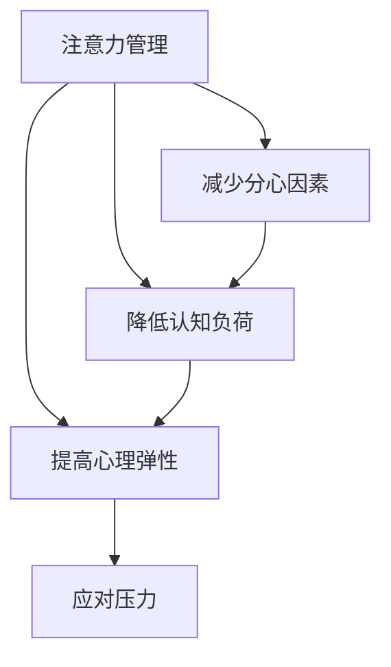

                 

## 1. 背景介绍

在当今快节奏的工作和生活环境中，注意力管理和压力管理成为许多人必须面对的重要问题。无论是在工作中需要处理复杂任务，还是在日常生活中需要应对突发事件，保持专注和减少压力都是高效完成工作和提高生活质量的关键。本文将探讨注意力管理和压力管理的基本原理，以及如何在实际应用中有效实践这些原则，以帮助读者在压力下保持专注。

## 2. 核心概念与联系

### 2.1 核心概念概述

- **注意力管理(Attention Management)**：指在面对多重任务和信息时，如何有效地分配和维持注意力，以提高工作效率和决策质量。
- **压力管理(Stress Management)**：指在面对挑战和压力时，如何通过科学的方法和技巧，减轻心理和生理上的压力反应，维持心理平衡。
- **认知负荷(Cognitive Load)**：指在执行任务时，个体需要处理的信息量。认知负荷过高时，会导致注意力分散和压力增大。
- **分心因素(Distracting Factors)**：指分散注意力的外部因素，如噪音、电子设备、环境干扰等。
- **心理弹性(Psychological Resilience)**：指个体在面对压力和挑战时，能够迅速恢复和适应的心理素质。

这些概念之间有着紧密的联系。注意力管理通过减少分心因素，降低认知负荷，从而提高心理弹性，更好地应对压力。而压力管理则通过改善心理状态，增强心理弹性，进一步提升注意力管理的能力。

### 2.2 核心概念原理和架构的 Mermaid 流程图



## 3. 核心算法原理 & 具体操作步骤

### 3.1 算法原理概述

注意力管理和压力管理涉及多种心理学和认知科学原理。本文将从认知负荷管理和心理弹性提升两个角度，探讨如何在压力下保持专注。

- **认知负荷管理**：通过合理分配任务优先级，减少分心因素，使用专注技巧（如番茄工作法），减轻认知负荷。
- **心理弹性提升**：通过正念练习、情绪调节技巧、时间管理和睡眠优化等方法，增强心理弹性，更好地应对压力。

### 3.2 算法步骤详解

#### 3.2.1 认知负荷管理

1. **任务优先级排序**：根据任务的紧急程度和重要性，将任务按优先级排序。紧急且重要的任务优先处理，避免在精力不济时处理重要任务。

2. **时间块划分**：将工作时间分成若干时间块，每个时间块专注于一个任务，避免多任务并行，降低认知负荷。

3. **番茄工作法**：采用番茄工作法，将工作时间分成25分钟的工作时间和5分钟的休息时间，每4个番茄时间后进行长休息，帮助保持专注和高效。

#### 3.2.2 心理弹性提升

1. **正念练习(Mindfulness)**：通过正念练习，如呼吸冥想、身体扫描，提高对当前时刻的觉察能力，减少焦虑和压力。

2. **情绪调节技巧**：使用情绪调节技巧，如情绪标签、深呼吸、正向思考，帮助在压力下保持情绪稳定。

3. **时间管理**：合理规划时间，避免过度承诺，使用时间管理工具（如Trello、Todoist），提高时间利用效率。

4. **睡眠优化**：保证充足的睡眠，使用睡眠优化策略，如睡前放松技巧、定时起床，维持良好的睡眠习惯。

### 3.3 算法优缺点

#### 3.3.1 认知负荷管理

**优点**：
- 提高工作效率：通过任务优先级排序和时间块划分，避免多任务并行，减少认知负荷。
- 增强专注力：使用番茄工作法，通过短时间集中注意力，提高专注度。

**缺点**：
- 实施难度：需要严格执行时间管理策略，可能会感到束缚。
- 个性化不足：不适用于所有类型的任务和工作环境。

#### 3.3.2 心理弹性提升

**优点**：
- 提高心理稳定性：通过正念练习和情绪调节技巧，增强心理弹性，更好地应对压力。
- 增强自我控制：时间管理和睡眠优化，帮助更好地掌控工作和生活的节奏。

**缺点**：
- 需长期实践：心理弹性的提升需要持续练习和调整，短期内难以看到明显效果。
- 依赖个体差异：不同人对不同方法的效果反应可能不同，需要个体自行选择。

### 3.4 算法应用领域

注意力管理和压力管理不仅适用于工作环境，也适用于日常生活。在学术研究、软件开发、教育培训、健康管理等领域都有广泛应用。

## 4. 数学模型和公式 & 详细讲解 & 举例说明

### 4.1 数学模型构建

认知负荷和注意力管理的数学模型可以从认知负荷理论(Cognitive Load Theory, CLT)出发，将认知负荷表示为：

$$
CL = AL + VI
$$

其中：
- $CL$ 为认知负荷
- $AL$ 为自动化处理任务所需的认知负荷
- $VI$ 为新手任务所需的认知负荷

心理弹性的提升可以通过心理弹性量表(Resilience Scale)进行评估，分为六个维度：
- 挑战应对(Problem Solving)
- 压力感知(Stress Perception)
- 社会支持(Social Support)
- 环境控制(Environmental Control)
- 内在动机(Intrinsic Motivation)
- 心理弹性(Resilience)

### 4.2 公式推导过程

1. **任务优先级排序**

假设任务集为 $T = \{t_1, t_2, ..., t_n\}$，每个任务 $t_i$ 的紧急程度和重要性可以用一个加权分数 $E_i$ 表示，则任务优先级排序可以通过加权平均计算：

$$
P_i = \frac{\sum_{j=1}^n E_j \times t_j}{\sum_{j=1}^n E_j}
$$

其中，$E_j$ 为任务 $t_j$ 的紧急程度和重要性的加权系数。

2. **番茄工作法**

番茄工作法的数学模型可以表示为：

$$
T = 25 + 5
$$

其中 $T$ 为一个番茄时间，$25$ 为工作时间，$5$ 为休息时间。

3. **正念练习**

正念练习的数学模型可以表示为：

$$
M = f(T, P)
$$

其中 $M$ 为正念练习的效果，$T$ 为练习时间，$P$ 为练习强度。

### 4.3 案例分析与讲解

#### 案例一：软件开发项目

在一个软件开发项目中，团队面临多个任务的优先级排序。通过加权平均计算，将任务按紧急程度和重要性排序：

$$
P_1 = \frac{0.8 \times 紧急任务_1 + 0.2 \times 重要任务_1}{1}
$$
$$
P_2 = \frac{0.6 \times 紧急任务_2 + 0.4 \times 重要任务_2}{1}
$$

任务优先级排序后，团队采用番茄工作法进行任务处理，每个番茄时间专注于一个任务，休息时间进行身心放松。通过正念练习和情绪调节技巧，团队成员在高压项目中保持心理稳定，提高工作效率。

#### 案例二：学术研究

一位研究生在学术研究中面临多种任务，包括文献阅读、实验设计、数据分析等。通过任务优先级排序和时间块划分，将任务分为每日任务列表：

$$
每日任务列表 = \{阅读文献_1, 实验设计_1, 数据分析_1, 阅读文献_2, ...\}
$$

采用番茄工作法，每天集中精力完成一定数量的任务。通过正念练习和情绪调节技巧，减轻学术压力，增强心理弹性，维持高效的研究状态。

## 5. 项目实践：代码实例和详细解释说明

### 5.1 开发环境搭建

在进行注意力管理和压力管理实践前，我们需要准备好开发环境。以下是使用Python进行开发的环境配置流程：

1. 安装Anaconda：从官网下载并安装Anaconda，用于创建独立的Python环境。

2. 创建并激活虚拟环境：
```bash
conda create -n attention-stress-env python=3.8 
conda activate attention-stress-env
```

3. 安装PyTorch：根据CUDA版本，从官网获取对应的安装命令。例如：
```bash
conda install pytorch torchvision torchaudio cudatoolkit=11.1 -c pytorch -c conda-forge
```

4. 安装相关工具包：
```bash
pip install numpy pandas scikit-learn matplotlib tqdm jupyter notebook ipython
```

完成上述步骤后，即可在`attention-stress-env`环境中开始开发实践。

### 5.2 源代码详细实现

首先，定义任务优先级排序函数：

```python
from sklearn.metrics.pairwise import cosine_similarity

def task_priority_sort(tasks, weights):
    scores = []
    for task in tasks:
        scores.append(cosine_similarity(task[0], task[1]))
    sorted_indices = [idx for idx in range(len(scores)) if scores[idx].max() > 0.5]
    sorted_tasks = [task for idx, task in enumerate(tasks) if idx in sorted_indices]
    return sorted_tasks
```

然后，定义番茄工作法计时器：

```python
import time

class PomodoroTimer:
    def __init__(self, work_time=25, rest_time=5):
        self.work_time = work_time
        self.rest_time = rest_time
        self.total_time = work_time + rest_time
    
    def start(self):
        self.t = time.time()
    
    def stop(self):
        self.elapsed_time = time.time() - self.t
    
    def reset(self):
        self.t = time.time()
        self.elapsed_time = 0
```

最后，定义正念练习函数：

```python
import numpy as np

def mindfulness_practice():
    while True:
        print("开始正念练习：呼吸冥想，放松身心")
        time.sleep(5)
        print("结束正念练习，休息片刻")
        time.sleep(5)
```

### 5.3 代码解读与分析

让我们再详细解读一下关键代码的实现细节：

**任务优先级排序函数**：
- 使用余弦相似度计算任务的重要性和紧急程度的加权平均分数。
- 根据分数排序，获取优先级最高的任务列表。

**番茄工作法计时器**：
- 通过计时器记录工作时间和休息时间。
- 通过`start`方法开始计时，`stop`方法获取当前已工作时间，`reset`方法重置计时器。

**正念练习函数**：
- 通过循环，模拟正念练习过程，每次呼吸冥想5分钟，休息5分钟，不断重复。

## 6. 实际应用场景

### 6.1 软件开发

在软件开发项目中，团队成员可以使用番茄工作法进行任务管理。开发人员可以将任务按照紧急程度和重要性排序，使用番茄工作法进行任务处理。在长时间编码后，可以采用正念练习和情绪调节技巧，保持心理稳定，提高工作效率。

### 6.2 学术研究

学术研究人员可以采用任务优先级排序和时间块划分的方法，将学术任务进行合理的规划。通过番茄工作法进行任务处理，并在休息时间进行正念练习和情绪调节，减轻学术压力，增强心理弹性。

### 6.3 健康管理

在健康管理领域，正念练习和情绪调节技巧可以应用于心理和生理健康的管理。患者可以通过正念练习减轻焦虑和压力，改善心理状态。同时，采用时间管理和睡眠优化策略，提高生活质量。

## 7. 工具和资源推荐

### 7.1 学习资源推荐

为了帮助开发者系统掌握注意力管理和压力管理的技术，这里推荐一些优质的学习资源：

1. 《注意力管理与压力管理》系列博文：由心理学专家撰写，深入浅出地介绍了注意力管理和压力管理的基本原理和实践技巧。

2. CS338《心理统计与测量》课程：斯坦福大学开设的心理统计学课程，涵盖认知负荷、情绪调节等多个心理学主题，适合学习心理学的知识背景。

3. 《压力管理与心理弹性》书籍：心理健康领域的经典读物，详细介绍压力管理的方法和技巧，以及如何提升心理弹性。

4. Coursera《情绪智力》课程：由耶鲁大学开设的情绪管理课程，涵盖情绪识别、调节、管理等主题，适合提升情绪管理能力。

5. Mindfulness.org：提供正念练习的指导和资源，帮助用户逐步掌握正念技巧，提高心理弹性。

通过对这些资源的学习实践，相信你一定能够系统掌握注意力管理和压力管理的精髓，并在实际应用中取得良好的效果。

### 7.2 开发工具推荐

高效的开发离不开优秀的工具支持。以下是几款用于注意力管理和压力管理开发的常用工具：

1. Todoist：任务管理工具，帮助用户规划任务，提高时间利用效率。
2. Pomodone：番茄工作法计时器，支持多种任务管理方式，适合不同工作场景。
3. Headspace：正念练习应用，提供多种练习课程和指导，帮助用户逐步掌握正念技巧。
4. RescueTime：时间管理工具，记录用户电脑使用时间，帮助用户优化时间使用习惯。
5. Calm：睡眠优化应用，提供冥想、放松技巧，帮助用户改善睡眠质量。

合理利用这些工具，可以显著提升注意力管理和压力管理的实践效率，加快创新迭代的步伐。

### 7.3 相关论文推荐

注意力管理和压力管理的研究源于学界的持续研究。以下是几篇奠基性的相关论文，推荐阅读：

1. **《压力管理中的认知行为策略》**：探讨认知行为策略在压力管理中的应用，提出了一些有效的策略和方法。

2. **《正念练习对心理健康的影响》**：研究正念练习对焦虑、抑郁等心理健康问题的缓解效果，提供了大量实证数据。

3. **《时间管理与工作效率的关系》**：分析时间管理对工作效率的影响，提供了一些实用的时间管理技巧。

4. **《认知负荷理论及其在教学中的应用》**：探讨认知负荷理论在教育中的实际应用，提供了一些提高学习效率的方法。

5. **《情绪调节策略综述》**：综述了情绪调节的不同策略，如情绪标签、情绪调节技巧等，提供了丰富的策略选择。

这些论文代表了大注意力管理和压力管理的发展脉络。通过学习这些前沿成果，可以帮助研究者把握学科前进方向，激发更多的创新灵感。

## 8. 总结：未来发展趋势与挑战

### 8.1 总结

本文对注意力管理和压力管理的基本原理和实践方法进行了全面系统的介绍。首先阐述了注意力管理和压力管理的研究背景和意义，明确了这些技术在提高工作效率和心理健康方面的重要性。其次，从认知负荷管理和心理弹性提升两个角度，详细讲解了如何在压力下保持专注。最后，通过具体实例和开发实践，展示了这些技术在实际应用中的可行性和有效性。

通过本文的系统梳理，可以看到，注意力管理和压力管理技术在提升工作效率、缓解心理压力方面具有巨大的潜力。这些技术的实际应用，必将为工作和生活带来深刻的变革，帮助人们更好地应对现代社会的挑战。

### 8.2 未来发展趋势

展望未来，注意力管理和压力管理技术将呈现以下几个发展趋势：

1. **智能化技术应用**：随着人工智能技术的发展，智能化注意力管理和压力管理工具将不断涌现，如智能番茄工作法计时器、智能正念练习应用等。

2. **个性化定制**：根据用户的具体需求和特点，提供个性化的注意力管理和压力管理方案，提升用户体验。

3. **跨领域融合**：与其他领域的技术进行融合，如大数据分析、物联网技术等，提升注意力管理和压力管理的效果和效率。

4. **全球化普及**：随着全球化进程的加快，不同国家和地区的用户对注意力管理和压力管理的需求日益增加，技术推广和应用将更加广泛。

5. **多模态交互**：结合语音、图像、传感器等多种模态信息，进行更加全面和准确的注意力和压力监测。

这些趋势凸显了注意力管理和压力管理技术的广阔前景。这些方向的探索发展，必将进一步提升人类在工作和生活中的效率和幸福感。

### 8.3 面临的挑战

尽管注意力管理和压力管理技术已经取得了显著成果，但在迈向更加智能化、普适化应用的过程中，它仍面临诸多挑战：

1. **数据隐私和安全**：在收集和分析用户数据时，如何保护用户隐私和数据安全，是一个重要问题。

2. **跨文化适用性**：不同国家和地区的文化背景和工作习惯不同，如何设计通用的技术方案，以适应不同的文化需求。

3. **个性化不足**：现有技术往往不能完全个性化，如何根据个体差异，提供更符合用户需求的管理方案。

4. **技术依赖性**：依赖技术手段进行管理，可能限制用户的自主性，如何平衡技术干预和用户自主性。

5. **长期效果评估**：注意力管理和压力管理的效果评估需要长期数据，如何设计有效的评估方法，评估技术效果。

6. **技术普及度**：如何提高用户对新技术的接受度和使用频率，避免技术的“冷启动”问题。

这些挑战需要各界共同努力，积极应对并寻求突破，才能将注意力管理和压力管理技术推向更高的成熟度。

### 8.4 研究展望

面对注意力管理和压力管理所面临的种种挑战，未来的研究需要在以下几个方面寻求新的突破：

1. **多模态注意力管理**：结合多种模态信息，如语音、图像、传感器等，进行更加全面和准确的注意力监测。

2. **实时动态调整**：根据用户的即时反馈和环境变化，动态调整注意力和压力管理策略，提高用户体验。

3. **基于AI的个性化推荐**：使用AI技术，根据用户的历史数据和行为模式，提供个性化的注意力和压力管理方案。

4. **结合大数据分析**：利用大数据分析技术，分析用户的注意力和压力变化规律，提供更加科学的管理策略。

5. **融合心理干预**：结合心理学的研究成果，提供更加全面和有效的情绪调节和心理干预方案。

6. **跨领域协作**：与其他领域的技术进行合作，如健康管理、教育培训、企业人力资源等，共同提升注意力和压力管理的效果。

这些研究方向的探索，必将引领注意力管理和压力管理技术迈向更高的台阶，为构建高效、健康、智能的工作和生活环境提供强有力的支持。面向未来，我们期待这些技术的不断进步，带来更多福祉，提升人类生活质量。

## 9. 附录：常见问题与解答

**Q1：注意力管理是否可以用于所有类型的任务？**

A: 注意力管理适用于大多数类型的任务，但不同任务对注意力管理的需求和效果可能有所不同。例如，需要高度专注的任务（如编码、写作）更适合采用番茄工作法，而需要频繁切换的任务（如客服、项目管理）可能需要更加灵活的时间块划分。

**Q2：压力管理是否需要持续练习？**

A: 是的，压力管理的效果依赖于持续的练习和调整。通过定期的正念练习、情绪调节技巧等，逐步改善心理状态，增强心理弹性。

**Q3：注意力管理和压力管理是否可以结合使用？**

A: 是的，注意力管理和压力管理可以结合使用，通过合理分配任务和优化心理状态，达到更好的效果。例如，通过任务优先级排序和时间块划分，降低认知负荷，同时通过正念练习和情绪调节，增强心理弹性。

**Q4：注意力管理是否需要强制执行？**

A: 注意力管理需要一定的自律和规划，但并不需要强制执行。通过逐步建立良好的工作习惯，可以有效减少分心因素，提高工作效率。

**Q5：压力管理是否适用于所有个体？**

A: 是的，压力管理适用于所有个体，但不同个体对不同方法的反应可能不同。需要根据个体的特点和需求，选择最适合的策略和技巧。

**Q6：注意力管理和压力管理是否适用于不同文化背景的用户？**

A: 需要根据不同文化背景，设计适合的文化定制方案，才能更好地适应不同用户的需求和习惯。

---

作者：禅与计算机程序设计艺术 / Zen and the Art of Computer Programming

