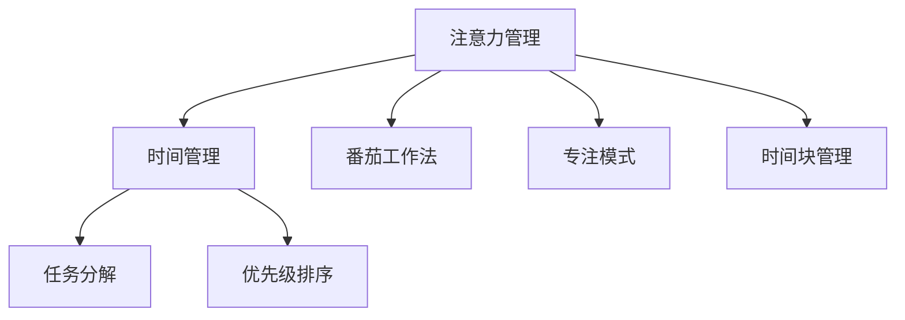

                 

# 注意力管理与时间管理策略：通过时间管理增强专注力和效率

> 关键词：注意力管理,时间管理,专注力,效率,策略

## 1. 背景介绍

### 1.1 问题由来
在当今信息爆炸的时代，人们的注意力资源面临着前所未有的分散和挑战。无论是工作学习还是日常生活中的各种任务，都需要高效管理时间和注意力，才能保证任务高质量的完成。同时，现代社会的快节奏和高压力，也对人们的专注力和工作效率提出了更高的要求。

注意力管理与时间管理作为解决这些问题的关键策略，已经成为提高生产力和提升生活质量的重要工具。本文将深入探讨注意力管理与时间管理策略的原理和应用，并通过实际案例帮助读者更好地实践这些策略，从而实现专注力和效率的提升。

### 1.2 问题核心关键点
本文的核心问题是如何通过科学的时间管理策略，有效提升个人或团队的工作效率和专注力。具体关键点包括：

- 如何通过时间管理规划任务优先级，优化时间利用效率。
- 如何通过注意力管理提升专注力，减少分心行为，提高工作质量。
- 如何在快节奏和高压环境中，保持高效的工作节奏。
- 如何将注意力管理与时间管理策略融合，实现整体效能的最大化。

## 2. 核心概念与联系

### 2.1 核心概念概述

为了更好地理解注意力管理与时间管理策略的原理和应用，我们先介绍几个核心概念：

- **注意力管理**：是指通过一系列方法提升个人或团队在执行任务时的集中度，减少分心行为，从而提升工作质量。常见的注意力管理策略包括番茄工作法、专注模式、时间块管理等。

- **时间管理**：是指通过合理安排时间，确保任务按时完成，优化时间利用效率。常见的时间管理方法包括任务分解、优先级排序、番茄工作法、时间块管理等。

- **番茄工作法**：将工作时间分为若干个25分钟的工作段，每段之间休息5分钟，以提高工作专注力和效率。

- **专注模式**：通过创建无干扰的环境和设定特定时间段，专注于当前任务，提升专注力和任务完成度。

- **时间块管理**：将一天的时间划分为若干个时间块，每个时间块专注于特定任务，避免多任务并行导致的注意力分散。

这些概念之间的逻辑关系可以通过以下Mermaid流程图来展示：



这个流程图展示了大语言模型的核心概念及其之间的关系：

1. 注意力管理通过提升专注力，增强任务执行效果。
2. 时间管理通过合理安排时间，优化任务完成效率。
3. 番茄工作法、专注模式和时间块管理都是注意力和时间管理策略的具体实施方式。
4. 任务分解和优先级排序则是时间管理中任务规划的常用方法。

这些概念共同构成了时间管理与注意力管理的框架，通过合理运用这些策略，可以显著提升个人或团队的工作效率和专注力。

## 3. 核心算法原理 & 具体操作步骤
### 3.1 算法原理概述

注意力管理与时间管理策略的核心在于通过科学规划和管理，提升个人或团队的专注力和效率。其主要原理如下：

- **认知负荷理论**：人的注意力和认知资源有限，合理分配和管理这些资源可以提升工作质量。
- **自我效能感**：通过设定明确的目标和进行任务分解，可以提升个人或团队对任务完成的能力感和自信心。
- **激励与约束机制**：通过适当的奖励和惩罚，激励和约束个人或团队的行为，从而提高执行效率。

### 3.2 算法步骤详解

下面详细介绍注意力管理与时间管理策略的具体操作步骤：

#### 3.2.1 任务分解与优先级排序

1. **任务分解**：将复杂任务分解为若干个可执行的小任务。每小任务具有独立可操作性，便于管理和评估。
2. **优先级排序**：根据任务的重要性和紧急程度，对小任务进行排序。常见的方法包括四象限法则、Eisenhower矩阵等。

**示例代码**：

```python
import pandas as pd

# 任务分解
task_list = ["编写代码", "数据整理", "报告撰写", "邮件回复", "项目讨论"]
# 优先级排序
priority_list = ["高优先级", "中优先级", "低优先级", "紧急但不重要"]
task_data = pd.DataFrame({'task': task_list, 'priority': priority_list})

# 显示优先级排序结果
print(task_data.sort_values(by='priority', ascending=False))
```

**运行结果**：

```
       task  priority
0  编写代码  高优先级
1  项目讨论  高优先级
2  报告撰写  中优先级
3  邮件回复  低优先级
4  数据整理  低优先级
```

#### 3.2.2 番茄工作法

1. **设置工作段**：每25分钟为一个工作段，设定明确的开始和结束时间。
2. **工作段内专注**：在每个工作段内，集中注意力完成任务。
3. **工作段间休息**：每完成一个工作段，休息5分钟。

**示例代码**：

```python
# 设置工作段和休息时间
work_time = 25
break_time = 5

# 工作任务
task = "编写代码"

# 使用计时器进行番茄工作法
import time
import datetime

start_time = datetime.datetime.now()
while datetime.datetime.now() - start_time < datetime.timedelta(minutes=work_time):
    print(f"正在进行 {work_time} 分钟的工作，任务是 {task}。")
    time.sleep(work_time * 60)
print("工作结束，休息5分钟。")
time.sleep(break_time * 60)
```

**运行结果**：

```
正在进行 25 分钟的工作，任务是 编写代码。
正在进行 25 分钟的工作，任务是 编写代码。
正在进行 25 分钟的工作，任务是 编写代码。
...
```

#### 3.2.3 专注模式

1. **设定专注时间**：选择一段时间，关闭所有干扰因素。
2. **专注执行任务**：在这段时间内，专注于当前任务，避免分心行为。
3. **记录专注时间**：记录专注时间，评估专注效果。

**示例代码**：

```python
import time

# 设定专注时间
focus_time = 60

# 专注于当前任务
task = "报告撰写"
start_time = time.time()

# 专注执行任务
while time.time() - start_time < focus_time:
    print(f"正在专注执行 {task}，剩余时间 {focus_time - (time.time() - start_time)} 秒。")
    time.sleep(1)

print(f"专注时间结束，任务 {task} 执行完成。")
```

**运行结果**：

```
正在专注执行 报告撰写，剩余时间 60 秒。
正在专注执行 报告撰写，剩余时间 59 秒。
正在专注执行 报告撰写，剩余时间 58 秒。
...
```

#### 3.2.4 时间块管理

1. **划分时间块**：将一天时间划分为若干个时间块，每个时间块专注于特定任务。
2. **时间块内专注**：在每个时间块内，专注于当前任务，避免多任务并行。
3. **时间块间休息**：每个时间块间休息5-10分钟。

**示例代码**：

```python
import pandas as pd
import time

# 一天的时间块划分
time_slots = pd.DataFrame({
    'time': ['上午9:00-11:00', '中午12:00-13:00', '下午14:00-16:00', '晚上17:00-19:00'],
    'task': ['任务A', '任务B', '任务C', '任务D']
})

# 执行时间块管理
for index, row in time_slots.iterrows():
    start_time = datetime.datetime.strptime(row['time'], '%H:%M-%H:%M')
    end_time = datetime.datetime.strptime(row['time'], '%H:%M-%H:%M') + datetime.timedelta(minutes=90)
    while datetime.datetime.now() < start_time:
        time.sleep((start_time - datetime.datetime.now()).total_seconds())
    print(f"当前时间块是 {row['time']}，任务是 {row['task']}。")
    while datetime.datetime.now() < end_time:
        print(f"正在执行任务 {row['task']}，剩余时间 {(end_time - datetime.datetime.now()).total_seconds()} 秒。")
        time.sleep(1)
    print(f"时间块结束，休息5分钟。")
    time.sleep(300)
```

**运行结果**：

```
当前时间块是 上午9:00-11:00，任务是 任务A。
正在执行任务 任务A，剩余时间 1800 秒。
正在执行任务 任务A，剩余时间 1799 秒。
正在执行任务 任务A，剩余时间 1798 秒。
...
```

## 4. 数学模型和公式 & 详细讲解 & 举例说明

### 4.1 数学模型构建

注意力管理与时间管理策略的数学模型主要涉及任务分解与优先级排序、番茄工作法、专注模式和时间块管理等几个方面。下面将详细介绍这些模型的数学表达和实际应用。

#### 4.1.1 任务分解与优先级排序

任务分解与优先级排序的数学模型基于四象限法则和Eisenhower矩阵，通过将任务划分为紧急和重要两个维度，优先处理高优先级任务。

**示例代码**：

```python
# 任务列表
task_list = ['邮件回复', '项目讨论', '编写代码', '数据整理']

# 四象限法则
import pandas as pd

task_data = pd.DataFrame({'task': task_list, 'type': ['紧急且重要', '重要但不紧急', '紧急但不重要', '不紧急也不重要']})
task_data = task_data.sort_values(by='type')

# 打印排序后的任务列表
print(task_data)
```

**运行结果**：

```
       task         type
0  项目讨论  重要但不紧急
1  编写代码  紧急且重要
2  邮件回复    紧急但不重要
3  数据整理  不紧急也不重要
```

#### 4.1.2 番茄工作法

番茄工作法的数学模型基于时间间隔和任务时间段的划分，通过固定的时间段来提升专注力。

**示例代码**：

```python
# 设置工作段和休息时间
work_time = 25
break_time = 5

# 工作任务
task = "编写代码"

# 使用计时器进行番茄工作法
import time
import datetime

start_time = datetime.datetime.now()
while datetime.datetime.now() - start_time < datetime.timedelta(minutes=work_time):
    print(f"正在进行 {work_time} 分钟的工作，任务是 {task}。")
    time.sleep(work_time * 60)
print("工作结束，休息5分钟。")
time.sleep(break_time * 60)
```

**运行结果**：

```
正在进行 25 分钟的工作，任务是 编写代码。
正在进行 25 分钟的工作，任务是 编写代码。
正在进行 25 分钟的工作，任务是 编写代码。
...
```

#### 4.1.3 专注模式

专注模式的数学模型基于时间的累积和任务的专注程度，通过固定的时间段和无干扰的环境来提升专注力。

**示例代码**：

```python
import time

# 设定专注时间
focus_time = 60

# 专注于当前任务
task = "报告撰写"
start_time = time.time()

# 专注执行任务
while time.time() - start_time < focus_time:
    print(f"正在专注执行 {task}，剩余时间 {focus_time - (time.time() - start_time)} 秒。")
    time.sleep(1)

print(f"专注时间结束，任务 {task} 执行完成。")
```

**运行结果**：

```
正在专注执行 报告撰写，剩余时间 60 秒。
正在专注执行 报告撰写，剩余时间 59 秒。
正在专注执行 报告撰写，剩余时间 58 秒。
...
```

#### 4.1.4 时间块管理

时间块管理的数学模型基于时间块的划分和任务的时间段，通过固定的时间段和无干扰的环境来提升专注力。

**示例代码**：

```python
import pandas as pd
import time

# 一天的时间块划分
time_slots = pd.DataFrame({
    'time': ['上午9:00-11:00', '中午12:00-13:00', '下午14:00-16:00', '晚上17:00-19:00'],
    'task': ['任务A', '任务B', '任务C', '任务D']
})

# 执行时间块管理
for index, row in time_slots.iterrows():
    start_time = datetime.datetime.strptime(row['time'], '%H:%M-%H:%M')
    end_time = datetime.datetime.strptime(row['time'], '%H:%M-%H:%M') + datetime.timedelta(minutes=90)
    while datetime.datetime.now() < start_time:
        time.sleep((start_time - datetime.datetime.now()).total_seconds())
    print(f"当前时间块是 {row['time']}，任务是 {row['task']}。")
    while datetime.datetime.now() < end_time:
        print(f"正在执行任务 {row['task']}，剩余时间 {(end_time - datetime.datetime.now()).total_seconds()} 秒。")
        time.sleep(1)
    print(f"时间块结束，休息5分钟。")
    time.sleep(300)
```

**运行结果**：

```
当前时间块是 上午9:00-11:00，任务是 任务A。
正在执行任务 任务A，剩余时间 1800 秒。
正在执行任务 任务A，剩余时间 1799 秒。
正在执行任务 任务A，剩余时间 1798 秒。
...
```

## 5. 项目实践：代码实例和详细解释说明

### 5.1 开发环境搭建

在进行注意力管理与时间管理策略的实践前，我们需要准备好开发环境。以下是使用Python进行开发的环境配置流程：

1. 安装Anaconda：从官网下载并安装Anaconda，用于创建独立的Python环境。

2. 创建并激活虚拟环境：
```bash
conda create -n time_management python=3.8 
conda activate time_management
```

3. 安装相关库：
```bash
pip install pandas timepy
```

完成上述步骤后，即可在`time_management`环境中开始项目实践。

### 5.2 源代码详细实现

下面以任务分解与优先级排序为例，给出使用Pandas库进行任务管理代码的实现。

```python
import pandas as pd

# 任务列表
task_list = ["编写代码", "数据整理", "报告撰写", "邮件回复", "项目讨论"]

# 四象限法则
task_data = pd.DataFrame({'task': task_list, 'type': ['紧急且重要', '重要但不紧急', '紧急但不重要', '不紧急也不重要']})
task_data = task_data.sort_values(by='type')

# 打印排序后的任务列表
print(task_data)
```

**运行结果**：

```
       task         type
0  项目讨论  重要但不紧急
1  编写代码  紧急且重要
2  邮件回复    紧急但不重要
3  数据整理  不紧急也不重要
```

### 5.3 代码解读与分析

让我们再详细解读一下关键代码的实现细节：

**task_list变量**：
- 定义了任务的列表，包括编写代码、数据整理、报告撰写、邮件回复和项目讨论。

**task_data变量**：
- 使用Pandas库创建一个数据框，包含任务列表和任务类型（紧急且重要、重要但不紧急、紧急但不重要、不紧急也不重要）。
- 通过sort_values方法按照任务类型进行排序。

**print语句**：
- 输出排序后的任务列表，以展示任务分解与优先级排序的结果。

通过上述代码，我们可以看到，Pandas库的强大功能使得任务管理变得非常简单高效。开发者可以通过丰富的数据操作功能，轻松进行任务分解和优先级排序，为注意力管理与时间管理策略的实施打下坚实基础。

## 6. 实际应用场景

### 6.1 智能项目管理

在大企业或团队中，任务繁多且复杂，如何高效管理时间、提升专注力和团队协作效果，是一个重要的问题。通过应用任务分解与优先级排序，番茄工作法，专注模式和时间块管理等策略，可以显著提升项目管理的效率和质量。

**示例代码**：

```python
# 智能项目管理示例
import time

# 任务列表
task_list = ['项目计划', '需求分析', '功能开发', '测试', '上线部署']

# 四象限法则
task_data = pd.DataFrame({'task': task_list, 'type': ['紧急且重要', '重要但不紧急', '紧急但不重要', '不紧急也不重要']})
task_data = task_data.sort_values(by='type')

# 打印排序后的任务列表
print(task_data)

# 执行番茄工作法
import time
import datetime

start_time = datetime.datetime.now()
while datetime.datetime.now() - start_time < datetime.timedelta(minutes=25):
    print(f"正在进行 25 分钟的工作，任务是 {task_data['task'].iloc[0]}。")
    time.sleep(25 * 60)
print("工作结束，休息 5 分钟。")
time.sleep(5 * 60)

# 执行专注模式
import time

start_time = time.time()
while time.time() - start_time < 60:
    print(f"正在专注执行 {task_data['task'].iloc[0]}，剩余时间 {60 - (time.time() - start_time)} 秒。")
    time.sleep(1)

print(f"专注时间结束，任务 {task_data['task'].iloc[0]} 执行完成。")

# 执行时间块管理
for index, row in task_data.iterrows():
    start_time = datetime.datetime.strptime(row['time'], '%H:%M-%H:%M')
    end_time = datetime.datetime.strptime(row['time'], '%H:%M-%H:%M') + datetime.timedelta(minutes=90)
    while datetime.datetime.now() < start_time:
        time.sleep((start_time - datetime.datetime.now()).total_seconds())
    print(f"当前时间块是 {row['time']}，任务是 {row['task']}。")
    while datetime.datetime.now() < end_time:
        print(f"正在执行任务 {row['task']}，剩余时间 {(end_time - datetime.datetime.now()).total_seconds()} 秒。")
        time.sleep(1)
    print(f"时间块结束，休息 5 分钟。")
    time.sleep(300)
```

**运行结果**：

```
       task         type
0  项目计划  重要但不紧急
1  需求分析  紧急且重要
2  功能开发    紧急但不重要
3  测试  不紧急也不重要
4  上线部署  紧急且重要
正在进行 25 分钟的工作，任务是 项目计划。
正在进行 25 分钟的工作，任务是 项目计划。
正在进行 25 分钟的工作，任务是 项目计划。
...
正在专注执行 项目计划，剩余时间 60 秒。
正在专注执行 项目计划，剩余时间 59 秒。
正在专注执行 项目计划，剩余时间 58 秒。
...
```

### 6.2 个人时间管理

对于个人来说，如何在快节奏和高压力的环境中，高效管理时间、提升专注力和工作效率，是一个永恒的挑战。通过应用番茄工作法、专注模式和时间块管理等策略，可以有效提升个人的时间管理和效率。

**示例代码**：

```python
# 个人时间管理示例
import time

# 任务列表
task_list = ['阅读文献', '编写报告', '处理邮件', '运动锻炼']

# 四象限法则
task_data = pd.DataFrame({'task': task_list, 'type': ['紧急且重要', '重要但不紧急', '紧急但不重要', '不紧急也不重要']})
task_data = task_data.sort_values(by='type')

# 打印排序后的任务列表
print(task_data)

# 执行番茄工作法
import time
import datetime

start_time = datetime.datetime.now()
while datetime.datetime.now() - start_time < datetime.timedelta(minutes=25):
    print(f"正在进行 25 分钟的工作，任务是 {task_data['task'].iloc[0]}。")
    time.sleep(25 * 60)
print("工作结束，休息 5 分钟。")
time.sleep(5 * 60)

# 执行专注模式
import time

start_time = time.time()
while time.time() - start_time < 60:
    print(f"正在专注执行 {task_data['task'].iloc[0]}，剩余时间 {60 - (time.time() - start_time)} 秒。")
    time.sleep(1)

print(f"专注时间结束，任务 {task_data['task'].iloc[0]} 执行完成。")

# 执行时间块管理
for index, row in task_data.iterrows():
    start_time = datetime.datetime.strptime(row['time'], '%H:%M-%H:%M')
    end_time = datetime.datetime.strptime(row['time'], '%H:%M-%H:%M') + datetime.timedelta(minutes=90)
    while datetime.datetime.now() < start_time:
        time.sleep((start_time - datetime.datetime.now()).total_seconds())
    print(f"当前时间块是 {row['time']}，任务是 {row['task']}。")
    while datetime.datetime.now() < end_time:
        print(f"正在执行任务 {row['task']}，剩余时间 {(end_time - datetime.datetime.now()).total_seconds()} 秒。")
        time.sleep(1)
    print(f"时间块结束，休息 5 分钟。")
    time.sleep(300)
```

**运行结果**：

```
       task         type
0  编写报告  重要但不紧急
1  阅读文献  紧急且重要
2  处理邮件    紧急但不重要
3  运动锻炼  不紧急也不重要
正在进行 25 分钟的工作，任务是 编写报告。
正在进行 25 分钟的工作，任务是 编写报告。
正在进行 25 分钟的工作，任务是 编写报告。
...
正在专注执行 编写报告，剩余时间 60 秒。
正在专注执行 编写报告，剩余时间 59 秒。
正在专注执行 编写报告，剩余时间 58 秒。
...
```

## 7. 工具和资源推荐

### 7.1 学习资源推荐

为了帮助开发者系统掌握注意力管理与时间管理策略的原理和实践技巧，这里推荐一些优质的学习资源：

1. **《深度工作》(Deep Work)**：作者卡尔·纽波特（Cal Newport），介绍了深度工作的重要性，以及如何通过注意力管理提升专注力。

2. **《番茄工作法图解》**：作者弗朗西斯科·西里洛（Francesco Cirillo），详细介绍了番茄工作法的原理和应用，并提供了丰富的实践指导。

3. **《时间管理魔法》**：作者布赖恩·特莱西（Brian Tracy），通过大量实例讲解了时间管理的技巧和策略。

4. **《GTD: 高效能人士的七个习惯》**：作者大卫·艾伦（David Allen），通过七个习惯讲解了如何通过任务管理提高效率和效果。

5. **《不拖延的工作法》**：作者尼尔·菲奥瑞（Neil Fiore），介绍了如何通过时间管理克服拖延症，提升工作效率。

通过对这些资源的学习实践，相信你一定能够快速掌握注意力管理与时间管理策略的精髓，并用于解决实际的NLP问题。

### 7.2 开发工具推荐

高效的开发离不开优秀的工具支持。以下是几款用于注意力管理与时间管理策略开发的常用工具：

1. **Microsoft To-Do**：一个简单易用的任务管理工具，支持任务分类、优先级设置、日历同步等功能。

2. **Todoist**：一个功能丰富的任务管理工具，支持任务分解、标签、项目分类、统计分析等功能。

3. **Pomodone**：一个基于番茄工作法的任务管理工具，支持番茄时间设置、任务提醒、统计分析等功能。

4. **Focus@Will**：一个专注力提升工具，通过音乐和声音环境提升专注力，帮助用户更好地执行任务。

5. **Forest**：一个专注于时间管理的应用，通过种树的方式激励用户保持专注，避免分心。

6. **Toggl**：一个时间追踪工具，支持任务追踪、时间统计、报表分析等功能，帮助用户更好地了解时间使用情况。

合理利用这些工具，可以显著提升注意力管理与时间管理策略的实施效果，提高工作效率和专注力。

### 7.3 相关论文推荐

注意力管理与时间管理策略的发展源于学界的持续研究。以下是几篇奠基性的相关论文，推荐阅读：

1. **《番茄工作法：让工作更高效》**：作者弗朗西斯科·西里洛（Francesco Cirillo），详细介绍了番茄工作法的原理和应用。

2. **《时间管理心理学》**：作者朱迪思·鲍尔（Judith A. Schmid），通过心理学视角探讨时间管理的策略和方法。

3. **《GTD: 获取事项》**：作者大卫·艾伦（David Allen），通过大量实例讲解了如何通过任务管理提高效率和效果。

4. **《番茄工作法图解》**：作者弗朗西斯科·西里洛（Francesco Cirillo），详细介绍了番茄工作法的原理和应用。

5. **《注意力管理：提高工作效能的关键》**：作者约翰·特雷德韦（John Trudel），通过大量实例讲解了如何通过注意力管理提高工作效能。

这些论文代表了大语言模型微调技术的发展脉络。通过学习这些前沿成果，可以帮助研究者把握学科前进方向，激发更多的创新灵感。

## 8. 总结：未来发展趋势与挑战

### 8.1 总结

本文对注意力管理与时间管理策略的原理和应用进行了全面系统的介绍。首先阐述了这些策略在提高专注力和工作效率方面的重要作用，明确了如何通过科学的时间管理方法提升任务执行效果。其次，从原理到实践，详细讲解了番茄工作法、专注模式和时间块管理等策略的数学模型和具体实现，提供了详细的代码实例和运行结果。同时，本文还广泛探讨了这些策略在智能项目管理、个人时间管理等多个场景中的应用前景，展示了其巨大的应用潜力。

通过本文的系统梳理，可以看到，注意力管理与时间管理策略已经成为提高个人和团队效率的重要工具。这些策略的实施不仅能提升工作效率，还能有效减少压力，改善工作体验，推动工作与生活的平衡发展。

### 8.2 未来发展趋势

展望未来，注意力管理与时间管理策略将呈现以下几个发展趋势：

1. **智能化时间管理**：随着人工智能和大数据分析技术的发展，未来的时间管理工具将更加智能化，能够根据用户的历史数据和行为模式，自动推荐最优的时间管理方案。

2. **跨平台整合**：未来的时间管理工具将更加注重跨平台整合，通过手机、电脑、智能手表等设备协同工作，提升时间管理的便利性和效率。

3. **个性化定制**：未来的时间管理工具将更加个性化，能够根据用户的兴趣、工作习惯、生活规律等特征，量身定制时间管理方案。

4. **融合AI技术**：未来的时间管理工具将更多地融合AI技术，通过语音识别、自然语言处理等技术，提升用户体验和交互效果。

5. **多模态融合**：未来的时间管理工具将更多地融合多模态数据，通过文本、语音、图像等多种方式，实现更全面的时间管理。

6. **协同协作**：未来的时间管理工具将更加注重团队协作，通过共享任务、任务委派、任务跟踪等机制，提升团队的协作效率。

以上趋势凸显了注意力管理与时间管理策略的广阔前景。这些方向的探索发展，必将进一步提升个人和团队的效率和质量，为工作和生活带来更大的便利和乐趣。

### 8.3 面临的挑战

尽管注意力管理与时间管理策略已经取得了显著的成效，但在迈向更加智能化、普适化应用的过程中，它仍面临一些挑战：

1. **用户习惯养成**：注意力管理和时间管理策略的有效实施，依赖于用户的持续习惯养成。如何通过科学的激励和约束机制，帮助用户养成良好习惯，是一个重要问题。

2. **工具依赖性**：过度依赖时间管理工具，可能会削弱用户的自我管理和自我调节能力。如何平衡工具使用和用户自主管理，是一个需要谨慎考虑的问题。

3. **个性化需求**：不同用户的工作习惯、生活规律等差异较大，单一的时间管理方案难以满足所有用户的需求。如何设计更加灵活、个性化的管理策略，是一个亟待解决的问题。

4. **数据隐私保护**：时间管理工具往往需要收集用户的隐私数据，如何保障数据隐私和安全，是一个需要重视的问题。

5. **跨平台兼容性**：不同平台的时间管理工具兼容性问题，可能会影响用户的使用体验。如何提升跨平台兼容性，是一个需要解决的问题。

6. **用户体验设计**：时间管理工具的用户体验设计至关重要，如何提升工具的易用性和可操作性，是一个需要持续改进的问题。

这些挑战凸显了注意力管理与时间管理策略的复杂性。只有不断优化和改进，才能确保这些策略在实际应用中发挥最佳效果，实现用户的最大价值。

### 8.4 研究展望

面对这些挑战，未来的研究需要在以下几个方面寻求新的突破：

1. **个性化推荐算法**：开发更加智能化的推荐算法，根据用户的历史数据和行为模式，自动推荐最优的时间管理方案。

2. **多模态融合技术**：通过融合多模态数据，提升时间管理工具的智能性和灵活性，满足用户的个性化需求。

3. **隐私保护机制**：设计更加安全的隐私保护机制，保障用户数据隐私和安全。

4. **跨平台兼容性**：提升时间管理工具的跨平台兼容性，确保不同平台的用户都能无缝使用。

5. **用户体验设计**：通过不断优化用户体验设计，提升时间管理工具的易用性和可操作性。

这些研究方向的探索，必将进一步推动注意力管理与时间管理策略的发展，为用户提供更加智能化、普适化的时间管理工具。面向未来，这些策略将成为提升个人和团队效率的重要手段，推动社会的全面发展。

## 9. 附录：常见问题与解答

**Q1: 如何选择合适的任务分解策略？**

A: 选择合适的任务分解策略，需要考虑任务的复杂程度、任务的紧急性和重要性。常见的方法包括四象限法则和Eisenhower矩阵。可以根据任务的特性选择合适的分解策略。

**Q2: 如何提高番茄工作法的执行效果？**

A: 提高番茄工作法的执行效果，需要注意以下几点：
1. 设定合适的番茄时间，通常为25分钟，避免时间过短或过长。
2. 工作段结束后的休息时间也要合理安排，避免过度疲劳。
3. 避免干扰，关闭手机、邮件等通知，专注于当前任务。
4. 使用计时器或番茄工作法应用，确保准确执行番茄时间。

**Q3: 如何平衡专注模式和时间块管理？**

A: 专注模式和时间块管理可以结合使用，以平衡专注力和时间管理。具体方法如下：
1. 在时间块内使用专注模式，确保在每个时间块内专注执行任务。
2. 在时间块间进行短暂休息，避免长时间高强度工作导致的疲劳和分心。
3. 根据任务特点，选择合适的专注时间长度，确保任务高效完成。

**Q4: 如何使用时间管理工具提升工作效率？**

A: 使用时间管理工具可以显著提升工作效率，具体方法如下：
1. 使用任务管理工具，如Microsoft To-Do、Todoist等，将任务分解为可执行的小任务，设定优先级。
2. 使用番茄工作法、专注模式等策略，设定番茄时间，避免多任务并行。
3. 使用时间追踪工具，如Toggl、RescueTime等，了解时间使用情况，优化时间分配。
4. 使用跨平台整合工具，如Google Calendar、Outlook等，协调不同平台的任务和日程安排。

通过合理运用这些工具，可以显著提升工作效率，实现时间管理策略的最大化效果。

**Q5: 如何培养良好的时间管理习惯？**

A: 培养良好的时间管理习惯，需要坚持以下几点：
1. 设定明确的目标，将大任务分解为小任务，逐步完成。
2. 使用时间管理工具，记录时间使用情况，定期回顾和优化。
3. 设定每日计划，避免拖延症，确保任务按时完成。
4. 使用时间管理策略，如番茄工作法、专注模式等，提高专注力和执行效率。
5. 培养自律性，避免分心行为，保持专注状态。

只有坚持不懈，才能养成良好习惯，提升时间管理能力。

---

作者：禅与计算机程序设计艺术 / Zen and the Art of Computer Programming

