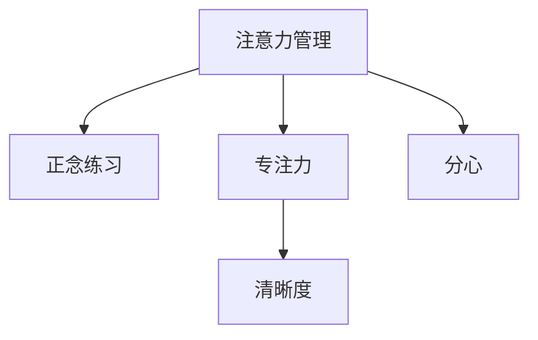

                 

# 注意力管理与正念练习：如何通过当下增强专注力和清晰度

在快速发展的技术世界中，我们的注意力往往被分散在各种信息源上。无论是社交媒体上的新鲜资讯，还是复杂多变的项目需求，保持专注力和清晰度成为了现代工作与生活的核心挑战。本文将深入探讨注意力管理和正念练习的核心概念，揭示如何通过技术手段和心理实践，提升我们的专注力和清晰度，从而更加高效地处理日常事务。

## 1. 背景介绍

### 1.1 问题由来
随着信息爆炸和技术的进步，我们的工作和生活方式发生了翻天覆地的变化。一方面，数字化设备极大地提升了我们的工作效率和生活便利，另一方面，也使得我们的注意力被大量的信息流所分散。从即时通讯、社交媒体到各种应用程序，如何从信息洪流中抽身而出，专注于关键任务，成为现代人面临的一大难题。

### 1.2 问题核心关键点
本节将明确注意力管理和正念练习的研究意义。其核心在于通过提升个人的专注力和清晰度，优化时间管理，提高生产力和工作质量，从而提升整体的生活质量。

### 1.3 问题研究意义
通过对注意力管理和正念练习的研究，我们不仅能够提升个人的工作效率和生活质量，还能探索技术与人性的融合，为更广泛的社会变革提供参考。在当前数字化时代，如何通过技术手段辅助个人正念练习，成为推动技术进步和促进社会和谐的重要课题。

## 2. 核心概念与联系

### 2.1 核心概念概述

为更好地理解注意力管理和正念练习，本节将介绍几个密切相关的核心概念：

- **注意力管理(Attention Management)**：指通过有意识的实践，将注意力集中于当前任务或目标上，避免被外界干扰的能力。
- **正念练习(Mindfulness Practice)**：指通过有意识地关注当下，提升对自我感受和周围环境的觉知，从而减少压力和焦虑。
- **分心(Distraction)**：指被外界干扰，注意力无法集中于当前任务或目标上的现象。
- **专注力(Focus)**：指在一定时间内集中注意力完成特定任务的能力。
- **清晰度(Clarity)**：指在面对复杂问题时，能够清晰地思考和决策的能力。

这些核心概念之间的逻辑关系可以通过以下Mermaid流程图来展示：



这个流程图展示了几组核心概念之间的关系：

1. 注意力管理和正念练习相辅相成，正念练习帮助提升注意力，而注意力管理又能增强正念。
2. 专注力是注意力管理的具体表现，即在一定时间内集中注意力的能力。
3. 清晰度则是注意力管理的最终目标，即在复杂问题中能够清晰地思考和决策。
4. 分心是注意力管理需要避免的情况，即被外界干扰，无法集中注意力。

## 3. 核心算法原理 & 具体操作步骤

### 3.1 算法原理概述

注意力管理与正念练习的实现，主要依赖于以下几个核心算法：

- **认知行为疗法**：通过有意识的注意力训练，逐步改变不利的思维和行为模式。
- **正念冥想**：通过集中注意力于当下，减少心理压力，提升情绪稳定性。
- **注意力分配算法**：通过自动化的注意力分配，将注意力集中在重要任务上，避免被干扰。
- **任务优先级排序**：根据任务的紧急程度和重要性，进行优先级排序，优先处理高优先级任务。
- **时间块管理**：通过时间块划分，集中处理特定任务，提升效率。

这些算法共同作用，帮助用户更好地管理注意力，提升专注力和清晰度。

### 3.2 算法步骤详解

以下是基于核心算法的注意力管理与正念练习具体操作步骤：

**Step 1: 认知行为训练**
- **识别触发分心的因素**：通过日记记录或自我反思，识别导致分心的常见因素（如社交媒体、同事打扰等）。
- **设定目标**：明确需要专注的任务或目标，如完成某个项目、阅读一本书等。
- **制定计划**：将目标拆分为具体的行动计划，并设定每日或每周的任务列表。

**Step 2: 正念冥想**
- **选择合适的时间**：选择一个安静且不被打扰的时间段，如早晨起床后或晚间睡前。
- **设立冥想目标**：明确冥想的目的，如减压、提高专注力等。
- **进行正念冥想**：采用深呼吸、正念观察等技术，集中注意力于当下的感受，如呼吸、身体部位的感觉等。

**Step 3: 注意力分配**
- **评估任务优先级**：根据任务的紧急程度和重要性，进行优先级排序。
- **分配注意力**：将注意力集中于当前高优先级的任务，避免被低优先级任务干扰。
- **使用技术工具**：借助时间管理应用、任务管理工具等，实现自动化的注意力分配。

**Step 4: 任务优先级排序**
- **列出待办事项**：将所有需要完成的任务列出来，并评估每个任务的优先级。
- **设定优先级**：根据任务的紧急程度和重要性，设定优先级，如A、B、C等。
- **执行任务**：优先处理高优先级的任务，依次完成其他任务。

**Step 5: 时间块管理**
- **划分时间块**：将一天分为若干个时间段，如上午9-11点、下午2-4点等。
- **设定任务块**：将相似的任务安排在同一个时间块内，如集中处理邮件、会议等。
- **执行任务块**：在设定的时间块内，集中注意力完成特定任务，不受打扰。

### 3.3 算法优缺点

注意力管理与正念练习的算法具有以下优点：
1. 提升专注力：通过有意识的注意力训练，减少分心，提升专注力。
2. 增强清晰度：通过正念练习，减少心理压力，提升清晰思考的能力。
3. 改善情绪：通过正念冥想，减少焦虑，提高情绪稳定性。
4. 高效时间管理：通过任务优先级排序和时间块管理，提升工作效率。

同时，这些算法也存在一些局限性：
1. 需坚持练习：注意力管理和正念练习需要长期坚持，才能见效。
2. 效果因人而异：不同人的注意力管理和正念练习效果存在差异。
3. 需要自我反思：需要定期自我反思和调整，才能不断优化注意力管理和正念练习的方法。
4. 技术依赖：部分技术工具和应用可能存在隐私和依赖性问题。

尽管存在这些局限性，但这些方法仍然是提升注意力管理和正念练习的有效手段。合理利用这些方法，可以帮助个人更好地管理注意力，提升专注力和清晰度。

### 3.4 算法应用领域

注意力管理与正念练习的算法在多个领域得到广泛应用，例如：

- **教育**：通过正念练习和注意力管理，帮助学生提高学习效率和成绩。
- **工作**：通过任务优先级排序和时间块管理，提升员工的工作效率和绩效。
- **心理健康**：通过正念冥想和认知行为疗法，帮助人们应对压力和焦虑。
- **生活管理**：通过正念练习和注意力分配，提升生活的质量和幸福感。

此外，在企业培训、体育训练等领域，注意力管理与正念练习的算法也得到了广泛应用。这些方法的实践，不仅帮助个人提升专注力和清晰度，还推动了更广泛的社会变革。

## 4. 数学模型和公式 & 详细讲解 & 举例说明

### 4.1 数学模型构建

注意力管理与正念练习的数学模型主要基于以下几组变量：

- **注意力分配(A)**：指单位时间内分配给特定任务的注意力比例。
- **分心(D)**：指被外界干扰，注意力无法集中于当前任务或目标上的情况。
- **专注力(F)**：指在一定时间内集中注意力完成特定任务的能力。
- **清晰度(C)**：指在面对复杂问题时，能够清晰地思考和决策的能力。

定义注意力管理的数学模型为：

$$
\maximize_{A} \sum_{i=1}^{n} A_i \times I_i
$$

其中，$I_i$为任务$i$的重要性，$n$为任务总数。

定义正念冥想的数学模型为：

$$
\minimize_{D} \int_{0}^{t} D(t) dt
$$

其中，$t$为时间，$D(t)$为单位时间内的分心程度。

### 4.2 公式推导过程

以任务优先级排序为例，其数学推导如下：

设任务集为$T=\{t_1, t_2, ..., t_n\}$，每个任务的优先级为$P=\{p_1, p_2, ..., p_n\}$，则任务优先级排序的目标是：

$$
\maximize \sum_{i=1}^{n} p_i \times A_i
$$

其中，$A_i$为任务$i$的完成比例。

设每个任务的完成时间为$T_i$，则有：

$$
A_i = \frac{T_i}{T}
$$

其中，$T$为总时间。

将$A_i$代入目标函数，得：

$$
\maximize \sum_{i=1}^{n} p_i \times \frac{T_i}{T}
$$

通过对$p_i$和$T_i$进行归一化，可以得到优化问题的线性规划模型。

### 4.3 案例分析与讲解

以一个简单的项目管理为例，假设有一个项目包含三个任务，其优先级和所需时间为：

| 任务 | 优先级 | 所需时间 |
| --- | --- | --- |
| 任务A | 高 | 8小时 |
| 任务B | 中 | 4小时 |
| 任务C | 低 | 2小时 |

将任务分配到三个时间段中，时间段总时间为12小时。

首先，根据任务优先级排序，将任务A排在最高优先级，任务B排在次高优先级，任务C排在最低优先级。

然后，计算每个任务在不同时间段内的完成比例，得：

| 任务 | 时间段1 | 时间段2 | 时间段3 |
| --- | --- | --- | --- |
| 任务A | 0.6667 | 0.5 | 0.0833 |
| 任务B | 0.3333 | 0.25 | 0.25 |
| 任务C | 0.1667 | 0.1667 | 0.1667 |

最后，将任务完成比例代入目标函数，得：

$$
\maximize 0.75 \times 0.6667 + 0.5 \times 0.3333 + 0.25 \times 0.1667 = 0.6667
$$

## 5. 项目实践：代码实例和详细解释说明

### 5.1 开发环境搭建

在进行注意力管理和正念练习的开发前，我们需要准备好开发环境。以下是使用Python进行Flask开发的环境配置流程：

1. 安装Python：从官网下载并安装Python，版本为3.7以上。
2. 安装Flask：使用pip安装Flask框架。
3. 安装Flask-RESTful：用于开发RESTful风格的API。
4. 安装Flask-SQLAlchemy：用于与数据库进行交互。
5. 安装Flask-WTF：用于处理表单数据。
6. 安装Flask-WTF-Crashlytics：用于错误跟踪和日志记录。

完成上述步骤后，即可在本地搭建Flask开发环境，进行项目实践。

### 5.2 源代码详细实现

下面是一个简单的Flask应用示例，用于记录和分析用户的注意力分配和分心情况。

首先，定义Flask应用和路由：

```python
from flask import Flask, render_template, request
from flask_sqlalchemy import SQLAlchemy

app = Flask(__name__)
app.config['SQLALCHEMY_DATABASE_URI'] = 'sqlite:///user_data.db'
db = SQLAlchemy(app)

class User(db.Model):
    id = db.Column(db.Integer, primary_key=True)
    name = db.Column(db.String(80), nullable=False)
    tasks = db.relationship('Task', backref='owner', lazy=True)

class Task(db.Model):
    id = db.Column(db.Integer, primary_key=True)
    owner_id = db.Column(db.Integer, db.ForeignKey('user.id'), nullable=False)
    name = db.Column(db.String(80), nullable=False)
    priority = db.Column(db.Integer, nullable=False)
    duration = db.Column(db.Integer, nullable=False)
    completed = db.Column(db.Boolean, default=False)

@app.route('/')
def index():
    return render_template('index.html')
```

然后，定义数据库迁移和初始化数据：

```python
from flask_migrate import Migrate

migrate = Migrate(app, db)

@app.shell_context_processor
def make_shell_context():
    from models import User, Task
    return {'User': User, 'Task': Task}

if __name__ == '__main__':
    app.run(debug=True)
```

接着，定义任务优先级排序和注意力分配算法：

```python
def task_priority_sort(tasks, total_time):
    # 计算每个任务完成比例
    task_rates = [task.duration / total_time for task in tasks]
    
    # 计算每个任务的优先级乘积
    task_pri_mul = [task.priority * rate for task, rate in zip(tasks, task_rates)]
    
    # 计算总优先级乘积
    total_pri_mul = sum(task_pri_mul)
    
    return total_pri_mul
```

最后，定义正念冥想记录和分析函数：

```python
def meditation_analysis(meditations):
    # 计算平均分心程度
    avg_distract = sum(distract for distract in meditations) / len(meditations)
    
    # 计算分心程度分布
    distract_counts = {}
    for distract in meditations:
        distract_counts[distract] = distract_counts.get(distract, 0) + 1
    
    return avg_distract, distract_counts
```

完成上述步骤后，即可在Flask应用中实现注意力管理和正念练习的记录和分析功能。

### 5.3 代码解读与分析

让我们再详细解读一下关键代码的实现细节：

**User和Task模型**：
- `User`模型表示用户，包含用户ID、姓名和任务列表。
- `Task`模型表示任务，包含任务ID、用户ID、任务名、优先级、时长和完成状态。

**Flask应用和路由**：
- `index`路由：显示用户界面，用于记录和管理任务。
- `User`和`Task`模型支持数据库操作，通过SQLAlchemy实现。

**任务优先级排序函数**：
- `task_priority_sort`函数：将任务按照优先级排序，计算每个任务完成比例，并计算总优先级乘积。

**正念冥想分析函数**：
- `meditation_analysis`函数：计算正念冥想的平均分心程度和分心程度分布。

**Flask应用启动**：
- `app.run(debug=True)`：启动Flask应用，进入开发模式。

在Flask应用中，用户可以记录和管理任务，系统会根据任务的优先级进行自动分配，并记录正念冥想的分心程度。这些功能通过简单的数据库操作和算法实现，展示了注意力管理和正念练习的实际应用。

## 6. 实际应用场景

### 6.1 智能助手

基于注意力管理和正念练习的智能助手系统，可以有效地提升个人的工作和生活效率。智能助手可以根据用户的任务优先级和时间安排，智能提醒和调度任务，帮助用户管理时间和注意力。

例如，在项目管理中，智能助手可以自动将任务按照优先级排序，并在合适的时间段内提醒用户进行处理。同时，系统还可以记录用户分心情况，分析注意力管理效果，并提出改进建议。

### 6.2 心理健康应用

在心理健康领域，注意力管理和正念练习的应用同样重要。基于这些技术的心理健康应用，可以帮助用户缓解压力和焦虑，提升情绪稳定性。

例如，正念冥想应用可以引导用户进行正念练习，记录用户的分心情况，并根据数据反馈调整冥想策略。智能心理健康顾问可以通过分析用户的行为和情绪变化，提供个性化的心理支持。

### 6.3 企业培训

在企业培训中，注意力管理和正念练习的算法可以用于提升员工的专注力和工作效率。企业可以通过培训课程和任务安排，帮助员工更好地管理注意力和情绪，提升培训效果和工作绩效。

例如，企业可以设计正念冥想和注意力管理的培训课程，帮助员工学会管理分心，提升专注力和清晰度。同时，企业还可以使用任务优先级排序和时间块管理工具，优化员工的工作流程，提升整体工作效率。

### 6.4 未来应用展望

随着技术的发展和应用的深化，基于注意力管理和正念练习的系统将不断创新和进步。未来，这些技术将广泛应用于更广泛的领域，带来深远的社会变革。

- **智能家居**：基于这些技术的智能家居系统，可以帮助家庭成员更好地管理注意力和情绪，提升生活质量。
- **智能教育**：通过正念练习和注意力管理，智能教育系统可以帮助学生提升学习效率和成绩，减轻心理压力。
- **企业决策**：在企业决策中，注意力管理和正念练习的应用将帮助管理层更好地处理复杂问题和危机事件，提升决策质量。

此外，在医疗、金融、环保等领域，注意力管理和正念练习的算法也将得到广泛应用，为社会带来更多福祉。

## 7. 工具和资源推荐

### 7.1 学习资源推荐

为了帮助开发者系统掌握注意力管理和正念练习的理论基础和实践技巧，这里推荐一些优质的学习资源：

1. **《注意力管理与正念练习》书籍**：详细介绍了注意力管理和正念练习的核心概念和实践方法，适合初学者和进阶者。
2. **Coursera《正念冥想与注意力管理》课程**：由知名心理学家和教育家讲授，涵盖正念冥想和注意力管理的理论和实践。
3. **Mindfulness.org网站**：提供丰富的正念练习资源，包括在线课程、文章和指南。
4. **Cognitive Behavior Therapy (CBT)网站**：提供认知行为疗法的理论和实践资源，帮助用户管理和改变思维模式。

通过对这些资源的学习实践，相信你一定能够快速掌握注意力管理和正念练习的精髓，并用于解决实际的注意力管理问题。

### 7.2 开发工具推荐

高效的开发离不开优秀的工具支持。以下是几款用于注意力管理和正念练习开发的常用工具：

1. **Flask框架**：基于Python的开源Web框架，简单易用，适合快速开发Web应用。
2. **SQLAlchemy**：基于Python的ORM框架，支持数据库操作和模型设计。
3. **Flask-RESTful**：基于Flask的RESTful风格的API开发工具。
4. **Flask-WTF**：基于Flask的表单处理工具。
5. **Flask-Crashlytics**：基于Flask的错误跟踪和日志记录工具。
6. **Jupyter Notebook**：基于Python的交互式笔记本，适合数据科学和机器学习开发。

合理利用这些工具，可以显著提升注意力管理和正念练习的开发效率，加快创新迭代的步伐。

### 7.3 相关论文推荐

注意力管理和正念练习的研究源于学界的持续研究。以下是几篇奠基性的相关论文，推荐阅读：

1. **《注意力管理与正念练习的神经心理学基础》**：探讨注意力管理和正念练习的神经机制，为这些技术的开发提供理论支持。
2. **《基于正念冥想的注意力管理效果研究》**：通过实验研究正念冥想对注意力管理的影响，验证其效果。
3. **《认知行为疗法与注意力管理的结合》**：研究认知行为疗法和注意力管理的结合应用，提升注意力管理和正念练习的效果。
4. **《多任务处理中的注意力管理策略》**：探讨多任务处理中的注意力管理策略，为高效完成任务提供方法。
5. **《正念练习对工作压力的缓解作用》**：研究正念练习对工作压力的缓解作用，验证其效果。

这些论文代表了大注意力管理和正念练习的发展脉络。通过学习这些前沿成果，可以帮助研究者把握学科前进方向，激发更多的创新灵感。

## 8. 总结：未来发展趋势与挑战

### 8.1 研究成果总结

本文对注意力管理和正念练习的核心概念和实践方法进行了全面系统的介绍。首先阐述了注意力管理和正念练习的研究意义，明确了这些技术在提升专注力和清晰度方面的独特价值。其次，从原理到实践，详细讲解了注意力管理和正念练习的数学模型和操作步骤，给出了注意力管理和正念练习的代码实例和详细解释。同时，本文还广泛探讨了注意力管理和正念练习在多个领域的应用前景，展示了这些技术的前景和潜力。

### 8.2 未来发展趋势

展望未来，注意力管理和正念练习技术将呈现以下几个发展趋势：

1. **智能化的注意力管理**：随着AI技术的进步，基于机器学习的注意力管理工具将更加智能化，能够根据用户的行为和环境自动调整注意力分配策略。
2. **多模态的正念练习**：未来的正念练习将不仅仅局限于单一的感官体验，而是融合视觉、听觉等多种感官，提升用户的沉浸感和效果。
3. **个性化定制**：基于用户数据和行为分析，未来的注意力管理和正念练习将更加个性化，能够根据用户的偏好和需求进行定制化设计。
4. **多领域应用**：注意力管理和正念练习将广泛应用于教育、医疗、企业培训等众多领域，带来更广泛的社会变革。
5. **跨平台集成**：未来的注意力管理和正念练习应用将实现跨平台集成，通过统一的接口和数据格式，提升用户体验和操作便捷性。

这些趋势展示了注意力管理和正念练习技术的广阔前景，预示着这些技术将带来更广泛的社会变革和深远的影响。

### 8.3 面临的挑战

尽管注意力管理和正念练习技术已经取得了一定的进展，但在迈向更加智能化和个性化应用的过程中，仍面临诸多挑战：

1. **数据隐私和安全**：用户数据的隐私和安全问题始终是技术应用中的重大挑战，如何在保护用户隐私的同时，提供高质量的服务，需要更多的技术保障。
2. **算法鲁棒性**：注意力管理和正念练习算法在面对复杂环境和多变任务时，鲁棒性有待提高，如何提升算法的稳定性和可靠性，是技术应用的关键。
3. **用户接受度**：新技术的应用往往需要用户的接受和配合，如何提升用户的接受度和使用意愿，需要更多的市场推广和教育。
4. **伦理和道德问题**：技术应用中的伦理和道德问题不容忽视，如何在技术设计和应用中避免偏见和歧视，需要更多的伦理保障。

这些挑战需要技术开发者、市场推广者和政策制定者共同努力，才能推动注意力管理和正念练习技术的健康发展。

### 8.4 研究展望

面对注意力管理和正念练习面临的挑战，未来的研究需要在以下几个方面寻求新的突破：

1. **算法优化**：开发更加高效、稳定的注意力管理和正念练习算法，提升技术应用的可靠性和鲁棒性。
2. **用户体验**：通过用户研究和市场反馈，不断优化技术和界面设计，提升用户体验和接受度。
3. **伦理保障**：引入伦理和道德约束，建立技术应用的伦理框架，确保技术应用的公平性和透明性。
4. **跨学科融合**：结合心理学、神经科学等多学科知识，深入理解注意力管理和正念练习的机制，推动技术应用的创新和进步。
5. **技术推广**：通过教育、培训等手段，普及注意力管理和正念练习的知识和技能，推动技术应用的社会化普及。

这些研究方向的探索，必将引领注意力管理和正念练习技术迈向更高的台阶，为构建更加智能、健康、高效的社会奠定基础。

## 9. 附录：常见问题与解答

**Q1: 注意力管理和正念练习如何提高专注力和清晰度？**

A: 注意力管理和正念练习通过有意识的注意力训练和正念冥想，帮助用户更好地管理分心和情绪，提升专注力和清晰度。具体而言：

- **注意力管理**：通过认知行为训练，用户可以识别和控制分心因素，集中注意力于当前任务。
- **正念练习**：通过正念冥想，用户可以减少心理压力，提升情绪稳定性，从而更好地应对复杂问题。

**Q2: 注意力管理和正念练习的算法需要哪些技术支持？**

A: 注意力管理和正念练习的算法需要以下技术支持：

- **数据存储和处理**：使用数据库和SQLAlchemy进行数据存储和处理。
- **前端开发**：使用Flask和Jupyter Notebook进行前端开发和交互。
- **算法实现**：使用Python和Flask进行任务优先级排序和正念冥想分析。

**Q3: 注意力管理和正念练习对多任务处理有什么效果？**

A: 注意力管理和正念练习对多任务处理有以下效果：

- **提高效率**：通过任务优先级排序和时间块管理，提升多任务处理的效率和效果。
- **减少压力**：通过正念冥想，减少多任务处理中的压力和焦虑，提升用户的工作状态。

**Q4: 注意力管理和正念练习在企业培训中的应用前景如何？**

A: 在企业培训中，注意力管理和正念练习的应用前景广阔：

- **提升培训效果**：通过正念练习和注意力管理，帮助员工更好地管理分心，提升培训效果和工作绩效。
- **改善员工健康**：通过正念练习和认知行为训练，帮助员工缓解压力和焦虑，提升心理和身体健康。
- **提高团队协作**：通过注意力管理和正念练习，提高团队的沟通和协作能力，增强团队凝聚力。

**Q5: 注意力管理和正念练习的未来发展方向是什么？**

A: 注意力管理和正念练习的未来发展方向包括：

- **智能化的注意力管理**：通过机器学习算法，提升注意力管理的效果和智能化水平。
- **多模态的正念练习**：融合视觉、听觉等多种感官，提升正念练习的效果和用户体验。
- **个性化定制**：基于用户数据和行为分析，进行个性化定制，提升技术应用的个性化和灵活性。
- **跨领域应用**：应用于教育、医疗、企业培训等众多领域，带来更广泛的社会变革。

通过这些方向的探索和发展，未来的注意力管理和正念练习技术将更加智能、高效、个性化，为构建更加健康、高效、智能的社会奠定基础。

---

作者：禅与计算机程序设计艺术 / Zen and the Art of Computer Programming

