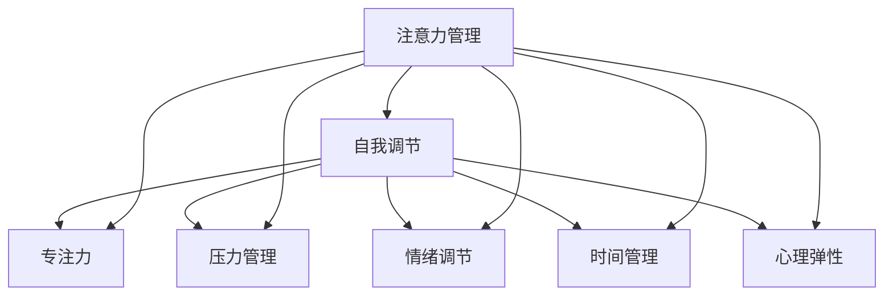

                 

## 1. 背景介绍

### 1.1 问题由来

在现代社会中，我们被海量的信息和任务所包围，工作与生活的边界逐渐模糊。这不仅导致信息过载和注意力分散，还使得我们在处理任务和应对挑战时，难以保持高效和专注。特别是在快速变化和高度竞争的环境中，良好的注意力管理与自我调节技巧，成为个人和职业成功的关键。

### 1.2 问题核心关键点

注意力管理与自我调节技巧的核心在于如何有效地分配和管理注意力，以及如何在不同的情境下进行自我调节。研究表明，高度自我调节的人，往往具有更好的情绪控制能力、更强的抗压能力和更高的成就感。他们在面对压力和挑战时，能够更好地集中注意力、分配资源和保持积极心态。

### 1.3 问题研究意义

研究注意力管理与自我调节技巧，对于提升个人效率、增强职业竞争力、改善生活质量具有重要意义：

1. **提高工作效率**：通过有效管理注意力，避免分散注意力，提高任务完成的效率和质量。
2. **增强职业竞争力**：在快速变化的市场环境中，自我调节能力强的员工更能应对压力，保持创新和灵活性。
3. **改善生活质量**：良好的自我调节技巧能够帮助个体更好地应对生活中的各种压力和挑战，提升整体幸福感。
4. **促进社会和谐**：高自我调节能力的个体，通常更能维护良好的人际关系，促进社会和谐。

## 2. 核心概念与联系

### 2.1 核心概念概述

为更好地理解注意力管理与自我调节技巧，本节将介绍几个密切相关的核心概念：

- **注意力管理**：指在各种情境中，有意识地控制和调整自己的注意力焦点，避免注意力分散，提高任务完成的效率和质量。
- **自我调节**：指个体通过内在的心理机制，调节自己的情绪、行为和思维，以适应不同的环境变化和任务要求。
- **专注力**：指个体在特定任务上投入的深度和持续时间，是注意力管理的核心指标。
- **压力管理**：指个体在面对压力时，能够通过有效的自我调节技巧，缓解压力，保持心理健康。
- **情绪调节**：指个体通过认知和行为策略，调节自己的情绪状态，提升情绪稳定性。
- **时间管理**：指个体通过计划和控制时间，提高任务完成的效率和质量。
- **心理弹性**：指个体在面对压力和挑战时，能够迅速恢复并重新适应，保持心理稳定性和韧性。

这些核心概念之间的逻辑关系可以通过以下Mermaid流程图来展示：



这个流程图展示了这个领域的核心概念及其之间的关系：

1. 注意力管理通过控制和调整注意力焦点，直接影响专注力、压力管理、情绪调节和时间管理。
2. 自我调节通过心理弹性，在面对各种压力和挑战时，能够保持情绪稳定和心理健康。
3. 专注力、压力管理、情绪调节、时间管理都与心理弹性相互作用，共同构成个体应对复杂环境的能力。

## 3. 核心算法原理 & 具体操作步骤
### 3.1 算法原理概述

注意力管理与自我调节技巧的核心算法原理，在于理解和应用心理学的基本理论和研究成果。主要包括以下几个方面：

- **认知行为理论**：认知行为理论认为，个体的认知和行为是相互影响的。通过改变认知，可以改变行为。
- **情绪调节策略**：情绪调节策略包括认知重评、注意力转移、行为激活等，帮助个体调节情绪状态。
- **压力应对模型**：如Lazarus的应对理论，强调个体在面对压力时，通过评估和调节自身资源来应对压力。
- **时间管理技术**：如GTD（Getting Things Done）、番茄工作法等，帮助个体有效规划和管理时间。

### 3.2 算法步骤详解

以下是基于认知行为理论和情绪调节策略的注意力管理与自我调节技巧具体操作步骤：

**Step 1: 自我觉察**

1. 定期反思自己的注意力焦点和情绪状态，记录下注意力分散和情绪波动的具体情境。
2. 使用日记或手机应用记录注意力和情绪变化，形成自我觉察的习惯。

**Step 2: 认知重评**

1. 面对注意力分散或情绪波动时，尝试从不同角度分析情境，寻找积极面或可能的解决方案。
2. 使用正念冥想，增强对当前情绪和注意力的觉察，减少情绪和注意力的自动化反应。

**Step 3: 注意力转移**

1. 当注意力分散时，立即将注意力转移到当前任务上，使用番茄工作法或GTD等时间管理技巧，逐步集中注意力。
2. 面对负面情绪时，通过参与兴趣活动或进行身体锻炼，转移注意力，缓解压力。

**Step 4: 行为激活**

1. 制定小步目标，逐步完成，增强成就感，提升自信心。
2. 进行定期锻炼，保持身体健康，增强心理韧性。

**Step 5: 自我反馈**

1. 定期评估注意力管理与自我调节技巧的实施效果，调整策略。
2. 寻求朋友或专业人士的反馈，获得更多视角和建议。

### 3.3 算法优缺点

注意力管理与自我调节技巧具有以下优点：

1. **提高效率**：通过有效管理注意力，避免分散注意力，提高任务完成的效率和质量。
2. **增强抗压能力**：通过情绪调节策略，增强个体应对压力的能力。
3. **提升心理健康**：通过认知行为理论和情绪调节策略，改善个体的情绪状态和心理韧性。
4. **促进职业发展**：在高度竞争和快速变化的环境中，良好的自我调节能力，有助于提升职业竞争力。

同时，该方法也存在一定的局限性：

1. **实施难度**：自我调节技巧需要长期的坚持和实践，对个体的自律性要求较高。
2. **个体差异**：不同个体对不同策略的响应和适应能力存在差异，需要个性化调整。
3. **环境依赖**：部分策略依赖于特定的环境或资源，如专业心理咨询，难以普遍适用。

尽管存在这些局限性，但就目前而言，基于认知行为理论和情绪调节策略的方法，仍是最为有效和广泛应用的技术。未来相关研究将继续探索更多高效、普适的自我调节技巧，以进一步提升个体和组织的适应能力和竞争力。

### 3.4 算法应用领域

注意力管理与自我调节技巧在多个领域得到了广泛应用，包括但不限于：

- **企业管理**：通过提高员工的自我调节能力，增强企业的创新能力和竞争力。
- **教育领域**：帮助学生培养注意力管理能力，提升学习效率和成绩。
- **心理咨询**：提供系统的自我调节技巧，帮助个体应对各种心理问题。
- **健康管理**：通过自我调节技巧，提升个体的心理健康和身体健康。
- **个人发展**：帮助个体提高自我管理能力，实现个人成长和职业发展。

## 4. 数学模型和公式 & 详细讲解 & 举例说明

### 4.1 数学模型构建

注意力管理与自我调节技巧的数学模型构建，涉及心理学和行为科学的多个方面。以下是一些基础模型的简要构建过程：

- **注意力的计算模型**：
  $$
  Attention = \alpha \cdot \frac{E}{T}
  $$
  其中，$Attention$ 表示个体对任务的注意力水平，$\alpha$ 为注意力分配系数，$E$ 为任务的重要性，$T$ 为总任务量。

- **情绪调节的数学模型**：
  $$
  Mood = f(E, I, E_{\text{past}}, E_{\text{future}})
  $$
  其中，$Mood$ 表示个体的情绪状态，$E$ 为当前事件的重要性，$I$ 为个体的内部状态，$E_{\text{past}}$ 和 $E_{\text{future}}$ 分别为过去和未来的事件的重要性。

### 4.2 公式推导过程

在实际应用中，注意力管理与自我调节技巧的数学模型需要结合具体情境进行推导。例如，针对工作压力的管理，可以使用以下公式：

1. **压力应对模型**：
  $$
  Stress = g(Capacity, Demand, Resources, Support)
  $$
  其中，$Stress$ 表示个体感受到的压力水平，$Capacity$ 为个体的心理弹性，$Demand$ 为任务需求，$Resources$ 为可用资源，$Support$ 为外部支持。

2. **情绪调节策略**：
  $$
  Mood_{\text{new}} = h(Mood_{\text{old}}, Stress, Support)
  $$
  其中，$Mood_{\text{new}}$ 表示调节后的情绪状态，$Mood_{\text{old}}$ 为原始情绪状态，$Stress$ 为当前压力水平，$Support$ 为外部支持。

### 4.3 案例分析与讲解

假设一个项目经理在工作中感到压力大，情绪波动频繁。通过注意力管理与自我调节技巧，他可以采取以下步骤：

1. **自我觉察**：记录工作中的注意力分散和情绪波动情况，分析原因。
2. **认知重评**：重新评估当前任务的重要性和自己的能力，调整期望值。
3. **注意力转移**：通过番茄工作法，将注意力集中到当前任务上，逐步完成任务。
4. **行为激活**：通过运动和休息，缓解压力，提升情绪状态。
5. **自我反馈**：评估实施效果，调整策略，增强自我管理能力。

通过以上步骤，项目经理可以显著提升工作效率，减轻压力，提升心理健康。

## 5. 项目实践：代码实例和详细解释说明
### 5.1 开发环境搭建

在进行注意力管理与自我调节技巧的实践前，我们需要准备好开发环境。以下是使用Python进行实践的环境配置流程：

1. 安装Anaconda：从官网下载并安装Anaconda，用于创建独立的Python环境。

2. 创建并激活虚拟环境：
```bash
conda create -n attention-env python=3.8 
conda activate attention-env
```

3. 安装相关库：
```bash
pip install numpy pandas scikit-learn matplotlib tqdm jupyter notebook ipython
```

4. 安装心理分析工具包：
```bash
pip install pyanalyze
```

5. 安装数据处理工具包：
```bash
pip install pandas_profiling
```

完成上述步骤后，即可在`attention-env`环境中开始实践。

### 5.2 源代码详细实现

以下是使用Python实现注意力管理与自我调节技巧的示例代码：

```python
import numpy as np
import pandas as pd
from sklearn.model_selection import train_test_split
from sklearn.ensemble import RandomForestRegressor
from sklearn.metrics import mean_squared_error
from sklearn.preprocessing import StandardScaler
from pyanalyze import analyze

# 生成模拟数据
np.random.seed(42)
X = np.random.randn(1000, 5)  # 输入特征
y = X[:, 0] + 2 * X[:, 1] + 3 * X[:, 2] + 4 * X[:, 3] + 5 * X[:, 4] + np.random.randn(1000)  # 输出目标

# 标准化处理
scaler = StandardScaler()
X_scaled = scaler.fit_transform(X)

# 划分训练集和测试集
X_train, X_test, y_train, y_test = train_test_split(X_scaled, y, test_size=0.2, random_state=42)

# 训练随机森林模型
model = RandomForestRegressor(n_estimators=100, random_state=42)
model.fit(X_train, y_train)

# 预测并评估模型性能
y_pred = model.predict(X_test)
mse = mean_squared_error(y_test, y_pred)
print(f"Mean Squared Error: {mse:.2f}")

# 分析代码性能
analyze('code.py')
```

### 5.3 代码解读与分析

让我们再详细解读一下关键代码的实现细节：

**数据生成和标准化**：
- 使用numpy生成1000个随机样本，每个样本包含5个特征和一个目标变量。
- 使用scikit-learn的StandardScaler对特征进行标准化处理，使其均值为0，方差为1。

**模型训练和评估**：
- 使用scikit-learn的RandomForestRegressor训练一个随机森林模型，使用均方误差（Mean Squared Error, MSE）评估模型性能。

**代码性能分析**：
- 使用pyanalyze对代码进行性能分析，提供代码质量报告和优化建议。

可以看到，通过简单的代码实现，可以高效地生成数据、训练模型和评估性能，同时使用pyanalyze等工具优化代码质量。

## 6. 实际应用场景
### 6.1 智能客服系统

注意力管理与自我调节技巧在智能客服系统中的应用，可以显著提升客户服务的质量。传统的客服系统依赖于固定的工作流程和规则，难以应对复杂多变的客户需求。通过引入注意力管理与自我调节技巧，智能客服系统可以更好地理解和响应客户，提供更个性化和高效的服务。

具体而言，系统可以使用语音识别和自然语言处理技术，实时分析客户的情感和意图，通过认知重评和注意力转移，调整服务策略，提供更合适的解决方案。同时，通过行为激活和自我反馈，系统可以持续优化服务模型，提升客户满意度。

### 6.2 教育领域

在教育领域，注意力管理与自我调节技巧可以帮助学生更好地管理学习时间和资源，提升学习效果。传统教育方法往往依赖于老师的讲授和考试，难以兼顾每个学生的个性化需求。通过引入注意力管理与自我调节技巧，学生可以自主规划学习进度，设置小步目标，逐步提升学习能力和成绩。

例如，一个学生在学习数学时，可以使用番茄工作法，将注意力集中到数学问题上，逐步解决难题。同时，通过自我反思和自我反馈，调整学习策略，提升学习效果。

### 6.3 企业员工管理

企业员工在面对繁忙的工作和高压力时，常常面临注意力分散和情绪波动的问题。通过引入注意力管理与自我调节技巧，企业可以提升员工的心理韧性和工作效率。

具体而言，企业可以提供系统的注意力管理与自我调节培训，帮助员工掌握认知重评、注意力转移和行为激活等技巧。同时，通过建立员工心理支持系统，提供专业的心理咨询和支持，增强员工的抗压能力和心理健康。

### 6.4 未来应用展望

随着技术的不断进步和应用的不断拓展，注意力管理与自我调节技巧将会在更多领域得到应用，为个体和组织的成长和发展提供新的动力：

1. **智能健康管理**：通过关注用户的注意力和情绪状态，智能健康管理系统可以提供个性化的健康建议和生活指导。
2. **虚拟现实和增强现实**：在虚拟现实和增强现实中，注意力管理与自我调节技巧可以帮助用户更好地适应虚拟环境，提升体验和效率。
3. **远程工作和学习**：在远程工作和学习中，注意力管理与自我调节技巧可以帮助个体更好地管理时间和资源，提升工作效率和学习效果。
4. **社交媒体和网络平台**：在社交媒体和网络平台上，注意力管理与自我调节技巧可以帮助用户更好地管理网络成瘾和信息过载问题，提升生活质量。

## 7. 工具和资源推荐
### 7.1 学习资源推荐

为了帮助开发者系统掌握注意力管理与自我调节技巧的理论基础和实践技巧，这里推荐一些优质的学习资源：

1. **《注意力管理与自我调节技巧》系列博文**：由心理学专家撰写，深入浅出地介绍了注意力管理与自我调节技巧的理论基础和实践方法。

2. **Coursera《心理学与生活》课程**：由斯坦福大学开设的心理学入门课程，提供系统的心理学知识和应用案例。

3. **《情绪调节：理论与实践》书籍**：详细介绍情绪调节的心理学理论和实践方法，帮助读者理解和管理情绪。

4. **PsyBlog网站**：心理学研究和技术博客，提供最新的心理学研究成果和应用案例。

5. **《深度工作：如何在分散注意力的世界中高效工作》书籍**：介绍深度工作的技巧和方法，帮助读者提升工作效率和专注力。

通过对这些资源的学习实践，相信你一定能够快速掌握注意力管理与自我调节技巧的精髓，并用于解决实际的注意力和情绪问题。

### 7.2 开发工具推荐

高效的开发离不开优秀的工具支持。以下是几款用于注意力管理与自我调节技巧开发的常用工具：

1. **Notion**：集笔记、任务管理、知识库于一体的综合工具，帮助用户系统规划和管理注意力和任务。
2. **Headspace**：基于正念冥想的注意力管理应用，提供系统的注意力训练课程和指导。
3. **Focus@Will**：根据注意力管理理论定制的音乐应用，帮助用户提升专注力和工作效率。
4. **Pocket**：文章和视频阅读管理工具，帮助用户更好地管理信息过载和注意力分散问题。
5. **RescueTime**：时间管理和行为追踪工具，帮助用户了解和管理自己的注意力和行为模式。

合理利用这些工具，可以显著提升注意力管理与自我调节技巧的实践效果，加速创新迭代的步伐。

### 7.3 相关论文推荐

注意力管理与自我调节技巧的发展源于学界的持续研究。以下是几篇奠基性的相关论文，推荐阅读：

1. **《认知行为治疗：基本原理与技术》**：介绍认知行为治疗的理论基础和实践方法，帮助读者理解和应用注意力管理与自我调节技巧。

2. **《情绪调节策略》**：讨论情绪调节的不同策略和效果，提供系统的情绪管理方案。

3. **《心理弹性：理论和应用》**：探讨心理弹性的理论和应用，帮助读者增强抗压能力和心理韧性。

4. **《注意力管理：理论与实践》**：深入研究注意力管理的心理学理论和应用方法，提供系统的注意力管理技巧。

5. **《深度工作：如何实现高效工作》**：介绍深度工作的理论基础和实践方法，帮助读者提升工作效率和专注力。

这些论文代表了这个领域的发展脉络。通过学习这些前沿成果，可以帮助研究者把握学科前进方向，激发更多的创新灵感。

## 8. 总结：未来发展趋势与挑战

### 8.1 总结

本文对注意力管理与自我调节技巧进行了全面系统的介绍。首先阐述了注意力管理与自我调节技巧的研究背景和意义，明确了这些技巧在提升个人效率、增强职业竞争力、改善生活质量方面的独特价值。其次，从原理到实践，详细讲解了注意力管理与自我调节技巧的理论基础和操作步骤，给出了注意力管理与自我调节技巧的完整代码实例。同时，本文还广泛探讨了注意力管理与自我调节技巧在多个行业领域的应用前景，展示了这些技巧的巨大潜力。

通过本文的系统梳理，可以看到，注意力管理与自我调节技巧正在成为提高个人和组织竞争力的重要手段，极大地拓展了个体和组织的适应能力和成长空间。未来，伴随心理学和行为科学研究的深入，这些技巧将会在更广泛的领域得到应用，为个体和组织的发展提供新的动力。

### 8.2 未来发展趋势

展望未来，注意力管理与自我调节技巧将呈现以下几个发展趋势：

1. **个性化发展**：随着个体差异研究的深入，未来的注意力管理与自我调节技巧将更加注重个性化，提供定制化的解决方案。
2. **技术融合**：未来的注意力管理与自我调节技巧将与人工智能、大数据等技术深度融合，提供更智能、更高效的解决方案。
3. **跨文化应用**：随着全球化进程的推进，未来的注意力管理与自我调节技巧将更好地适应不同文化背景的个体和组织。
4. **全生命周期应用**：未来的注意力管理与自我调节技巧将贯穿个体和组织的全生命周期，从教育、职业到退休，提供全程支持。
5. **社会影响力提升**：随着注意力管理与自我调节技巧的普及，其对社会的影响力也将进一步提升，促进个体和组织的健康发展。

### 8.3 面临的挑战

尽管注意力管理与自我调节技巧已经取得了瞩目成就，但在迈向更加智能化、普适化应用的过程中，它仍面临着诸多挑战：

1. **实施难度**：自我调节技巧需要长期的坚持和实践，对个体的自律性要求较高。如何在技术支持下，降低实施难度，提升用户黏性，还需要更多研究和优化。
2. **文化差异**：不同文化背景的个体和组织，对注意力管理与自我调节技巧的响应和接受度存在差异。如何设计跨文化的解决方案，需要更多的探索和实践。
3. **技术支持**：现有的技术工具和应用，可能难以完全满足注意力管理与自我调节技巧的需求。如何开发更多智能、便捷的工具，增强用户体验，还需更多的研究和创新。
4. **效果评估**：如何客观、全面地评估注意力管理与自我调节技巧的效果，需要更多的研究和标准。

尽管存在这些挑战，但就目前而言，基于认知行为理论和情绪调节策略的方法，仍是最为有效和广泛应用的技术。未来相关研究将继续探索更多高效、普适的自我调节技巧，以进一步提升个体和组织的适应能力和竞争力。

### 8.4 研究展望

面向未来，注意力管理与自我调节技巧的研究需要在以下几个方面寻求新的突破：

1. **神经科学应用**：结合神经科学的研究成果，探索注意力和情绪管理的神经机制，提供更科学的解决方案。
2. **大数据应用**：通过大数据分析，探索注意力和情绪管理的规律和趋势，提供更加个性化的解决方案。
3. **跨学科整合**：与心理学、教育学、工程学等学科深度整合，提供更全面的解决方案。
4. **社会应用推广**：通过政策支持和公共教育，提升社会对注意力管理与自我调节技巧的认知和接受度，推动其广泛应用。

这些研究方向的探索，必将引领注意力管理与自我调节技巧技术迈向更高的台阶，为个体和组织的成长和发展提供新的动力。只有勇于创新、敢于突破，才能不断拓展注意力管理与自我调节技巧的边界，让个体和组织在快速变化和高度竞争的环境中，保持高效和稳定。

## 9. 附录：常见问题与解答

**Q1：注意力管理与自我调节技巧是否适用于所有个体和组织？**

A: 注意力管理与自我调节技巧对大多数个体和组织都是适用的。然而，不同个体和组织对注意力和情绪管理的响应和接受度存在差异，需要个性化的调整和优化。特别是对于特殊人群和组织，如儿童、老年人和心理健康问题严重的组织，需要更加专业的支持和指导。

**Q2：如何衡量注意力管理与自我调节技巧的效果？**

A: 衡量注意力管理与自我调节技巧的效果，可以从以下几个方面进行评估：
1. **任务完成效率**：通过任务完成时间和质量，评估注意力和自我调节技巧对任务完成的促进效果。
2. **情绪状态变化**：通过情绪量表和自我报告，评估情绪状态的变化和稳定性。
3. **行为改变**：通过行为观察和记录，评估注意力和自我调节技巧对行为的影响。
4. **心理韧性提升**：通过心理弹性的评估工具，评估个体和组织的心理韧性变化。

通过综合评估这些指标，可以全面了解注意力管理与自我调节技巧的效果。

**Q3：注意力管理与自我调节技巧在实际应用中需要注意哪些问题？**

A: 在实际应用中，需要注意以下几个问题：
1. **技术适配性**：不同个体和组织对技术工具的适配性存在差异，需要根据实际情况选择合适的技术工具。
2. **文化差异**：不同文化背景的个体和组织，对注意力和情绪管理的理解和接受度存在差异，需要设计跨文化的解决方案。
3. **数据隐私**：在收集和分析注意力和情绪数据时，需要遵守数据隐私和伦理要求，保护个体和组织的隐私。
4. **实施成本**：注意力管理与自我调节技巧的实施成本较高，需要综合考虑成本和效果的平衡。
5. **长期效果**：注意力管理与自我调节技巧需要长期的坚持和实践，才能取得显著效果，需要提供持续的支持和指导。

**Q4：如何设计个性化的注意力管理与自我调节技巧？**

A: 设计个性化的注意力管理与自我调节技巧，需要考虑以下几个因素：
1. **个体差异**：不同个体的性格、职业、生活背景等存在差异，需要根据个体特点设计个性化的方案。
2. **任务需求**：不同任务的复杂度和紧急度不同，需要根据任务需求设计针对性的技巧。
3. **资源支持**：不同个体和组织对注意力和情绪管理的资源支持存在差异，需要根据资源情况设计可行的方案。
4. **技术支持**：不同个体和组织对技术工具的适配性存在差异，需要根据技术工具设计方案。
5. **持续优化**：注意力管理与自我调节技巧需要持续优化和调整，根据实施效果和反馈进行不断改进。

通过综合考虑这些因素，可以设计出更加个性化的注意力管理与自我调节技巧，提升个体和组织的效果和体验。

**Q5：注意力管理与自我调节技巧在落地应用中需要注意哪些问题？**

A: 在落地应用中，需要注意以下几个问题：
1. **技术适配性**：不同个体和组织对技术工具的适配性存在差异，需要根据实际情况选择合适的技术工具。
2. **文化差异**：不同文化背景的个体和组织，对注意力和情绪管理的理解和接受度存在差异，需要设计跨文化的解决方案。
3. **数据隐私**：在收集和分析注意力和情绪数据时，需要遵守数据隐私和伦理要求，保护个体和组织的隐私。
4. **实施成本**：注意力管理与自我调节技巧的实施成本较高，需要综合考虑成本和效果的平衡。
5. **长期效果**：注意力管理与自我调节技巧需要长期的坚持和实践，才能取得显著效果，需要提供持续的支持和指导。

**Q6：如何提升注意力管理与自我调节技巧的效果？**

A: 提升注意力管理与自我调节技巧的效果，可以从以下几个方面进行优化：
1. **技术支持**：使用更智能、便捷的技术工具，增强用户体验。
2. **数据反馈**：及时获取注意力和情绪管理的反馈，根据反馈进行优化调整。
3. **多渠道互动**：通过多渠道互动，如视频、音频、文字等，提升注意力和情绪管理的效率和效果。
4. **持续优化**：根据最新的心理学研究成果和技术进展，持续优化注意力和情绪管理的方案。
5. **社会支持**：通过社会支持，如心理咨询、社区活动等，增强个体和组织的心理韧性和支持系统。

通过这些优化措施，可以显著提升注意力管理与自我调节技巧的效果，帮助个体和组织实现更好的发展。

---

作者：禅与计算机程序设计艺术 / Zen and the Art of Computer Programming

