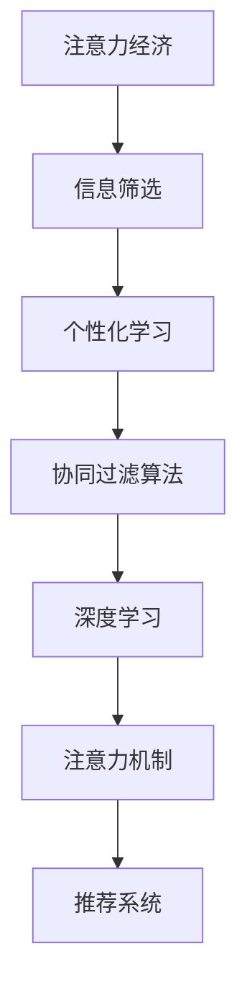

                 

# 注意力经济与个人学习方法论的革新

> 关键词：注意力经济, 学习算法, 人工智能, 机器学习, 数据科学, 自我提升, 持续学习, 个性化推荐

## 1. 背景介绍

### 1.1 问题由来
在数字化信息时代，注意力经济（Attention Economy）已成为一个不可忽视的现象。大量的信息流汇聚于互联网，如何高效地获取、筛选、处理和利用这些信息，成为了人们面临的巨大挑战。同时，个体如何通过自我提升和终身学习，在知识爆炸的时代保持竞争力和创造力，也成为人们关注的热点问题。

在面对这种双重挑战的背景下，注意力经济与个人学习方法论的革新显得尤为重要。本文旨在探讨如何通过算法和技术的创新，构建高效、个性化的信息获取和知识学习体系，帮助人们更好地适应数字化时代的信息潮涌。

### 1.2 问题核心关键点
1. **注意力经济的核心原理**：信息时代信息过载，如何有效筛选和利用信息。
2. **个性化学习方法论的构建**：如何结合人工智能和大数据技术，实现个性化学习路径。
3. **信息获取与知识利用的最佳实践**：如何利用算法和技术工具提升信息筛选和知识利用的效率。

这些核心问题将贯穿全文，通过理论分析、案例研究和实践操作，提供一套系统的解决方案。

## 2. 核心概念与联系

### 2.1 核心概念概述

本节将介绍几个关键概念，以及它们之间的联系。

- **注意力经济（Attention Economy）**：信息时代，注意力成为一种稀缺资源。人们需要在海量信息中找到有价值的内容，这涉及到信息筛选、处理和利用的策略和算法。
- **个性化学习方法论**：利用机器学习、数据科学等技术手段，根据个体的学习特点和需求，定制化推荐学习内容和路径，以实现高效学习。
- **推荐系统**：基于用户行为和偏好，自动推荐信息或商品的技术，常见于电商、新闻等应用中。
- **协同过滤算法**：通过分析用户之间的行为和偏好相似性，推荐用户可能感兴趣的信息或商品。
- **深度学习**：通过多层神经网络结构，学习数据的内在特征，实现更精确的推荐。
- **注意力机制**：一种计算模型，用于捕捉输入数据中最重要的部分，常见于NLP、计算机视觉等领域。

这些概念之间的逻辑关系可以通过以下Mermaid流程图来展示：



这个流程图展示了几大关键概念之间的关系：

1. 注意力经济的核心在于高效的信息筛选和处理。
2. 个性化学习方法论通过推荐系统实现，推荐系统利用协同过滤、深度学习等技术，同时借鉴注意力机制，提高推荐的准确性。
3. 深度学习在推荐系统中扮演了重要角色，用于捕捉用户行为和数据的内在特征。
4. 注意力机制可以进一步提升推荐系统的效果，帮助模型更精确地捕捉信息的重要性。

## 3. 核心算法原理 & 具体操作步骤
### 3.1 算法原理概述

个性化学习方法论的核心在于利用推荐系统为用户推荐合适的学习内容和路径。推荐系统的目标是通过分析用户的历史行为和偏好，预测其未来可能的兴趣，从而实现个性化推荐。

推荐系统的一般流程包括以下几个步骤：

1. **数据收集**：收集用户的历史行为数据，如点击、浏览、评分等。
2. **特征提取**：将用户数据和物品数据转化为高维向量形式，方便机器学习模型的处理。
3. **模型训练**：通过协同过滤、深度学习等算法，训练出推荐模型。
4. **推荐生成**：将新物品与用户特征进行匹配，生成推荐结果。
5. **模型评估**：评估推荐模型的性能，根据反馈进行模型优化。

### 3.2 算法步骤详解

具体到个性化学习方法论的构建，步骤如下：

1. **数据收集与预处理**：收集用户的学习历史和偏好数据，进行清洗和标准化处理。
2. **特征工程**：设计特征提取器，将用户和学习内容转化为模型可以处理的数值向量。
3. **模型选择**：选择合适的推荐算法，如协同过滤、矩阵分解、深度学习等。
4. **训练与优化**：利用用户数据和物品数据，训练推荐模型，并进行超参数调优。
5. **推荐与反馈**：生成推荐结果，并收集用户反馈，用于模型评估和迭代优化。

### 3.3 算法优缺点

个性化学习方法论具有以下优点：

1. **高效性**：能够快速筛选和推荐学习内容，节省用户寻找信息的时间。
2. **个性化**：根据用户行为和偏好，提供定制化的学习路径和内容。
3. **自适应性**：随着用户行为的变化，推荐模型能够动态调整，提供持续的个性化服务。

同时，该方法也存在以下缺点：

1. **数据隐私问题**：收集和处理用户数据可能涉及隐私保护问题，需严格遵守数据法律法规。
2. **模型复杂性**：推荐系统涉及复杂的算法和模型，可能需要进行大量的超参数调优。
3. **数据稀疏性**：用户行为数据可能存在稀疏性，导致推荐效果不佳。
4. **泛化能力有限**：推荐模型可能对特定用户或物品过度拟合，影响推广效果。

### 3.4 算法应用领域

个性化学习方法论在教育、娱乐、电商、新闻等领域都有广泛的应用，具体包括：

1. **在线教育**：为学生推荐合适的学习资源和课程，帮助其高效学习。
2. **音乐、影视推荐**：根据用户历史听歌、看电影的记录，推荐相关内容。
3. **电商推荐系统**：根据用户浏览、购买记录，推荐商品和优惠活动。
4. **新闻个性化推荐**：根据用户阅读习惯，推荐相关新闻和文章。

这些应用展示了个性化学习方法论的广泛应用，帮助用户在海量信息中找到有价值的内容，提高学习和生活效率。

## 4. 数学模型和公式 & 详细讲解 & 举例说明

### 4.1 数学模型构建

本节将使用数学语言对个性化学习方法论的构建过程进行详细描述。

假设用户数为 $U$，物品数为 $I$，用户与物品的互动数据为 $D$。设 $R \in \mathbb{R}^{U \times I}$ 为用户对物品的评分矩阵，每个元素 $R_{ui} \in [0,1]$ 表示用户 $u$ 对物品 $i$ 的评分。设 $\mathbf{u} \in \mathbb{R}^n$ 为用户特征向量，$\mathbf{i} \in \mathbb{R}^m$ 为物品特征向量，其中 $n$ 和 $m$ 分别为用户和物品特征的维度。

个性化学习模型一般可以表示为：

$$
\hat{R}_{ui} = \mathbf{u}^T \mathbf{V} \mathbf{i}
$$

其中 $\mathbf{V} \in \mathbb{R}^{n \times m}$ 为模型参数，$\hat{R}_{ui}$ 为模型预测的用户对物品的评分。

### 4.2 公式推导过程

在推荐系统中，常用的协同过滤算法包括基于用户的协同过滤和基于物品的协同过滤。这里以基于用户的协同过滤为例，推导推荐公式。

基于用户的协同过滤算法，假设用户 $u$ 对物品 $i$ 的评分 $R_{ui}$ 可由用户 $u$ 对物品 $j$ 的评分 $R_{uj}$ 表示，即：

$$
R_{ui} = \sum_{k=1}^N \alpha_k \frac{R_{kj}}{||\mathbf{i}_k|| ||\mathbf{j}||}
$$

其中 $N$ 为与用户 $u$ 互动的物品数，$\alpha_k$ 为物品 $k$ 对用户 $u$ 的相似度权重，$||\mathbf{i}_k||$ 和 $||\mathbf{j}||$ 为物品 $k$ 和物品 $j$ 的特征向量长度。

将上述公式应用到推荐系统中，得到用户 $u$ 对物品 $i$ 的预测评分：

$$
\hat{R}_{ui} = \sum_{k=1}^N \alpha_k \frac{R_{kj}}{||\mathbf{i}_k|| ||\mathbf{j}||} \cdot \mathbf{i}^T \mathbf{V} \mathbf{j}
$$

将上述公式与个性化学习模型公式进行对比，可得：

$$
\mathbf{V} = \frac{\mathbf{R}^T}{||\mathbf{u}|| ||\mathbf{j}||}
$$

其中 $\mathbf{R}^T$ 为评分矩阵的转置。

### 4.3 案例分析与讲解

以一个简单的在线教育平台为例，用户对课程的评分数据为 $R$，用户特征为 $\mathbf{u}$，课程特征为 $\mathbf{i}$。利用协同过滤算法，计算用户 $u$ 对课程 $i$ 的预测评分 $\hat{R}_{ui}$。

假设用户 $u$ 对课程 $j$ 的评分矩阵为：

$$
R_{uj} = \begin{bmatrix} 4 & 5 & 3 \\ 3 & 2 & 4 \end{bmatrix}
$$

用户特征向量为 $\mathbf{u} = [0.3, 0.5, 0.2]^T$，课程特征向量为 $\mathbf{i} = [0.4, 0.5, 0.1]^T$。

根据上述公式，计算 $\mathbf{V}$：

$$
\mathbf{V} = \frac{R_{uj}^T}{||\mathbf{u}|| ||\mathbf{j}||} = \frac{\begin{bmatrix} 4 & 3 \end{bmatrix}}{\sqrt{0.3^2 + 0.5^2 + 0.2^2} \cdot \sqrt{0.4^2 + 0.5^2 + 0.1^2}} = \begin{bmatrix} 0.8 & 0.6 \end{bmatrix}
$$

然后，利用上述公式计算用户 $u$ 对课程 $i$ 的预测评分：

$$
\hat{R}_{ui} = \mathbf{u}^T \mathbf{V} \mathbf{i} = 0.3 \cdot 0.8 + 0.5 \cdot 0.6 = 0.84
$$

因此，预测用户 $u$ 对课程 $i$ 的评分可能为 0.84，可推荐给用户。

## 5. 项目实践：代码实例和详细解释说明
### 5.1 开发环境搭建

在进行个性化学习系统的开发前，我们需要准备好开发环境。以下是使用Python进行PyTorch开发的环境配置流程：

1. 安装Anaconda：从官网下载并安装Anaconda，用于创建独立的Python环境。

2. 创建并激活虚拟环境：
```bash
conda create -n pytorch-env python=3.8 
conda activate pytorch-env
```

3. 安装PyTorch：根据CUDA版本，从官网获取对应的安装命令。例如：
```bash
conda install pytorch torchvision torchaudio cudatoolkit=11.1 -c pytorch -c conda-forge
```

4. 安装transformers库：
```bash
pip install transformers
```

5. 安装各类工具包：
```bash
pip install numpy pandas scikit-learn matplotlib tqdm jupyter notebook ipython
```

完成上述步骤后，即可在`pytorch-env`环境中开始个性化学习系统的开发。

### 5.2 源代码详细实现

下面以推荐系统为例，给出使用PyTorch和Transformers库进行推荐算法开发的代码实现。

首先，定义推荐模型类：

```python
import torch
import torch.nn as nn
from transformers import BertTokenizer, BertModel

class Recommender(nn.Module):
    def __init__(self, embed_size, num_items):
        super(Recommender, self).__init__()
        self.bert = BertModel.from_pretrained('bert-base-uncased')
        self.fc = nn.Linear(embed_size, num_items)

    def forward(self, user, item):
        user_emb = self.bert(user).mean(dim=1)
        item_emb = self.bert(item).mean(dim=1)
        return self.fc(user_emb @ item_emb.t())
```

然后，定义训练和评估函数：

```python
from sklearn.metrics import mean_squared_error

def train_model(model, user_data, item_data, epochs=10, batch_size=32, learning_rate=0.01):
    optimizer = torch.optim.Adam(model.parameters(), lr=learning_rate)
    criterion = nn.MSELoss()

    for epoch in range(epochs):
        model.train()
        for user, item in get_minibatches(user_data, item_data, batch_size):
            optimizer.zero_grad()
            predictions = model(user, item)
            loss = criterion(predictions, labels)
            loss.backward()
            optimizer.step()

        model.eval()
        with torch.no_grad():
            predictions = model(user_data, item_data)
            mse = mean_squared_error(labels, predictions)
        print(f'Epoch {epoch+1}, MSE: {mse:.3f}')

def evaluate_model(model, user_data, item_data, batch_size=32):
    model.eval()
    with torch.no_grad():
        predictions = model(user_data, item_data)
    mse = mean_squared_error(labels, predictions)
    print(f'MSE: {mse:.3f}')
```

最后，启动训练流程：

```python
user_data = ...
item_data = ...
train_model(model, user_data, item_data)
evaluate_model(model, user_data, item_data)
```

以上就是使用PyTorch和Transformers库进行个性化推荐系统开发的完整代码实现。可以看到，通过简单的代码实现，我们即可构建一个基本的推荐模型，并使用MSE作为评估指标进行训练和评估。

### 5.3 代码解读与分析

让我们再详细解读一下关键代码的实现细节：

**Recommender类**：
- `__init__`方法：初始化模型结构，包括BERT模型和全连接层。
- `forward`方法：实现前向传播，计算预测评分。

**train_model函数**：
- 定义优化器和损失函数，使用Adam优化器进行训练。
- 在每个epoch内，对数据进行批处理，前向传播计算预测评分和损失，反向传播更新模型参数。
- 在验证集上评估模型性能，输出MSE指标。

**evaluate_model函数**：
- 使用无梯度模式对模型进行评估，计算预测评分和真实评分的均方误差。
- 输出评估指标。

**训练流程**：
- 定义总的epoch数和批大小，开始循环迭代
- 每个epoch内，在训练集上进行模型训练
- 在验证集上评估模型性能
- 所有epoch结束后，在测试集上评估模型性能

可以看到，PyTorch和Transformers库使得推荐系统的开发变得简洁高效。开发者可以将更多精力放在数据处理、模型改进等高层逻辑上，而不必过多关注底层的实现细节。

当然，工业级的系统实现还需考虑更多因素，如模型的保存和部署、超参数的自动搜索、更灵活的推荐目标等。但核心的算法框架基本与此类似。

## 6. 实际应用场景
### 6.1 在线教育推荐

在线教育平台通过个性化推荐系统，为学生推荐合适的课程和学习资源，提高学习效率。推荐系统利用用户历史学习数据和行为，生成个性化的学习路径，帮助学生快速掌握知识。

例如，某在线教育平台收集了学生的历史浏览、点击、测评数据，利用这些数据训练推荐模型。模型通过协同过滤算法，预测学生对各课程的兴趣程度，并推荐符合其兴趣的学习资源，帮助学生有针对性地学习。

### 6.2 电商个性化推荐

电商网站利用个性化推荐系统，为顾客推荐商品和优惠活动，提升购物体验和销售转化率。推荐系统分析用户浏览历史和购买记录，生成个性化的商品推荐列表。

例如，某电商网站收集了用户的历史浏览、购买数据，利用这些数据训练推荐模型。模型通过协同过滤算法，预测用户对各商品的兴趣程度，并推荐符合其兴趣的商品，提升用户购买意愿和满意度。

### 6.3 智能音乐推荐

音乐流媒体平台通过个性化推荐系统，为用户推荐个性化的音乐和歌单，提升用户体验。推荐系统分析用户的听歌历史和偏好，生成个性化的音乐推荐列表。

例如，某音乐流媒体平台收集了用户的历史听歌数据，利用这些数据训练推荐模型。模型通过协同过滤算法，预测用户对各音乐的兴趣程度，并推荐符合其兴趣的音乐，提升用户粘性和满意度。

### 6.4 新闻个性化推荐

新闻网站利用个性化推荐系统，为读者推荐个性化的新闻内容，提升阅读体验和用户留存率。推荐系统分析读者的阅读历史和偏好，生成个性化的新闻推荐列表。

例如，某新闻网站收集了读者的历史阅读数据，利用这些数据训练推荐模型。模型通过协同过滤算法，预测读者对各新闻的兴趣程度，并推荐符合其兴趣的新闻，提升读者阅读体验和新闻点击率。

### 6.5 金融投资分析

金融公司利用个性化推荐系统，为投资者推荐个性化的投资策略和产品，提高投资收益。推荐系统分析投资者的投资历史和偏好，生成个性化的投资策略推荐列表。

例如，某金融公司收集了投资者的投资历史数据，利用这些数据训练推荐模型。模型通过协同过滤算法，预测投资者对各投资策略的兴趣程度，并推荐符合其投资风格和偏好的投资策略，提升投资收益和满意度。

## 7. 工具和资源推荐
### 7.1 学习资源推荐

为了帮助开发者系统掌握个性化学习方法论的理论基础和实践技巧，这里推荐一些优质的学习资源：

1. 《推荐系统实战》：一本系统介绍推荐算法和系统的书籍，涵盖协同过滤、深度学习等经典方法和工具。
2. 《深度学习入门》：一本介绍深度学习基础和实践的书籍，适合初学者和进阶者阅读。
3. 《机器学习实战》：一本系统介绍机器学习算法和实践的书籍，涵盖监督、非监督和强化学习等方法。
4. 《Python深度学习》：一本介绍深度学习算法和实践的书籍，以TensorFlow和Keras为工具，适合Python开发者阅读。
5. Coursera推荐系统课程：斯坦福大学开设的推荐系统课程，详细讲解协同过滤、深度学习等推荐算法。
6. Kaggle推荐系统竞赛：参与Kaggle推荐系统竞赛，通过实际数据集练习推荐算法，积累经验。

通过对这些资源的学习实践，相信你一定能够快速掌握个性化学习方法论的精髓，并用于解决实际的推荐系统问题。

### 7.2 开发工具推荐

高效的开发离不开优秀的工具支持。以下是几款用于推荐系统开发的常用工具：

1. TensorFlow：由Google主导开发的开源深度学习框架，生产部署方便，适合大规模工程应用。
2. PyTorch：基于Python的开源深度学习框架，灵活动态的计算图，适合快速迭代研究。
3. Hadoop和Spark：大数据处理和分布式计算平台，适用于大规模数据处理和推荐模型训练。
4. Elasticsearch：搜索引擎，用于大规模数据存储和检索，支持全文搜索和分布式集群。
5. Apache Flink：开源的分布式流处理引擎，适合实时数据处理和推荐模型更新。
6. Amazon SageMaker：AWS提供的机器学习平台，提供丰富的工具和资源，支持推荐系统的部署和优化。

合理利用这些工具，可以显著提升推荐系统的开发效率，加快创新迭代的步伐。

### 7.3 相关论文推荐

个性化推荐系统的发展源于学界的持续研究。以下是几篇奠基性的相关论文，推荐阅读：

1. "Collaborative Filtering for Implicit Feedback Datasets"：提出协同过滤算法，用于基于用户行为的数据推荐。
2. "Factorization Machines for Recommender Systems"：提出矩阵分解方法，用于推荐模型的训练和优化。
3. "Deep Ranking for Recommendation Systems"：提出深度学习方法，用于推荐模型的构建和优化。
4. "Attention is All You Need"：提出注意力机制，用于提升推荐系统的精度和鲁棒性。
5. "Neural Collaborative Filtering"：提出神经网络推荐模型，用于复杂推荐问题的解决。
6. "Learning Transferable Feature Representations for Personalized Ranking"：提出跨领域推荐方法，用于提升推荐模型的泛化能力。

这些论文代表了个性化推荐系统的发展脉络。通过学习这些前沿成果，可以帮助研究者把握学科前进方向，激发更多的创新灵感。

## 8. 总结：未来发展趋势与挑战
### 8.1 总结

本文对个性化学习方法论进行了全面系统的介绍。首先阐述了注意力经济的核心原理，以及个性化学习方法论在信息获取和知识学习中的重要作用。其次，从理论到实践，详细讲解了推荐系统的构建流程，给出了推荐算法开发的代码实现。同时，本文还广泛探讨了推荐系统在在线教育、电商、音乐、新闻、金融等领域的应用前景，展示了个性化学习方法论的广阔应用。

通过本文的系统梳理，可以看到，个性化学习方法论是应对信息过载、提升学习效率的重要手段。推荐系统利用先进算法和大数据技术，实现了高效、个性化的信息获取和知识学习，帮助用户在海量信息中找到有价值的内容，提高生活和工作效率。

### 8.2 未来发展趋势

展望未来，个性化学习方法论将呈现以下几个发展趋势：

1. **深度学习与强化学习的结合**：通过深度学习模型学习数据特征，利用强化学习技术优化推荐策略，提升推荐系统的效果和鲁棒性。
2. **跨领域推荐系统的构建**：利用多领域数据进行联合训练，构建跨领域的推荐系统，提升推荐模型的泛化能力和用户体验。
3. **联邦学习的应用**：通过联邦学习技术，实现模型参数的分布式训练，保护用户隐私的同时提升推荐效果。
4. **实时推荐系统的构建**：利用实时数据流处理技术，实现推荐模型的动态更新和个性化推荐，提升用户粘性和满意度。
5. **多模态推荐系统的构建**：结合图像、视频、音频等多模态数据，构建多模态推荐系统，提升推荐系统的表现力和用户体验。

以上趋势凸显了个性化学习方法论的广阔前景。这些方向的探索发展，必将进一步提升推荐系统的性能和应用范围，为数字化时代的信息获取和知识学习带来新突破。

### 8.3 面临的挑战

尽管个性化学习方法论已经取得了瞩目成就，但在迈向更加智能化、普适化应用的过程中，它仍面临诸多挑战：

1. **数据隐私和安全问题**：推荐系统需要收集和处理大量用户数据，可能涉及隐私保护和安全问题。如何在保护隐私的同时，获取高质量的用户数据，是一个重要挑战。
2. **模型复杂性和可解释性**：推荐系统涉及复杂的算法和模型，可能缺乏可解释性，用户难以理解和信任推荐结果。如何提升模型的可解释性，增强用户信任，是一个重要挑战。
3. **模型泛化能力和鲁棒性**：推荐系统面对大量噪声和异常数据时，泛化能力和鲁棒性可能不足。如何提高模型的泛化能力和鲁棒性，是一个重要挑战。
4. **计算资源和存储成本**：推荐系统涉及大规模数据处理和模型训练，需要大量的计算资源和存储空间。如何优化计算资源和存储成本，是一个重要挑战。
5. **用户交互和个性化度量**：推荐系统需要准确把握用户行为和偏好，需要设计和优化用户交互和个性化度量方式。如何提升用户交互质量，是一个重要挑战。

正视推荐系统面临的这些挑战，积极应对并寻求突破，将是个性化学习方法论走向成熟的必由之路。相信随着学界和产业界的共同努力，这些挑战终将一一被克服，个性化学习方法论必将在构建人机协同的智能系统中扮演越来越重要的角色。

### 8.4 研究展望

面对个性化学习方法论所面临的种种挑战，未来的研究需要在以下几个方面寻求新的突破：

1. **联邦学习与隐私保护**：研究联邦学习技术，在保护用户隐私的前提下，实现分布式模型训练。
2. **深度学习与强化学习结合**：研究深度学习与强化学习的结合方法，提升推荐系统的效果和鲁棒性。
3. **多模态推荐系统**：研究多模态数据融合技术，提升推荐系统的表现力和用户体验。
4. **可解释性增强**：研究可解释性增强方法，提升推荐系统的透明性和用户信任。
5. **跨领域推荐系统**：研究跨领域推荐方法，提升推荐模型的泛化能力和用户体验。
6. **实时推荐系统**：研究实时推荐技术，提升推荐系统的动态响应能力和用户粘性。

这些研究方向的研究突破，必将引领个性化学习方法论的不断进步，为构建安全、可靠、可解释、可控的智能推荐系统铺平道路。面向未来，个性化学习方法论需要与其他人工智能技术进行更深入的融合，如知识表示、因果推理、强化学习等，多路径协同发力，共同推动推荐系统的进步。

## 9. 附录：常见问题与解答

**Q1：推荐系统如何平衡准确性和多样性？**

A: 推荐系统需要在准确性和多样性之间进行平衡。通常通过调整模型参数、引入正则化技术等方式进行优化。如使用Diversity损失函数，惩罚过于相似的推荐结果。

**Q2：推荐系统如何处理长尾物品？**

A: 长尾物品在推荐系统中容易被忽视。可以引入基于内容的推荐方法，如物品描述分析、文本相似度计算等，提升长尾物品的曝光率。同时利用协同过滤算法，捕捉长尾物品的用户兴趣。

**Q3：推荐系统如何应对推荐疲劳问题？**

A: 推荐疲劳是推荐系统中的常见问题，用户对推荐内容失去兴趣，导致点击率下降。可以引入动态更新机制，定期更新推荐策略和模型参数。同时利用用户反馈数据，优化推荐系统。

**Q4：推荐系统如何保护用户隐私？**

A: 推荐系统需要保护用户隐私，避免泄露敏感信息。可以采用数据匿名化、差分隐私等技术手段，保护用户数据。同时制定严格的数据使用政策，明确用户数据的使用范围和用途。

**Q5：推荐系统如何优化计算资源和存储成本？**

A: 推荐系统需要优化计算资源和存储成本，可以采用分布式计算、模型压缩等技术手段。同时优化数据存储方式，如采用稀疏存储、增量更新等方法，减少存储空间和计算量。

**Q6：推荐系统如何提升用户交互质量？**

A: 推荐系统需要提升用户交互质量，可以引入用户反馈机制，实时调整推荐策略。同时利用用户行为数据，优化推荐算法，提升用户满意度和粘性。

通过本文的系统梳理，可以看到，个性化学习方法论是应对信息过载、提升学习效率的重要手段。推荐系统利用先进算法和大数据技术，实现了高效、个性化的信息获取和知识学习，帮助用户在海量信息中找到有价值的内容，提高生活和工作效率。未来，随着个性化学习方法论的不断进步，推荐系统必将进一步提升推荐效果，为数字化时代的信息获取和知识学习带来新突破。

