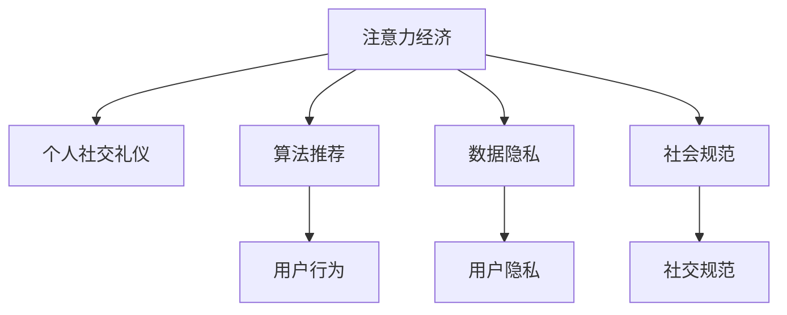

                 

# 注意力经济与个人社交礼仪的演变

在信息技术飞速发展的今天，人们的生活方式正在发生深刻的变化。尤其是社交媒体的普及，使得个人与个人、个人与组织之间的互动变得前所未有的频繁和复杂。这一现象不仅深刻影响了经济活动，还推动了社会交往形式和内容的变化。本文将探讨注意力经济在个人社交礼仪中的演变，分析其背后的原理和机制，并为未来的发展和实践提供见解。

## 1. 背景介绍

### 1.1 问题由来

随着社交媒体的普及，人们获取和传播信息的方式发生了根本变化。传统的信息传播是基于媒体和渠道的，而现代的社交媒体则是以个体为中心的。这种变化使得注意力成为了一种稀缺资源，个体之间的社交互动也随之演变为一场注意力争夺战。这种现象被称为“注意力经济”，即以争夺和分配用户注意力为目标的经济模式。

### 1.2 问题核心关键点

注意力经济的核心在于如何高效地吸引和保持用户的注意力，从而在竞争激烈的市场中占据有利地位。在社交媒体中，个体如何展示自我、如何建立社交网络、如何与他人互动，都受到注意力经济的深刻影响。个人社交礼仪也随之演变成了吸引注意力的重要手段。

### 1.3 问题研究意义

理解注意力经济在个人社交礼仪中的演变，不仅有助于揭示社交媒体对个体行为的深刻影响，还能为社交媒体的运营者、广告主以及普通用户提供有价值的指导。通过深入分析注意力经济背后的原理和机制，我们可以更好地把握社交媒体的发展趋势，制定更有效的社交策略。

## 2. 核心概念与联系

### 2.1 核心概念概述

为了更好地理解注意力经济在个人社交礼仪中的演变，本文将介绍几个核心概念：

- **注意力经济**：指以吸引和分配用户注意力为核心的经济模式。在社交媒体中，个体和组织通过各种方式争夺用户的关注和参与，以实现商业和社交目标。
- **个人社交礼仪**：指在社交媒体中，个体展示自我、建立社交网络、与他人互动的行为规范和技巧。这些礼仪不仅是文化传统的一部分，更是现代社交媒体中的“游戏规则”。
- **算法推荐**：指社交媒体平台通过机器学习算法，根据用户的兴趣和行为数据，推荐个性化内容的技术。算法推荐直接影响用户的注意力分配，从而影响个体的社交行为。
- **数据隐私**：指用户在社交媒体上分享的信息和行为数据。数据隐私保护不仅是用户权益的重要保障，也是社交媒体平台可持续发展的关键。
- **社会规范**：指在社交媒体中，个体和群体共同遵守的行为规范。这些规范不仅影响个体的社交行为，还塑造了社交媒体生态。

这些概念之间的逻辑关系可以通过以下Mermaid流程图来展示：



这个流程图展示了注意力经济与个人社交礼仪的紧密联系，以及算法推荐、数据隐私和社会规范等关键因素的影响。

## 3. 核心算法原理 & 具体操作步骤

### 3.1 算法原理概述

注意力经济在个人社交礼仪中的演变，主要受到算法推荐和社交网络结构的影响。以下是对这些原理的详细分析：

**算法推荐**：
- **原理**：算法推荐系统通过机器学习算法，分析用户的兴趣和行为数据，从而推荐个性化的内容。在社交媒体中，算法推荐直接影响用户的注意力分配，从而影响个体的社交行为。
- **操作步骤**：
  1. 数据收集：收集用户的历史行为数据，包括点赞、评论、分享等。
  2. 特征工程：提取用户的行为特征，如兴趣、偏好、时间、位置等。
  3. 模型训练：使用机器学习算法，训练推荐模型。
  4. 推荐展示：根据用户的兴趣和行为数据，推荐个性化的内容。

**社交网络结构**：
- **原理**：社交网络的结构和互动方式，直接影响用户注意力分配和社交行为。结构洞、强关系、弱关系等概念，都在不同程度上影响个体在社交媒体中的行为。
- **操作步骤**：
  1. 网络分析：分析社交网络的结构，识别关键节点和关系。
  2. 互动设计：设计社交互动方式，引导用户生成有价值的内容。
  3. 关系维护：维护社交关系，增强用户粘性。

### 3.2 算法步骤详解

#### 3.2.1 数据收集

在社交媒体中，数据收集是算法推荐的基础。数据收集可以分为以下步骤：

1. **行为数据**：收集用户的行为数据，包括点赞、评论、分享等。这些数据反映了用户的兴趣和行为模式。
2. **内容数据**：收集用户发布的内容，包括文本、图片、视频等。这些数据用于训练推荐模型，提取用户兴趣特征。
3. **社交数据**：收集用户的社交关系数据，包括好友、粉丝、关注者等。这些数据用于分析社交网络结构，识别关键节点。

#### 3.2.2 特征工程

特征工程是将原始数据转换为模型能够理解的形式。在社交媒体中，特征工程包括：

1. **兴趣提取**：从用户的行为数据和内容数据中提取用户的兴趣特征，如偏好、关键词、主题等。
2. **关系特征**：从用户的社交数据中提取关系特征，如强关系、弱关系、社交圈层等。
3. **时间特征**：提取用户行为的时间特征，如发布时间、互动时间等。

#### 3.2.3 模型训练

模型训练是算法推荐的核心步骤。在社交媒体中，常用的推荐模型包括协同过滤、矩阵分解、深度学习等。这些模型通过分析用户的行为数据和内容数据，学习用户兴趣特征，预测用户的个性化需求。

#### 3.2.4 推荐展示

推荐展示是将算法推荐的结果展示给用户的过程。在社交媒体中，推荐展示可以有多种形式：

1. **动态更新**：根据用户行为实时更新推荐内容，保持个性化和新鲜度。
2. **多元展示**：在内容展示中，综合考虑文本、图片、视频等多样性，满足不同用户的需求。
3. **互动引导**：设计互动形式，如点赞、评论、分享等，增加用户参与度。

### 3.3 算法优缺点

#### 3.3.1 算法优点

算法推荐具有以下优点：
1. **个性化高**：能够根据用户兴趣和行为数据，推荐个性化的内容，提高用户体验。
2. **效率高**：通过自动化处理，能够快速响应用户需求，提高运营效率。
3. **数据驱动**：基于数据驱动，能够不断优化推荐效果，适应用户需求变化。

#### 3.3.2 算法缺点

算法推荐也存在以下缺点：
1. **数据依赖**：对数据质量和数量的依赖较大，数据偏差可能导致推荐偏差。
2. **隐私问题**：大量收集用户数据，可能涉及隐私问题，用户隐私保护成为一大挑战。
3. **依赖模型**：推荐效果受模型性能和算法策略的影响较大，模型的选择和优化成为关键。

### 3.4 算法应用领域

注意力经济在个人社交礼仪中的应用，已经渗透到各个领域：

- **电子商务**：通过算法推荐，电商平台能够向用户推荐个性化商品，提高转化率和销售额。
- **内容平台**：社交媒体平台通过算法推荐，引导用户生成有价值的内容，增加平台活跃度。
- **广告营销**：广告主通过算法推荐，将广告投放给最有可能转化的用户，提高广告效果。
- **社交网络**：社交网络通过算法推荐，增强用户粘性和互动，构建良好的社交生态。
- **在线教育**：在线教育平台通过算法推荐，向用户推荐个性化课程和内容，提升学习效果。

## 4. 数学模型和公式 & 详细讲解 & 举例说明

### 4.1 数学模型构建

在社交媒体中，算法推荐模型通常基于协同过滤、矩阵分解、深度学习等技术。以下是一个简单的协同过滤推荐模型的数学模型：

$$
\hat{y} = \alpha \cdot \text{similarity}(X_i, X_j) \cdot \text{rating}_j + (1-\alpha) \cdot \bar{r} + \beta \cdot f(x)
$$

其中，$X_i$ 和 $X_j$ 分别表示用户 $i$ 和商品 $j$ 的特征向量；$\alpha$、$\beta$ 为调节参数；$\text{similarity}$ 表示用户 $i$ 和商品 $j$ 的相似度；$\text{rating}_j$ 表示用户 $j$ 对商品的评分；$\bar{r}$ 表示平均评分；$f(x)$ 表示其他特征的函数。

### 4.2 公式推导过程

#### 4.2.1 协同过滤模型

协同过滤模型是一种基于用户-商品交互数据的推荐模型。其基本思想是，根据用户 $i$ 对商品 $j$ 的评分数据，找到与用户 $i$ 相似的其他用户 $k$，预测用户 $i$ 对商品 $j$ 的评分。

协同过滤模型的推导过程如下：

1. **相似度计算**：计算用户 $i$ 和商品 $j$ 的相似度，常用方法包括余弦相似度、皮尔逊相关系数等。
2. **评分预测**：根据相似度计算结果，预测用户 $i$ 对商品 $j$ 的评分。
3. **评分校正**：根据预测评分和其他因素，进行评分校正和归一化。

#### 4.2.2 矩阵分解模型

矩阵分解模型是一种基于矩阵分解的推荐模型。其基本思想是，将用户-商品评分矩阵分解为用户特征矩阵和商品特征矩阵，从而进行推荐。

矩阵分解模型的推导过程如下：

1. **矩阵分解**：将用户-商品评分矩阵 $R$ 分解为用户特征矩阵 $U$ 和商品特征矩阵 $V$，即 $R = U \times V$。
2. **特征预测**：根据用户特征矩阵 $U$ 和商品特征矩阵 $V$，预测用户 $i$ 对商品 $j$ 的评分。
3. **评分校正**：根据预测评分和其他因素，进行评分校正和归一化。

#### 4.2.3 深度学习模型

深度学习模型是一种基于神经网络的推荐模型。其基本思想是，利用神经网络对用户行为数据和内容数据进行特征提取和建模，进行推荐。

深度学习模型的推导过程如下：

1. **特征提取**：利用神经网络对用户行为数据和内容数据进行特征提取。
2. **评分预测**：根据提取的特征，预测用户 $i$ 对商品 $j$ 的评分。
3. **评分校正**：根据预测评分和其他因素，进行评分校正和归一化。

### 4.3 案例分析与讲解

#### 4.3.1 协同过滤模型案例

以亚马逊推荐系统为例，其推荐模型基于协同过滤算法。亚马逊收集了大量用户对商品的评分数据，通过对这些数据的分析，计算用户和商品的相似度，从而进行推荐。

亚马逊的推荐系统分为显式反馈推荐和隐式反馈推荐两种。显式反馈推荐基于用户对商品的显式评分，隐式反馈推荐则基于用户的行为数据，如浏览、加入购物车等。通过这两种方法，亚马逊能够向用户推荐个性化商品，提高用户满意度和销售额。

#### 4.3.2 矩阵分解模型案例

以Netflix推荐系统为例，其推荐模型基于矩阵分解算法。Netflix收集了大量用户对电影的评分数据，通过对这些数据的分析，将用户-电影评分矩阵分解为用户特征矩阵和电影特征矩阵，从而进行推荐。

Netflix的推荐系统利用矩阵分解算法，预测用户对未评分电影的评分。通过这些预测评分，Netflix能够向用户推荐个性化电影，提高用户满意度和观看时长。

#### 4.3.3 深度学习模型案例

以YouTube推荐系统为例，其推荐模型基于深度学习算法。YouTube收集了大量用户的行为数据和视频内容数据，利用神经网络对这些数据进行特征提取和建模，进行推荐。

YouTube的推荐系统利用深度学习算法，预测用户对视频的偏好。通过这些预测，YouTube能够向用户推荐个性化视频，提高用户满意度和观看时长。

## 5. 项目实践：代码实例和详细解释说明

### 5.1 开发环境搭建

在进行算法推荐实践前，我们需要准备好开发环境。以下是使用Python进行TensorFlow和PyTorch开发的环境配置流程：

1. 安装Anaconda：从官网下载并安装Anaconda，用于创建独立的Python环境。

2. 创建并激活虚拟环境：
```bash
conda create -n pytorch-env python=3.8 
conda activate pytorch-env
```

3. 安装PyTorch：根据CUDA版本，从官网获取对应的安装命令。例如：
```bash
conda install pytorch torchvision torchaudio cudatoolkit=11.1 -c pytorch -c conda-forge
```

4. 安装TensorFlow：根据GPU版本，从官网获取对应的安装命令。例如：
```bash
conda install tensorflow -c pytorch -c conda-forge
```

5. 安装各类工具包：
```bash
pip install numpy pandas scikit-learn matplotlib tqdm jupyter notebook ipython
```

完成上述步骤后，即可在`pytorch-env`环境中开始推荐系统实践。

### 5.2 源代码详细实现

下面以协同过滤推荐系统为例，给出使用TensorFlow和PyTorch进行推荐系统开发的代码实现。

首先，定义协同过滤推荐系统的模型：

```python
import tensorflow as tf

class CollaborativeFilteringModel(tf.keras.Model):
    def __init__(self, num_users, num_items, embed_size, learning_rate):
        super(CollaborativeFilteringModel, self).__init__()
        self.num_users = num_users
        self.num_items = num_items
        self.embed_size = embed_size
        self.learning_rate = learning_rate
        
        self.user_embeddings = tf.keras.layers.Embedding(num_users, embed_size)
        self.item_embeddings = tf.keras.layers.Embedding(num_items, embed_size)
        
        self.dot_product = tf.keras.layers.Dot(axes=[1, 1], normalize=True)
        self.fc1 = tf.keras.layers.Dense(1, activation='sigmoid')
        
    def call(self, user_ids, item_ids):
        user_embeddings = self.user_embeddings(user_ids)
        item_embeddings = self.item_embeddings(item_ids)
        
        dot_product = self.dot_product([user_embeddings, item_embeddings])
        scores = self.fc1(dot_product)
        
        return scores
```

然后，定义推荐系统的训练和评估函数：

```python
from sklearn.metrics import mean_squared_error
from tensorflow.keras.optimizers import Adam

def train_model(model, data, batch_size, epochs, learning_rate):
    train_data, val_data, test_data = data
    
    model.compile(optimizer=Adam(learning_rate=learning_rate), loss='mse')
    
    for epoch in range(epochs):
        for user_ids, item_ids, ratings in train_data:
            model.train_on_batch(user_ids, item_ids, ratings)
        
        val_scores = model.predict(val_data)
        val_mse = mean_squared_error(val_data.ratings, val_scores)
        print(f'Epoch {epoch+1}, val MSE: {val_mse:.4f}')
    
    test_scores = model.predict(test_data)
    test_mse = mean_squared_error(test_data.ratings, test_scores)
    print(f'Test MSE: {test_mse:.4f}')
```

最后，启动训练流程并在测试集上评估：

```python
num_users = 1000
num_items = 1000
embed_size = 100
learning_rate = 0.001

train_data = (user_ids, item_ids, ratings)
val_data = (val_user_ids, val_item_ids, val_ratings)
test_data = (test_user_ids, test_item_ids, test_ratings)

model = CollaborativeFilteringModel(num_users, num_items, embed_size, learning_rate)
train_model(model, data, batch_size=64, epochs=10, learning_rate=0.001)
```

以上就是使用TensorFlow和PyTorch进行协同过滤推荐系统开发的完整代码实现。可以看到，TensorFlow和PyTorch提供了丰富的工具和库，可以方便地实现复杂的推荐系统。

### 5.3 代码解读与分析

让我们再详细解读一下关键代码的实现细节：

**CollaborativeFilteringModel类**：
- `__init__`方法：初始化模型参数和结构，包括用户嵌入、商品嵌入、点积层和全连接层。
- `call`方法：定义模型的前向传播过程，包括用户嵌入、商品嵌入、点积计算和输出层。

**train_model函数**：
- 定义模型编译，指定损失函数和优化器。
- 循环迭代训练数据，进行模型训练。
- 在验证集上评估模型，输出验证误差。
- 在测试集上评估模型，输出测试误差。

**训练流程**：
- 定义模型参数，包括用户数量、商品数量、嵌入维度和学习率。
- 创建数据集，包括训练集、验证集和测试集。
- 创建模型对象，进行训练。
- 在训练过程中，输出验证误差和测试误差，监控模型性能。

## 6. 实际应用场景

### 6.1 社交媒体推荐

社交媒体平台如Facebook、Instagram、Twitter等，通过算法推荐技术，向用户推荐个性化的内容。用户通过点赞、评论、分享等行为，与推荐内容进行互动，从而形成更加活跃和丰富的社交生态。

在推荐过程中，社交媒体平台通过算法推荐，将用户对内容的互动信息反馈给算法，不断优化推荐策略，提高用户满意度和平台活跃度。用户也可以通过算法推荐，发现更多与自己兴趣相符的内容，扩大社交圈层，提升社交体验。

### 6.2 电商平台推荐

电商平台如亚马逊、淘宝、京东等，通过算法推荐技术，向用户推荐个性化的商品。用户通过浏览、购买、评价等行为，与推荐商品进行互动，从而形成更加精准和有效的购物体验。

在推荐过程中，电商平台通过算法推荐，将用户对商品的互动信息反馈给算法，不断优化推荐策略，提高转化率和销售额。用户也可以通过算法推荐，发现更多符合自己需求的商品，提升购物体验。

### 6.3 视频平台推荐

视频平台如YouTube、Netflix等，通过算法推荐技术，向用户推荐个性化的视频。用户通过观看、点赞、分享等行为，与推荐视频进行互动，从而形成更加丰富和多元的视频体验。

在推荐过程中，视频平台通过算法推荐，将用户对视频内容的互动信息反馈给算法，不断优化推荐策略，提高用户观看时长和平台活跃度。用户也可以通过算法推荐，发现更多符合自己兴趣的视频，提升视频体验。

### 6.4 未来应用展望

随着算法推荐技术的发展，未来将会有更多应用场景得到推广：

- **智能家居**：智能家居设备通过算法推荐，向用户推荐个性化的内容和控制指令，提升用户体验和生活质量。
- **健康医疗**：医疗机构通过算法推荐，向患者推荐个性化的治疗方案和健康管理内容，提升诊疗效果和患者体验。
- **金融服务**：金融机构通过算法推荐，向用户推荐个性化的金融产品和服务，提升用户满意度和平台粘性。
- **旅游出行**：旅游平台通过算法推荐，向用户推荐个性化的旅游路线和景点，提升用户旅行体验和平台收入。
- **教育培训**：教育平台通过算法推荐，向用户推荐个性化的学习内容和课程，提升学习效果和平台活跃度。

## 7. 工具和资源推荐

### 7.1 学习资源推荐

为了帮助开发者系统掌握算法推荐的技术基础和实践技巧，这里推荐一些优质的学习资源：

1. **《推荐系统实战》**：由Google工程师撰写，详细介绍了推荐系统的算法、数据和实现。
2. **Coursera《推荐系统》课程**：由斯坦福大学教授授课，讲解推荐系统的基本概念和常用算法。
3. **Kaggle推荐系统竞赛**：参加Kaggle推荐系统竞赛，实践推荐算法的开发和优化。
4. **深度学习在推荐系统中的应用**：深度学习技术的引入，为推荐系统带来了新的发展方向。
5. **TensorFlow官方文档**：TensorFlow提供详细的推荐系统开发教程和样例代码。

通过对这些资源的学习实践，相信你一定能够快速掌握算法推荐的核心原理和实践技巧，用于解决实际的推荐问题。

### 7.2 开发工具推荐

高效的开发离不开优秀的工具支持。以下是几款用于算法推荐开发的常用工具：

1. **TensorFlow**：由Google主导开发的深度学习框架，支持动态图和静态图，适用于复杂的推荐系统开发。
2. **PyTorch**：由Facebook主导开发的深度学习框架，支持动态图，适用于快速的算法实验和原型开发。
3. **Scikit-learn**：Python科学计算库，提供丰富的机器学习算法和工具，适用于简单的推荐系统开发。
4. **Jupyter Notebook**：Python交互式开发环境，支持代码、数据、文档的混合展示，便于团队协作和知识共享。
5. **Git**：版本控制系统，支持多人协作开发，方便代码管理和版本控制。

合理利用这些工具，可以显著提升算法推荐任务的开发效率，加快创新迭代的步伐。

### 7.3 相关论文推荐

算法推荐技术的发展源于学界的持续研究。以下是几篇奠基性的相关论文，推荐阅读：

1. **《推荐系统中的协同过滤》**：详细介绍了协同过滤推荐系统的基本原理和应用。
2. **《矩阵分解技术在推荐系统中的应用》**：介绍了矩阵分解推荐系统的基本原理和算法实现。
3. **《深度学习在推荐系统中的应用》**：探讨了深度学习在推荐系统中的创新应用。
4. **《用户兴趣模型在推荐系统中的应用》**：介绍了基于用户兴趣模型的推荐系统。
5. **《基于对抗学习的推荐系统》**：研究了对抗学习在推荐系统中的应用，提升推荐系统的鲁棒性和安全性。

这些论文代表了大数据推荐技术的进展脉络。通过学习这些前沿成果，可以帮助研究者把握技术发展方向，激发更多的创新灵感。

## 8. 总结：未来发展趋势与挑战

### 8.1 总结

本文对算法推荐在个人社交礼仪中的应用进行了全面系统的介绍。首先阐述了算法推荐在社交媒体中的演变过程，明确了其背后的原理和机制。其次，从原理到实践，详细讲解了协同过滤、矩阵分解和深度学习等推荐算法的数学原理和关键步骤，给出了推荐系统开发的完整代码实例。同时，本文还广泛探讨了推荐系统在社交媒体、电商平台、视频平台等多个领域的应用前景，展示了算法推荐技术的广阔应用空间。

通过本文的系统梳理，可以看到，算法推荐技术已经成为社交媒体中的重要手段，极大地改变了用户的社交行为和体验。随着推荐系统的不断发展和优化，未来将会有更多应用场景得到推广，为人们的日常生活和工作带来新的便利和价值。

### 8.2 未来发展趋势

展望未来，算法推荐技术将呈现以下几个发展趋势：

1. **个性化程度更高**：通过深度学习和大数据技术，算法推荐将能够更好地理解用户需求，提供更加个性化的推荐内容。
2. **多样性更丰富**：通过多元推荐算法和多模态数据融合，算法推荐将能够提供更加多样化的内容推荐。
3. **实时性更强**：通过实时数据流处理和算法优化，算法推荐将能够更快地响应用户需求，提供更加及时的推荐内容。
4. **可解释性更好**：通过可解释性算法和可视化工具，算法推荐将能够提供更加透明和可解释的推荐过程。
5. **安全性更高**：通过隐私保护和对抗学习技术，算法推荐将能够更好地保护用户隐私和数据安全。

以上趋势凸显了算法推荐技术的广泛应用前景，这些方向的探索发展，必将进一步提升推荐系统的性能和用户体验，为智能生活带来新的可能性。

### 8.3 面临的挑战

尽管算法推荐技术已经取得了瞩目成就，但在推广应用的过程中，仍面临诸多挑战：

1. **数据隐私保护**：大量收集用户数据，可能涉及隐私问题，用户隐私保护成为一大挑战。
2. **模型鲁棒性不足**：推荐系统面对数据偏差和噪音时，泛化性能往往大打折扣，如何提高模型鲁棒性，避免过拟合，是重要的研究方向。
3. **计算资源消耗**：推荐系统涉及大量的数据处理和模型训练，对计算资源的需求较高，如何优化计算效率，降低资源消耗，是重要的优化方向。
4. **推荐效果可解释性差**：推荐系统的决策过程通常缺乏可解释性，难以对其推理逻辑进行分析和调试，如何赋予推荐系统更强的可解释性，将是亟待攻克的难题。
5. **对抗攻击和模型安全性**：推荐系统可能面临对抗攻击，如何提高模型安全性，保障系统稳定运行，是重要的研究方向。

正视推荐系统面临的这些挑战，积极应对并寻求突破，将是推荐系统技术走向成熟的必由之路。相信随着学界和产业界的共同努力，这些挑战终将一一被克服，推荐系统必将在构建智能生活的过程中扮演越来越重要的角色。

### 8.4 研究展望

面对算法推荐所面临的种种挑战，未来的研究需要在以下几个方面寻求新的突破：

1. **隐私保护技术**：开发更高效的隐私保护技术，保护用户隐私和数据安全。
2. **对抗学习技术**：研究对抗学习技术，提高推荐系统的鲁棒性和安全性。
3. **可解释性算法**：引入可解释性算法，增强推荐系统的透明性和可理解性。
4. **多模态融合技术**：将不同模态的数据进行融合，提升推荐系统的多样性和准确性。
5. **实时处理技术**：研究实时处理技术，提高推荐系统的响应速度和实时性。

这些研究方向的探索，必将引领推荐系统技术迈向更高的台阶，为构建智能生活带来新的突破和创新。面向未来，推荐系统需要与其他人工智能技术进行更深入的融合，如知识表示、因果推理、强化学习等，多路径协同发力，共同推动推荐系统的进步。只有勇于创新、敢于突破，才能不断拓展推荐系统的边界，让智能推荐更好地服务于人们的日常生活和工作。

## 9. 附录：常见问题与解答

**Q1：推荐系统如何处理冷启动问题？**

A: 冷启动问题指新用户或新商品加入推荐系统时，缺乏足够的历史行为数据，无法进行推荐。推荐系统通常有以下几种处理方式：

1. **基于内容的推荐**：根据商品的特征和属性，推荐与新商品相似的商品。
2. **基于用户兴趣的推荐**：根据新用户的兴趣标签，推荐与用户兴趣相似的商品。
3. **基于协同过滤的推荐**：利用其他用户对新商品的行为数据，推荐与新商品相似的商品。

**Q2：推荐系统如何应对用户偏好变化？**

A: 用户偏好可能随时间变化，推荐系统需要及时更新推荐策略，应对用户偏好变化。推荐系统通常有以下几种应对方式：

1. **动态模型**：使用动态模型，根据用户行为数据和历史推荐记录，实时更新推荐策略。
2. **迭代优化**：定期进行模型迭代优化，根据新数据和新反馈，不断提升推荐效果。
3. **个性化推荐**：根据用户偏好变化，调整个性化推荐策略，提升用户满意度和推荐效果。

**Q3：推荐系统如何处理多样性和新颖性？**

A: 推荐系统需要平衡推荐内容的多样性和新颖性，避免用户对同质化内容的长期关注。推荐系统通常有以下几种处理方式：

1. **多样性控制**：通过多样性控制技术，限制相似内容的推荐数量，增加推荐内容的多样性。
2. **新颖性挖掘**：通过新颖性挖掘技术，推荐用户未曾见过的内容，增加推荐内容的丰富度。
3. **交互式推荐**：通过交互式推荐技术，根据用户反馈，动态调整推荐内容，提升推荐效果。

**Q4：推荐系统如何提高推荐效果？**

A: 推荐系统可以通过以下几种方式提高推荐效果：

1. **数据质量优化**：提高数据质量，减少数据偏差和噪音，提升推荐模型的性能。
2. **模型优化**：优化推荐模型，引入更先进的技术，如深度学习、对抗学习等。
3. **算法多样化**：使用多种推荐算法，提高推荐效果和系统鲁棒性。
4. **实时反馈**：引入实时反馈机制，根据用户行为实时调整推荐策略，提高推荐效果。
5. **多模态融合**：将不同模态的数据进行融合，提升推荐系统的多样性和准确性。

通过这些改进，可以显著提升推荐系统的性能和用户体验，让推荐系统更好地服务于人们的日常生活和工作。

---

作者：禅与计算机程序设计艺术 / Zen and the Art of Computer Programming

